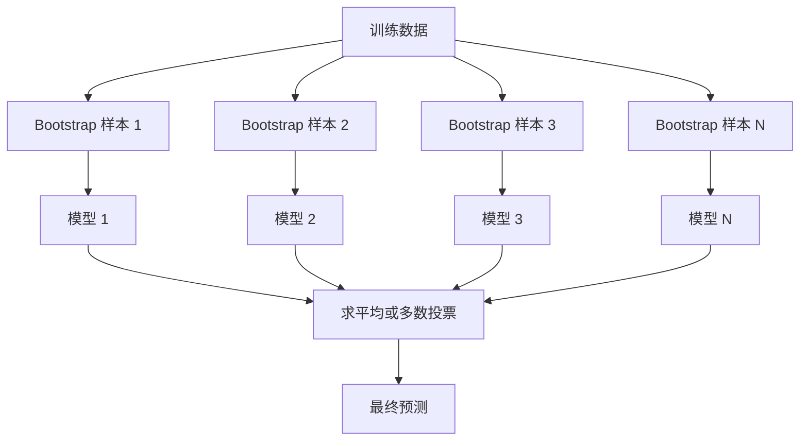
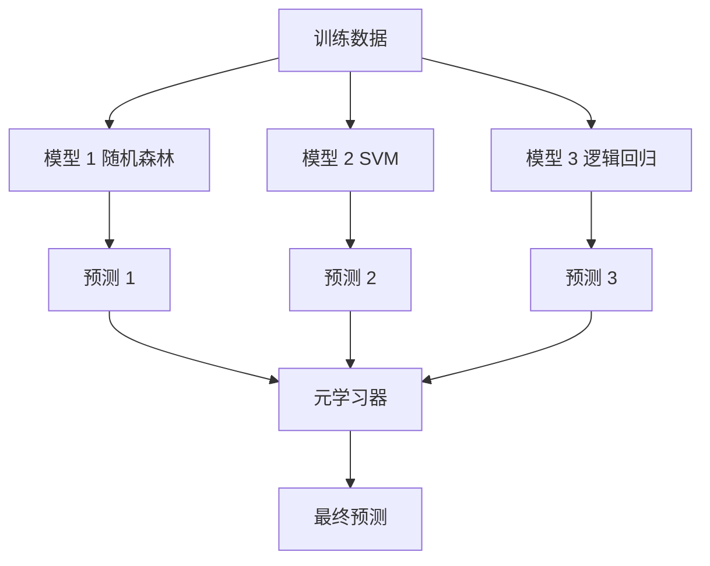

# 集成方法（Ensemble Methods）

> 译注：本文译自同目录 [`en.md`](./en.md)。术语遵循仓根 [TRANSLATION_GUIDE.md](../../../../TRANSLATION_GUIDE.md)。

> 一群弱学习器（weak learner），只要组合得当，就会变成一个强学习器（strong learner）。这不是比喻，这是一个定理。

**Type:** Build
**Language:** Python
**Prerequisites:** Phase 2, Lesson 10 (Bias-Variance Tradeoff)
**Time:** ~120 minutes

## 学习目标（Learning Objectives）

- 从零实现 AdaBoost 和 gradient boosting，并解释 boosting 是如何顺序地降低 bias（偏差）的
- 构建一个 bagging 集成，演示如何通过对去相关的模型取平均来降低 variance（方差）而不增加 bias
- 比较 bagging、boosting 和 stacking，分别看它们针对的是误差的哪个组成部分
- 评估集成的多样性（diversity），并解释为什么独立的弱学习器越多，多数投票的准确率就越高

## 问题（The Problem）

单棵决策树训练快、易解释，但容易过拟合。单个线性模型在复杂边界上又会欠拟合。你可以花上好几天去精雕细琢一个完美的模型架构，也可以把一堆不完美的模型组合起来，得到比其中任何一个都更好的结果。

集成方法（ensemble methods）做的正是后者。它是 Kaggle 表格数据竞赛里最可靠的取胜手段，是大多数生产 ML 系统背后的引擎，也是 bias-variance tradeoff（偏差-方差权衡）的活教材。Bagging 降低 variance，boosting 降低 bias，stacking 则学习在不同输入上该信任哪个模型。

## 概念（The Concept）

### 集成为什么有效（Why Ensembles Work）

假设你有 N 个相互独立的分类器，每个的准确率 p > 0.5，那么多数投票的准确率为：

```
P(majority correct) = sum over k > N/2 of C(N,k) * p^k * (1-p)^(N-k)
```

21 个准确率 60% 的分类器，多数投票准确率约为 74%；101 个时升到 84%。模型犯不同的错时，错误就互相抵消了。

关键前提是 **diversity（多样性）**。如果所有模型都犯一样的错，把它们组合起来毫无意义。集成之所以有效，是因为它通过以下方式产出多样化的模型：

- 不同的训练子集（bagging）
- 不同的特征子集（random forest）
- 顺序的错误纠正（boosting）
- 不同的模型族（stacking）

### Bagging（Bootstrap Aggregating，自助聚合）

Bagging 通过在训练数据的不同 bootstrap 样本上训练每个模型来制造多样性。



Bootstrap 样本是从原始数据中**有放回**抽取的，大小与原数据相同。每次 bootstrap 中大约会出现 63.2% 的不重复样本，剩下 36.8% 没被抽到的（out-of-bag 样本）天然就是一个免费的验证集。

Bagging 主要降低 variance，不太会增加 bias。每棵树都会在自己的 bootstrap 样本上过拟合，但每棵树过拟合的方式不同，所以平均之后噪声就被抵消了。

**Random forest（随机森林）** 是 bagging 再加一层花样：每次分裂时只考虑特征的一个随机子集。这迫使树之间更加多样化。常用的候选特征数为：分类用 `sqrt(n_features)`，回归用 `n_features / 3`。

### Boosting（顺序错误纠正）

Boosting 顺序地训练模型，每个新模型都聚焦在前面模型搞错的样本上。


Boosting 降低 bias。每个新模型都在纠正当前集成的系统性误差。最终预测是所有模型的加权和，更好的模型权重更高。

代价是：boosting 跑太多轮可能过拟合，因为它会一直去拟合越来越难的样本，而其中有些可能本身就是噪声。

### AdaBoost

AdaBoost（Adaptive Boosting，自适应提升）是第一个实用的 boosting 算法。它能搭配任意基学习器使用，最常见的是 decision stump（深度为 1 的决策树）。

算法：

```
1. Initialize sample weights: w_i = 1/N for all i

2. For t = 1 to T:
   a. Train weak learner h_t on weighted data
   b. Compute weighted error:
      err_t = sum(w_i * I(h_t(x_i) != y_i)) / sum(w_i)
   c. Compute model weight:
      alpha_t = 0.5 * ln((1 - err_t) / err_t)
   d. Update sample weights:
      w_i = w_i * exp(-alpha_t * y_i * h_t(x_i))
   e. Normalize weights to sum to 1

3. Final prediction: H(x) = sign(sum(alpha_t * h_t(x)))
```

误差越低的模型获得越高的 alpha。被错分的样本权重提升，下一个模型就会重点关注它们。

### Gradient Boosting（梯度提升）

Gradient boosting 把 boosting 推广到任意损失函数。它不再调整样本权重，而是让每个新模型去拟合当前集成的残差（损失的负梯度）。

```
1. Initialize: F_0(x) = argmin_c sum(L(y_i, c))

2. For t = 1 to T:
   a. Compute pseudo-residuals:
      r_i = -dL(y_i, F_{t-1}(x_i)) / dF_{t-1}(x_i)
   b. Fit a tree h_t to the residuals r_i
   c. Find optimal step size:
      gamma_t = argmin_gamma sum(L(y_i, F_{t-1}(x_i) + gamma * h_t(x_i)))
   d. Update:
      F_t(x) = F_{t-1}(x) + learning_rate * gamma_t * h_t(x)

3. Final prediction: F_T(x)
```

对平方误差损失而言，伪残差就是真实残差：`r_i = y_i - F_{t-1}(x_i)`。每棵树直接拟合上一轮集成的误差。

learning rate（学习率，又叫 shrinkage）控制每棵树的贡献。学习率越小，需要的树越多，但泛化越好。常用范围：0.01 到 0.3。

### XGBoost：为什么它统治了表格数据

XGBoost（eXtreme Gradient Boosting）是带工程优化的 gradient boosting，让它跑得快、准且抗过拟合：

- **正则化的目标函数（Regularized objective）：** 在叶子权重上加 L1 和 L2 惩罚，防止单棵树过于自信
- **二阶近似（Second-order approximation）：** 同时使用损失的一阶和二阶导数，让分裂决策更优
- **稀疏感知分裂（Sparsity-aware splits）：** 在每次分裂时学习缺失值应该走哪个方向，原生处理缺失数据
- **列采样（Column subsampling）：** 像 random forest 一样，每次分裂采样特征以增加多样性
- **加权分位数草图（Weighted quantile sketch）：** 在分布式数据上高效地为连续特征找分裂点
- **缓存友好的块结构（Cache-aware block structure）：** 内存布局针对 CPU 缓存行优化

在表格数据上，XGBoost（以及它的继任者 LightGBM）一直稳定地胜过神经网络。这件事短期内不会改变。如果你的数据是行列结构的表，先从 gradient boosting 开始。

### Stacking（元学习，Meta-Learning）

Stacking 把多个基模型的预测当作特征，喂给一个元学习器（meta-learner）。



元学习器学的是在哪种输入上该信任哪个基模型。如果 random forest 在某些区域更准，SVM 在另一些区域更准，元学习器就会学会按区域路由。

为了避免数据泄漏，基模型的预测必须通过对训练集做交叉验证（cross-validation）来生成。绝对不能在同一份数据上既训练基模型又生成元特征。

### Voting（投票）

最简单的集成。直接组合预测就行。

- **Hard voting（硬投票）：** 在类别标签上做多数投票。
- **Soft voting（软投票）：** 对预测概率求平均，取平均概率最高的类。通常更好，因为它利用了置信度信息。

## 动手实现（Build It）

### 第 1 步：Decision Stump（基学习器）

`code/ensembles.py` 里的代码是从零实现的。我们从 decision stump 开始：只有一次分裂的树。

```python
class DecisionStump:
    def __init__(self):
        self.feature_idx = None
        self.threshold = None
        self.polarity = 1
        self.alpha = None

    def fit(self, X, y, weights):
        n_samples, n_features = X.shape
        best_error = float("inf")

        for f in range(n_features):
            thresholds = np.unique(X[:, f])
            for thresh in thresholds:
                for polarity in [1, -1]:
                    pred = np.ones(n_samples)
                    pred[polarity * X[:, f] < polarity * thresh] = -1
                    error = np.sum(weights[pred != y])
                    if error < best_error:
                        best_error = error
                        self.feature_idx = f
                        self.threshold = thresh
                        self.polarity = polarity

    def predict(self, X):
        n = X.shape[0]
        pred = np.ones(n)
        idx = self.polarity * X[:, self.feature_idx] < self.polarity * self.threshold
        pred[idx] = -1
        return pred
```

### 第 2 步：从零实现 AdaBoost

```python
class AdaBoostScratch:
    def __init__(self, n_estimators=50):
        self.n_estimators = n_estimators
        self.stumps = []
        self.alphas = []

    def fit(self, X, y):
        n = X.shape[0]
        weights = np.full(n, 1 / n)

        for _ in range(self.n_estimators):
            stump = DecisionStump()
            stump.fit(X, y, weights)
            pred = stump.predict(X)

            err = np.sum(weights[pred != y])
            err = np.clip(err, 1e-10, 1 - 1e-10)

            alpha = 0.5 * np.log((1 - err) / err)
            weights *= np.exp(-alpha * y * pred)
            weights /= weights.sum()

            stump.alpha = alpha
            self.stumps.append(stump)
            self.alphas.append(alpha)

    def predict(self, X):
        total = sum(a * s.predict(X) for a, s in zip(self.alphas, self.stumps))
        return np.sign(total)
```

### 第 3 步：从零实现 Gradient Boosting

```python
class GradientBoostingScratch:
    def __init__(self, n_estimators=100, learning_rate=0.1, max_depth=3):
        self.n_estimators = n_estimators
        self.lr = learning_rate
        self.max_depth = max_depth
        self.trees = []
        self.initial_pred = None

    def fit(self, X, y):
        self.initial_pred = np.mean(y)
        current_pred = np.full(len(y), self.initial_pred)

        for _ in range(self.n_estimators):
            residuals = y - current_pred
            tree = SimpleRegressionTree(max_depth=self.max_depth)
            tree.fit(X, residuals)
            update = tree.predict(X)
            current_pred += self.lr * update
            self.trees.append(tree)

    def predict(self, X):
        pred = np.full(X.shape[0], self.initial_pred)
        for tree in self.trees:
            pred += self.lr * tree.predict(X)
        return pred
```

### 第 4 步：与 sklearn 对比

代码里会验证我们从零写的实现与 sklearn 的 `AdaBoostClassifier` 和 `GradientBoostingClassifier` 的准确率相近，并把所有方法放在一起做横向对比。

## 用起来（Use It）

### 各方法的适用场景（When to Use Each Method）

| 方法 | 主要降低 | 适用场景 | 注意事项 |
|--------|---------|----------|---------------|
| Bagging / Random Forest | Variance | 噪声多、特征多 | 对 bias 没什么帮助 |
| AdaBoost | Bias | 干净数据，简单基学习器 | 对离群点和噪声敏感 |
| Gradient Boosting | Bias | 表格数据、竞赛 | 训练慢，不调参容易过拟合 |
| XGBoost / LightGBM | 二者皆降 | 生产级表格 ML | 超参数较多 |
| Stacking | 二者皆降 | 抠最后 1-2% 的准确率 | 复杂，元学习器有过拟合风险 |
| Voting | Variance | 快速组合多样化模型 | 只有当模型多样化时才有用 |

### 表格数据的生产栈（The Production Stack for Tabular Data）

对大多数表格预测问题，按这个顺序尝试：

1. 用默认参数跑 **LightGBM 或 XGBoost**
2. 调 n_estimators、learning_rate、max_depth、min_child_weight
3. 如果还要再榨出最后那 0.5%，用 3-5 个多样化模型搭一个 stacking 集成
4. 全程用 cross-validation

虽然学界一直在尝试，但在表格数据上神经网络几乎总是不如 gradient boosting。TabNet、NODE 这些架构偶尔能打平，但很少能赢过一个调好的 XGBoost。

## 上线部署（Ship It）

本节会产出 `outputs/prompt-ensemble-selector.md` —— 一个帮你为给定数据集挑选合适集成方法的 prompt。描述你的数据（规模、特征类型、噪声水平、类别平衡情况）和要解决的问题，prompt 会带你走一遍决策清单，推荐方法、给出起手超参数，并提示该方法的常见坑。同时还会产出 `outputs/skill-ensemble-builder.md`，里面是完整的选择指南。

## 练习（Exercises）

1. 改造 AdaBoost 实现，让它每轮记录一次训练准确率。画出准确率随基学习器数量的变化曲线。多少轮后收敛？

2. 从零实现一个 random forest：在回归树里加上随机特征采样。用 `max_features=sqrt(n_features)` 训练 100 棵树并对预测取平均，比较它和单棵树相比的方差降低效果。

3. 给 gradient boosting 实现加上 early stopping：每轮记录验证损失，连续 10 轮没改善就停止训练。它实际需要多少棵树？

4. 用三种基模型（logistic regression、decision tree、k 近邻）和一个 logistic regression 元学习器搭一个 stacking 集成。用 5 折交叉验证生成元特征，对比单独使用每个基模型的效果。

5. 在同一份数据集上用默认参数跑 XGBoost。把它的准确率和你从零写的 gradient boosting 做对比，并都计时一下，速度差多少？

## 关键术语（Key Terms）

| 术语 | 大家会怎么说 | 真正含义 |
|------|----------------|----------------------|
| Bagging | "在随机子集上训练" | Bootstrap aggregating：在 bootstrap 样本上训练多个模型，对预测求平均以降低 variance |
| Boosting | "聚焦难样本" | 顺序训练多个模型，每个都纠正当前集成的误差，以降低 bias |
| AdaBoost | "重新加权数据" | 通过更新样本权重做 boosting；被错分的点在下一个学习器里权重更高 |
| Gradient boosting | "拟合残差" | 通过让每个新模型拟合损失的负梯度来做 boosting |
| XGBoost | "Kaggle 利器" | 带正则化、二阶优化和系统级提速技巧的 gradient boosting |
| Stacking | "模型套模型" | 用基模型的预测作为元学习器的输入特征 |
| Random forest | "一堆随机化的树" | 用决策树做 bagging，并在每次分裂时加上随机特征采样以增加多样性 |
| Ensemble diversity | "犯不一样的错" | 模型之间的错误必须不相关，集成才能比单个模型更好 |
| Out-of-bag error | "免费的验证" | bootstrap 抽样里没被抽到的样本（约 36.8%）天然就是一个无需留出的验证集 |

## 延伸阅读（Further Reading）

- [Schapire & Freund: Boosting: Foundations and Algorithms](https://mitpress.mit.edu/9780262526036/) —— AdaBoost 作者本人写的书
- [Friedman: Greedy Function Approximation: A Gradient Boosting Machine (2001)](https://statweb.stanford.edu/~jhf/ftp/trebst.pdf) —— gradient boosting 原始论文
- [Chen & Guestrin: XGBoost (2016)](https://arxiv.org/abs/1603.02754) —— XGBoost 论文
- [Wolpert: Stacked Generalization (1992)](https://www.sciencedirect.com/science/article/abs/pii/S0893608005800231) —— stacking 原始论文
- [scikit-learn Ensemble Methods](https://scikit-learn.org/stable/modules/ensemble.html) —— 实操参考
