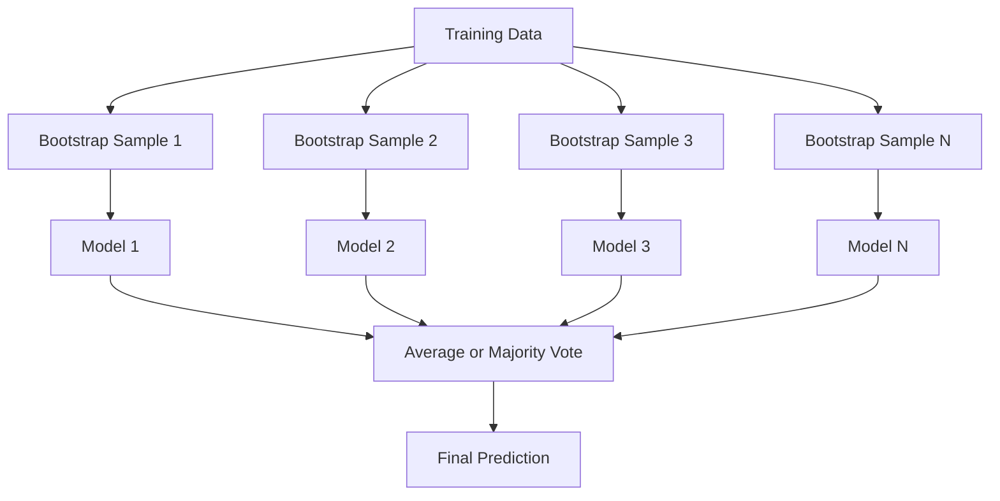
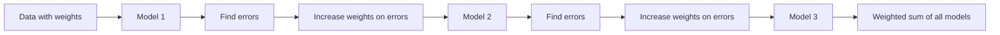
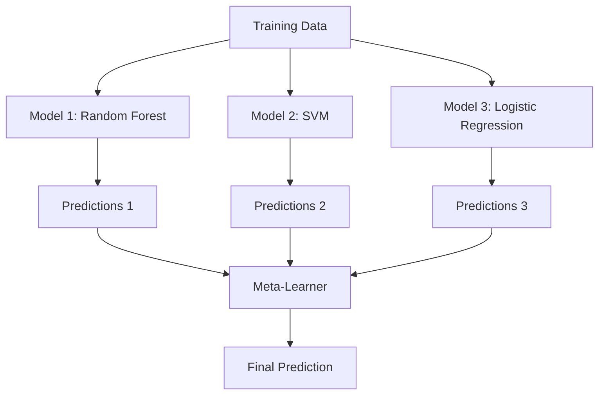

# 集成方法

> 一群弱学习者，正确组合，就会成为强学习者。这不是一个比喻。这是一个定理。

** 类型：** 构建
** 语言：** Python
** 先决条件：** 第2阶段，第10课（偏差方差权衡）
** 时间：** ~120分钟

## 学习目标

- 从头开始实施AdaBoost和梯度增强，并解释增强如何连续减少偏差
- 构建一个打包集成并演示如何平均去相关模型如何在不增加偏差的情况下减少方差
- 根据每种方法针对的错误成分来比较装袋、增强和堆叠
- 评估整体多样性并解释为什么多数投票准确性随着独立的弱学习者而提高

## 问题

单个决策树训练起来很快，而且易于解释，但它过于适合。单一线性模型不适合复杂的边界。您可以花几天的时间设计完美的模型架构。或者您可以将一堆不完美的模型结合起来，并获得比其中任何一个都更好的东西。

注册方法正是做到这一点。它们是赢得基于表格数据的Kaggle竞赛的最可靠的技术，它们为大多数生产ML系统提供动力，并且它们在实际中说明了偏差方差权衡。装袋减少了差异。增强可以减少偏见。堆叠学习在哪些输入上信任哪些模型。

## 概念

### 为什么合奏有效

假设您有N个独立分类器，每个分类器的准确度p > 0.5。多数投票具有准确性：

```
P(majority correct) = sum over k > N/2 of C(N,k) * p^k * (1-p)^(N-k)
```

对于21个分类器，每个分类器的准确率均为60%，多数投票的准确率约为74%。如果有101个分类器，这一比例上升至84%。当模型犯不同错误时，这些错误就会抵消。

关键要求是 ** 多样性 **。如果所有模型都会犯同样的错误，那么将它们组合起来就没有任何帮助。合奏之所以有效，是因为它们通过以下方式产生了不同的模型：

- 不同的训练子集（装袋）
- 不同的特征子集（随机森林）
- 顺序错误纠正（增强）
- 不同的模型族（堆叠）

### 装袋（Bootstrap Aggregating）

Bagging通过在训练数据的不同Bootstrap样本上训练每个模型来创建多样性。



通过替换原始数据绘制引导样本，大小与原始数据相同。大约63.2%的独特样本出现在每个引导程序中。其余36.8%（袋外样本）提供免费验证集。

装袋减少了方差，而不会增加太多偏见。每棵树都过适合其自举样本，但每棵树的过适合是不同的，因此平均值可以抵消噪音。

** 随机森林 ** 有一个额外的转折：在每次拆分时，只考虑特征的随机子集。这迫使树木变得更加多样。候选特征的典型数量为“squtt（n_features）”（用于分类）和“n_features / 3”（用于回归）。

### 提升（顺序错误纠正）

按顺序增强训练模型。每个新模型都关注以前模型出错的例子。



提升可减少偏差。每个新模型都纠正了迄今为止该系统的系统误差。最终的预测是所有模型的加权和，其中更好的模型获得更高的权重。

权衡：如果运行太多轮，增强可能会过度适应，因为它会不断适应更难的例子，其中一些可能是噪音。

### AdaBoost

AdaBoost（自适应增强）是第一个实用的增强算法。它适用于任何基本学习者，通常是决策树（深度1树）。

算法：

```
1. Initialize sample weights: w_i = 1/N for all i

2. For t = 1 to T:
   a. Train weak learner h_t on weighted data
   b. Compute weighted error:
      err_t = sum(w_i * I(h_t(x_i) != y_i)) / sum(w_i)
   c. Compute model weight:
      alpha_t = 0.5 * ln((1 - err_t) / err_t)
   d. Update sample weights:
      w_i = w_i * exp(-alpha_t * y_i * h_t(x_i))
   e. Normalize weights to sum to 1

3. Final prediction: H(x) = sign(sum(alpha_t * h_t(x)))
```

误差较低的模型获得更高的Alpha值。错误分类的样本获得更高的权重，因此下一个模型将重点关注它们。

### 梯度提升

梯度提升将提升推广到任意损失函数。它不是重新加权样本，而是将每个新模型与当前集合的残余（损失的负梯度）相匹配。

```
1. Initialize: F_0(x) = argmin_c sum(L(y_i, c))

2. For t = 1 to T:
   a. Compute pseudo-residuals:
      r_i = -dL(y_i, F_{t-1}(x_i)) / dF_{t-1}(x_i)
   b. Fit a tree h_t to the residuals r_i
   c. Find optimal step size:
      gamma_t = argmin_gamma sum(L(y_i, F_{t-1}(x_i) + gamma * h_t(x_i)))
   d. Update:
      F_t(x) = F_{t-1}(x) + learning_rate * gamma_t * h_t(x)

3. Final prediction: F_T(x)
```

对于平方误差损失，伪残留只是实际残留：' r_i = y_i-F_{t-1}（x_i）'。每棵树实际上都符合前一个集合的错误。

学习率（收缩）控制每棵树的贡献量。较小的学习率需要更多的树，但概括性更好。典型值：0.01至0.3。

### XGboost：为什么它主导表格数据

XGBoost（eXtreme Gradient Boosting）是一种通过工程优化进行的梯度提升，使其快速、准确且抗过度匹配：

- ** 正规化目标：** 对叶子重量的L1和L2惩罚防止个别树木过于自信
- ** 二阶近似：** 使用损失的一阶和二阶导数，提供更好的分割决策
- ** 具有稀疏性的拆分：** 通过学习每次拆分时缺失数据的最佳方向来本地处理缺失值
- ** 列二次采样：** 与随机森林一样，在每个分裂处采样特征以获取多样性
- ** 加权分位数草图：** 有效查找分布式数据上连续要素的分裂点
- ** 高速缓存感知块结构：** 针对中央处理器高速缓存行优化的内存布局

对于表格数据，XGBoost（及其继任者LightGBM）始终优于神经网络。这种情况不会很快改变。如果您的数据适合包含行和列的表，请从梯度提升开始。

### 堆叠（元学习）

堆叠使用多个基本模型的预测作为元学习器的功能。



元学习器学习对于哪些输入信任哪个基本模型。如果随机森林在某些区域更好，而支持者在其他区域更好，则元学习者将学习相应的路线。

为了避免数据泄露，必须通过对训练集的交叉验证生成基本模型预测。您永远不会训练基本模型并在同一数据上生成元特征。

### 投票

最简单的合奏。只需直接结合预测即可。

- ** 硬投票：** 阶级标签上的多数投票。
- ** 软投票：** 平均预测概率，选择平均概率最高的类别。通常更好，因为它使用了信心信息。

## 建设党

### 第1步：决策障碍（基础学习者）

' code/ensembles.py '中的代码从头开始实现一切。我们从一个决策树桩开始：一棵只有一个裂缝的树。

```python
class DecisionStump:
    def __init__(self):
        self.feature_idx = None
        self.threshold = None
        self.polarity = 1
        self.alpha = None

    def fit(self, X, y, weights):
        n_samples, n_features = X.shape
        best_error = float("inf")

        for f in range(n_features):
            thresholds = np.unique(X[:, f])
            for thresh in thresholds:
                for polarity in [1, -1]:
                    pred = np.ones(n_samples)
                    pred[polarity * X[:, f] < polarity * thresh] = -1
                    error = np.sum(weights[pred != y])
                    if error < best_error:
                        best_error = error
                        self.feature_idx = f
                        self.threshold = thresh
                        self.polarity = polarity

    def predict(self, X):
        n = X.shape[0]
        pred = np.ones(n)
        idx = self.polarity * X[:, self.feature_idx] < self.polarity * self.threshold
        pred[idx] = -1
        return pred
```

### 第2步：来自Scratch的AdaBoost

```python
class AdaBoostScratch:
    def __init__(self, n_estimators=50):
        self.n_estimators = n_estimators
        self.stumps = []
        self.alphas = []

    def fit(self, X, y):
        n = X.shape[0]
        weights = np.full(n, 1 / n)

        for _ in range(self.n_estimators):
            stump = DecisionStump()
            stump.fit(X, y, weights)
            pred = stump.predict(X)

            err = np.sum(weights[pred != y])
            err = np.clip(err, 1e-10, 1 - 1e-10)

            alpha = 0.5 * np.log((1 - err) / err)
            weights *= np.exp(-alpha * y * pred)
            weights /= weights.sum()

            stump.alpha = alpha
            self.stumps.append(stump)
            self.alphas.append(alpha)

    def predict(self, X):
        total = sum(a * s.predict(X) for a, s in zip(self.alphas, self.stumps))
        return np.sign(total)
```

### 第3步：从划痕开始渐变

```python
class GradientBoostingScratch:
    def __init__(self, n_estimators=100, learning_rate=0.1, max_depth=3):
        self.n_estimators = n_estimators
        self.lr = learning_rate
        self.max_depth = max_depth
        self.trees = []
        self.initial_pred = None

    def fit(self, X, y):
        self.initial_pred = np.mean(y)
        current_pred = np.full(len(y), self.initial_pred)

        for _ in range(self.n_estimators):
            residuals = y - current_pred
            tree = SimpleRegressionTree(max_depth=self.max_depth)
            tree.fit(X, residuals)
            update = tree.predict(X)
            current_pred += self.lr * update
            self.trees.append(tree)

    def predict(self, X):
        pred = np.full(X.shape[0], self.initial_pred)
        for tree in self.trees:
            pred += self.lr * tree.predict(X)
        return pred
```

### 第4步：与sklearn进行比较

代码验证我们的从头开始实现是否产生与sklearn的“AdaBoostClassifier”和“DeliverentBoostClassifier”类似的准确性，并并排比较所有方法。

## 使用它

### 何时使用每种方法

| 方法 | 降低 | 最适合 | 小心 |
|--------|---------|----------|---------------|
| 装袋/随机森林 | 方差 | 数据嘈杂，功能众多 | 无助于消除偏见 |
| AdaBoost | 偏置 | 干净的数据，简单的基础学习者 | 对异常值和噪音敏感 |
| 梯度提升 | 偏置 | 表格数据、竞赛 | 训练速度慢，不调音就容易过度适应 |
| XGboost / LightGBM | 两 | 生产表格ML | 许多超参数 |
| 堆叠 | 两 | 获得最后1-2%的准确性 | 复杂、过度适应元学习者的风险 |
| 投票 | 方差 | 多种型号的快速组合 | 只有当模型多样化时才有帮助 |

### 表格数据的生产堆栈

对于大多数表格预测问题，尝试的顺序如下：

1. **LightGBM或XGBOP ** 带有默认参数
2. 调谐n_估计器、learning_rate、max_depth、min_child_weight
3. 如果您需要最后0.5%，请构建包含3-5个不同型号的堆叠套件
4. 始终使用交叉验证

尽管不断进行研究尝试，但表格数据上的神经网络几乎总是比梯度增强更糟糕。TabNet、NODE和类似的架构偶尔会与优化的XGboost相匹配，但很少能击败。

## 把它运

本课将生成“oututs/prompt-ensemble-selector.md”--一个提示，可帮助您为给定数据集选择正确的集成方法。描述您的数据（大小、特征类型、噪音水平、类别平衡）以及您正在解决的问题。提示会浏览决策清单、推荐一种方法、建议启动超参数并警告该方法的常见错误。还生成带有完整选择指南的“oututs/skill-ensemble-builder.md”。

## 演习

1. 修改AdaBoost实现以跟踪每轮后的训练准确性。绘图准确性与估计量数量。什么时候收敛？

2. 通过向回归树添加随机特征子采样，从头开始实现随机森林。使用“max_features=SQRT（n_features）”和平均预测训练100棵树。将方差减少与单个树进行比较。

3. 在梯度提升实施中，添加提前停止：每轮后跟踪验证损失，并在连续10轮没有改善时停止。它实际需要多少棵树？

4. 使用三个基本模型（逻辑回归、决策树、k-近邻）和逻辑回归元学习器构建堆叠集成。使用5重交叉验证来生成元特征。仅与每个基本模型进行比较。

5. 使用默认参数在同一数据集上运行XGboost。将其准确性与从头开始的梯度增强进行比较。时间两者。速度差有多大？

## 关键术语

| Term | 别人怎么说 | 它实际上意味着什么 |
|------|----------------|----------------------|
| 套袋 | “在随机子集上训练” | Bootstrap聚集：在Bootstrap样本上训练模型，平均预测以减少方差 |
| 提振 | “专注于硬例子” | 顺序训练模型，每个模型都纠正迄今为止集成的错误，以减少偏差 |
| AdaBoost | “重新加权数据” | 通过样本权重更新来提升;错误分类的点对于下一个学习者来说获得更高的权重 |
| 梯度提升 | “匹配剩余” | 通过将每个新模型匹配到损失函数的负梯度来增强 |
| XGBoost | “卡格尔武器” | 通过规则化、二阶优化和系统级速度技巧实现梯度提升 |
| 堆叠 | “模特之上的模特” | 使用基本模型的预测作为元学习器的输入特征 |
| 随机森林 | “许多随机树” | 用决策树打包，在每次拆分时添加随机特征子采样以实现多样性 |
| 扩大多样性 | “犯不同的错误” | 模型的误差必须不相关，才能使整体比个体更好 |
| 袋外错误 | “免费验证” | 未在引导抽取中的样本（~36.8%）用作验证集，无需保留 |

## 进一步阅读

- [Schapire & Freund：Boosting：基础和算法]（https：//mitpress.mit.edu/9780262526036/）--AdaBoost创作者的书
- [弗里德曼：贪婪函数逼近：梯度增强机（2001）]（https：//statweb.stanford.edu/jhf/ftp/trebst.pdf）--原始的梯度增强论文
- [Chen& Guestrin：XGboost（2016）]（https：//arxiv.org/ab/1603.02754）--XGboost论文
- [Wolpert：堆叠概括（1992）]（https：//www.sciencedirect.com/science/article/abs/pii/S0893608005800231）--原始堆叠纸
- [scikit-learn入学方法]（https：//scikit-learn.org/stable/modules/ensemble.html）--实用参考
