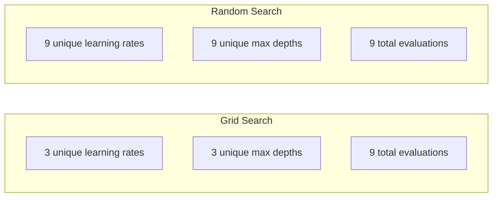
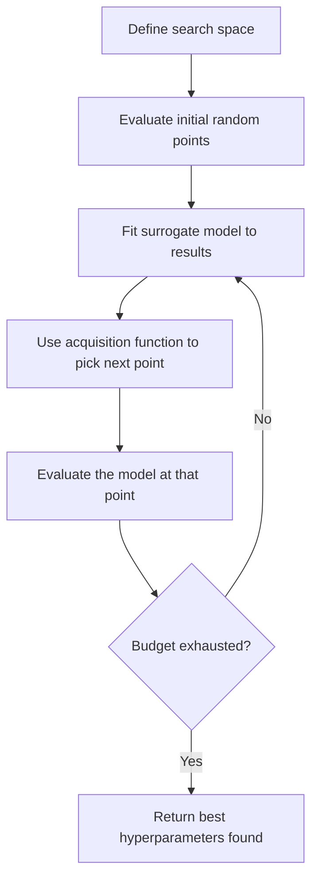
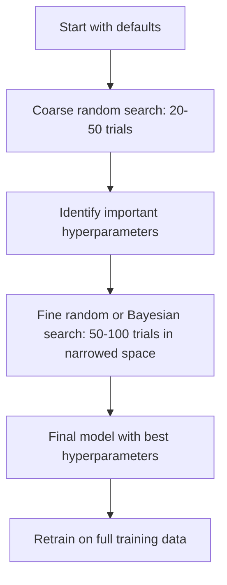
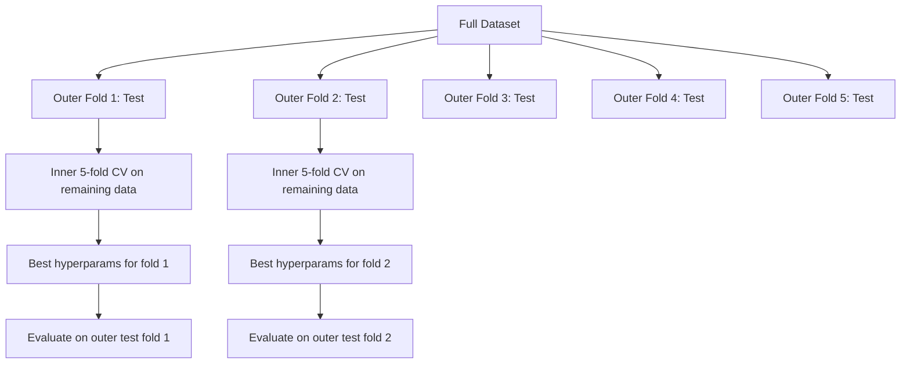

# ハイパーパラメータチューニング

> Hyperparameter は、学習が始まる前に回すつまみです。うまく回せるかどうかが、平凡なモデルと優れたモデルの差になります。

**種類:** Build
**言語:** Python
**前提:** Phase 2, Lesson 11 (Ensemble Methods)
**時間:** 約90分

## 学習目標

- grid search、random search、Bayesian optimization をゼロから実装し、sample efficiency を比較する
- ほとんどの hyperparameter が低い effective dimensionality を持つとき、random search が grid search を上回る理由を説明する
- surrogate model と acquisition function を使い、探索を導く Bayesian optimization loop を構築する
- 適切な cross-validation により validation set への overfitting を避ける hyperparameter tuning strategy を設計する

## 問題

gradient boosting model には、learning rate、tree の数、max depth、min samples per leaf、subsample ratio、column sample ratio があります。つまり 6 つの hyperparameter です。それぞれに妥当な値が 5 個あるなら、grid は 5^6 = 15,625 通りです。1 回の学習に 10 秒かかるとします。すべて試すには 43 時間の計算が必要です。

Grid search は分かりやすい方法であり、大規模では最悪の方法です。Random search はより少ない compute で良い結果を出します。Bayesian optimization は過去の評価から学ぶことでさらに良い結果を出します。どの strategy を使うか、どの hyperparameter が実際に重要かを知ることで、GPU 時間の浪費を何日分も節約できます。

## コンセプト

### Parameter と Hyperparameter

Parameter は学習中に学ばれるもの（weights、biases、split thresholds）です。Hyperparameter は学習開始前に設定され、学習の進み方を制御します。

| Hyperparameter | 制御するもの | 典型的な範囲 |
|---------------|-----------------|---------------|
| Learning rate | update ごとの step size | 0.001 から 1.0 |
| Number of trees/epochs | どれだけ長く学習するか | 10 から 10,000 |
| Max depth | model complexity | 1 から 30 |
| Regularization (lambda) | overfitting prevention | 0.0001 から 100 |
| Batch size | gradient estimation noise | 16 から 512 |
| Dropout rate | dropped される neuron の割合 | 0.0 から 0.5 |

### Grid Search

Grid search は、指定された値のすべての組み合わせを評価します。網羅的で理解しやすい一方、hyperparameter の数に対して指数的に拡大します。

```
Grid for 2 hyperparameters:

  learning_rate: [0.01, 0.1, 1.0]
  max_depth:     [3, 5, 7]

  Evaluations: 3 x 3 = 9 combinations

  (0.01, 3)  (0.01, 5)  (0.01, 7)
  (0.1,  3)  (0.1,  5)  (0.1,  7)
  (1.0,  3)  (1.0,  5)  (1.0,  7)
```

Grid search には根本的な欠陥があります。1 つの hyperparameter だけが重要で、もう 1 つが重要でない場合、ほとんどの評価が無駄になります。9 回評価しても、重要な parameter について得られる一意な値は 3 個だけです。

### Random Search

Random search は grid ではなく分布から hyperparameter を sample します。同じ 9 回の評価予算なら、各 hyperparameter について 9 個の一意な値を得られます。



random が grid に勝つ理由（Bergstra & Bengio, 2012）:

- ほとんどの hyperparameter は低い effective dimensionality を持ちます。特定の問題で本当に重要なのは、通常 6 個中 1-2 個だけです。
- Grid search は重要でない次元に評価を浪費します。
- Random search は同じ予算で重要な次元をより密にカバーします。
- 60 回の random trial があれば、search space 内に最適点がある場合、最適点の 5% 以内の点を見つける確率が 95% あります。

### Bayesian Optimization

Random search は結果を無視します。高い learning rate が発散を引き起こすことや、depth 3 が depth 10 を一貫して上回ることを学びません。Bayesian optimization は過去の評価を使って、次にどこを探索するかを決めます。



2 つの主要コンポーネント:

**Surrogate model:** 高価な objective function を近似する、評価の安いモデル（通常は Gaussian process）です。search space 内の任意の点で、予測値と uncertainty estimate の両方を返します。

**Acquisition function:** exploitation（既知の良い点の近くを探す）と exploration（uncertainty が高い場所を探す）のバランスを取り、次に評価する場所を決めます。一般的な選択肢:

- **Expected Improvement (EI):** この点で、現在の best よりどれだけ改善すると期待できるか？
- **Upper Confidence Bound (UCB):** 予測値に uncertainty の倍数を足したもの。UCB が高い点は、有望か未探索のどちらかです。
- **Probability of Improvement (PI):** この点が現在の best を上回る確率はどれくらいか？

Bayesian optimization は通常、random search より 2-5 倍少ない評価でより良い hyperparameter を見つけます。surrogate model を fit する overhead は、実際のモデルを学習するコストと比べれば無視できます。

### Early Stopping

すべての training run を最後まで実行する必要はありません。ある configuration が 10 epoch 後に明らかに悪いなら、そこで止めて次へ進みます。これは hyperparameter search の文脈での early stopping です。

戦略:
- **Patience-based:** validation loss が N epoch 連続で改善しなければ停止
- **Median pruning:** trial の intermediate result が、同じ step における完了済み trial の median より悪ければ停止
- **Hyperband:** 多くの configuration に小さな budget を割り当て、最良のものだけに budget を段階的に増やす

Hyperband は特に効果的です。81 個の configuration を 1 epoch ずつ開始し、上位 1/3 を残して 3 epoch 与え、さらに上位 1/3 を残す、という流れを続けます。これにより、すべての config を full budget で評価するより 10-50 倍速く良い configuration を見つけられます。

### Learning Rate Scheduler

learning rate はほぼ常に最も重要な hyperparameter です。固定したままにする代わりに、scheduler は学習中に learning rate を調整します。

| Scheduler | 式 | 使う場面 |
|-----------|---------|-------------|
| Step decay | N epochs ごとに 0.1 倍する | classic CNN training |
| Cosine annealing | lr * 0.5 * (1 + cos(pi * t / T)) | modern default |
| Warmup + decay | linear increase の後に cosine decay | Transformers |
| One-cycle | 1 cycle の中で増やしてから減らす | 速い収束 |
| Reduce on plateau | metric が停滞したら係数倍で下げる | 安全な default |

### Hyperparameter の重要度

すべての hyperparameter が同じ重要度を持つわけではありません。Random Forest（Probst et al., 2019）と gradient boosting に関する研究は、一貫したパターンを示しています。

**重要度が高い:**
- Learning rate（常に最初に tune する）
- Number of estimators / epochs（tuning ではなく early stopping を使う）
- Regularization strength

**重要度が中程度:**
- Max depth / number of layers
- Min samples per leaf / weight decay
- Subsample ratio

**重要度が低い:**
- Max features（Random Forest の場合）
- Specific activation function choice
- Batch size（妥当な範囲内）

重要なものを先に tune し、残りは default のままにします。

### 実践的な戦略



具体的な workflow:

1. **library default から始める。** default は経験豊富な practitioner によって選ばれており、多くの場合、最適解の 80% までは到達します。
2. **Coarse random search。** 広い範囲で 20-50 trials。early stopping を使って悪い run を素早く止めます。
3. **結果を分析する。** どの hyperparameter が performance と相関していますか？search space を狭めます。
4. **Fine search。** 狭めた空間で Bayesian optimization または focused random search を行います。50-100 trials。
5. **見つかった best hyperparameter で全 training data に再学習** します。

### Cross-Validation との統合

単一の validation split で hyperparameter を tune するのは危険です。best hyperparameter がその特定の validation fold に overfit する可能性があります。Nested cross-validation は 2 つの loop を使ってこれを解決します。

- **Outer loop**（evaluation）: data を train+val と test に分けます。unbiased performance を報告します。
- **Inner loop**（tuning）: train+val を train と val に分けます。best hyperparameter を見つけます。



各 outer fold は、独立に自身の best hyperparameter を見つけます。outer score は generalization performance の unbiased estimate です。

sklearn では次のように書けます。

```python
from sklearn.model_selection import cross_val_score, GridSearchCV
from sklearn.ensemble import GradientBoostingRegressor

inner_cv = GridSearchCV(
    GradientBoostingRegressor(),
    param_grid={
        "learning_rate": [0.01, 0.05, 0.1],
        "max_depth": [2, 3, 5],
        "n_estimators": [50, 100, 200],
    },
    cv=5,
    scoring="neg_mean_squared_error",
)

outer_scores = cross_val_score(
    inner_cv, X, y, cv=5, scoring="neg_mean_squared_error"
)

print(f"Nested CV MSE: {-outer_scores.mean():.4f} +/- {outer_scores.std():.4f}")
```

これは高価です（5 outer folds x 5 inner folds x 27 grid points = 675 model fits）が、信頼できる performance estimate を与えます。論文で最終結果を報告するときや、意思決定の stakes が高いときに使います。

### 実践的な Tips

**learning rate から始める。** gradient-based method では常に最も重要な hyperparameter です。悪い learning rate は他のすべてを無意味にします。他の hyperparameter を default に固定し、まず learning rate を sweep します。

**learning rate と regularization には log-uniform distribution を使う。** 0.001 と 0.01 の差は、0.1 と 1.0 の差と同じくらい重要です。linear に探索すると大きい側に budget を浪費します。

**n_estimators を tune する代わりに early stopping を使う。** boosting と neural network では、n_estimators または epochs を高い値に設定し、いつ止めるかは early stopping に決めさせます。これにより search から hyperparameter を 1 つ取り除けます。

**Budget allocation。** tuning budget の 60% を、最も重要な上位 2 つの hyperparameter に使います。残りの 40% をその他すべてに使います。上位 2 つが performance variation の大部分を占めます。

**Scale matters。** batch size を log scale で探索してはいけません（16、32、64 は問題ありません）。learning rate は必ず log scale で探索します。hyperparameter がモデルに与える影響に search distribution を合わせてください。

| モデル種別 | 重要な Hyperparameters | 推奨 Search | 予算 |
|-----------|--------------------|--------------------|--------|
| Random Forest | n_estimators, max_depth, min_samples_leaf | Random search, 50 trials | 低い（学習が速い） |
| Gradient Boosting | learning_rate, n_estimators, max_depth | Bayesian, 100 trials + early stopping | 中程度 |
| Neural Network | learning_rate, weight_decay, batch_size | Bayesian or random, 100+ trials | 高い（学習が遅い） |
| SVM | C, gamma (RBF kernel) | log scale の grid, 25-50 trials | 低い（2 params） |
| Lasso/Ridge | alpha | log scale の 1D search, 20 trials | 非常に低い |
| XGBoost | learning_rate, max_depth, subsample, colsample | Bayesian, 100-200 trials + early stopping | 中程度 |

**迷ったら:** hyperparameter 数の 2 倍を trial 数とする random search（例: 6 hyperparameters = 最低 12+ trials）。random search 50 trials が、注意深く設計した grid search に勝つことがどれほど多いかに驚くはずです。

## 作る

### Step 1: Grid Search をゼロから実装する

`code/tuning.py` のコードは、grid search、random search、単純な Bayesian optimizer をゼロから実装しています。

```python
def grid_search(model_fn, param_grid, X_train, y_train, X_val, y_val):
    keys = list(param_grid.keys())
    values = list(param_grid.values())
    best_score = -float("inf")
    best_params = None
    n_evals = 0

    for combo in itertools.product(*values):
        params = dict(zip(keys, combo))
        model = model_fn(**params)
        model.fit(X_train, y_train)
        score = evaluate(model, X_val, y_val)
        n_evals += 1

        if score > best_score:
            best_score = score
            best_params = params

    return best_params, best_score, n_evals
```

### Step 2: Random Search をゼロから実装する

```python
def random_search(model_fn, param_distributions, X_train, y_train,
                  X_val, y_val, n_iter=50, seed=42):
    rng = np.random.RandomState(seed)
    best_score = -float("inf")
    best_params = None

    for _ in range(n_iter):
        params = {k: sample(v, rng) for k, v in param_distributions.items()}
        model = model_fn(**params)
        model.fit(X_train, y_train)
        score = evaluate(model, X_val, y_val)

        if score > best_score:
            best_score = score
            best_params = params

    return best_params, best_score, n_iter
```

### Step 3: Bayesian Optimization (Simplified)

中心となる考え方は、観測された（hyperparameter, score）のペアに Gaussian process を fit し、acquisition function を使って次に見る場所を決めることです。

```python
class SimpleBayesianOptimizer:
    def __init__(self, search_space, n_initial=5):
        self.search_space = search_space
        self.n_initial = n_initial
        self.X_observed = []
        self.y_observed = []

    def _kernel(self, x1, x2, length_scale=1.0):
        dists = np.sum((x1[:, None, :] - x2[None, :, :]) ** 2, axis=2)
        return np.exp(-0.5 * dists / length_scale ** 2)

    def _fit_gp(self, X_new):
        X_obs = np.array(self.X_observed)
        y_obs = np.array(self.y_observed)
        y_mean = y_obs.mean()
        y_centered = y_obs - y_mean

        K = self._kernel(X_obs, X_obs) + 1e-4 * np.eye(len(X_obs))
        K_star = self._kernel(X_new, X_obs)

        L = np.linalg.cholesky(K)
        alpha = np.linalg.solve(L.T, np.linalg.solve(L, y_centered))
        mu = K_star @ alpha + y_mean

        v = np.linalg.solve(L, K_star.T)
        var = 1.0 - np.sum(v ** 2, axis=0)
        var = np.maximum(var, 1e-6)

        return mu, var

    def _expected_improvement(self, mu, var, best_y):
        sigma = np.sqrt(var)
        z = (mu - best_y) / (sigma + 1e-10)
        ei = sigma * (z * norm_cdf(z) + norm_pdf(z))
        return ei

    def suggest(self):
        if len(self.X_observed) < self.n_initial:
            return sample_random(self.search_space)

        candidates = [sample_random(self.search_space) for _ in range(500)]
        X_cand = np.array([to_vector(c) for c in candidates])
        mu, var = self._fit_gp(X_cand)
        ei = self._expected_improvement(mu, var, max(self.y_observed))
        return candidates[np.argmax(ei)]

    def observe(self, params, score):
        self.X_observed.append(to_vector(params))
        self.y_observed.append(score)
```

GP surrogate は各 candidate point で 2 つのものを返します。predicted score（mu）と uncertainty（var）です。Expected Improvement はこれらのバランスを取ります。モデルが高い score を予測する点、または uncertainty が高い点を好みます。初期には多くの点で uncertainty が高いため optimizer は探索します。後半では最も有望な領域に集中します。

### Step 4: すべての手法を比較する

同じ synthetic objective 上で 3 つの手法をすべて実行し、比較します。この比較では、各 optimizer が直接 objective function を呼び出す単純な wrapper を使うため（model training はありません）、API は上記の model-based implementation と異なります。

```python
def synthetic_objective(params):
    lr = params["learning_rate"]
    depth = params["max_depth"]
    return -(np.log10(lr) + 2) ** 2 - (depth - 4) ** 2 + 10

param_grid = {
    "learning_rate": [0.001, 0.01, 0.1, 1.0],
    "max_depth": [2, 3, 4, 5, 6, 7, 8],
}

grid_best = None
grid_score = -float("inf")
grid_history = []
for combo in itertools.product(*param_grid.values()):
    params = dict(zip(param_grid.keys(), combo))
    score = synthetic_objective(params)
    grid_history.append((params, score))
    if score > grid_score:
        grid_score = score
        grid_best = params

param_dist = {
    "learning_rate": ("log_float", 0.001, 1.0),
    "max_depth": ("int", 2, 8),
}

rand_best = None
rand_score = -float("inf")
rand_history = []
rng = np.random.RandomState(42)
for _ in range(28):
    params = {k: sample(v, rng) for k, v in param_dist.items()}
    score = synthetic_objective(params)
    rand_history.append((params, score))
    if score > rand_score:
        rand_score = score
        rand_best = params

optimizer = SimpleBayesianOptimizer(param_dist, n_initial=5)
bayes_history = []
for _ in range(28):
    params = optimizer.suggest()
    score = synthetic_objective(params)
    optimizer.observe(params, score)
    bayes_history.append((params, score))
bayes_score = max(s for _, s in bayes_history)

print(f"{'Method':<20} {'Best Score':>12} {'Evaluations':>12}")
print("-" * 50)
print(f"{'Grid Search':<20} {grid_score:>12.4f} {len(grid_history):>12}")
print(f"{'Random Search':<20} {rand_score:>12.4f} {len(rand_history):>12}")
print(f"{'Bayesian Opt':<20} {bayes_score:>12.4f} {len(bayes_history):>12}")
```

同じ budget なら、Bayesian optimization は明らかに悪い領域で評価を浪費しないため、通常は最も速く best score を見つけます。Random search は grid search より広く探索します。Grid search が勝つのは、hyperparameter が非常に少なく、網羅的に調べる余裕がある場合だけです。

## 使う

### 実務での Optuna

本格的な hyperparameter tuning には Optuna を推奨します。pruning、distributed search、visualization を最初からサポートしています。

```python
import optuna

def objective(trial):
    lr = trial.suggest_float("learning_rate", 1e-4, 1e-1, log=True)
    n_est = trial.suggest_int("n_estimators", 50, 500)
    max_depth = trial.suggest_int("max_depth", 2, 10)

    model = GradientBoostingRegressor(
        learning_rate=lr,
        n_estimators=n_est,
        max_depth=max_depth,
    )
    model.fit(X_train, y_train)
    return mean_squared_error(y_val, model.predict(X_val))

study = optuna.create_study(direction="minimize")
study.optimize(objective, n_trials=100)

print(f"Best params: {study.best_params}")
print(f"Best MSE: {study.best_value:.4f}")
```

Optuna の主要機能:
- log scale で探索すべき parameter（learning rate、regularization）には `suggest_float(..., log=True)`
- integer parameter には `suggest_int`
- discrete choice には `suggest_categorical`
- 悪い trial を early stopping する built-in MedianPruner
- 分析用の `study.trials_dataframe()`

### Pruning を使った Optuna

Pruning は有望でない trial を早期に停止し、大量の compute を節約します。pattern は次の通りです。

```python
import optuna
from sklearn.model_selection import cross_val_score

def objective(trial):
    params = {
        "learning_rate": trial.suggest_float("lr", 1e-4, 0.5, log=True),
        "max_depth": trial.suggest_int("max_depth", 2, 10),
        "n_estimators": trial.suggest_int("n_estimators", 50, 500),
        "subsample": trial.suggest_float("subsample", 0.5, 1.0),
    }

    model = GradientBoostingRegressor(**params)
    scores = cross_val_score(model, X_train, y_train, cv=3,
                             scoring="neg_mean_squared_error")
    mean_score = -scores.mean()

    trial.report(mean_score, step=0)
    if trial.should_prune():
        raise optuna.TrialPruned()

    return mean_score

pruner = optuna.pruners.MedianPruner(n_startup_trials=10, n_warmup_steps=5)
study = optuna.create_study(direction="minimize", pruner=pruner)
study.optimize(objective, n_trials=200)
```

`MedianPruner` は、その intermediate value が同じ step における全完了 trial の median より悪い場合に trial を停止します。Pruning には、中間 metric を報告する `trial.report()` と、trial を停止すべきか確認する `trial.should_prune()` の呼び出しが必要です。`n_startup_trials=10` は、pruning が始まる前に少なくとも 10 trial が完全に完了することを保証します。これにより通常、total compute の 40-60% を節約できます。

### sklearn の組み込み Tuner

quick experiment には、sklearn が `GridSearchCV`、`RandomizedSearchCV`、`HalvingRandomSearchCV` を提供しています。

```python
from sklearn.model_selection import RandomizedSearchCV
from scipy.stats import loguniform, randint

param_dist = {
    "learning_rate": loguniform(1e-4, 0.5),
    "max_depth": randint(2, 10),
    "n_estimators": randint(50, 500),
}

search = RandomizedSearchCV(
    GradientBoostingRegressor(),
    param_dist,
    n_iter=100,
    cv=5,
    scoring="neg_mean_squared_error",
    random_state=42,
    n_jobs=-1,
)
search.fit(X_train, y_train)
print(f"Best params: {search.best_params_}")
print(f"Best CV MSE: {-search.best_score_:.4f}")
```

learning rate と regularization には scipy の `loguniform` を使います。integer hyperparameter には `randint` を使います。`n_jobs=-1` flag はすべての CPU core で並列化します。

### Hyperparameter Tuning でよくあるミス

**preprocessing による data leakage。** cross-validation の前に full dataset 上で scaler を fit すると、validation fold の情報が training に漏れます。preprocessing は必ず `Pipeline` の中に入れ、training fold 上だけで fit されるようにします。

**validation set への overfitting。** 数千 trial を実行すると、実質的に validation set 上で学習していることになります。最終 performance estimate には nested cross-validation を使うか、tuning 中に一切触れない別の test set を hold out してください。

**範囲が狭すぎる search。** best value が search space の境界にあるなら、十分に広く探索できていません。最適値は範囲外にあるかもしれません。best parameter が端にないか必ず確認します。

**interaction effect を無視する。** boosting では learning rate と number of estimators が強く相互作用します。低い learning rate にはより多くの estimator が必要です。別々に tune すると、一緒に tune するより悪い結果になります。

**iterative model に early stopping を使わない。** gradient boosting と neural network では、n_estimators または epochs を高い値に設定し、early stopping を使います。これは iteration 数を hyperparameter として tune するより明確に優れています。

## 演習

1. grid search と random search を同じ total budget（例: 50 evaluations）で実行してください。見つかった best score を比較します。異なる seed で 10 回実験してください。random search はどのくらいの頻度で勝ちますか？

2. Hyperband をゼロから実装してください。81 個の configuration から始め、それぞれ 1 epoch だけ学習します。各 round で上位 1/3 を残し、budget を 3 倍にします。total compute（すべての config にわたる epoch の合計）を、81 config を full budget で実行する場合と比較してください。

3. Lesson 11 の gradient boosting implementation に learning rate scheduler（cosine annealing）を追加してください。固定 learning rate と比べて役立ちますか？

4. Optuna を使って、実データセット（例: sklearn の breast cancer dataset）上の RandomForestClassifier を tune してください。どの hyperparameter が最も重要かを見るために `optuna.visualization.plot_param_importances(study)` を使います。この lesson の importance ranking と一致しますか？

5. 単純な acquisition function（Expected Improvement）を実装し、exploration vs exploitation を示してください。surrogate model の mean と uncertainty をプロットし、EI が次にどこを評価するかを示します。

## 重要語句

| 用語 | よく言われること | 実際の意味 |
|------|----------------|----------------------|
| Hyperparameter | 「選ぶ設定」 | 学習前に設定され、学習プロセスを制御する値。データから学習されるものではない |
| Grid search | 「すべての組み合わせを試す」 | 指定された parameter grid 上の網羅的探索。コストは指数的に増える。 |
| Random search | 「ランダムに sample するだけ」 | 分布から hyperparameter を sample する。grid search より重要な次元をよくカバーする。 |
| Bayesian optimization | 「賢い探索」 | objective の surrogate model を使って次に評価する場所を決め、exploration と exploitation のバランスを取る |
| Surrogate model | 「安い近似」 | 観測済み評価から高価な objective function を近似するモデル（通常は Gaussian process） |
| Acquisition function | 「次にどこを見るか」 | expected improvement と uncertainty のバランスで candidate point を score する。EI と UCB がよく使われる。 |
| Early stopping | 「時間を無駄にしない」 | validation performance が改善しなくなったら training を早期終了する |
| Hyperband | 「config 用の tournament bracket」 | adaptive resource allocation: 多数の config を小さな budget で始め、最良のものを残して budget を増やす |
| Learning rate scheduler | 「training 中に lr を変える」 | より良い収束のため、学習の進行に合わせて learning rate を調整する関数 |

## 参考文献

- [Bergstra & Bengio: Random Search for Hyper-Parameter Optimization (2012)](https://jmlr.org/papers/v13/bergstra12a.html) -- random が grid に勝つことを示した論文
- [Snoek et al., Practical Bayesian Optimization of Machine Learning Algorithms (2012)](https://arxiv.org/abs/1206.2944) -- ML 向け Bayesian optimization
- [Li et al., Hyperband: A Novel Bandit-Based Approach (2018)](https://jmlr.org/papers/v18/16-558.html) -- Hyperband paper
- [Optuna: A Next-generation Hyperparameter Optimization Framework](https://arxiv.org/abs/1907.10902) -- Optuna paper
- [Probst et al., Tunability: Importance of Hyperparameters (2019)](https://jmlr.org/papers/v20/18-444.html) -- どの hyperparameter が重要か
