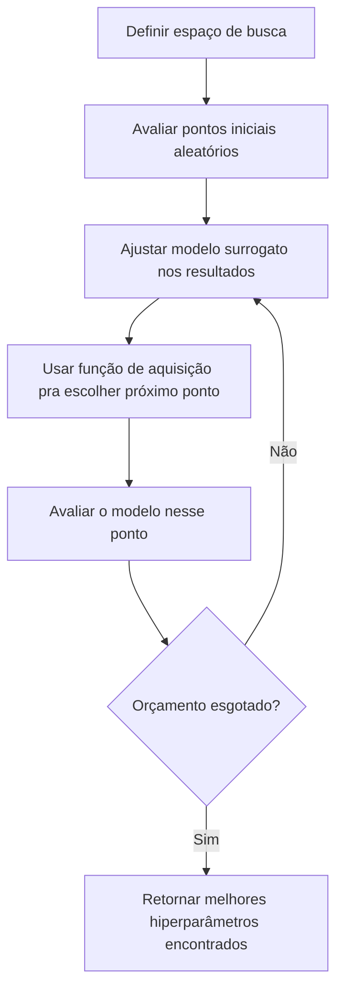
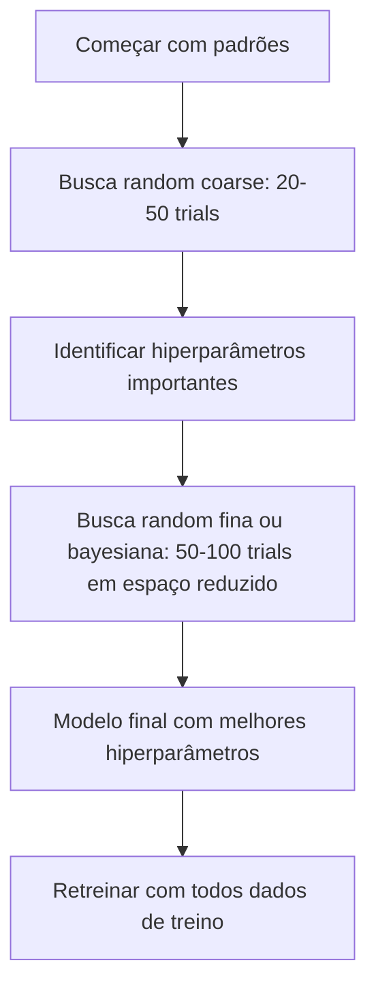

# Ajuste de Hiperparâmetros

> Hiperparâmetros são os botões que você gira antes do treino começar. Girá-los bem é a diferença entre um modelo mediano e um ótimo.

**Tipo:** Build
**Linguagens:** Python
**Pré-requisitos:** Fase 2, Aula 11 (Métodos Ensemble)
**Tempo:** ~90 minutos

## Objetivos de Aprendizado

- Implementar grid search, random search e otimização bayesiana do zero e comparar sua eficiência de amostragem
- Explicar por que random search supera grid search quando a maioria dos hiperparâmetros tem dimensionalidade efetiva baixa
- Construir um loop de otimização bayesiana usando um modelo surrogato e função de aquisição pra guiar a busca
- Projetar uma estratégia de ajuste que evite overfitting no conjunto de validação usando validação cruzada adequada

## O Problema

Seu modelo de gradient boosting tem learning rate, número de árvores, profundidade máxima, mínimo de amostras por folha, razão de subamostragem e razão de amostragem de colunas. São seis hiperparâmetros. Se cada um tem 5 valores razoáveis, a grade tem 5^6 = 15.625 combinações. Treinar cada uma leva 10 segundos. São 43 horas de compute pra tentar todas.

Grid search é a abordagem óbvia e a pior em escala. Random search faz melhor com menos compute. Otimização bayesiana faz ainda melhor aprendendo de avaliações passadas.

## O Conceito

### Parâmetros vs Hiperparâmetros

Parâmetros são aprendidos durante treino (pesos, vieses, limiares de divisão). Hiperparâmetros são definidos antes do treino e controlam como o aprendizado acontece.

| Hiperparâmetro | O que controla | Faixa típica |
|---------------|----------------|-------------|
| Learning rate | Tamanho do passo por atualização | 0.001 a 1.0 |
| Número de árvores/épocas | Quanto tempo treinar | 10 a 10.000 |
| Profundidade máxima | Complexidade do modelo | 1 a 30 |
| Regularização (lambda) | Prevenção de overfitting | 0.0001 a 100 |
| Tamanho do batch | Ruído de estimativa do gradiente | 16 a 512 |
| Taxa de dropout | Fração de neurônios desativados | 0.0 a 0.5 |

### Grid Search

Grid search avalia cada combinação de valores eespecificaçãoificados. É exaustiva e fácil de entender, mas escala exponencialmente com o número de hiperparâmetros.

### Random Search

Random search amostra hiperparâmetros de distribuições em vez de uma grade. Com o mesmo orçamento de 9 avaliações, você ganha 9 valores únicos de cada hiperparâmetro.

Por que random supera grid (Bergstra & Bengio, 2012):
- A maioria dos hiperparâmetros tem dimensionalidade efetiva baixa
- Grid search desperdiça avaliações em dimensões importantes
- Random search cobre as dimensões importantes mais densamente

### Otimização Bayesiana

Random search ignora resultados. Otimização bayesiana usa avaliações passadas pra decidir onde buscar depois.



Dois componentes-chave:

**Modelo surrogato:** Um modelo barato de avaliar (geralmente processo gaussiano) que aproxima a função de custo cara.

**Função de aquisição:** Decide onde avaliar depois balanceando exploração (buscar onde incerteza é alta) e exploração (buscar perto de pontos conhecidos bons).

### Early Stopping

Nem todo run de treino precisa terminar. Se uma configuração é claramente ruim depois de 10 épocas, pare e siga em frente.

### A Importância de Hiperparâmetros

**Alta importância:**
- Learning rate (sempre ajustar primeiro)
- Número de estimadores/épocas (use early stopping)
- Força de regularização

**Média importância:**
- Profundidade máxima / número de camadas
- Mínimo de amostras por folha / weight decay
- Razão de subamostragem

### Estratégia Prática



## Construa

### Passo 1: Grid Search Do Zero

```python
def grid_search(model_fn, param_grid, X_train, y_train, X_val, y_val):
    keys = list(param_grid.keys())
    values = list(param_grid.values())
    best_score = -float("inf")
    best_params = None
    n_evals = 0

    for combo in itertools.product(*values):
        params = dict(zip(keys, combo))
        model = model_fn(**params)
        model.fit(X_train, y_train)
        score = evaluate(model, X_val, y_val)
        n_evals += 1

        if score > best_score:
            best_score = score
            best_params = params

    return best_params, best_score, n_evals
```

### Passo 2: Random Search Do Zero

```python
def random_search(model_fn, param_distributions, X_train, y_train,
                  X_val, y_val, n_iter=50, seed=42):
    rng = np.random.RandomState(seed)
    best_score = -float("inf")
    best_params = None

    for _ in range(n_iter):
        params = {k: sample(v, rng) for k, v in param_distributions.items()}
        model = model_fn(**params)
        model.fit(X_train, y_train)
        score = evaluate(model, X_val, y_val)

        if score > best_score:
            best_score = score
            best_params = params

    return best_params, best_score, n_iter
```

### Passo 3: Otimização Bayesiana (Simplificada)

```python
class SimpleBayesianOptimizer:
    def __init__(self, search_space, n_initial=5):
        self.search_space = search_space
        self.n_initial = n_initial
        self.X_observed = []
        self.y_observed = []

    def _kernel(self, x1, x2, length_scale=1.0):
        dists = np.sum((x1[:, None, :] - x2[None, :, :]) ** 2, axis=2)
        return np.exp(-0.5 * dists / length_scale ** 2)

    def suggest(self):
        if len(self.X_observed) < self.n_initial:
            return sample_random(self.search_space)

        candidates = [sample_random(self.search_space) for _ in range(500)]
        X_cand = np.array([to_vector(c) for c in candidates])
        mu, var = self._fit_gp(X_cand)
        ei = self._expected_improvement(mu, var, max(self.y_observed))
        return candidates[np.argmax(ei)]

    def observe(self, params, score):
        self.X_observed.append(to_vector(params))
        self.y_observed.append(score)
```

## Use

### Optuna na Prática

Optuna é a biblioteca recomendada para ajuste sério de hiperparâmetros.

```python
import optuna

def objective(trial):
    lr = trial.suggest_float("learning_rate", 1e-4, 1e-1, log=True)
    n_est = trial.suggest_int("n_estimators", 50, 500)
    max_depth = trial.suggest_int("max_depth", 2, 10)

    model = GradientBoostingRegressor(
        learning_rate=lr,
        n_estimators=n_est,
        max_depth=max_depth,
    )
    model.fit(X_train, y_train)
    return mean_squared_error(y_val, model.predict(X_val))

study = optuna.create_study(direction="minimize")
study.optimize(objective, n_trials=100)
```

### Validação Cruzada Aninhada

```python
from sklearn.model_selection import cross_val_score, GridSearchCV

inner_cv = GridSearchCV(
    GradientBoostingRegressor(),
    param_grid={
        "learning_rate": [0.01, 0.05, 0.1],
        "max_depth": [2, 3, 5],
        "n_estimators": [50, 100, 200],
    },
    cv=5,
    scoring="neg_mean_squared_error",
)

outer_scores = cross_val_score(
    inner_cv, X, y, cv=5, scoring="neg_mean_squared_error"
)
```

## Exercícios

1. Implemente grid search e random search do zero. Compare os melhores scores encontrados no mesmo dataset.
2. Rode random search com 50 trials num espaço de 6 hiperparâmetros. Quantos trials são necessários pra encontrar um ponto dentro de 5% do ótimo?
3. Implemente early stopping para um modelo de gradient boosting: pare quando a loss de validação não melhorar por N rodadas.
4. Compare grid search, random search e otimização bayesiana na mesma função de custo sintética.
