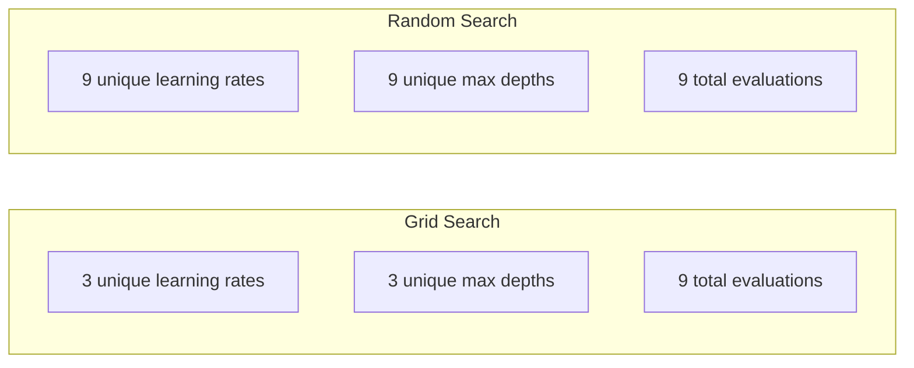
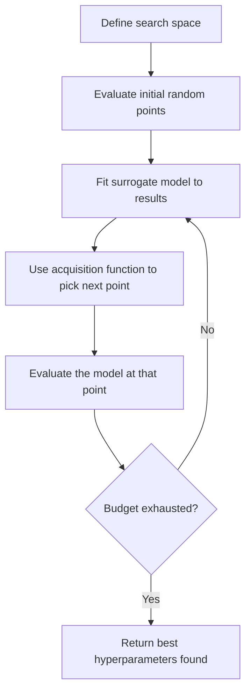
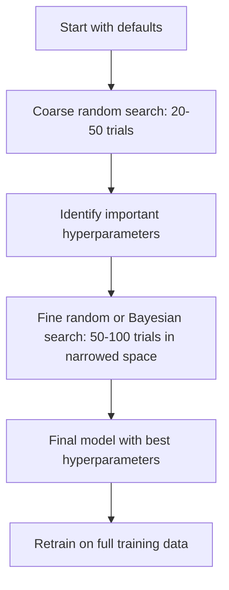
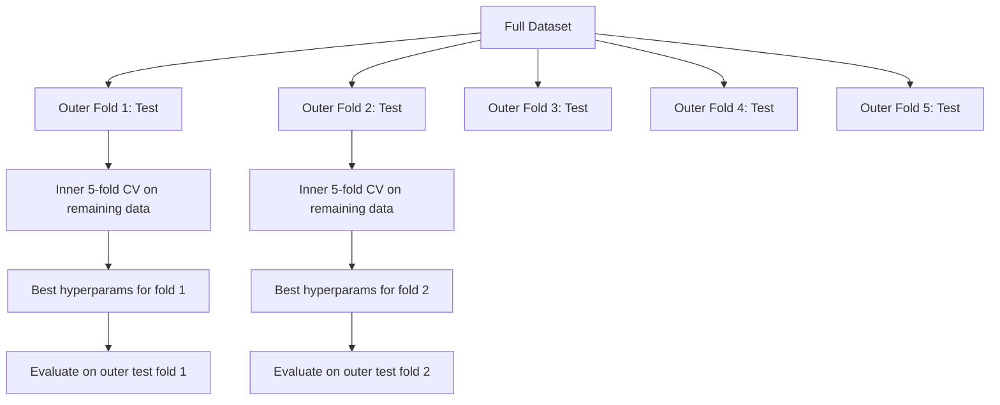

# Hiperparametre Ayarı

> Hiperparametreler, antrenman başlamadan önce çevirdiğiniz düğmelerdir. Onları iyi bir şekilde çevirmek, vasat bir model ile harika bir model arasındaki farktır.

**Tür:** Yapım
**Dil:** Python
**Önkoşullar:** Aşama 2, Ders 11 (Topluluk Yöntemleri)
**Süre:** ~90 dakika

## Öğrenme Hedefleri

- Izgara aramasını, rastgele aramayı ve Bayesian optimizasyonunu sıfırdan uygulayın ve bunların örnek verimliliğini karşılaştırın
- Çoğu hiperparametrenin etkin boyutsallığı düşük olduğunda rastgele aramanın neden ızgara aramasından daha iyi performans gösterdiğini açıklayın
- Aramayı yönlendirmek için bir yedek model ve satın alma işlevi kullanarak bir Bayesian optimizasyon döngüsü oluşturun
- Uygun çapraz doğrulama yoluyla doğrulama setinin gereğinden fazla ayarlanmasını önleyen bir hiperparametre ayarlama stratejisi tasarlayın

## Sorun

gradient güçlendirme modelinizde öğrenme oranı, ağaç sayısı, maksimum derinlik, yaprak başına minimum örnek sayısı, alt örnek oranı ve sütun örnek oranı bulunur. Bu altı hiperparametredir. Her birinin 5 makul değeri varsa, ızgarada 5^6 = 15.625 kombinasyon bulunur. Her biri eğitim 10 saniye sürer. Bu, hepsini denemek için 43 saatlik bir hesaplama demektir.

Izgara araması bariz bir yaklaşımdır ve ölçekte en kötü yaklaşımdır. Rastgele arama, daha az işlemle daha iyi sonuç verir. Bayes optimizasyonu geçmiş değerlendirmelerden öğrenerek daha da iyi sonuç verir. Hangi stratejinin kullanılacağını ve hangi hiperparametrelerin gerçekten önemli olduğunu bilmek, günlerce boşa harcanan GPU zamanından tasarruf etmenizi sağlar.

## Konsept

### Parametreler ve Hiperparametreler

Parametreler eğitim sırasında öğrenilir (ağırlıklar, sapmalar, bölünmüş eşikler). Hiperparametreler eğitim başlamadan önce ayarlanır ve öğrenmenin nasıl gerçekleşeceğini kontrol eder.

| Hiperparametre | Neleri kontrol ediyor | Tipik aralık |
|---------------|-----------------|---------------|
| Öğrenme oranı | Güncelleme başına adım boyutu | 0,001 - 1,0 |
| Ağaç/dönem sayısı | Ne kadar sürede eğitilmeli | 10 ila 10.000 |
| Maksimum derinlik | Model karmaşıklığı | 1 - 30 |
| Düzenleme (lambda) | Aşırı uyumun önlenmesi | 0,0001 ila 100 |
| Parti boyutu | Gradient tahmin gürültüsü | 16 - 512 |
| Bırakma oranı | Nöronların bir kısmı düştü | 0,0 ila 0,5 |

### Izgara Arama

Izgara araması, belirtilen değerlerin her birleşimini değerlendirir. Kapsamlı ve anlaşılması kolaydır ancak hiperparametrelerin sayısına göre üstel olarak ölçeklenir.

```
Grid for 2 hyperparameters:

  learning_rate: [0.01, 0.1, 1.0]
  max_depth:     [3, 5, 7]

  Evaluations: 3 x 3 = 9 combinations

  (0.01, 3)  (0.01, 5)  (0.01, 7)
  (0.1,  3)  (0.1,  5)  (0.1,  7)
  (1.0,  3)  (1.0,  5)  (1.0,  7)
```

Grid aramanın temel bir kusuru vardır: Bir hiperparametre önemliyken diğeri önemsizse değerlendirmelerin çoğu boşa gider. 9 değerlendirmeden önemli parametrenin yalnızca 3 benzersiz değerini alırsınız.

### Rastgele Arama

Rastgele arama, hiperparametreleri bir ızgara yerine dağıtımlardan örnekler. 9 değerlendirmeden oluşan aynı bütçeyle her hiperparametrenin 9 benzersiz değerini elde edersiniz.



Neden rastgele vuruşlar ızgarası (Bergstra ve Bengio, 2012):

- Çoğu hiperparametrenin etkili boyutu düşüktür. Belirli bir problem için genellikle 6 hiperparametreden yalnızca 1-2'si önemlidir.
- Izgara araması, önemsiz boyutlara ilişkin değerlendirmeleri boşa harcar.
- Rastgele arama, aynı bütçe için önemli boyutları daha yoğun bir şekilde kapsar.
- 60 rastgele denemede, optimumun %5'i dahilinde bir nokta bulma şansınız %95'tir (eğer arama alanında varsa).

### Bayes Optimizasyonu

Rastgele arama sonuçları dikkate almaz. Yüksek öğrenme oranlarının farklılığa neden olduğunu veya derinlik 3'ün sürekli olarak derinlik 10'dan daha iyi performans gösterdiğini öğrenmez. Bayesian optimizasyonu, bir sonraki nerede arama yapılacağına karar vermek için geçmiş değerlendirmeleri kullanır.



İki temel bileşen:

**Taşıyıcı model:** Pahalı amaç fonksiyonuna yaklaşan, değerlendirilmesi ucuz bir model (genellikle bir Gauss süreci). Arama uzayının herhangi bir noktasında hem tahmin hem de belirsizlik tahmini verir.

**Edinme işlevi:** Kullanım (bilinen iyi noktaların yakınında arama) ve keşif (belirsizliğin yüksek olduğu yerlerde arama) arasında denge kurarak bir sonraki değerlendirmenin nerede yapılacağına karar verir. Ortak seçimler:

- **Beklenen İyileşme (EI):** Bu noktada mevcut en iyi seviyeye göre ne kadar iyileşme bekliyoruz?
- **Üst Güven Sınırı (UCB):** Tahmin artı belirsizliğin katı. Daha yüksek UCB, umut verici veya keşfedilmemiş anlamına gelir.
- **İyileşme Olasılığı (PI):** Bu noktanın mevcut en iyi noktayı geçme olasılığı nedir?

Bayes optimizasyonu genellikle 2-5 kat daha az değerlendirmeyle rastgele aramaya göre daha iyi hiper parametreler bulur. Yedek modelin takılmasının ek yükü, gerçek modelin eğitilmesine kıyasla ihmal edilebilir düzeydedir.

### Erken Durdurma

Her antrenman çalışmasının bitmesi gerekmez. Bir konfigürasyon 10 dönemden sonra açıkça kötüyse, onu durdurun ve devam edin. Bu, hiperparametre araması bağlamında erken durdurmadır.

Stratejiler:
- **Sabıra dayalı:** Doğrulama kaybı birbirini takip eden N dönem boyunca iyileşmediyse dur
- **Ortalama budama:** Denemenin ara sonucu aynı adımda tamamlanan denemelerin ortalamasından daha kötüyse durdurun
- **Hyperband:** Birçok yapılandırmaya küçük bütçeler ayırın, ardından en iyileri için bütçeyi aşamalı olarak artırın

Hiper bant özellikle etkilidir. Her biri 1 dönem olan 81 konfigürasyon başlatır, ilk üçte birini tutar, onlara 3 dönem verir, ilk üçte birini tutar ve bu şekilde devam eder. Bu, iyi yapılandırmaları tüm bütçe için tüm yapılandırmaları değerlendirmekten 10-50 kat daha hızlı bulur.

### Öğrenme Hızı Planlayıcıları

Öğrenme oranı neredeyse her zaman en önemli hiper parametredir. Planlayıcılar bunu sabit tutmak yerine eğitim sırasında ayarlar.

| Zamanlayıcı | Formül | Ne zaman kullanılır |
|-----------|---------|-------------|
| Adım çürümesi | Her N çağda 0,1 ile çarpın | Klasik CNN eğitimi |
| Kosinüs tavlama | lr * 0,5 * (1 + cos(pi * t / T)) | Modern varsayılan |
| Isınma + bozulma | Doğrusal artış ve ardından kosinüs azalması | Transformer'ler |
| Tek çevrim | Bir döngüde artırın ve azaltın | Hızlı yakınsama |
| Platoda azaltın | Metrik durduğunda faktör bazında azaltın | Güvenli varsayılan |

### Hiperparametrenin Önemi

Tüm hiperparametreler eşit derecede önemli değildir. Rastgele ormanlar (Probst ve diğerleri, 2019) ve gradient artırma üzerine yapılan araştırmalar tutarlı modeller göstermektedir:

**Yüksek önem:**
- Öğrenme oranı (her zaman önce ayar yapın)
- Tahmin edicilerin/dönemlerin sayısı (ayarlama yerine erken durdurmayı kullanın)
- Düzenleme gücü

**Orta önem:**
- Maksimum derinlik / katman sayısı
- Yaprak başına minimum numune / ağırlık kaybı
- Alt örnek oranı

**Düşük önem:**
- Maksimum özellikler (rastgele ormanlar için)
- Özel aktivasyon fonksiyonu seçimi
- Parti büyüklüğü (makul aralık dahilinde)

Önce önemli olanları ayarlayın, gerisini varsayılanlarda bırakın.

### Pratik Strateji



Beton iş akışı:

1. **Kütüphane varsayılanlarıyla başlayın.** Bunlar deneyimli uygulayıcılar tarafından seçilir ve genellikle yolun %80'ini oluşturur.
2. **Kaba rastgele arama.** Geniş aralıklar, 20-50 deneme. Kötü koşuları hızla bitirmek için erken durmayı kullanın.
3. **Sonuçları analiz edin.** Hangi hiperparametreler performansla ilişkilidir? Arama alanını daraltın.
4. **İnce arama.** Bayes optimizasyonu veya daraltılmış alanda odaklanmış rastgele arama. 50-100 deneme.
5. ** Bulunan en iyi hiper parametrelerle **tüm eğitim verilerini yeniden eğitin**.

### Çapraz Doğrulama Entegrasyonu

Hiperparametrelerin tek bir doğrulama bölümünde ayarlanması risklidir. En iyi hiperparametreler belirli doğrulama katına sığabilir. İç içe çapraz doğrulama bunu iki döngü kullanarak çözer:

- **Dış döngü** (değerlendirme): verileri train+val ve test olarak böler. Tarafsız performansı raporlar.
- **İç döngü** (ayarlama): train+val'i train ve val olarak ikiye ayırır. En iyi hiperparametreleri bulur.



Her dış kat, bağımsız olarak kendi en iyi hiperparametrelerini bulur. Dış puanlar genelleme performansının tarafsız bir tahminidir.

Sklearn ile:

```python
from sklearn.model_selection import cross_val_score, GridSearchCV
from sklearn.ensemble import GradientBoostingRegressor

inner_cv = GridSearchCV(
    GradientBoostingRegressor(),
    param_grid={
        "learning_rate": [0.01, 0.05, 0.1],
        "max_depth": [2, 3, 5],
        "n_estimators": [50, 100, 200],
    },
    cv=5,
    scoring="neg_mean_squared_error",
)

outer_scores = cross_val_score(
    inner_cv, X, y, cv=5, scoring="neg_mean_squared_error"
)

print(f"Nested CV MSE: {-outer_scores.mean():.4f} +/- {outer_scores.std():.4f}")
```

Bu pahalıdır (5 dış kat x 5 iç kat x 27 ızgara noktası = 675 model sığar), ancak size güvenilir bir performans tahmini verir. Nihai sonuçları makalelerde rapor ederken veya kararın riski yüksek olduğunda bunu kullanın.

### Pratik İpuçları

**Öğrenme oranıyla başlayın.** gradient tabanlı yöntemler için her zaman en önemli hiper parametredir. Kötü bir öğrenme oranı diğer her şeyi anlamsız hale getirir. Diğer hiperparametreleri varsayılan ayarlarda düzeltin ve önce öğrenme oranını tarayın.

**Öğrenme oranı ve düzenlileştirme için log-üniform dağılımları kullanın.** 0,001 ile 0,01 arasındaki fark, 0,1 ile 1,0 arasındaki fark kadar önemlidir. Doğrusal olarak arama yapmak büyük ölçüde bütçeyi boşa harcar.

**n_tahmin edicileri ayarlamak yerine erken durdurmayı kullanın.** Yükseltme ve neural network'ler için, n_tahmin edicileri veya dönemleri yüksek ayarlayın ve erken durdurmanın ne zaman duracağına karar vermesine izin verin. Bu, aramadan bir hiperparametreyi kaldırır.

**Bütçe tahsisi.** Ayarlama bütçenizin %60'ını en önemli 2 hiper parametreye harcayın. Kalan %40'ı diğer her şeye harcayın. İlk 2, performans varyasyonunun çoğunu oluşturur.

**Ölçek önemlidir.** Parti boyutunu hiçbir zaman günlük ölçeğinde aramayın (16, 32, 64 uygundur). Öğrenme oranını her zaman günlük ölçeğinde arayın. Arama dağılımını hiperparametrenin modeli nasıl etkilediğiyle eşleştirin.

| Modeli Türü | En İyi Hiperparametreler | Önerilen Arama | Bütçe |
|-----------|--------------------|--------------------|--------|
| Rastgele Orman | n_tahmin ediciler, max_derinlik, min_samples_leaf | Rastgele arama, 50 deneme | Düşük (hızlı eğitim) |
| Gradient Artırma | öğrenme_oranı, n_tahmin ediciler, maksimum_derinlik | Bayesian, 100 deneme + erken durdurma | Orta |
| Neural Network | öğrenme_oranı, ağırlık_decay, toplu_boyut | Bayesian veya rastgele, 100'den fazla deneme | Yüksek (yavaş antrenman) |
| SVM | C, gama (RBF çekirdeği) | Günlük ölçeğinde ızgara, 25-50 deneme | Düşük (2 parametre) |
| Kement/Sırt | alfa | Günlük ölçeğinde 1 boyutlu arama, 20 deneme | Çok düşük |
| XGBoost | öğrenme_oranı, maksimum_derinlik, alt örnek, toplu örnek | Bayesian, 100-200 deneme + erken durdurma | Orta |

**Şüpheniz varsa:** deneme olarak hiperparametre sayısının 2 katıyla rastgele arama (e.g., 6 hiperparametre = minimum 12+ deneme). 50 denemeden oluşan rastgele aramanın, dikkatlice tasarlanmış tablo aramasını ne kadar sıklıkla geride bıraktığına şaşıracaksınız.

```figure
k-fold-cv
```

## İnşa Et

### Adım 1: Sıfırdan Izgara Arama

`code/tuning.py`'deki kod, ızgara aramasını, rastgele aramayı ve basit bir Bayes optimizasyonunu sıfırdan uygular.

```python
def grid_search(model_fn, param_grid, X_train, y_train, X_val, y_val):
    keys = list(param_grid.keys())
    values = list(param_grid.values())
    best_score = -float("inf")
    best_params = None
    n_evals = 0

    for combo in itertools.product(*values):
        params = dict(zip(keys, combo))
        model = model_fn(**params)
        model.fit(X_train, y_train)
        score = evaluate(model, X_val, y_val)
        n_evals += 1

        if score > best_score:
            best_score = score
            best_params = params

    return best_params, best_score, n_evals
```

### Adım 2: Sıfırdan Rastgele Arama

```python
def random_search(model_fn, param_distributions, X_train, y_train,
                  X_val, y_val, n_iter=50, seed=42):
    rng = np.random.RandomState(seed)
    best_score = -float("inf")
    best_params = None

    for _ in range(n_iter):
        params = {k: sample(v, rng) for k, v in param_distributions.items()}
        model = model_fn(**params)
        model.fit(X_train, y_train)
        score = evaluate(model, X_val, y_val)

        if score > best_score:
            best_score = score
            best_params = params

    return best_params, best_score, n_iter
```

### Adım 3: Bayes Optimizasyonu (Basitleştirilmiş)

Temel fikir: Gözlemlenen (hiperparametre, puan) çiftlere bir Gauss süreci uydurun, ardından bir sonraki adımda nereye bakılacağına karar vermek için bir edinim işlevi kullanın.

```python
class SimpleBayesianOptimizer:
    def __init__(self, search_space, n_initial=5):
        self.search_space = search_space
        self.n_initial = n_initial
        self.X_observed = []
        self.y_observed = []

    def _kernel(self, x1, x2, length_scale=1.0):
        dists = np.sum((x1[:, None, :] - x2[None, :, :]) ** 2, axis=2)
        return np.exp(-0.5 * dists / length_scale ** 2)

    def _fit_gp(self, X_new):
        X_obs = np.array(self.X_observed)
        y_obs = np.array(self.y_observed)
        y_mean = y_obs.mean()
        y_centered = y_obs - y_mean

        K = self._kernel(X_obs, X_obs) + 1e-4 * np.eye(len(X_obs))
        K_star = self._kernel(X_new, X_obs)

        L = np.linalg.cholesky(K)
        alpha = np.linalg.solve(L.T, np.linalg.solve(L, y_centered))
        mu = K_star @ alpha + y_mean

        v = np.linalg.solve(L, K_star.T)
        var = 1.0 - np.sum(v ** 2, axis=0)
        var = np.maximum(var, 1e-6)

        return mu, var

    def _expected_improvement(self, mu, var, best_y):
        sigma = np.sqrt(var)
        z = (mu - best_y) / (sigma + 1e-10)
        ei = sigma * (z * norm_cdf(z) + norm_pdf(z))
        return ei

    def suggest(self):
        if len(self.X_observed) < self.n_initial:
            return sample_random(self.search_space)

        candidates = [sample_random(self.search_space) for _ in range(500)]
        X_cand = np.array([to_vector(c) for c in candidates])
        mu, var = self._fit_gp(X_cand)
        ei = self._expected_improvement(mu, var, max(self.y_observed))
        return candidates[np.argmax(ei)]

    def observe(self, params, score):
        self.X_observed.append(to_vector(params))
        self.y_observed.append(score)
```

GP vekili her aday noktasında iki şey verir: tahmin edilen puan (mu) ve belirsizlik (var). Beklenen İyileşme bunları dengeler: modelin yüksek puanlar öngördüğü VEYA belirsizliğin yüksek olduğu noktaları tercih eder. Başlangıçta çoğu noktanın belirsizliği yüksektir, bu nedenle optimizasyon aracı araştırır. Daha sonra en umut verici bölgeye odaklanır.

### Adım 4: Tüm Yöntemleri Karşılaştırın

Her üç yöntemi de aynı sentetik amaç üzerinde çalıştırın ve karşılaştırın. Bu karşılaştırma, her optimize ediciyi doğrudan hedef işleviyle (model eğitimi yok) çağıran basitleştirilmiş bir sarmalayıcı kullanır; dolayısıyla API, yukarıdaki model tabanlı uygulamalardan farklıdır:

```python
def synthetic_objective(params):
    lr = params["learning_rate"]
    depth = params["max_depth"]
    return -(np.log10(lr) + 2) ** 2 - (depth - 4) ** 2 + 10

param_grid = {
    "learning_rate": [0.001, 0.01, 0.1, 1.0],
    "max_depth": [2, 3, 4, 5, 6, 7, 8],
}

grid_best = None
grid_score = -float("inf")
grid_history = []
for combo in itertools.product(*param_grid.values()):
    params = dict(zip(param_grid.keys(), combo))
    score = synthetic_objective(params)
    grid_history.append((params, score))
    if score > grid_score:
        grid_score = score
        grid_best = params

param_dist = {
    "learning_rate": ("log_float", 0.001, 1.0),
    "max_depth": ("int", 2, 8),
}

rand_best = None
rand_score = -float("inf")
rand_history = []
rng = np.random.RandomState(42)
for _ in range(28):
    params = {k: sample(v, rng) for k, v in param_dist.items()}
    score = synthetic_objective(params)
    rand_history.append((params, score))
    if score > rand_score:
        rand_score = score
        rand_best = params

optimizer = SimpleBayesianOptimizer(param_dist, n_initial=5)
bayes_history = []
for _ in range(28):
    params = optimizer.suggest()
    score = synthetic_objective(params)
    optimizer.observe(params, score)
    bayes_history.append((params, score))
bayes_score = max(s for _, s in bayes_history)

print(f"{'Method':<20} {'Best Score':>12} {'Evaluations':>12}")
print("-" * 50)
print(f"{'Grid Search':<20} {grid_score:>12.4f} {len(grid_history):>12}")
print(f"{'Random Search':<20} {rand_score:>12.4f} {len(rand_history):>12}")
print(f"{'Bayesian Opt':<20} {bayes_score:>12.4f} {len(bayes_history):>12}")
```

Aynı bütçeyle Bayes optimizasyonu genellikle en iyi puanı en hızlı şekilde bulur çünkü açıkça kötü bölgelerdeki değerlendirmeleri boşa harcamaz. Rastgele arama, ızgara aramasından daha fazla alanı kapsar. Izgara araması yalnızca çok az sayıda hiperparametreniz olduğunda ve kapsamlı olmayı göze alabildiğinizde kazanır.

## Kullan onu

### Optuna Uygulamada

Optuna, ciddi hiperparametre ayarı için önerilen kitaplıktır. Budamayı, dağıtılmış aramayı ve kutudan çıktığı haliyle görselleştirmeyi destekler.

```python
import optuna

def objective(trial):
    lr = trial.suggest_float("learning_rate", 1e-4, 1e-1, log=True)
    n_est = trial.suggest_int("n_estimators", 50, 500)
    max_depth = trial.suggest_int("max_depth", 2, 10)

    model = GradientBoostingRegressor(
        learning_rate=lr,
        n_estimators=n_est,
        max_depth=max_depth,
    )
    model.fit(X_train, y_train)
    return mean_squared_error(y_val, model.predict(X_val))

study = optuna.create_study(direction="minimize")
study.optimize(objective, n_trials=100)

print(f"Best params: {study.best_params}")
print(f"Best MSE: {study.best_value:.4f}")
```

Optuna'nın temel özellikleri:
- Günlük ölçeğinde en iyi aranan parametreler için `suggest_float(..., log=True)` (öğrenme oranı, düzenleme)
- Tam sayı parametreleri için `suggest_int`
- Ayrık seçimler için `suggest_categorical`
- Kötü denemelerin erken durdurulması için yerleşik MedianPruner
- Analiz için `study.trials_dataframe()`

### Budama ile Optuna

Budama, ümit vermeyen denemeleri erkenden durdurarak büyük miktarda bilgi işlem tasarrufu sağlar. İşte model:

```python
import optuna
from sklearn.model_selection import cross_val_score

def objective(trial):
    params = {
        "learning_rate": trial.suggest_float("lr", 1e-4, 0.5, log=True),
        "max_depth": trial.suggest_int("max_depth", 2, 10),
        "n_estimators": trial.suggest_int("n_estimators", 50, 500),
        "subsample": trial.suggest_float("subsample", 0.5, 1.0),
    }

    model = GradientBoostingRegressor(**params)
    scores = cross_val_score(model, X_train, y_train, cv=3,
                             scoring="neg_mean_squared_error")
    mean_score = -scores.mean()

    trial.report(mean_score, step=0)
    if trial.should_prune():
        raise optuna.TrialPruned()

    return mean_score

pruner = optuna.pruners.MedianPruner(n_startup_trials=10, n_warmup_steps=5)
study = optuna.create_study(direction="minimize", pruner=pruner)
study.optimize(objective, n_trials=200)
```

`MedianPruner`, ara değeri aynı adımda tamamlanan tüm denemelerin ortalamasından daha kötüyse denemeyi durdurur. Budama, ara ölçümleri raporlamak için `trial.report()`'nin çağrılmasını ve denemenin durdurulması gerekip gerekmediğini kontrol etmek için `trial.should_prune()`'nin çağrılmasını gerektirir. `n_startup_trials=10`, budama başlamadan önce en az 10 denemenin tamamen tamamlanmasını sağlar. Bu, genellikle toplam hesaplamanın %40-60'ından tasarruf sağlar.

### sklearn'ün Dahili Ayarlayıcıları

Hızlı deneyler için sklearn, `GridSearchCV`, `RandomizedSearchCV` ve `HalvingRandomSearchCV`'yi sağlar:

```python
from sklearn.model_selection import RandomizedSearchCV
from scipy.stats import loguniform, randint

param_dist = {
    "learning_rate": loguniform(1e-4, 0.5),
    "max_depth": randint(2, 10),
    "n_estimators": randint(50, 500),
}

search = RandomizedSearchCV(
    GradientBoostingRegressor(),
    param_dist,
    n_iter=100,
    cv=5,
    scoring="neg_mean_squared_error",
    random_state=42,
    n_jobs=-1,
)
search.fit(X_train, y_train)
print(f"Best params: {search.best_params_}")
print(f"Best CV MSE: {-search.best_score_:.4f}")
```

Öğrenme hızı ve düzenlileştirme için scipy'den `loguniform` kullanın. Tamsayı hiperparametreleri için `randint` kullanın. `n_jobs=-1` bayrağı tüm CPU çekirdeklerinde paralelleşir.

### Hiperparametre Ayarlamasında Yaygın Hatalar

**Ön işleme yoluyla veri sızıntısı.** Çapraz doğrulamadan önce dataset'nin tamamına bir ölçekleyici takarsanız doğrulama katındaki bilgiler eğitime sızar. Ön işlemeyi her zaman `Pipeline`'nin içine yerleştirin, böylece yalnızca eğitim katına sığacaktır.

**Doğrulama kümesine aşırı uyum.** Binlerce denemenin çalıştırılması, doğrulama kümesi üzerinde etkili bir şekilde eğitim verir. Nihai performans tahminleri için iç içe çapraz doğrulamayı kullanın veya ayarlama sırasında asla dokunmadığınız ayrı bir test kümesini uzatın.

**Çok dar bir aralıkta arama yapıyorsunuz.** En iyi değeriniz arama alanınızın sınırındaysa, yeterince geniş arama yapmamışsınız demektir. Optimum değer aralığınızın dışında olabilir. Her zaman en iyi parametrelerin kenarlarda olup olmadığını kontrol edin.

**Etkileşim etkileri göz ardı ediliyor.** Öğrenme oranı ve tahmin edicilerin sayısı, artırmada güçlü bir etkileşim içindedir. Düşük bir öğrenme oranı daha fazla tahminciye ihtiyaç duyar. Bunları bağımsız olarak ayarlamak, birlikte ayarlamaktan daha kötü sonuçlar verir.

**Yinelemeli modeller için erken durdurmayı kullanmamak.** gradient artırma ve neural network'ler için, n_tahmin edicileri veya çağları yüksek bir değere ayarlayın ve erken durdurmayı kullanın. Bu kesinlikle yineleme sayısını bir hiperparametre olarak ayarlamaktan daha iyidir.

## Egzersizler

1. Izgara aramasını ve rastgele aramayı aynı toplam bütçeyle çalıştırın (e.g., 50 değerlendirme). Bulunan en iyi puanları karşılaştırın. Deneyi farklı tohumlarla 10 kez çalıştırın. Rastgele arama ne sıklıkla kazanır?

2. Hyperband'ı sıfırdan uygulayın. Her biri 1 dönem için eğitilmiş 81 konfigürasyonla başlayın. Her turda ilk 1/3'ü koruyun ve bütçelerini üç katına çıkarın. Toplam işlemi (tüm yapılandırmalardaki tüm dönemlerin toplamı) bütçenin tamamı için 81 yapılandırma çalıştırmayla karşılaştırın.

3. Ders 11'deki gradient artırma uygulamasına bir öğrenme hızı planlayıcısı (kosinüs tavlaması) ekleyin. Sabit bir öğrenme hızıyla karşılaştırıldığında yardımcı oluyor mu?

4. Gerçek bir dataset (e.g., sklearn'in meme kanseri dataset) üzerinde bir RandomForestClassifier ayarlamak için Optuna'yı kullanın. Hangi hiperparametrelerin en önemli olduğunu görmek için `optuna.visualization.plot_param_importances(study)` kullanın. Bu dersteki önem sıralamasıyla eşleşiyor mu?

5. Basit bir satın alma fonksiyonunu (Beklenen İyileştirme) uygulayın ve keşif ile kullanım arasındaki farkı gösterin. Taşıyıcı modelin ortalamasını ve belirsizliğini çizin ve EI'nin bir sonraki değerlendirmeyi nerede seçeceğini gösterin.

## Anahtar Terimler

| Dönem | İnsanlar ne diyor | Aslında ne anlama geliyor |
|------|----------------|----------------------|
| Hiperparametre | "Seçtiğiniz bir ayar" | Verilerden öğrenilmeyen, öğrenme sürecini kontrol eden, eğitimden önce belirlenen bir değer |
| Izgara araması | "Her kombinasyonu deneyin" | Belirli bir parametre tablosu üzerinde kapsamlı arama. Üstel maliyet. |
| Rastgele arama | "Sadece rastgele örnekleyin" | Dağıtımlardan örnek hiperparametreler. Önemli boyutları ızgara aramasından daha iyi kapsar. |
| Bayes optimizasyonu | "Akıllı arama" | Keşif ve kullanım arasında denge kurarak bir sonraki değerlendirmenin nerede yapılacağına karar vermek için hedefin yerine geçen bir model kullanır |
| Taşıyıcı model | "Ucuz bir yaklaşım" | Gözlemlenen değerlendirmelerden pahalı amaç fonksiyonuna yaklaşan bir model (genellikle Gauss süreci) |
| Edinme işlevi | "Bundan sonra nereye bakmalı" | Beklenen iyileşmeyi belirsizlikle dengeleyerek aday puanlarını puanlar. EI ve UCB yaygın seçimlerdir. |
| Erken durdurma | "Zaman kaybetmeyi bırakın" | Doğrulama performansının iyileşmesi durduğunda eğitimi erken sonlandırın |
| Hiperbant | "Yapılandırmalar için turnuva çerçevesi" | Uyarlanabilir kaynak tahsisi: birçok yapılandırmayı küçük bütçelerle başlatın, en iyiyi koruyun ve bütçelerini artırın |
| Öğrenme oranı planlayıcısı | "Eğitim sırasında lr'yi değiştirin" | Daha iyi yakınsama için eğitim süresince öğrenme oranını ayarlayan bir işlev |

## Daha Fazla Okuma

- [Bergstra & Bengio: Hiper Parametre Optimizasyonu için Rastgele Arama (2012)](https://jmlr.org/papers/v13/bergstra12a.html) -- rastgele vuruş ızgarasını gösteren makale
- [Snoek ve diğerleri, Machine Learning Algoritmalarının Pratik Bayes Optimizasyonu (2012)](https://arxiv.org/abs/1206.2944) -- ML için Bayes optimizasyonu
- [Li ve diğerleri, Hyperband: A Novel Bandit-Based Approach (2018)](https://jmlr.org/papers/v18/16-558.html) -- Hyperband makalesi
- [Optuna: Yeni Nesil Hiperparametre Optimizasyonu Framework](https://arxiv.org/abs/1907.10902) -- Optuna makalesi
- [Probst ve diğerleri, Ayarlanabilirlik: Hiperparametrelerin Önemi (2019)](https://jmlr.org/papers/v20/18-444.html) -- hangi hiperparametreler önemlidir
