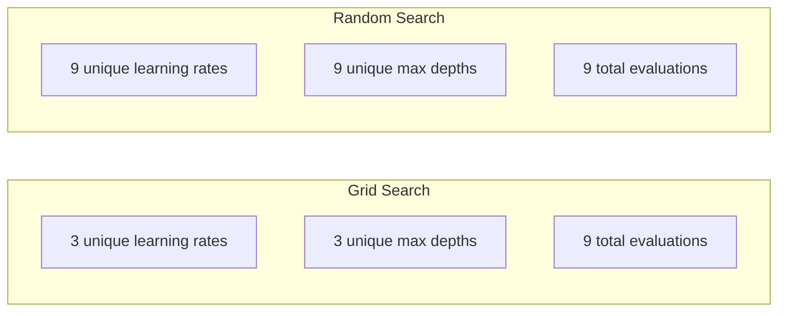
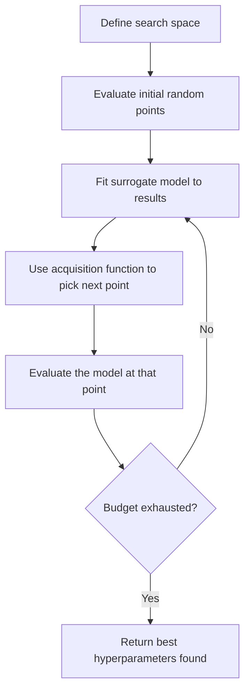
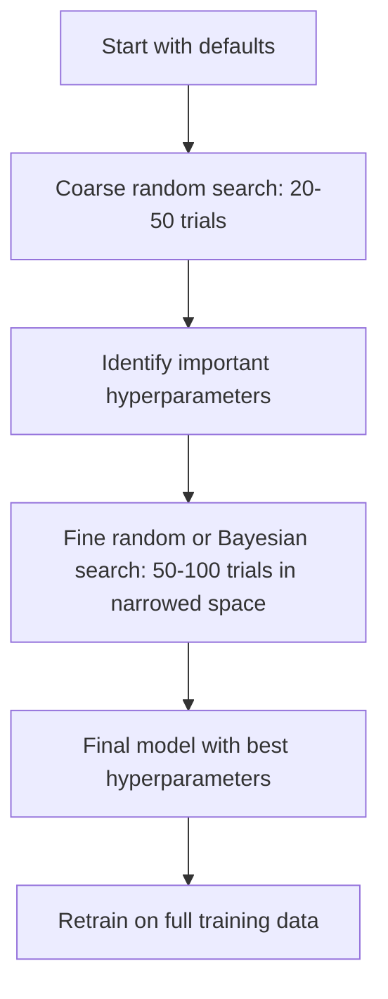
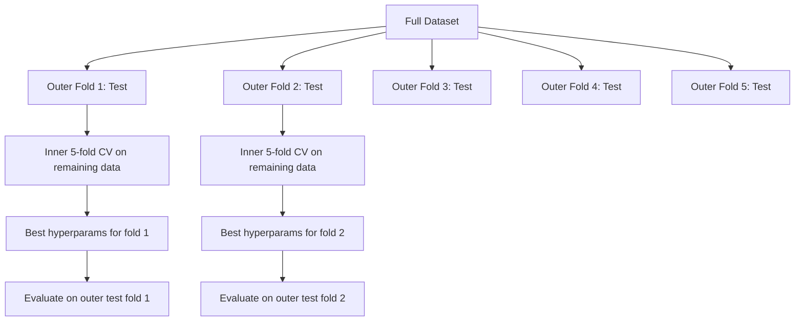

# Hyperparameter Tuning

> 超参数是你在训练开始前转动的旋钮。把它们做好是一个平庸的模型和一个伟大的模型的区别。

** 类型：** 构建
** 语言：** Python
** 先决条件：** 第2阶段，第11课（入学方法）
** 时间：** ~90分钟

## Learning Objectives

- 从头开始实施网格搜索、随机搜索和Bayesian优化并比较其样本效率
- 解释为什么当大多数超参数的有效维度较低时，随机搜索优于网格搜索
- 使用代理模型和获取函数构建Bayesian优化循环来指导搜索
- 设计超参数调优策略，避免通过适当的交叉验证过度匹配验证集

## The Problem

您的梯度增强模型具有学习率、树木数量、最大深度、每叶最小样本、子样本比和列样本比。这是六个超参数。如果每个组合都有5个合理的值，则网格有5#6 = 15，625个组合。每次训练需要10秒。全部尝试需要43小时的计算。

网格搜索是显而易见的方法，也是规模上最糟糕的方法。随机搜索以更少的计算量做得更好。通过从过去的评估中学习，Bayesian优化甚至做得更好。了解使用哪种策略以及哪些超参数实际上很重要，可以节省数天浪费的图形处理器时间。

## The Concept

### Parameters vs Hyperparameters

参数是在训练期间学习的（权重、偏差、分裂阈值）。超参数在训练开始前设置并控制学习的发生方式。

| 超参数 | 它控制什么 | 典型范围 |
|---------------|-----------------|---------------|
| 学习率 | 每次更新的步骤大小 | 0.001至1.0 |
| 树/纪元数量 | 训练多长时间 | 10至10，000 |
| 最大深度 | 模型复杂性 | 1至30 |
| 正规化（Lambda） | 防止过度贴合 | 0.0001至100 |
| 批量 | 梯度估计噪音 | 16至512 |
| 辍学率 | 神经元比例下降 | 0.0至0.5 |

### Grid Search

网格搜索评估指定值的每个组合。它详尽且易于理解，但随着超参数的数量呈指数级扩展。

```
Grid for 2 hyperparameters:

  learning_rate: [0.01, 0.1, 1.0]
  max_depth:     [3, 5, 7]

  Evaluations: 3 x 3 = 9 combinations

  (0.01, 3)  (0.01, 5)  (0.01, 7)
  (0.1,  3)  (0.1,  5)  (0.1,  7)
  (1.0,  3)  (1.0,  5)  (1.0,  7)
```

网格搜索有一个根本缺陷：如果一个超参数重要而另一个不重要，那么大多数评估都被浪费了。您从9个评估中仅获得重要参数的3个唯一值。

### Random Search

随机搜索从分布而不是网格中采样超参数。使用相同的9个评估预算，您可以获得每个超参数的9个唯一值。



为什么随机胜过网格（Bergstra & Bengio，2012）：

- 大多数超参数的有效维度都很低。对于给定的问题，通常只有6个超参数中的1-2个重要。
- 网格搜索浪费了对不重要维度的评估。
- 对于相同的预算，随机搜索可以更密集地覆盖重要维度。
- 在60次随机试验中，您有95%的机会找到最佳值5%内的点（如果搜索空间中存在）。

### Bayesian Optimization

随机搜索会忽略结果。它不知道高学习率会导致分歧，或者深度3始终优于深度10。Bayesian优化使用过去的评估来决定下一步搜索哪里。



两个关键组成部分：

** 替代模型：** 一个易于评估的模型（通常是高斯过程），它逼近昂贵的目标函数。它在搜索空间中的任何点都提供预测和不确定性估计。

** 获取功能：** 通过平衡开发（搜索已知好点附近）和勘探（搜索不确定性高的地方）来决定下一步评估地点。常见选择：

- ** 预期改进（EI）：** 目前我们预计比当前最佳情况改进多少？
- ** 置信上限（UCB）：** 预测加上不确定性的倍数。较高的UCB意味着有希望或未探索。
- ** 改进概率（PI）：** 这个点击败当前最佳点的概率是多少？

Bayesian优化通常比随机搜索找到更好的超参数，评估次数少2- 5倍。与训练实际模型相比，匹配代理模型的费用可以忽略不计。

### Early Stopping

并非每次训练都需要完成。如果配置在10个纪元后明显不好，请停止它并继续前进。这是在超参数搜索的背景下提前停止。

战略：
- ** 基于耐心：** 如果验证损失在N个连续时期内没有改善，则停止
- ** 中位数修剪：** 如果试验的中间结果比同一步骤已完成试验的中位数差，则停止
- **Hyperband：** 为多种配置分配少量预算，然后逐步增加最佳配置的预算

Hyperband特别有效。它从81个配置开始，每个配置有1个纪元，保留前三分之一，给它们3个纪元，保留前三分之一，等等。这比评估全部预算的所有配置快10- 50倍找到好的配置。

### Learning Rate Schedulers

学习率几乎总是最重要的超参数。训练员没有保持固定，而是在训练期间调整它。

| 调度器 | 式 | 何时使用 |
|-----------|---------|-------------|
| 台阶衰变 | 每N个历元乘以0.1 | 经典CNN培训 |
| Cosine退变 | lr * 0.5 *（1 + cos（pi * t / T）） | 现代默认 |
| 热身+衰变 | 线性增加然后cos衰减 | 变压器 |
| 单周 | 在一个周期内增加然后减少 | 快速收敛 |
| 高原期减少 | 指标停滞时按因子减少 | 安全默认 |

### Hyperparameter Importance

并非所有超参数都同等重要。随机森林研究（Probst等人，2019年）和梯度提升显示出一致的模式：

** 高度重要性：**
- 学习率（始终先调整）
- 估计器/历元数量（使用提前停止而不是调整）
- 正则化强度

** 中等重要性：**
- 最大深度/层数
- 每片叶子最少样本/重量衰变
- 子样本比

** 重要性低：**
- 最大功能（适用于随机森林）
- 具体激活功能选择
- 批量（在合理范围内）

首先调整重要的，其余的保留为默认状态。

### Practical Strategy



具体工作流程：

1. ** 从库默认值开始。**他们是由经验丰富的从业者选择的，并且通常80%的成功率。
2. ** 粗略随机搜索。**范围广泛，20-50次试验。使用提前停止来快速消除不良跑步。
3. ** 分析结果。**哪些超参数与性能相关？缩小搜索空间。
4. ** 仔细搜索。** Bayesian优化或在狭窄的空间中集中随机搜索。50-100次试验。
5. ** 使用找到的最佳超参数重新训练所有训练数据 **。

### Cross-Validation Integration

在单个验证拆分上调整超参数是有风险的。最好的超参数可能过度适合特定的验证折叠。嵌套交叉验证通过使用两个循环来解决这个问题：

- ** 外循环 **（评估）：将数据拆分为train+val和Test。报告公正的表现。
- ** 内循环 **（调谐）：将train+val拆分为train和val。找到最佳超参数。



每个外部折叠独立地找到自己的最佳超参数。外部分数是对概括性能的无偏见估计。

使用sklearn：

```python
from sklearn.model_selection import cross_val_score, GridSearchCV
from sklearn.ensemble import GradientBoostingRegressor

inner_cv = GridSearchCV(
    GradientBoostingRegressor(),
    param_grid={
        "learning_rate": [0.01, 0.05, 0.1],
        "max_depth": [2, 3, 5],
        "n_estimators": [50, 100, 200],
    },
    cv=5,
    scoring="neg_mean_squared_error",
)

outer_scores = cross_val_score(
    inner_cv, X, y, cv=5, scoring="neg_mean_squared_error"
)

print(f"Nested CV MSE: {-outer_scores.mean():.4f} +/- {outer_scores.std():.4f}")
```

这很昂贵（5个外折叠x 5个内折叠x 27个网格点= 675个模型适合），但它为您提供了值得信赖的性能估计。在论文中报告最终结果或决策风险很高时使用它。

### Practical Tips

** 从学习率开始。**它始终是基于梯度的方法最重要的超参数。糟糕的学习率使得其他一切都变得无关紧要。默认修复其他超参数并首先扫描学习率。

** 使用log均匀分布来进行学习率和正规化。** 0.001和0.01之间的差异与0.1和1.0之间的差异一样重要。线性搜索会浪费大头的预算。

** 使用提前停止而不是调整n_estimators。**对于增强和神经网络，将n_估计器或epoch设置为高，并让提前停止决定何时停止。这会从搜索中删除一个超参数。

** 预算分配。**将60%的调整预算用于最重要的2个超参数。将剩余的40%花在其他一切上。前两名代表了大部分性能差异。

** 规模很重要。**切勿在日志范围内搜索批量大小（16、32、64也可以）。始终以日志规模搜索学习率。将搜索分布与超参数影响模型的方式进行匹配。

| 模型类型 | 顶级超参数 | 推荐搜索 | 预算 |
|-----------|--------------------|--------------------|--------|
| 随机森林 | n_估计器，max_depth，min_samples_leaf | 随机搜索，50次试验 | 低（快速训练） |
| 梯度提升 | 学习率、n_估计器、max_depth | Bayesian，100次试验+提前停止 | 介质 |
| 神经网络 | learning_rate、weight_decay、batch_size | 贝叶斯或随机，100多项试验 | 高（缓慢训练） |
| SVM | C，gamma（RBS核） | 原木规模网格，25-50次试验 | 低（2个参数） |
| 套索/山脊 | 阿尔法 | 日志规模的1D搜索，20次试验 | 非常低 |
| XGBoost | learning_rate、max_depth、子样本、colsample | Bayesian，100-200次试验+提前停止 | 介质 |

** 有疑问时：** 随机搜索超参数数量的2倍作为试验（例如，6个超参数=至少12个+试验）。您会惊讶地发现，50次尝试的随机搜索比精心设计的网格搜索有多频繁。

## Build It

### Step 1: Grid Search from Scratch

' code/tuning.py&#39;中的代码从头开始实现网格搜索、随机搜索和简单的Bayesian优化器。

```python
def grid_search(model_fn, param_grid, X_train, y_train, X_val, y_val):
    keys = list(param_grid.keys())
    values = list(param_grid.values())
    best_score = -float("inf")
    best_params = None
    n_evals = 0

    for combo in itertools.product(*values):
        params = dict(zip(keys, combo))
        model = model_fn(**params)
        model.fit(X_train, y_train)
        score = evaluate(model, X_val, y_val)
        n_evals += 1

        if score > best_score:
            best_score = score
            best_params = params

    return best_params, best_score, n_evals
```

### Step 2: Random Search from Scratch

```python
def random_search(model_fn, param_distributions, X_train, y_train,
                  X_val, y_val, n_iter=50, seed=42):
    rng = np.random.RandomState(seed)
    best_score = -float("inf")
    best_params = None

    for _ in range(n_iter):
        params = {k: sample(v, rng) for k, v in param_distributions.items()}
        model = model_fn(**params)
        model.fit(X_train, y_train)
        score = evaluate(model, X_val, y_val)

        if score > best_score:
            best_score = score
            best_params = params

    return best_params, best_score, n_iter
```

### Step 3: Bayesian Optimization (Simplified)

核心思想：将高斯过程与观察到的（超参数、评分）对匹配，然后使用获取函数来决定下一步在哪里进行查找。

```python
class SimpleBayesianOptimizer:
    def __init__(self, search_space, n_initial=5):
        self.search_space = search_space
        self.n_initial = n_initial
        self.X_observed = []
        self.y_observed = []

    def _kernel(self, x1, x2, length_scale=1.0):
        dists = np.sum((x1[:, None, :] - x2[None, :, :]) ** 2, axis=2)
        return np.exp(-0.5 * dists / length_scale ** 2)

    def _fit_gp(self, X_new):
        X_obs = np.array(self.X_observed)
        y_obs = np.array(self.y_observed)
        y_mean = y_obs.mean()
        y_centered = y_obs - y_mean

        K = self._kernel(X_obs, X_obs) + 1e-4 * np.eye(len(X_obs))
        K_star = self._kernel(X_new, X_obs)

        L = np.linalg.cholesky(K)
        alpha = np.linalg.solve(L.T, np.linalg.solve(L, y_centered))
        mu = K_star @ alpha + y_mean

        v = np.linalg.solve(L, K_star.T)
        var = 1.0 - np.sum(v ** 2, axis=0)
        var = np.maximum(var, 1e-6)

        return mu, var

    def _expected_improvement(self, mu, var, best_y):
        sigma = np.sqrt(var)
        z = (mu - best_y) / (sigma + 1e-10)
        ei = sigma * (z * norm_cdf(z) + norm_pdf(z))
        return ei

    def suggest(self):
        if len(self.X_observed) < self.n_initial:
            return sample_random(self.search_space)

        candidates = [sample_random(self.search_space) for _ in range(500)]
        X_cand = np.array([to_vector(c) for c in candidates])
        mu, var = self._fit_gp(X_cand)
        ei = self._expected_improvement(mu, var, max(self.y_observed))
        return candidates[np.argmax(ei)]

    def observe(self, params, score):
        self.X_observed.append(to_vector(params))
        self.y_observed.append(score)
```

全科医生代理在每个候选点给出两件事：预测分数（μ）和不确定性（var）。预期改进平衡了这些：它有利于模型预测高分或不确定性较高的点。早期，大多数点都具有很高的不确定性，因此优化器会进行探索。后来，它重点关注最有前途的地区。

### Step 4: Compare All Methods

在同一合成目标上运行所有三种方法并进行比较。此比较使用简化的包装器，该包装器通过直接目标函数（无需模型训练）调用每个优化器，因此API与上面基于模型的实现不同：

```python
def synthetic_objective(params):
    lr = params["learning_rate"]
    depth = params["max_depth"]
    return -(np.log10(lr) + 2) ** 2 - (depth - 4) ** 2 + 10

param_grid = {
    "learning_rate": [0.001, 0.01, 0.1, 1.0],
    "max_depth": [2, 3, 4, 5, 6, 7, 8],
}

grid_best = None
grid_score = -float("inf")
grid_history = []
for combo in itertools.product(*param_grid.values()):
    params = dict(zip(param_grid.keys(), combo))
    score = synthetic_objective(params)
    grid_history.append((params, score))
    if score > grid_score:
        grid_score = score
        grid_best = params

param_dist = {
    "learning_rate": ("log_float", 0.001, 1.0),
    "max_depth": ("int", 2, 8),
}

rand_best = None
rand_score = -float("inf")
rand_history = []
rng = np.random.RandomState(42)
for _ in range(28):
    params = {k: sample(v, rng) for k, v in param_dist.items()}
    score = synthetic_objective(params)
    rand_history.append((params, score))
    if score > rand_score:
        rand_score = score
        rand_best = params

optimizer = SimpleBayesianOptimizer(param_dist, n_initial=5)
bayes_history = []
for _ in range(28):
    params = optimizer.suggest()
    score = synthetic_objective(params)
    optimizer.observe(params, score)
    bayes_history.append((params, score))
bayes_score = max(s for _, s in bayes_history)

print(f"{'Method':<20} {'Best Score':>12} {'Evaluations':>12}")
print("-" * 50)
print(f"{'Grid Search':<20} {grid_score:>12.4f} {len(grid_history):>12}")
print(f"{'Random Search':<20} {rand_score:>12.4f} {len(rand_history):>12}")
print(f"{'Bayesian Opt':<20} {bayes_score:>12.4f} {len(bayes_history):>12}")
```

在相同的预算下，Bayesian优化通常最快地找到最佳分数，因为它不会在明显较差的地区浪费评估。随机搜索比网格搜索覆盖的范围更多。只有当超参数很少并且能够进行详尽搜索时，网格搜索才会获胜。

## Use It

### Optuna in Practice

Optuna是进行严肃超参数调优的推荐库。它支持修剪、分布式搜索和开箱即用的可视化。

```python
import optuna

def objective(trial):
    lr = trial.suggest_float("learning_rate", 1e-4, 1e-1, log=True)
    n_est = trial.suggest_int("n_estimators", 50, 500)
    max_depth = trial.suggest_int("max_depth", 2, 10)

    model = GradientBoostingRegressor(
        learning_rate=lr,
        n_estimators=n_est,
        max_depth=max_depth,
    )
    model.fit(X_train, y_train)
    return mean_squared_error(y_val, model.predict(X_val))

study = optuna.create_study(direction="minimize")
study.optimize(objective, n_trials=100)

print(f"Best params: {study.best_params}")
print(f"Best MSE: {study.best_value:.4f}")
```

Optuna的主要功能：
- ' sught_float（.，log=True）'对于在log标度上搜索得最好的参数（学习率、正规化）
- “sugght_int”用于integer参数
- 针对离散选择的“such_category”
- 内置MedianPruner，用于提前停止不良试验
- ' study.trials_rame（）'进行分析

### Optuna with Pruning

修剪可以提前停止毫无希望的试验，节省大量计算。模式如下：

```python
import optuna
from sklearn.model_selection import cross_val_score

def objective(trial):
    params = {
        "learning_rate": trial.suggest_float("lr", 1e-4, 0.5, log=True),
        "max_depth": trial.suggest_int("max_depth", 2, 10),
        "n_estimators": trial.suggest_int("n_estimators", 50, 500),
        "subsample": trial.suggest_float("subsample", 0.5, 1.0),
    }

    model = GradientBoostingRegressor(**params)
    scores = cross_val_score(model, X_train, y_train, cv=3,
                             scoring="neg_mean_squared_error")
    mean_score = -scores.mean()

    trial.report(mean_score, step=0)
    if trial.should_prune():
        raise optuna.TrialPruned()

    return mean_score

pruner = optuna.pruners.MedianPruner(n_startup_trials=10, n_warmup_steps=5)
study = optuna.create_study(direction="minimize", pruner=pruner)
study.optimize(objective, n_trials=200)
```

如果试验的中间值低于同一步骤所有已完成试验的中位数，则“MedianPruner”将停止试验。修剪需要调用“trial.report（）”来报告中间指标，并调用“trial.should_prune（）”来检查是否应该停止试验。' n_startup_trials=10 '确保在修剪开始之前完全完成至少10次试验。这通常可以节省总计算量的40-60%。

### sklearn's Built-in Tuners

为了快速实验，sklearn提供了`GridSearchCV`、`RandomizedSearchCV`和`HalvingRandomSearchCV`：

```python
from sklearn.model_selection import RandomizedSearchCV
from scipy.stats import loguniform, randint

param_dist = {
    "learning_rate": loguniform(1e-4, 0.5),
    "max_depth": randint(2, 10),
    "n_estimators": randint(50, 500),
}

search = RandomizedSearchCV(
    GradientBoostingRegressor(),
    param_dist,
    n_iter=100,
    cv=5,
    scoring="neg_mean_squared_error",
    random_state=42,
    n_jobs=-1,
)
search.fit(X_train, y_train)
print(f"Best params: {search.best_params_}")
print(f"Best CV MSE: {-search.best_score_:.4f}")
```

使用scipy中的“logunifle”来获取学习率和正规化。将“randint”用于integer超参数。' n_jobs=-1 '标志跨所有中央处理器核心并行化。

### Common Mistakes in Hyperparameter Tuning

** 预处理导致数据泄露。**如果在交叉验证之前在完整数据集上安装缩放器，则验证文件夹中的信息就会泄露到训练中。始终将预处理放入“Pipeline”中，这样它只适合训练折叠。

** 过度适应验证集。**运行数千次试验有效地训练验证集。使用嵌套交叉验证进行最终性能估计，或者保留您在调优期间从未接触的单独测试集。

** 搜索范围太窄。**如果您的最佳价值位于搜索空间的边界，那么您的搜索范围还不够广泛。最佳值可能超出您的范围。始终检查最佳参数是否位于边缘。

** 忽略互动效应。**学习率和估计器数量在提升中相互作用强烈。低学习率需要更多的估计器。独立调整它们比一起调整它们的结果更差。

** 不对迭代模型使用提前停止。**对于梯度增强和神经网络，将n_estimator或epoch设置为高值并使用早期停止。这比将迭代次数作为超参数调整要好。

## Exercises

1. 使用相同的总预算运行网格搜索和随机搜索（例如，50项评价）。用不同的种子做10次实验，比较最好的分数。随机搜索有多少次会赢？

2. 从头开始实施Hyperband。从81种配置开始，每个配置训练1个纪元。保持每轮前1/3的席位，并将预算增加三倍。将总计算（所有时间段的所有历元之和）与全预算运行81时间段进行比较。

3. 向第11课的梯度提升实现中添加学习率调度器（Cosine anneal）。与固定学习率相比，它有帮助吗？

4. 使用Optuna在真实数据集上调整RandomForestClassifier（例如，sklearn的乳腺癌数据集）。使用“optuna. visuality.plot_param_importance（study）”来查看哪些超参数最重要。它是否与本课的重要性排名相匹配？

5. 实施简单的获取功能（预期改进）并演示探索与利用。绘制代理模型的平均值和不确定性，并显示EI选择下一步评估的位置。

## Key Terms

| Term | 别人怎么说 | 它实际上意味着什么 |
|------|----------------|----------------------|
| 超参数 | “您选择的设置” | 训练前设定的值，控制学习过程，而不是从数据中学习 |
| 网格搜索 | “尝试每种组合” | 在指定参数网格上进行详尽搜索。指数成本。 |
| 随机搜索 | “随机抽样即可” | 来自分布的超参数示例。比网格搜索更好地涵盖重要维度。 |
| 贝叶斯优化 | “智能搜索” | 使用目标的代理模型来决定下一步评估地点，平衡勘探和开发 |
| 代理模型 | “廉价的近似值” | 一个模型（通常是高斯过程），从观察到的评估中近似昂贵的目标函数 |
| 采集功能 | “接下来去哪里看” | 通过平衡预期的改进与不确定性来获得候选分数。EI和UCB是常见的选择。 |
| 提前停止 | “别浪费时间了” | 当验证性能停止改善时，提前终止培训 |
| Hyperband | “10年代的锦标赛范围” | 自适应资源分配：以小预算启动许多企业，保留最好的并增加预算 |
| 学习率调度器 | “训练期间更改lr” | 在训练过程中调整学习率以实现更好的收敛的功能 |

## Further Reading

- [伯格斯特拉和本吉奥：超参数优化随机搜索（2012）]（https：//jmlr.org/papers/v13/bergstra12a.html）--展示随机节拍网格的论文
- [Snoek等人，机器学习算法的实用Bayesian优化（2012）]（https：//arxiv.org/ab/1206.2944）--ML的Bayesian优化
- [Li等人，Hyperband：一种基于盗贼的新颖方法（2018）]（https：//jmlr.org/papers/v18/16-558.html）--Hyperband论文
- [Optuna：下一代超参数优化框架]（https：//arxiv.org/ab/1907.10902）--Optuna论文
- [普罗布斯特等人，可调性：超参数的重要性（2019）]（https：//jmlr.org/papers/v20/18-444.html）--哪些超参数重要
