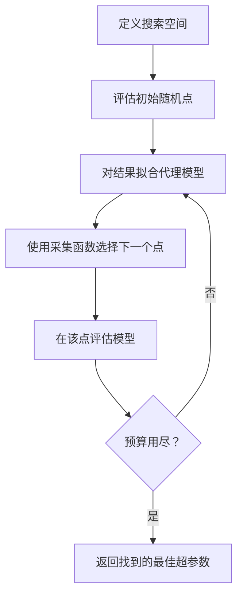
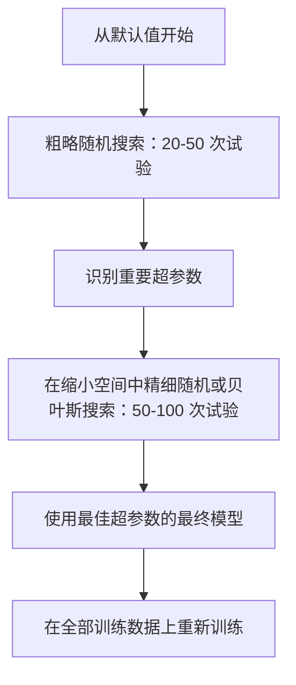
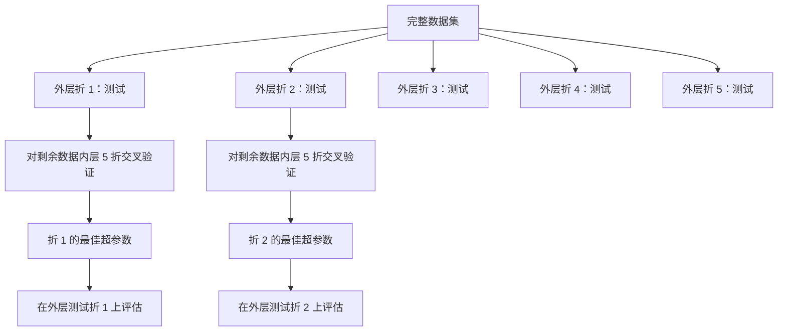

# 超参数调优

> 超参数是你在训练开始前调节的旋钮。调节得当是平庸模型与优秀模型之间的差距。

**类型：** 构建
**语言：** Python
**前置条件：** 第 2 阶段，第 11 课（集成方法）
**时间：** ~90 分钟

## 学习目标

- 从头实现网格搜索、随机搜索和贝叶斯优化，并比较它们的样本效率
- 解释为什么当大多数超参数具有低有效维度时，随机搜索优于网格搜索
- 使用代理模型（Surrogate Model）和采集函数（Acquisition Function）构建贝叶斯优化循环以指导搜索
- 设计一种超参数调优策略，通过适当的交叉验证避免对验证集的过拟合

## 问题

你的梯度提升模型有学习率、树的数量、最大深度、每片叶子最小样本数、子采样比例和列采样比例。这是六个超参数。如果每个有 5 个合理值，网格就有 5^6 = 15,625 种组合。每次训练需要 10 秒。全部尝试需要 43 小时的计算时间。

网格搜索是显而易见的方法，但在规模上是最糟糕的。随机搜索在更少的计算量下做得更好。贝叶斯优化通过从过去的评估中学习，做得更好。知道使用哪种策略，以及哪些超参数真正重要，可以节省数天的 GPU 时间浪费。

## 概念

### 参数 vs 超参数

参数是在训练过程中学习的（权重、偏置、分裂阈值）。超参数在训练开始前设定，控制学习过程如何发生。

| 超参数 | 控制内容 | 典型范围 |
|--------|----------|----------|
| 学习率 | 每次更新的步长 | 0.001 到 1.0 |
| 树的数量 / 轮数 | 训练多长时间 | 10 到 10,000 |
| 最大深度 | 模型复杂度 | 1 到 30 |
| 正则化（lambda） | 过拟合预防 | 0.0001 到 100 |
| 批大小 | 梯度估计噪声 | 16 到 512 |
| 丢弃率 | 丢弃神经元的比例 | 0.0 到 0.5 |

### 网格搜索

网格搜索评估指定值的每种组合。它详尽且易于理解，但随超参数数量呈指数增长。

```
2 个超参数的网格：

  learning_rate: [0.01, 0.1, 1.0]
  max_depth:     [3, 5, 7]

  评估次数：3 x 3 = 9 种组合

  (0.01, 3)  (0.01, 5)  (0.01, 7)
  (0.1,  3)  (0.1,  5)  (0.1,  7)
  (1.0,  3)  (1.0,  5)  (1.0,  7)
```

网格搜索有一个根本缺陷：如果一个超参数重要而另一个不重要，大多数评估都被浪费了。从 9 次评估中你只得到重要参数的 3 个唯一值。

### 随机搜索

随机搜索从分布中采样超参数，而不是网格。使用相同的 9 次评估预算，你得到每个超参数的 9 个唯一值。


为什么随机优于网格（Bergstra & Bengio, 2012）：

- 大多数超参数具有低有效维度。对于给定问题，6 个超参数中通常只有 1-2 个真正重要。
- 网格搜索在不重要的维度上浪费评估。
- 随机搜索在相同预算下更密集地覆盖重要维度。
- 在 60 次随机试验中，你有 95% 的几率找到在最优值 5% 范围内的点（如果搜索空间中存在最优值）。

### 贝叶斯优化

随机搜索忽略结果。它没有学习到高学习率会导致发散，或者深度 3 始终优于深度 10。贝叶斯优化利用过去的评估来决定下一步搜索哪里。



两个关键组件：

**代理模型：** 一个评估成本低的模型（通常为高斯过程），用于近似昂贵的目标函数。它在搜索空间中的任何点都同时给出预测和不确定性估计。

**采集函数：** 通过平衡利用（exploitation，在已知好点附近搜索）和探索（exploration，在不确定性高的区域搜索）来决定下一步评估哪里。常见选择：

- **期望提升（Expected Improvement, EI）：** 在该点我们期望比当前最佳值改进多少？
- **上置信界（Upper Confidence Bound, UCB）：** 预测值加上倍数的不确定性。较高的 UCB 意味着要么有前景要么尚未探索。
- **提升概率（Probability of Improvement, PI）：** 该点优于当前最佳值的概率是多少？

贝叶斯优化通常比随机搜索少用 2-5 倍的评估次数就能找到更好的超参数。拟合代理模型的开销与训练实际模型相比可以忽略不计。

### 早停

并非每次训练都需要跑完。如果某个配置在 10 个 epoch 后明显很糟糕，就停止它，继续下一个。这就是超参数搜索中的早停。

策略：
- **基于耐心：** 如果验证损失连续 N 个 epoch 没有改善，则停止
- **中位数剪枝：** 如果试验的中间结果比同一步已完成试验的中位数更差，则停止
- **Hyperband：** 为许多配置分配少量预算，然后逐步为最佳配置增加预算

Hyperband 特别有效。它从 81 个配置开始，每个跑 1 个 epoch，保留前三分之一，给它们 3 个 epoch，再保留前三分之一，以此类推。这比所有配置跑满预算快 10-50 倍找到好的配置。

### 学习率调度器

学习率几乎总是最重要的超参数。与其保持固定，调度器在训练过程中对其进行调整。

| 调度器 | 公式 | 何时使用 |
|--------|------|----------|
| 步进衰减 | 每 N 个 epoch 乘以 0.1 | 经典 CNN 训练 |
| 余弦退火 | lr * 0.5 * (1 + cos(pi * t / T)) | 现代默认 |
| 预热 + 衰减 | 线性增加然后余弦衰减 | Transformer |
| 单周期 | 在一个周期内先增加后减少 | 快速收敛 |
| 平台衰减 | 当指标停滞时按因子减少 | 安全默认 |

### 超参数重要性

并非所有超参数同等重要。对随机森林（Probst 等人，2019）和梯度提升的研究显示出一致的模式：

**高重要性：**
- 学习率（总是先调节）
- 估计器数量 / epoch（用早停代替调优）
- 正则化强度

**中等重要性：**
- 最大深度 / 层数
- 每片叶子最小样本数 / 权重衰减
- 子采样比例

**低重要性：**
- 最大特征数（针对随机森林）
- 具体激活函数选择
- 批大小（在合理范围内）

先调节重要的超参数，其余的保留默认值。

### 实用策略



具体工作流程：

1. **从库的默认值开始。** 它们是由经验丰富的从业人员选择的，通常能达到 80% 的效果。
2. **粗略随机搜索。** 宽范围，20-50 次试验。使用早停快速终止差的运行。
3. **分析结果。** 哪些超参数与性能相关？缩小搜索空间。
4. **精细搜索。** 在缩小空间中使用贝叶斯优化或聚焦随机搜索。50-100 次试验。
5. **在全部训练数据上重新训练**，使用找到的最佳超参数。

### 交叉验证集成

在单个验证集上调节超参数是有风险的。最佳超参数可能过拟合到特定的验证折。嵌套交叉验证通过使用两个循环来解决这个问题：

- **外层循环（评估）：** 将数据分为训练+验证和测试。报告无偏性能。
- **内层循环（调优）：** 将训练+验证分为训练和验证。找到最佳超参数。



每个外层折独立找到自己的最佳超参数。外层分数是对泛化性能的无偏估计。

使用 sklearn：

```python
from sklearn.model_selection import cross_val_score, GridSearchCV
from sklearn.ensemble import GradientBoostingRegressor

inner_cv = GridSearchCV(
    GradientBoostingRegressor(),
    param_grid={
        "learning_rate": [0.01, 0.05, 0.1],
        "max_depth": [2, 3, 5],
        "n_estimators": [50, 100, 200],
    },
    cv=5,
    scoring="neg_mean_squared_error",
)

outer_scores = cross_val_score(
    inner_cv, X, y, cv=5, scoring="neg_mean_squared_error"
)

print(f"Nested CV MSE: {-outer_scores.mean():.4f} +/- {outer_scores.std():.4f}")
```

这很昂贵（5 个外层折 x 5 个内层折 x 27 个网格点 = 675 个模型拟合），但它给出了可信的性能估计。在论文中报告最终结果或决策风险较高时使用它。

### 实用技巧

**从学习率开始。** 对于基于梯度的方法，它总是最重要的超参数。糟糕的学习率会让其他一切无关紧要。将其他超参数固定为默认值，先扫描学习率。

**对学习率和正则化使用对数均匀分布。** 0.001 与 0.01 之间的差异与 0.1 与 1.0 之间的差异同等重要。线性搜索会浪费预算在大端。

**使用早停而不是调节 n_estimators。** 对于提升树和神经网络，将 n_estimators 或 epoch 设为高值，让早停决定何时停止。这样从搜索中移除一个超参数。

**预算分配。** 将调优预算的 60% 用于最重要的前两个超参数。剩余 40% 用于其他所有。前两个超参数占据了大部分性能变化。

**规模很重要。** 永远不要在对数尺度上搜索批大小（16, 32, 64 就很好）。始终在对数尺度上搜索学习率。将搜索分布与超参数对模型的影响方式相匹配。

| 模型类型 | 首要超参数 | 推荐搜索方式 | 预算 |
|----------|------------|--------------|------|
| 随机森林 | n_estimators, max_depth, min_samples_leaf | 随机搜索，50 次试验 | 低（训练快） |
| 梯度提升 | learning_rate, n_estimators, max_depth | 贝叶斯，100 次试验 + 早停 | 中 |
| 神经网络 | learning_rate, weight_decay, batch_size | 贝叶斯或随机，100+ 次试验 | 高（训练慢） |
| SVM | C, gamma（RBF 核） | 对数尺度网格，25-50 次试验 | 低（2 个参数） |
| Lasso/Ridge | alpha | 对数尺度一维搜索，20 次试验 | 非常低 |
| XGBoost | learning_rate, max_depth, subsample, colsample | 贝叶斯，100-200 次试验 + 早停 | 中 |

**有疑问时：** 随机搜索，试验次数为超参数数量的 2 倍（例如，6 个超参数至少 12 次试验）。你会惊讶于 50 次试验的随机搜索常常击败精心设计的网格搜索。

## 动手构建

### 步骤 1：从头实现网格搜索

代码在 `code/tuning.py` 中，从头实现了网格搜索、随机搜索和简单的贝叶斯优化器。

```python
def grid_search(model_fn, param_grid, X_train, y_train, X_val, y_val):
    keys = list(param_grid.keys())
    values = list(param_grid.values())
    best_score = -float("inf")
    best_params = None
    n_evals = 0

    for combo in itertools.product(*values):
        params = dict(zip(keys, combo))
        model = model_fn(**params)
        model.fit(X_train, y_train)
        score = evaluate(model, X_val, y_val)
        n_evals += 1

        if score > best_score:
            best_score = score
            best_params = params

    return best_params, best_score, n_evals
```

### 步骤 2：从头实现随机搜索

```python
def random_search(model_fn, param_distributions, X_train, y_train,
                  X_val, y_val, n_iter=50, seed=42):
    rng = np.random.RandomState(seed)
    best_score = -float("inf")
    best_params = None

    for _ in range(n_iter):
        params = {k: sample(v, rng) for k, v in param_distributions.items()}
        model = model_fn(**params)
        model.fit(X_train, y_train)
        score = evaluate(model, X_val, y_val)

        if score > best_score:
            best_score = score
            best_params = params

    return best_params, best_score, n_iter
```

### 步骤 3：贝叶斯优化（简化版）

核心思想：将高斯过程拟合到观察到的（超参数，分数）对，然后使用采集函数决定下一步看哪里。

```python
class SimpleBayesianOptimizer:
    def __init__(self, search_space, n_initial=5):
        self.search_space = search_space
        self.n_initial = n_initial
        self.X_observed = []
        self.y_observed = []

    def _kernel(self, x1, x2, length_scale=1.0):
        dists = np.sum((x1[:, None, :] - x2[None, :, :]) ** 2, axis=2)
        return np.exp(-0.5 * dists / length_scale ** 2)

    def _fit_gp(self, X_new):
        X_obs = np.array(self.X_observed)
        y_obs = np.array(self.y_observed)
        y_mean = y_obs.mean()
        y_centered = y_obs - y_mean

        K = self._kernel(X_obs, X_obs) + 1e-4 * np.eye(len(X_obs))
        K_star = self._kernel(X_new, X_obs)

        L = np.linalg.cholesky(K)
        alpha = np.linalg.solve(L.T, np.linalg.solve(L, y_centered))
        mu = K_star @ alpha + y_mean

        v = np.linalg.solve(L, K_star.T)
        var = 1.0 - np.sum(v ** 2, axis=0)
        var = np.maximum(var, 1e-6)

        return mu, var

    def _expected_improvement(self, mu, var, best_y):
        sigma = np.sqrt(var)
        z = (mu - best_y) / (sigma + 1e-10)
        ei = sigma * (z * norm_cdf(z) + norm_pdf(z))
        return ei

    def suggest(self):
        if len(self.X_observed) < self.n_initial:
            return sample_random(self.search_space)

        candidates = [sample_random(self.search_space) for _ in range(500)]
        X_cand = np.array([to_vector(c) for c in candidates])
        mu, var = self._fit_gp(X_cand)
       