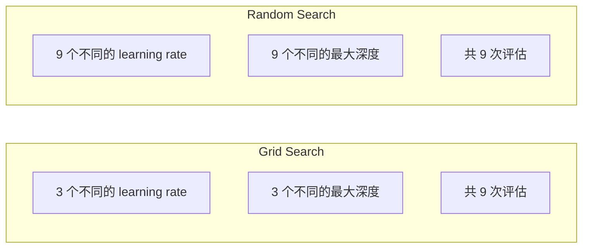
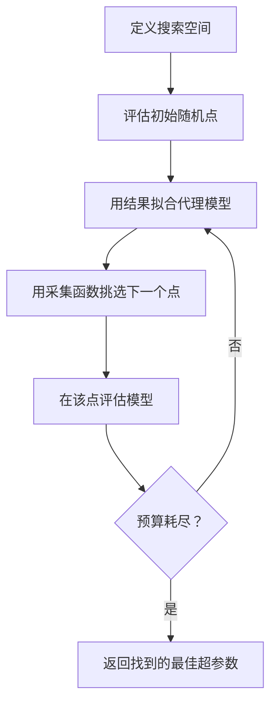
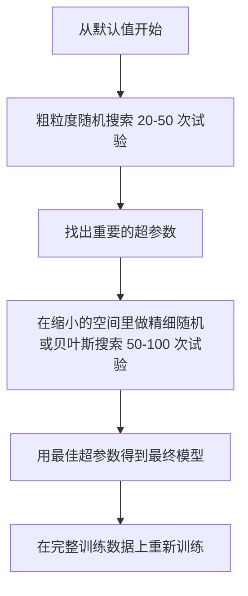

# 超参数调优（Hyperparameter Tuning）

> 译注：本文译自同目录 [`en.md`](./en.md)。术语遵循仓根 [TRANSLATION_GUIDE.md](../../../../TRANSLATION_GUIDE.md)。

> 超参数（hyperparameter）是训练开始前你要旋的旋钮。旋得好不好，就是平庸模型和优秀模型之间的差距。

**Type:** Build
**Language:** Python
**Prerequisites:** Phase 2, Lesson 11 (Ensemble Methods)
**Time:** ~90 minutes

## 学习目标（Learning Objectives）

- 从零实现 grid search、random search 和 Bayesian optimization（贝叶斯优化），并比较它们的样本效率
- 解释为什么当大多数超参数有效维度较低时，random search 会优于 grid search
- 用 surrogate model（代理模型）和 acquisition function（采集函数）搭一个 Bayesian optimization 循环来引导搜索
- 设计一个超参数调优策略，通过合理的交叉验证（cross-validation）避免过拟合到验证集

## 问题（The Problem）

你的 gradient boosting 模型有 learning rate、树的数量、最大深度（max depth）、叶节点最小样本数、行采样比、列采样比。这就是六个超参数。如果每个有 5 个合理取值，网格就是 5^6 = 15,625 种组合。每个训练 10 秒，跑完全部要 43 小时算力。

Grid search 是最直觉的做法，也是规模化时最差的。Random search 用更少算力就能做得更好。Bayesian optimization 通过从过往评估中学习又能再进一步。知道该用哪种策略、知道哪些超参数真正重要，能帮你省下好几天的 GPU 时间。

## 概念（The Concept）

### 参数 vs 超参数（Parameters vs Hyperparameters）

参数是训练中学到的（权重、偏置、分裂阈值）。超参数是训练开始前设好的，控制学习的方式。

| 超参数 | 控制什么 | 典型范围 |
|---------------|-----------------|---------------|
| Learning rate | 每次更新的步长 | 0.001 到 1.0 |
| 树/epoch 数量 | 训练多久 | 10 到 10,000 |
| Max depth | 模型复杂度 | 1 到 30 |
| 正则化（lambda） | 防止过拟合 | 0.0001 到 100 |
| Batch size | 梯度估计噪声 | 16 到 512 |
| Dropout 比例 | 被丢弃的神经元比例 | 0.0 到 0.5 |

### Grid Search（网格搜索）

Grid search 评估指定取值的每一种组合。它穷尽且易懂，但对超参数数量呈指数增长。

```
Grid for 2 hyperparameters:

  learning_rate: [0.01, 0.1, 1.0]
  max_depth:     [3, 5, 7]

  Evaluations: 3 x 3 = 9 combinations

  (0.01, 3)  (0.01, 5)  (0.01, 7)
  (0.1,  3)  (0.1,  5)  (0.1,  7)
  (1.0,  3)  (1.0,  5)  (1.0,  7)
```

Grid search 有个根本性缺陷：如果其中一个超参数重要而另一个不重要，大多数评估就被浪费了。9 次评估里，你只拿到了 3 个不同的重要参数取值。

### Random Search（随机搜索）

Random search 从分布里采样超参数，而不是从网格里取。同样 9 次评估的预算下，你能拿到每个超参数 9 个不同的取值。



为什么随机能赢过网格（Bergstra & Bengio, 2012）：

- 大多数超参数有效维度低。给定问题里通常只有 6 个超参数中的 1-2 个真正重要。
- Grid search 把评估浪费在不重要的维度上。
- 同样预算下，random search 在重要维度上覆盖更密。
- 60 次随机试验时，你有 95% 的概率找到一个落在最优值 5% 邻域内的点（前提是最优值落在搜索空间里）。

### Bayesian Optimization（贝叶斯优化）

Random search 不看结果。它不会学到「高 learning rate 会发散」或「深度 3 一直比深度 10 强」。Bayesian optimization 用过去的评估来决定接下来去哪儿搜。



两个关键组件：

**Surrogate model（代理模型）：** 一个评估代价低的模型（通常是 Gaussian process，高斯过程），用来近似昂贵的目标函数。它在搜索空间任意一点都能给出预测值和不确定度估计。

**Acquisition function（采集函数）：** 通过权衡 exploitation（开发，搜索已知好点附近）和 exploration（探索，搜索不确定度高的地方），决定下一个评估在哪儿。常见选择：

- **Expected Improvement (EI)：** 在这一点上，相对当前最优值我们期望能改进多少？
- **Upper Confidence Bound (UCB)：** 预测值加上不确定度的若干倍。UCB 越高，要么有希望要么没探索过。
- **Probability of Improvement (PI)：** 这一点超过当前最优的概率是多少？

Bayesian optimization 通常能用 random search 的 1/2 到 1/5 的评估次数找到更好的超参数。拟合 surrogate model 的开销，跟训练实际模型相比可以忽略。

### Early Stopping（提前停止）

不是每次训练都得跑完。如果一个配置在 10 个 epoch 之后就明显很糟，停掉、换下一个。这就是超参数搜索语境下的 early stopping。

策略：
- **Patience-based（基于耐心值）：** 如果验证损失连续 N 个 epoch 没改进就停
- **Median pruning（中位数剪枝）：** 如果该 trial 在同一步上的中间结果比已完成 trial 的中位数还差，就停
- **Hyperband：** 给很多配置分配很少的预算，然后逐步给最好的那些加预算

Hyperband 特别有效。它先给 81 个配置每个 1 个 epoch，留前 1/3，给它们 3 个 epoch，再留前 1/3，依此类推。这能比让所有配置跑满预算快 10-50 倍找到好配置。

### Learning Rate 调度器（Learning Rate Schedulers）

Learning rate 几乎一直是最重要的超参数。调度器不是把它固定下来，而是在训练过程中调整。

| 调度器 | 公式 | 何时使用 |
|-----------|---------|-------------|
| Step decay | 每 N 个 epoch 乘以 0.1 | 经典 CNN 训练 |
| Cosine annealing | lr * 0.5 * (1 + cos(pi * t / T)) | 现代默认选择 |
| Warmup + decay | 先线性上升再余弦衰减 | Transformers |
| One-cycle | 一个周期里先升再降 | 快速收敛 |
| Reduce on plateau | 指标停滞时按因子缩小 | 安全的默认选择 |

### 超参数重要性（Hyperparameter Importance）

并不是所有超参数都同样重要。关于随机森林（Probst et al., 2019）和 gradient boosting 的研究都显示出一致的模式：

**高重要性：**
- Learning rate（永远先调它）
- Estimator / epoch 数量（用 early stopping 替代调参）
- 正则化强度

**中等重要性：**
- Max depth / 层数
- 叶节点最小样本数 / 权重衰减
- 行采样比

**低重要性：**
- Max features（针对随机森林）
- 具体的激活函数选择
- Batch size（合理范围内）

先调重要的，其他保持默认。

### 实战策略（Practical Strategy）



具体流程：

1. **从库的默认值开始。** 这些值是有经验的从业者选的，通常已经走完了 80% 的路。
2. **粗粒度 random search。** 范围放宽，20-50 次试验。用 early stopping 快速干掉坏 run。
3. **分析结果。** 哪些超参数与性能相关？把搜索空间收窄。
4. **细粒度搜索。** 在收窄的空间里做 Bayesian optimization 或聚焦的 random search。50-100 次试验。
5. **用最好的超参数在所有训练数据上重训。**

### 整合交叉验证（Cross-Validation Integration）

只在单一验证集划分上调超参数是有风险的。最好的超参数可能过拟合到那个特定的验证 fold。嵌套交叉验证（nested cross-validation）通过两层循环解决这个问题：

- **外循环**（评估）：把数据切成 train+val 和 test。给出无偏的性能估计。
- **内循环**（调参）：把 train+val 切成 train 和 val。找最佳超参数。


每个外层 fold 独立找自己的最佳超参数。外层得分就是泛化性能的无偏估计。

用 sklearn：

```python
from sklearn.model_selection import cross_val_score, GridSearchCV
from sklearn.ensemble import GradientBoostingRegressor

inner_cv = GridSearchCV(
    GradientBoostingRegressor(),
    param_grid={
        "learning_rate": [0.01, 0.05, 0.1],
        "max_depth": [2, 3, 5],
        "n_estimators": [50, 100, 200],
    },
    cv=5,
    scoring="neg_mean_squared_error",
)

outer_scores = cross_val_score(
    inner_cv, X, y, cv=5, scoring="neg_mean_squared_error"
)

print(f"Nested CV MSE: {-outer_scores.mean():.4f} +/- {outer_scores.std():.4f}")
```

这成本很高（5 个外层 fold × 5 个内层 fold × 27 个网格点 = 675 次模型拟合），但能给你一个可信的性能估计。在论文里报告最终结果，或者决策代价很高时，就用它。

### 实战 Tips（Practical Tips）

**先调 learning rate。** 对基于梯度的方法来说，它永远是最重要的超参数。Learning rate 不对，其他怎么调都没用。先把其他超参数固定为默认，单独扫 learning rate。

**对 learning rate 和正则化用 log-uniform 分布。** 0.001 到 0.01 的差距，跟 0.1 到 1.0 的差距一样大。线性搜索会把预算浪费在大值那一端。

**用 early stopping 而不是去调 n_estimators。** 对 boosting 和神经网络，把 n_estimators 或 epoch 设大，让 early stopping 决定何时停。这就从搜索里去掉了一个超参数。

**预算分配。** 把 60% 的调参预算花在最重要的两个超参数上。剩下 40% 花在其他所有超参数上。前两名解释了大部分性能差异。

**搜索尺度很重要。** 不要在 log scale 上搜 batch size（16、32、64 就够了）。永远在 log scale 上搜 learning rate。让搜索分布匹配该超参数对模型的影响方式。

| 模型类型 | 顶级超参数 | 推荐搜索 | 预算 |
|-----------|--------------------|--------------------|--------|
| 随机森林 | n_estimators, max_depth, min_samples_leaf | Random search, 50 次试验 | 低（训练快） |
| Gradient Boosting | learning_rate, n_estimators, max_depth | Bayesian, 100 次 + early stopping | 中 |
| 神经网络 | learning_rate, weight_decay, batch_size | Bayesian 或 random, 100+ 次 | 高（训练慢） |
| SVM | C, gamma（RBF kernel） | log scale 上 grid, 25-50 次 | 低（2 个参数） |
| Lasso/Ridge | alpha | log scale 上 1D 搜索, 20 次 | 极低 |
| XGBoost | learning_rate, max_depth, subsample, colsample | Bayesian, 100-200 次 + early stopping | 中 |

**拿不准时：** random search，试验次数取超参数数量的 2 倍以上（比如 6 个超参数就至少 12+ 次）。你会惊讶于 50 次试验的 random search 多么经常打败精心设计的 grid search。

## 动手实现（Build It）

### Step 1: 从零实现 Grid Search

`code/tuning.py` 里的代码从零实现了 grid search、random search 和一个简单的贝叶斯优化器。

```python
def grid_search(model_fn, param_grid, X_train, y_train, X_val, y_val):
    keys = list(param_grid.keys())
    values = list(param_grid.values())
    best_score = -float("inf")
    best_params = None
    n_evals = 0

    for combo in itertools.product(*values):
        params = dict(zip(keys, combo))
        model = model_fn(**params)
        model.fit(X_train, y_train)
        score = evaluate(model, X_val, y_val)
        n_evals += 1

        if score > best_score:
            best_score = score
            best_params = params

    return best_params, best_score, n_evals
```

### Step 2: 从零实现 Random Search

```python
def random_search(model_fn, param_distributions, X_train, y_train,
                  X_val, y_val, n_iter=50, seed=42):
    rng = np.random.RandomState(seed)
    best_score = -float("inf")
    best_params = None

    for _ in range(n_iter):
        params = {k: sample(v, rng) for k, v in param_distributions.items()}
        model = model_fn(**params)
        model.fit(X_train, y_train)
        score = evaluate(model, X_val, y_val)

        if score > best_score:
            best_score = score
            best_params = params

    return best_params, best_score, n_iter
```

### Step 3: Bayesian Optimization（简化版）

核心思路：对观测到的（超参数，分数）对拟合一个 Gaussian process，然后用 acquisition function 决定下一个看哪儿。

```python
class SimpleBayesianOptimizer:
    def __init__(self, search_space, n_initial=5):
        self.search_space = search_space
        self.n_initial = n_initial
        self.X_observed = []
        self.y_observed = []

    def _kernel(self, x1, x2, length_scale=1.0):
        dists = np.sum((x1[:, None, :] - x2[None, :, :]) ** 2, axis=2)
        return np.exp(-0.5 * dists / length_scale ** 2)

    def _fit_gp(self, X_new):
        X_obs = np.array(self.X_observed)
        y_obs = np.array(self.y_observed)
        y_mean = y_obs.mean()
        y_centered = y_obs - y_mean

        K = self._kernel(X_obs, X_obs) + 1e-4 * np.eye(len(X_obs))
        K_star = self._kernel(X_new, X_obs)

        L = np.linalg.cholesky(K)
        alpha = np.linalg.solve(L.T, np.linalg.solve(L, y_centered))
        mu = K_star @ alpha + y_mean

        v = np.linalg.solve(L, K_star.T)
        var = 1.0 - np.sum(v ** 2, axis=0)
        var = np.maximum(var, 1e-6)

        return mu, var

    def _expected_improvement(self, mu, var, best_y):
        sigma = np.sqrt(var)
        z = (mu - best_y) / (sigma + 1e-10)
        ei = sigma * (z * norm_cdf(z) + norm_pdf(z))
        return ei

    def suggest(self):
        if len(self.X_observed) < self.n_initial:
            return sample_random(self.search_space)

        candidates = [sample_random(self.search_space) for _ in range(500)]
        X_cand = np.array([to_vector(c) for c in candidates])
        mu, var = self._fit_gp(X_cand)
        ei = self._expected_improvement(mu, var, max(self.y_observed))
        return candidates[np.argmax(ei)]

    def observe(self, params, score):
        self.X_observed.append(to_vector(params))
        self.y_observed.append(score)
```

GP surrogate 在每个候选点给两个东西：预测分数（mu）和不确定度（var）。Expected Improvement 把这两者权衡起来：它倾向于模型预测分数高、或者不确定度高的点。前期大多数点不确定度都高，所以优化器会探索；后期它就聚焦到最有希望的区域。

### Step 4: 比较所有方法

把三种方法跑在同一个合成目标上来比较。这里的对比用了一个简化包装器，直接把目标函数传给优化器（不训练模型），所以 API 跟上面那些基于模型的实现略有不同：

```python
def synthetic_objective(params):
    lr = params["learning_rate"]
    depth = params["max_depth"]
    return -(np.log10(lr) + 2) ** 2 - (depth - 4) ** 2 + 10

param_grid = {
    "learning_rate": [0.001, 0.01, 0.1, 1.0],
    "max_depth": [2, 3, 4, 5, 6, 7, 8],
}

grid_best = None
grid_score = -float("inf")
grid_history = []
for combo in itertools.product(*param_grid.values()):
    params = dict(zip(param_grid.keys(), combo))
    score = synthetic_objective(params)
    grid_history.append((params, score))
    if score > grid_score:
        grid_score = score
        grid_best = params

param_dist = {
    "learning_rate": ("log_float", 0.001, 1.0),
    "max_depth": ("int", 2, 8),
}

rand_best = None
rand_score = -float("inf")
rand_history = []
rng = np.random.RandomState(42)
for _ in range(28):
    params = {k: sample(v, rng) for k, v in param_dist.items()}
    score = synthetic_objective(params)
    rand_history.append((params, score))
    if score > rand_score:
        rand_score = score
        rand_best = params

optimizer = SimpleBayesianOptimizer(param_dist, n_initial=5)
bayes_history = []
for _ in range(28):
    params = optimizer.suggest()
    score = synthetic_objective(params)
    optimizer.observe(params, score)
    bayes_history.append((params, score))
bayes_score = max(s for _, s in bayes_history)

print(f"{'Method':<20} {'Best Score':>12} {'Evaluations':>12}")
print("-" * 50)
print(f"{'Grid Search':<20} {grid_score:>12.4f} {len(grid_history):>12}")
print(f"{'Random Search':<20} {rand_score:>12.4f} {len(rand_history):>12}")
print(f"{'Bayesian Opt':<20} {bayes_score:>12.4f} {len(bayes_history):>12}")
```

同样预算下，Bayesian optimization 通常最快找到最佳分数，因为它不会把评估浪费在明显糟糕的区域。Random search 比 grid search 覆盖得更广。Grid search 只在你超参数极少、能负担穷尽搜索时才赢。

## 用起来（Use It）

### Optuna 实战

Optuna 是认真做超参数调优时推荐的库。它原生支持剪枝（pruning）、分布式搜索和可视化。

```python
import optuna

def objective(trial):
    lr = trial.suggest_float("learning_rate", 1e-4, 1e-1, log=True)
    n_est = trial.suggest_int("n_estimators", 50, 500)
    max_depth = trial.suggest_int("max_depth", 2, 10)

    model = GradientBoostingRegressor(
        learning_rate=lr,
        n_estimators=n_est,
        max_depth=max_depth,
    )
    model.fit(X_train, y_train)
    return mean_squared_error(y_val, model.predict(X_val))

study = optuna.create_study(direction="minimize")
study.optimize(objective, n_trials=100)

print(f"Best params: {study.best_params}")
print(f"Best MSE: {study.best_value:.4f}")
```

Optuna 关键特性：
- `suggest_float(..., log=True)` 用于在 log scale 上搜索更合适的参数（learning rate、正则化）
- `suggest_int` 用于整数参数
- `suggest_categorical` 用于离散选择
- 内置 MedianPruner 可以提前停掉差的 trial
- `study.trials_dataframe()` 用于分析

### 带剪枝的 Optuna

剪枝能提前停掉没希望的 trial，节省大量算力。模式如下：

```python
import optuna
from sklearn.model_selection import cross_val_score

def objective(trial):
    params = {
        "learning_rate": trial.suggest_float("lr", 1e-4, 0.5, log=True),
        "max_depth": trial.suggest_int("max_depth", 2, 10),
        "n_estimators": trial.suggest_int("n_estimators", 50, 500),
        "subsample": trial.suggest_float("subsample", 0.5, 1.0),
    }

    model = GradientBoostingRegressor(**params)
    scores = cross_val_score(model, X_train, y_train, cv=3,
                             scoring="neg_mean_squared_error")
    mean_score = -scores.mean()

    trial.report(mean_score, step=0)
    if trial.should_prune():
        raise optuna.TrialPruned()

    return mean_score

pruner = optuna.pruners.MedianPruner(n_startup_trials=10, n_warmup_steps=5)
study = optuna.create_study(direction="minimize", pruner=pruner)
study.optimize(objective, n_trials=200)
```

`MedianPruner` 会在 trial 同一步的中间值比所有已完成 trial 的中位数还差时把它停掉。剪枝需要调用 `trial.report()` 来上报中间指标，并用 `trial.should_prune()` 检查是否该停。`n_startup_trials=10` 保证至少 10 个 trial 完整跑完才开始剪枝。这通常能省掉 40-60% 的总算力。

### sklearn 自带的调参器

做快速实验时，sklearn 提供 `GridSearchCV`、`RandomizedSearchCV` 和 `HalvingRandomSearchCV`：

```python
from sklearn.model_selection import RandomizedSearchCV
from scipy.stats import loguniform, randint

param_dist = {
    "learning_rate": loguniform(1e-4, 0.5),
    "max_depth": randint(2, 10),
    "n_estimators": randint(50, 500),
}

search = RandomizedSearchCV(
    GradientBoostingRegressor(),
    param_dist,
    n_iter=100,
    cv=5,
    scoring="neg_mean_squared_error",
    random_state=42,
    n_jobs=-1,
)
search.fit(X_train, y_train)
print(f"Best params: {search.best_params_}")
print(f"Best CV MSE: {-search.best_score_:.4f}")
```

Learning rate 和正则化用 scipy 的 `loguniform`。整数超参数用 `randint`。`n_jobs=-1` 会在所有 CPU 核心上并行。

### 超参数调优的常见错误

**预处理导致数据泄漏。** 如果你在交叉验证之前就用整个数据集 fit scaler，验证 fold 的信息就泄漏到训练里去了。永远把预处理放进 `Pipeline`，让它只在训练 fold 上 fit。

**过拟合到验证集。** 跑成千上万次 trial 实际上等于在验证集上训练。报告最终性能时用嵌套交叉验证，或者留一个调参期间从不碰的独立测试集。

**搜索范围太窄。** 如果你的最佳值落在搜索空间的边界，你就搜得不够宽。最优值可能在你的范围之外。永远检查最佳参数是不是在边上。

**忽略交互效应。** Boosting 里 learning rate 和 estimator 数量强烈交互。低 learning rate 需要更多 estimator。独立调它们的效果不如一起调。

**迭代式模型不用 early stopping。** 对 gradient boosting 和神经网络，把 n_estimators 或 epoch 设得很高，然后用 early stopping。这严格优于把迭代次数当超参数来调。

## 练习（Exercises）

1. 用相同的总预算（比如 50 次评估）跑 grid search 和 random search。比较找到的最佳分数。用不同 seed 跑 10 次。Random search 多久赢一次？

2. 从零实现 Hyperband。从 81 个配置开始，每个训练 1 个 epoch。每轮留前 1/3，给它们 3 倍的预算。把总算力（所有配置所有 epoch 之和）跟让 81 个配置都跑满预算做对比。

3. 给 Lesson 11 的 gradient boosting 实现加一个 learning rate 调度器（cosine annealing）。它跟固定 learning rate 比有帮助吗？

4. 用 Optuna 在真实数据集（比如 sklearn 的 breast cancer 数据集）上调一个 RandomForestClassifier。用 `optuna.visualization.plot_param_importances(study)` 看哪些超参数最重要。这跟本课讲的重要性排序对得上吗？

5. 实现一个简单的 acquisition function（Expected Improvement），演示 exploration vs exploitation。画出 surrogate model 的均值和不确定度，标出 EI 选择下一个评估的位置。

## 关键术语（Key Terms）

| 术语 | 大家口头怎么说 | 它实际意思 |
|------|----------------|----------------------|
| Hyperparameter | "你选的一个设置" | 训练前设定、控制学习过程的值，不是从数据里学出来的 |
| Grid search | "试每一种组合" | 在指定参数网格上穷举搜索。指数级开销。 |
| Random search | "随便采样就行" | 从分布里采样超参数。比 grid search 在重要维度上覆盖更好。 |
| Bayesian optimization | "聪明的搜索" | 用目标的 surrogate model 来决定下一个去哪儿评估，平衡 exploration 和 exploitation |
| Surrogate model | "便宜的近似" | 一个模型（通常是 Gaussian process），从已观测的评估里近似昂贵的目标函数 |
| Acquisition function | "下一个去哪儿看" | 通过权衡期望改进和不确定度给候选点打分。EI 和 UCB 是常见选择。 |
| Early stopping | "别再浪费时间" | 验证性能不再改进时提前终止训练 |
| Hyperband | "配置之间的锦标赛淘汰" | 自适应资源分配：先给很多配置小预算，留下最好的并加预算 |
| Learning rate scheduler | "训练中改 lr" | 在训练过程中调整 learning rate 的函数，让收敛更好 |

## 延伸阅读（Further Reading）

- [Bergstra & Bengio: Random Search for Hyper-Parameter Optimization (2012)](https://jmlr.org/papers/v13/bergstra12a.html) —— 证明 random 胜过 grid 的论文
- [Snoek et al., Practical Bayesian Optimization of Machine Learning Algorithms (2012)](https://arxiv.org/abs/1206.2944) —— ML 上的 Bayesian optimization
- [Li et al., Hyperband: A Novel Bandit-Based Approach (2018)](https://jmlr.org/papers/v18/16-558.html) —— Hyperband 论文
- [Optuna: A Next-generation Hyperparameter Optimization Framework](https://arxiv.org/abs/1907.10902) —— Optuna 论文
- [Probst et al., Tunability: Importance of Hyperparameters (2019)](https://jmlr.org/papers/v20/18-444.html) —— 哪些超参数重要
