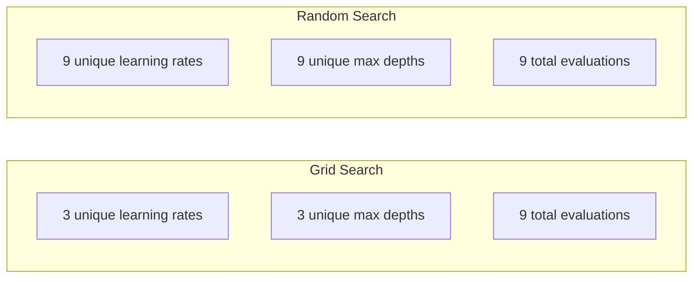
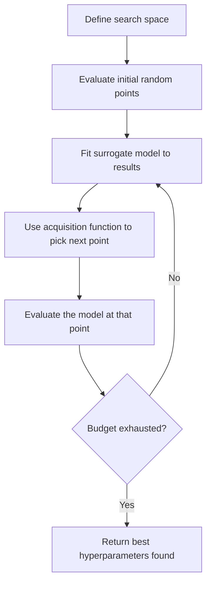
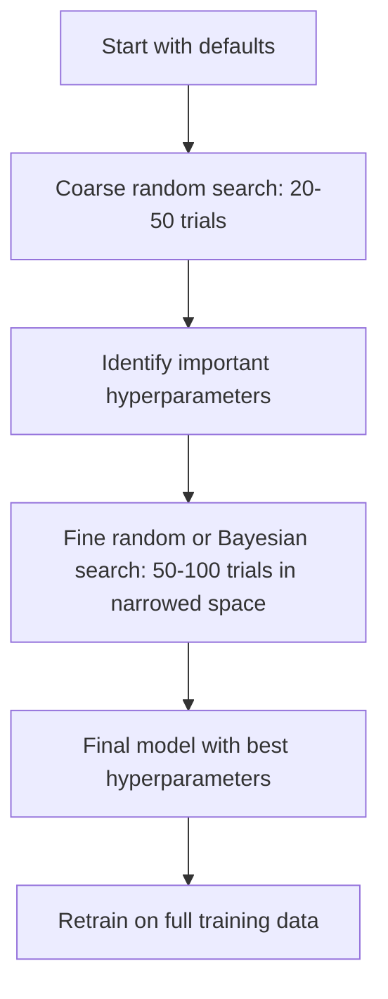
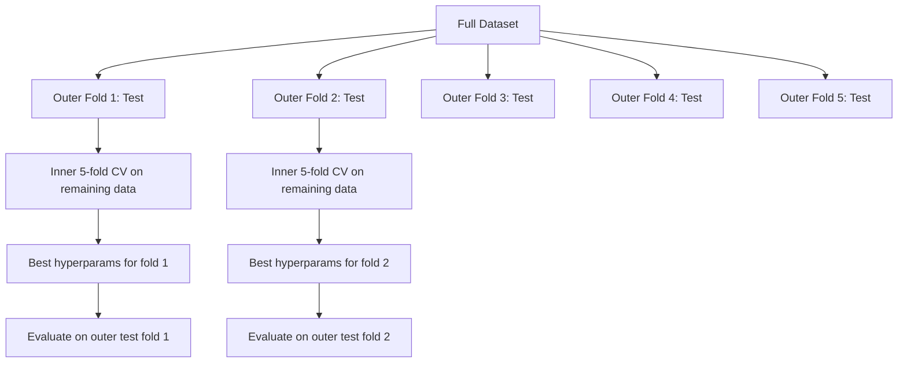

# 12 · 超参数调优

> 超参数是你在训练开始前要调节的旋钮。把它们调好，决定了模型是平庸还是出色。

**类型：** 实践构建（Build）
**语言：** Python
**前置：** 第 2 阶段，第 11 课（集成方法）
**时长：** 约 90 分钟

## 学习目标

- 从零实现网格搜索（grid search）、随机搜索（random search）和贝叶斯优化（Bayesian optimization），并比较它们的样本效率
- 解释为什么当大多数超参数具有较低的有效维度（effective dimensionality）时，随机搜索会优于网格搜索
- 使用代理模型（surrogate model）和采集函数（acquisition function）构建一个贝叶斯优化循环来引导搜索
- 设计一套超参数调优策略，通过适当的交叉验证（cross-validation）避免对验证集过拟合

## 问题

你的梯度提升（gradient boosting）模型有学习率、树的数量、最大深度、每个叶子的最小样本数、子采样比例和列采样比例。这是六个超参数。如果每个有 5 个合理取值，那么网格就有 5^6 = 15,625 种组合。每次训练耗时 10 秒。把它们全部试一遍就是 43 小时的算力。

网格搜索是最显而易见的方法，但在规模化时却是最糟糕的。随机搜索用更少的算力就能做得更好。贝叶斯优化通过从过往评估中学习，表现还要更好。知道该用哪种策略、以及哪些超参数真正重要，能省下数天被浪费的 GPU 时间。

## 概念

### 参数与超参数

参数（parameters）是在训练过程中学习得到的（权重、偏置、分裂阈值）。超参数（hyperparameters）则是在训练开始前设定的，用来控制学习如何进行。

| 超参数 | 它控制什么 | 典型范围 |
|---------------|-----------------|---------------|
| Learning rate | 每次更新的步长 | 0.001 到 1.0 |
| Number of trees/epochs | 训练多久 | 10 到 10,000 |
| Max depth | 模型复杂度 | 1 到 30 |
| Regularization (lambda) | 防止过拟合 | 0.0001 到 100 |
| Batch size | 梯度估计的噪声 | 16 到 512 |
| Dropout rate | 被丢弃神经元的比例 | 0.0 到 0.5 |

### 网格搜索

网格搜索会评估指定取值的每一种组合。它穷举且易于理解，但随着超参数数量增加会呈指数级膨胀。

```
2 个超参数的网格：

  learning_rate: [0.01, 0.1, 1.0]
  max_depth:     [3, 5, 7]

  评估次数: 3 x 3 = 9 种组合

  (0.01, 3)  (0.01, 5)  (0.01, 7)
  (0.1,  3)  (0.1,  5)  (0.1,  7)
  (1.0,  3)  (1.0,  5)  (1.0,  7)
```

网格搜索有一个根本性缺陷：如果一个超参数重要而另一个不重要，那么大部分评估都被浪费了。从 9 次评估中，你只得到了重要参数的 3 个不同取值。

### 随机搜索

随机搜索从分布中采样超参数，而不是使用网格。在同样 9 次评估的预算下，你能得到每个超参数的 9 个不同取值。



为什么随机搜索胜过网格搜索（Bergstra & Bengio, 2012）：

- 大多数超参数具有较低的有效维度。对于给定问题，6 个超参数中通常只有 1-2 个真正重要。
- 网格搜索把评估浪费在不重要的维度上。
- 在相同预算下，随机搜索对重要维度的覆盖更密集。
- 在 60 次随机试验时，你有 95% 的概率找到一个落在最优值 5% 范围内的点（如果搜索空间中存在最优值的话）。

### 贝叶斯优化

随机搜索会忽略结果。它无法学到高学习率会导致发散，或深度 3 始终优于深度 10。贝叶斯优化则利用过往的评估来决定接下来在哪里搜索。



两个关键组件：

**代理模型（surrogate model）：** 一个评估代价低廉的模型（通常是高斯过程，Gaussian process），用来近似昂贵的目标函数。它能在搜索空间中的任意一点同时给出一个预测值和一个不确定性估计。

**采集函数（acquisition function）：** 通过平衡利用（exploitation，在已知的好点附近搜索）和探索（exploration，在不确定性高的地方搜索）来决定下一步在哪里评估。常见的选择有：

- **期望提升（Expected Improvement, EI）：** 在这一点上，我们期望相比当前最优值能有多大的提升？
- **置信上界（Upper Confidence Bound, UCB）：** 预测值加上不确定性的若干倍。UCB 越高，意味着这个点要么有前景，要么尚未被探索。
- **提升概率（Probability of Improvement, PI）：** 这一点超过当前最优值的概率是多少？

贝叶斯优化通常能用比随机搜索少 2-5 倍的评估次数找到更好的超参数。拟合代理模型的开销相比训练实际模型可以忽略不计。

### 早停

并非每次训练都需要跑完。如果一个配置在 10 个 epoch 后明显很差，就停掉它继续下一个。这就是超参数搜索语境下的早停（early stopping）。

策略：
- **基于耐心（Patience-based）：** 如果验证损失连续 N 个 epoch 没有改善就停止
- **中位数剪枝（Median pruning）：** 如果某次试验在相同步数上的中间结果比已完成试验的中位数还差，就停止
- **Hyperband：** 给许多配置分配很小的预算，然后逐步为表现最好的配置增加预算

Hyperband 尤其有效。它用 1 个 epoch 启动 81 个配置，保留排名前三分之一的，给它们 3 个 epoch，再保留前三分之一，依此类推。这种方式比让所有配置都跑满整个预算快 10-50 倍地找到好配置。

### 学习率调度器

学习率几乎总是最重要的超参数。与其保持固定，调度器（scheduler）会在训练过程中调整它。

| 调度器 | 公式 | 何时使用 |
|-----------|---------|------------|
| Step decay | 每 N 个 epoch 乘以 0.1 | 经典 CNN 训练 |
| Cosine annealing | lr * 0.5 * (1 + cos(pi * t / T)) | 现代默认选择 |
| Warmup + decay | 先线性增加再余弦衰减 | Transformer |
| One-cycle | 在一个周期内先增后减 | 快速收敛 |
| Reduce on plateau | 指标停滞时按因子降低 | 安全的默认选择 |

### 超参数的重要性

并非所有超参数都同等重要。关于随机森林（Probst et al., 2019）和梯度提升的研究显示出一致的规律：

**高重要性：**
- 学习率（永远最先调）
- 估计器数量 / epoch 数（用早停而非调参来处理）
- 正则化强度

**中等重要性：**
- 最大深度 / 层数
- 每个叶子的最小样本数 / 权重衰减（weight decay）
- 子采样比例

**低重要性：**
- 最大特征数（针对随机森林）
- 具体激活函数的选择
- 批大小（在合理范围内）

先调重要的，其余的保持默认值。

### 实用策略



具体的工作流程：

1. **从库的默认值开始。** 它们是由经验丰富的从业者选定的，往往已经达到了 80% 的水平。
2. **粗粒度随机搜索。** 宽泛的取值范围，20-50 次试验。用早停快速终止糟糕的运行。
3. **分析结果。** 哪些超参数与性能相关？缩小搜索空间。
4. **细粒度搜索。** 在缩小后的空间里做贝叶斯优化或聚焦的随机搜索。50-100 次试验。
5. **用找到的最佳超参数在全部训练数据上重新训练。**

### 与交叉验证的结合

在单一验证集划分上调超参数是有风险的。最佳超参数可能对特定的验证折（fold）过拟合。嵌套交叉验证（nested cross-validation）通过两个循环解决这个问题：

- **外层循环**（评估）：把数据划分为训练+验证集和测试集。报告无偏的性能。
- **内层循环**（调优）：把训练+验证集划分为训练集和验证集。寻找最佳超参数。



每个外层折独立地找到自己的最佳超参数。外层分数是泛化性能的无偏估计。

使用 sklearn：

```python
from sklearn.model_selection import cross_val_score, GridSearchCV
from sklearn.ensemble import GradientBoostingRegressor

inner_cv = GridSearchCV(
    GradientBoostingRegressor(),
    param_grid={
        "learning_rate": [0.01, 0.05, 0.1],
        "max_depth": [2, 3, 5],
        "n_estimators": [50, 100, 200],
    },
    cv=5,
    scoring="neg_mean_squared_error",
)

outer_scores = cross_val_score(
    inner_cv, X, y, cv=5, scoring="neg_mean_squared_error"
)

print(f"Nested CV MSE: {-outer_scores.mean():.4f} +/- {outer_scores.std():.4f}")
```

这开销很大（5 个外层折 x 5 个内层折 x 27 个网格点 = 675 次模型拟合），但它能给你一个可信的性能估计。在论文中报告最终结果时，或者决策风险很高时，请使用它。

### 实用技巧

**从学习率开始。** 对基于梯度的方法来说，它永远是最重要的超参数。糟糕的学习率会让其他一切都无关紧要。先把其他超参数固定为默认值，优先扫描学习率。

**对学习率和正则化使用对数均匀（log-uniform）分布。** 0.001 与 0.01 之间的差异，和 0.1 与 1.0 之间的差异同样重要。线性搜索会把预算浪费在数值较大的一端。

**用早停代替调 n_estimators。** 对于提升方法和神经网络，把 n_estimators 或 epoch 数设得很高，让早停来决定何时停止。这能从搜索中去掉一个超参数。

**预算分配。** 把调优预算的 60% 花在最重要的前 2 个超参数上，剩下的 40% 花在其余所有超参数上。前 2 个解释了大部分的性能变化。

**尺度很重要。** 永远不要在对数尺度上搜索批大小（16、32、64 就好）。永远在对数尺度上搜索学习率。让搜索分布与超参数影响模型的方式相匹配。

| 模型类型 | 重要超参数 | 推荐搜索方式 | 预算 |
|-----------|--------------------|--------------------|--------|
| Random Forest | n_estimators, max_depth, min_samples_leaf | 随机搜索，50 次试验 | 低（训练快） |
| Gradient Boosting | learning_rate, n_estimators, max_depth | 贝叶斯，100 次试验 + 早停 | 中 |
| Neural Network | learning_rate, weight_decay, batch_size | 贝叶斯或随机，100+ 次试验 | 高（训练慢） |
| SVM | C, gamma（RBF 核） | 对数尺度网格，25-50 次试验 | 低（2 个参数） |
| Lasso/Ridge | alpha | 对数尺度的一维搜索，20 次试验 | 极低 |
| XGBoost | learning_rate, max_depth, subsample, colsample | 贝叶斯，100-200 次试验 + 早停 | 中 |

**拿不准时：** 用随机搜索，试验次数取超参数数量的 2 倍（例如，6 个超参数 = 至少 12+ 次试验）。你会惊讶于 50 次试验的随机搜索有多频繁地击败精心设计的网格搜索。

## 动手构建

### 第 1 步：从零实现网格搜索

`code/tuning.py` 中的代码从零实现了网格搜索、随机搜索和一个简单的贝叶斯优化器。

```python
def grid_search(model_fn, param_grid, X_train, y_train, X_val, y_val):
    keys = list(param_grid.keys())
    values = list(param_grid.values())
    best_score = -float("inf")
    best_params = None
    n_evals = 0

    for combo in itertools.product(*values):
        params = dict(zip(keys, combo))
        model = model_fn(**params)
        model.fit(X_train, y_train)
        score = evaluate(model, X_val, y_val)
        n_evals += 1

        if score > best_score:
            best_score = score
            best_params = params

    return best_params, best_score, n_evals
```

### 第 2 步：从零实现随机搜索

```python
def random_search(model_fn, param_distributions, X_train, y_train,
                  X_val, y_val, n_iter=50, seed=42):
    rng = np.random.RandomState(seed)
    best_score = -float("inf")
    best_params = None

    for _ in range(n_iter):
        params = {k: sample(v, rng) for k, v in param_distributions.items()}
        model = model_fn(**params)
        model.fit(X_train, y_train)
        score = evaluate(model, X_val, y_val)

        if score > best_score:
            best_score = score
            best_params = params

    return best_params, best_score, n_iter
```

### 第 3 步：贝叶斯优化（简化版）

核心思想：对观测到的（超参数，分数）对拟合一个高斯过程，然后用采集函数决定下一步去哪里看。

```python
class SimpleBayesianOptimizer:
    def __init__(self, search_space, n_initial=5):
        self.search_space = search_space
        self.n_initial = n_initial
        self.X_observed = []
        self.y_observed = []

    def _kernel(self, x1, x2, length_scale=1.0):
        dists = np.sum((x1[:, None, :] - x2[None, :, :]) ** 2, axis=2)
        return np.exp(-0.5 * dists / length_scale ** 2)

    def _fit_gp(self, X_new):
        X_obs = np.array(self.X_observed)
        y_obs = np.array(self.y_observed)
        y_mean = y_obs.mean()
        y_centered = y_obs - y_mean

        K = self._kernel(X_obs, X_obs) + 1e-4 * np.eye(len(X_obs))
        K_star = self._kernel(X_new, X_obs)

        L = np.linalg.cholesky(K)
        alpha = np.linalg.solve(L.T, np.linalg.solve(L, y_centered))
        mu = K_star @ alpha + y_mean

        v = np.linalg.solve(L, K_star.T)
        var = 1.0 - np.sum(v ** 2, axis=0)
        var = np.maximum(var, 1e-6)

        return mu, var

    def _expected_improvement(self, mu, var, best_y):
        sigma = np.sqrt(var)
        z = (mu - best_y) / (sigma + 1e-10)
        ei = sigma * (z * norm_cdf(z) + norm_pdf(z))
        return ei

    def suggest(self):
        if len(self.X_observed) < self.n_initial:
            return sample_random(self.search_space)

        candidates = [sample_random(self.search_space) for _ in range(500)]
        X_cand = np.array([to_vector(c) for c in candidates])
        mu, var = self._fit_gp(X_cand)
        ei = self._expected_improvement(mu, var, max(self.y_observed))
        return candidates[np.argmax(ei)]

    def observe(self, params, score):
        self.X_observed.append(to_vector(params))
        self.y_observed.append(score)
```

GP 代理模型在每个候选点给出两样东西：一个预测分数（mu）和一个不确定性（var）。期望提升（EI）会平衡这两者：它偏好模型预测分数高的点，或者不确定性高的点。早期，大多数点不确定性都很高，所以优化器会去探索。后期，它会聚焦到最有前景的区域。

### 第 4 步：比较所有方法

在同一个合成目标函数上运行所有三种方法并进行比较。这个比较使用了一个简化的封装，它直接用一个目标函数（不做模型训练）来调用每个优化器，因此其 API 与上面基于模型的实现有所不同：

```python
def synthetic_objective(params):
    lr = params["learning_rate"]
    depth = params["max_depth"]
    return -(np.log10(lr) + 2) ** 2 - (depth - 4) ** 2 + 10

param_grid = {
    "learning_rate": [0.001, 0.01, 0.1, 1.0],
    "max_depth": [2, 3, 4, 5, 6, 7, 8],
}

grid_best = None
grid_score = -float("inf")
grid_history = []
for combo in itertools.product(*param_grid.values()):
    params = dict(zip(param_grid.keys(), combo))
    score = synthetic_objective(params)
    grid_history.append((params, score))
    if score > grid_score:
        grid_score = score
        grid_best = params

param_dist = {
    "learning_rate": ("log_float", 0.001, 1.0),
    "max_depth": ("int", 2, 8),
}

rand_best = None
rand_score = -float("inf")
rand_history = []
rng = np.random.RandomState(42)
for _ in range(28):
    params = {k: sample(v, rng) for k, v in param_dist.items()}
    score = synthetic_objective(params)
    rand_history.append((params, score))
    if score > rand_score:
        rand_score = score
        rand_best = params

optimizer = SimpleBayesianOptimizer(param_dist, n_initial=5)
bayes_history = []
for _ in range(28):
    params = optimizer.suggest()
    score = synthetic_objective(params)
    optimizer.observe(params, score)
    bayes_history.append((params, score))
bayes_score = max(s for _, s in bayes_history)

print(f"{'Method':<20} {'Best Score':>12} {'Evaluations':>12}")
print("-" * 50)
print(f"{'Grid Search':<20} {grid_score:>12.4f} {len(grid_history):>12}")
print(f"{'Random Search':<20} {rand_score:>12.4f} {len(rand_history):>12}")
print(f"{'Bayesian Opt':<20} {bayes_score:>12.4f} {len(bayes_history):>12}")
```

在相同预算下，贝叶斯优化通常能最快找到最优分数，因为它不会把评估浪费在明显糟糕的区域。随机搜索比网格搜索覆盖的范围更广。只有当你的超参数非常少、且能负担得起穷举时，网格搜索才会胜出。

## 上手应用

### Optuna 实战

对于严肃的超参数调优，Optuna 是推荐的库。它开箱即支持剪枝（pruning）、分布式搜索和可视化。

```python
import optuna

def objective(trial):
    lr = trial.suggest_float("learning_rate", 1e-4, 1e-1, log=True)
    n_est = trial.suggest_int("n_estimators", 50, 500)
    max_depth = trial.suggest_int("max_depth", 2, 10)

    model = GradientBoostingRegressor(
        learning_rate=lr,
        n_estimators=n_est,
        max_depth=max_depth,
    )
    model.fit(X_train, y_train)
    return mean_squared_error(y_val, model.predict(X_val))

study = optuna.create_study(direction="minimize")
study.optimize(objective, n_trials=100)

print(f"Best params: {study.best_params}")
print(f"Best MSE: {study.best_value:.4f}")
```

Optuna 的关键特性：
- `suggest_float(..., log=True)` 用于最好在对数尺度上搜索的参数（学习率、正则化）
- `suggest_int` 用于整数参数
- `suggest_categorical` 用于离散选择
- 内置 MedianPruner，用于早停糟糕的试验
- `study.trials_dataframe()` 用于分析

### 带剪枝的 Optuna

剪枝会尽早停止没有前景的试验，节省大量算力。下面是这个模式：

```python
import optuna
from sklearn.model_selection import cross_val_score

def objective(trial):
    params = {
        "learning_rate": trial.suggest_float("lr", 1e-4, 0.5, log=True),
        "max_depth": trial.suggest_int("max_depth", 2, 10),
        "n_estimators": trial.suggest_int("n_estimators", 50, 500),
        "subsample": trial.suggest_float("subsample", 0.5, 1.0),
    }

    model = GradientBoostingRegressor(**params)
    scores = cross_val_score(model, X_train, y_train, cv=3,
                             scoring="neg_mean_squared_error")
    mean_score = -scores.mean()

    trial.report(mean_score, step=0)
    if trial.should_prune():
        raise optuna.TrialPruned()

    return mean_score

pruner = optuna.pruners.MedianPruner(n_startup_trials=10, n_warmup_steps=5)
study = optuna.create_study(direction="minimize", pruner=pruner)
study.optimize(objective, n_trials=200)
```

`MedianPruner` 会在某次试验的中间值比所有已完成试验在相同步数上的中位数还差时停止该试验。剪枝需要调用 `trial.report()` 来报告中间指标，并调用 `trial.should_prune()` 来检查该试验是否应该停止。`n_startup_trials=10` 确保在剪枝生效之前至少有 10 次试验完整完成。这通常能节省 40-60% 的总算力。

### sklearn 内置的调优器

对于快速实验，sklearn 提供了 `GridSearchCV`、`RandomizedSearchCV` 和 `HalvingRandomSearchCV`：

```python
from sklearn.model_selection import RandomizedSearchCV
from scipy.stats import loguniform, randint

param_dist = {
    "learning_rate": loguniform(1e-4, 0.5),
    "max_depth": randint(2, 10),
    "n_estimators": randint(50, 500),
}

search = RandomizedSearchCV(
    GradientBoostingRegressor(),
    param_dist,
    n_iter=100,
    cv=5,
    scoring="neg_mean_squared_error",
    random_state=42,
    n_jobs=-1,
)
search.fit(X_train, y_train)
print(f"Best params: {search.best_params_}")
print(f"Best CV MSE: {-search.best_score_:.4f}")
```

对学习率和正则化使用 scipy 的 `loguniform`。对整数超参数使用 `randint`。`n_jobs=-1` 标志会在所有 CPU 核心上并行。

### 超参数调优中的常见错误

**通过预处理造成的数据泄漏。** 如果你在交叉验证之前在完整数据集上拟合了一个缩放器（scaler），那么来自验证折的信息就会泄漏进训练过程。始终把预处理放进 `Pipeline`，这样它只会在训练折上拟合。

**对验证集过拟合。** 运行成千上万次试验实际上等于在验证集上训练。最终性能估计要使用嵌套交叉验证，或者预留一个在调优过程中绝不触碰的独立测试集。

**搜索范围太窄。** 如果你的最佳值落在搜索空间的边界上，说明你搜得还不够宽。最优值可能在你的范围之外。务必检查最佳参数是否处于边缘。

**忽视交互效应。** 在提升方法中，学习率和估计器数量之间有强烈的交互作用。低学习率需要更多的估计器。独立地调它们，效果会比一起调更差。

**对迭代式模型不使用早停。** 对于梯度提升和神经网络，把 n_estimators 或 epoch 数设为一个较高的值并使用早停。这严格优于把迭代次数当作一个超参数来调。

## 练习

1. 用相同的总预算（例如 50 次评估）运行网格搜索和随机搜索。比较找到的最佳分数。用不同的随机种子把实验运行 10 次。随机搜索胜出的频率有多高？

2. 从零实现 Hyperband。从 81 个配置开始，每个训练 1 个 epoch。每一轮保留排名前 1/3 的，并将它们的预算翻三倍。把总算力（所有配置所有 epoch 的总和）与让 81 个配置都跑满整个预算做比较。

3. 给第 11 课的梯度提升实现加上一个学习率调度器（余弦退火，cosine annealing）。与固定学习率相比，它有帮助吗？

4. 用 Optuna 在一个真实数据集上（例如 sklearn 的乳腺癌数据集）调优一个 RandomForestClassifier。使用 `optuna.visualization.plot_param_importances(study)` 来看哪些超参数最重要。它是否与本课给出的重要性排名相符？

5. 实现一个简单的采集函数（期望提升），并演示探索与利用的权衡。绘制代理模型的均值和不确定性，并展示 EI 选择下一个评估点的位置。

## 关键术语

| 术语 | 人们怎么说 | 它实际的含义 |
|------|----------------|----------------------|
| Hyperparameter | "你选择的一个设置" | 在训练前设定的、用来控制学习过程的值，而非从数据中学得 |
| Grid search | "试遍每种组合" | 在指定参数网格上的穷举搜索。开销呈指数级。 |
| Random search | "就随机采样" | 从分布中采样超参数。对重要维度的覆盖优于网格搜索。 |
| Bayesian optimization | "智能搜索" | 使用目标函数的代理模型来决定下一步在哪里评估，平衡探索与利用 |
| Surrogate model | "一个廉价的近似" | 一个模型（通常是高斯过程），它根据观测到的评估来近似昂贵的目标函数 |
| Acquisition function | "下一步去哪看" | 通过平衡期望提升与不确定性来为候选点打分。EI 和 UCB 是常见选择。 |
| Early stopping | "别再浪费时间了" | 在验证性能不再改善时尽早终止训练 |
| Hyperband | "配置的淘汰赛" | 自适应资源分配：用小预算启动许多配置，保留最好的并增加它们的预算 |
| Learning rate scheduler | "训练中改变 lr" | 一个在训练过程中调整学习率以获得更好收敛的函数 |

## 延伸阅读

- [Bergstra & Bengio: Random Search for Hyper-Parameter Optimization (2012)](https://jmlr.org/papers/v13/bergstra12a.html) —— 证明随机搜索胜过网格搜索的那篇论文
- [Snoek et al., Practical Bayesian Optimization of Machine Learning Algorithms (2012)](https://arxiv.org/abs/1206.2944) —— 面向机器学习的贝叶斯优化
- [Li et al., Hyperband: A Novel Bandit-Based Approach (2018)](https://jmlr.org/papers/v18/16-558.html) —— Hyperband 论文
- [Optuna: A Next-generation Hyperparameter Optimization Framework](https://arxiv.org/abs/1907.10902) —— Optuna 论文
- [Probst et al., Tunability: Importance of Hyperparameters (2019)](https://jmlr.org/papers/v20/18-444.html) —— 哪些超参数重要
