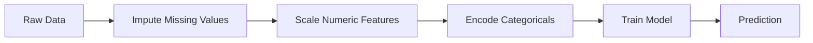
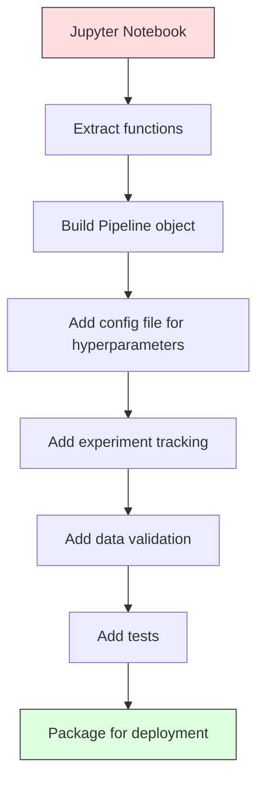

# ML パイプライン

> モデルそのものはプロダクトではありません。パイプラインこそがプロダクトです。生データからデプロイされた予測までを含む全体がパイプラインであり、すべてのステップは再現可能でなければなりません。

**種別:** 構築
**言語:** Python
**前提条件:** Phase 2, Lesson 12 (Hyperparameter Tuning)
**所要時間:** 約120分

## 学習目標

- 欠損値補完、スケーリング、エンコーディング、モデル学習を 1 つの再現可能なオブジェクトにつなぐ ML パイプラインをゼロから構築する
- データリークが起きる状況を見つけ、transformer を訓練データだけで fit することでパイプラインがそれを防ぐ仕組みを説明する
- 数値特徴量とカテゴリ特徴量に別々の前処理を適用する `ColumnTransformer` を組み立てる
- パイプラインのシリアライズを実装し、同じ fit 済みパイプラインが訓練時と本番時に同一の結果を返すことを示す

## 問題

データを読み込み、欠損値を中央値で埋め、特徴量をスケーリングし、モデルを訓練して accuracy を表示するノートブックがあります。動きます。あなたはそれを出荷します。

1 か月後、別の人がモデルを再訓練すると違う結果になります。中央値はテストデータを含む全データセットで計算されていました（データリーク）。スケーリングのパラメータは保存されていなかったため、推論時には別の統計量が使われます。特徴量エンジニアリングのコードは訓練側と serving 側でコピーされ、いつの間にか内容がずれました。本番環境では、encoder が見たことのない新しいカテゴリ値も現れました。

これは仮の話ではありません。ML システムが本番で失敗する最も一般的な理由です。パイプラインは、すべての変換ステップを単一の、順序付きで再現可能なオブジェクトにまとめることで、これらを解決します。

## コンセプト

### パイプラインとは

パイプラインは、データ変換の順序付き列と、その最後に置かれるモデルです。各ステップは、直前のステップの出力を入力として受け取ります。パイプライン全体は訓練データで一度だけ fit されます。推論時には、同じ fit 済みパイプラインが新しいデータを変換し、予測を生成します。



パイプラインが保証すること:
- 変換は訓練データだけで fit される（リークしない）
- 推論時にも同じ変換が適用される
- オブジェクト全体を 1 つの artifact としてシリアライズしてデプロイできる
- クロスバリデーションでは fold ごとにパイプラインが適用され、見落としやすいリークを防げる

### データリーク: 静かな破壊者

データリークは、テストセットや未来のデータの情報が訓練に混入したときに起きます。パイプラインは、最も一般的なリークを防ぎます。

**リークしている例（誤り）:**
```python
X = df.drop("target", axis=1)
y = df["target"]

scaler = StandardScaler()
X_scaled = scaler.fit_transform(X)

X_train, X_test = X_scaled[:800], X_scaled[800:]
y_train, y_test = y[:800], y[800:]
```

この scaler はテストデータを見ています。平均と標準偏差にテストサンプルが含まれています。その結果、accuracy の見積もりが実際より高くなります。

**正しい例:**
```python
X_train, X_test = X[:800], X[800:]

scaler = StandardScaler()
X_train_scaled = scaler.fit_transform(X_train)
X_test_scaled = scaler.transform(X_test)
```

パイプラインを使えば、これを毎回意識する必要はありません。パイプラインが自動的に処理します。

### sklearn Pipeline

sklearn の `Pipeline` は transformer と estimator をつなぎます。`.fit()`、`.predict()`、`.score()` を公開し、すべてのステップを順番に適用します。

```python
from sklearn.pipeline import Pipeline
from sklearn.preprocessing import StandardScaler
from sklearn.linear_model import LogisticRegression

pipe = Pipeline([
    ("scaler", StandardScaler()),
    ("model", LogisticRegression()),
])

pipe.fit(X_train, y_train)
predictions = pipe.predict(X_test)
```

`pipe.fit(X_train, y_train)` を呼ぶと:
1. Scaler が X_train に対して `fit_transform` を呼ぶ
2. Model がスケーリング済みの X_train に対して `fit` を呼ぶ

`pipe.predict(X_test)` を呼ぶと:
1. Scaler が X_test に対して `transform`（`fit_transform` ではない）を呼ぶ
2. Model がスケーリング済みの X_test に対して `predict` を呼ぶ

fit の間、scaler はテストデータを一切見ません。これが核心です。

### ColumnTransformer: 列ごとに違うパイプラインを使う

現実のデータセットには、前処理が異なる数値列とカテゴリ列があります。`ColumnTransformer` はこれを扱います。

```python
from sklearn.compose import ColumnTransformer
from sklearn.preprocessing import StandardScaler, OneHotEncoder
from sklearn.impute import SimpleImputer

numeric_pipe = Pipeline([
    ("impute", SimpleImputer(strategy="median")),
    ("scale", StandardScaler()),
])

categorical_pipe = Pipeline([
    ("impute", SimpleImputer(strategy="most_frequent")),
    ("encode", OneHotEncoder(handle_unknown="ignore")),
])

preprocessor = ColumnTransformer([
    ("num", numeric_pipe, ["age", "income", "score"]),
    ("cat", categorical_pipe, ["city", "gender", "plan"]),
])

full_pipeline = Pipeline([
    ("preprocess", preprocessor),
    ("model", GradientBoostingClassifier()),
])
```

OneHotEncoder の `handle_unknown="ignore"` は本番運用では重要です。新しいカテゴリ（モデルが見たことのない city など）が現れても、クラッシュせずにゼロベクトルを生成します。

### 実験トラッキング

パイプラインは訓練を再現可能にしますが、実験間で何が起きたかも追跡する必要があります。どの hyperparameter を使ったか、どの dataset version だったか、metrics は何だったか、どのコードが動いていたか、です。

**MLflow** は最も一般的な open-source の解決策です:

```python
import mlflow

with mlflow.start_run():
    mlflow.log_param("max_depth", 5)
    mlflow.log_param("n_estimators", 100)
    mlflow.log_param("learning_rate", 0.1)

    pipe.fit(X_train, y_train)
    accuracy = pipe.score(X_test, y_test)

    mlflow.log_metric("accuracy", accuracy)
    mlflow.sklearn.log_model(pipe, "model")
```

各 run には parameters、metrics、artifacts、完全な model が記録されます。run を比較し、任意の実験を再現し、任意の model version をデプロイできます。

**Weights & Biases (wandb)** も、hosted dashboard 付きで同じ機能を提供します:

```python
import wandb

wandb.init(project="my-pipeline")
wandb.config.update({"max_depth": 5, "n_estimators": 100})

pipe.fit(X_train, y_train)
accuracy = pipe.score(X_test, y_test)

wandb.log({"accuracy": accuracy})
```

### モデルバージョニング

実験トラッキングの次には、model version の管理が必要です。どの model が production にあるのか。どれが staging なのか。先週の model はどれか。

MLflow の Model Registry が提供するもの:
- **Version tracking:** 保存された model すべてに version number が付く
- **Stage transitions:** "Staging"、"Production"、"Archived"
- **Approval workflow:** production への昇格は明示的に承認する
- **Rollback:** 以前の version に即座に戻せる

### DVC によるデータバージョニング

コードは git で version 管理します。データも version 管理すべきですが、git は大きなファイルを扱うのに向いていません。DVC (Data Version Control) がこれを解決します。

```
dvc init
dvc add data/training.csv
git add data/training.csv.dvc data/.gitignore
git commit -m "Track training data"
dvc push
```

DVC は実データを remote storage（S3、GCS、Azure など）に保存し、hash を記録した小さな `.dvc` file を git に置きます。git commit を checkout したとき、`dvc checkout` がその commit で使われた正確なデータを復元します。

つまり、各 git commit がコードとデータの両方を固定します。完全な再現性です。

### 再現可能な実験

再現可能な実験には 4 つが必要です:

1. **固定された random seeds:** numpy、random、framework（torch、sklearn）の seed を設定する
2. **固定された dependencies:** exact version を持つ requirements.txt または poetry.lock
3. **version 管理された data:** DVC など
4. **Config files:** hyperparameters は hardcoded せず config に置く

```python
import numpy as np
import random

def set_seed(seed=42):
    random.seed(seed)
    np.random.seed(seed)
    try:
        import torch
        torch.manual_seed(seed)
        torch.cuda.manual_seed_all(seed)
        torch.backends.cudnn.deterministic = True
    except ImportError:
        pass
```

### ノートブックから本番パイプラインへ



典型的な進め方:

1. **Notebook exploration:** 素早い実験、可視化、特徴量アイデア
2. **Extract functions:** 前処理、特徴量エンジニアリング、評価を modules に移す
3. **Build Pipeline:** 変換を sklearn Pipeline または custom class に連結する
4. **Config management:** すべての hyperparameters を YAML/JSON config に移す
5. **Experiment tracking:** MLflow または wandb logging を追加する
6. **Data validation:** 訓練前に schema、distributions、missing value patterns を確認する
7. **Tests:** transformer の unit tests と full pipeline の integration tests
8. **Deployment:** pipeline をシリアライズし、API（FastAPI、Flask）で包み、containerize する

### よくあるパイプラインの間違い

| Mistake | Why it is bad | Fix |
|---------|-------------|-----|
| 分割前に全データで fit する | Data leakage | cross_val_score と Pipeline を使う |
| pipeline の外で feature engineering する | train と serve で変換がずれる | すべての変換を Pipeline に入れる |
| unknown categories を扱わない | 新しい値で production がクラッシュする | OneHotEncoder(handle_unknown="ignore") |
| column names を hardcoded する | schema 変更で壊れる | config の column name lists を使う |
| data validation がない | 悪いデータで静かに誤予測する | prediction 前に schema checks を追加する |
| training/serving skew | prod で model が違う features を見る | 両方で 1 つの Pipeline object を使う |

## 作ってみる

`code/pipeline.py` のコードは、完全な ML パイプラインをゼロから構築します。

### Step 1: Custom Transformer

```python
class CustomTransformer:
    def __init__(self):
        self.means = None
        self.stds = None

    def fit(self, X):
        self.means = np.mean(X, axis=0)
        self.stds = np.std(X, axis=0)
        self.stds[self.stds == 0] = 1.0
        return self

    def transform(self, X):
        return (X - self.means) / self.stds

    def fit_transform(self, X):
        return self.fit(X).transform(X)
```

### Step 2: Pipeline from Scratch

```python
class PipelineFromScratch:
    def __init__(self, steps):
        self.steps = steps

    def fit(self, X, y=None):
        X_current = X.copy()
        for name, step in self.steps[:-1]:
            X_current = step.fit_transform(X_current)
        name, model = self.steps[-1]
        model.fit(X_current, y)
        return self

    def predict(self, X):
        X_current = X.copy()
        for name, step in self.steps[:-1]:
            X_current = step.transform(X_current)
        name, model = self.steps[-1]
        return model.predict(X_current)
```

### Step 3: パイプラインを使ったクロスバリデーション

コードは、パイプライン付きの cross-validation がデータリークを防ぐ仕組みを示します。scaler は各 fold の訓練データだけで個別に fit されます。

### Step 4: sklearn による完全な本番パイプライン

`ColumnTransformer`、複数の前処理経路、model を含む完全な pipeline を、正しい cross-validation と experiment logging 付きで訓練します。

## 出荷物

この lesson が生成するもの:
- `outputs/prompt-ml-pipeline.md` -- ML パイプラインを構築・debug するための skill
- `code/pipeline.py` -- scratch 実装から sklearn までを含む完全な pipeline

## 演習

1. 数値列 3 個とカテゴリ列 2 個を持つ dataset を扱う pipeline を作ってください。`ColumnTransformer` を使い、数値列には median imputation + scaling、カテゴリ列には most-frequent imputation + one-hot encoding を適用します。5-fold cross-validation で訓練してください。

2. 意図的にデータリークを入れてください。分割前の全データで scaler を fit します。cross-validation score（leaky）と pipeline cross-validation score（clean）を比較してください。差はどれくらいですか。

3. `joblib.dump` で pipeline をシリアライズしてください。別 script で読み込み、予測を実行します。予測が同一であることを確認してください。

4. 最も重要な数値列 2 個に degree 2 の polynomial features を作る custom transformer を pipeline に追加してください。pipeline のどこに置くべきですか。

5. pipeline に MLflow tracking を設定してください。異なる hyperparameters で 5 つの実験を実行します。MLflow UI（`mlflow ui`）で run を比較し、最良の model を選んでください。

## 重要用語

| Term | What people say | What it actually means |
|------|----------------|----------------------|
| Pipeline | "Chain of transforms + model" | fit 済み transformer と model の順序付き列。リークを防ぐため 1 つの単位として適用される |
| Data leakage | "Test info leaked into training" | 訓練セット外の情報を使って model を作り、performance estimate を水増しすること |
| ColumnTransformer | "Different preprocessing per column" | 列の subset ごとに異なる pipeline を適用し、結果を結合する仕組み |
| Experiment tracking | "Logging your runs" | 各 training run の parameters、metrics、artifacts、code versions を記録すること |
| MLflow | "Track and deploy models" | experiment tracking、model registry、deployment のための open-source platform |
| DVC | "Git for data" | large data files の version control。hash を git に、data を remote storage に保存する |
| Model registry | "Model version catalog" | model versions を stage labels（staging、production、archived）付きで追跡する system |
| Training/serving skew | "It worked in the notebook" | 訓練時と推論時で data processing が異なり、静かな error を起こすこと |
| Reproducibility | "Same code, same result" | 同じ code、data、configuration から同一結果を得られる能力 |

## 参考資料

- [scikit-learn Pipeline docs](https://scikit-learn.org/stable/modules/compose.html) -- 公式 pipeline reference
- [MLflow documentation](https://mlflow.org/docs/latest/index.html) -- experiment tracking と model registry
- [DVC documentation](https://dvc.org/doc) -- data versioning
- [Sculley et al., Hidden Technical Debt in Machine Learning Systems (2015)](https://papers.nips.cc/paper/2015/hash/86df7dcfd896fcaf2674f757a2463eba-Abstract.html) -- ML systems complexity に関する重要論文
- [Google ML Best Practices: Rules of ML](https://developers.google.com/machine-learning/guides/rules-of-ml) -- production ML の実践的 advice
