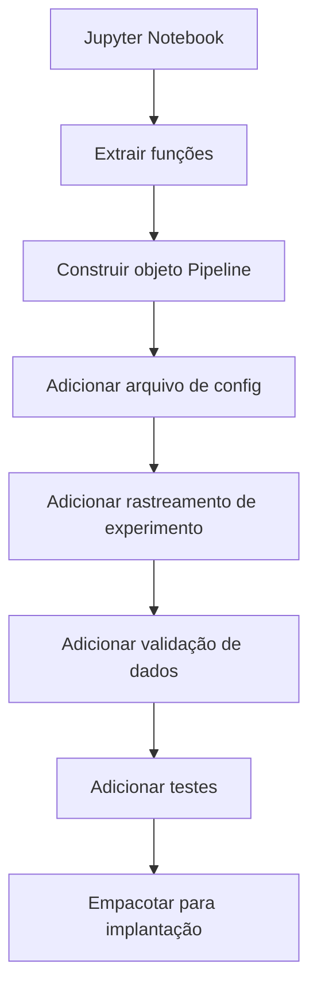

# Pipelines de ML

> Um modelo não é um produto. Um pipeline é. O pipeline é tudo de dados brutos a previsão implantada, e cada passo deve ser reproduzível.

**Tipo:** Build
**Linguagens:** Python
**Pré-requisitos:** Fase 2, Aula 12 (Ajuste de Hiperparâmetros)
**Tempo:** ~120 minutos

## Objetivos de Aprendizado

- Construir um pipeline de ML do zero que encadeia imputação, escalonamento, encoding e treino de modelo em um objeto reproduzível
- Identificar cenários de vazamento de dados e explicar como pipelines os previnem ajustando transformadores apenas nos dados de treino
- Construir um ColumnTransformer que aplica pré-processamento diferente para features numéricas e categóricas
- Implementar serialização de pipeline e demonstrar que o mesmo pipeline ajustado produz resultados idênticos em treino e produção

## O Problema

Você tem um notebook que carrega dados, preenche valores ausentes com a mediana, escala features, treina um modelo e imprime accuracy. Funciona. Você implanta.

Um mês depois, alguém retreina o modelo e obtém resultados diferentes. A mediana foi calculada no dataset inteiro incluindo dados de teste (vazamento de dados). Os parâmetros de escalonamento não foram salvos.

Pipelines resolvem tudo isso empacotando cada etapa de transformação em um objeto único, ordenado e reproduzível.

## O Conceito

### O Que É Um Pipeline


O pipeline garante:
- Transformações são ajustadas apenas nos dados de treino (sem vazamento)
- As mesmas transformações são aplicadas na inferência
- O objeto inteiro pode ser serializado e implantado como um único artefato

### Vazamento de Dados: O Assassino Silencioso

**Vazado (errado):**
```python
X = df.drop("target", axis=1)
y = df["target"]

scaler = StandardScaler()
X_scaled = scaler.fit_transform(X)  # scaler viu dados de teste!

X_train, X_test = X_scaled[:800], X_scaled[800:]
```

**Correto:**
```python
X_train, X_test = X[:800], X[800:]

scaler = StandardScaler()
X_train_scaled = scaler.fit_transform(X_train)
X_test_scaled = scaler.transform(X_test)
```

Com um pipeline, você não precisa pensar nisso. O pipeline lida automaticamente.

### sklearn Pipeline

```python
from sklearn.pipeline import Pipeline
from sklearn.preprocessing import StandardScaler
from sklearn.linear_model import LogisticRegression

pipe = Pipeline([
    ("scaler", StandardScaler()),
    ("model", LogisticRegression()),
])

pipe.fit(X_train, y_train)
predictions = pipe.predict(X_test)
```

### ColumnTransformer: Diferentes Pipelines para Diferentes Colunas

```python
from sklearn.compose import ColumnTransformer
from sklearn.preprocessing import StandardScaler, OneHotEncoder
from sklearn.impute import SimpleImputer

numeric_pipe = Pipeline([
    ("impute", SimpleImputer(strategy="median")),
    ("scale", StandardScaler()),
])

categorical_pipe = Pipeline([
    ("impute", SimpleImputer(strategy="most_frequent")),
    ("encode", OneHotEncoder(handle_unknown="ignore")),
])

preprocessor = ColumnTransformer([
    ("num", numeric_pipe, ["age", "income", "score"]),
    ("cat", categorical_pipe, ["city", "gender", "plan"]),
])

full_pipeline = Pipeline([
    ("preprocess", preprocessor),
    ("model", GradientBoostingClassifier()),
])
```

### Rastreamento de Experimentos

**MLflow** é a solução open-source mais comum:

```python
import mlflow

with mlflow.start_run():
    mlflow.log_param("max_depth", 5)
    mlflow.log_param("n_estimators", 100)
    mlflow.log_param("learning_rate", 0.1)

    pipe.fit(X_train, y_train)
    accuracy = pipe.score(X_test, y_test)

    mlflow.log_metric("accuracy", accuracy)
    mlflow.sklearn.log_model(pipe, "model")
```

### Do Notebook pra Pipeline de Produção



## Construa

### Passo 1: Transformer Customizado

```python
class CustomTransformer:
    def __init__(self):
        self.means = None
        self.stds = None

    def fit(self, X):
        self.means = np.mean(X, axis=0)
        self.stds = np.std(X, axis=0)
        self.stds[self.stds == 0] = 1.0
        return self

    def transform(self, X):
        return (X - self.means) / self.stds

    def fit_transform(self, X):
        return self.fit(X).transform(X)
```

### Passo 2: Pipeline Do Zero

```python
class PipelineFromScratch:
    def __init__(self, steps):
        self.steps = steps

    def fit(self, X, y=None):
        X_current = X.copy()
        for name, step in self.steps[:-1]:
            X_current = step.fit_transform(X_current)
        name, model = self.steps[-1]
        model.fit(X_current, y)
        return self

    def predict(self, X):
        X_current = X.copy()
        for name, step in self.steps[:-1]:
            X_current = step.transform(X_current)
        name, model = self.steps[-1]
        return model.predict(X_current)
```

## Exercícios

1. Construa um pipeline que lida com um dataset com 3 colunas numéricas e 2 categóricas. Use `ColumnTransformer`.
2. Provoque vazamento de dados propositadamente: ajuste o scaler no dataset inteiro antes de dividir. Compare o score de validação cruzada (vazado) com o pipeline (limpo).
3. Serialize seu pipeline com `joblib.dump`. Carregue num script separado e rode previsões.
4. Adicione um transformer customizado ao pipeline que cria features polinomiais (grau 2) para as duas colunas numéricas mais importantes.
5. Configure rastreamento MLflow para o pipeline. Rode 5 experimentos com hiperparâmetros diferentes.
