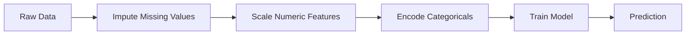
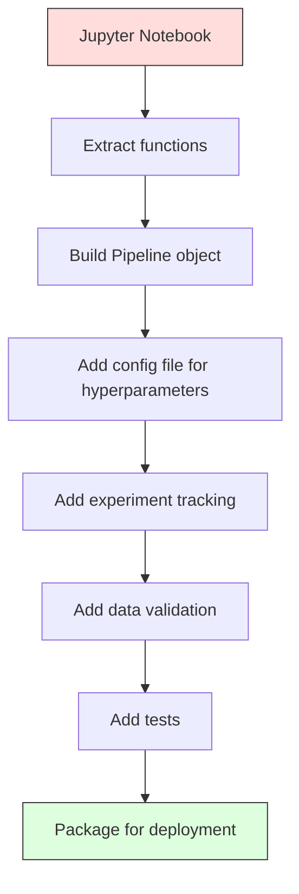

# ML İşlem Hatları

> Model bir ürün değildir. Bir boru hattı var. İşlem hattı, ham verilerden konuşlandırılmış tahminlere kadar her şeyi kapsar ve her adımın tekrarlanabilir olması gerekir.

**Tür:** Yapım
**Dil:** Python
**Önkoşullar:** Aşama 2, Ders 12 (Hiperparametre Ayarlama)
**Süre:** ~120 dakika

## Öğrenme Hedefleri

- Atama, ölçeklendirme, kodlama ve model eğitimini tek bir yeniden üretilebilir nesneye zincirleyen sıfırdan bir ML ardışık düzeni oluşturun
- Veri sızıntısı senaryolarını belirleyin ve transformer'leri yalnızca eğitim verilerine yerleştirerek işlem hatlarının bunları nasıl önlediğini açıklayın
- Sayısal ve kategorik özelliklere farklı ön işleme uygulayan bir SütunTransformer oluşturun
- Boru hattı serileştirmesini uygulayın ve aynı takılan boru hattının eğitim ve üretimde aynı sonuçları ürettiğini gösterin

## Sorun

Verileri yükleyen, eksik değerleri medyanla dolduran, özellikleri ölçeklendiren, modeli eğiten ve doğruluğu yazdıran bir not defteriniz var. İşe yarıyor. Sen gönder.

Bir ay sonra birisi modeli yeniden eğitiyor ve farklı sonuçlar alıyor. Medyan, test verileri (veri sızıntısı) dahil olmak üzere tam dataset üzerinden hesaplandı. Ölçeklendirme parametreleri kaydedilmediğinden inference farklı istatistikler kullanır. Özellik mühendisliği kodu, eğitim ve sunum arasında kopyalanıp yapıştırıldı ve kopyalar farklılaştı. Kategorik bir sütun, üretimde kodlayıcının daha önce görmediği yeni bir değer kazandı.

Bunlar varsayımsal değil. Makine öğrenimi sistemlerinin üretimde başarısız olmasının en yaygın nedenleri bunlardır. Boru hatları, her dönüşüm adımını tek, düzenli, tekrarlanabilir bir nesneye paketleyerek bunların hepsini çözer.

## Konsept

### Boru Hattı Nedir?

İşlem hattı, bir modelin takip ettiği veri dönüşümlerinin sıralı bir dizisidir. Her adım, bir önceki adımın çıktısını girdi olarak alır. Tüm boru hattı eğitim verilerine bir kez uyarlanır. inference zamanında, aynı takılan işlem hattı yeni verileri dönüştürür ve tahminler üretir.



Boru hattı şunları garanti eder:
- Dönüşümler yalnızca eğitim verilerine uyarlanır (sızıntı yok)
- Aynı dönüşümler inference zamanında uygulanır
- Nesnenin tamamı tek bir artifact olarak serileştirilebilir ve dağıtılabilir
- Çapraz doğrulama, boru hattını kat başına uygulayarak ince sızıntıyı önler

### Veri Sızıntısı: Sessiz Katil

Test setindeki bilgiler veya gelecekteki veriler eğitimi kirlettiğinde veri sızıntısı meydana gelir. Boru hatları en yaygın biçimleri engeller.

**Sızdıran (yanlış):**
```python
X = df.drop("target", axis=1)
y = df["target"]

scaler = StandardScaler()
X_scaled = scaler.fit_transform(X)

X_train, X_test = X_scaled[:800], X_scaled[800:]
y_train, y_test = y[:800], y[800:]
```

Ölçekleyici test verilerini gördü. Ortalama ve standart sapma test örneklerini içerir. Bu, doğruluk tahminlerini şişirir.

**Doğru:**
```python
X_train, X_test = X[:800], X[800:]

scaler = StandardScaler()
X_train_scaled = scaler.fit_transform(X_train)
X_test_scaled = scaler.transform(X_test)
```

Bir boru hattı ile bunu düşünmenize gerek yoktur. Boru hattı bunu otomatik olarak yönetir.

### sklearn Boru Hattı

sklearn'in `Pipeline` zincirleri transformer'ler ve bir tahminci. Tüm adımları sırayla uygulayan `.fit()`, `.predict()` ve `.score()`'yi ortaya çıkarır.

```python
from sklearn.pipeline import Pipeline
from sklearn.preprocessing import StandardScaler
from sklearn.linear_model import LogisticRegression

pipe = Pipeline([
    ("scaler", StandardScaler()),
    ("model", LogisticRegression()),
])

pipe.fit(X_train, y_train)
predictions = pipe.predict(X_test)
```

`pipe.fit(X_train, y_train)`'yi aradığınızda:
1. Ölçekleyici X_train'de `fit_transform`'yi çağırır
2. Model, ölçeklendirilmiş X_train üzerinde `fit`'yi çağırır

`pipe.predict(X_test)`'yi aradığınızda:
1. Ölçekleyici, X_test'te `transform`'yi (fit_transform değil) çağırır
2. Model, ölçeklendirilmiş X_testinde `predict`'yi çağırır

Ölçekleyici, montaj sırasında test verilerini asla görmez. Bütün mesele bu.

### SütunTransformer: Farklı Sütunlar için Farklı İşlem Hatları

Gerçek dataset'ler, farklı ön işleme gerektiren sayısal ve kategorik sütunlara sahiptir. `ColumnTransformer` bunu halleder.

```python
from sklearn.compose import ColumnTransformer
from sklearn.preprocessing import StandardScaler, OneHotEncoder
from sklearn.impute import SimpleImputer

numeric_pipe = Pipeline([
    ("impute", SimpleImputer(strategy="median")),
    ("scale", StandardScaler()),
])

categorical_pipe = Pipeline([
    ("impute", SimpleImputer(strategy="most_frequent")),
    ("encode", OneHotEncoder(handle_unknown="ignore")),
])

preprocessor = ColumnTransformer([
    ("num", numeric_pipe, ["age", "income", "score"]),
    ("cat", categorical_pipe, ["city", "gender", "plan"]),
])

full_pipeline = Pipeline([
    ("preprocess", preprocessor),
    ("model", GradientBoostingClassifier()),
])
```

OneHotEncoder'daki `handle_unknown="ignore"` üretim için kritik öneme sahiptir. Yeni bir kategori ortaya çıktığında (modelin daha önce hiç görmediği bir şehir), çökmek yerine sıfır vektörü üretir.

### Deneme Takibi

Bir işlem hattı eğitimi tekrarlanabilir hale getirir, ancak aynı zamanda deneyler arasında neler olduğunu da izlemeniz gerekir: hangi hiperparametrelerin kullanıldığı, hangi dataset sürümü, metriklerin neler olduğu, hangi kodun çalıştığı.

**MLflow** en yaygın açık kaynaklı çözümdür:

```python
import mlflow

with mlflow.start_run():
    mlflow.log_param("max_depth", 5)
    mlflow.log_param("n_estimators", 100)
    mlflow.log_param("learning_rate", 0.1)

    pipe.fit(X_train, y_train)
    accuracy = pipe.score(X_test, y_test)

    mlflow.log_metric("accuracy", accuracy)
    mlflow.sklearn.log_model(pipe, "model")
```

Her çalıştırma parametreler, metrikler, artifact'ler ve tam modelle birlikte kaydedilir. Çalıştırmaları karşılaştırabilir, herhangi bir denemeyi yeniden üretebilir ve herhangi bir model sürümünü dağıtabilirsiniz.

**Ağırlıklar ve Önyargılar (wandb)**, barındırılan bir kontrol paneliyle aynı işlevselliği sağlar:

```python
import wandb

wandb.init(project="my-pipeline")
wandb.config.update({"max_depth": 5, "n_estimators": 100})

pipe.fit(X_train, y_train)
accuracy = pipe.score(X_test, y_test)

wandb.log({"accuracy": accuracy})
```

### Model Sürümü Oluşturma

Deneme takibinin ardından model sürümlerini yönetmeniz gerekir. Hangi model üretimde? Hangisi sahneleniyor? Geçen haftanın hangisiydi?

MLflow'un Model Kaydı şunları sağlar:
- **Sürüm izleme:** Kaydedilen her modele bir sürüm numarası verilir
- **Aşama geçişleri:** "Aşamalama", "Üretim", "Arşivlendi"
- **Onay iş akışı:** Modeller açıkça üretime tanıtılmalıdır
- **Geri alma:** Anında önceki sürüme geri dönün

### DVC ile Veri Sürümü Oluşturma

Kod git ile versiyonlanmıştır. Veriler de sürümlendirilmelidir, ancak git büyük dosyaları işleyemez. DVC (Veri Sürümü Kontrolü) bunu çözer.

```
dvc init
dvc add data/training.csv
git add data/training.csv.dvc data/.gitignore
git commit -m "Track training data"
dvc push
```

DVC, gerçek verileri uzak depolamada (S3, GCS, Azure) depolar ve karma değeri kaydeden küçük bir `.dvc` dosyasını git'te tutar. Bir git taahhüdünü kontrol ettiğinizde `dvc checkout`, kullanılan verileri tam olarak geri yükler.

Bu, her git taahhüdünün hem kodu hem de verileri pinlemesi anlamına gelir. Tam tekrarlanabilirlik.

### Tekrarlanabilir Deneyler

Tekrarlanabilir bir deney dört şeyi gerektirir:

1. **Sabit rastgele tohumlar:** Numpy, random ve framework (meşale, sklearn) için çekirdekleri ayarlayın
2. **Sabitlenmiş bağımlılıklar:** Tam sürümlerle requirements.txt veya poetry.lock
3. **Sürümlendirilmiş veriler:** DVC veya benzeri
4. **Yapılandırma dosyaları:** Sabit kodlanmamış, bir yapılandırmadaki tüm hiperparametreler

```python
import numpy as np
import random

def set_seed(seed=42):
    random.seed(seed)
    np.random.seed(seed)
    try:
        import torch
        torch.manual_seed(seed)
        torch.cuda.manual_seed_all(seed)
        torch.backends.cudnn.deterministic = True
    except ImportError:
        pass
```

### Dizüstü Bilgisayardan Üretim Hattına



Tipik ilerleme:

1. **Notebook keşfi:** Hızlı deneyler, görselleştirmeler, özellik fikirleri
2. **Fonksiyonları çıkarma:** Ön işlemeyi, özellik mühendisliğini ve değerlendirmeyi modüllere taşıyın
3. ** Pipeline Oluşturun:** Dönüşümleri sklearn Pipeline'a veya özel sınıfa zincirleyin
4. **Yapılandırma yönetimi:** Tüm hiperparametreleri bir YAML/JSON yapılandırmasına taşıyın
5. **Deneme izleme:** MLflow veya wandb günlüğü ekleme
6. **Veri doğrulama:** Eğitimden önce şemayı, dağıtımları ve eksik değer modellerini kontrol edin
7. **Testler:** transformer'ler için birim testleri, tüm işlem hattı için entegrasyon testleri
8. **Deployment:** İşlem hattını serileştirin, bir API'ye (FastAPI, Flask) sarın, kapsayıcıya alın

### Yaygın Boru Hattı Hataları

| Hata | Neden kötü | Düzelt |
|---------|-------------|-----|
| Bölmeden önce tüm verilere uyum sağlama | Veri sızıntısı | cross_val_score ile Pipeline'ı kullanın |
| Boru hattı dışında özellik mühendisliği | Trende ve serviste farklı dönüşümler | Tüm dönüşümleri İşlem Hattı'na yerleştirin |
| Bilinmeyen kategoriler işlenmiyor | Yeni değerlerde üretim çöküşü | OneHotEncoder(handle_unknown = "ignore") |
| Sabit kodlanmış sütun adları | Şema değiştiğinde kesintiler | Config'deki sütun adı listelerini kullanın |
| Veri doğrulama yok | Kötü veriler üzerine sessizce yanlış tahminler | Tahminden önce şema kontrolleri ekleyin |
| Eğitim/sunum çarpıklığı | Model, üründe farklı özellikler görüyor | Her ikisi için de tek Pipeline nesnesi |

## İnşa Et

`code/pipeline.py`'deki kod sıfırdan eksiksiz bir makine öğrenimi hattı oluşturur:

### Adım 1: Özel Transformer

```python
class CustomTransformer:
    def __init__(self):
        self.means = None
        self.stds = None

    def fit(self, X):
        self.means = np.mean(X, axis=0)
        self.stds = np.std(X, axis=0)
        self.stds[self.stds == 0] = 1.0
        return self

    def transform(self, X):
        return (X - self.means) / self.stds

    def fit_transform(self, X):
        return self.fit(X).transform(X)
```

### Adım 2: Sıfırdan Boru Hattı

```python
class PipelineFromScratch:
    def __init__(self, steps):
        self.steps = steps

    def fit(self, X, y=None):
        X_current = X.copy()
        for name, step in self.steps[:-1]:
            X_current = step.fit_transform(X_current)
        name, model = self.steps[-1]
        model.fit(X_current, y)
        return self

    def predict(self, X):
        X_current = X.copy()
        for name, step in self.steps[:-1]:
            X_current = step.transform(X_current)
        name, model = self.steps[-1]
        return model.predict(X_current)
```

### Adım 3: Pipeline ile Çapraz Doğrulama

Kod, bir işlem hattıyla çapraz doğrulamanın veri sızıntısını nasıl önlediğini gösterir: ölçekleyici, her katın eğitim verilerine ayrı ayrı uyarlanır.

### Adım 4: sklearn ile Tam Üretim Hattı

`ColumnTransformer`, çoklu ön işleme yolları ve uygun çapraz doğrulama ve deneme günlüğü ile eğitilmiş bir model içeren eksiksiz bir işlem hattı.

## Gönderin

Bu ders şunları üretir:
- `outputs/prompt-ml-pipeline.md` -- makine öğrenimi işlem hatları oluşturma ve hata ayıklama becerisi
- `code/pipeline.py` -- sıfırdan sklearn'e kadar eksiksiz bir işlem hattı

## Egzersizler

1. 3 sayısal sütun ve 2 kategorik sütun içeren bir dataset'yi işleyen bir işlem hattı oluşturun. Sayısal sayılara medyan atama + ölçeklendirme ve kategorilere en sık atama + tek geçişli kodlama uygulamak için `ColumnTransformer` kullanın. 5 kat çapraz doğrulamayla eğitin.

2. Kasıtlı olarak veri sızıntısı sağlayın: bölmeden önce ölçekleyiciyi tam dataset üzerine yerleştirin. Çapraz doğrulama puanını (sızdıran) ardışık düzen çapraz doğrulama puanıyla (temiz) karşılaştırın. Fark ne kadar büyük?

3. İşlem hattınızı `joblib.dump` ile serileştirin. Bunu ayrı bir komut dosyasına yükleyin ve tahminleri çalıştırın. Tahminlerin aynı olduğunu doğrulayın.

4. En önemli iki sayısal sütun için polinom özellikleri (derece 2) oluşturan işlem hattına özel bir transformer ekleyin. Boru hattında nereye gitmeli?

5. İşlem hattı için MLflow izlemeyi ayarlayın. Farklı hiper parametrelerle 5 deney çalıştırın. Çalıştırmaları karşılaştırmak ve en iyi modeli seçmek için MLflow kullanıcı arayüzünü (`mlflow ui`) kullanın.

## Anahtar Terimler

| Dönem | İnsanlar ne diyor | Aslında ne anlama geliyor |
|------|----------------|----------------------|
| Boru hattı | "Dönüşüm zinciri + model" | Sızıntıyı önlemek için tek bir ünite olarak uygulanan, takılan transformer'lerin ve bir modelin sıralı dizisi |
| Veri sızıntısı | "Test bilgileri eğitime sızdırıldı" | Modeli oluşturmak için eğitim seti dışından gelen bilgileri kullanmak, performans tahminlerini şişirmek |
| SütunTransformer | "Sütun başına farklı ön işleme" | Sonuçları birleştirerek farklı sütun alt kümelerine farklı işlem hatları uygular |
| Deney takibi | "Koşularınızı günlüğe kaydetme" | Her eğitim çalıştırması için parametreleri, ölçümleri, artifact'leri ve kod sürümlerini kaydetme |
| ML akışı | "Modelleri takip edin ve dağıtın" | Deney takibi, model kaydı ve deployment için açık kaynaklı platform |
| DVC | "Veri için Git" | Büyük veri dosyaları için sürüm kontrol sistemi, karma değerlerin git'te ve verilerin uzak depolamada saklanması |
| Model kaydı | "Model sürüm kataloğu" | Model versiyonlarını aşama etiketleriyle (hazırlama, üretim, arşivlenmiş) takip eden bir sistem |
| Eğitim/sunum çarpıklığı | "Not defterinde işe yaradı" | Eğitim sırasında verilerin işlenme şekliyle inference arasındaki farklar sessiz hatalara neden oluyor |
| Tekrarlanabilirlik | "Aynı kod, aynı sonuç" | Aynı kod, veri ve konfigürasyondan aynı sonuçları alma yeteneği |

## Daha Fazla Okuma

- [scikit-learn Boru Hattı belgeleri](https://scikit-learn.org/stable/modules/compose.html) -- resmi boru hattı referansı
- [MLflow belgeleri](https://mlflow.org/docs/latest/index.html) -- deneme izleme ve model kaydı
- [DVC belgeleri](https://dvc.org/doc) -- veri sürümü oluşturma
- [Sculley ve diğerleri, Machine Learning Sistemlerinde Gizli Teknik Borç (2015)](https://papers.nips.cc/paper/2015/hash/86df7dcfd896fcaf2674f757a2463eba-Abstract.html) -- makine öğrenimi sistemlerinin karmaşıklığı üzerine ufuk açıcı makale
- [Google ML En İyi Uygulamaları: ML Kuralları](https://developers.google.com/machine-learning/guides/rules-of-ml) -- pratik üretim ML tavsiyeleri
