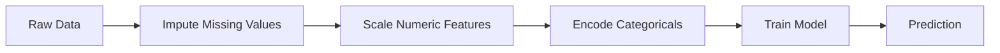
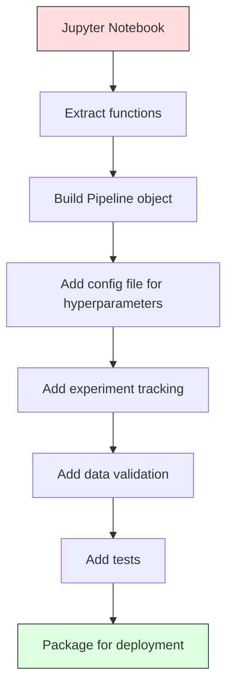

# ML Pipelines

> 模型不是产品。管道是。管道包括从原始数据到部署预测的一切，每一步都必须是可重复的。

** 类型：** 构建
** 语言：** Python
** 先决条件：** 第2阶段，第12课（超参数调整）
** 时间：** ~120分钟

## Learning Objectives

- 从头开始构建ML管道，将估算、缩放、编码和模型训练链接到单个可重复对象中
- 识别数据泄露场景并解释管道如何通过仅在训练数据上安装变压器来防止数据泄露
- 构建一个可以对数字和分类要素应用不同预处理的柱子Transformer
- 实施管道系列化并证明相同的安装管道在培训和生产中产生相同的结果

## The Problem

您有一个笔记本，可以加载数据、用中位数填充缺失值、缩放要素、训练模型并打印准确性。有时灵你把它运出去。

一个月后，有人重新训练模型并得到不同的结果。中位数是在包括测试数据（数据泄露）的完整数据集上计算的。未保存缩放参数，因此推断使用不同的统计数据。特征工程代码在培训和服务之间被复制粘贴，并且副本出现了分歧。分类列在生产中获得了编码器从未见过的新价值。

这些都不是假设的。它们是ML系统在生产中失败的最常见原因。管道通过将每个转换步骤打包到单个、有序、可重复的对象中来解决所有问题。

## The Concept

### What a Pipeline Is

管道是后面跟着模型的数据转换的有序序列。每个步骤都将上一步的输出作为输入。整个管道只需根据训练数据进行一次调整。在推理时，相同的匹配管道转换新数据并生成预测。



管道保证：
- 转换仅适用于训练数据（无泄漏）
- 在推理时应用相同的转换
- 整个对象可以序列化并作为一个工件部署
- 交叉验证按倍数应用管道，防止细微泄漏

### Data Leakage: The Silent Killer

当来自测试集或未来数据的信息污染训练时，就会发生数据泄露。管道防止最常见的形式。

** 漏水（错误）：**
```python
X = df.drop("target", axis=1)
y = df["target"]

scaler = StandardScaler()
X_scaled = scaler.fit_transform(X)

X_train, X_test = X_scaled[:800], X_scaled[800:]
y_train, y_test = y[:800], y[800:]
```

秤员看到了测试数据。平均值和标准差包括测试样本。这增加了准确性估计。

** 正确：**
```python
X_train, X_test = X[:800], X[800:]

scaler = StandardScaler()
X_train_scaled = scaler.fit_transform(X_train)
X_test_scaled = scaler.transform(X_test)
```

有了管道，您就不需要考虑这一点。管道会自动处理它。

### sklearn Pipeline

sklearn的“Pipeline”链接了变压器和估计器。它公开了按顺序应用所有步骤的“.fit（）”、“.predict（）”和“.score（）”。

```python
from sklearn.pipeline import Pipeline
from sklearn.preprocessing import StandardScaler
from sklearn.linear_model import LogisticRegression

pipe = Pipeline([
    ("scaler", StandardScaler()),
    ("model", LogisticRegression()),
])

pipe.fit(X_train, y_train)
predictions = pipe.predict(X_test)
```

当您调用“pipe.fit（X_train，y_train）”时：
1. Scaler在X_train上调用“fit_transform”
2. 模型在缩放的X_train上调用“fit”

当您调用“pipe.predict（X_Test）”时：
1. Scaler在X_Test上调用“transform”（不是fit_transform）
2. 模型在缩放X_测试中调用“预测”

缩放器在适配期间永远不会看到测试数据。这就是重点。

### ColumnTransformer: Different Pipelines for Different Columns

真实数据集具有需要不同预处理的数字列和类别列。“ColumnTransformer”处理这个问题。

```python
from sklearn.compose import ColumnTransformer
from sklearn.preprocessing import StandardScaler, OneHotEncoder
from sklearn.impute import SimpleImputer

numeric_pipe = Pipeline([
    ("impute", SimpleImputer(strategy="median")),
    ("scale", StandardScaler()),
])

categorical_pipe = Pipeline([
    ("impute", SimpleImputer(strategy="most_frequent")),
    ("encode", OneHotEncoder(handle_unknown="ignore")),
])

preprocessor = ColumnTransformer([
    ("num", numeric_pipe, ["age", "income", "score"]),
    ("cat", categorical_pipe, ["city", "gender", "plan"]),
])

full_pipeline = Pipeline([
    ("preprocess", preprocessor),
    ("model", GradientBoostingClassifier()),
])
```

OneHotEncoder中的“handle_unknown=“ignore”对于生产至关重要。当出现新类别（模型从未见过的城市）时，它会产生零载体而不是崩溃。

### Experiment Tracking

管道使训练具有可重复性，但您还需要跟踪实验中发生的事情：使用了哪些超参数、哪个数据集版本、指标是什么、正在运行哪些代码。

**MLFlow** 是最常见的开源解决方案：

```python
import mlflow

with mlflow.start_run():
    mlflow.log_param("max_depth", 5)
    mlflow.log_param("n_estimators", 100)
    mlflow.log_param("learning_rate", 0.1)

    pipe.fit(X_train, y_train)
    accuracy = pipe.score(X_test, y_test)

    mlflow.log_metric("accuracy", accuracy)
    mlflow.sklearn.log_model(pipe, "model")
```

每次运行都会记录参数、指标、工件和完整模型。您可以比较运行、复制任何实验并部署任何模型版本。

** 权重和偏置（wandb）** 通过托管仪表板提供相同的功能：

```python
import wandb

wandb.init(project="my-pipeline")
wandb.config.update({"max_depth": 5, "n_estimators": 100})

pipe.fit(X_train, y_train)
accuracy = pipe.score(X_test, y_test)

wandb.log({"accuracy": accuracy})
```

### Model Versioning

实验跟踪后，您需要管理模型版本。哪个型号正在生产？哪个是舞台？哪个是上周的？

MLFlow的模型注册表提供：
- ** 版本跟踪：** 每个保存的模型都会获得一个版本号
- ** 舞台过渡：**“舞台”、“制作”、“存档”
- ** 审批工作流程：** 型号必须明确升级为生产
- ** 回滚：** 立即切换回以前的版本

### Data Versioning with DVC

代码是用git版本化的。数据也应该被版本化，但git无法处理大文件。DVC（数据版本控制）解决了这个问题。

```
dvc init
dvc add data/training.csv
git add data/training.csv.dvc data/.gitignore
git commit -m "Track training data"
dvc push
```

DVC将实际数据存储在远程存储（S3，GCS，Azure）中，并在git中保存一个小的.dvc文件来记录哈希值。当你签出一个git commit的时候，`dvc checkout`会恢复你使用的数据。

这意味着每个git提交都会固定代码和数据。完全的重复性。

### Reproducible Experiments

可重复的实验需要四件事：

1. ** 修复随机种子：** 为numpy、随机和框架设置种子（torch、sklearn）
2. ** 固定的依赖项：** relevments.text或poety.lock具有确切版本
3. ** 版本数据：** DVC或类似数据
4. ** 配置文件：** 配置中的所有超参数，而不是硬编码

```python
import numpy as np
import random

def set_seed(seed=42):
    random.seed(seed)
    np.random.seed(seed)
    try:
        import torch
        torch.manual_seed(seed)
        torch.cuda.manual_seed_all(seed)
        torch.backends.cudnn.deterministic = True
    except ImportError:
        pass
```

### From Notebook to Production Pipeline



典型进展：

1. ** 笔记本探索：** 快速实验、可视化、特色创意
2. ** 提取功能：** 将预处理、特征工程、评估转移到模块中
3. ** 构建管道：** 将转换链到sklearn Pipeline或自定义类
4. ** 配置管理：** 将所有超参数移至YML/JSON配置
5. ** 实验跟踪：** 添加MLFlow或wandb日志
6. ** 数据验证：** 训练前检查模式、分布和缺失值模式
7. ** 测试：** 变压器的单元测试，整个管道的集成测试
8. ** 部署：** 序列化管道，包裹在API（FastAPI、Flaska）中，容器化

### Common Pipeline Mistakes

| 错误 | 为什么它不好 | 修复 |
|---------|-------------|-----|
| 在拆分之前对完整数据进行匹配 | 数据泄露 | 将Pipeline与cross_val_score一起使用 |
| 管道外特色工程 | 不同的转换在火车vs发球 | 将所有转换放入管道中 |
| 不处理未知类别 | 新价值观的生产崩溃 | OneHotEncoder（handle_unknown=“ignore”） |
| 硬编码列名 | 模式更改时中断 | 使用配置中的列名列表 |
| 无数据验证 | 对不良数据的无声错误预测 | 预测前添加模式检查 |
| 训练/发球倾斜 | 模型在产品中看到了不同的功能 | 一个Pipeline对象用于两者 |

## Build It

' code/pipeline.py '中的代码从头开始构建完整的ML管道：

### Step 1: Custom Transformer

```python
class CustomTransformer:
    def __init__(self):
        self.means = None
        self.stds = None

    def fit(self, X):
        self.means = np.mean(X, axis=0)
        self.stds = np.std(X, axis=0)
        self.stds[self.stds == 0] = 1.0
        return self

    def transform(self, X):
        return (X - self.means) / self.stds

    def fit_transform(self, X):
        return self.fit(X).transform(X)
```

### Step 2: Pipeline from Scratch

```python
class PipelineFromScratch:
    def __init__(self, steps):
        self.steps = steps

    def fit(self, X, y=None):
        X_current = X.copy()
        for name, step in self.steps[:-1]:
            X_current = step.fit_transform(X_current)
        name, model = self.steps[-1]
        model.fit(X_current, y)
        return self

    def predict(self, X):
        X_current = X.copy()
        for name, step in self.steps[:-1]:
            X_current = step.transform(X_current)
        name, model = self.steps[-1]
        return model.predict(X_current)
```

### Step 3: Cross-Validation with Pipeline

该代码演示了使用管道的交叉验证如何防止数据泄露：缩放器分别适合每个折叠的训练数据。

### Step 4: Full Production Pipeline with sklearn

一个完整的管道，包含“ColumnTransformer”、多个预处理路径和一个模型，使用适当的交叉验证和实验日志进行训练。

## Ship It

本课产生：
- '输出/prompt-ml-pipeline.md '--构建和调试ML管道的技能
- ' code/pipeline.py '--通过sklearn从头开始的完整管道

## Exercises

1. 构建一个处理具有3个数字列和2个分类列的数据集的管道。使用“ColumnTransformer”对数字应用中位数插补+缩放，并对类别应用最频繁的插补+一次性编码。通过5重交叉验证进行培训。

2. 故意引入数据泄漏：在拆分之前在完整数据集上安装缩放器。比较交叉验证分数（泄漏）与管道交叉验证分数（干净）。差异有多大？

3. 使用“jobib.dump”序列化您的管道。将其加载到单独的脚本中并运行预测。验证预测是否相同。

4. 将自定义Transformer添加到管道中，为两个最重要的数字列创建多项特征（2次）。管道中应该流向哪里？

5. 为管道设置MLFlow跟踪。使用不同的超参数运行5个实验。使用MLFlow UI（' mlFlow ui '）比较运行并选择最佳模型。

## Key Terms

| Term | 别人怎么说 | 它实际上意味着什么 |
|------|----------------|----------------------|
| 管道 | “转变链+模型” | 一个有序的装配变压器序列和一个模型，作为一个单元用于防止泄漏 |
| 数据泄露 | “测试信息泄露到培训中” | 使用来自训练集外部的信息来构建模型，夸大性能估计 |
| 列变压器 | “每列不同的预处理” | 将不同的管道复制到不同的列子集，合并结果 |
| 实验跟踪 | “记录您的跑步” | 记录每次培训运行的参数、指标、工件和代码版本 |
| MLflow | “跟踪和部署模型” | 用于实验跟踪、模型注册和部署的开源平台 |
| DVC | “Git for Data” | 用于大数据文件的版本控制系统，将散列存储在git中，将数据存储在远程存储中 |
| 登记处示范 | “型号版本目录” | 跟踪带有舞台标签（舞台、制作、存档）的模型版本的系统 |
| 训练/发球倾斜 | “它在笔记本中起作用” | 训练期间数据处理方式与推理期间数据处理方式之间的差异，导致无声错误 |
| 再现性 | “相同的代码，相同的结果” | 能够从相同的代码、数据和配置获得相同的结果 |

## Further Reading

- [scikit-learn Pipeline docs]（https：//scikit-learn.org/stable/modules/compose.html）--官方管道参考
- [MLFlow文档]（https：//mlFlow.org/docs/latest/index.html）--实验跟踪和模型注册
- [DVC文档]（https：//dvc.org/Doc）--数据版本控制
- [斯卡利等人，机器学习系统中隐藏的技术债务（2015）]（https：//papers.nips.cc/paper/2015/hash/86df7dcaf2674f757a2463eba-Abstract.html）--关于ML系统复杂性的开创性论文
- [Google ML最佳实践：ML规则]（https：//developers.google.com/machine-learning/guides/rules-of-ml）--实际生产ML建议
