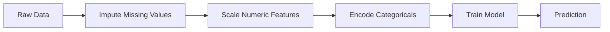
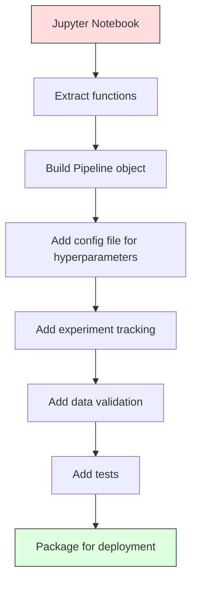

# 13 · 机器学习流水线

> 模型不是产品，流水线才是。流水线涵盖从原始数据到部署预测的全部环节，而每一步都必须是可复现的。

**类型：** 构建（Build）
**语言：** Python
**前置：** 第 2 阶段，第 12 课（超参数调优）
**时长：** 约 120 分钟

## 学习目标

- 从零构建一条机器学习流水线，把缺失值填充、缩放、编码与模型训练串联进一个可复现的对象
- 识别数据泄漏（data leakage）场景，并解释流水线如何通过仅在训练数据上拟合转换器来加以防范
- 构建一个 `ColumnTransformer`，对数值特征与类别特征施加不同的预处理
- 实现流水线的序列化，并证明同一条拟合好的流水线在训练与生产环境中产生完全一致的结果

## 问题所在

你有一个 notebook，它加载数据、用中位数填充缺失值、缩放特征、训练模型并打印准确率。它能跑通，于是你把它发布了。

一个月后，有人重新训练了这个模型，却得到了不同的结果。原来中位数是在包含测试数据的完整数据集上计算的（数据泄漏）；缩放参数没有被保存，所以推理时用的是不同的统计量；特征工程代码在训练端和服务端之间是复制粘贴的，两份副本后来逐渐发生了分歧；某个类别列在生产环境中出现了一个编码器从未见过的新取值。

这些都不是假想的情况。它们恰恰是机器学习系统在生产环境中失败的最常见原因。流水线通过把每一个转换步骤打包进单一、有序、可复现的对象，一次性解决了所有这些问题。

## 核心概念

### 什么是流水线

流水线（Pipeline）是一串有序的数据转换，其后接一个模型。每一步都把上一步的输出作为自己的输入。整条流水线在训练数据上拟合一次。在推理时，同一条拟合好的流水线对新数据进行转换并产出预测。



流水线保证：
- 转换只在训练数据上拟合（无泄漏）
- 推理时施加的是同一套转换
- 整个对象可以被序列化，并作为单一制品（artifact）部署
- 交叉验证会在每一折上分别施加流水线，从而防范隐蔽的泄漏

### 数据泄漏：沉默的杀手

数据泄漏发生在测试集或未来数据的信息污染了训练过程之时。流水线能防范其中最常见的几种形式。

**有泄漏（错误）：**
```python
X = df.drop("target", axis=1)
y = df["target"]

scaler = StandardScaler()
X_scaled = scaler.fit_transform(X)

X_train, X_test = X_scaled[:800], X_scaled[800:]
y_train, y_test = y[:800], y[800:]
```

缩放器看到了测试数据。均值和标准差里掺入了测试样本，这会虚高准确率的估计。

**正确：**
```python
X_train, X_test = X[:800], X[800:]

scaler = StandardScaler()
X_train_scaled = scaler.fit_transform(X_train)
X_test_scaled = scaler.transform(X_test)
```

有了流水线，你根本不需要操心这件事。流水线会自动处理它。

### sklearn 流水线

sklearn 的 `Pipeline` 把多个转换器和一个估计器（estimator）串联起来。它对外暴露 `.fit()`、`.predict()` 和 `.score()`，会按顺序施加所有步骤。

```python
from sklearn.pipeline import Pipeline
from sklearn.preprocessing import StandardScaler
from sklearn.linear_model import LogisticRegression

pipe = Pipeline([
    ("scaler", StandardScaler()),
    ("model", LogisticRegression()),
])

pipe.fit(X_train, y_train)
predictions = pipe.predict(X_test)
```

当你调用 `pipe.fit(X_train, y_train)` 时：
1. 缩放器对 X_train 调用 `fit_transform`
2. 模型对缩放后的 X_train 调用 `fit`

当你调用 `pipe.predict(X_test)` 时：
1. 缩放器对 X_test 调用 `transform`（而非 fit_transform）
2. 模型对缩放后的 X_test 调用 `predict`

缩放器在拟合过程中从不会看到测试数据。这正是它的全部意义所在。

### ColumnTransformer：为不同的列配置不同的流水线

真实数据集中既有数值列也有类别列，它们需要不同的预处理。`ColumnTransformer` 正是用来处理这一点的。

```python
from sklearn.compose import ColumnTransformer
from sklearn.preprocessing import StandardScaler, OneHotEncoder
from sklearn.impute import SimpleImputer

numeric_pipe = Pipeline([
    ("impute", SimpleImputer(strategy="median")),
    ("scale", StandardScaler()),
])

categorical_pipe = Pipeline([
    ("impute", SimpleImputer(strategy="most_frequent")),
    ("encode", OneHotEncoder(handle_unknown="ignore")),
])

preprocessor = ColumnTransformer([
    ("num", numeric_pipe, ["age", "income", "score"]),
    ("cat", categorical_pipe, ["city", "gender", "plan"]),
])

full_pipeline = Pipeline([
    ("preprocess", preprocessor),
    ("model", GradientBoostingClassifier()),
])
```

OneHotEncoder 中的 `handle_unknown="ignore"` 对生产环境至关重要。当出现一个新类别（一个模型从未见过的城市）时，它会产生一个全零向量，而不是直接崩溃。

### 实验追踪

流水线让训练变得可复现，但你还需要追踪各次实验之间发生了什么：用了哪些超参数、哪个版本的数据集、指标是多少、运行的是哪份代码。

**MLflow** 是最常用的开源方案：

```python
import mlflow

with mlflow.start_run():
    mlflow.log_param("max_depth", 5)
    mlflow.log_param("n_estimators", 100)
    mlflow.log_param("learning_rate", 0.1)

    pipe.fit(X_train, y_train)
    accuracy = pipe.score(X_test, y_test)

    mlflow.log_metric("accuracy", accuracy)
    mlflow.sklearn.log_model(pipe, "model")
```

每一次运行都会被记录下来，包括参数、指标、制品以及完整的模型。你可以对比各次运行、复现任意一次实验，并部署任意一个模型版本。

**Weights & Biases（wandb）** 提供同样的功能，并配有一个托管式仪表盘：

```python
import wandb

wandb.init(project="my-pipeline")
wandb.config.update({"max_depth": 5, "n_estimators": 100})

pipe.fit(X_train, y_train)
accuracy = pipe.score(X_test, y_test)

wandb.log({"accuracy": accuracy})
```

### 模型版本管理

在实验追踪之后，你需要管理模型的各个版本。哪个模型在生产环境？哪个在预发布（staging）？哪个是上周的？

MLflow 的模型注册表（Model Registry）提供：
- **版本追踪：** 每个保存的模型都会获得一个版本号
- **阶段切换：** "Staging"、"Production"、"Archived"
- **审批流程：** 模型必须被显式提升到生产环境
- **回滚：** 立即切换回先前的某个版本

### 用 DVC 进行数据版本管理

代码用 git 做版本管理。数据也应当做版本管理，但 git 无法处理大文件。DVC（数据版本控制，Data Version Control）解决了这个问题。

```
dvc init
dvc add data/training.csv
git add data/training.csv.dvc data/.gitignore
git commit -m "Track training data"
dvc push
```

DVC 把真实数据存放在远程存储（S3、GCS、Azure）中，并在 git 里保留一个记录哈希值的小巧 `.dvc` 文件。当你检出某个 git 提交时，`dvc checkout` 会还原出当时所用的那份确切数据。

这意味着每个 git 提交都同时锁定了代码与数据，从而实现完全可复现。

### 可复现的实验

一个可复现的实验需要四样东西：

1. **固定随机种子：** 为 numpy、random 以及所用框架（torch、sklearn）设置种子
2. **锁定依赖：** 带有确切版本号的 requirements.txt 或 poetry.lock
3. **版本化的数据：** DVC 或类似工具
4. **配置文件：** 所有超参数都写在配置里，而非硬编码

```python
import numpy as np
import random

def set_seed(seed=42):
    random.seed(seed)
    np.random.seed(seed)
    try:
        import torch
        torch.manual_seed(seed)
        torch.cuda.manual_seed_all(seed)
        torch.backends.cudnn.deterministic = True
    except ImportError:
        pass
```

### 从 Notebook 到生产流水线



典型的演进过程：

1. **Notebook 探索：** 快速实验、可视化、特征构想
2. **抽取函数：** 把预处理、特征工程、评估迁移到模块中
3. **构建流水线：** 把转换串联进一个 sklearn Pipeline 或自定义类
4. **配置管理：** 把所有超参数迁移到 YAML/JSON 配置里
5. **实验追踪：** 加入 MLflow 或 wandb 的日志记录
6. **数据校验：** 在训练前检查模式（schema）、分布以及缺失值的形态
7. **测试：** 为转换器编写单元测试，为整条流水线编写集成测试
8. **部署：** 序列化流水线，用 API（FastAPI、Flask）包装，并容器化

### 常见的流水线错误

| 错误 | 为何不好 | 修正方法 |
|---------|-------------|-----|
| 在切分之前就在全量数据上拟合 | 数据泄漏 | 配合 cross_val_score 使用 Pipeline |
| 在流水线之外做特征工程 | 训练与服务时的转换不一致 | 把所有转换都放进 Pipeline |
| 不处理未知类别 | 遇到新取值时生产环境崩溃 | OneHotEncoder(handle_unknown="ignore") |
| 硬编码列名 | 模式变化时就会出错 | 从配置读取列名列表 |
| 没有数据校验 | 对坏数据悄无声息地给出错误预测 | 在预测前加入模式检查 |
| 训练/服务偏斜 | 模型在生产中看到的是不同的特征 | 训练与服务共用同一个 Pipeline 对象 |

## 动手构建

`code/pipeline.py` 中的代码从零构建了一条完整的机器学习流水线：

### 第 1 步：自定义转换器

```python
class CustomTransformer:
    def __init__(self):
        self.means = None
        self.stds = None

    def fit(self, X):
        self.means = np.mean(X, axis=0)
        self.stds = np.std(X, axis=0)
        self.stds[self.stds == 0] = 1.0
        return self

    def transform(self, X):
        return (X - self.means) / self.stds

    def fit_transform(self, X):
        return self.fit(X).transform(X)
```

### 第 2 步：从零实现流水线

```python
class PipelineFromScratch:
    def __init__(self, steps):
        self.steps = steps

    def fit(self, X, y=None):
        X_current = X.copy()
        for name, step in self.steps[:-1]:
            X_current = step.fit_transform(X_current)
        name, model = self.steps[-1]
        model.fit(X_current, y)
        return self

    def predict(self, X):
        X_current = X.copy()
        for name, step in self.steps[:-1]:
            X_current = step.transform(X_current)
        name, model = self.steps[-1]
        return model.predict(X_current)
```

### 第 3 步：配合流水线的交叉验证

这段代码演示了配合流水线的交叉验证如何防范数据泄漏：缩放器是在每一折的训练数据上分别拟合的。

### 第 4 步：用 sklearn 实现完整的生产流水线

一条完整的流水线，包含 `ColumnTransformer`、多条预处理路径以及一个模型，通过恰当的交叉验证进行训练，并带有实验日志记录。

## 交付成果

本课产出：
- `outputs/prompt-ml-pipeline.md` —— 一个用于构建与调试机器学习流水线的 skill
- `code/pipeline.py` —— 一条从零实现直至 sklearn 的完整流水线

## 练习

1. 构建一条流水线，处理一个含有 3 个数值列和 2 个类别列的数据集。用 `ColumnTransformer` 对数值列施加中位数填充 + 缩放，对类别列施加最频繁值填充 + 独热编码（one-hot encoding）。用 5 折交叉验证进行训练。

2. 故意引入数据泄漏：在切分之前就在全量数据集上拟合缩放器。把（有泄漏的）交叉验证分数与（干净的）流水线交叉验证分数作对比。差距有多大？

3. 用 `joblib.dump` 序列化你的流水线。在另一个脚本里加载它并运行预测。验证预测结果完全一致。

4. 向流水线添加一个自定义转换器，为最重要的两个数值列创建多项式特征（2 次）。它应该放在流水线的哪个位置？

5. 为流水线设置 MLflow 追踪。用不同的超参数运行 5 次实验。用 MLflow UI（`mlflow ui`）对比各次运行并挑选最佳模型。

## 关键术语

| 术语 | 人们怎么说 | 它实际指什么 |
|------|----------------|----------------------|
| 流水线（Pipeline） | "转换链 + 模型" | 一串拟合好的转换器加一个模型组成的有序序列，作为一个整体施加以防止泄漏 |
| 数据泄漏（Data leakage） | "测试信息漏进了训练" | 用训练集之外的信息来构建模型，从而虚高性能估计 |
| ColumnTransformer | "针对不同列的不同预处理" | 对不同的列子集施加不同的流水线，并将结果合并 |
| 实验追踪（Experiment tracking） | "记录你的运行" | 为每次训练运行记录参数、指标、制品和代码版本 |
| MLflow | "追踪并部署模型" | 用于实验追踪、模型注册表和部署的开源平台 |
| DVC | "数据界的 git" | 面向大数据文件的版本控制系统，在 git 里存哈希、在远程存储里存数据 |
| 模型注册表（Model registry） | "模型版本目录" | 一套用阶段标签（staging、production、archived）追踪模型版本的系统 |
| 训练/服务偏斜（Training/serving skew） | "它在 notebook 里是好用的" | 训练时与推理时数据处理方式之间的差异，会导致悄无声息的错误 |
| 可复现性（Reproducibility） | "同样的代码，同样的结果" | 在相同的代码、数据与配置下获得完全一致结果的能力 |

## 延伸阅读

- [scikit-learn Pipeline 文档](https://scikit-learn.org/stable/modules/compose.html) —— 官方流水线参考
- [MLflow 文档](https://mlflow.org/docs/latest/index.html) —— 实验追踪与模型注册表
- [DVC 文档](https://dvc.org/doc) —— 数据版本管理
- [Sculley 等人，《机器学习系统中隐藏的技术债务》（2015）](https://papers.nips.cc/paper/2015/hash/86df7dcfd896fcaf2674f757a2463eba-Abstract.html) —— 关于机器学习系统复杂度的开创性论文
- [Google 机器学习最佳实践：机器学习规则](https://developers.google.com/machine-learning/guides/rules-of-ml) —— 实用的生产级机器学习建议
