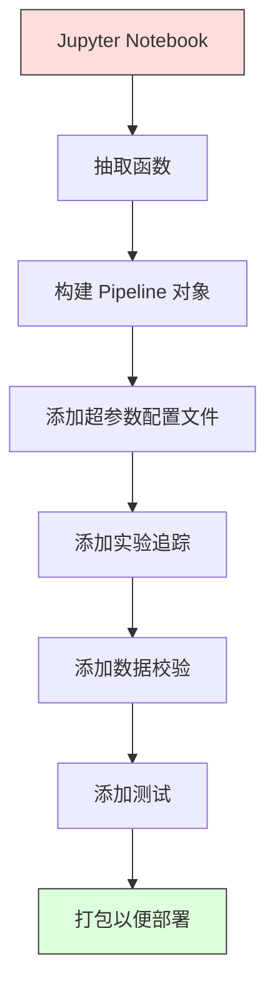

# ML 流水线（ML Pipelines）

> 译注：本文译自同目录 [`en.md`](./en.md)。术语遵循仓根 [TRANSLATION_GUIDE.md](../../../../TRANSLATION_GUIDE.md)。

> 模型不是产品，流水线（pipeline）才是。流水线涵盖从原始数据到上线预测的全部步骤，每一步都必须可复现。

**Type:** Build
**Language:** Python
**Prerequisites:** Phase 2, Lesson 12 (Hyperparameter Tuning)
**Time:** ~120 minutes

## 学习目标（Learning Objectives）

- 从零搭建一条 ML 流水线，把缺失值填充、缩放、编码和模型训练串成一个可复现的对象
- 识别数据泄漏（data leakage）的常见场景，解释流水线如何通过仅在训练数据上 fit transformer 来防止泄漏
- 构造一个 `ColumnTransformer`，对数值特征和类别特征应用不同的预处理
- 实现流水线的序列化，并验证同一个已 fit 的流水线在训练和生产中产生完全一致的结果

## 问题（The Problem）

你有个 notebook：加载数据、用中位数填补缺失值、缩放特征、训练模型、打印准确率。一切正常。你上线了。

一个月后，有人重新训练，结果对不上了。原来中位数是在包含测试数据的全量数据集上算的（数据泄漏）。缩放参数没保存，推理时用的是不同的统计量。特征工程代码在训练和服务两边复制粘贴，两份副本已经各自演化分叉。生产里某个类别列冒出了一个 encoder 从没见过的新值。

这些不是假想的场景，它们就是 ML 系统在生产中翻车的最常见原因。流水线把每一步变换都打包进一个有序、可复现的对象里，一次性解决所有这些问题。

## 概念（The Concept）

### 什么是流水线（What a Pipeline Is）

流水线是一段有序的数据变换序列，末尾接一个模型。每一步都把前一步的输出作为输入。整条流水线在训练数据上 fit 一次。推理时，同一条已 fit 的流水线对新数据做变换并输出预测。


流水线保证：
- 变换只在训练数据上 fit（不泄漏）
- 推理时应用完全相同的变换
- 整个对象可以序列化为单一 artifact 部署
- 交叉验证按 fold 应用流水线，避免微妙的泄漏

### 数据泄漏：沉默的杀手（Data Leakage: The Silent Killer）

数据泄漏指测试集或未来数据的信息污染了训练过程。流水线能阻断最常见的几种形式。

**泄漏（错误）：**
```python
X = df.drop("target", axis=1)
y = df["target"]

scaler = StandardScaler()
X_scaled = scaler.fit_transform(X)

X_train, X_test = X_scaled[:800], X_scaled[800:]
y_train, y_test = y[:800], y[800:]
```

scaler 看见了测试数据。均值和标准差里混入了测试样本，准确率估计被虚高。

**正确：**
```python
X_train, X_test = X[:800], X[800:]

scaler = StandardScaler()
X_train_scaled = scaler.fit_transform(X_train)
X_test_scaled = scaler.transform(X_test)
```

用了流水线，你根本不用想这件事，它自动帮你处理好。

### sklearn Pipeline

sklearn 的 `Pipeline` 把若干 transformer 和一个 estimator 串起来，对外暴露 `.fit()`、`.predict()`、`.score()`，按顺序应用所有步骤。

```python
from sklearn.pipeline import Pipeline
from sklearn.preprocessing import StandardScaler
from sklearn.linear_model import LogisticRegression

pipe = Pipeline([
    ("scaler", StandardScaler()),
    ("model", LogisticRegression()),
])

pipe.fit(X_train, y_train)
predictions = pipe.predict(X_test)
```

当你调用 `pipe.fit(X_train, y_train)`：
1. scaler 在 X_train 上调用 `fit_transform`
2. model 在缩放后的 X_train 上调用 `fit`

当你调用 `pipe.predict(X_test)`：
1. scaler 在 X_test 上调用 `transform`（不是 fit_transform）
2. model 在缩放后的 X_test 上调用 `predict`

scaler 在 fit 阶段从来不会接触测试数据。这就是流水线的全部意义。

### ColumnTransformer：给不同列上不同流水线（ColumnTransformer: Different Pipelines for Different Columns）

真实数据集里数值列和类别列需要不一样的预处理，`ColumnTransformer` 就是干这个的。

```python
from sklearn.compose import ColumnTransformer
from sklearn.preprocessing import StandardScaler, OneHotEncoder
from sklearn.impute import SimpleImputer

numeric_pipe = Pipeline([
    ("impute", SimpleImputer(strategy="median")),
    ("scale", StandardScaler()),
])

categorical_pipe = Pipeline([
    ("impute", SimpleImputer(strategy="most_frequent")),
    ("encode", OneHotEncoder(handle_unknown="ignore")),
])

preprocessor = ColumnTransformer([
    ("num", numeric_pipe, ["age", "income", "score"]),
    ("cat", categorical_pipe, ["city", "gender", "plan"]),
])

full_pipeline = Pipeline([
    ("preprocess", preprocessor),
    ("model", GradientBoostingClassifier()),
])
```

OneHotEncoder 里的 `handle_unknown="ignore"` 对生产至关重要：当出现一个新类别（比如模型从没见过的城市），它会输出零向量，而不是直接崩溃。

### 实验追踪（Experiment Tracking）

流水线让训练可复现，但你还需要追踪每次实验都发生了什么：用了哪些超参数、哪个版本的数据集、指标是多少、跑的是哪一份代码。

**MLflow** 是最常见的开源方案：

```python
import mlflow

with mlflow.start_run():
    mlflow.log_param("max_depth", 5)
    mlflow.log_param("n_estimators", 100)
    mlflow.log_param("learning_rate", 0.1)

    pipe.fit(X_train, y_train)
    accuracy = pipe.score(X_test, y_test)

    mlflow.log_metric("accuracy", accuracy)
    mlflow.sklearn.log_model(pipe, "model")
```

每次 run 都连同参数、指标、artifact、完整模型一起记录下来。你可以对比 run、复现任意实验、部署任意模型版本。

**Weights & Biases (wandb)** 提供同样的能力，加一个托管的仪表盘：

```python
import wandb

wandb.init(project="my-pipeline")
wandb.config.update({"max_depth": 5, "n_estimators": 100})

pipe.fit(X_train, y_train)
accuracy = pipe.score(X_test, y_test)

wandb.log({"accuracy": accuracy})
```

### 模型版本管理（Model Versioning）

实验追踪之后，你还得管理模型版本：哪个模型在生产？哪个在 staging？上周那个又是哪个？

MLflow 的 Model Registry 提供：
- **版本追踪：** 每个保存的模型都有版本号
- **阶段流转：** "Staging"、"Production"、"Archived"
- **审批流程：** 模型必须显式提升到生产
- **回滚：** 一键切回上一个版本

### 用 DVC 做数据版本管理（Data Versioning with DVC）

代码用 git 管版本，数据也应该有版本管理，但 git 处理不了大文件。DVC（Data Version Control）就是解决这个问题的。

```
dvc init
dvc add data/training.csv
git add data/training.csv.dvc data/.gitignore
git commit -m "Track training data"
dvc push
```

DVC 把真实数据放在远端存储（S3、GCS、Azure），只在 git 里留一个小小的 `.dvc` 文件记录哈希。当你 checkout 某个 git commit 时，`dvc checkout` 会还原出当时使用的那份数据。

这意味着每个 git commit 同时锁定代码和数据，全方位可复现。

### 可复现的实验（Reproducible Experiments）

一个可复现的实验需要四样东西：

1. **固定随机种子：** 给 numpy、random、框架（torch、sklearn）都设种子
2. **锁定依赖：** requirements.txt 或 poetry.lock，写死版本号
3. **数据带版本：** DVC 或类似工具
4. **配置文件：** 所有超参数放进 config，不要硬编码

```python
import numpy as np
import random

def set_seed(seed=42):
    random.seed(seed)
    np.random.seed(seed)
    try:
        import torch
        torch.manual_seed(seed)
        torch.cuda.manual_seed_all(seed)
        torch.backends.cudnn.deterministic = True
    except ImportError:
        pass
```

### 从 notebook 到生产流水线（From Notebook to Production Pipeline）



典型的演进路径：

1. **notebook 探索：** 快速实验、可视化、特征灵感
2. **抽出函数：** 把预处理、特征工程、评估搬进模块
3. **搭建 Pipeline：** 把变换串成 sklearn Pipeline 或自定义类
4. **配置管理：** 所有超参数挪到 YAML/JSON 配置里
5. **实验追踪：** 接入 MLflow 或 wandb 日志
6. **数据校验：** 训练前检查 schema、分布、缺失值模式
7. **测试：** transformer 写单测，整条流水线写集成测试
8. **部署：** 序列化流水线，包成 API（FastAPI、Flask），打成容器

### 流水线常见错误（Common Pipeline Mistakes）

| 错误 | 为什么不好 | 修复 |
|---------|-------------|-----|
| 在切分前对全量数据 fit | 数据泄漏 | 用 Pipeline 配合 cross_val_score |
| 在流水线外做特征工程 | 训练和服务时变换不一致 | 把所有变换塞进 Pipeline |
| 不处理未知类别 | 生产遇到新值崩溃 | OneHotEncoder(handle_unknown="ignore") |
| 硬编码列名 | schema 变了就坏 | 从 config 读列名列表 |
| 没有数据校验 | 坏数据上静默给出错误预测 | 预测前加 schema 检查 |
| 训练/服务偏移（training/serving skew） | 模型在生产看到不一样的特征 | 训练和服务共用一个 Pipeline 对象 |

## 动手实现（Build It）

`code/pipeline.py` 里的代码从零搭起一条完整的 ML 流水线：

### 第 1 步：自定义 transformer（Custom Transformer）

```python
class CustomTransformer:
    def __init__(self):
        self.means = None
        self.stds = None

    def fit(self, X):
        self.means = np.mean(X, axis=0)
        self.stds = np.std(X, axis=0)
        self.stds[self.stds == 0] = 1.0
        return self

    def transform(self, X):
        return (X - self.means) / self.stds

    def fit_transform(self, X):
        return self.fit(X).transform(X)
```

### 第 2 步：从零写 Pipeline（Pipeline from Scratch）

```python
class PipelineFromScratch:
    def __init__(self, steps):
        self.steps = steps

    def fit(self, X, y=None):
        X_current = X.copy()
        for name, step in self.steps[:-1]:
            X_current = step.fit_transform(X_current)
        name, model = self.steps[-1]
        model.fit(X_current, y)
        return self

    def predict(self, X):
        X_current = X.copy()
        for name, step in self.steps[:-1]:
            X_current = step.transform(X_current)
        name, model = self.steps[-1]
        return model.predict(X_current)
```

### 第 3 步：流水线 + 交叉验证（Cross-Validation with Pipeline）

代码会演示流水线配合交叉验证如何阻断数据泄漏：scaler 在每个 fold 的训练集上单独 fit。

### 第 4 步：用 sklearn 搭完整生产流水线（Full Production Pipeline with sklearn）

一条完整流水线：含 `ColumnTransformer`、多条预处理路径、一个模型，配合规范的交叉验证和实验日志训练。

## 上线部署（Ship It）

本课产出：
- `outputs/prompt-ml-pipeline.md` —— 一份用于搭建和调试 ML 流水线的 skill
- `code/pipeline.py` —— 一条从零到 sklearn 的完整流水线

## 练习（Exercises）

1. 搭建一条流水线处理一份含 3 个数值列、2 个类别列的数据集。用 `ColumnTransformer` 给数值列上中位数填补 + 缩放，给类别列上众数填补 + one-hot 编码。用 5-fold 交叉验证训练。

2. 故意制造数据泄漏：在切分前对全量数据 fit scaler。对比泄漏版的交叉验证分数和流水线版的交叉验证分数，差距有多大？

3. 用 `joblib.dump` 序列化你的流水线。在另一个脚本里加载并跑预测，验证结果完全一致。

4. 给流水线加一个自定义 transformer：对两个最重要的数值列生成多项式特征（degree 2）。它应该放在流水线里的哪个位置？

5. 为流水线接上 MLflow 追踪。跑 5 次实验，每次用不同的超参数。打开 MLflow UI（`mlflow ui`）对比 run，挑出最佳模型。

## 关键术语（Key Terms）

| 术语 | 大家嘴里的说法 | 实际含义 |
|------|----------------|----------------------|
| Pipeline | "一串变换 + 模型" | 一段已 fit 的 transformer 加模型组成的有序序列，作为一个整体使用以阻断泄漏 |
| Data leakage | "测试信息漏进训练" | 用了训练集之外的信息来构建模型，导致性能估计虚高 |
| ColumnTransformer | "不同列做不同预处理" | 对不同列子集应用不同流水线，再把结果拼起来 |
| Experiment tracking | "把实验记下来" | 给每次训练 run 记录参数、指标、artifact 和代码版本 |
| MLflow | "追踪并部署模型" | 开源平台，做实验追踪、模型注册和部署 |
| DVC | "数据版的 git" | 大文件版本控制系统，把哈希存 git、数据存远端存储 |
| Model registry | "模型版本目录" | 一套带阶段标签（staging、production、archived）的模型版本管理系统 |
| Training/serving skew | "在 notebook 里明明能跑" | 训练和推理时数据处理方式不一致，导致悄无声息的错误 |
| Reproducibility | "同样的代码同样的结果" | 用同样的代码、数据、配置能得到完全一致的结果 |

## 延伸阅读（Further Reading）

- [scikit-learn Pipeline docs](https://scikit-learn.org/stable/modules/compose.html) —— 官方 pipeline 文档
- [MLflow documentation](https://mlflow.org/docs/latest/index.html) —— 实验追踪和模型注册
- [DVC documentation](https://dvc.org/doc) —— 数据版本管理
- [Sculley et al., Hidden Technical Debt in Machine Learning Systems (2015)](https://papers.nips.cc/paper/2015/hash/86df7dcfd896fcaf2674f757a2463eba-Abstract.html) —— ML 系统复杂度的奠基论文
- [Google ML Best Practices: Rules of ML](https://developers.google.com/machine-learning/guides/rules-of-ml) —— 生产 ML 的实战建议
