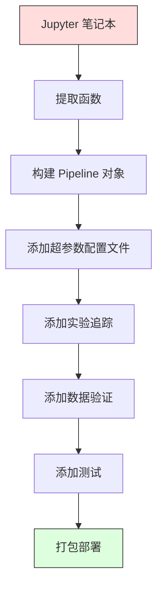

# ML 管道

> 模型不是产品。管道才是。管道是从原始数据到部署预测的一切，每一步都必须是可重现的。

**类型：** 构建
**语言：** Python
**前置要求：** 第二阶段，第12课（超参数调优）
**时间：** ~120分钟

## 学习目标

- 从头构建一个 ML 管道，将插补、缩放、编码和模型训练链接成一个可重现的单一对象
- 识别数据泄露场景，并解释管道如何通过仅在训练数据上拟合转换器来防止它们
- 构建一个对数值和类别特征应用不同预处理方式的 ColumnTransformer
- 实现管道序列化，并证明相同的拟合管道在训练和生产中产生相同的结果

## 问题

你有一个笔记本，加载数据，用中位数填充缺失值，缩放特征，训练模型，打印准确率。它能工作。你交付了它。

一个月后，有人重新训练模型，得到不同的结果。中位数是在包括测试数据的完整数据集上计算的（数据泄露）。缩放参数没有被保存，因此推理使用了不同的统计量。特征工程代码在训练和服务之间被复制粘贴，且副本出现了分歧。一个类别列在生产中出现了一个编码器从未见过的新值。

这些不是假设。它们是 ML 系统在生产中失败的最常见原因。管道通过将每个转换步骤打包成一个单一的、有序的、可重现的对象来解决所有这些问题。

## 概念

### 管道是什么

管道是一个有序的数据转换序列，后跟一个模型。每一步将前一步的输出作为输入。整个管道在训练数据上拟合一次。在推理时，相同的拟合管道转换新数据并产生预测。


```mermaid
flowchart LR
    A[原始数据] --> B[填充缺失值]
    B --> C[缩放数值特征]
    C --> D[编码类别特征]
    D --> E[训练模型]
    E --> F[预测]
```

管道保证：
- 转换仅在训练数据上拟合（无泄漏）
- 在推理时应用相同的转换
- 整个对象可以作为单个工件序列化和部署
- 交叉验证按折应用管道，防止微妙的泄漏

### 数据泄露：无声的杀手

当测试集或未来数据的信息污染了训练数据时，就发生了数据泄露。管道防止了最常见的形式。

**有泄漏（错误的）：**
```python
X = df.drop("target", axis=1)
y = df["target"]

scaler = StandardScaler()
X_scaled = scaler.fit_transform(X)

X_train, X_test = X_scaled[:800], X_scaled[800:]
y_train, y_test = y[:800], y[800:]
```

Scaler 看到了测试数据。均值和标准差包含了测试样本。这会夸大准确率估计。

**正确的：**
```python
X_train, X_test = X[:800], X[800:]

scaler = StandardScaler()
X_train_scaled = scaler.fit_transform(X_train)
X_test_scaled = scaler.transform(X_test)
```

使用管道，你不需要考虑这个。管道自动处理它。

### sklearn Pipeline

sklearn 的 `Pipeline` 链接转换器和估计器。它暴露了按顺序应用所有步骤的 `.fit()`、`.predict()` 和 `.score()` 方法。

```python
from sklearn.pipeline import Pipeline
from sklearn.preprocessing import StandardScaler
from sklearn.linear_model import LogisticRegression

pipe = Pipeline([
    ("scaler", StandardScaler()),
    ("model", LogisticRegression()),
])

pipe.fit(X_train, y_train)
predictions = pipe.predict(X_test)
```

当你调用 `pipe.fit(X_train, y_train)` 时：
1. Scaler 对 X_train 调用 `fit_transform`
2. 模型对缩放后的 X_train 调用 `fit`

当你调用 `pipe.predict(X_test)` 时：
1. Scaler 对 X_test 调用 `transform`（而不是 fit_transform）
2. 模型对缩放后的 X_test 调用 `predict`

Scaler 在拟合期间从未看到测试数据。这就是全部要点。

### ColumnTransformer：不同列的不同管道

真实数据集有需要不同预处理的数值和类别列。`ColumnTransformer` 处理这一点。

```python
from sklearn.compose import ColumnTransformer
from sklearn.preprocessing import StandardScaler, OneHotEncoder
from sklearn.impute import SimpleImputer

numeric_pipe = Pipeline([
    ("impute", SimpleImputer(strategy="median")),
    ("scale", StandardScaler()),
])

categorical_pipe = Pipeline([
    ("impute", SimpleImputer(strategy="most_frequent")),
    ("encode", OneHotEncoder(handle_unknown="ignore")),
])

preprocessor = ColumnTransformer([
    ("num", numeric_pipe, ["age", "income", "score"]),
    ("cat", categorical_pipe, ["city", "gender", "plan"]),
])

full_pipeline = Pipeline([
    ("preprocess", preprocessor),
    ("model", GradientBoostingClassifier()),
])
```

OneHotEncoder 中的 `handle_unknown="ignore"` 对生产环境至关重要。当出现新类别时（模型从未见过的城市），它会产生一个零向量而不是崩溃。

### 实验追踪

管道使训练可重现，但你还需要跨实验追踪发生了什么：使用了哪些超参数、哪个数据集版本、指标是什么、运行了哪些代码。

**MLflow** 是最常见的开源解决方案：

```python
import mlflow

with mlflow.start_run():
    mlflow.log_param("max_depth", 5)
    mlflow.log_param("n_estimators", 100)
    mlflow.log_param("learning_rate", 0.1)

    pipe.fit(X_train, y_train)
    accuracy = pipe.score(X_test, y_test)

    mlflow.log_metric("accuracy", accuracy)
    mlflow.sklearn.log_model(pipe, "model")
```

每次运行都记录了参数、指标、工件和完整模型。你可以比较运行、重现任何实验和部署任何模型版本。

**Weights & Biases (wandb)** 提供相同功能，带托管面板：

```python
import wandb

wandb.init(project="my-pipeline")
wandb.config.update({"max_depth": 5, "n_estimators": 100})

pipe.fit(X_train, y_train)
accuracy = pipe.score(X_test, y_test)

wandb.log({"accuracy": accuracy})
```

### 模型版本管理

实验追踪之后，你需要管理模型版本。哪个模型在生产中？哪个在预发布？哪个是上周的？

MLflow 的模型注册表提供：
- **版本追踪：** 每个保存的模型获得一个版本号
- **阶段转换：** "预发布"、"生产"、"已归档"
- **审批工作流：** 模型必须被明确提升到生产
- **回滚：** 立即切换回先前版本

### 使用 DVC 进行数据版本管理

代码用 git 版本化。数据也应该被版本化，但 git 不能处理大文件。DVC（数据版本控制）解决了这个问题。

```
dvc init
dvc add data/training.csv
git add data/training.csv.dvc data/.gitignore
git commit -m "Track training data"
dvc push
```

DVC 将实际数据存储在远程存储（S3、GCS、Azure）中，并在 git 中保留一个记录哈希的小型 `.dvc` 文件。当你 checkout 一个 git commit 时，`dvc checkout` 恢复当时使用的确切数据。

这意味着每个 git commit 都固定了代码和数据。完全可重现。

### 可重现的实验

一个可重现的实验需要四件事：

1. **固定的随机种子：** 为 numpy、random 和框架（torch、sklearn）设置种子
2. **固定的依赖：** 带有确切版本的 requirements.txt 或 poetry.lock
3. **版本化的数据：** DVC 或类似工具
4. **配置文件：** 所有超参数放在配置中，不硬编码

```python
import numpy as np
import random

def set_seed(seed=42):
    random.seed(seed)
    np.random.seed(seed)
    try:
        import torch
        torch.manual_seed(seed)
        torch.cuda.manual_seed_all(seed)
        torch.backends.cudnn.deterministic = True
    except ImportError:
        pass
```

### 从笔记本到生产管道


```mermaid
flowchart TD
    A[Jupyter 笔记本] --> B[提取函数]
    B --> C[构建 Pipeline 对象]
    C --> D[添加超参数配置文件]
    D --> E[添加实验追踪]
    E --> F[添加数据验证]
    F --> G[添加测试]
    G --> H[打包部署]

    style A fill:#fdd,stroke:#333
    style H fill:#dfd,stroke:#333
```

典型演进过程：

1. **笔记本探索：** 快速实验、可视化、特征想法
2. **提取函数：** 将预处理、特征工程、评估移到模块中
3. **构建 Pipeline：** 将转换链接到 sklearn Pipeline 或自定义类中
4. **配置管理：** 将所有超参数移到 YAML/JSON 配置中
5. **实验追踪：** 添加 MLflow 或 wandb 记录
6. **数据验证：** 在训练前检查模式、分布和缺失值模式
7. **测试：** 转换器的单元测试、完整管道的集成测试
8. **部署：** 序列化管道，包装到 API（FastAPI、Flask）中，容器化

### 常见管道错误

| 错误 | 为什么不好 | 修复 |
|---------|-------------|-----|
| 在拆分前对完整数据进行拟合 | 数据泄露 | 使用带有 cross_val_score 的 Pipeline |
| 在管道外进行特征工程 | 训练和服务时变换不同 | 将所有变换放在 Pipeline 中 |
| 不处理未知类别 | 生产中出现新值时崩溃 | OneHotEncoder(handle_unknown="ignore") |
| 硬编码列名 | 模式变化时崩溃 | 使用来自配置的列名列表 |
| 无数据验证 | 对坏数据静默错误预测 | 预测前添加模式检查 |
| 训练/服务偏差 | 模型在生产中看到不同特征 | 两者使用同一个 Pipeline 对象 |

## 动手实现

`code/pipeline.py` 中的代码从头构建了一个完整的 ML 管道：

### 第1步：自定义转换器

```python
class CustomTransformer:
    def __init__(self):
        self.means = None
        self.stds = None

    def fit(self, X):
        self.means = np.mean(X, axis=0)
        self.stds = np.std(X, axis=0)
        self.stds[self.stds == 0] = 1.0
        return self

    def transform(self, X):
        return (X - self.means) / self.stds

    def fit_transform(self, X):
        return self.fit(X).transform(X)
```

### 第2步：从头实现管道

```python
class PipelineFromScratch:
    def __init__(self, steps):
        self.steps = steps

    def fit(self, X, y=None):
        X_current = X.copy()
        for name, step in self.steps[:-1]:
            X_current = step.fit_transform(X_current)
        name, model = self.steps[-1]
        model.fit(X_current, y)
        return self

    def predict(self, X):
        X_current = X.copy()
        for name, step in self.steps[:-1]:
            X_current = step.transform(X_current)
        name, model = self.steps[-1]
        return model.predict(X_current)
```

### 第3步：带管道的交叉验证

代码演示了带管道的交叉验证如何防止数据泄露：scaler 在每个折的训练数据上分别拟合。

### 第4步：使用 sklearn 的完整生产管道

一个完整的管道，包含 ColumnTransformer、多种预处理路径和一个模型，使用正确的交叉验证和实验记录进行训练。

## 交付使用

本课程产出：
- `outputs/prompt-ml-pipeline.md` -- 构建和调试 ML 管道的技能
- `code/pipeline.py` -- 从头到 sklearn 的完整管道

## 练习题

1. 构建一个处理具有3个数值列和2个类别列的数据集的管道。使用 ColumnTransformer 对数值特征应用中位数插补+缩放，对类别特征应用众数插补+one-hot 编码。使用5折交叉验证训练。
2. 故意引入数据泄露：在拆分前对整个数据集拟合 scaler。比较交叉验证分数（有泄漏）与管道交叉验证分数（无泄漏）。差异有多大？
3. 使用 `joblib.dump` 序列化你的管道。在单独的脚本中加载它并运行预测。验证预测是否完全相同。
4. 向管道添加一个自定义转换器，为最重要的两个数值列创建多项式特征（2次）。它应该在管道中的什么位置？
5. 为管道设置 MLflow 追踪。使用不同超参数运行5个实验。使用 MLflow UI（`mlflow ui`）比较运行并选择最佳模型。

## 关键术语

| 术语 | 人们怎么说 | 实际含义 |
|------|----------------|----------------------|
| 管道（Pipeline） | "转换+模型的链" | 拟合的转换器和模型的有序序列，作为一个整体应用以防止泄漏 |
| 数据泄露（Data leakage） | "测试信息泄漏到训练" | 使用训练集之外的信息来构建模型，夸大性能估计 |
| ColumnTransformer | "每列不同预处理" | 对不同列子集应用不同管道，组合结果 |
| 实验追踪（Experiment tracking） | "记录你的运行" | 为每次训练运行记录参数、指标、工件和代码版本 |
| MLflow | "追踪和部署模型" | 用于实验追踪、模型注册表和部署的开源平台 |
| DVC | "数据的 Git" | 大文件数据的版本控制系统，在 git 中存储哈希，在远程存储中存储数据 |
| 模型注册表（Model registry） | "模型版本目录" | 跟踪带有阶段标签（预发布、生产、已归档）的模型版本的系统 |
| 训练/服务偏差（Training/serving skew） | "在笔记本中能工作" | 训练和推理期间数据处理方式的差异，导致静默错误 |
| 可重现性（Reproducibility） | "相同代码，相同结果" | 从相同的代码、数据和配置获得相同结果的能力 |

## 延伸阅读

- [scikit-learn Pipeline docs](https://scikit-learn.org/stable/modules/compose.html) -- 官方管道参考
- [MLflow documentation](https://mlflow.org/docs/latest/index.html) -- 实验追踪和模型注册表
- [DVC documentation](https://dvc.org/doc) -- 数据版本管理
- [Sculley et al., Hidden Technical Debt in Machine Learning Systems (2015)](https://papers.nips.cc/paper/2015/hash/86df7dcfd896fcaf2674f757a2463eba-Abstract.html) -- ML 系统复杂性的开创性论文
- [Google ML Best Practices: Rules of ML](https://developers.google.com/machine-learning/guides/rules-of-ml) -- 实用生产 ML 建议
