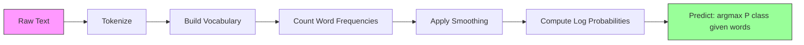

# Naive Bayes

> 「ナイーブ」な仮定は間違っています。それでも機能します。そこが美しさです。

**種別:** 構築
**言語:** Python
**前提条件:** Phase 2, Lessons 01-07 (classification, Bayes' theorem)
**所要時間:** 約75分

## 学習目標

- text classification のために、Laplace smoothing 付きの Multinomial Naive Bayes をゼロから実装する
- ナイーブな独立性仮定が数学的には誤りなのに、実務では正しい class ranking を生む理由を説明する
- Multinomial、Bernoulli、Gaussian Naive Bayes の variants を比較し、feature type に合ったものを選ぶ
- 高次元 sparse data で Naive Bayes と logistic regression を比較し、そこで働く bias-variance tradeoff を説明する

## 問題

テキストを分類する必要があります。email を spam / not-spam に分ける。customer review を positive / negative に分ける。support ticket を category に分ける。features は数千個（単語ごとに 1 つ）あり、training data は限られています。

多くの classifier はここで苦しみます。Logistic regression は数千の weights を信頼できるように推定するだけの samples を必要とします。Decision trees は単語を 1 つずつ split して激しく overfit します。KNN は 10,000 次元では意味を失います。どの点も他の点から同じくらい遠くなるからです。

Naive Bayes はこの状況に強いです。数学的には誤った仮定（class が与えられたとき、すべての feature が互いに independent である）を置きます。それでも、特に training set が小さい text classification では、「より賢い」model を上回ることがあります。data を 1 回通すだけで訓練でき、数百万 features まで scale し、probability estimates も返します（ただし independence assumption のため calibration は悪いことが多いです）。

間違った仮定が良い予測につながる理由を理解すると、machine learning の基本が見えてきます。最良の model は最も正しい model ではなく、手元の data に対して最良の bias-variance tradeoff を持つ model です。

## コンセプト

### Bayes' Theorem（短い復習）

Bayes' theorem は conditional probabilities を反転します。

```
P(class | features) = P(features | class) * P(class) / P(features)
```

求めたいのは `P(class | features)`、つまり document 内の words が与えられたとき、その document が class に属する確率です。これは次から計算できます。
- `P(features | class)` -- この class の documents でこれらの words を見る likelihood
- `P(class)` -- class の prior probability（spam は全体でどれくらい一般的か）
- `P(features)` -- evidence。全 class で同じなので比較時には無視できる

最も高い `P(class | features)` を持つ class が勝ちます。

### ナイーブな独立性仮定

`P(features | class)` を正確に計算するには、すべての features の joint probability を推定する必要があります。語彙が 10,000 words あると、2^10,000 通りの組み合わせの分布を推定することになります。不可能です。

ナイーブな仮定: class が与えられたら、すべての feature は conditionally independent である。

```
P(w1, w2, ..., wn | class) = P(w1 | class) * P(w2 | class) * ... * P(wn | class)
```

不可能な joint distribution を 1 つ推定する代わりに、n 個の単純な per-feature distributions を推定します。それぞれに必要なのは count だけです。

この仮定は明らかに誤りです。"machine" と "learning" は document 内で独立ではありません。しかし classifier に必要なのは正確な probability estimates ではありません。必要なのは正しい ranking、つまりどの class の probability が最大かです。independence assumption は systematic errors を導入しますが、その error が各 class に似た形で効くため、ranking が保たれることがあります。

### それでも機能する理由

1. **Calibration より ranking。** Classification に必要なのは top-ranked class が正しいことです。真の確率が 0.7 なのに P(spam) = 0.99999 と出ても、spam を選べれば分類は正解です。正しい確率ではなく、正しい勝者が必要です。

2. **High bias, low variance。** independence assumption は強い prior です。model を強く制約し、overfitting を防ぎます。training data が限られているときは、少し間違っていても安定した model が、理論的には正しくても不安定な model に勝ちます。

3. **Feature redundancy が相殺される。** 相関した features は重複した evidence を与えます。classifier はその evidence を二重に数えますが、正しい class についても二重に数えます。"machine" と "learning" が常に一緒に出るなら、どちらも "tech" class の evidence です。

実務的には、Naive Bayes は非常に高速です。Training は frequencies を数えるために data を 1 回通すだけです。Prediction は matrix multiplication です。million documents でも数秒で訓練できます。この速さにより、遅い model よりも多くの feature sets と experiments を試せます。

### 数式を順に追う

2 classes（spam、not-spam）と、3 words（"free"、"money"、"meeting"）を考えます。

Training data:
- Spam emails は "free" を 80 回、"money" を 60 回、"meeting" を 10 回含む（合計 150 words）
- Not-spam emails は "free" を 5 回、"money" を 10 回、"meeting" を 100 回含む（合計 115 words）
- emails の 40% が spam、60% が not-spam

Laplace smoothing（alpha=1）を使うと:

```
P(free | spam)    = (80 + 1) / (150 + 3) = 81/153 = 0.529
P(money | spam)   = (60 + 1) / (150 + 3) = 61/153 = 0.399
P(meeting | spam) = (10 + 1) / (150 + 3) = 11/153 = 0.072

P(free | not-spam)    = (5 + 1) / (115 + 3) = 6/118 = 0.051
P(money | not-spam)   = (10 + 1) / (115 + 3) = 11/118 = 0.093
P(meeting | not-spam) = (100 + 1) / (115 + 3) = 101/118 = 0.856
```

新しい email は "free" を 2 回、"money" を 1 回、"meeting" を 0 回含みます。

```
log P(spam | email) = log(0.4) + 2*log(0.529) + 1*log(0.399) + 0*log(0.072)
                    = -0.916 + 2*(-0.637) + (-0.919) + 0
                    = -3.109

log P(not-spam | email) = log(0.6) + 2*log(0.051) + 1*log(0.093) + 0*log(0.856)
                        = -0.511 + 2*(-2.976) + (-2.375) + 0
                        = -8.838
```

Spam が大差で勝ちます。"free" が 2 回出ることは spam の強い evidence です。Multinomial NB では、出現しない "meeting" は log sum に 0 を足すだけなので影響しません。word absence を明示的に model 化するのは Bernoulli NB です。

### 3 つの variants

Naive Bayes には 3 種類があります。それぞれ `P(feature | class)` の model 化が違います。

#### Multinomial Naive Bayes

各 feature を count として model 化します。word frequencies や TF-IDF values のような text data に最適です。

```
P(word_i | class) = (count of word_i in class + alpha) / (total words in class + alpha * vocab_size)
```

`alpha` は Laplace smoothing です。この variant は text classification の主力です。

#### Gaussian Naive Bayes

各 feature を normal distribution として model 化します。continuous features に最適です。

```
P(x_i | class) = (1 / sqrt(2 * pi * var)) * exp(-(x_i - mean)^2 / (2 * var))
```

class ごと、feature ごとに mean と variance を持ちます。features が class 内で本当に bell curve に近いときにうまく働きます。

#### Bernoulli Naive Bayes

各 feature を binary（present / absent）として model 化します。short text や binary feature vectors に向いています。

```
P(word_i | class) = (docs in class containing word_i + alpha) / (total docs in class + 2 * alpha)
```

Multinomial と違い、Bernoulli は word absence を明示的に penalize します。"free" が spam に典型的なのにこの email にないなら、それを spam に反する evidence として数えます。

### どの variant を使うか

| Variant | Feature Type | Best For | Example |
|---------|-------------|----------|---------|
| Multinomial | Counts or frequencies | Text classification, bag-of-words | Email spam, topic classification |
| Gaussian | Continuous values | Tabular data with normal-ish features | Iris classification, sensor data |
| Bernoulli | Binary (0/1) | Short text, binary feature vectors | SMS spam, presence/absence features |

### Laplace Smoothing

test data に現れた word が、ある class の training data に一度も出ていなかったらどうなるでしょうか。

smoothing なしでは `P(word | class) = 0/N = 0` です。1 つの zero が product 全体を zero にし、他の evidence がどれほど強くても `P(class | features) = 0` になります。

Laplace smoothing は、すべての feature count に小さな count `alpha`（通常 1）を足します。

```
P(word_i | class) = (count(word_i, class) + alpha) / (total_words_in_class + alpha * vocab_size)
```

alpha=1 なら、すべての word に少なくとも小さな probability が与えられます。"discombobulate" が test email に出ても spam probability は消えません。Bayesian には、word distributions に uniform Dirichlet prior を置くことと解釈できます。

alpha が大きいほど smoothing は強くなり、distribution はより uniform になります。alpha が小さいほど model は data を強く信頼します。Alpha は tune する hyperparameter です。

| Alpha | Effect | When to use |
|-------|--------|-------------|
| 0.001 | ほぼ smoothing なし、data を信頼する | 非常に大きな training set、unseen features が想定されない |
| 0.1 | 軽い smoothing | 大きな training set |
| 1.0 | 標準的な Laplace smoothing | default starting point |
| 10.0 | 強い smoothing、distributions を平らにする | 小さな training set、unseen features が多い |

### Log-Space Computation

数百個の probabilities（どれも 1 未満）を掛けると floating-point underflow が起きます。真の値は小さな正数なのに、floating point では product が zero になります。

解決策は log space で計算することです。probabilities を掛ける代わりに logarithms を足します。

```
log P(class | x1, x2, ..., xn) = log P(class) + sum_i log P(xi | class)
```

予測は dot product になります。

```
log_scores = X @ log_feature_probs.T + log_class_priors
prediction = argmax(log_scores)
```

Matrix multiplication です。だから Naive Bayes の prediction は速いのです。single-layer linear model と同じ演算です。

### Naive Bayes vs Logistic Regression

どちらも text 向けの linear classifiers です。違いは何を model 化するかです。

| Aspect | Naive Bayes | Logistic Regression |
|--------|------------|-------------------|
| Type | Generative (models P(X\|Y)) | Discriminative (models P(Y\|X)) |
| Training | Count frequencies | Optimize loss function |
| Small data | Better (strong prior helps) | Worse (not enough to estimate weights) |
| Large data | Worse (wrong assumption hurts) | Better (flexible boundary) |
| Features | Assumes independence | Handles correlations |
| Speed | Single pass, very fast | Iterative optimization |
| Calibration | Poor probabilities | Better probabilities |

経験則: まず Naive Bayes から始めます。十分な data があり NB が頭打ちになったら logistic regression に切り替えます。

### Classification Pipeline



実務では floating-point underflow を避けるため log space で計算します。小さな probabilities を掛ける代わりに logarithms を足します。

```
log P(class | features) = log P(class) + sum_i log P(feature_i | class)
```

## 作ってみる

`code/naive_bayes.py` は MultinomialNB と GaussianNB の両方を scratch から実装します。

### MultinomialNB

scratch 実装:

1. **fit(X, y)**: class ごとに各 feature の frequency を数える。Laplace smoothing を足す。log probabilities を計算する。class priors（class frequencies の log）を保存する。

2. **predict_log_proba(X)**: 各 sample について、すべての class に対して log P(class) + sum of log P(feature_i | class) を計算する。これは matrix multiplication、つまり X @ log_probs.T + log_priors です。

3. **predict(X)**: 最も高い log probability を持つ class を返す。

```python
class MultinomialNB:
    def __init__(self, alpha=1.0):
        self.alpha = alpha

    def fit(self, X, y):
        classes = np.unique(y)
        n_classes = len(classes)
        n_features = X.shape[1]

        self.classes_ = classes
        self.class_log_prior_ = np.zeros(n_classes)
        self.feature_log_prob_ = np.zeros((n_classes, n_features))

        for i, c in enumerate(classes):
            X_c = X[y == c]
            self.class_log_prior_[i] = np.log(X_c.shape[0] / X.shape[0])
            counts = X_c.sum(axis=0) + self.alpha
            self.feature_log_prob_[i] = np.log(counts / counts.sum())

        return self
```

重要な insight: fit 後の prediction は matrix multiplication に bias を足すだけです。だから Naive Bayes は速いのです。

### GaussianNB

continuous features では、class ごと feature ごとに mean と variance を推定します。

```python
class GaussianNB:
    def __init__(self):
        pass

    def fit(self, X, y):
        classes = np.unique(y)
        self.classes_ = classes
        self.means_ = np.zeros((len(classes), X.shape[1]))
        self.vars_ = np.zeros((len(classes), X.shape[1]))
        self.priors_ = np.zeros(len(classes))

        for i, c in enumerate(classes):
            X_c = X[y == c]
            self.means_[i] = X_c.mean(axis=0)
            self.vars_[i] = X_c.var(axis=0) + 1e-9
            self.priors_[i] = X_c.shape[0] / X.shape[0]

        return self
```

Prediction では feature ごとの Gaussian PDF を使い、features 全体で掛け合わせます（log space では足します）。

### Demo: Text Classification

コードは、tech articles と sports articles の 2 classes を模した synthetic bag-of-words data を生成します。class ごとに word frequency distribution が異なり、MultinomialNB が word counts を使って分類します。

synthetic data では 200 個の "words"（feature columns）を作ります。Words 0-39 は tech articles で high frequency、sports で low frequency です。Words 80-119 は sports で high frequency、tech で low frequency です。Words 40-79 は両方で medium frequency です。これにより、一部の words が強い class indicators で、他は noise という現実的な状況を作ります。

### Demo: Continuous Features

コードは Iris-like data（3 classes、4 features、Gaussian clusters）を生成します。GaussianNB は per-class mean と variance を使って分類します。各 class は異なる center（mean vector）と spread（variance）を持ち、measurements が categories 間で体系的に異なる実データを模します。

コードは次も示します。
- **Smoothing comparison:** alpha values を変えて MultinomialNB を訓練し、smoothing strength が accuracy に与える影響を見る
- **Training size experiment:** training data が 20 から 1600 samples へ増えるにつれて NB accuracy がどう改善するかを見る。NB は非常に少ない samples でもそこそこの accuracy に達する
- **Confusion matrix:** per-class precision、recall、F1 score により、NB がどこで間違えるかを見る

### Prediction Speed

Naive Bayes prediction は matrix multiplication です。n samples、d features、k classes の場合:
- MultinomialNB: 1 回の matrix multiply (n x d) @ (d x k) = O(n * d * k)
- GaussianNB: n * k 回の Gaussian PDF evaluations、それぞれ d features = O(n * d * k)

どちらも全 dimension に対して linear です。KNN（すべての training points との distance computation が必要）や RBF kernel の SVM（support vectors との kernel evaluation が必要）と比べると、prediction time は桁違いに速くなります。

## 使ってみる

sklearn ではどちらの variant も one-liner です。

```python
from sklearn.naive_bayes import GaussianNB, MultinomialNB

gnb = GaussianNB()
gnb.fit(X_train, y_train)
print(f"GaussianNB accuracy: {gnb.score(X_test, y_test):.3f}")

mnb = MultinomialNB(alpha=1.0)
mnb.fit(X_train_counts, y_train)
print(f"MultinomialNB accuracy: {mnb.score(X_test_counts, y_test):.3f}")
```

sklearn で text classification を行う例:

```python
from sklearn.feature_extraction.text import CountVectorizer
from sklearn.naive_bayes import MultinomialNB
from sklearn.pipeline import Pipeline

text_clf = Pipeline([
    ("vectorizer", CountVectorizer()),
    ("classifier", MultinomialNB(alpha=1.0)),
])

text_clf.fit(train_texts, train_labels)
accuracy = text_clf.score(test_texts, test_labels)
```

`naive_bayes.py` のコードは、scratch 実装と sklearn を同じ data で比較し、正しさを確認します。

### Naive Bayes と TF-IDF

raw word counts は出現 1 回ごとにすべての word を同じ重みで扱います。しかし "the" や "is" のような common words は全 class に頻繁に出るため、情報を持ちません。TF-IDF (Term Frequency - Inverse Document Frequency) は common words の重みを下げ、rare で discriminative な words の重みを上げます。

```python
from sklearn.feature_extraction.text import TfidfVectorizer
from sklearn.naive_bayes import MultinomialNB
from sklearn.pipeline import Pipeline

text_clf = Pipeline([
    ("tfidf", TfidfVectorizer()),
    ("classifier", MultinomialNB(alpha=0.1)),
])
```

TF-IDF values は non-negative なので MultinomialNB と一緒に使えます。TF-IDF + MultinomialNB は text classification の強力な baseline の 1 つです。training samples が 10,000 未満の datasets では、より複雑な model に勝つこともよくあります。

### Short Text には BernoulliNB

short text（tweets、SMS、chat messages）では BernoulliNB が MultinomialNB を上回ることがあります。short texts は word counts が小さく、MultinomialNB が頼る frequency information は noisy です。BernoulliNB は presence / absence だけを見るため、short text ではより信頼できます。

```python
from sklearn.naive_bayes import BernoulliNB
from sklearn.feature_extraction.text import CountVectorizer

text_clf = Pipeline([
    ("vectorizer", CountVectorizer(binary=True)),
    ("classifier", BernoulliNB(alpha=1.0)),
])
```

CountVectorizer の `binary=True` flag はすべての counts を 0/1 に変換します。これがなくても BernoulliNB は動きますが、本来設計されていない count を見ていることになります。

### NB Probabilities の calibration

NB probabilities は calibration が悪いです。NB が P(spam) = 0.95 と言っても、真の確率は 0.7 かもしれません。threshold 設定や他 model との組み合わせなどで信頼できる probability estimates が必要なら、sklearn の CalibratedClassifierCV を使います。

```python
from sklearn.calibration import CalibratedClassifierCV

calibrated_nb = CalibratedClassifierCV(MultinomialNB(), cv=5, method="sigmoid")
calibrated_nb.fit(X_train, y_train)
proba = calibrated_nb.predict_proba(X_test)
```

これは cross-validation を使って NB の raw scores の上に logistic regression を fit します。得られる probabilities は真の class frequencies にかなり近くなります。

### よくある落とし穴

1. **Negative feature values。** MultinomialNB は non-negative features を要求します。negative values（特定設定の TF-IDF や standardized features など）がある場合は GaussianNB を使うか、features を positive に shift します。

2. **Zero variance features。** GaussianNB は variance で割ります。class 内で feature の variance が zero（すべて同じ値）だと probability computation が壊れます。コードでは 1e-9 の小さな smoothing term をすべての variances に足して防ぎます。

3. **Class imbalance。** emails の 99% が not-spam なら prior P(not-spam) = 0.99 が強すぎて likelihood evidence を押しつぶします。class priors を手動設定するか、sklearn の class_prior parameter を使えます。

4. **Feature scaling。** MultinomialNB は scaling 不要です（counts で動きます）。GaussianNB も scaling 不要です（per-feature statistics を推定します）。これは feature scale に敏感な logistic regression や SVM に対する利点です。

## 出荷物

この lesson が生成するもの:
- `outputs/skill-naive-bayes-chooser.md` -- 適切な NB variant を選ぶための decision skill
- `code/naive_bayes.py` -- scratch 実装の MultinomialNB と GaussianNB、および sklearn comparison

### Naive Bayes が失敗する場合

NB は independence assumption が incorrect probabilities だけでなく incorrect rankings を生むと失敗します。たとえば:

1. **強い feature interactions。** class が 2 つの features の組み合わせに依存し、どちら単独にも依存しない場合（XOR-like patterns）、NB は完全に見逃します。各 feature 単独では evidence がなく、NB は非線形に組み合わせられません。

2. **反対の evidence を持つ高度に correlated な features。** feature A が "spam"、feature B が "not-spam" を示すが、A と B が完全に correlated（実際には常に一致）している場合、NB は存在しない conflicting evidence を見ます。

3. **非常に大きい training sets。** data が十分にあると、logistic regression のような discriminative models は真の decision boundary を学び、NB を上回ります。small data で助けになった independence assumption が足かせになります。

実務では、text classification でこれらの failure modes は比較的まれです。Text features は多数で、個々には弱く、independence assumption の error は相殺されがちです。少数の強く correlated な features を持つ tabular data では、logistic regression や tree-based models を先に検討してください。

## 演習

1. **Smoothing experiment。** alpha values 0.01、0.1、1.0、10.0、100.0 で text data に MultinomialNB を訓練してください。accuracy vs alpha を plot します。performance はどこで peak しますか。alpha が非常に大きいとなぜ悪化しますか。

2. **Feature independence test。** 実際の text dataset を使います。明らかに correlated な 2 words（"machine" と "learning" など）を選びます。P(word1 | class) * P(word2 | class) を計算し、P(word1 AND word2 | class) と比較します。independence assumption はどれくらい間違っていますか。classification accuracy に影響しますか。

3. **Bernoulli implementation。** コードに BernoulliNB class を追加してください。bag-of-words を binary（present / absent）に変換し、text data で MultinomialNB と accuracy を比較します。どんなときに Bernoulli が勝ちますか。

4. **NB vs Logistic Regression。** text data で両方を訓練してください。training samples を 100 から始め、10,000 まで増やします。両方の accuracy vs training set size を plot します。どの時点で Logistic Regression が Naive Bayes を追い越しますか。

5. **Spam filter。** 完全な spam classifier を作ってください。raw email text を tokenize し、vocabulary を作り、bag-of-words features を作成し、MultinomialNB を訓練し、precision と recall で評価します（accuracy だけでは不十分です。なぜですか）。

## 重要用語

| Term | What people say | What it actually means |
|------|----------------|----------------------|
| Naive Bayes | "Simple probabilistic classifier" | Bayes' theorem と、class が与えられたとき features が conditionally independent であるという仮定を使う classifier |
| Conditional independence | "Features don't affect each other" | P(A, B \| C) = P(A \| C) * P(B \| C)。C を知っているなら、B を知っても A について新しい情報はない |
| Laplace smoothing | "Add-one smoothing" | zero probabilities が prediction を支配しないよう、すべての feature に小さな count を足すこと |
| Prior | "What you believed before seeing data" | P(class)。features を観測する前の各 class の probability |
| Likelihood | "How well the data fits" | P(features \| class)。class が既知のとき、その features を観測する probability |
| Posterior | "What you believe after seeing data" | P(class \| features)。features を観測した後に更新された class probability |
| Generative model | "Models how data is generated" | P(X \| Y) と P(Y) を学習し、Bayes' theorem で P(Y \| X) を得る model |
| Discriminative model | "Models the decision boundary" | X がどう生成されるかを model 化せず、P(Y \| X) を直接学習する model |
| Log probability | "Avoid underflow" | 多数の小さい数の product が floating point で zero になるのを避けるため、P ではなく log P を使うこと |

## 参考資料

- [scikit-learn Naive Bayes docs](https://scikit-learn.org/stable/modules/naive_bayes.html) -- 3 variants すべてと数学的詳細
- [McCallum and Nigam, A Comparison of Event Models for Naive Bayes Text Classification (1998)](https://www.cs.cmu.edu/~knigam/papers/multinomial-aaaiws98.pdf) -- text における Multinomial vs Bernoulli の古典的比較
- [Rennie et al., Tackling the Poor Assumptions of Naive Bayes Text Classifiers (2003)](https://people.csail.mit.edu/jrennie/papers/icml03-nb.pdf) -- text 向け NB の改善
- [Ng and Jordan, On Discriminative vs. Generative Classifiers (2001)](https://ai.stanford.edu/~ang/papers/nips01-discriminativegenerative.pdf) -- NB が LR より少ない data で速く収束することを示す
