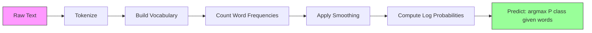

# Naive Bayes

> “天真”的假设是错误的，而且无论如何它都有效。这就是它的美妙之处。

** 类型：** 构建
** 语言：** Python
** 先决条件：** 第2阶段，第01-07课（分类，Bayes ' Theorem）
** 时间：** ~75分钟

## Learning Objectives

- 通过拉普拉斯平滑从头实施Multinomic Naive Bayes进行文本分类
- 解释为什么天真的独立性假设在数学上是错误的，但在实践中却产生了正确的班级排名
- 比较Multinomic、Bernoulli和Gaussian Naive Bayes变体，并为给定要素类型选择正确的变体
- 在多维稀疏数据上与逻辑回归评估Naive Bayes并解释工作中的偏差方差权衡

## The Problem

您需要对文本进行分类。电子邮件变成垃圾邮件或非垃圾邮件。客户评论分为正面或负面。支持门票分类。您有数千个特征（每个单词一个）和有限的训练数据。

大多数分类器在这里窒息。逻辑回归需要足够的样本来可靠地估计数千个权重。决策树一次在一个词上分裂，并且过度匹配。10，000维中的KNN是毫无意义的，因为每个点与其他点的距离都是一样的。

天真的Bayes处理这个问题。它做出了数学上错误的假设（每个特征都独立于给定类别的所有其他特征），并且它在文本分类方面仍然优于“更智能”的模型，尤其是在训练集较小的情况下。它只需通过一次数据进行训练。它扩展到数百万个功能。它产生概率估计（尽管由于独立性假设，通常校准不良）。

了解为什么错误的假设会导致良好的预测，可以教会您一些关于机器学习的基本知识：最好的模型不是最正确的模型，而是对您的数据具有最佳偏差方差权衡的模型。

## The Concept

### Bayes' Theorem (Quick Review)

Bayes定理翻转了条件概率：

```
P(class | features) = P(features | class) * P(class) / P(features)
```

我们想要' P（类|特征）'--给定其中的单词，文档属于某个类别的概率。我们可以通过以下方式计算：
- `P（特征|class）` --在该类文档中看到这些单词的可能性
- `P（class）` -类的先验概率（垃圾邮件通常有多常见？）
- ' P（特征）'--证据，所有类别都是一样的，所以我们在比较时可以忽略它

' P（类）最高的班级|功能）'赢了。

### The Naive Independence Assumption

计算`P（功能|class）`准确地要求估计所有特征的联合概率。对于10，000个单词的词汇表，您需要估计2^10，000个可能组合的分布。不可能的

天真的假设：给定类别，每个特征都有条件独立。

```
P(w1, w2, ..., wn | class) = P(w1 | class) * P(w2 | class) * ... * P(wn | class)
```

您不必估计一个不可能的联合分布，而是估计n个简单的每个特征分布。每个人只需要计数。

这个假设显然是错误的。“机器”和“学习”这两个词在任何文档中都不是独立的。但分类器不需要正确的概率估计。它需要正确的排名--哪个班级的可能性最高。独立性假设引入了系统误差，但这些误差对所有类的影响都是相似的，因此排名保持正确。

### Why It Still Works

三个原因：

1. ** 排名超过校准。**分类只需要排名前一的类别才是正确的。即使当真实概率为0.7时P（垃圾邮件）= 0.99999，分类器仍然正确选择垃圾邮件。我们不需要正确的概率。我们需要正确的获胜者。

2. ** 高偏差，低方差。**独立性假设是一个强有力的先决条件。它严重限制了模型，从而防止了过度匹配。在训练数据有限的情况下，稍微错误但稳定的模型会击败理论上正确但极不稳定的模型。这是实际的偏差方差权衡。

3. ** 功能冗余取消。**相关特征提供了多余的证据。分类器双重计算该证据，但它也双重计算正确的类别。如果“机器”和“学习”总是一起出现，那么两者都为“技术”类提供了证据。NB对它们进行了两次计数，但它对正确的类别进行了两次计数。

第四个实际原因：天真的Bayes速度极快。培训是通过数据计数频率的一次过程。预测是一个矩阵相乘。您可以在几秒钟内训练一百万个文档。与较慢的模型相比，这种速度意味着您可以更快地调试、尝试更多功能集并运行更多实验。

### The Math Step by Step

让我们回顾一个具体的例子。假设我们有两类：垃圾邮件和非垃圾邮件。我们的词汇有三个词：“自由”、“金钱”、“会议”。

培训数据：
- 垃圾邮件提及“免费”80次、“钱”60次、“会议”10次（总共150字）
- 非垃圾邮件提及“免费”5次、“钱”10次、“会议”100次（总共115个字）
- 40%的电子邮件是垃圾邮件，60%是非垃圾邮件

使用拉普拉斯平滑（Alpha=1）：

```
P(free | spam)    = (80 + 1) / (150 + 3) = 81/153 = 0.529
P(money | spam)   = (60 + 1) / (150 + 3) = 61/153 = 0.399
P(meeting | spam) = (10 + 1) / (150 + 3) = 11/153 = 0.072

P(free | not-spam)    = (5 + 1) / (115 + 3) = 6/118 = 0.051
P(money | not-spam)   = (10 + 1) / (115 + 3) = 11/118 = 0.093
P(meeting | not-spam) = (100 + 1) / (115 + 3) = 101/118 = 0.856
```

新电子邮件包含：“免费”（2次）、“金钱”（1次）、“会议”（0次）。

```
log P(spam | email) = log(0.4) + 2*log(0.529) + 1*log(0.399) + 0*log(0.072)
                    = -0.916 + 2*(-0.637) + (-0.919) + 0
                    = -3.109

log P(not-spam | email) = log(0.6) + 2*log(0.051) + 1*log(0.093) + 0*log(0.856)
                        = -0.511 + 2*(-2.976) + (-2.375) + 0
                        = -8.838
```

垃圾邮件以较大优势获胜。“免费”一词出现两次是垃圾邮件的有力证据。请注意，未出现的“meeting”对两个log和（0 * log（P））的贡献为零--在Multinomic NB中，缺失的单词没有影响。伯努里NB明确地建模了单词缺失。

### Three Variants

天真的Bayes有三种口味。每个型号' P（功能|类）'不同的。

#### Multinomial Naive Bayes

将每个功能建模为计数。最适合特征为词频或TF-IDF值的文本数据。

```
P(word_i | class) = (count of word_i in class + alpha) / (total words in class + alpha * vocab_size)
```

“Alpha”是拉普拉斯平滑（如下解释）。该变体是文本分类的主力。

#### Gaussian Naive Bayes

将每个特征建模为正态分布。最适合连续功能。

```
P(x_i | class) = (1 / sqrt(2 * pi * var)) * exp(-(x_i - mean)^2 / (2 * var))
```

每个类别都有自己的每个特征的平均值和方差。当功能在每个类别中真正遵循钟形曲线时，这种方法效果良好。

#### Bernoulli Naive Bayes

将每个特征建模为二进制（存在或不存在）。最适合短文本或二进制特征载体。

```
P(word_i | class) = (docs in class containing word_i + alpha) / (total docs in class + 2 * alpha)
```

与Multinomic不同的是，伯努利明确惩罚了缺少单词的行为。如果“免费”通常出现在垃圾邮件中，但在这封电子邮件中没有，伯努利将其视为反对垃圾邮件的证据。

### When to Use Each Variant

| 变体 | 特征类型 | 最适合 | 例如 |
|---------|-------------|----------|---------|
| 多项式 | 计数或频率 | 文本分类、词袋 | 垃圾邮件、主题分类 |
| 高斯 | 连续值 | 具有正常特征的表格数据 | 虹膜分类，传感器数据 |
| 伯努利 | 二进制（0/1） | 短文本、二进制特征载体 | 短信垃圾邮件、存在/缺席功能 |

### Laplace Smoothing

当一个词出现在测试数据中但从未出现在特定类别的训练数据中时，会发生什么？

没有平滑：' P（字|类）= 0/N = 0 '。一个零乘以整个产品即为' P（类|特征）= 0 '，无论所有其他证据如何。一个看不见的词就会摧毁整个预测，无论有多少其他证据支持它。

拉普拉斯平滑为每个特征计数添加一个小计数“Alpha”（通常为1）：

```
P(word_i | class) = (count(word_i, class) + alpha) / (total_words_in_class + alpha * vocab_size)
```

当Alpha=1时，每个词至少有很小的可能性。测试电子邮件中出现的“discombobulate”一词不再消除垃圾邮件的可能性。平滑具有Bayesian解释：它相当于在单词分布上放置均匀的Dirichlet先验。

更高的Alpha意味着更强的平滑（更均匀的分布）。较低的Alpha意味着模型更信任数据。Alpha是您调整的超参数。

阿尔法的影响：

| 阿尔法 | 效果 | 何时使用 |
|-------|--------|-------------|
| 0.001 | 几乎没有平滑，相信数据 | 非常大的训练集，预计没有未见过的功能 |
| 0.1 | 向导光 | 大型训练集 |
| 1.0 | 标准拉普拉斯平滑 | 默认起点 |
| 10.0 | 大量平滑，高斯分布 | 非常小的训练集，预期有许多看不见的功能 |

### Log-Space Computation

乘以数百个概率（每个概率小于1）会导致浮点下溢。即使真实值是一个非常小的正值，积在浮点上也会变成零。

解决方案：在日志空间中工作。与其乘以概率，不如加上他们的概率：

```
log P(class | x1, x2, ..., xn) = log P(class) + sum_i log P(xi | class)
```

这将预测转换为点积：

```
log_scores = X @ log_feature_probs.T + log_class_priors
prediction = argmax(log_scores)
```

矩阵相乘。这就是Naive Bayes预测如此快的原因--它的操作与单层线性模型相同。

### Naive Bayes vs Logistic Regression

两者都是文本的线性分类器。区别在于他们的模型。

| 方面 | 朴素贝叶斯 | Logistic回归 |
|--------|------------|-------------------|
| 类型 | 生成型（模型P（X\ | Y）） | 区分性（模型P（Y\ | X）） |
| 培训 | 计数频率 | 优化损失功能 |
| 小数据 | 更好（强有力的先前帮助） | 更糟（不足以估计权重） |
| 大型数据 | 更糟（错误的假设会伤害） | 更好（灵活边界） |
| 特征 | 假设独立 | 处理相关性 |
| 速度 | 单程通行证，很快 | 迭代优化 |
| 校准 | 可能性很差 | 更好的可能性 |

经验法则：从天真的Bayes开始。如果您有足够的数据并且NB处于平稳状态，请切换到逻辑回归。

### Classification Pipeline



在实践中，我们在日志空间中工作以避免浮点下溢。我们没有将许多小概率相乘，而是将它们的范围相加：

```
log P(class | features) = log P(class) + sum_i log P(feature_i | class)
```

## Build It

“code/naive_bayes.py”中的代码从头实现了MultinomialNB和GaussianNB。

### MultinomialNB

从头开始实现：

1. **fit（X，y）**：对于每个类别，计算每个特征的频率。添加拉普拉斯平滑。计算日志概率。存储班级先验（班级频率日志）。

2. **predict_log_proba（X）**：对于每个样本，计算log P（class）+log P（feature_i）的总和|类）的所有类。这是一个矩阵乘法：X @ log_probs.T + log_priors。

3. ** 预测（X）**：返回日志概率最高的类。

```python
class MultinomialNB:
    def __init__(self, alpha=1.0):
        self.alpha = alpha

    def fit(self, X, y):
        classes = np.unique(y)
        n_classes = len(classes)
        n_features = X.shape[1]

        self.classes_ = classes
        self.class_log_prior_ = np.zeros(n_classes)
        self.feature_log_prob_ = np.zeros((n_classes, n_features))

        for i, c in enumerate(classes):
            X_c = X[y == c]
            self.class_log_prior_[i] = np.log(X_c.shape[0] / X.shape[0])
            counts = X_c.sum(axis=0) + self.alpha
            self.feature_log_prob_[i] = np.log(counts / counts.sum())

        return self
```

关键的见解是：在拟合之后，预测只是矩阵乘法加上偏差。这就是为什么Naive Bayes如此快速。

### GaussianNB

对于连续特征，我们估计每个类别每个特征的平均值和方差：

```python
class GaussianNB:
    def __init__(self):
        pass

    def fit(self, X, y):
        classes = np.unique(y)
        self.classes_ = classes
        self.means_ = np.zeros((len(classes), X.shape[1]))
        self.vars_ = np.zeros((len(classes), X.shape[1]))
        self.priors_ = np.zeros(len(classes))

        for i, c in enumerate(classes):
            X_c = X[y == c]
            self.means_[i] = X_c.mean(axis=0)
            self.vars_[i] = X_c.var(axis=0) + 1e-9
            self.priors_[i] = X_c.shape[0] / X.shape[0]

        return self
```

预测使用每个要素的高斯PDF，并在各个要素之间相乘（添加到日志空间中）。

### Demo: Text Classification

该代码生成模拟两个类别（科技文章与体育文章）的合成词袋数据。每个类别都有不同的词频分布。跨国NB使用字数对它们进行分类。

合成数据的工作原理如下：我们创建200个“单词”（特征列）。单词0-39在科技文章中的频率较高，在体育文章中的频率较低。单词80-119在体育领域的频率较高，在科技领域的频率较低。单词40-79在两者中都是中等频率。这创造了一个现实的场景，其中一些词是强的阶级指标，而另一些则是噪音。

### Demo: Continuous Features

该代码生成类似虹膜的数据（3个类，4个特征，高斯聚类）。GaussianNB使用每类均值和方差进行分类。每个类别都有不同的中心（均值向量）和不同的扩散（方差），模仿真实世界的数据，其中测量值在类别之间存在系统性差异。

该代码还演示了：
- ** 平滑比较：** 用不同的Alpha值训练MultinomialNB，以显示平滑强度对准确性的影响。
- ** 训练大小实验：** 随着训练数据从20个样本增加到1600个样本，NB准确性如何提高。即使样本很少，NB也能达到相当高的准确性--这是它的主要优势。
- ** 混淆矩阵：** 每个类别的精确度、召回率和F1得分，以显示NB在哪里犯了错误。

### Prediction Speed

朴素的Bayes预测是一种矩阵相乘。对于具有d个特征和k个类别的n个样本：
- 跨国NB：一个矩阵乘（n x d）@（d x k）= O（n * d * k）
- GaussianNB：n * k个高斯PDF评估，每个评估超过d个特征= O（n * d * k）

两者在各个维度上都是线性的。将其与KNN（需要计算到所有训练点的距离）或具有RBS核的支持者（需要针对所有支持载体进行核评估）进行比较。在预测时，NB快了几个数量级。

## Use It

对于sklearn，两个变体都是一行程序：

```python
from sklearn.naive_bayes import GaussianNB, MultinomialNB

gnb = GaussianNB()
gnb.fit(X_train, y_train)
print(f"GaussianNB accuracy: {gnb.score(X_test, y_test):.3f}")

mnb = MultinomialNB(alpha=1.0)
mnb.fit(X_train_counts, y_train)
print(f"MultinomialNB accuracy: {mnb.score(X_test_counts, y_test):.3f}")
```

对于使用sklearn进行文本分类：

```python
from sklearn.feature_extraction.text import CountVectorizer
from sklearn.naive_bayes import MultinomialNB
from sklearn.pipeline import Pipeline

text_clf = Pipeline([
    ("vectorizer", CountVectorizer()),
    ("classifier", MultinomialNB(alpha=1.0)),
])

text_clf.fit(train_texts, train_labels)
accuracy = text_clf.score(test_texts, test_labels)
```

' naive_bayes.py '中的代码将相同数据上的从头开始实现与sklearn进行比较，以验证正确性。

### TF-IDF with Naive Bayes

原始单词计数为每个单词每次出现时赋予相同的权重。但像“the”和“is”这样的常见词经常出现在每个班级中--它们不携带任何信息。TF-IDF（术语频率-逆文档频率）降低了常见词的权重，并提高了罕见、有区别的词的权重。

```python
from sklearn.feature_extraction.text import TfidfVectorizer
from sklearn.naive_bayes import MultinomialNB
from sklearn.pipeline import Pipeline

text_clf = Pipeline([
    ("tfidf", TfidfVectorizer()),
    ("classifier", MultinomialNB(alpha=0.1)),
])
```

TF-IDF价值观是非负的，因此他们与MultinomialNB合作。TF-IDF + MultinomialNB的组合是文本分类最强大的基线之一。它经常击败训练样本少于10，000个的数据集上的更复杂模型。

### BernoulliNB for Short Text

对于短文本（推文、短信、聊天消息），BernoulliNB的表现优于MultinomialNB。短文本的字数较少，因此MultinomialNB依赖的频率信息是有噪音的。BernoulliNB只关心存在或不存在，这对于简短的文本来说更可靠。

```python
from sklearn.naive_bayes import BernoulliNB
from sklearn.feature_extraction.text import CountVectorizer

text_clf = Pipeline([
    ("vectorizer", CountVectorizer(binary=True)),
    ("classifier", BernoulliNB(alpha=1.0)),
])
```

CountVectorizer中的“binary=True”标志将所有计数转换为0/1。如果没有它，BernoulliNB仍然可以工作，但看到了它不适合的计数。

### Calibrating NB Probabilities

NB概率校准不当。当NB说P（spam）= 0.95时，真实概率可能是0.7。如果需要可靠的概率估计（例如，设置阈值或与其他模型组合），请使用sklearn的CalibratedClassifierCV：

```python
from sklearn.calibration import CalibratedClassifierCV

calibrated_nb = CalibratedClassifierCV(MultinomialNB(), cv=5, method="sigmoid")
calibrated_nb.fit(X_train, y_train)
proba = calibrated_nb.predict_proba(X_test)
```

这使用交叉验证在NB的原始分数之上进行了逻辑回归。由此产生的概率更接近真实的类别频率。

### Common Gotchas

1. ** 负特征值。**跨国公司NB需要非负面特征。如果您的值为负值（例如具有某些设置或标准化功能的TF-IDF），请改用GaussianNB，或者将功能更改为正值。

2. ** 零方差特征。** GaussianNB除以方差。如果某个要素对于某个类别的方差为零（所有值相同），则概率计算就会中断。该代码向所有方差添加了一个小的平滑项（1 e-9）以防止出现这种情况。

3. ** 班级失衡。**如果99%的电子邮件是非垃圾邮件，则先验P（非垃圾邮件）= 0.99非常强，以至于它削弱了可能性证据。您可以手动设置类优先级或在sklearn中使用class_prior参数。

4. ** 功能扩展。**跨国公司NB不需要扩展（它按计数工作）。GaussianNB也不需要缩放（它估计每个特征的统计数据）。这是相对于对特征尺度敏感的逻辑回归和支持者的优势。

## Ship It

本课产生：
- '输出/skill-naive-bayes-chooser.md '--选择正确NB变体的决策技能
- ' code/naive_bayes.py '-- MultinomialNB和GaussianNB从头开始，与sklearn进行比较

### When Naive Bayes Fails

当独立性假设导致不正确的排名（不仅仅是不正确的概率）时，NB失败。这种情况发生在：

1. ** 强大的功能互动。**如果该类依赖于两个特征的组合，而不是单独依赖于其中任何一个（类似XOR的模式），那么NB将完全错过它。每个特征单独无法提供证据，而且NB无法将它们非线性地组合起来。

2. ** 具有相反证据的高度相关特征。**如果功能A表示“垃圾邮件”，功能B表示“非垃圾邮件”，但A和B完全相关（它们在现实中总是一致），那么NB将在没有证据的情况下看到相互矛盾的证据。

3. ** 非常大的训练集。**有了足够的数据，逻辑回归等辨别模型可以学习真正的决策边界并优于NB。有助于处理小数据的独立性假设现在阻碍了模型的发展。

在实践中，这些故障模式对于文本分类来说很少见。文本特征众多，个体性较弱，并且独立性假设的错误往往会抵消。对于几乎没有强相关特征的表格数据，请首先考虑逻辑回归或基于树的模型。

## Exercises

1. ** 平滑实验。**在Alpha值为0.01、0.1、1.0、10.0和100.0的文本数据上训练MultinomialNB。绘图准确性与Alpha。性能在哪里达到顶峰？为什么非常高的阿尔法会痛？

2. ** 功能独立性测试。**以真实的文本数据集为例。选择两个明显相关的词（“机器”和“学习”）。计算P（word 1|类）* P（word 2|类）并与P（word 1 AND word 2|类）。独立性假设有多错误？是否影响分类准确性？

3. ** 伯努里实现。**使用BernoulliNB类扩展代码。将词袋转换为二进制（存在/不存在），并将文本数据上的准确性与MultinomialNB进行比较。伯努利什么时候获胜？

4. **NB与逻辑回归。**对两者进行文本数据培训。从100个训练样本开始，增加到10，000个。两者的绘图准确性与训练集大小。逻辑回归在什么时候超越了天真的Bayes？

5. ** 垃圾邮件过滤器。**构建完整的垃圾邮件分类器：标记原始电子邮件文本、构建词汇表、创建词袋功能、训练MultinomialNB、精确度和召回率进行评估（不仅仅是准确性--为什么？）。

## Key Terms

| Term | 别人怎么说 | 它实际上意味着什么 |
|------|----------------|----------------------|
| 朴素贝叶斯 | “简单的概率分类器” | 一个应用Bayes定理的分类器，假设特征在给定类别的情况下是有条件独立的 |
| 条件独立性 | “功能不会相互影响” | P（A，B \ | C）= P（A \ | C）* P（B \ | C）--一旦你了解了C，了解B就不会告诉你关于A的任何新内容 |
| 拉普拉斯平滑 | “加一平滑” | 为每个要素添加一小部分计数，以防止零概率主导预测 |
| 之前 | “在看到数据之前你相信什么” | P（类）--观察任何特征之前每个类的概率 |
| 可能性 | “数据的匹配程度如何” | P（功能\ | 类）--如果类已知，观察这些特征的概率 |
| 后 | “看到数据后你相信什么” | P（class \ | 特征）--观察特征后班级更新的概率 |
| 生成模型 | “对数据如何生成建模” | 学习P（X \ | Y）和P（Y），然后使用Bayes定理得到P（Y \ | X） |
| 判别模型 | “建模决策边界” | 直接学习P（Y \ | X）无需建模X如何生成 |
| 对数概率 | “避免下溢” | 使用log P而不是P来防止许多小数的积在浮点中变成零 |

## Further Reading

- [scikit-learn Naive Bayes docs]（https：//scikit-learn.org/stable/modules/naive_bayes.html）--所有三个变体，包含数学细节
- [McCallum和Nigam，朴素Bayes文本分类的事件模型比较（1998）]（https：//www.cs.cmu.edu/jobknigam/papers/multinomial-aaaiws98.pdf）--文本Multinomial-Bernoulli的经典比较
- [伦尼等人，解决天真Bayes文本分类器的不良假设（2003）]（https：//people.csail.mit.edu/jrennie/papers/icml03-nb.pdf）--文本NB的改进
- [Ng和Jordan，On Discriminative vs. Generative Classifiers（2001）]（https：//ai.stanford.edu/guardang/papers/nips01-discriminativegenerative.pdf）--证明NB收敛得比LR更快，数据更少
