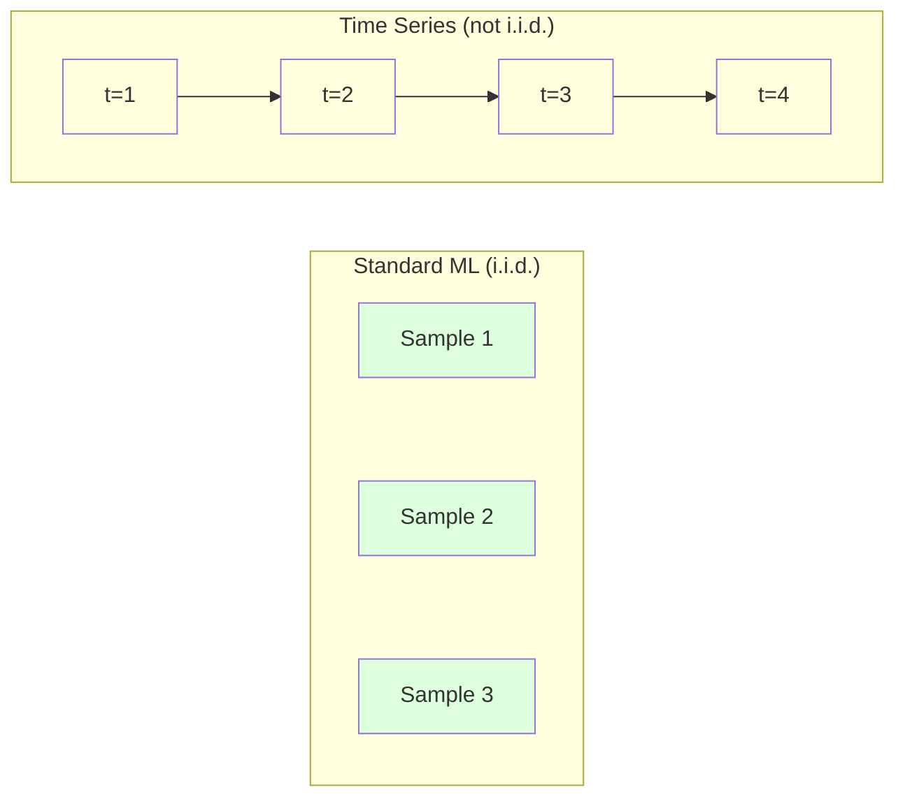
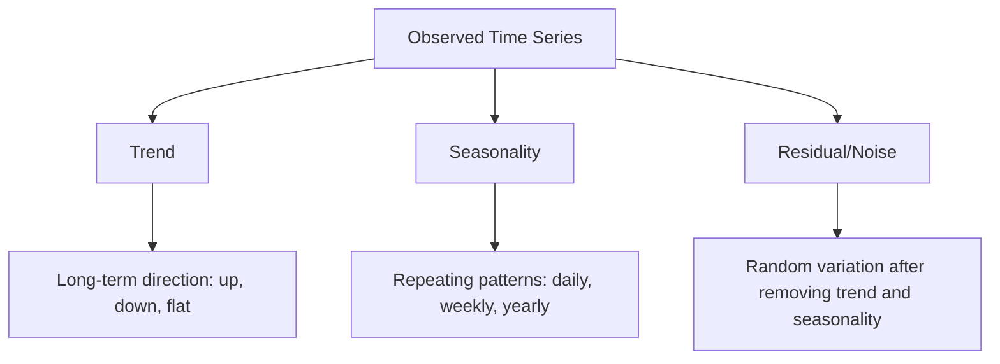
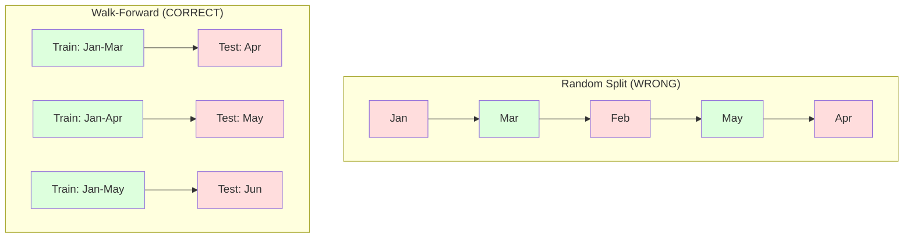

# Time Series Fundamentals

> 過去の performance は未来の結果を予測します。ただし、先に stationarity を確認した場合に限ります。

**種別:** 構築
**言語:** Python
**前提条件:** Phase 2, Lessons 01-09
**所要時間:** 約90分

## 学習目標

- time series を trend、seasonality、residual components に分解し、stationarity を検定する
- lag features と rolling statistics を実装し、time series を supervised learning problem に変換する
- future data が training に漏れない walk-forward validation framework を構築する
- random train/test splits が time series では無効な理由を説明し、適切な temporal splits との performance gap を示す

## 問題

時間順に並んだデータがあります。daily sales、hourly temperature、per-minute CPU usage、weekly stock prices。次の値、次の週、次の四半期を予測したいとします。

いつもの ML toolkit に手を伸ばします。random train/test split、cross-validation、feature matrix を入れて prediction を出す。すべてが間違っています。

Time series は標準的な ML が依存する仮定を壊します。samples は independent ではありません。今日の temperature は昨日の temperature に依存します。random splits は未来の情報を過去に漏らします。backtest では良く見える features が production では失敗します。時間とともに pattern が変わるからです。

random cross-validation で 95% accuracy に見える model が、正しい time-based evaluation では 55% になることがあります。この差は細かい技術論ではありません。紙の上で動く model と production で動く model の違いです。

この lesson では基本を扱います。time data が何を違うものにするのか、model を正直に評価する方法、標準 ML model が扱える features に time series を変換する方法です。

## コンセプト

### Time Series は何が違うのか

標準 ML は i.i.d.、つまり independent and identically distributed を仮定します。各 sample は同じ distribution から、他の samples と independent に drawn されます。Time series はこの両方に反します。

- **Independent ではない。** 今日の stock price は昨日の stock price に依存します。今週の sales は先週と相関します。
- **Identically distributed ではない。** distribution は時間とともに変わります。December の sales は March の sales と違います。

これは小さな違反ではありません。features の作り方、model の評価方法、機能する algorithms を変えます。



標準 ML では samples は入れ替え可能です。shuffle しても何も変わりません。time series では順序がすべてです。shuffle は signal を破壊します。

### Time Series の components

すべての time series は次の組み合わせです。



- **Trend**: 長期的な方向。Revenue が年 10% 成長する。Global temperature が上昇する。
- **Seasonality**: 固定間隔で繰り返す patterns。retail sales が December に跳ねる。air conditioning usage が July に peak になる。
- **Residual**: trend と seasonality を取り除いた残り。residual が white noise に見えるなら、decomposition は signal を捉えています。

### Stationarity

time series は、その statistical properties（mean、variance、autocorrelation）が時間とともに変わらないとき stationary です。多くの forecasting methods は stationarity を仮定します。

**なぜ重要か:** non-stationary series は mean が drift します。January data で訓練された model は、February に現れる mean とは違う mean を学んでいます。系統的に外します。

**確認方法:** rolling mean と rolling standard deviation を window ごとに計算します。それらが drift するなら series は non-stationary です。

**修正方法:** differencing。raw values を model 化する代わりに、連続する値の変化を model 化します。

```
diff[t] = value[t] - value[t-1]
```

1 回の differencing で stationary にならなければ、もう一度適用します（second-order differencing）。現実の series の大半は 2 回以内で十分です。

**例:**

Original series: [100, 102, 106, 112, 120]
First difference:  [2, 4, 6, 8] (still trending upward)
Second difference:  [2, 2, 2] (constant -- stationary)

original series には quadratic trend がありました。first differencing は linear trend に変え、second differencing は flat にしました。実務で 2 回を超える differencing が必要になることはまれです。

**Formal test:** Augmented Dickey-Fuller (ADF) test は stationarity の標準的な statistical test です。null hypothesis は「series は non-stationary」です。p-value が 0.05 未満なら null を棄却し、stationarity と結論できます。この lesson では ADF を scratch から実装しません（asymptotic distribution tables が必要です）が、コード内の rolling statistics approach は実用的な visual check になります。

### Autocorrelation

Autocorrelation は、time t の値と time t-k（k steps 過去）の値がどれだけ相関するかを測ります。autocorrelation function (ACF) は lag k ごとにこの correlation を plot します。

**ACF で分かること:**
- series がどれくらい過去を覚えているか。ACF が lag 5 で zero に落ちるなら、5 steps より前の値はほぼ無関係です。
- seasonality があるか。monthly data で lag 12 に spike があれば yearly seasonality があります。
- いくつの lag features を作るべきか。ACF が無視できるほど小さくなるところまで lag を使います。

**PACF (Partial Autocorrelation Function)** は indirect correlations を取り除きます。today が 3 days ago と相関する理由が、どちらも yesterday と相関しているだけなら、lag 3 の PACF は zero になり、ACF は zero になりません。

### Lag Features: Time Series を Supervised Learning に変える

標準 ML model は feature matrix X と target y を必要とします。time series は 1 列の values です。その橋渡しが lag features です。

series [10, 12, 14, 13, 15] から lag-1 と lag-2 features を作ります。

| lag_2 | lag_1 | target |
|-------|-------|--------|
| 10    | 12    | 14     |
| 12    | 14    | 13     |
| 14    | 13    | 15     |

これで標準的な regression problem になります。任意の ML model（linear regression、random forest、gradient boosting）が lags から target を予測できます。

追加で作れる features:
- **Rolling statistics:** 直近 k values の mean、std、min、max
- **Calendar features:** day of week、month、is_holiday、is_weekend
- **Differenced values:** 前 step からの change
- **Expanding statistics:** cumulative mean、cumulative sum
- **Ratio features:** current value / rolling mean（recent average からどれくらい離れているか）
- **Interaction features:** lag_1 * day_of_week（weekday effects on momentum）

**何個の lags を使うか:** autocorrelation function を使います。ACF が lag 10 まで significant なら、少なくとも 10 lags を使います。weekly seasonality があるなら lag 7（場合によっては 14）を含めます。lags を増やすと model はより長い history を見られますが、fit すべき features も増え、overfitting risk が上がります。

**target alignment trap。** lag features を作るとき、target は time t の値でなければならず、すべての features は time t-1 以前の値だけを使う必要があります。誤って time t の値を feature に含めると、完全な predictor ができます。そして完全に役に立たない model になります。これは time series feature engineering で最も一般的な bug です。

### Walk-Forward Validation

この lesson で最も重要な concept です。標準 k-fold cross-validation は samples を random に train と test に割り当てます。time series では future information が漏れます。



Walk-forward validation:
1. time t までの data で訓練する
2. time t+1（または multi-step なら t+1 から t+k）を予測する
3. window を前にずらす
4. 繰り返す

各 test fold は、すべての training data より後の data だけを含みます。future leakage はありません。deploy 後の performance の正直な見積もりになります。

**Expanding window** はすべての historical data を training に使います（window が成長します）。**Sliding window** は固定サイズの training window を使います（window が slide します）。古い data がまだ relevant だと考えるなら expanding、world が変化して古い data が害になるなら sliding を使います。

### ARIMA の直感

ARIMA は古典的な time series model です。3 つの components があります。

- **AR (Autoregressive):** past values から予測する。AR(p) は直近 p values を使う。
- **I (Integrated):** stationarity を得るための differencing。I(d) は d 回の differencing を適用する。
- **MA (Moving Average):** past forecast errors から予測する。MA(q) は直近 q errors を使う。

ARIMA(p, d, q) は 3 つを組み合わせます。p、d、q は ACF/PACF analysis または automated search（auto-ARIMA）で選びます。

この lesson では ARIMA を scratch から実装しません。scope を超える numerical optimization が必要だからです。重要なのは各 component が何をするかを理解し、ARIMA results を解釈し、いつ使うべきかを知ることです。

### 何をいつ使うか

| Approach | Best For | Handles Seasonality | Handles External Features |
|----------|---------|-------------------|------------------------|
| Lag features + ML | Tabular with many external features | With calendar features | Yes |
| ARIMA | Single univariate series, short-term | SARIMA variant | No (ARIMAX for limited) |
| Exponential smoothing | Simple trend + seasonality | Yes (Holt-Winters) | No |
| Prophet | Business forecasting, holidays | Yes (Fourier terms) | Limited |
| Neural networks (LSTM, Transformer) | Long sequences, many series | Learned | Yes |

多くの実務問題では、lag features + gradient boosting が最も強い starting point です。external features を自然に扱え、stationarity を必須とせず、debug もしやすいです。

### Forecasting Horizons と Strategies

Single-step forecasting は 1 time step ahead を予測します。Multi-step forecasting は複数 steps を予測します。strategy は 3 つです。

**Recursive (iterated):** 1 step ahead を予測し、その prediction を次 step の入力に使います。単純ですが errors が蓄積します。各 prediction が前の prediction を使うため、mistakes が compound します。

**Direct:** horizon ごとに別 model を訓練します。Model-1 は t+1、Model-5 は t+5 を予測します。error accumulation はありませんが、各 model の training samples は少なく、情報を共有しません。

**Multi-output:** すべての horizons を同時に出力する 1 つの model を訓練します。horizons 間で情報を共有しますが、multiple outputs を support する model（または custom loss function）が必要です。

実務では、short horizons（1-5 steps）は recursive から、longer horizons は direct から始めるのが無難です。

### Time Series でよくある間違い

| Mistake | Why it happens | How to fix |
|---------|---------------|-----------|
| Random train/test split | standard ML の習慣 | walk-forward または temporal split を使う |
| future features を使う | time t の feature を誤って含める | temporal alignment を全 feature で audit する |
| seasonality に overfit する | model が calendar patterns を記憶する | test set に full seasonal cycle を hold out する |
| scale changes を無視する | revenue は倍になるが patterns は残る | absolute ではなく percentage change を model 化する |
| lag features が多すぎる | "More history is better" | ACF で relevant lags を決める |
| differencing しない | "The model will figure it out" | tree models は trends を扱えるが、linear models には stationarity が必要 |

## 作ってみる

`code/time_series.py` は core building blocks を scratch から実装します。

### Lag Feature Creator

```python
def make_lag_features(series, n_lags):
    n = len(series)
    X = np.full((n, n_lags), np.nan)
    for lag in range(1, n_lags + 1):
        X[lag:, lag - 1] = series[:-lag]
    valid = ~np.isnan(X).any(axis=1)
    return X[valid], series[valid]
```

これは 1D series を feature matrix に変換します。各 row は直近 `n_lags` values を features として持ち、current value を target とします。

### Walk-Forward Cross-Validation

```python
def walk_forward_split(n_samples, n_splits=5, min_train=50):
    assert min_train < n_samples, "min_train must be less than n_samples"
    step = max(1, (n_samples - min_train) // n_splits)
    for i in range(n_splits):
        train_end = min_train + i * step
        test_end = min(train_end + step, n_samples)
        if train_end >= n_samples:
            break
        yield slice(0, train_end), slice(train_end, test_end)
```

各 split は training data が test data より厳密に前に来ることを保証します。training window は fold ごとに拡大します。

### Simple Autoregressive Model

pure AR model は lag features 上の linear regression です。

```python
class SimpleAR:
    def __init__(self, n_lags=5):
        self.n_lags = n_lags
        self.weights = None
        self.bias = None

    def fit(self, series):
        X, y = make_lag_features(series, self.n_lags)
        # Solve via normal equations
        X_b = np.column_stack([np.ones(len(X)), X])
        theta = np.linalg.lstsq(X_b, y, rcond=None)[0]
        self.bias = theta[0]
        self.weights = theta[1:]
        return self
```

これは Lesson 02 の linear regression と概念的には同じですが、同じ variable の time-lagged versions に適用しています。

### Stationarity Check

コードは rolling statistics を計算し、stationarity を visual かつ numerical に評価します。

```python
def check_stationarity(series, window=50):
    rolling_mean = np.array([
        series[max(0, i - window):i].mean()
        for i in range(1, len(series) + 1)
    ])
    rolling_std = np.array([
        series[max(0, i - window):i].std()
        for i in range(1, len(series) + 1)
    ])
    return rolling_mean, rolling_std
```

rolling mean が drift したり rolling std が変わったりするなら、series は non-stationary です。differencing を適用して、再度確認します。

コードは first half と second half の mean も比較します。means が half standard deviation より大きく異なる、または variance ratio が 2x を超える場合、series は non-stationary と flag されます。

### Autocorrelation

```python
def autocorrelation(series, max_lag=20):
    n = len(series)
    mean = series.mean()
    var = series.var()
    acf = np.zeros(max_lag + 1)
    for k in range(max_lag + 1):
        cov = np.mean((series[:n-k] - mean) * (series[k:] - mean))
        acf[k] = cov / var if var > 0 else 0
    return acf
```

## 使ってみる

sklearn では、lag features を任意の regressor に直接渡します。

```python
from sklearn.linear_model import Ridge
from sklearn.ensemble import GradientBoostingRegressor

X, y = make_lag_features(series, n_lags=10)

for train_idx, test_idx in walk_forward_split(len(X)):
    model = Ridge(alpha=1.0)
    model.fit(X[train_idx], y[train_idx])
    predictions = model.predict(X[test_idx])
```

ARIMA では statsmodels を使います。

```python
from statsmodels.tsa.arima.model import ARIMA

model = ARIMA(train_series, order=(5, 1, 2))
fitted = model.fit()
forecast = fitted.forecast(steps=30)
```

`time_series.py` のコードは両方の approaches を示し、walk-forward validation で比較します。

### sklearn TimeSeriesSplit

sklearn は walk-forward validation を実装する `TimeSeriesSplit` を提供します。

```python
from sklearn.model_selection import TimeSeriesSplit

tscv = TimeSeriesSplit(n_splits=5)
for train_index, test_index in tscv.split(X):
    X_train, X_test = X[train_index], X[test_index]
    y_train, y_test = y[train_index], y[test_index]
    model.fit(X_train, y_train)
    score = model.score(X_test, y_test)
```

これは scratch 実装の `walk_forward_split` と同等ですが、sklearn の cross-validation framework に統合されています。`cross_val_score` と一緒に使えます。

```python
from sklearn.model_selection import cross_val_score

scores = cross_val_score(model, X, y, cv=TimeSeriesSplit(n_splits=5))
print(f"Mean score: {scores.mean():.4f} +/- {scores.std():.4f}")
```

### Evaluation Metrics

Time series forecasting は regression metrics を使いますが、time-aware な文脈で解釈します。

- **MAE (Mean Absolute Error):** |y_true - y_pred| の平均。original units で解釈しやすいです。「平均して predictions は 3.2 degrees ずれている」。
- **RMSE (Root Mean Squared Error):** mean squared error の平方根。MAE より大きな errors を強く penalize します。大きな error が特に悪い場合に使います。
- **MAPE (Mean Absolute Percentage Error):** |error / true_value| * 100 の平均。scale-independent で、異なる series 間の比較に有用です。ただし true values が zero のとき未定義です。
- **Naive baseline comparison:** 必ず単純な baselines と比較します。seasonal naive baseline は 1 period 前（昨日、先週）の値を予測します。model が naive に勝てないなら、何かがおかしいです。

### Rolling Features

コードは lag features に rolling statistics（7 日、14 日 windows の mean、std、min、max）を加える例を示します。これらは lag features だけでは捉えにくい recent trends と volatility の情報を model に与えます。

たとえば rolling mean が上昇していれば upward trend を示します。rolling std が増えていれば volatility の増加を示します。こうした patterns は tree-based models が学習しやすい一方、linear models には難しいことがあります。

## 出荷物

この lesson が生成するもの:
- `outputs/prompt-time-series-advisor.md` -- time series problems を整理するための prompt
- `code/time_series.py` -- lag features、walk-forward validation、AR model、stationarity checks

### 必ず勝つべき baselines

model を作る前に、baselines を確立します。

1. **Last value (persistence)。** 明日は今日と同じだと予測します。多くの series では、これは意外と強いです。
2. **Seasonal naive。** 今日を先週の同じ曜日（または昨年の同じ日）と同じだと予測します。model がこれに勝てないなら、seasonality 以上の有用な pattern を学んでいません。
3. **Moving average。** 直近 k values の平均を予測します。noise を smooth しますが、急な変化は捉えられません。

fancy な ML model が seasonal naive baseline に負けるなら bug があります。多くの場合、features の future leakage、wrong evaluation method、または series が本当に random で unpredictable です。

### 実務上の tips

1. **plot から始める。** modeling の前に raw series を plot します。trends、seasonality、outliers、structural breaks（behavior の急な変化）を探します。30 秒の目視確認が、1 時間の自動分析より多くを教えてくれることがあります。

2. **先に difference、次に model。** series に明確な trend があるなら、lag features を作る前に difference します。tree-based models は trends を扱えますが linear models は苦手で、differencing は多くの場合有益です。

3. **少なくとも 1 full seasonal cycle を hold out する。** weekly seasonality があるなら test set には少なくとも 1 full week が必要です。monthly なら少なくとも 1 full month です。そうでなければ model が seasonal pattern を捉えたか評価できません。

4. **production で monitor する。** Time series models は world が変わるにつれて劣化します。prediction errors を rolling basis で追跡します。errors が増え始めたら recent data で retrain します。

5. **regime changes に注意する。** pre-pandemic data で訓練した model は post-pandemic behavior を予測できません。既知の regime changes を features として含めるか、old data を忘れる sliding window を使います。

6. **skewed series は log-transform する。** Revenue、prices、counts は右に歪むことが多いです。log を取ると variance が安定し、multiplicative patterns が additive になり、linear models が扱いやすくなります。log space で forecast し、最後に exponentiate して original units に戻します。

## 演習

1. **Stationarity experiment。** linear trend を持つ series を生成します。rolling statistics で stationarity を確認します。first differencing を適用します。もう一度確認します。quadratic trend では何回の differencing が必要ですか。

2. **Lag selection。** seasonal series（period=7）で ACF を計算します。どの lags の autocorrelation が最も高いですか。consecutive lags ではなく、その lags だけを使って lag features を作ります。lags 1 through 7 を使う場合と比べて accuracy は改善しますか。

3. **Walk-forward vs random split。** lag features で Ridge regression を訓練します。random 80/20 split と walk-forward validation で評価します。random split は performance をどれくらい過大評価しますか。

4. **Feature engineering。** lag features に rolling mean（window=7）、rolling std（window=7）、day-of-week features を追加します。walk-forward validation で extras あり / なしの accuracy を比較します。

5. **Multi-step forecasting。** AR model を 1 step ではなく 5 steps ahead を予測するように変更します。2 つの strategy を比較します: (a) 1 step を予測し、その prediction を次 step の入力に使う（recursive）、(b) horizon ごとに separate models を訓練する（direct）。どちらがより正確ですか。

## 重要用語

| Term | What people say | What it actually means |
|------|----------------|----------------------|
| Stationarity | "The stats don't change over time" | mean、variance、autocorrelation structure が時間とともに一定な series |
| Differencing | "Subtract consecutive values" | trends を取り除き stationarity に近づけるため y[t] - y[t-1] を計算すること |
| Autocorrelation (ACF) | "How a series correlates with itself" | time series と lagged copy の correlation を lag の関数として見たもの |
| Partial autocorrelation (PACF) | "Direct correlation only" | より短い lags の効果を取り除いた後の lag k における autocorrelation |
| Lag features | "Past values as inputs" | y[t] を予測するために y[t-1]、y[t-2]、...、y[t-k] を features として使うこと |
| Walk-forward validation | "Time-respecting cross-validation" | training data が常に test data より chronologically 前に来る evaluation |
| ARIMA | "The classic time series model" | AutoRegressive Integrated Moving Average。past values（AR）、differencing（I）、past errors（MA）を組み合わせる |
| Seasonality | "Repeating calendar patterns" | daily、weekly、yearly など calendar periods に結びついた規則的で予測可能な cycles |
| Trend | "The long-term direction" | series level の長期的な増加または減少 |
| Expanding window | "Use all history" | fold ごとに training set が成長する walk-forward validation |
| Sliding window | "Fixed-size history" | fixed-length training set が前へ slide する walk-forward validation |

## 参考資料

- [Hyndman and Athanasopoulos, Forecasting: Principles and Practice (3rd ed.)](https://otexts.com/fpp3/) -- time series forecasting に関する最良の無料 textbook
- [scikit-learn Time Series Split](https://scikit-learn.org/stable/modules/generated/sklearn.model_selection.TimeSeriesSplit.html) -- sklearn の walk-forward splitter
- [statsmodels ARIMA docs](https://www.statsmodels.org/stable/generated/statsmodels.tsa.arima.model.ARIMA.html) -- diagnostics 付き ARIMA implementation
- [Makridakis et al., The M5 Competition (2022)](https://www.sciencedirect.com/science/article/pii/S0169207021001874) -- ML methods と statistical methods を比較する large-scale forecasting competition
