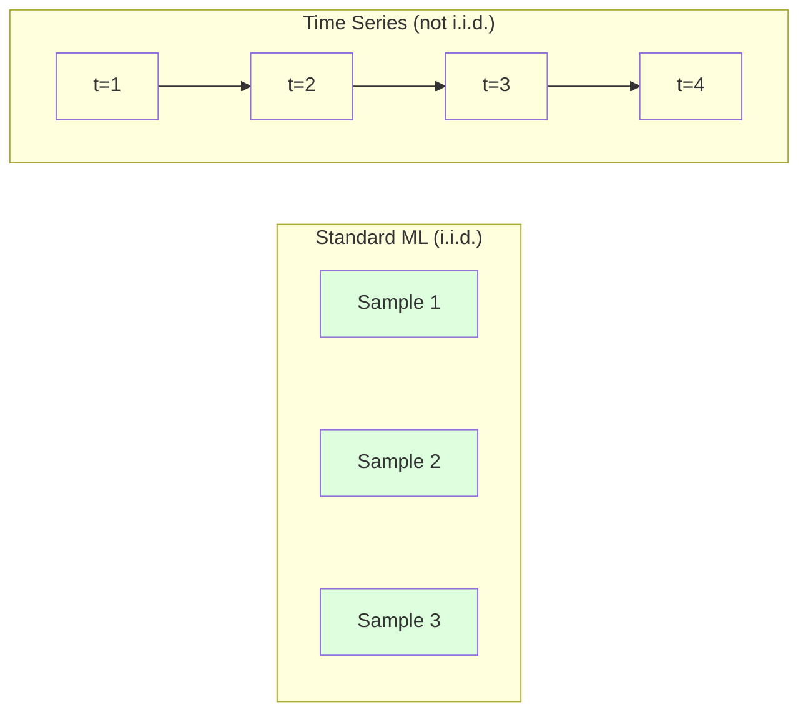
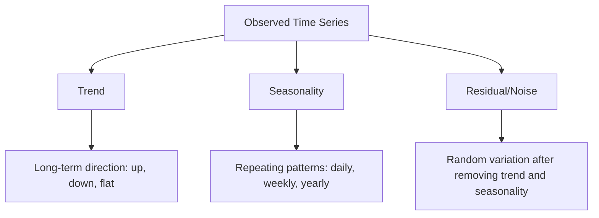
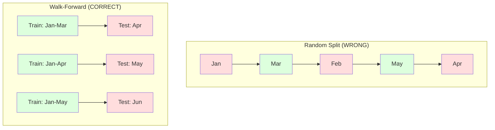

# Zaman Serisinin Temelleri

> Geçmiş performans gelecekteki sonuçları tahmin eder -- eğer önce durağanlığı kontrol ederseniz.

**Tür:** Yapım
**Dil:** Python
**Önkoşullar:** Aşama 2, Dersler 01-09
**Süre:** ~90 dakika

## Öğrenme Hedefleri

- Bir zaman serisini trend, mevsimsellik ve artık bileşenlere ayrıştırın ve durağanlığı test edin
- Bir zaman serisini denetimli öğrenme problemine dönüştürmek için gecikme özelliklerini ve yuvarlanma istatistiklerini uygulayın
- Gelecekteki verilerin eğitime sızmasını önleyen ileriye dönük bir doğrulama framework oluşturun
- Rastgele eğitim/test bölünmelerinin zaman serileri için neden geçersiz olduğunu açıklayın ve uygun zamansal bölünmelere karşı performans farkını gösterin

## Sorun

Zamana göre sıralanmış verileriniz var. Günlük satışlar, saatlik sıcaklık, dakika başına CPU kullanımı, haftalık hisse senedi fiyatları. Bir sonraki değeri, gelecek haftayı, sonraki çeyreği tahmin etmek istiyorsunuz.

Standart makine öğrenimi araç kitinize ulaşırsınız: rastgele eğitim/test ayrımı, çapraz doğrulama, özellik matrisi girişi, tahmin çıkışı. Her adım yanlış.

Zaman serileri, standart makine öğreniminin dayandığı varsayımları bozar. Örnekler bağımsız değil; bugünün sıcaklığı dünün sıcaklığına bağlı. Rastgele bölünmeler gelecekteki bilgileri geçmişe sızdırır. Geçmiş testlerde harika görünen özellikler, zaman içinde değişen kalıplara bağlı oldukları için üretimde başarısız olurlar.

Rastgele çapraz doğrulamayla %95 doğruluk elde eden bir model, uygun zamana dayalı değerlendirmeyle %55 doğruluk elde edebilir. Aradaki fark teknik bir özellik değildir. Kağıt üzerinde çalışan bir model ile üretimde çalışan bir model arasındaki farktır.

Bu ders temel konuları kapsar: zaman verilerini farklı kılan nedir, modellerin dürüst bir şekilde nasıl değerlendirileceği ve bir zaman serisinin standart makine öğrenimi modellerinin kullanabileceği özelliklere nasıl dönüştürüleceği.

## Konsept

### Zaman Serisini Farklı Kılan Nedir?

Standart ML, i.i.d'yi varsayar. --bağımsız ve aynı şekilde dağıtılmış. Her örnek, diğer örneklerden bağımsız olarak aynı dağılımdan alınır. Zaman serisi her ikisini de ihlal ediyor:

- **Bağımsız değil.** Bugünün hisse senedi fiyatı dünün fiyatına bağlıdır. Bu haftaki satışlar geçen haftaki satışlarla paralellik gösteriyor.
- **Aynı şekilde dağılmamıştır.** Dağılım zaman içinde değişmektedir. Aralık ayındaki satışlar Mart ayındaki satışlardan farklı görünüyor.

Bu ihlaller önemsiz değildir. Özellikleri nasıl oluşturduğunuzu, modelleri nasıl değerlendirdiğinizi ve hangi algoritmaların çalıştığını değiştirirler.



Standart ML'de örnekler değiştirilebilir. Bunları karıştırmak hiçbir şeyi değiştirmez. Zaman serilerinde düzen her şeydir. Karıştırma sinyali yok eder.

### Zaman Serisinin Bileşenleri

Her zaman serisi aşağıdakilerin birleşimidir:



- **Trend**: Uzun vadeli yön. Gelir her yıl %10 artıyor. Küresel sıcaklık artıyor.
- **Mevsimsellik**: Sabit aralıklarla tekrarlanan modeller. Aralık ayında perakende satışlar arttı. Temmuz ayında klima kullanımı zirveye çıkıyor.
- **Artık**: Trend ve mevsimsellik ortadan kaldırıldıktan sonra kalan kısım. Kalıntı beyaz gürültüye benziyorsa ayrıştırma sinyali yakalar.

### Durağanlık

Bir zaman serisi, istatistiksel özellikleri (ortalama, varyans, otokorelasyon) zaman içinde değişmiyorsa durağandır. Çoğu tahmin yöntemi durağanlığı varsayar.

**Neden önemlidir:** Durağan olmayan bir serinin sürüklenen bir ortalaması vardır. Ocak ayına ait verilerle eğitilen bir model, Şubat ayının göstereceğinden farklı bir ortalama öğrendi. Sistematik olarak yanlış olacaktır.

**Nasıl kontrol edilir:** Pencereler üzerinden yuvarlanan ortalamayı ve yuvarlanan standart sapmayı hesaplayın. Eğer sürükleniyorsa seri durağan değildir.

**Nasıl düzeltilir?** Farklılık. Ham değerleri modellemek yerine ardışık değerler arasındaki değişimi modelleyin:

```
diff[t] = value[t] - value[t-1]
```

Bir tur fark alma seriyi durağan hale getirmiyorsa tekrar uygulayın (ikinci dereceden fark alma). Çoğu gerçek dünya dizisi en fazla iki tura ihtiyaç duyar.

**Örnek:**

Orijinal seri: [100, 102, 106, 112, 120]
İlk fark: [2, 4, 6, 8] (hala yükseliş eğiliminde)
İkinci fark: [2, 2, 2] (sabit -- durağan)

Orijinal serinin ikinci dereceden bir eğilimi vardı. İlk fark, bunu doğrusal bir trende dönüştürdü. İkinci fark onu düzleştirdi. Pratikte nadiren iki turdan fazlasına ihtiyacınız olur.

**Resmi test:** Artırılmış Dickey-Fuller (ADF) testi, durağanlık için standart istatistiksel testtir. Boş hipotez "serinin durağan olmadığı" şeklindedir. 0,05'in altındaki bir p değeri, boş değeri reddedebileceğiniz ve durağanlık sonucuna varabileceğiniz anlamına gelir. ADF'yi sıfırdan uygulamıyoruz (asimptotik dağıtım tabloları gerektirir), ancak kodumuzdaki yuvarlanan istatistik yaklaşımı pratik bir görsel kontrol sağlar.

### Otokorelasyon

Otokorelasyon, t zamanındaki bir değerin t-k zamanındaki değerle (geçmişteki k adım) ne kadar ilişkili olduğunu ölçer. Otokorelasyon fonksiyonu (ACF), her k gecikmesi için bu korelasyonu çizer.

**ACF size şunu söyler:**
- Dizinin ne kadar geriye gittiğini hatırlıyor. Eğer ACF 5. gecikmeden sonra sıfıra düşerse, 5 adımdan daha önceki değerler önemsizdir.
- Mevsimselliğin mevcut olup olmadığı. ACF 12. gecikmede (aylık veriler) yükselirse, yıllık mevsimsellik söz konusudur.
- Kaç tane gecikme özelliği oluşturulacağı. ACF'nin ihmal edilebilir hale geldiği noktaya kadar gecikmeleri kullanın.

**PACF (Kısmi Otokorelasyon Fonksiyonu)** dolaylı korelasyonları ortadan kaldırır. Eğer bugün sadece her ikisi de dünle ilişkili olduğu için 3 gün öncesiyle ilişkiliyse, 3. gecikmedeki PACF sıfır olurken 3. gecikmedeki ACF sıfır olmayacaktır.

### Gecikme Özellikleri: Zaman Serisini Denetimli Öğrenmeye Dönüştürme

Standart ML modelleri bir özellik matrisi X'e ve bir hedef y'ye ihtiyaç duyar. Zaman serileri size tek bir değer sütunu verir. Köprü gecikme özellikleridir.

[10, 12, 14, 13, 15] serisini alın ve gecikme-1 ve gecikme-2 özelliklerini oluşturun:

| gecikme_2 | gecikme_1 | hedef |
|-------|-------|--------|
| 10    | 12    | 14     |
| 12    | 14    | 13     |
| 14    | 13    | 15     |

Artık standart bir regresyon sorununuz var. Herhangi bir ML modeli (doğrusal regresyon, rastgele orman, gradient artırma) gecikmelerden hedefi tahmin edebilir.

Tasarlayabileceğiniz ek özellikler:
- **Döner istatistikler:** son k değerleri üzerinden ortalama, std, min, maksimum
- **Takvim özellikleri:** haftanın günü, ay, is_holiday, is_weekend
- **Farklı değerler:** önceki adıma göre değişiklik
- **Genişleyen istatistikler:** kümülatif ortalama, kümülatif toplam
- **Oran özellikleri:** mevcut değer / yuvarlanan ortalama (son ortalamadan ne kadar uzakta)
- **Etkileşim özellikleri:** lag_1 * day_of_week (momentum üzerindeki hafta içi etkileri)

**Kaç gecikme?** Otomatik korelasyon işlevini kullanın. ACF 10 gecikmeye kadar anlamlıysa en az 10 gecikme kullanın. Haftalık mevsimsellik varsa, 7 (ve muhtemelen 14) gecikmeyi dahil edin. Daha fazla gecikme, modele daha fazla geçmiş kazandırmanın yanı sıra sığacak daha fazla özellik sağlayarak aşırı uyum riskini artırır.

**Hedef hizalama tuzağı.** Gecikme özellikleri oluştururken, hedefin t zamanındaki değer olması gerekir ve tüm özelliklerin t-1 zamanındaki veya daha önceki değerleri kullanması gerekir. Yanlışlıkla t zamanındaki değeri bir özellik olarak dahil ederseniz, mükemmel bir tahminciye ve tamamen işe yaramaz bir modele sahip olursunuz. Bu, zaman serisi özellik mühendisliğinde en yaygın hatadır.

### İleriye Doğru Doğrulama

Bu dersteki en önemli kavram budur. Standart k-katlı çapraz doğrulama, örnekleri eğitmek ve test etmek için rastgele atar. Zaman serileri için bu, gelecekteki bilgileri sızdırır.



İleriye dönük doğrulama:
1. t zamanına kadar veriler üzerinde eğitim alın
2. t+1 zamanında (veya çok adımlı için t+1'den t+k'ye) tahmin yapın
3. Pencereyi ileri doğru kaydırın
4. Tekrarlayın

Her test katlaması yalnızca tüm eğitim verilerinden sonra gelen verileri içerir. Gelecekte sızıntı yok. Bu size modelin konuşlandırıldığında nasıl performans göstereceğine dair dürüst bir tahmin verir.

**Genişleyen pencere** eğitim için tüm geçmiş verileri kullanır (pencere büyür). **Sürgülü pencere**, sabit boyutlu bir eğitim penceresi (pencere slaytları) kullanır. Eski verilerin hâlâ geçerli olduğuna inandığınızda genişletmeyi kullanın. Dünya değiştiğinde ve eski veriler zarar gördüğünde kaydırmayı kullanın.

### ARIMA Sezgisi

ARIMA klasik zaman serisi modelidir. Üç bileşeni vardır:

- **AR (Otoregresif):** Geçmiş değerlerden tahmin. AR(p) son p değerlerini kullanır.
- **I (Bütünleşik):** Durağanlığa ulaşmak için farklılaştırma. I(d) farklı turları uygular.
- **MA (Hareketli Ortalama):** Geçmiş tahmin hatalarından tahmin. MA(q) son q hatalarını kullanır.

ARIMA(p, d, q) üçünü de birleştirir. ACF/PACF analizine veya otomatik aramaya (otomatik ARIMA) dayalı olarak p, d, q'yi seçersiniz.

ARIMA'yı sıfırdan uygulamayacağız; bu, bu dersin kapsamı dışında olan sayısal optimizasyon gerektirir. Önemli olan, her bir bileşenin ne yaptığını anlamaktır, böylece ARIMA sonuçlarını yorumlayabilir ve onu ne zaman kullanacağınızı bilirsiniz.

### Ne Zaman Kullanılmalı Ne

| Yaklaşım | En İyisi | Mevsimsellik Kolları | Dış Özellikleri Tutar |
|----------|---------|-------------------|------------------------|
| Gecikme özellikleri + ML | Birçok harici özelliğe sahip tablo şeklinde | Takvim özellikleriyle | Evet |
| ARIMA | Tek değişkenli seri, kısa vadeli | SARIMA çeşidi | Hayır (Sınırlı için ARIMAX) |
| Üstel yumuşatma | Basit trend + mevsimsellik | Evet (Holt-Winters) | Hayır |
| Peygamber | İş tahmini, tatiller | Evet (Fourier terimleri) | Sınırlı |
| Neural network'ler (LSTM, Transformer) | Uzun diziler, birçok dizi | Öğrenildi | Evet |

Çoğu pratik sorun için gecikme özellikleri + gradient artırma en güçlü başlangıç noktasıdır. Harici özellikleri doğal bir şekilde işler, durağanlık gerektirmez ve hata ayıklaması kolaydır.

### Tahmin Ufukları ve Stratejileri

Tek adımlı tahmin, bir adım ilerisini tahmin eder. Çok adımlı tahmin, birden çok adımı öngörür. Üç strateji var:

**Özyinelemeli (yinelenen):** Bir adım ilerisini tahmin edin, tahmini bir sonraki adım için girdi olarak kullanın. Basit ama hatalar birikir; her tahmin bir önceki tahmini kullanır, dolayısıyla hatalar birleşir.

**Doğrudan:** Her ufuk için ayrı bir model eğitin. Model-1 t+1'i, Model-5 ise t+5'i öngörüyor. Hata birikimi yok ancak her modelde daha az eğitim örneği var ve bilgi paylaşmıyorlar.

**Çoklu çıkış:** Tüm ufukların aynı anda çıktısını veren bir modeli eğitin. Bilgileri farklı ufuklar boyunca paylaşır ancak birden fazla çıkışı destekleyen bir model (veya özel bir loss function) gerektirir.

Çoğu pratik problemde, kısa ufuklar için özyinelemeli (1-5 adım) ve daha uzun ufuklar için doğrudan başlayın.

### Zaman Serisinde Yaygın Hatalar

| Hata | Neden oluyor | Nasıl düzeltilir |
|---------|---------------|-----------|
| Rastgele eğitim/test ayrımı | Standart ML'den gelen alışkanlık | İleriye doğru veya zamansal bölmeyi kullanın |
| Gelecekteki özellikleri kullanma | t zamanındaki özellik yanlışlıkla eklenmiştir | Zamansal hizalama için her özelliği denetleyin |
| Mevsimselliğe aşırı uyum | Model takvim kalıplarını ezberler | Test setinde tam bir mevsimsel döngü sağlayın |
| Ölçek değişiklikleri göz ardı ediliyor | Gelir iki katına çıkıyor ancak kalıplar kalıyor | Mutlak yerine model yüzdesi değişimi |
| Çok fazla gecikme özelliği | "Daha fazla geçmiş daha iyidir" | İlgili gecikmeleri belirlemek için ACF'yi kullanın |
| Fark yok | "Model bunu çözecek" | Ağaç modelleri trendleri ele alır; doğrusal modeller durağanlığa ihtiyaç duyar |

## İnşa Et

`code/time_series.py`'deki kod, temel yapı taşlarını sıfırdan uygular.

### Gecikme Özelliği Oluşturucu

```python
def make_lag_features(series, n_lags):
    n = len(series)
    X = np.full((n, n_lags), np.nan)
    for lag in range(1, n_lags + 1):
        X[lag:, lag - 1] = series[:-lag]
    valid = ~np.isnan(X).any(axis=1)
    return X[valid], series[valid]
```

Bu, 1 boyutlu bir seriyi, her satırın özellikler olarak son `n_lags` değerlerine ve hedef olarak geçerli değere sahip olduğu bir özellik matrisine dönüştürür.

### İleriye Doğru Çapraz Doğrulama

```python
def walk_forward_split(n_samples, n_splits=5, min_train=50):
    assert min_train < n_samples, "min_train must be less than n_samples"
    step = max(1, (n_samples - min_train) // n_splits)
    for i in range(n_splits):
        train_end = min_train + i * step
        test_end = min(train_end + step, n_samples)
        if train_end >= n_samples:
            break
        yield slice(0, train_end), slice(train_end, test_end)
```

Her bölünme, eğitim verilerinin kesinlikle test verilerinden önce gelmesini sağlar. Eğitim penceresi her katlamada genişler.

### Basit Otoregresif Model

Saf bir AR modeli, gecikme özelliklerinde yalnızca doğrusal bir regresyondur:

```python
class SimpleAR:
    def __init__(self, n_lags=5):
        self.n_lags = n_lags
        self.weights = None
        self.bias = None

    def fit(self, series):
        X, y = make_lag_features(series, self.n_lags)
        # Solve via normal equations
        X_b = np.column_stack([np.ones(len(X)), X])
        theta = np.linalg.lstsq(X_b, y, rcond=None)[0]
        self.bias = theta[0]
        self.weights = theta[1:]
        return self
```

Bu, kavramsal olarak Ders 02'deki doğrusal regresyonla aynıdır ancak aynı değişkenin zaman gecikmeli versiyonlarına uygulanır.

### Durağanlık Kontrolü

Kod, durağanlığı görsel ve sayısal olarak değerlendirmek için yuvarlanma istatistiklerini hesaplar:

```python
def check_stationarity(series, window=50):
    rolling_mean = np.array([
        series[max(0, i - window):i].mean()
        for i in range(1, len(series) + 1)
    ])
    rolling_std = np.array([
        series[max(0, i - window):i].std()
        for i in range(1, len(series) + 1)
    ])
    return rolling_mean, rolling_std
```

Yuvarlanma ortalaması kayarsa veya yuvarlanma standardı değişirse seri durağan değildir. Farkı uygulayın ve tekrar kontrol edin.

Kod ayrıca serinin ilk yarısı ile ikinci yarısını karşılaştırarak durağanlığı da kontrol eder. Ortalamalar standart sapmanın yarısından fazla farklılık gösteriyorsa veya varyans oranı 2x'i geçiyorsa seri durağan değil olarak işaretlenir.

### Otokorelasyon

```python
def autocorrelation(series, max_lag=20):
    n = len(series)
    mean = series.mean()
    var = series.var()
    acf = np.zeros(max_lag + 1)
    for k in range(max_lag + 1):
        cov = np.mean((series[:n-k] - mean) * (series[k:] - mean))
        acf[k] = cov / var if var > 0 else 0
    return acf
```

## Kullan onu

Sklearn ile gecikme özelliklerini herhangi bir regresörle doğrudan kullanırsınız:

```python
from sklearn.linear_model import Ridge
from sklearn.ensemble import GradientBoostingRegressor

X, y = make_lag_features(series, n_lags=10)

for train_idx, test_idx in walk_forward_split(len(X)):
    model = Ridge(alpha=1.0)
    model.fit(X[train_idx], y[train_idx])
    predictions = model.predict(X[test_idx])
```

ARIMA için istatistik modellerini kullanın:

```python
from statsmodels.tsa.arima.model import ARIMA

model = ARIMA(train_series, order=(5, 1, 2))
fitted = model.fit()
forecast = fitted.forecast(steps=30)
```

`time_series.py`'deki kod her iki yaklaşımı da gösterir ve ileri doğru doğrulamayı kullanarak bunları karşılaştırır.

### sklearn TimeSeriesSplit

sklearn, ileri doğrulamayı uygulayan `TimeSeriesSplit`'yi sağlar:

```python
from sklearn.model_selection import TimeSeriesSplit

tscv = TimeSeriesSplit(n_splits=5)
for train_index, test_index in tscv.split(X):
    X_train, X_test = X[train_index], X[test_index]
    y_train, y_test = y[train_index], y[test_index]
    model.fit(X_train, y_train)
    score = model.score(X_test, y_test)
```

Bu, sıfırdan `walk_forward_split`'ye eşdeğerdir ancak sklearn'in framework çapraz doğrulamasına entegre edilmiştir. `cross_val_score` ile kullanabilirsiniz:

```python
from sklearn.model_selection import cross_val_score

scores = cross_val_score(model, X, y, cv=TimeSeriesSplit(n_splits=5))
print(f"Mean score: {scores.mean():.4f} +/- {scores.std():.4f}")
```

### Değerlendirme Metrikleri

Zaman serisi tahmini, regresyon ölçümlerini kullanır ancak zamana duyarlı bağlamla:

- **MAE (Ortalama Mutlak Hata):** |y_true - y_pred| ortalaması. Orijinal birimlerde yorumlanması kolaydır. "Ortalama olarak tahminler 3,2 derece saptı."
- **RMSE (Kök Ortalama Kare Hatası):** Ortalama kare hatanın karekökü. Büyük hataları MAE'den daha fazla cezalandırır. Büyük hataların birçok küçük hatadan daha kötü olduğu durumlarda kullanın.
- **MAPE (Ortalama Mutlak Yüzde Hata):** Ortalama |hata / doğru_değer| * 100. Ölçekten bağımsız, farklı seriler arasında karşılaştırma yapmak için kullanışlıdır. Ancak gerçek değerler sıfır olduğunda tanımsızdır.
- **Naif temel karşılaştırma:** Her zaman basit temel değerlerle karşılaştırın. Mevsimsel saf temel, bir dönem öncesindeki (dün, geçen hafta) değeri tahmin eder. Eğer modeliniz saflığı yenemezse bir şeyler ters gidiyor demektir.

### Yuvarlanma Özellikleri

Kod, gecikme özelliklerine yuvarlanan istatistiklerin (7 ve 14 günlük pencerelerde ortalama, standart, minimum, maksimum) eklenmesini gösterir. Bunlar, modele, gecikme özelliklerinin tek başına yakalayamadığı son trendler ve volatilite hakkında bilgi verir.

Örneğin, yuvarlanan ortalama artıyorsa, bu bir yükseliş eğilimine işaret eder. Eğer yuvarlanma std artıyorsa, bu volatilitenin arttığını gösterir. Bunlar, ağaç tabanlı modellerin öğrenebileceği ancak doğrusal modellerin öğrenemeyeceği türden kalıplardır.

## Gönderin

Bu ders şunları üretir:
- `outputs/prompt-time-series-advisor.md` -- zaman serisi problemlerini çerçevelemek için bir prompt
- `code/time_series.py` -- gecikme özellikleri, ileriye dönük doğrulama, AR modeli, durağanlık kontrolleri

### Geçmeniz Gereken Temel Çizgiler

Herhangi bir model oluşturmadan önce temelleri oluşturun:

1. **Son değer (kalıcılık).** Yarının bugünle aynı olacağını tahmin edin. Birçok dizi için bunu yenmek şaşırtıcı derecede zordur.
2. **Mevsimsel saflık.** Bugünün geçen haftanın (veya geçen yılın) aynı günü olacağını tahmin edin. Eğer modeliniz bunu yenemezse mevsimselliğin ötesinde herhangi bir yararlı model öğrenememiş demektir.
3. **Hareketli ortalama.** Son k değerinin ortalamasını tahmin edin. Gürültüyü yumuşatır ancak ani değişiklikleri yakalayamaz.

Eğer süslü ML modeliniz mevsimsel saf temel çizgiye yeniliyorsa, bir hatanız var demektir. En yaygın olarak: özelliklerin gelecekteki sızıntısı, yanlış değerlendirme yöntemi veya serinin gerçekten rastgele ve öngörülemez olması.

### Pratik İpuçları

1. **Çizim ile başlayın.** Herhangi bir modellemeden önce ham seriyi çizin. Trendleri, mevsimselliği, aykırı değerleri, yapısal kırılmaları (davranıştaki ani değişiklikleri) arayın. 30 saniyelik bir görsel inceleme genellikle size bir saatlik otomatik analizden daha fazlasını anlatır.

2. **Önce fark, sonra model.** Serinin net bir eğilimi varsa, gecikme özellikleri oluşturmadan önce farkı belirleyin. Ağaç tabanlı modeller trendleri ele alabilir, ancak doğrusal modeller bunu yapamaz ve farklılaşmanın hiçbir zararı yoktur.

3. **En az bir tam mevsimsel döngüyü uzatın.** Haftalık mevsimselliğiniz varsa, test setinizin en az bir tam haftaya ihtiyacı vardır. Aylık ise en az bir tam ay. Aksi halde modelin mevsimsel deseni yakalayıp yakalamadığını değerlendiremezsiniz.

4. **Üretimde monitör.** Zaman serisi modelleri, dünya değiştikçe zamanla bozulur. Tahmin hatalarını sürekli olarak izleyin. Hatalar artmaya başladığında modeli en son verilerle yeniden eğitin.

5. **Rejim değişikliklerine karşı dikkatli olun.** Pandemi öncesi verilerle eğitilmiş bir model, pandemi sonrası davranışları tahmin etmeyecektir. Bilinen rejim değişikliklerinin göstergelerini özellik olarak ekleyin veya eski verileri unutan kayan bir pencere kullanın.

6. **Log-dönüşümü çarpık seriler.** Gelir, fiyatlar ve sayımlar genellikle sağa çarpıktır. Günlüğün alınması varyansı dengeler ve doğrusal modellerin işleyebileceği çarpımsal modelleri toplayıcı hale getirir. Günlük alanında tahmin yapın, ardından orijinal birimlere geri dönmek için üstel işlem yapın.

## Egzersizler

1. **Durağanlık deneyi.** Doğrusal eğilime sahip bir seri oluşturun. Dönen istatistiklerle durağanlığı kontrol edin. İlk farkı uygulayın. Tekrar kontrol edin. İkinci dereceden bir trend için kaç tur fark alma işlemi gerekir?

2. **Gecikme seçimi.** ACF'yi mevsimsel bir seride hesaplayın (dönem=7). Hangi gecikmeler en yüksek otokorelasyona sahiptir? Yalnızca bu gecikmeleri kullanarak (ardışık gecikmeleri değil) gecikme özellikleri oluşturun. Doğruluk, 1'den 7'ye kadar olan gecikmelerin kullanılmasıyla karşılaştırıldığında artıyor mu?

3. **İleriye doğru ilerleme ve rastgele bölünme.** Gecikme özellikleri üzerinde bir Ridge regresyonu eğitin. Rastgele 80/20 bölmeyle ve ileriye dönük doğrulamayla değerlendirin. Rastgele bölünme performansı ne kadar fazla tahmin ediyor?

4. **Özellik mühendisliği.** Gecikme özelliklerine, yuvarlanan ortalama (pencere=7), yuvarlanan std (pencere=7) ve haftanın günü özelliklerini ekleyin. İleriye doğru doğrulamayı kullanarak bu ekstralar varken ve bu ekstralar olmadan doğruluğu karşılaştırın.

5. **Çok adımlı tahmin.** AR modelini 1 yerine 5 adım ilerisini tahmin edecek şekilde değiştirin. İki stratejiyi karşılaştırın: (a) bir adımı tahmin edin, tahmini bir sonraki adım için girdi olarak kullanın (özyinelemeli) ve (b) her ufuk için ayrı modeller eğitin (doğrudan). Hangisi daha doğru?

## Anahtar Terimler

| Dönem | İnsanlar ne diyor | Aslında ne anlama geliyor |
|------|----------------|----------------------|
| Durağanlık | "İstatistikler zamanla değişmez" | Ortalaması, varyansı ve otokorelasyon yapısı zaman içinde sabit olan bir seri |
| Fark yaratan | "Ardışık değerleri çıkarın" | Trendleri ortadan kaldırmak ve durağanlığa ulaşmak için y[t] - y[t-1]'in hesaplanması |
| Otokorelasyon (ACF) | "Bir serinin kendisiyle nasıl bir ilişkisi var?" | Gecikmenin bir fonksiyonu olarak bir zaman serisi ile kendisinin gecikmeli bir kopyası arasındaki korelasyon |
| Kısmi otokorelasyon (PACF) | "Yalnızca doğrudan korelasyon" | Tüm kısa gecikmelerin etkisi kaldırıldıktan sonra k gecikmesinde otokorelasyon |
| Gecikme özellikleri | "Giriş olarak geçmiş değerler" | y[t]'yi tahmin etmek için y[t-1], y[t-2], ..., y[t-k]'yi özellikler olarak kullanma |
| İleriye dönük doğrulama | "Zamana saygılı çapraz doğrulama" | Eğitim verilerinin her zaman kronolojik olarak test verilerinden önce geldiği değerlendirme |
| ARIMA | "Klasik zaman serisi modeli" | Otomatik Regresyonlu Entegre Hareketli Ortalama: geçmiş değerleri (AR), farkı almayı (I) ve geçmiş hataları (MA) birleştirir |
| Mevsimsellik | "Yinelenen takvim kalıpları" | Takvim dönemlerine (günlük, haftalık, yıllık) bağlı bir zaman serisindeki düzenli, öngörülebilir döngüler |
| Eğilim | "Uzun vadeli yön" | Seri düzeyinde zaman içinde kalıcı bir artış veya azalma |
| Genişleyen pencere | "Tüm geçmişi kullan" | Eğitim setinin her katlamayla birlikte büyüdüğü ileri doğru doğrulama |
| Sürgülü pencere | "Sabit boyutlu geçmiş" | Eğitim setinin ileri doğru kayan sabit uzunlukta bir pencere olduğu ileri doğru doğrulama |

## Daha Fazla Okuma

- [Hyndman ve Athanasopoulos, Tahmin: İlkeler ve Uygulama (3. baskı)](https://otexts.com/fpp3/) -- zaman serisi tahminiyle ilgili en iyi ücretsiz ders kitabı
- [scikit-learn Zaman Serisi Bölünmesi](https://scikit-learn.org/stable/modules/generated/sklearn.model_selection.TimeSeriesSplit.html) -- sklearn'ün ileri adım ayırıcısı
- [statsmodels ARIMA docs](https://www.statsmodels.org/stable/generated/statsmodels.tsa.arima.model.ARIMA.html) -- Teşhis özellikli ARIMA uygulaması
- [Makridakis ve diğerleri, M5 Yarışması (2022)](https://www.sciencedirect.com/science/article/pii/S0169207021001874) -- Makine öğrenimi yöntemleri ile istatistiksel yöntemleri gösteren büyük ölçekli tahmin yarışması
