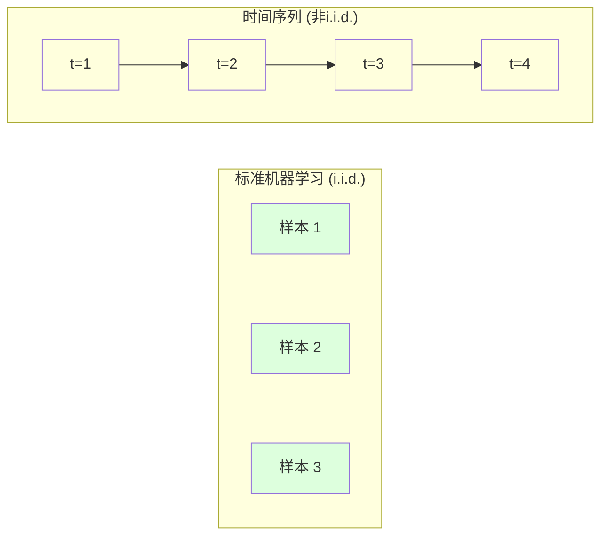
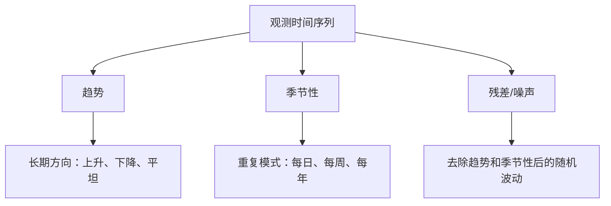
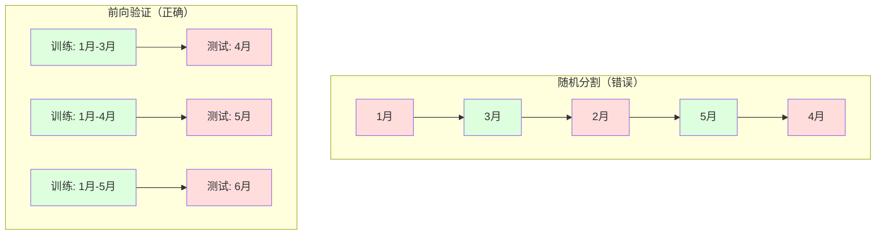

# 时间序列基础

> 过去的表现确实能预测未来的结果——前提是你先检查了平稳性。

**类型：** 构建
**语言：** Python
**前置条件：** 阶段 2，课程 01-09
**时长：** 约90分钟

## 学习目标

- 将时间序列分解为趋势、季节性和残差分量，并检验平稳性
- 实现滞后特征和滚动统计，将时间序列转化为监督学习问题
- 构建前向验证框架，防止未来数据泄露到训练集中
- 解释为什么随机训练/测试分割对于时间序列是无效的，并展示其与正确时间分割之间的性能差距

## 问题

你拥有按时间排序的数据：每日销售额、每小时温度、每分钟CPU使用率、每周股票价格。你想预测下一个值、下一周、下一季度。

你拿起你的标准机器学习工具箱：随机训练/测试分割、交叉验证、特征矩阵输入、预测输出。每一步都是错的。

时间序列打破了标准机器学习依赖的假设。样本不是独立的——今天的温度取决于昨天的。随机分割会将未来信息泄露到过去。在回测中看起来很好的特征在生产中会失败，因为它们依赖于随时间变化的模式。

在随机交叉验证下达到95%准确率的模型，在正确的时间评估下可能只有55%。这种差异不是技术细节。它决定了模型是纸上谈兵还是真正能在生产中工作。

本课程涵盖基础知识：时间数据有何不同，如何诚实评估模型，以及如何将时间序列转化为标准机器学习模型可以消费的特征。

## 概念

### 时间序列有何不同

标准机器学习假设i.i.d.——独立同分布（independent and identically distributed）。每个样本从同一分布中独立抽取。时间序列违反了这两点：

- **不独立。** 今天的股票价格取决于昨天的。本周的销售额与上周相关。
- **非同分布。** 分布随时间变化。十二月的销售额看起来与三月的不同。

这些违反不是微不足道的。它们改变了你构建特征、评估模型以及选择算法的方式。



在标准机器学习中，样本是可互换的。打乱它们没有任何影响。在时间序列中，顺序决定一切。打乱会破坏信号。

### 时间序列的组成部分

每个时间序列都是以下成分的组合：



- **趋势**：长期方向。收入每年增长10%。全球温度上升。
- **季节性**：固定间隔的重复模式。零售额在十二月份飙升。空调使用在七月份达到峰值。
- **残差**：去除趋势和季节性后剩余的部分。如果残差看起来像白噪声，那么分解已经捕捉到了信号。

### 平稳性

如果时间序列的统计特性（均值、方差、自相关）不随时间变化，则称其为平稳的。大多数预测方法假设平稳性。

**为什么重要：** 非平稳序列的均值会发生漂移。在1月份数据上训练的模型学到了平均值，与2月份将显示的平均值不同。它会系统性出错。

**如何检查：** 计算窗口内的滚动均值和滚动标准差。如果它们发生漂移，则序列是非平稳的。

**如何修复：** 差分。不建模原始值，而是建模连续值之间的变化：

```
diff[t] = value[t] - value[t-1]
```

如果一轮差分不能使序列平稳，则再次应用（二阶差分）。大多数现实世界的序列最多需要两轮差分。

**示例：**

原始序列：[100, 102, 106, 112, 120]
一阶差分：[2, 4, 6, 8]（仍在上升）
二阶差分：[2, 2, 2]（恒定——平稳）

原始序列具有二次趋势。一阶差分将其变为线性趋势。二阶差分使其平坦。在实践中，很少需要超过两轮。

**正式检验：** 增强迪基-富勒检验（Augmented Dickey-Fuller test, ADF）是检验平稳性的标准统计检验。原假设是“序列是非平稳的”。p值低于0.05意味着你可以拒绝原假设并得出平稳的结论。我们不会从头实现ADF（它需要渐近分布表），但代码中的滚动统计方法提供了一个实用的视觉检查。

### 自相关

自相关测量时间t的值与时间t-k（过去k步）的值之间的相关程度。自相关函数（ACF）绘制每个滞后k的相关性。

**ACF告诉你：**
- 序列记忆有多远。如果ACF在滞后5之后降至零，那么超过5步之前的值无关紧要。
- 是否存在季节性。如果ACF在滞后12（月度数据）处有尖峰，则存在年度季节性。
- 应该创建多少滞后特征。使用直到ACF变得可忽略的滞后。

**偏自相关函数（PACF）** 消除间接相关性。如果今天与3天前相关仅仅是因为两者都与昨天相关，那么滞后3的PACF为零，而滞后3的ACF则不为零。

### 滞后特征：将时间序列转化为监督学习

标准机器学习模型需要一个特征矩阵X和一个目标y。时间序列只给你一列数值。桥梁就是滞后特征。

取序列[10, 12, 14, 13, 15]，创建滞后1和滞后2特征：

| lag_2 | lag_1 | 目标 |
|-------|-------|------|
| 10    | 12    | 14   |
| 12    | 14    | 13   |
| 14    | 13    | 15   |

现在你有了一个标准的回归问题。任何机器学习模型（线性回归、随机森林、梯度提升）都可以从滞后项预测目标。

你可以工程化的其他特征：
- **滚动统计：** 过去k个值的均值、标准差、最小值、最大值
- **日历特征：** 星期几、月份、是否为节假日、是否为周末
- **差分值：** 与前一步相比的变化
- **扩展统计：** 累积均值、累积和
- **比率特征：** 当前值/滚动均值（离近期平均值的距离）
- **交互特征：** lag_1 * day_of_week（动量上的周内效应）

**需要多少滞后？** 使用自相关函数。如果ACF在滞后10之前都显著，则使用至少10个滞后。如果存在周季节性，则包括滞后7（可能还有14）。更多的滞后给模型提供了更多历史，但也带来了更多要拟合的特征，增加了过拟合的风险。

**目标对齐陷阱。** 创建滞后特征时，目标必须是时间t的值，所有特征必须使用时间t-1或更早的值。如果你意外地包括了时间t的值作为特征，你会得到一个完美的预测器——但一个完全无用的模型。这是时间序列特征工程中最常见的错误。

### 前向验证

这是本课程中最重要概念。标准的k折交叉验证随机分配样本到训练集和测试集。对于时间序列，这会导致未来信息泄露。



前向验证：
1. 使用截至时间t的数据训练
2. 预测时间t+1（或t+1到t+k用于多步预测）
3. 向前滑动窗口
4. 重复

每个测试折只包含在所有训练数据之后的时间点。没有未来泄露。这使你能够诚实评估模型部署后的表现。

**扩展窗口** 使用所有历史数据进行训练（窗口增长）。**滑动窗口** 使用固定大小的训练窗口（窗口滑动）。当你相信旧数据仍然相关时使用扩展窗口。当世界变化而旧数据有害时使用滑动窗口。

### ARIMA直观理解

ARIMA是经典的时间序列模型。它有三个组成部分：

- **AR（自回归）：** 根据过去的值进行预测。AR(p)使用最后p个值。
- **I（综合）：** 差分实现平稳性。I(d)应用d轮差分。
- **MA（移动平均）：** 根据过去的预测误差进行预测。MA(q)使用最后q个误差。

ARIMA(p, d, q) 结合三者。你根据ACF/PACF分析或自动搜索（auto-ARIMA）来选择p, d, q。

我们不会从头实现ARIMA——它需要超出本课程范围的数值优化。关键点是理解每个组件的作用，以便解释ARIMA结果并知道何时使用它。

### 何时使用什么

| 方法 | 最适合 | 处理季节性 | 处理外部特征 |
|------|--------|-----------|--------------|
| 滞后特征 + 机器学习 | 表格数据，多外部特征 | 结合日历特征 | 是 |
| ARIMA | 单变量序列，短期 | SARIMA变体 | 否（ARIMAX有限） |
| 指数平滑 | 简单趋势+季节性 | 是（Holt-Winters） | 否 |
| Prophet | 商业预测，节假日 | 是（傅里叶项） | 有限 |
| 神经网络（LSTM, Transformer） | 长序列，多序列 | 学习得到 | 是 |

对于大多数实际问题，滞后特征+梯度提升是最强有力的起点。它自然处理外部特征，不需要平稳性，且易于调试。

### 预测范围与策略

单步预测预测下一个时间步。多步预测预测多个时间步。有三种策略：

**递归（迭代）：** 预测一步，然后将该预测用作下一步的输入。简单但误差会累积——每个预测都基于上一个预测，所以错误会复合。

**直接：** 为每个预测范围单独训练一个模型。模型-1预测t+1，模型-5预测t+5。没有误差累积，但每个模型的训练样本更少，并且它们之间不共享信息。

**多输出：** 训练一个模型同时输出所有范围。跨范围共享信息，但需要模型支持多输出（或自定义损失函数）。

对于大多数实际问题，短范围（1-5步）使用递归，更长的范围使用直接。

### 时间序列中的常见错误

| 错误 | 发生原因 | 如何修复 |
|------|----------|---------|
| 随机训练/测试分割 | 标准机器学习的习惯 | 使用前向验证或时间分割 |
| 使用未来特征 | 无意中包括了时间t的特征 | 审计每个特征的时间对齐性 |
| 过拟合季节性 | 模型记住了日历模式 | 在测试集中留出一个完整的季节周期 |
| 忽略尺度变化 | 收入翻倍但模式保持不变 | 建模百分比变化而非绝对值 |
| 过多滞后特征 | “更多历史更好” | 使用ACF确定相关滞后 |
| 不进行差分 | “模型会自己搞定” | 树模型处理趋势；线性模型需要平稳性 |

## 构建

`code/time_series.py` 中的代码从头实现了核心构建块。

### 滞后特征创建器

```python
def make_lag_features(series, n_lags):
    n = len(series)
    X = np.full((n, n_lags), np.nan)
    for lag in range(1, n_lags + 1):
        X[lag:, lag - 1] = series[:-lag]
    valid = ~np.isnan(X).any(axis=1)
    return X[valid], series[valid]
```

这会将一维序列转换为特征矩阵，其中每行具有最后`n_lags`个值作为特征，当前值作为目标。

### 前向验证交叉验证

```python
def walk_forward_split(n_samples, n_splits=5, min_train=50):
    assert min_train < n_samples, "min_train must be less than n_samples"
    step = max(1, (n_samples - min_train) // n_splits)
    for i in range(n_splits):
        train_end = min_train + i * step
        test_end = min(train_end + step, n_samples)
        if train_end >= n_samples:
            break
        yield slice(0, train_end), slice(train_end, test_end)
```

每个分割确保训练数据严格在测试数据之前。训练窗口随每折扩展。

### 简单自回归模型

纯AR模型只是在滞后特征上进行线性回归：

```python
class SimpleAR:
    def __init__(self, n_lags=5):
        self.n_lags = n_lags
        self.weights = None
        self.bias = None

    def fit(self, series):
        X, y = make_lag_features(series, self.n_lags)
        # 通过正规方程求解
        X_b = np.column_stack([np.ones(len(X)), X])
        theta = np.linalg.lstsq(X_b, y, rcond=None)[0]
        self.bias = theta[0]
        self.weights = theta[1:]
        return self
```

这在概念上与课程02中的线性回归相同，但应用于同一变量的时间滞后版本。

### 平稳性检查

代码计算滚动统计以可视化和数值上评估平稳性：

```python
def check_stationarity(series, window=50):
    rolling_mean = np.array([
        series[max(0, i - window):i].mean()
        for i in range(1, len(series) + 1)
    ])
    rolling_std = np.array([
        series[max(0, i - window):i].std()
        for i in range(1, len(series) + 1)
    ])
    return rolling_mean, rolling_std
```

如果滚动均值漂移或滚动标准差变化，则序列是非平稳的。应用差分并再次检查。

代码还通过比较序列的前半部分和后半部分来检查平稳性。如果均值差异超过半个标准差或方差比率超过2倍，则标记序列为非平稳。

### 自相关

```python
def autocorrelation(series, max_lag=20):
    n = len(series)
    mean = series.mean()
    var = series.var()
    acf = np.zeros(max_lag + 1)
    for k in range(max_lag + 1):
        cov = np.mean((series[:n-k] - mean) * (series[k:] - mean))
        acf[k] = cov / var if var > 0 else 0
    return acf
```

## 使用

使用sklearn，你可以将滞后特征直接与任何回归器一起使用：

```python
from sklearn.linear_model import Ridge
from sklearn.ensemble import GradientBoostingRegressor

X, y = make_lag_features(series, n_lags=10)

for train_idx, test_idx in walk_forward_split(len(X)):
    model = Ridge(alpha=1.0)
    model.fit(X[train_idx], y[train_idx])
    predictions = model.predict(X[test_idx])
```

对于ARIMA，使用statsmodels：

```python
from statsmodels.tsa.arima.model import ARIMA

model = ARIMA(train_series, order=(5, 1, 2))
fitted = model.fit()
forecast = fitted.forecast(steps=30)
```

`time_series.py` 中的代码演示了这两种方法，并使用前向验证进行比较。

### sklearn的TimeSeriesSplit

sklearn提供了 `TimeSeriesSplit`，它实现了前向验证：

```python
from sklearn.model_selection import TimeSeriesSplit

tscv = TimeSeriesSplit(n_splits=5)
for train_index, test_index in tscv.split(X):
    X_train, X_test = X[train_index], X[test_index]
    y_train, y_test = y[train_index], y[test_index]
    model.fit(X_train, y_train)
    score = model.score(X_test, y_test)
```

这等同于我们从头实现的 `walk_forward_split`，但已集成到sklearn的交叉验证框架中。你可以与 `cross_val_score` 一起使用：

```python
from sklearn.model_selection import cross_val_score

scores = cross_val_score(model, X, y, cv=TimeSeriesSplit(n_splits=5))
print(f"平均得分: {scores.mean():.4f} +/- {scores.std():.4f}")
```

### 评估指标

时间序列预测使用回归指标，但带有时间感知上下文：

- **MAE（平均绝对误差）：** |y_true - y_pred| 的平均值。以原始单位易于解释。“平均而言，预测偏差3.2