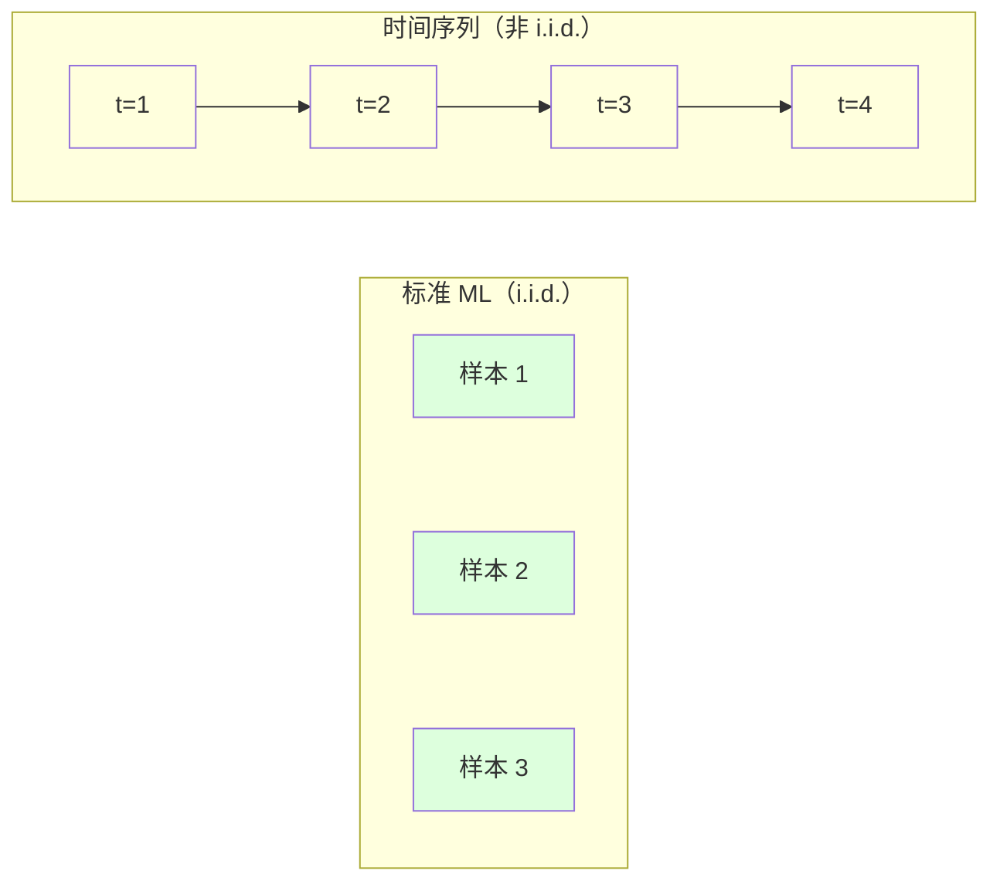
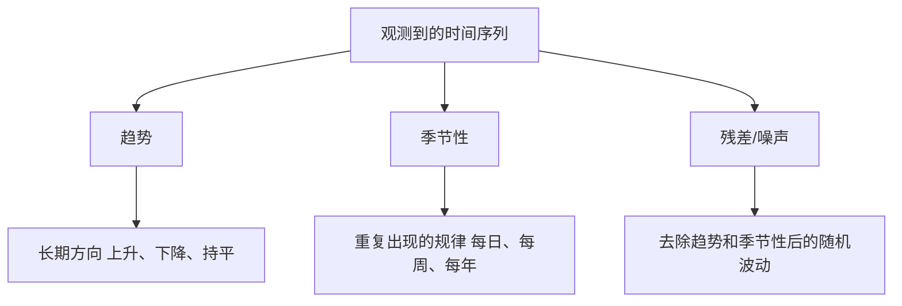
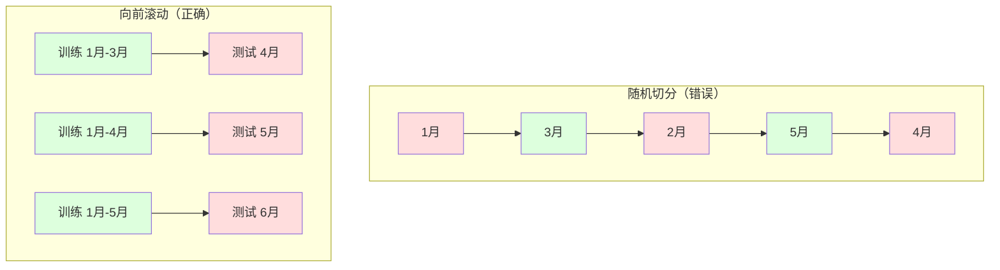

# 时间序列基础（Time Series Fundamentals）

> 译注：本文译自同目录 [`en.md`](./en.md)。术语遵循仓根 [TRANSLATION_GUIDE.md](../../../../TRANSLATION_GUIDE.md)。

> 过去的表现确实能预测未来——前提是你先检查过 stationarity（平稳性）。

**Type:** Build
**Language:** Python
**Prerequisites:** Phase 2, Lessons 01-09
**Time:** ~90 minutes

## 学习目标（Learning Objectives）

- 把一段时间序列分解为 trend（趋势）、seasonality（季节性）和 residual（残差）三部分，并检验 stationarity
- 用 lag features（滞后特征）和 rolling statistics（滚动统计量）把时间序列转化为有监督学习问题
- 搭建一个 walk-forward validation（前向滚动验证）框架，避免未来数据泄漏到训练集
- 解释为什么随机 train/test split 在时间序列里是无效的，并通过实验展示它与正确的时间切分之间的性能落差

## 问题（The Problem）

你手上有一份按时间排序的数据。每日销量、每小时气温、每分钟 CPU 占用、每周股价。你想预测下一个值、下一周、下一个季度。

你顺手掏出标准 ML 工具箱：随机 train/test split、cross-validation、丢一个特征矩阵进去、拿预测出来。每一步都是错的。

时间序列打破了标准 ML 所依赖的假设。样本之间不独立——今天的气温取决于昨天。随机切分会把未来信息泄漏到过去。回测里看着很美的特征上线就崩，因为它们依赖的模式会随时间漂移。

一个用随机 cross-validation 评估出 95% 准确率的模型，在正确的基于时间的评估下可能只有 55%。这个差距不是细节问题，而是「在纸上能跑」和「在生产能跑」的本质差别。

本课覆盖最基础的内容：时间数据到底特殊在哪里、如何诚实地评估模型、以及如何把一段时间序列转化成普通 ML 模型能消化的特征。

## 概念（The Concept）

### 时间序列特殊在哪里（What Makes Time Series Different）

标准 ML 假设 i.i.d.——独立同分布。每个样本独立地从同一分布里抽出来。时间序列两条都违反：

- **不独立。** 今天的股价依赖昨天。这周的销量和上周相关。
- **不同分布。** 分布会随时间漂移。12 月的销量和 3 月的销量长得不一样。

这两条违反并不是小事。它们改变了你怎么造特征、怎么评估模型、以及哪些算法能用。



在标准 ML 里，样本可以互换。打乱顺序什么都不变。在时间序列里，顺序就是一切。打乱就是毁掉信号。

### 时间序列的组成（Components of a Time Series）

任何时间序列都是几部分的叠加：



- **Trend（趋势）**：长期方向。营收每年增长 10%。全球气温在升高。
- **Seasonality（季节性）**：固定间隔重复的模式。零售销量在 12 月飙升。空调用电量在 7 月达到高峰。
- **Residual（残差）**：去掉趋势和季节性之后剩下的。如果残差看起来像白噪声，那么分解就抓住了主要信号。

### 平稳性（Stationarity）

如果一段时间序列的统计性质（均值、方差、自相关）不随时间变化，那么它是 stationary（平稳）的。大多数预测方法都假设 stationarity。

**为什么重要：** 一个非平稳序列的均值会漂移。在 1 月数据上训练的模型学到的均值，和 2 月即将出现的值不一样。它会系统性地偏掉。

**怎么检查：** 在窗口上算 rolling mean（滚动均值）和 rolling std（滚动标准差）。如果它们在漂移，序列就是非平稳的。

**怎么修：** Differencing（差分）。不要直接建模原始值，而是对相邻值的变化建模：

```
diff[t] = value[t] - value[t-1]
```

如果一阶差分还没让序列平稳，就再来一轮（二阶差分）。大多数现实数据最多两轮就够了。

**例子：**

原始序列：[100, 102, 106, 112, 120]
一阶差分：[2, 4, 6, 8]（仍在向上）
二阶差分：[2, 2, 2]（常数——平稳）

原始序列有一个二次趋势。一阶差分把它变成线性趋势，二阶差分让它变平。实践中很少需要超过两轮。

**正式检验：** Augmented Dickey-Fuller（ADF）检验是检验 stationarity 的标准统计检验。原假设是「序列非平稳」。p 值小于 0.05 就可以拒绝原假设、判定平稳。我们不会从零实现 ADF（它需要渐近分布表），但代码里基于 rolling 统计量的方法能给出一个实用的可视化检查。

### 自相关（Autocorrelation）

Autocorrelation（自相关）衡量的是时刻 t 的值与时刻 t-k（往前 k 步）的值之间的相关性。autocorrelation function（自相关函数，ACF）就是把这个相关性画成关于 lag k 的曲线。

**ACF 告诉你：**
- 序列的「记忆有多长」。如果 ACF 在 lag 5 之后就掉到 0，那么 5 步之前的值就无关紧要。
- 是否存在 seasonality。如果 ACF 在 lag 12（月度数据）出现尖峰，说明存在年度 seasonality。
- 应该造多少个 lag features。用到 ACF 变得可忽略的 lag 为止。

**PACF（Partial Autocorrelation Function，偏自相关函数）** 会去掉间接相关。如果今天和 3 天前相关只是因为它俩都和昨天相关，那么 PACF 在 lag 3 处会是 0，而 ACF 在 lag 3 处不会。

### Lag 特征：把时间序列变成有监督学习（Lag Features: Turning Time Series into Supervised Learning）

标准 ML 模型需要一个特征矩阵 X 和一个目标 y。时间序列只给了你一列值。两者之间的桥梁就是 lag features。

把序列 [10, 12, 14, 13, 15] 造成 lag-1 和 lag-2 特征：

| lag_2 | lag_1 | target |
|-------|-------|--------|
| 10    | 12    | 14     |
| 12    | 14    | 13     |
| 14    | 13    | 15     |

现在你有了一个标准回归问题。任何 ML 模型（linear regression、random forest、gradient boosting）都能从 lag 预测 target。

可以再造的特征：
- **Rolling statistics（滚动统计量）：** 最近 k 个值的均值、std、最小、最大
- **Calendar features（日历特征）：** 星期几、月份、is_holiday、is_weekend
- **Differenced values（差分值）：** 与上一步的变化
- **Expanding statistics（累计统计量）：** 累计均值、累计求和
- **Ratio features（比率特征）：** 当前值 / rolling mean（离最近平均值多远）
- **Interaction features（交互特征）：** lag_1 * day_of_week（动量在不同工作日的差异）

**该取多少个 lag？** 用 autocorrelation function。如果 ACF 在 lag 10 之内显著，至少用 10 个 lag。如果有周度 seasonality，加上 lag 7（甚至 14）。lag 越多，模型见到的历史越多，但要拟合的特征也越多，过拟合的风险也变大。

**目标对齐陷阱。** 造 lag features 时，target 必须是时刻 t 的值，所有特征都必须使用 t-1 或更早的值。如果你不小心把时刻 t 的值也作为特征塞进去，你就拿到一个完美预测器——和一个毫无用处的模型。这是时间序列特征工程里最常见的 bug。

### 前向滚动验证（Walk-Forward Validation）

这是本课最重要的概念。标准 k-fold cross-validation 把样本随机分到训练集和测试集。对时间序列来说，这就泄漏了未来信息。



Walk-forward validation 的步骤：
1. 用截止到时刻 t 的数据训练
2. 预测时刻 t+1（多步则预测 t+1 到 t+k）
3. 把窗口往前滑
4. 重复

每个测试 fold 都只包含训练数据之后的内容。没有未来泄漏。这给你一个关于「上线后表现如何」的诚实估计。

**Expanding window（扩展窗口）** 用所有历史数据训练（窗口越来越大）。**Sliding window（滑动窗口）** 用一个固定大小的训练窗口（窗口在滑）。如果你认为旧数据仍然相关，用 expanding；如果世界在变、旧数据反而有害，用 sliding。

### ARIMA 直觉（ARIMA Intuition）

ARIMA 是经典的时间序列模型，由三部分组成：

- **AR（Autoregressive，自回归）：** 用过去的值预测。AR(p) 用最近 p 个值。
- **I（Integrated，差分整合）：** 用 differencing 让序列平稳。I(d) 表示做 d 轮差分。
- **MA（Moving Average，移动平均）：** 用过去的预测误差去预测。MA(q) 用最近 q 个误差。

ARIMA(p, d, q) 把三者合在一起。p、d、q 由 ACF/PACF 分析或自动搜索（auto-ARIMA）来选。

我们不会从零实现 ARIMA——它需要的数值优化超出了本课范围。关键在于理解每个部分干了什么，从而能解读 ARIMA 的结果，知道什么时候该用它。

### 什么场景用什么（When to Use What）

| 方法 | 最适合 | 处理 seasonality | 处理外部特征 |
|----------|---------|-------------------|------------------------|
| Lag features + ML | 表格数据 + 大量外部特征 | 通过 calendar features | 是 |
| ARIMA | 单变量序列、短期预测 | SARIMA 变体 | 否（ARIMAX 有限支持） |
| Exponential smoothing（指数平滑） | 简单的趋势 + seasonality | 是（Holt-Winters） | 否 |
| Prophet | 业务预测、节假日 | 是（Fourier terms） | 有限 |
| 神经网络（LSTM、Transformer） | 长序列、多条序列 | 学习得到 | 是 |

对大多数实际问题，**lag features + gradient boosting 是最强的起点**。它天然支持外部特征，不要求 stationarity，调试起来也方便。

### 预测时长与策略（Forecasting Horizons and Strategies）

单步预测（single-step）预测往后一步。多步预测（multi-step）预测多步。有三种策略：

**Recursive（递推 / iterated）：** 预测一步，把这个预测当作下一步的输入。简单，但误差会累积——每次预测都用到上一次预测，错误会复合放大。

**Direct（直接）：** 给每个 horizon 训一个独立的模型。Model-1 预测 t+1，Model-5 预测 t+5。没有误差累积，但每个模型的训练样本更少，模型之间也不共享信息。

**Multi-output（多输出）：** 训一个模型同时输出所有 horizon。能在 horizon 之间共享信息，但需要支持多输出的模型（或者自定义 loss）。

实际中通常这样起步：短 horizon（1–5 步）用 recursive，长 horizon 用 direct。

### 时间序列里的常见错误（Common Mistakes in Time Series）

| 错误 | 为什么会发生 | 怎么修 |
|---------|---------------|-----------|
| 随机 train/test split | 标准 ML 的肌肉记忆 | 用 walk-forward 或时间切分 |
| 用了未来特征 | 不小心混进了时刻 t 的特征 | 审查每一个特征的时间对齐 |
| 过拟合 seasonality | 模型死记硬背日历模式 | 测试集留出至少一个完整的季节周期 |
| 忽视尺度变化 | 营收翻倍但模式不变 | 用百分比变化而不是绝对值建模 |
| lag 特征过多 | 「历史越多越好」 | 用 ACF 决定相关 lag |
| 不做 differencing | 「模型自己能搞定」 | 树模型能处理趋势；线性模型需要 stationarity |

## 动手实现（Build It）

`code/time_series.py` 里的代码从零实现了核心积木。

### Lag 特征生成器（Lag Feature Creator）

```python
def make_lag_features(series, n_lags):
    n = len(series)
    X = np.full((n, n_lags), np.nan)
    for lag in range(1, n_lags + 1):
        X[lag:, lag - 1] = series[:-lag]
    valid = ~np.isnan(X).any(axis=1)
    return X[valid], series[valid]
```

它把一维序列转成一个特征矩阵：每行的特征是最近 `n_lags` 个值，target 是当前值。

### 前向滚动交叉验证（Walk-Forward Cross-Validation）

```python
def walk_forward_split(n_samples, n_splits=5, min_train=50):
    assert min_train < n_samples, "min_train must be less than n_samples"
    step = max(1, (n_samples - min_train) // n_splits)
    for i in range(n_splits):
        train_end = min_train + i * step
        test_end = min(train_end + step, n_samples)
        if train_end >= n_samples:
            break
        yield slice(0, train_end), slice(train_end, test_end)
```

每个切分都保证训练数据严格在测试数据之前。训练窗口随每个 fold 扩张。

### 简单自回归模型（Simple Autoregressive Model）

纯 AR 模型其实就是在 lag features 上做的 linear regression：

```python
class SimpleAR:
    def __init__(self, n_lags=5):
        self.n_lags = n_lags
        self.weights = None
        self.bias = None

    def fit(self, series):
        X, y = make_lag_features(series, self.n_lags)
        # Solve via normal equations
        X_b = np.column_stack([np.ones(len(X)), X])
        theta = np.linalg.lstsq(X_b, y, rcond=None)[0]
        self.bias = theta[0]
        self.weights = theta[1:]
        return self
```

这在概念上和 Lesson 02 的 linear regression 是同一回事，只是把它套到同一个变量在不同时间滞后版本上。

### 平稳性检查（Stationarity Check）

代码用 rolling 统计量从可视化和数值两方面评估 stationarity：

```python
def check_stationarity(series, window=50):
    rolling_mean = np.array([
        series[max(0, i - window):i].mean()
        for i in range(1, len(series) + 1)
    ])
    rolling_std = np.array([
        series[max(0, i - window):i].std()
        for i in range(1, len(series) + 1)
    ])
    return rolling_mean, rolling_std
```

如果 rolling mean 漂移，或者 rolling std 在变，序列就是非平稳的。做差分再查一遍。

代码还会通过比较序列前半段和后半段来检查 stationarity。如果均值差距超过半个标准差、或者方差比超过 2 倍，就把序列标记为非平稳。

### 自相关（Autocorrelation）

```python
def autocorrelation(series, max_lag=20):
    n = len(series)
    mean = series.mean()
    var = series.var()
    acf = np.zeros(max_lag + 1)
    for k in range(max_lag + 1):
        cov = np.mean((series[:n-k] - mean) * (series[k:] - mean))
        acf[k] = cov / var if var > 0 else 0
    return acf
```

## 用起来（Use It）

用 sklearn 的话，把 lag features 直接喂给任意回归器：

```python
from sklearn.linear_model import Ridge
from sklearn.ensemble import GradientBoostingRegressor

X, y = make_lag_features(series, n_lags=10)

for train_idx, test_idx in walk_forward_split(len(X)):
    model = Ridge(alpha=1.0)
    model.fit(X[train_idx], y[train_idx])
    predictions = model.predict(X[test_idx])
```

要 ARIMA 就用 statsmodels：

```python
from statsmodels.tsa.arima.model import ARIMA

model = ARIMA(train_series, order=(5, 1, 2))
fitted = model.fit()
forecast = fitted.forecast(steps=30)
```

`time_series.py` 同时演示了这两种做法，并用 walk-forward validation 对它们做对比。

### sklearn TimeSeriesSplit

sklearn 提供 `TimeSeriesSplit`，它就是 walk-forward validation 的实现：

```python
from sklearn.model_selection import TimeSeriesSplit

tscv = TimeSeriesSplit(n_splits=5)
for train_index, test_index in tscv.split(X):
    X_train, X_test = X[train_index], X[test_index]
    y_train, y_test = y[train_index], y[test_index]
    model.fit(X_train, y_train)
    score = model.score(X_test, y_test)
```

它和我们从零实现的 `walk_forward_split` 是等价的，只不过集成进了 sklearn 的 cross-validation 框架，可以直接配 `cross_val_score` 用：

```python
from sklearn.model_selection import cross_val_score

scores = cross_val_score(model, X, y, cv=TimeSeriesSplit(n_splits=5))
print(f"Mean score: {scores.mean():.4f} +/- {scores.std():.4f}")
```

### 评估指标（Evaluation Metrics）

时间序列预测用的就是回归指标，但要带上时间感：

- **MAE（Mean Absolute Error，平均绝对误差）：** |y_true - y_pred| 的平均。可以用原始单位直接解释：「平均预测偏差 3.2 度。」
- **RMSE（Root Mean Squared Error，均方根误差）：** 均方误差的开方。比 MAE 更惩罚大误差。当「一次大错」比「多次小错」更糟时用它。
- **MAPE（Mean Absolute Percentage Error，平均绝对百分比误差）：** |error / true_value| * 100 的平均。与尺度无关，方便跨不同序列对比。但真实值为 0 时无定义。
- **朴素基线对比（Naive baseline comparison）：** 永远要和简单基线比较。seasonal naive 基线就是直接预测「上一个周期」的值（昨天、上周）。如果你的模型连 naive 都打不过，那一定是哪里出了问题。

### 滚动特征（Rolling Features）

代码示范了如何把 rolling 统计量（窗口 7 和 14 天的均值、std、最小、最大）加到 lag features 上。这些特征能告诉模型最近的趋势和波动信息，而光靠 lag features 是抓不到的。

举例来说，如果 rolling mean 在上升，说明有上行趋势；如果 rolling std 在变大，说明波动在加剧。这些是树模型能学到、而线性模型学不到的模式。

## 上线部署（Ship It）

本课产出：
- `outputs/prompt-time-series-advisor.md`——一份用于框定时间序列问题的 prompt
- `code/time_series.py`——lag features、walk-forward validation、AR 模型、stationarity 检查

### 你必须打过的基线（Baselines You Must Beat）

建任何模型之前，先建立基线：

1. **Last value（持续法 / persistence）。** 预测明天等于今天。对许多序列来说，这意外地难打过。
2. **Seasonal naive（季节性朴素法）。** 预测今天等于上周（或去年）同一天。如果你的模型连这个都打不过，说明它除了 seasonality 之外什么有用的模式都没学到。
3. **Moving average（移动平均）。** 预测最近 k 个值的平均。能平滑噪声但抓不住突变。

如果你花哨的 ML 模型输给了 seasonal naive 基线，那一定有 bug。最常见的几种：特征里的未来泄漏、错误的评估方法、或者序列本身就是真的随机不可预测。

### 实战提示（Practical Tips）

1. **先画图。** 在做任何建模之前先把原始序列画出来。看趋势、seasonality、离群点、结构性断点（行为突变）。30 秒的肉眼检查往往比一小时的自动分析告诉你的还多。

2. **先 differencing，再建模。** 如果序列有明显趋势，先做差分再造 lag features。树模型能处理趋势，但线性模型不行——而且差分从来不会更糟。

3. **测试集至少留出一个完整的季节周期。** 如果有周度 seasonality，测试集至少要一整周；月度的就要一整月。否则你根本无法判断模型是否抓到了季节模式。

4. **生产中要监控。** 时间序列模型会随世界变化而退化。基于滚动窗口跟踪预测误差。误差开始上升时，就用近期数据重训。

5. **小心 regime change（机制变化）。** 在疫情前数据上训的模型，预测不了疫情后的行为。把已知 regime change 的指示变量塞成特征，或者用 sliding window 让模型忘掉旧数据。

6. **对偏态序列做 log 变换。** 营收、价格、计数往往是右偏的。取 log 能稳定方差，把乘性模式变成加性的——线性模型才搞得定。在 log 空间预测，再 exp 回去拿原始单位。

## 练习（Exercises）

1. **Stationarity 实验。** 生成一段带线性趋势的序列。用 rolling 统计量检查 stationarity。做一阶 differencing。再查一遍。对二次趋势，要做几轮差分？

2. **Lag 选择。** 在一段周期为 7 的季节性序列上算 ACF。哪些 lag 自相关最大？只用这些 lag（不要连续 lag）造 lag features。和用 lag 1 到 7 比，准确率有提升吗？

3. **Walk-forward vs 随机切分。** 在 lag features 上训一个 Ridge regression。分别用随机 80/20 split 和 walk-forward validation 评估。随机切分把性能高估了多少？

4. **特征工程。** 在 lag features 之上加 rolling mean（窗口 7）、rolling std（窗口 7）和 day-of-week 特征。用 walk-forward validation 比较加与不加这些特征的准确率。

5. **多步预测。** 改造 AR 模型，让它一次预测 5 步而不是 1 步。比较两种策略：(a) 预测一步，把预测当作下一步的输入（recursive）；(b) 给每个 horizon 训一个独立模型（direct）。哪种更准？

## 关键术语（Key Terms）

| 术语 | 大家口头说的 | 实际指什么 |
|------|----------------|----------------------|
| Stationarity（平稳性） | 「统计性质不随时间变」 | 均值、方差、自相关结构都不随时间变化的序列 |
| Differencing（差分） | 「相邻值相减」 | 计算 y[t] - y[t-1]，用于去除趋势、达到平稳 |
| Autocorrelation（自相关，ACF） | 「序列和自己的相关性」 | 时间序列与自身滞后版本之间的相关性，作为 lag 的函数 |
| Partial autocorrelation（偏自相关，PACF） | 「只看直接相关」 | 在 lag k 处，去掉所有更短 lag 的影响后剩下的自相关 |
| Lag features（滞后特征） | 「拿过去的值当输入」 | 用 y[t-1], y[t-2], ..., y[t-k] 作为特征预测 y[t] |
| Walk-forward validation（前向滚动验证） | 「尊重时间的 cross-validation」 | 训练数据时间上始终先于测试数据的评估方式 |
| ARIMA | 「经典时间序列模型」 | AutoRegressive Integrated Moving Average：合并过去值（AR）、差分（I）、过去误差（MA） |
| Seasonality（季节性） | 「重复的日历模式」 | 时间序列中与日历周期（日/周/年）相绑定的、有规律可预测的循环 |
| Trend（趋势） | 「长期方向」 | 序列水平随时间持续上升或下降 |
| Expanding window（扩展窗口） | 「用全部历史」 | 训练集随每个 fold 增长的 walk-forward validation |
| Sliding window（滑动窗口） | 「固定长度历史」 | 训练集是一个向前滑动的固定长度窗口的 walk-forward validation |

## 延伸阅读（Further Reading）

- [Hyndman and Athanasopoulos, Forecasting: Principles and Practice (3rd ed.)](https://otexts.com/fpp3/) —— 最好的免费时间序列预测教材
- [scikit-learn Time Series Split](https://scikit-learn.org/stable/modules/generated/sklearn.model_selection.TimeSeriesSplit.html) —— sklearn 的 walk-forward 切分器
- [statsmodels ARIMA docs](https://www.statsmodels.org/stable/generated/statsmodels.tsa.arima.model.ARIMA.html) —— ARIMA 实现及其诊断工具
- [Makridakis et al., The M5 Competition (2022)](https://www.sciencedirect.com/science/article/pii/S0169207021001874) —— 大规模预测竞赛，对比 ML 方法和统计方法
