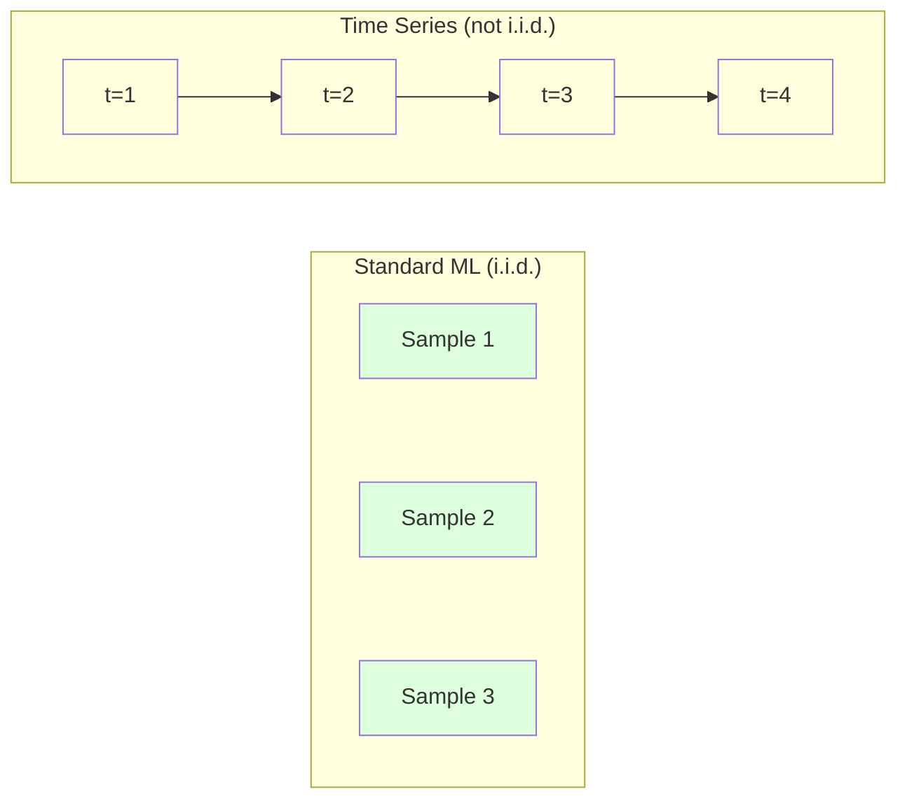
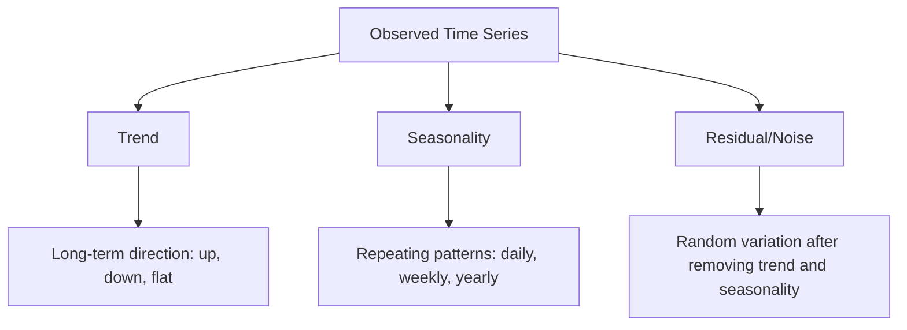
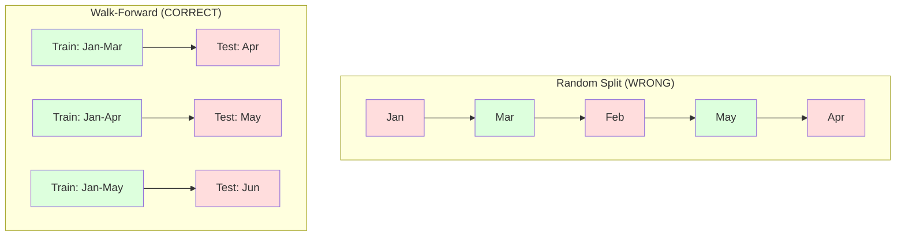

# 15 · 时间序列基础

> 过去的表现确实能预测未来的结果——前提是你先检验了平稳性。

**类型：** 实践构建
**语言：** Python
**前置：** 第二阶段，第 01-09 课
**时长：** 约 90 分钟

## 学习目标

- 将一条时间序列分解为趋势、季节性与残差三个分量，并检验其平稳性
- 实现滞后特征（lag features）与滚动统计量（rolling statistics），把时间序列转化为有监督学习问题
- 构建一套前向滚动验证（walk-forward validation）框架，防止未来数据泄漏到训练中
- 解释为什么随机 train/test 划分对时间序列无效，并演示其相对于正确时序划分的性能差距

## 问题所在

你手头有一批按时间排序的数据：每日销售额、每小时温度、每分钟 CPU 使用率、每周股价。你想预测下一个值、下一周、下一季度。

于是你拿出标准的 ML 工具箱：随机 train/test 划分、交叉验证、特征矩阵进、预测出。每一步都是错的。

时间序列打破了标准 ML 所依赖的假设。样本之间并不独立——今天的温度依赖于昨天的。随机划分会把未来信息泄漏到过去。那些在回测中表现亮眼的特征，到了生产环境却失效，因为它们依赖的模式会随时间漂移。

一个在随机交叉验证下能拿到 95% 准确率的模型，在正确的基于时间的评估下可能只有 55%。这种差距并非技术细节上的小问题。它是「纸面上能跑」的模型与「生产中真能用」的模型之间的本质区别。

本课覆盖这些基础：是什么让时间数据与众不同、如何诚实地评估模型，以及如何把时间序列转化为标准 ML 模型能消费的特征。

## 核心概念

### 时间序列为什么不一样

标准 ML 假设数据是 i.i.d.——独立同分布（independent and identically distributed）。每个样本都从同一分布中独立抽取，与其他样本无关。时间序列同时违反了这两条：

- **不独立。** 今天的股价依赖于昨天的。本周的销售额与上周相关。
- **不同分布。** 分布会随时间漂移。十二月的销售额与三月的看起来完全不同。

这些违反并非无关紧要。它们改变了你构建特征的方式、评估模型的方式，以及哪些算法能奏效。



在标准 ML 中，样本可以互换。打乱它们不会改变任何东西。在时间序列中，顺序就是一切。打乱顺序会摧毁信号。

### 时间序列的组成分量

每一条时间序列都是若干分量的组合：



- **趋势（Trend）**：长期方向。营收每年增长 10%。全球气温上升。
- **季节性（Seasonality）**：以固定间隔重复出现的模式。零售销售额在十二月飙升。空调用量在七月达到峰值。
- **残差（Residual）**：去掉趋势和季节性之后剩下的部分。如果残差看起来像白噪声，说明分解已经捕捉到了信号。

### 平稳性

如果一条时间序列的统计性质（均值、方差、自相关）不随时间变化，那么它就是平稳的（stationary）。大多数预测方法都假设平稳性。

**为什么重要：** 非平稳序列的均值会漂移。一个用一月数据训练的模型，学到的均值与二月将要呈现的均值不同。它会系统性地出错。

**如何检验：** 在窗口上计算滚动均值和滚动标准差。如果它们发生漂移，则序列非平稳。

**如何修正：** 差分（differencing）。不去建模原始值，而是建模相邻两个值之间的变化：

```
diff[t] = value[t] - value[t-1]
```

如果一轮差分还不能让序列平稳，就再做一次（二阶差分）。大多数真实世界的序列最多只需要两轮。

**示例：**

原始序列：[100, 102, 106, 112, 120]
一阶差分：[2, 4, 6, 8]（仍在向上趋势）
二阶差分：[2, 2, 2]（恒定——平稳）

原始序列带有二次趋势。一阶差分把它变成了线性趋势。二阶差分把它压平了。实践中，你很少需要超过两轮。

**正式检验：** 增广迪基-富勒检验（Augmented Dickey-Fuller，ADF）是检验平稳性的标准统计检验。其原假设是「序列非平稳」。p 值低于 0.05 意味着你可以拒绝原假设，得出序列平稳的结论。我们不会从零实现 ADF（它需要渐近分布表），但我们代码中的滚动统计量方法提供了一种实用的可视化检查。

### 自相关

自相关（autocorrelation）衡量时刻 t 的值与时刻 t-k 的值（过去 k 步）之间的相关程度。自相关函数（ACF）会针对每个滞后阶 k 绘制出这一相关性。

**ACF 能告诉你：**
- 序列能「记住」多远。如果 ACF 在滞后 5 之后降到零，那么 5 步以前的值就无关紧要了。
- 是否存在季节性。如果 ACF 在滞后 12 处出现尖峰（月度数据），则存在年度季节性。
- 该创建多少个滞后特征。使用的滞后阶应一直到 ACF 变得可忽略为止。

**PACF（偏自相关函数，Partial Autocorrelation Function）** 会移除间接相关。如果今天与三天前相关仅仅是因为两者都与昨天相关，那么滞后 3 处的 PACF 将为零，而滞后 3 处的 ACF 则不为零。

### 滞后特征：把时间序列变成有监督学习

标准 ML 模型需要一个特征矩阵 X 和一个目标 y。时间序列给你的只是单独一列数值。两者之间的桥梁就是滞后特征。

取序列 [10, 12, 14, 13, 15]，创建 lag-1 和 lag-2 特征：

| lag_2 | lag_1 | target |
|-------|-------|--------|
| 10    | 12    | 14     |
| 12    | 14    | 13     |
| 14    | 13    | 15     |

现在你就有了一个标准的回归问题。任何 ML 模型（线性回归、随机森林、梯度提升）都能从滞后值预测目标。

你还可以工程化构造其他特征：
- **滚动统计量：** 最近 k 个值的 mean、std、min、max
- **日历特征：** 星期几、月份、is_holiday、is_weekend
- **差分值：** 相对上一步的变化
- **扩展统计量：** 累计均值、累计求和
- **比率特征：** 当前值 / 滚动均值（距离近期平均水平有多远）
- **交互特征：** lag_1 * day_of_week（工作日对动量的影响）

**用多少个滞后阶？** 用自相关函数判断。如果 ACF 一直显著到滞后 10，那就用至少 10 个滞后阶。如果存在周度季节性，就把滞后 7（可能还有 14）包含进来。更多的滞后阶给模型更多历史信息，但也意味着要拟合更多特征，从而增大过拟合风险。

**目标对齐陷阱。** 在创建滞后特征时，目标必须是时刻 t 的值，而所有特征都必须使用时刻 t-1 或更早的值。如果你不小心把时刻 t 的值当成了特征，你就得到了一个完美的预测器——同时也是一个毫无用处的模型。这是时间序列特征工程中最常见的 bug。

### 前向滚动验证

这是本课最重要的概念。标准的 k 折交叉验证会把样本随机分配到训练集和测试集。对时间序列而言，这会泄漏未来信息。



前向滚动验证：
1. 用截至时刻 t 的数据训练
2. 在时刻 t+1 上预测（多步预测则为 t+1 到 t+k）
3. 把窗口向前滑动
4. 重复

每个测试折只包含位于所有训练数据之后的数据。没有未来泄漏。这能让你诚实地估计模型部署后的表现。

**扩展窗口（Expanding window）** 使用全部历史数据进行训练（窗口不断增长）。**滑动窗口（Sliding window）** 使用固定大小的训练窗口（窗口向前滑动）。当你认为旧数据仍然相关时，用扩展窗口。当世界发生变化、旧数据反而有害时，用滑动窗口。

### ARIMA 直觉

ARIMA 是经典的时间序列模型。它有三个组成部分：

- **AR（自回归，Autoregressive）：** 从过去的值进行预测。AR(p) 使用最近 p 个值。
- **I（差分，Integrated）：** 通过差分达到平稳性。I(d) 应用 d 轮差分。
- **MA（移动平均，Moving Average）：** 从过去的预测误差进行预测。MA(q) 使用最近 q 个误差。

ARIMA(p, d, q) 将三者结合起来。你可以基于 ACF/PACF 分析或自动化搜索（auto-ARIMA）来选择 p、d、q。

我们不会从零实现 ARIMA——它需要的数值优化超出了本课范围。关键在于理解每个组件的作用，这样你才能解读 ARIMA 的结果，并知道何时该用它。

### 何时用何种方法

| 方法 | 最适用于 | 处理季节性 | 处理外部特征 |
|----------|---------|-------------------|------------------------|
| 滞后特征 + ML | 带有许多外部特征的表格数据 | 借助日历特征可以 | 可以 |
| ARIMA | 单一单变量序列、短期 | SARIMA 变体 | 不能（ARIMAX 可做有限处理） |
| 指数平滑 | 简单的趋势 + 季节性 | 可以（Holt-Winters） | 不能 |
| Prophet | 业务预测、节假日 | 可以（傅里叶项） | 有限 |
| 神经网络（LSTM、Transformer） | 长序列、多序列 | 自动学习 | 可以 |

对大多数实际问题来说，滞后特征 + 梯度提升是最强的起点。它能自然地处理外部特征，不要求平稳性，且易于调试。

### 预测视野与策略

单步预测（Single-step forecasting）预测向前一个时间步。多步预测（Multi-step forecasting）预测多个时间步。共有三种策略：

**递归式（迭代式，Recursive/iterated）：** 预测向前一步，再把这个预测当作下一步的输入。简单，但误差会累积——每个预测都用到上一个预测，于是错误层层叠加。

**直接式（Direct）：** 为每个视野训练一个独立的模型。Model-1 预测 t+1，Model-5 预测 t+5。没有误差累积，但每个模型的训练样本更少，且彼此不共享信息。

**多输出（Multi-output）：** 训练一个同时输出所有视野的模型。能在各视野间共享信息，但需要一个支持多输出的模型（或一个自定义损失函数）。

对大多数实际问题来说，短视野（1-5 步）从递归式起步，长视野则用直接式。

### 时间序列中的常见错误

| 错误 | 为什么会发生 | 如何修正 |
|---------|---------------|-----------|
| 随机 train/test 划分 | 标准 ML 的习惯 | 使用前向滚动或时序划分 |
| 使用未来特征 | 不小心把时刻 t 的特征也用上了 | 审查每个特征的时间对齐 |
| 对季节性过拟合 | 模型死记硬背日历模式 | 在测试集中留出一个完整的季节周期 |
| 忽视尺度变化 | 营收翻倍但模式不变 | 建模百分比变化而非绝对值 |
| 滞后特征过多 | 「历史越多越好」 | 用 ACF 确定相关的滞后阶 |
| 不做差分 | 「模型自己会搞定的」 | 树模型能处理趋势；线性模型则需要平稳性 |

## 动手构建

`code/time_series.py` 中的代码从零实现了这些核心构件。

### 滞后特征构造器

```python
def make_lag_features(series, n_lags):
    n = len(series)
    X = np.full((n, n_lags), np.nan)
    for lag in range(1, n_lags + 1):
        X[lag:, lag - 1] = series[:-lag]
    valid = ~np.isnan(X).any(axis=1)
    return X[valid], series[valid]
```

它把一条一维序列转化为一个特征矩阵，其中每一行以最近的 `n_lags` 个值作为特征，以当前值作为目标。

### 前向滚动交叉验证

```python
def walk_forward_split(n_samples, n_splits=5, min_train=50):
    assert min_train < n_samples, "min_train must be less than n_samples"
    step = max(1, (n_samples - min_train) // n_splits)
    for i in range(n_splits):
        train_end = min_train + i * step
        test_end = min(train_end + step, n_samples)
        if train_end >= n_samples:
            break
        yield slice(0, train_end), slice(train_end, test_end)
```

每一次划分都确保训练数据严格位于测试数据之前。训练窗口随每一折扩展。

### 简单自回归模型

一个纯 AR 模型其实就是在滞后特征上做线性回归：

```python
class SimpleAR:
    def __init__(self, n_lags=5):
        self.n_lags = n_lags
        self.weights = None
        self.bias = None

    def fit(self, series):
        X, y = make_lag_features(series, self.n_lags)
        # 通过正规方程求解
        X_b = np.column_stack([np.ones(len(X)), X])
        theta = np.linalg.lstsq(X_b, y, rcond=None)[0]
        self.bias = theta[0]
        self.weights = theta[1:]
        return self
```

这在概念上与第 02 课的线性回归完全相同，只不过应用在了同一变量的时间滞后版本上。

### 平稳性检查

代码通过计算滚动统计量，从可视化和数值两方面评估平稳性：

```python
def check_stationarity(series, window=50):
    rolling_mean = np.array([
        series[max(0, i - window):i].mean()
        for i in range(1, len(series) + 1)
    ])
    rolling_std = np.array([
        series[max(0, i - window):i].std()
        for i in range(1, len(series) + 1)
    ])
    return rolling_mean, rolling_std
```

如果滚动均值漂移或滚动标准差变化，则序列非平稳。做差分后再检查一次。

代码还会通过比较序列的前半段与后半段来检查平稳性。如果两段的均值相差超过半个标准差，或方差比超过 2 倍，序列就会被标记为非平稳。

### 自相关

```python
def autocorrelation(series, max_lag=20):
    n = len(series)
    mean = series.mean()
    var = series.var()
    acf = np.zeros(max_lag + 1)
    for k in range(max_lag + 1):
        cov = np.mean((series[:n-k] - mean) * (series[k:] - mean))
        acf[k] = cov / var if var > 0 else 0
    return acf
```

## 实际使用

在 sklearn 中，你可以把滞后特征直接配合任意回归器使用：

```python
from sklearn.linear_model import Ridge
from sklearn.ensemble import GradientBoostingRegressor

X, y = make_lag_features(series, n_lags=10)

for train_idx, test_idx in walk_forward_split(len(X)):
    model = Ridge(alpha=1.0)
    model.fit(X[train_idx], y[train_idx])
    predictions = model.predict(X[test_idx])
```

至于 ARIMA，使用 statsmodels：

```python
from statsmodels.tsa.arima.model import ARIMA

model = ARIMA(train_series, order=(5, 1, 2))
fitted = model.fit()
forecast = fitted.forecast(steps=30)
```

`time_series.py` 中的代码演示了这两种方法，并用前向滚动验证对它们进行比较。

### sklearn TimeSeriesSplit

sklearn 提供了 `TimeSeriesSplit`，它实现了前向滚动验证：

```python
from sklearn.model_selection import TimeSeriesSplit

tscv = TimeSeriesSplit(n_splits=5)
for train_index, test_index in tscv.split(X):
    X_train, X_test = X[train_index], X[test_index]
    y_train, y_test = y[train_index], y[test_index]
    model.fit(X_train, y_train)
    score = model.score(X_test, y_test)
```

它等价于我们从零实现的 `walk_forward_split`，只是被整合进了 sklearn 的交叉验证框架。你可以把它和 `cross_val_score` 配合使用：

```python
from sklearn.model_selection import cross_val_score

scores = cross_val_score(model, X, y, cv=TimeSeriesSplit(n_splits=5))
print(f"Mean score: {scores.mean():.4f} +/- {scores.std():.4f}")
```

### 评估指标

时间序列预测使用回归指标，但带有时间感知的上下文：

- **MAE（平均绝对误差，Mean Absolute Error）：** |y_true - y_pred| 的平均值。以原始单位表达，易于解读。「平均而言，预测偏差为 3.2 度。」
- **RMSE（均方根误差，Root Mean Squared Error）：** 均方误差的平方根。相比 MAE 更重地惩罚大误差。当大误差比许多小误差更糟糕时使用。
- **MAPE（平均绝对百分比误差，Mean Absolute Percentage Error）：** |error / true_value| * 100 的平均值。与尺度无关，便于在不同序列间比较。但当真实值为零时无定义。
- **朴素基线对比：** 始终要与简单基线对比。季节性朴素基线（seasonal naive）预测一个周期之前的值（昨天、上周）。如果你的模型连朴素基线都打不过，那一定哪里出了问题。

### 滚动特征

代码演示了在滞后特征之上添加滚动统计量（在 7 天和 14 天窗口上的 mean、std、min、max）。它们向模型提供了近期趋势与波动性的信息，而这是单靠滞后特征无法捕捉的。

例如，如果滚动均值在上升，就暗示着一个向上趋势。如果滚动标准差在增大，就暗示着波动性在增长。这类模式是基于树的模型能够学习、而线性模型无法学习的。

## 交付上线

本课产出：
- `outputs/prompt-time-series-advisor.md`——一个用于界定时间序列问题的提示词
- `code/time_series.py`——滞后特征、前向滚动验证、AR 模型、平稳性检查

### 你必须打败的基线

在构建任何模型之前，先建立基线：

1. **上一个值（持续性，persistence）。** 预测明天与今天相同。对许多序列而言，这出人意料地难以打败。
2. **季节性朴素（Seasonal naive）。** 预测今天与上周同一天（或去年同一天）相同。如果你的模型连这个都打不过，说明它除了季节性以外没学到任何有用模式。
3. **移动平均（Moving average）。** 预测最近 k 个值的平均。能平滑噪声，但无法捕捉突变。

如果你那个花哨的 ML 模型输给了季节性朴素基线，那你就有 bug。最常见的原因是：特征中存在未来泄漏、评估方法错误，或者序列本身就是真随机、不可预测的。

### 实用技巧

1. **从画图开始。** 在做任何建模之前，先把原始序列画出来。寻找趋势、季节性、离群点、结构性断裂（行为的突然变化）。30 秒的肉眼检查往往比一小时的自动化分析告诉你更多。

2. **先差分，再建模。** 如果序列有明显趋势，在创建滞后特征前先对它差分。基于树的模型能处理趋势，但线性模型不能，而差分从不会带来坏处。

3. **至少留出一个完整的季节周期。** 如果存在周度季节性，你的测试集需要至少一个完整的星期。如果是月度的，则至少一个完整的月份。否则你无法评估模型是否捕捉到了季节性模式。

4. **在生产中持续监控。** 时间序列模型会随世界变化而逐渐退化。以滚动方式跟踪预测误差。当误差开始上升时，用近期数据重新训练模型。

5. **警惕机制变化（regime changes）。** 用疫情前数据训练的模型无法预测疫情后的行为。把已知机制变化的指示器作为特征纳入，或者使用一个会遗忘旧数据的滑动窗口。

6. **对偏斜序列做对数变换。** 营收、价格和计数往往右偏。取对数能稳定方差，并把乘性模式变成加性模式，从而让线性模型能够处理。在对数空间中预测，然后取指数还原到原始单位。

## 练习

1. **平稳性实验。** 生成一条带线性趋势的序列。用滚动统计量检验平稳性。应用一阶差分。再检验一次。对于二次趋势，需要多少轮差分？

2. **滞后阶选择。** 在一条季节性序列（period=7）上计算 ACF。哪些滞后阶的自相关最高？仅用这些滞后阶（而非连续的滞后阶）创建滞后特征。相比使用滞后 1 到 7，准确率有没有提升？

3. **前向滚动 vs 随机划分。** 在滞后特征上训练一个 Ridge 回归。分别用随机 80/20 划分和前向滚动验证进行评估。随机划分把性能高估了多少？

4. **特征工程。** 在滞后特征上添加滚动均值（window=7）、滚动标准差（window=7）和星期几特征。用前向滚动验证比较加上和不加上这些额外特征时的准确率。

5. **多步预测。** 修改 AR 模型，使其预测向前 5 步而非 1 步。比较两种策略：(a) 预测一步，再把预测当作下一步的输入（递归式），以及 (b) 为每个视野训练独立模型（直接式）。哪一种更准确？

## 关键术语

| 术语 | 人们怎么说 | 它实际指什么 |
|------|----------------|----------------------|
| 平稳性（Stationarity） | 「统计量不随时间变化」 | 一条均值、方差和自相关结构都随时间保持恒定的序列 |
| 差分（Differencing） | 「相邻值相减」 | 计算 y[t] - y[t-1] 以去除趋势、达到平稳性 |
| 自相关（ACF） | 「序列与自身的相关性」 | 时间序列与其滞后副本之间的相关性，作为滞后阶的函数 |
| 偏自相关（PACF） | 「只看直接相关」 | 在移除所有更短滞后阶影响后，滞后阶 k 处的自相关 |
| 滞后特征（Lag features） | 「把过去的值当输入」 | 用 y[t-1]、y[t-2]、……、y[t-k] 作为特征来预测 y[t] |
| 前向滚动验证（Walk-forward validation） | 「尊重时间的交叉验证」 | 训练数据在时间上始终先于测试数据的评估方式 |
| ARIMA | 「经典的时间序列模型」 | 自回归差分移动平均：结合过去的值（AR）、差分（I）和过去的误差（MA） |
| 季节性（Seasonality） | 「重复出现的日历模式」 | 时间序列中与日历周期（日、周、年）绑定的、规律且可预测的循环 |
| 趋势（Trend） | 「长期方向」 | 序列水平随时间持续上升或下降 |
| 扩展窗口（Expanding window） | 「使用全部历史」 | 训练集随每一折增长的前向滚动验证 |
| 滑动窗口（Sliding window） | 「固定大小的历史」 | 训练集是一个固定长度、向前滑动窗口的前向滚动验证 |

## 延伸阅读

- [Hyndman 与 Athanasopoulos，《Forecasting: Principles and Practice》（第 3 版）](https://otexts.com/fpp3/)——关于时间序列预测最好的免费教材
- [scikit-learn Time Series Split](https://scikit-learn.org/stable/modules/generated/sklearn.model_selection.TimeSeriesSplit.html)——sklearn 的前向滚动划分器
- [statsmodels ARIMA 文档](https://www.statsmodels.org/stable/generated/statsmodels.tsa.arima.model.ARIMA.html)——带诊断功能的 ARIMA 实现
- [Makridakis 等人，The M5 Competition（2022）](https://www.sciencedirect.com/science/article/pii/S0169207021001874)——展示 ML 方法与统计方法对比的大规模预测竞赛
