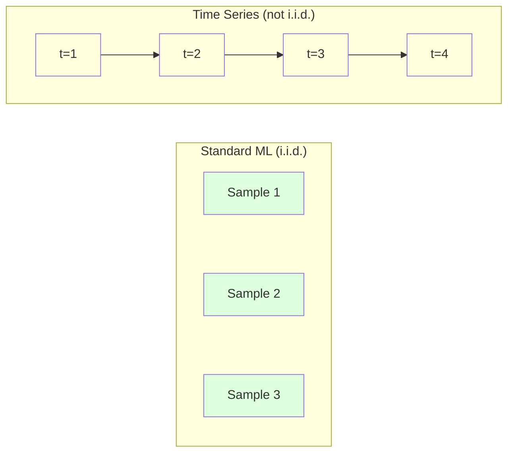
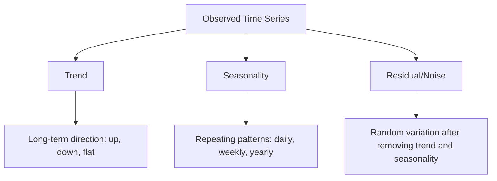
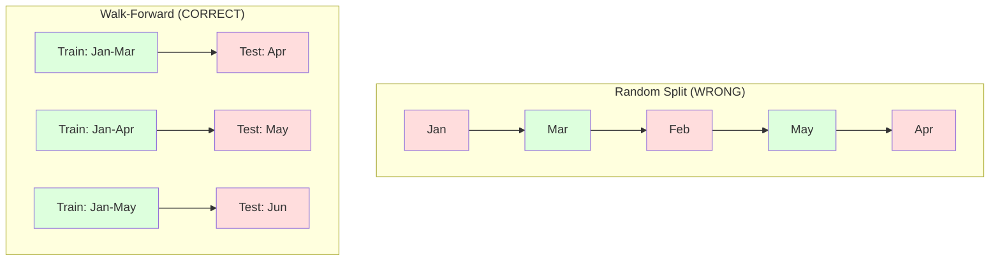

# 时间序列基础知识

> 过去的表现确实可以预测未来的结果--如果您首先检查稳定性的话。

** 类型：** 构建
** 语言：** Python
** 先决条件：** 第2阶段，课程01-09
** 时间：** ~90分钟

## 学习目标

- 将时间序列分解为趋势、季节性和剩余成分并测试平稳性
- 实施滞后功能和滚动统计，将时间序列转换为监督学习问题
- 构建一个前瞻性验证框架，防止未来数据泄露到培训中
- 解释为什么随机训练/测试拆分对于时间序列无效，并演示与适当时间拆分的性能差距

## 问题

您拥有按时间排序的数据。每日销售额、小时温度、每分钟中央处理器使用量、每周股价。您想要预测下一个值、下周、下一个季度。

您可以使用标准的ML工具包：随机训练/测试拆分、交叉验证、特征矩阵输入、预测输出。每一步都是错误的。

时间序列打破了标准ML所依赖的假设。样本并不是独立的--今天的温度取决于昨天的温度。随机分裂会将未来的信息泄露到过去。在回测中看起来很棒的功能在生产中失败，因为它们依赖于随时间变化的模式。

通过随机交叉验证获得95%准确性的模型通过适当的基于时间的评估可能会获得55%。区别不是技术问题。这是纸质模型和生产模型之间的区别。

本课涵盖了基础知识：是什么使时间数据不同，如何诚实地评估模型，以及如何将时间序列转换为标准ML模型可以使用的特征。

## 概念

### 是什么让时间序列与众不同

标准ML假设i.i.d. --独立且同分布。每个样本都从相同的分布中提取，独立于其他样本。时间序列违反了两者：

- ** 不独立。**今天的股价取决于昨天的。本周的销售额与上周的相关。
- ** 分布不相同。**分布会随着时间的推移而变化。12月的销售额与3月的销售额有所不同。

这些违规行为并不轻。它们改变了构建功能的方式、评估模型的方式以及哪些算法有效。



在标准ML中，样本是可以互换的。洗牌不会改变任何事情。在时间序列中，秩序就是一切。洗牌会破坏信号。

### 时间序列的组成部分

每个时间序列都是以下内容的组合：



- ** 趋势 **：长期方向。收入每年增长10%。全球气温上升。
- ** 季节性 **：以固定间隔重复模式。12月零售额激增。空调使用量在七月达到高峰。
- ** 剩余 **：去除趋势和季节性后剩下的内容。如果残余看起来像白噪音，分解就会捕获信号。

### 平稳性

如果时间序列的统计属性（均值、方差、自相关）不随时间变化，则时间序列是平稳的。大多数预测方法都假设平稳性。

** 为什么重要：** 非静止系列的平均值是漂移的。根据一月份的数据训练的模型学到了与二月份显示的不同的平均值。这将是系统性的错误。

** 如何检查：** 计算窗口上的滚动平均值和滚动标准差。如果它们漂移，则该系列是非平稳的。

** 如何修复：** 差异。不要对原始值进行建模，而是对连续值之间的变化进行建模：

```
diff[t] = value[t] - value[t-1]
```

如果一轮求差未能使序列稳定，请再次应用它（二阶求差）。大多数现实世界的系列赛最多需要两轮。

** 示例：**

原创系列：[100，102，106，112，120]
第一个差异：[2，4，6，8]（仍呈上升趋势）
第二个差异：[2，2，2]（恒定--稳定）

原始系列呈二次趋势。第一次差异将其变成线性趋势。第二次差异使其持平。在实践中，您很少需要超过两轮。

** 正式测试：** 增强Dickey-Fuller（ADF）测试是平稳性的标准统计测试。零假设是“该系列是非平稳的。“p值低于0.05意味着您可以拒绝空并得出平稳性的结论。我们不会从头开始实现ADF（它需要渐进分布表），但我们代码中的滚动统计方法提供了实用的视觉检查。

### 自相关

自相关测量时间t的值与时间t-k（过去k步）的值的相关程度。自相关函数（CTF）绘制每个滞后k的相关性。

**ACF告诉您：**
- 该系列记得多久前。如果ADF在滞后5后降至零，则超过5步前的值无关紧要。
- 是否存在季节性。如果CTF在滞后12点（月度数据）峰值，则存在年度季节性。
- 要创建多少个滞后功能。使用滞后，以至于ADF变得可以忽略不计。

**PACF（部分自相关函数）** 删除间接相关性。如果今天与3天前相关，只是因为两者都与昨天相关，那么滞后3的PACF将为零，而滞后3的CTF不会。

### 滞后特征：将时间序列转化为监督学习

标准ML模型需要特征矩阵X和目标y。时间序列为您提供一列值。这座桥具有滞后特征。

以系列[10，12，14，13，15]为例并创建lag-1和lag-2功能：

| lag_2 | lag_1 | 目标 |
|-------|-------|--------|
| 10 | 12 | 14 |
| 12 | 14 | 13 |
| 14 | 13 | 15 |

现在您遇到了一个标准的回归问题。任何ML模型（线性回归、随机森林、梯度提升）都可以根据滞后预测目标。

您可以设计的其他功能：
- ** 滚动统计信息：** 过去k个值的平均值、标准值、最小值、最大值
- ** 日历功能：** 星期几、月份、is_holiday、is_weekend
- ** 差异值：** 与上一步相比更改
- ** 扩展统计：** 累计平均值、累计总和
- ** 比率特征：** 当前值/滚动平均值（离最近平均值有多远）
- ** 交互功能：** lag_1 * day_of_week（工作日对动量的影响）

** 有多少滞后？**使用自相关函数。如果CTF很大，直至滞后10，则至少使用10个滞后。如果每周有季节性，则包括滞后7（也可能是14）。更多的滞后会让模型具有更多的历史，但也会让模型适应更多的特征，从而增加了过度适应的风险。

** 目标对齐陷阱。**创建滞后要素时，目标必须是时间t的值，并且所有要素必须使用时间t-1或更早的值。如果您不小心将时间t的值作为特征包括在内，那么您就有了一个完美的预测器--以及一个完全无用的模型。这是时间序列特征工程中最常见的错误。

### 前进式验证

这是本课中最重要的概念。标准k折交叉验证随机分配样本进行训练和测试。对于时间序列，这泄露了未来的信息。



逐步验证：
1. 直到时间t对数据进行训练
2. 在时间t+1（或对于多步，从t+1到t+k）进行预测
3. 把车窗向前推
4. 重复

每个测试折叠仅包含所有训练数据之后的数据。未来不会泄漏。这可以让您诚实地估计模型在部署时的性能。

** 扩展窗口 ** 使用所有历史数据进行训练（窗口增长）。** 滑动窗口 ** 使用固定尺寸的训练窗口（窗口幻灯片）。当您认为旧数据仍然相关时，请使用扩展。当世界发生变化并且旧数据受到伤害时，使用滑动。

### ARIMA直觉

ARIMA是经典的时间序列模型。它有三个组成部分：

- **AR（自回归）：** 根据过去的值进行预测。AR（p）使用最后p个值。
- **I（综合）：** 差异以实现稳定性。I（d）应用d轮差异。
- **MA（移动平均线）：** 根据过去的预测错误进行预测。MA（q）使用最后的q个错误。

ARIMA（p，d，q）结合了这三者。您根据CTF/PACF分析或自动搜索（auto-ARIMA）选择p、d、q。

我们不会从头开始实施ARIMA--它需要超出本课程范围的数字优化。关键的见解是了解每个组件的作用，以便您可以解释ARIMA结果并知道何时使用它。

### 何时使用什么

| 方法 | 最适合 | 处理季节性 | 处理外部功能 |
|----------|---------|-------------------|------------------------|
| 滞后功能+ ML | 具有许多外部特征的表格 | 具有日历功能 | 是的 |
| Arima | 单一单变量系列，短期 | SARIMA变体 | 否（ARIMAX有限） |
| 指数平滑 | 简单趋势+季节性 | 是的（霍尔特-温特斯） | 没有 |
| 先知 | 业务预测、假期 | 是（傅里叶项） | 有限 |
| 神经网络（LSTM、Transformer） | 序列长，系列多 | 了解到 | 是的 |

对于大多数实际问题来说，滞后特征+梯度提升是最强的起点。它可以自然地处理外部功能，不需要静态，并且易于调试。

### 预测视野和策略

一步预测提前一步预测。多步预测预测多个步骤。有三种策略：

** 循环（迭代）：** 提前一步预测，将预测用作下一步的输入。简单但错误会累积--每个预测都使用之前的预测，因此错误会增加。

** 直接：** 为每个地平线训练单独的模型。模型1预测t+1，模型5预测t+5。没有错误积累，但每个模型的训练样本较少，并且它们不共享信息。

** 多输出：** 训练一个同时输出所有视野的模型。跨范围共享信息，但需要支持多个输出的模型（或自定义损失函数）。

对于大多数实际问题，从短期（1-5个步骤）的迭代开始，并直接处理长期的问题。

### 时间序列中的常见错误

| 错误 | 为什么会发生 | 如何修复 |
|---------|---------------|-----------|
| 随机训练/测试拆分 | 来自标准ML的习惯 | 使用向前走或时间分裂 |
| 使用未来功能 | 错误包含时间t的特征 | 审核每个功能的时间对齐 |
| 季节性的过度拟合 | 模特记住日历模式 | 在测试集中保持完整的季节性周期 |
| 忽略规模变化 | 收入翻倍，但模式不变 | 模型百分比变化而不是绝对变化 |
| 滞后功能太多 | “历史越多越好” | 使用ADF确定相关滞后 |
| 没有差异 | “模型会弄清楚的” | 树模型处理趋势;线性模型需要稳定性 |

## 建设党

' code/time_series.py '中的代码从头开始实现核心构建块。

### 滞后特征创建者

```python
def make_lag_features(series, n_lags):
    n = len(series)
    X = np.full((n, n_lags), np.nan)
    for lag in range(1, n_lags + 1):
        X[lag:, lag - 1] = series[:-lag]
    valid = ~np.isnan(X).any(axis=1)
    return X[valid], series[valid]
```

这将1D系列转换为特征矩阵，其中每一行都将最后的“n_lags”值作为特征，将当前值作为目标。

### 前向交叉验证

```python
def walk_forward_split(n_samples, n_splits=5, min_train=50):
    assert min_train < n_samples, "min_train must be less than n_samples"
    step = max(1, (n_samples - min_train) // n_splits)
    for i in range(n_splits):
        train_end = min_train + i * step
        test_end = min(train_end + step, n_samples)
        if train_end >= n_samples:
            break
        yield slice(0, train_end), slice(train_end, test_end)
```

每次拆分都确保训练数据严格先于测试数据。训练窗口会随着每次折叠而扩大。

### 简单自回归模型

纯AR模型只是对滞后特征的线性回归：

```python
class SimpleAR:
    def __init__(self, n_lags=5):
        self.n_lags = n_lags
        self.weights = None
        self.bias = None

    def fit(self, series):
        X, y = make_lag_features(series, self.n_lags)
        # Solve via normal equations
        X_b = np.column_stack([np.ones(len(X)), X])
        theta = np.linalg.lstsq(X_b, y, rcond=None)[0]
        self.bias = theta[0]
        self.weights = theta[1:]
        return self
```

这在概念上与第02课中的线性回归相同，但适用于同一变量的滞后版本。

### 稳定性检查

该代码计算滚动统计数据，以直观和数字方式评估平稳性：

```python
def check_stationarity(series, window=50):
    rolling_mean = np.array([
        series[max(0, i - window):i].mean()
        for i in range(1, len(series) + 1)
    ])
    rolling_std = np.array([
        series[max(0, i - window):i].std()
        for i in range(1, len(series) + 1)
    ])
    return rolling_mean, rolling_std
```

如果滚动平均值漂移或滚动标准差变化，则该系列是非平稳的。应用差异并再次检查。

该代码还通过比较该系列的前半部分和后半部分来检查稳定性。如果平均值相差超过一半标准差或方差比超过2x，则该系列被标记为非平稳。

### 自相关

```python
def autocorrelation(series, max_lag=20):
    n = len(series)
    mean = series.mean()
    var = series.var()
    acf = np.zeros(max_lag + 1)
    for k in range(max_lag + 1):
        cov = np.mean((series[:n-k] - mean) * (series[k:] - mean))
        acf[k] = cov / var if var > 0 else 0
    return acf
```

## 使用它

通过sklearn，您可以直接将滞后功能与任何回归量一起使用：

```python
from sklearn.linear_model import Ridge
from sklearn.ensemble import GradientBoostingRegressor

X, y = make_lag_features(series, n_lags=10)

for train_idx, test_idx in walk_forward_split(len(X)):
    model = Ridge(alpha=1.0)
    model.fit(X[train_idx], y[train_idx])
    predictions = model.predict(X[test_idx])
```

对于ARIMA，使用统计模型：

```python
from statsmodels.tsa.arima.model import ARIMA

model = ARIMA(train_series, order=(5, 1, 2))
fitted = model.fit()
forecast = fitted.forecast(steps=30)
```

' time_series.py '中的代码演示了这两种方法，并使用逐步验证对它们进行了比较。

### sklearn时间序列拆分

sklearn提供了“TimeSeriesSplit”，它实现了渐进验证：

```python
from sklearn.model_selection import TimeSeriesSplit

tscv = TimeSeriesSplit(n_splits=5)
for train_index, test_index in tscv.split(X):
    X_train, X_test = X[train_index], X[test_index]
    y_train, y_test = y[train_index], y[test_index]
    model.fit(X_train, y_train)
    score = model.score(X_test, y_test)
```

这相当于我们从头开始的“walk_forward_split”，但集成到sklearn的交叉验证框架中。您可以将其与' cross_val_score '一起使用：

```python
from sklearn.model_selection import cross_val_score

scores = cross_val_score(model, X, y, cv=TimeSeriesSplit(n_splits=5))
print(f"Mean score: {scores.mean():.4f} +/- {scores.std():.4f}")
```

### 评估指标

时间序列预测使用回归指标，但具有时间感知上下文：

- **MAE（平均绝对误差）：** 的平均值|y_true - y_pred|.易于用原始单位解释。“平均而言，预测偏差3.2度。"
- ** RSSE（均方误差）：** 均方误差的平方根。比MAE更惩罚大的错误。当大错误比许多小错误更严重时使用。
- **MAPE（平均绝对百分比误差）：** 的平均值|错误/真值| * 100。与规模无关，用于比较不同系列。但当真值为零时未定义。
- ** 天真的基线比较：** 始终与简单的基线进行比较。季节性天真基线预测一个时期前（昨天、上周）的值。如果你的模型无法击败天真，那就出了问题。

### 滚动特性

该代码演示了添加滚动统计数据（7天和14天窗口内的平均值、标准差、最小值、最大值）来延迟功能。这些为模型提供了有关最近趋势和波动性的信息，这些信息单独滞后特征无法捕捉。

例如，如果滚动平均值上升，则表明存在上升趋势。如果滚动标准差正在增加，则表明波动性正在增加。这些是基于树的模型可以学习但线性模型不能学习的模式。

## 把它运

本课产生：
- ' outputes/prompt-time-series-advisor.md '--框架时间序列问题的提示
- ' code/time_series.py '--滞后功能、逐步验证、AR模型、平稳性检查

### 你必须超越的底线

在构建任何模型之前，请建立基线：

1. ** 最后一个值（持久性）。**预测明天会和今天一样。对于许多系列来说，这是令人惊讶的难以击败的。
2. * * 季节性天真。**预测今天将与上周（或去年）的同一天相同。如果您的模型无法克服这一点，那么它就没有学习到季节性之外的任何有用模式。
3. ** 移动平均线 **预测最后k个值的平均值。平滑噪波，但无法捕捉突然的变化。

如果您的花哨ML模型输给了季节性天真基线，那么您就有错误。最常见的是：未来功能泄露、评估方法错误或系列确实是随机且不可预测的。

### 实用技巧

1. ** 从绘图开始。**在进行任何建模之前，绘制原始系列。寻找趋势、季节性、异常值、结构性突变（行为的突然变化）。30秒的目视检查通常会告诉您一个多小时的自动化分析。

2. ** 差异第一，模型第二。**如果该系列有明显的趋势，请在创建滞后功能之前对其进行区分。基于树的模型可以处理趋势，但线性模型不能，而且差异永远不会造成伤害。

3. ** 至少坚持一个完整的季节性周期。**如果您每周有季节性，则您的测试集至少需要一整周。如果是每月一次，则至少一个完整的月。否则，您无法评估模型是否捕捉到了季节性模式。

4. ** 生产中的监视器。**随着世界的变化，时间序列模型会随着时间的推移而退化。滚动跟踪预测错误。当错误开始增加时，根据最近的数据重新训练模型。

5. ** 警惕政权更迭。**根据大流行前数据训练的模型无法预测大流行后的行为。将已知政权变化的指标包括为功能，或使用忘记旧数据的滑动窗口。

6. ** 对数转换斜序列。**收入、价格和计数通常是右倾的。取log可以稳定方差并使线性模型可以处理的相乘模式相加。在日志空间中进行预测，然后取指数以返回原始单位。

## 演习

1. ** 平稳性实验。**生成具有线性趋势的系列。使用滚动统计检查平稳性。应用第一个差异。再次检查。二次趋势需要多少轮差异？

2. ** 滞后选择。**计算季节性序列（周期=7）的CTF。哪些滞后的自相关性最高？仅使用这些滞后（而不是连续滞后）创建滞后特征。与使用滞后1到7相比，准确性是否有所提高？

3. * * 前进与随机拆分。**训练滞后特征的Ridge回归。通过随机80/20拆分和逐步验证进行评估。随机拆分在多大程度上高估了性能？

4. ** 功能工程。**将滚动平均值（窗口=7）、滚动标准差（窗口=7）和周几特征添加到滞后特征中。使用渐进验证比较有和没有这些附加功能的准确性。

5. ** 多步骤预测。**修改AR模型以预测提前5步而不是1步。比较两种策略：（a）预测一个步骤，使用预测作为下一步的输入（迭代），以及（b）为每个水平训练单独的模型（直接）。哪个更准确？

## 关键术语

| Term | 别人怎么说 | 它实际上意味着什么 |
|------|----------------|----------------------|
| 平稳性 | “统计数据不会随着时间的推移而改变” | 平均值、方差和自相关结构随时间不变的序列 |
| 差分 | “减去连续值” | 计算y[t] - y[t-1]以消除趋势并实现平稳性 |
| 自相关（CTF） | “一个系列如何与其自身相关” | 时间序列与其自身的滞后副本之间的相关性，作为滞后的函数 |
| 偏自相关（PACF） | “仅直接相关” | 消除所有较短滞后的影响后，滞后k处的自相关 |
| 滞后特征 | “过去的价值观作为输入” | 使用y[t-1]、y[t-2]、.，y[t-k]作为预测y[t]的特征 |
| 前进式验证 | “限时交叉验证” | 训练数据始终按时间顺序排在测试数据之前的评估 |
| Arima | “经典的时间序列模型” | 自回归综合移动平均线：结合过去值（AR）、差异（I）和过去误差（MA） |
| 季节性 | “重复的日历模式” | 与日历周期（每日、每周、每年）相关的时间序列中的常规、可预测周期 |
| 趋势 | “长期方向” | 随着时间的推移，系列水平的持续增加或减少 |
| 扩展窗口 | “使用所有历史” | Walk-forward验证，训练集随着每次折叠而增长 |
| 滑动窗口 | “固定大小的历史” | 步行验证，其中训练集是向前滑动的固定长度窗口 |

## 进一步阅读

- [Hyndman和Athanasopoulos，《预测：原则与实践》（第3版）]（https：//otexts.com/fpp3/）--关于时间序列预测的最佳免费教科书
- [scikit-learn Time Series Split]（https：//scikit-learn.org/stable/modules/generated/sklearn.model_selection.TimeSeriesSplit.html）-- sklearn的渐进式拆分器
- [statsmodels ARIMA docs](https://www.statsmodels.org/stable/generated/statsmodels.tsa.arima.model.ARIMA.html) -- ARIMA implementation with diagnostics
- [马克里达基斯等人，M5竞赛（2022年）]（https：//www.sciencedirect.com/science/article/pii/S0169207021001874）--展示ML方法与统计方法的大规模预测竞赛
