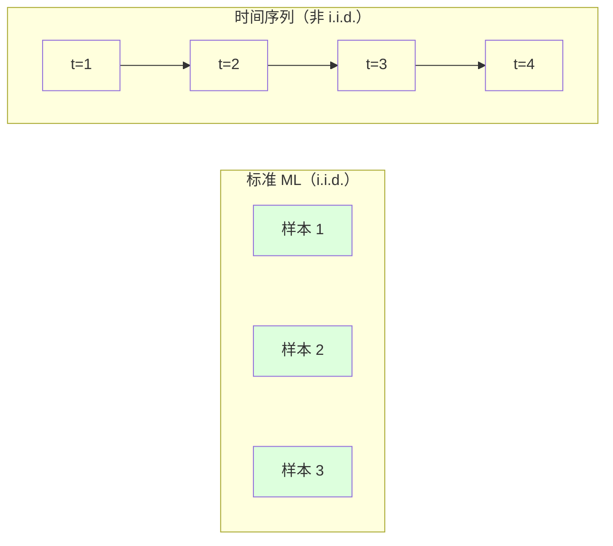
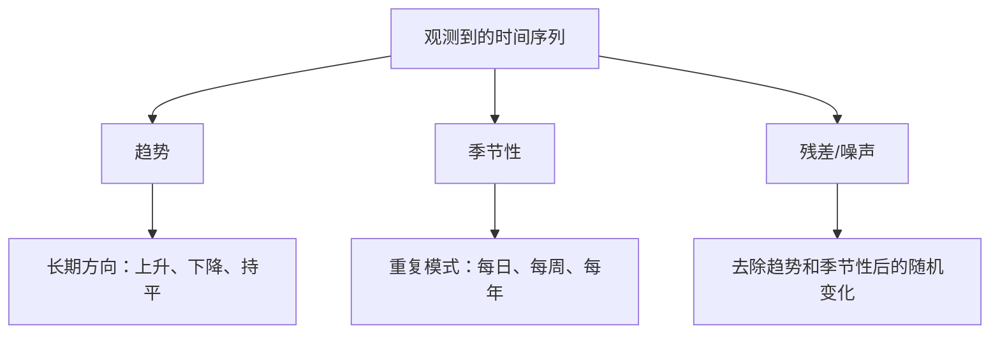
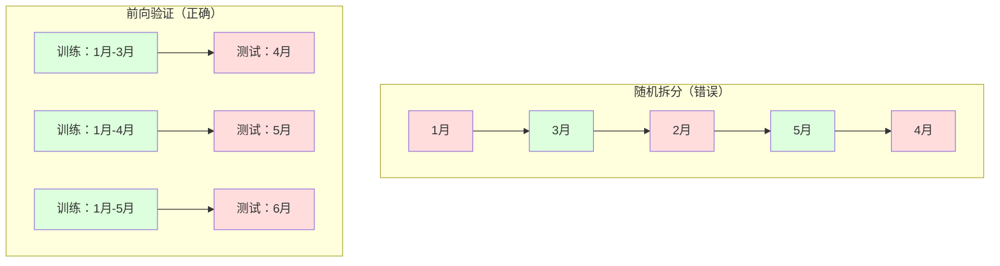

# 时间序列基础

> 过去的表现确实能预测未来的结果——只要你先检查平稳性。

**类型：** 构建
**语言：** Python
**前置要求：** 第二阶段，第01-09课
**时间：** ~90分钟

## 学习目标

- 将时间序列分解为趋势、季节性和残差分量，并测试平稳性
- 实现滞后特征和滚动统计量，将时间序列转化为监督学习问题
- 构建前向验证框架，防止未来数据泄漏到训练中
- 解释为什么随机训练/测试拆分对时间序列无效，并演示与正确时间拆分的性能差距

## 问题

你有按时间排序的数据。每日销售额、每小时温度、每分钟 CPU 使用率、每周股票价格。你想预测下一个值、下一周、下个季度。

你拿起标准的 ML 工具包：随机训练/测试拆分、交叉验证、特征矩阵输入、预测输出。每一步都是错误的。

时间序列打破了标准 ML 依赖的假设。样本不是独立的——今天的温度取决于昨天的。随机拆分将未来信息泄漏到过去。在回测中看起来很好的特征在生产中失败，因为它们依赖于随时间变化的模式。

一个在随机交叉验证中获得 95% 准确率的模型，在基于时间的正确评估中可能只得到 55%。区别不是技术细节。它是纸上模型和生产中模型之间的区别。

本课程涵盖基础内容：时间数据有什么不同、如何诚实地评估模型、以及如何将时间序列转化为标准 ML 模型可以消费的特征。

## 概念

### 时间序列有什么不同

标准 ML 假设 i.i.d.——独立同分布。每个样本来自相同的分布，独立于其他样本。时间序列违反了这两个假设：

- **不独立。** 今天的股价取决于昨天的。本周的销售额与上周的相关。
- **不同分布。** 分布随时间变化。12 月的销售额看起来与 3 月的不同。

这些违反不是小问题。它们改变了你构建特征、评估模型以及选择有效算法的方式。


```mermaid
flowchart LR
    subgraph IID["标准 ML（i.i.d.）"]
        direction TB
        S1[样本 1] ~~~ S2[样本 2]
        S2 ~~~ S3[样本 3]
    end
    subgraph TS["时间序列（非 i.i.d.）"]
        direction LR
        T1[t=1] --> T2[t=2]
        T2 --> T3[t=3]
        T3 --> T4[t=4]
    end

    style S1 fill:#dfd
    style S2 fill:#dfd
    style S3 fill:#dfd
    style T1 fill:#ffd
    style T2 fill:#ffd
    style T3 fill:#ffd
    style T4 fill:#ffd
```

在标准 ML 中，样本是可互换的。打乱它们不会改变任何东西。在时间序列中，顺序就是一切。打乱会破坏信号。

### 时间序列的组成部分

每个时间序列都是以下分量的组合：


```mermaid
flowchart TD
    A[观测到的时间序列] --> B[趋势]
    A --> C[季节性]
    A --> D[残差/噪声]

    B --> E[长期方向：上升、下降、持平]
    C --> F[重复模式：每日、每周、每年]
    D --> G[去除趋势和季节性后的随机变化]
```

- **趋势（Trend）**：长期方向。收入每年增长 10%。全球气温上升。
- **季节性（Seasonality）**：固定间隔的重复模式。零售额在 12 月飙升。空调使用量在 7 月达到峰值。
- **残差（Residual）**：去除趋势和季节性后剩下的部分。如果残差看起来像白噪声，分解就捕捉到了信号。

### 平稳性

如果时间序列的统计性质（均值、方差、自相关）不随时间变化，它就是平稳的。大多数预测方法假设平稳性。

**为什么重要：** 非平稳序列的均值会漂移。在 1 月数据上训练的模型学到的均值与 2 月将显示的不同。它会系统性地出错。

**如何检查：** 计算窗口上的滚动均值和滚动标准差。如果它们漂移，序列就是非平稳的。

**如何修复：** 差分。不是建模原始值，而是建模连续值之间的变化：

```
diff[t] = value[t] - value[t-1]
```

如果一轮差分不能使序列平稳，再应用一次（二阶差分）。大多数现实序列最多需要两轮差分。

**示例：**

原始序列：[100, 102, 106, 112, 120]
一阶差分：[2, 4, 6, 8]（仍在上升趋势）
二阶差分：[2, 2, 2]（恒定——平稳）

原始序列有二次趋势。一阶差分将其变为线性趋势。二阶差分使其持平。在实践中，你很少需要超过两轮。

**正式检验：** 增强迪基-富勒（ADF）检验是平稳性的标准统计检验。零假设是"序列是非平稳的"。p 值低于 0.05 意味着你可以拒绝零假设并得出平稳的结论。我们不从头实现 ADF（它需要渐近分布表），但代码中的滚动统计方法提供了一个实用的视觉检查。

### 自相关

自相关衡量时间 t 的值与时间 t-k（过去 k 步）的值的相关程度。自相关函数（ACF）绘制了每个滞后期 k 的这个相关性。

**ACF 告诉你：**
- 序列记住了多远。如果 ACF 在滞后 5 之后降到零，超过 5 步前的值就不相关了。
- 是否存在季节性。如果 ACF 在滞后 12（月度数据）处有尖峰，就存在年度季节性。
- 创建多少滞后特征。使用直到 ACF 变得可忽略的滞后期。

**PACF（偏自相关函数）** 移除了间接相关性。如果今天与 3 天前相关仅仅是因为两者都与昨天相关，那么 PACF 在滞后 3 处将为零，而 ACF 在滞后 3 处不会为零。

### 滞后特征：将时间序列转化为监督学习

标准 ML 模型需要特征矩阵 X 和目标 y。时间序列给你一个单一的值列。桥梁是滞后特征。

取序列 [10, 12, 14, 13, 15] 并创建滞后 1 和滞后 2 特征：

| lag_2 | lag_1 | target |
|-------|-------|--------|
| 10    | 12    | 14     |
| 12    | 14    | 13     |
| 14    | 13    | 15     |

现在你有了一个标准的回归问题。任何 ML 模型（线性回归、随机森林、梯度提升）都可以从滞后中预测目标。

你可以工程化的额外特征：
- **滚动统计量：** 过去 k 个值的均值、标准差、最小值、最大值
- **日历特征：** 星期几、月份、是否节假日、是否周末
- **差分值：** 与上一步的变化
- **扩展统计量：** 累积均值、累积和
- **比率特征：** 当前值 / 滚动均值（距离近期平均有多远）
- **交互特征：** lag_1 * day_of_week（动量上的周日效应）

**多少个滞后？** 使用自相关函数。如果 ACF 在滞后 10 之前都显著，至少使用 10 个滞后。如果有周季节性，包括滞后 7（可能还有 14）。更多滞后给了模型更多历史，但也给了更多特征要拟合，增加了过拟合风险。

**目标对齐陷阱。** 在创建滞后特征时，目标必须是时间 t 的值，所有特征必须使用时间 t-1 或更早的值。如果你不小心包含了时间 t 的值作为特征，你就有了一个完美的预测器——和一个完全无用的模型。这是时间序列特征工程中最常见的错误。

### 前向验证

这是本课程最重要的概念。标准 k 折交叉验证将样本随机分配到训练和测试。对于时间序列，这泄漏了未来信息。


```mermaid
flowchart TD
    subgraph WRONG["随机拆分（错误）"]
        direction LR
        W1[1月] --> W2[3月]
        W2 --> W3[2月]
        W3 --> W4[5月]
        W4 --> W5[4月]
        style W1 fill:#fdd
        style W3 fill:#fdd
        style W5 fill:#fdd
        style W2 fill:#dfd
        style W4 fill:#dfd
    end

    subgraph RIGHT["前向验证（正确）"]
        direction LR
        R1["训练：1月-3月"] --> R2["测试：4月"]
        R3["训练：1月-4月"] --> R4["测试：5月"]
        R5["训练：1月-5月"] --> R6["测试：6月"]
        style R1 fill:#dfd
        style R2 fill:#fdd
        style R3 fill:#dfd
        style R4 fill:#fdd
        style R5 fill:#dfd
        style R6 fill:#fdd
    end
```

前向验证：
1. 在截至时间 t 的数据上训练
2. 预测时间 t+1（或 t+1 到 t+k 用于多步）
3. 将窗口向前滑动
4. 重复

每个测试折只包含所有训练数据之后的数据。没有未来泄漏。这给出了模型部署后表现的诚实估计。

**扩展窗口** 使用所有历史数据进行训练（窗口增长）。**滑动窗口** 使用固定大小的训练窗口（窗口滑动）。当你相信较旧的数据仍然相关时使用扩展。当世界变化且旧数据有害时使用滑动。

### ARIMA 直觉

ARIMA 是经典的时间序列模型。它有三个组成部分：

- **AR（自回归）：** 从过去的值预测。AR(p) 使用最后 p 个值。
- **I（积分）：** 差分以实现平稳性。I(d) 应用 d 轮差分。
- **MA（移动平均）：** 从过去的预测误差预测。MA(q) 使用最后 q 个误差。

ARIMA(p, d, q) 组合了所有三个。你基于 ACF/PACF 分析或自动搜索（auto-ARIMA）选择 p、d、q。

我们不会从头实现 ARIMA——它需要超出本课程范围的数值优化。关键洞见是理解每个组件的作用，以便你可以解释 ARIMA 结果并知道何时使用它。

### 何时使用什么

| 方法 | 最适合 | 处理季节性 | 处理外部特征 |
|----------|---------|-------------------|------------------------|
| 滞后特征 + ML | 有许多外部特征的表格数据 | 使用日历特征 | 是 |
| ARIMA | 单变量序列、短期 | SARIMA 变体 | 否（ARIMAX 有限支持） |
| 指数平滑 | 简单趋势 + 季节性 | 是（Holt-Winters） | 否 |
| Prophet | 业务预测、节假日 | 是（傅里叶项） | 有限 |
| 神经网络（LSTM、Transformer） | 长序列、多序列 | 已学习 | 是 |

对于大多数实际问题，滞后特征 + 梯度提升是最强的起点。它自然地处理外部特征，不需要平稳性，且易于调试。

### 预测范围与策略

单步预测预测一步 ahead。多步预测预测多步。有三种策略：

**递归（迭代）：** 预测一步 ahead，使用预测作为下一步的输入。简单但误差会累积——每个预测使用前一个预测，所以错误会复合。

**直接：** 为每个预测范围训练一个单独的模型。模型-1 预测 t+1，模型-5 预测 t+5。没有误差累积，但每个模型的训练样本更少，且它们不共享信息。

**多输出：** 训练一个同时输出所有预测范围的模型。跨范围共享信息，但需要一个支持多输出的模型（或自定义损失函数）。

对于大多数实际问题，短预测范围（1-5 步）从递归开始，较长范围从直接开始。

### 时间序列的常见错误

| 错误 | 原因 | 如何修复 |
|---------|---------------|-----------|
| 随机训练/测试拆分 | 标准 ML 的习惯 | 使用前向验证或时间拆分 |
| 使用未来特征 | 错误地包含了时间 t 的特征 | 审计每个特征的时间对齐 |
| 过拟合季节性 | 模型记住了日历模式 | 在测试集中保留一个完整的季节周期 |
| 忽略尺度变化 | 收入翻倍但模式保持 | 建模百分比变化而非绝对值 |
| 太多滞后特征 | "更多历史更好" | 使用 ACF 确定相关滞后期 |
| 不进行差分 | "模型会搞定的" | 树模型处理趋势；线性模型需要平稳性 |

## 动手实现

`code/time_series.py` 中的代码从头实现了核心构建块。

### 滞后特征创建器

```python
def make_lag_features(series, n_lags):
    n = len(series)
    X = np.full((n, n_lags), np.nan)
    for lag in range(1, n_lags + 1):
        X[lag:, lag - 1] = series[:-lag]
    valid = ~np.isnan(X).any(axis=1)
    return X[valid], series[valid]
```

这将一维序列转换为特征矩阵，其中每行有最后 `n_lags` 个值作为特征，当前值作为目标。

### 前向交叉验证

```python
def walk_forward_split(n_samples, n_splits=5, min_train=50):
    assert min_train < n_samples, "min_train 必须小于 n_samples"
    step = max(1, (n_samples - min_train) // n_splits)
    for i in range(n_splits):
        train_end = min_train + i * step
        test_end = min(train_end + step, n_samples)
        if train_end >= n_samples:
            break
        yield slice(0, train_end), slice(train_end, test_end)
```

每次拆分确保训练数据严格在测试数据之前。训练窗口随每折扩展。

### 简单自回归模型

纯 AR 模型就是在滞后特征上的线性回归：

```python
class SimpleAR:
    def __init__(self, n_lags=5):
        self.n_lags = n_lags
        self.weights = None
        self.bias = None

    def fit(self, series):
        X, y = make_lag_features(series, self.n_lags)
        # 通过正规方程求解
        X_b = np.column_stack([np.ones(len(X)), X])
        theta = np.linalg.lstsq(X_b, y, rcond=None)[0]
        self.bias = theta[0]
        self.weights = theta[1:]
        return self
```

这在概念上与第02课的线性回归相同，但应用于同一变量的时间滞后版本。

### 平稳性检查

代码计算滚动统计量以可视化和数值化地评估平稳性：

```python
def check_stationarity(series, window=50):
    rolling_mean = np.array([
        series[max(0, i - window):i].mean()
        for i in range(1, len(series) + 1)
    ])
    rolling_std = np.array([
        series[max(0, i - window):i].std()
        for i in range(1, len(series) + 1)
    ])
    return rolling_mean, rolling_std
```

如果滚动均值漂移或滚动标准差变化，序列就是非平稳的。应用差分并再次检查。

代码还通过比较序列的前半部分和后半部分来检查平稳性。如果均值相差超过半个标准差或方差比超过 2 倍，则序列被标记为非平稳。

### 自相关

```python
def autocorrelation(series, max_lag=20):
    n = len(series)
    mean = series.mean()
    var = series.var()
    acf = np.zeros(max_lag + 1)
    for k in range(max_lag + 1):
        cov = np.mean((series[:n-k] - mean) * (series[k:] - mean))
        acf[k] = cov / var if var > 0 else 0
    return acf
```

## 使用它

使用 sklearn，你可以直接将滞后特征与任何回归器一起使用：

```python
from sklearn.linear_model import Ridge
from sklearn.ensemble import GradientBoostingRegressor

X, y = make_lag_features(series, n_lags=10)

for train_idx, test_idx in walk_forward_split(len(X)):
    model = Ridge(alpha=1.0)
    model.fit(X[train_idx], y[train_idx])
    predictions = model.predict(X[test_idx])
```

对于 ARIMA，使用 statsmodels：

```python
from statsmodels.tsa.arima.model import ARIMA

model = ARIMA(train_series, order=(5, 1, 2))
fitted = model.fit()
forecast = fitted.forecast(steps=30)
```

`time_series.py` 中的代码演示了两种方法，并使用前向验证进行比较。

### sklearn TimeSeriesSplit

sklearn 提供了 `TimeSeriesSplit`，实现了前向验证：

```python
from sklearn.model_selection import TimeSeriesSplit

tscv = TimeSeriesSplit(n_splits=5)
for train_index, test_index in tscv.split(X):
    X_train, X_test = X[train_index], X[test_index]
    y_train, y_test = y[train_index], y[test_index]
    model.fit(X_train, y_train)
    score = model.score(X_test, y_test)
```

这等同于我们从零实现的 `walk_forward_split`，但已集成到 sklearn 的交叉验证框架中。你可以将其与 `cross_val_score` 一起使用：

```python
from sklearn.model_selection import cross_val_score

scores = cross_val_score(model, X, y, cv=TimeSeriesSplit(n_splits=5))
print(f"平均分数：{scores.mean():.4f} +/- {scores.std():.4f}")
```

### 评估指标

时间序列预测使用回归指标，但带有时间感知的上下文：

- **MAE（平均绝对误差）：** |y_true - y_pred| 的平均值。以原始单位易于解释。"平均而言，预测偏差 3.2 度。"
- **RMSE（均方根误差）：** 均方误差的平方根。比 MAE 更多地惩罚大误差。当大误差比许多小误差更糟糕时使用。
- **MAPE（平均绝对百分比误差）：** |error / true_value| * 100 的平均值。尺度无关，便于跨不同序列比较。但当真实值为零时无定义。
- **朴素基线比较：** 始终与简单基线比较。季节性朴素基线预测一个周期前的值（昨天、上周）。如果你的模型不能击败朴素基线，就有问题。

### 滚动特征

代码演示了向滞后特征添加滚动统计量（7 天和 14 天窗口上的均值、标准差、最小值、最大值）。这些给了模型关于近期趋势和波动性的信息，而单独的滞后特征无法捕捉。

例如，如果滚动均值在上升，表明存在上升趋势。如果滚动标准差在增加，表明波动性在增长。这些是基于树的模型可以学习但线性模型不能学习的模式。

## 交付使用

本课程产出：
- `outputs/prompt-time-series-advisor.md` -- 构建时间序列问题的提示词
- `code/time_series.py` -- 滞后特征、前向验证、AR 模型、平稳性检查

### 你必须击败的基线

在构建任何模型之前，建立基线：

1. **最后值（持久性）。** 预测明天将与今天相同。对于许多序列，这出人意料地难以击败。
2. **季节性朴素。** 预测今天将与上周（或去年）的同一天相同。如果你的模型不能击败这个，它就没有学到任何超越季节性的有用模式。
3. **移动平均。** 预测最后 k 个值的平均值。平滑噪声，但不能捕捉突然变化。

如果你花哨的 ML 模型输给了季节性朴素基线，说明你有 bug。最常见的：特征中的未来泄漏、错误的评估方法，或者序列是完全随机且不可预测的。

### 实用技巧

1. **从绘图开始。** 在任何建模之前，绘制原始序列。寻找趋势、季节性、异常值、结构性断裂（行为的突然变化）。30 秒的视觉检查通常比一小时的自动分析告诉你更多。
2. **先差分，后建模。** 如果序列有明显趋势，在创建滞后特征之前对它进行差分。基于树的模型可以处理趋势，但线性模型不能，而差分从不会有害。
3. **保留至少一个完整的季节周期。** 如果你有周季节性，你的测试集需要至少一个完整的周。如果月度，至少一个完整的月。否则你无法评估模型是否捕捉到了季节性模式。
4. **在生产中监控。** 时间序列模型会随着世界变化而随时间降解。基于滚动方式跟踪预测误差。当误差开始增加时，在最近数据上重新训练模型。
5. **注意制度变化。** 在疫情前数据上训练的模型不会预测疫情后的行为。在特征中包含已知制度变化的指标，或使用会遗忘旧数据的滑动窗口。
6. **对偏斜序列进行对数变换。** 收入、价格和计数通常是右偏的。取对数稳定了方差并使乘法模式变为加法，线性模型可以处理。在对数空间中预测，然后取指数还原为原始单位。

## 练习题

1. **平稳性实验。** 生成一个具有线性趋势的序列。用滚动统计量检查平稳性。应用一阶差分。再次检查。对于二次趋势，需要多少轮差分？
2. **滞后选择。** 在季节性序列（周期=7）上计算 ACF。哪些滞后具有最高的自相关？仅使用这些滞后（不是连续滞后）创建滞后特征。与使用滞后 1 到 7 相比，准确率有提高吗？
3. **前向验证 vs 随机拆分。** 在滞后特征上训练 Ridge 回归。使用随机 80/20 拆分和前向验证进行评估。随机拆分高估性能的程度有多大？
4. **特征工程。** 向滞后特征添加滚动均值（窗口=7）、滚动标准差（窗口=7）和星期几特征。使用前向验证比较有无这些额外特征时的准确率。
5. **多步预测。** 修改 AR 模型以预测 5 步 ahead 而不是 1 步。比较两种策略：(a) 预测一步，使用预测作为下一步的输入（递归），以及 (b) 为每个预测范围训练单独的模型（直接）。哪个更准确？

## 关键术语

| 术语 | 人们怎么说 | 实际含义 |
|------|----------------|----------------------|
| 平稳性（Stationarity） | "统计量不随时间变化" | 均值、方差和自相关结构随时间恒定的序列 |
| 差分（Differencing） | "减去连续值" | 计算 y[t] - y[t-1] 以去除趋势并实现平稳性 |
| 自相关 ACF | "序列如何与自身相关" | 时间序列与其滞后副本之间的相关性，作为滞后的函数 |
| 偏自相关 PACF | "仅直接相关" | 在去除所有更短滞后的影响后，滞后 k 处的自相关 |
| 滞后特征（Lag features） | "过去值作为输入" | 使用 y[t-1], y[t-2], ..., y[t-k] 作为特征来预测 y[t] |
| 前向验证（Walk-forward validation） | "尊重时间的交叉验证" | 训练数据在时间上总是先于测试数据的评估方式 |
| ARIMA | "经典时间序列模型" | 自回归积分移动平均：结合过去值（AR）、差分（I）和过去误差（MA） |
| 季节性（Seasonality） | "重复的日历模式" | 时间序列中与日历周期（每日、每周、每年）相关的规律、可预测的周期 |
| 趋势（Trend） | "长期方向" | 序列水平随时间持续增加或减少 |
| 扩展窗口（Expanding window） | "使用所有历史" | 前向验证中训练集随每折增长 |
| 滑动窗口（Sliding window） | "固定大小的历史" | 前向验证中训练集是一个向前滑动的固定长度窗口 |

## 延伸阅读

- [Hyndman and Athanasopoulos, Forecasting: Principles and Practice (3rd ed.)](https://otexts.com/fpp3/) -- 最好的免费时间序列预测教材
- [scikit-learn Time Series Split](https://scikit-learn.org/stable/modules/generated/sklearn.model_selection.TimeSeriesSplit.html) -- sklearn 的前向拆分器
- [statsmodels ARIMA docs](https://www.statsmodels.org/stable/generated/statsmodels.tsa.arima.model.ARIMA.html) -- 带诊断的 ARIMA 实现
- [Makridakis et al., The M5 Competition (2022)](https://www.sciencedirect.com/science/article/pii/S0169207021001874) -- 展示 ML 方法与统计方法的大规模预测比赛
