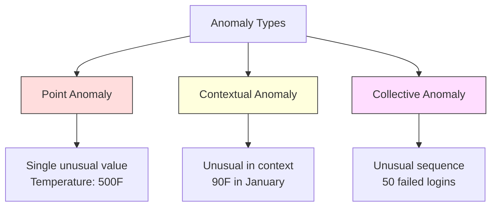
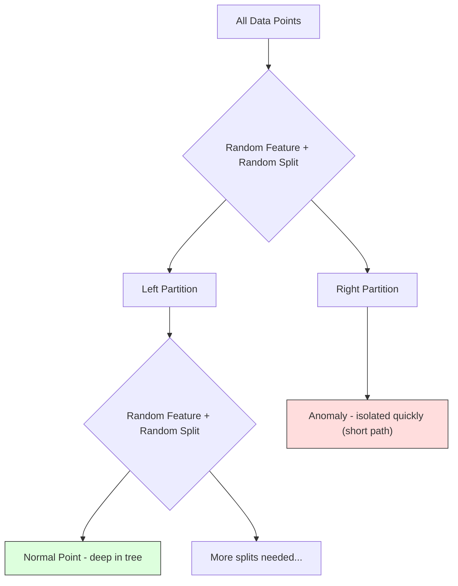
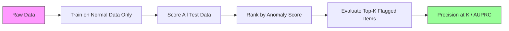

# Anomaly Detection

> 正常は定義しやすい。異常とは、そこに当てはまらないものです。

**種別:** 構築
**言語:** Python
**前提条件:** Phase 2, Lessons 01-09
**所要時間:** 約75分

## Learning Objectives

- Z-score、IQR、Isolation Forest による異常検知手法をゼロから実装する
- 点異常、文脈異常、集合異常を区別し、それぞれに適した検知手法を選ぶ
- 異常検知が、異常を分類する問題ではなく正常データをモデル化する問題として扱われる理由を説明する
- 教師なし異常検知と教師あり分類を比較し、新しい異常への対応範囲と precision のトレードオフを評価する

## 問題

クレジットカードが午後 2 時にニューヨークで使われ、その 5 分後の午後 2 時 5 分に東京で使われました。工場センサーが、通常範囲 80-120 のところ 150 度を示しました。サーバーが、1 日平均 200 request per second のところ 50,000 request per second を送信しました。

これらは異常です。そして、それを見つけることには意味があります。不正利用は何十億もの損失を生みます。設備故障はダウンタイムを発生させます。ネットワーク侵入はデータを失わせます。

難しいのは、異常のラベル付き例がほとんどないことです。fraud は transaction の 0.1% しかありません。設備故障は年に数回しか起きません。学習できる「anomaly」class がほとんどないため、標準的な分類器は訓練できません。たとえ一部のラベルがあっても、これまで見た異常だけが将来遭遇する異常ではありません。明日の fraud scheme は今日のものとは違います。

異常検知は問題を反転します。異常とは何かを学ぶのではなく、正常とは何かを学びます。正常から外れるものは疑わしいものとして扱います。これはラベルなしで機能し、新しい種類の異常に適応でき、大規模データセットにもスケールします。

## The Concept

### Types of Anomalies

すべての異常が同じではありません。

- **Point anomalies.** 文脈に関係なく、単一のデータ点が異常なもの。500 度の温度値。普段は $50 程度しか使わないアカウントからの $50,000 の transaction。
- **Contextual anomalies.** 文脈を踏まえると異常なデータ点。90 度は夏には正常でも冬には異常です。同じ値でも文脈が違います。
- **Collective anomalies.** 個々の点は正常に見えても、グループとしては異常なデータ点の系列。5 回の login failures は正常でも、連続 50 回なら brute-force attack です。

多くの手法は point anomalies を検出します。Contextual anomalies には時間や場所の特徴量が必要です。Collective anomalies には系列を考慮する手法が必要です。



### The Unsupervised Framing

標準的な分類では、両方のクラスにラベルがあります。異常検知では、通常は次の 3 つの状況のいずれかです。

1. **Fully unsupervised.** ラベルがまったくない。すべてのデータで detector を fit し、異常が十分まれで「normal」model を壊さないことを期待します。
2. **Semi-supervised.** 正常データだけのクリーンなデータセットがある。このクリーンなセットで fit し、他のすべてを score します。可能なら最も強い設定です。
3. **Weakly supervised.** 少数のラベル付き異常がある。それらは training ではなく evaluation に使います。教師なしで学習し、ラベル付き subset で precision/recall を測ります。

重要な洞察は、異常検知は分類とは根本的に違うということです。2 クラス間の decision boundary ではなく、正常データの分布をモデル化しています。

### Supervised vs Unsupervised: The Tradeoff

ラベル付き異常がある場合、それを training に使うべきでしょうか（教師あり分類）、それとも evaluation のみに使うべきでしょうか（教師なし検知）。

**Supervised（classification として扱う）:**
- 以前に見たことがある正確な種類の異常を捕捉できる
- 既知の異常タイプでは precision が高い
- 新しい異常タイプを完全に見逃す
- 新しい異常タイプが現れたら再学習が必要
- 十分な異常例が必要（多くの場合少なすぎる）

**Unsupervised（正常をモデル化し、逸脱をフラグする）:**
- 新しいタイプを含む、正常からのあらゆる逸脱を捕捉する
- ラベル付き異常を必要としない
- false positive rate が高い（異常に見えるものすべてが悪いわけではない）
- distribution shift によりロバスト

実務では、最良のシステムは両方を組み合わせます。広いカバレッジには教師なし検知を使い、既知の高優先度の異常タイプには教師ありモデルを使い、曖昧なケースは人間がレビューします。

### Z-Score Method

最も単純な方法です。各特徴量の mean と standard deviation を計算します。mean から k standard deviations を超える点をフラグします。

```text
z_score = (x - mean) / std
anomaly if |z_score| > threshold
```

デフォルトの threshold は 3.0 です（Gaussian distribution では正常データの 99.7% が 3 standard deviations 以内に入ります）。

**Strengths:** 単純。高速。解釈しやすい（「この値は正常から 4.5 standard deviations 離れている」）。

**Weaknesses:** データが正規分布していることを仮定する。training data 内の outliers に敏感（outliers が mean をずらし std を膨らませるため、検出しにくくなる）。multimodal distributions では失敗する。

**When it works well:** データがおおむねベル型の単一特徴量監視。server response times、manufacturing tolerances、安定した baseline を持つ sensor readings。

**When it fails:** multi-cluster data（baseline temperatures が異なる 2 つの office locations）、skewed data（$1000 がまれだが異常ではない transaction amounts）、training set に outliers が含まれるデータ。

### IQR Method

Z-score よりロバストです。mean と standard deviation の代わりに interquartile range を使います。

```
Q1 = 25th percentile
Q3 = 75th percentile
IQR = Q3 - Q1
lower_bound = Q1 - factor * IQR
upper_bound = Q3 + factor * IQR
anomaly if x < lower_bound or x > upper_bound
```

デフォルトの factor は 1.5 です。

**Strengths:** outliers にロバスト（percentiles は極端な値の影響を受けない）。skewed distributions でも機能する。normality assumption がない。

**Weaknesses:** 単変量のみ（各特徴量に独立に適用）。特徴量を一緒に見たときだけ異常になるケースを検出できない（個々の特徴量では正常でも joint space では異常な点）。

**Practical note:** IQR の 1.5 factor は box plot の whiskers に対応します。whiskers の外側の点は potential outliers です。1.5 ではなく 3.0 を使うと detector はより保守的になります（flag が少なく、false positives も少ない）。適切な factor は false alarms への許容度に依存します。

### Isolation Forest

重要な洞察は、異常は少数で異質だということです。データをランダムに分割すると、異常は孤立させやすく、他の点から分離するのに必要な random splits が少なくなります。



**How it works:**
1. 多数の random trees（isolation forest）を構築する
2. 各 node で random feature と、その feature の min と max の間の random split value を選ぶ
3. すべての点が孤立する（自分だけの leaf に入る）まで分割する
4. 異常はすべての trees での average path lengths が短い

**Why it works:** 正常点は密な領域にあります。近傍から 1 点を孤立させるには多くの random splits が必要です。異常は疎な領域にあります。1 回か 2 回の random splits で孤立できます。

anomaly score は、すべての trees にわたる average path length を、random binary search tree の expected path length で正規化したものです。

```
score(x) = 2^(-average_path_length(x) / c(n))
```

ここで `c(n)` は n samples に対する expected path length です。Score が 1 に近いほど anomaly、0.5 に近いほど normal、0 に近いほど非常に normal（dense clusters の深い位置）です。

**Strengths:** 分布仮定がない。高次元で機能する。よくスケールする（各 tree が subsample を使うため sample size に対して sublinear）。mixed feature types を扱える。

**Weaknesses:** dense regions 内の異常に弱い（masking effect）。無関係な特徴量が多いと random splitting の効果が下がる。

**Key hyperparameters:**
- `n_estimators`: trees の数。通常 100 で十分。増やすと scores は安定するが計算は遅くなる。
- `max_samples`: tree あたりの samples 数。元論文のデフォルトは 256。小さい値は個々の tree の精度を下げるが多様性を増やす。この subsampling が Isolation Forest を高速にしている。
- `contamination`: 期待される anomalies の割合。threshold 設定にのみ使われる。scores 自体には影響しない。

### Local Outlier Factor (LOF)

LOF は、ある点の周囲の局所密度を、その近傍の密度と比較します。密な領域に囲まれた疎な領域の点は異常です。

**How it works:**
1. 各点について k nearest neighbors を見つける
2. local reachability density（近傍がどれだけ密か）を計算する
3. 各点の density を neighbors の densities と比較する
4. ある点の density が neighbors より大幅に低ければ outlier とする

**LOF score:**
- LOF が 1.0 に近い: neighbors と同程度の density（normal）
- LOF が 1.0 より大きい: neighbors より低密度（potentially anomalous）
- LOF がかなり大きい（例: 2.0+）: 著しく低密度（likely anomaly）

「local」の部分が重要です。2 つの clusters を持つデータセットを考えます。1000 点の dense cluster と 50 点の sparse cluster です。sparse cluster の端にある点は globally unusual ではありません。50 個の neighbors があるからです。しかし immediate neighbors がその点より密なら locally unusual です。LOF は global methods が見逃すこのニュアンスを捉えます。

**Strengths:** local anomalies（全体としては異常でなくても、その近傍では異常な点）を検出する。密度の異なる clusters で機能する。

**Weaknesses:** 大規模データセットでは遅い（naive implementation は O(n^2)）。k の選択に敏感。非常に高次元ではうまく機能しない（curse of dimensionality が distance calculations に影響する）。

### Comparison

| Method | Assumptions | Speed | Handles High Dims | Detects Local Anomalies |
|--------|------------|-------|-------------------|------------------------|
| Z-score | Normal distribution | Very fast | Yes (per feature) | No |
| IQR | None (per feature) | Very fast | Yes (per feature) | No |
| Isolation Forest | None | Fast | Yes | Partially |
| LOF | Distance is meaningful | Slow | Poorly | Yes |

### Evaluation Challenges

異常検知器の評価は、分類器の評価より難しくなります。

- **Extreme class imbalance.** 異常が 0.1% の場合、すべてを「normal」と予測するだけで 99.9% accuracy になります。Accuracy は役に立ちません。
- **AUROC is misleading.** 重い不均衡では、実用的なしきい値で大半の異常を見逃していても AUROC が良く見えることがあります。
- **Better metrics:** Precision@k（上位 k 件の flag items のうち本当の異常はいくつか）、AUPRC（area under precision-recall curve）、固定 false positive rate での recall。



### Anomaly Detection Pipeline

実務では、異常検知は次の workflow に従います。

1. **Collect baseline data.** 理想的には、異常がない（または非常に少ない）ことが分かっている期間のデータ。
2. **Feature engineering.** raw features と derived features（rolling statistics、time features、ratios）。
3. **Train the detector.** baseline data で fit する。model は「normal」がどう見えるかを学ぶ。
4. **Score new data.** 新しい observation ごとに anomaly score を付ける。
5. **Threshold selection.** score cutoff を選ぶ。これは business decision です。高い threshold は false alarms を減らしますが、missed anomalies を増やします。
6. **Alert and investigate.** flag された点を human review または automated response に回す。
7. **Feedback collection.** flag items が true anomalies だったか false alarms だったかを記録する。このデータで detector を評価し、時間とともに threshold を調整する。

pipeline は決して「完了」しません。データ分布は変わり、新しい異常タイプが現れ、threshold は調整が必要です。異常検知は一度きりの model ではなく、生きている system として扱います。

## 実装

`code/anomaly_detection.py` のコードは、Z-score、IQR、Isolation Forest をゼロから実装します。

### Z-Score Detector

```python
def zscore_detect(X, threshold=3.0):
    mean = X.mean(axis=0)
    std = X.std(axis=0)
    std[std == 0] = 1.0
    z = np.abs((X - mean) / std)
    return z.max(axis=1) > threshold
```

単純で vectorized されています。任意の特徴量が threshold を超えたら、その点を flag します。

### IQR Detector

```python
def iqr_detect(X, factor=1.5):
    q1 = np.percentile(X, 25, axis=0)
    q3 = np.percentile(X, 75, axis=0)
    iqr = q3 - q1
    iqr[iqr == 0] = 1.0
    lower = q1 - factor * iqr
    upper = q3 + factor * iqr
    outside = (X < lower) | (X > upper)
    return outside.any(axis=1)
```

### Isolation Forest from Scratch

ゼロからの実装では、feature space をランダムに分割する isolation trees を構築します。

```python
class IsolationTree:
    def __init__(self, max_depth):
        self.max_depth = max_depth

    def fit(self, X, depth=0):
        n, p = X.shape
        if depth >= self.max_depth or n <= 1:
            self.is_leaf = True
            self.size = n
            return self
        self.is_leaf = False
        self.feature = np.random.randint(p)
        x_min = X[:, self.feature].min()
        x_max = X[:, self.feature].max()
        if x_min == x_max:
            self.is_leaf = True
            self.size = n
            return self
        self.threshold = np.random.uniform(x_min, x_max)
        left_mask = X[:, self.feature] < self.threshold
        self.left = IsolationTree(self.max_depth).fit(X[left_mask], depth + 1)
        self.right = IsolationTree(self.max_depth).fit(X[~left_mask], depth + 1)
        return self
```

点を孤立させるまでの path length が anomaly score を決めます。path が短いほど、より異常です。

`IsolationForest` class は複数の trees をラップします。

```python
class IsolationForest:
    def __init__(self, n_estimators=100, max_samples=256, seed=42):
        self.n_estimators = n_estimators
        self.max_samples = max_samples

    def fit(self, X):
        sample_size = min(self.max_samples, X.shape[0])
        max_depth = int(np.ceil(np.log2(sample_size)))
        for _ in range(self.n_estimators):
            idx = rng.choice(X.shape[0], size=sample_size, replace=False)
            tree = IsolationTree(max_depth=max_depth)
            tree.fit(X[idx])
            self.trees.append(tree)

    def anomaly_score(self, X):
        avg_path = average path length across all trees
        scores = 2.0 ** (-avg_path / c(max_samples))
        return scores
```

正規化係数 `c(n)` は、n elements を持つ binary search tree における unsuccessful search の expected path length です。`H` を harmonic number とすると `2 * H(n-1) - 2*(n-1)/n` に等しくなります。この正規化により、異なるサイズのデータセット間で scores を比較できます。

### Demo Scenarios

コードは複数の test scenarios を生成します。

1. **Single cluster with outliers.** 2D Gaussian cluster に、中心から遠い anomalies を注入します。ここではすべての手法が機能するはずです。
2. **Multimodal data.** サイズと密度の異なる 3 つの clusters。clusters の間の点は anomalous です。Z-score は feature ごとの範囲が広いため苦戦します。
3. **High-dimensional data.** 50 features ですが、anomalies はそのうち 5 つでだけ異なります。特徴量 subset 内の anomalies を見つけられるかをテストします。

各 demo は precision、recall、F1、Precision@k を使ってすべての手法を比較します。

## Use It

sklearn で使う場合（ゼロからの実装ではなく library implementations）。

```python
from sklearn.ensemble import IsolationForest
from sklearn.neighbors import LocalOutlierFactor

iso = IsolationForest(n_estimators=100, contamination=0.05, random_state=42)
iso.fit(X_train)
predictions = iso.predict(X_test)

lof = LocalOutlierFactor(n_neighbors=20, contamination=0.05, novelty=True)
lof.fit(X_train)
predictions = lof.predict(X_test)
```

`contamination` は期待される anomalies の割合を設定することに注意してください。正しく設定することが重要です。低すぎると anomalies を見逃し、高すぎると false alarms が増えます。

`anomaly_detection.py` のコードは、同じデータ上でゼロからの実装と sklearn を比較します。

### sklearn Contamination Parameter

sklearn の `contamination` parameter は、連続的な anomaly scores を binary predictions に変換するための threshold を決めます。underlying scores は変わりません。

```python
iso_5 = IsolationForest(contamination=0.05)
iso_10 = IsolationForest(contamination=0.10)
```

どちらも同じ anomaly scores を生成します。ただし `iso_5` は上位 5% を flag し、`iso_10` は上位 10% を flag します。真の anomaly rate が分からない場合（通常は分かりません）、contamination を "auto" にして raw scores を直接扱います。false positives と false negatives の cost tradeoff に基づいて、自分で threshold を設定します。

### One-Class SVM

知っておく価値のある別の教師なし anomaly detector です。One-Class SVM は（kernel trick を使って）高次元 feature space 内で正常データを囲む boundary を fit します。

```python
from sklearn.svm import OneClassSVM

oc_svm = OneClassSVM(kernel="rbf", gamma="auto", nu=0.05)
oc_svm.fit(X_train)
predictions = oc_svm.predict(X_test)
```

`nu` parameter は anomalies の割合を近似します。One-Class SVM は小〜中規模データセットではうまく機能しますが、非常に大きなデータにはスケールしません（kernel matrix が二次的に増えるため）。

### Autoencoder Approach (Preview)

Autoencoders はデータを圧縮して復元することを学ぶ neural networks です。正常データで学習します。test time では、network は正常パターンだけを復元するよう学んでいるため、anomalies は reconstruction error が高くなります。

これは Phase 3（Deep Learning）で扱いますが、原理は同じです。正常をモデル化し、逸脱をフラグします。

### Ensemble Anomaly Detection

ensemble methods が classification を改善するのと同じように（Lesson 11）、複数の anomaly detectors を組み合わせると検知が改善します。最も単純な方法は次の通りです。

1. 複数の detectors（Z-score、IQR、Isolation Forest、LOF）を実行する
2. 各 detector の scores を [0, 1] に正規化する
3. 正規化された scores の平均を取る
4. 平均 score が threshold を超えた点を flag する

手法ごとに failure modes が異なるため、これにより false positives が減ります。4 手法すべてに flag された点はほぼ確実に anomalous です。1 手法だけに flag された点は、その手法固有の癖かもしれません。

より洗練された ensembles は、各 detector の推定 reliability（ラベル付き anomalies を持つ validation set があればそこで測定）によって重み付けします。

### Production Considerations

1. **Threshold drift.** データ分布が変わると、固定 threshold は古くなる。anomaly scores の分布を監視し、定期的に調整する。
2. **Alert fatigue.** false alarms が多すぎると operators は注意を払わなくなる。高い threshold（少数で信頼性の高い alerts）から始め、信頼が高まるにつれて下げる。
3. **Ensemble approach.** 本番では複数の detectors を組み合わせる。複数手法が anomalous と合意した場合だけ flag する。これにより false positives が大きく減る。
4. **Feature engineering.** Raw features だけではほとんど不十分。rolling statistics、ratios、time-since-last-event、domain-specific features を追加する。良い feature set は detector の選択より重要です。
5. **Feedback loop.** operators が flag items を調査して確認または却下したら、その結果を system に戻す。時間をかけて labeled data を蓄積し、detector の評価と改善に使う。

## Ship It

この lesson の成果物は次の通りです。
- `outputs/skill-anomaly-detector.md` -- 適切な detector を選ぶための decision skill
- `code/anomaly_detection.py` -- Z-score、IQR、Isolation Forest のゼロからの実装と sklearn 比較

### Choosing a Threshold

anomaly score は連続値です。binary decisions を行うには threshold が必要です。これは技術的な判断ではなく business decision です。

2 つの scenarios を考えます。
- **Fraud detection.** fraud の見逃しは高コストです（chargebacks、customer trust）。false alarm は human analyst の 5 分の調査コストです。より多くの fraud を捕捉するため threshold を低くし、false alarms を多めに受け入れます。
- **Equipment maintenance.** false alarm は $50,000 の不要な shutdown を意味します。missed failure は $500,000 の repair を意味します。これらのコストのバランスを取る threshold にします。

どちらの場合も、最適な threshold は false positives と false negatives の cost ratio に依存します。異なる thresholds で precision と recall を plot し、cost function を重ね、最小 cost の点を選びます。

### Scaling to Production

本番の real-time anomaly detection では次のようにします。

1. **Batch training, online scoring.** 直近の normal data で model を定期的（daily, weekly）に train する。新しい observation が到着するたびに score する。
2. **Feature computation must match.** 30 日 rolling statistics で学習したなら、新しい observation の features を計算するには 30 日の履歴が必要。必要な履歴を buffer する。
3. **Score distribution monitoring.** anomaly scores の分布を時間とともに追跡する。median score が上昇している場合、データが変化しているか model が古くなっている。
4. **Explainability.** anomaly を flag するときは理由を示す。Z-score: "Feature X is 4.2 standard deviations above normal." Isolation Forest: "This point was isolated in 3.1 splits on average (normal points take 8.5)."

## Exercises

1. **Threshold tuning.** Z-score detector を thresholds 1.0 から 5.0 まで 0.5 刻みで実行します。各 threshold の precision と recall を plot します。あなたのデータでは sweet spot はどこですか？

2. **Multivariate anomalies.** 各特徴量単体では正常に見えるが、組み合わせると異常になる 2D data を作成します（例: main cluster diagonal から遠い点）。Z-score per feature がこれを見逃し、Isolation Forest が捕捉することを示します。

3. **LOF from scratch.** k-nearest neighbors を使って Local Outlier Factor を実装します。同じデータで sklearn の LocalOutlierFactor と比較します。k=10 と k=50 を使い、k の選択が結果にどう影響するか確認します。

4. **Streaming anomaly detection.** Z-score detector を streaming setting で動くように変更します。新しい点が到着するたびに running mean と variance を更新します（Welford's online algorithm）。同じデータで batch Z-score と比較します。

5. **Real-world evaluation.** known anomalies を持つデータセット（例: Kaggle の credit card fraud）を使います。precision@100、precision@500、AUPRC ですべての手法を評価します。どの手法が最も良いですか？なぜですか？

## Key Terms

| Term | What people say | What it actually means |
|------|----------------|----------------------|
| Anomaly | "Outlier, unusual point" | 正常データの期待パターンから大きく逸脱するデータ点 |
| Point anomaly | "A single weird value" | 文脈に関係なく異常な個別 observation |
| Contextual anomaly | "Normal value, wrong context" | 時刻や場所などの文脈を踏まえると異常だが、別の文脈では正常かもしれない observation |
| Isolation Forest | "Random splits to find outliers" | 正常点より少ない分割で anomalies を孤立させる random trees の ensemble |
| Local Outlier Factor | "Compare density to neighbors" | local density が neighbors の density より大幅に低い点を flag する手法 |
| Z-score | "Standard deviations from mean" | (x - mean) / std。点が中心から standard deviation 単位でどれだけ離れているかを測る |
| IQR | "Interquartile range" | Q3 - Q1。データ中央 50% の広がりを測り、robust outlier detection に使う |
| Contamination | "Expected fraction of anomalies" | データのどの割合を anomalous として flag すべきかを detector に伝える hyperparameter |
| Precision@k | "Of the top k flags, how many are real" | 上位 k 件の最も疑わしい点だけで計算する precision。不均衡な anomaly detection で有用 |
| AUPRC | "Area under precision-recall curve" | すべての thresholds にわたる precision-recall performance を要約する metric。不均衡データでは AUROC より適切 |

## 参考文献

- [Liu et al., Isolation Forest (2008)](https://cs.nju.edu.cn/zhouzh/zhouzh.files/publication/icdm08b.pdf) -- original Isolation Forest paper
- [Breunig et al., LOF: Identifying Density-Based Local Outliers (2000)](https://dl.acm.org/doi/10.1145/342009.335388) -- original LOF paper
- [scikit-learn Outlier Detection docs](https://scikit-learn.org/stable/modules/outlier_detection.html) -- sklearn anomaly detectors の概要
- [Chandola et al., Anomaly Detection: A Survey (2009)](https://dl.acm.org/doi/10.1145/1541880.1541882) -- anomaly detection methods の包括的 survey
- [Goldstein and Uchida, A Comparative Evaluation of Unsupervised Anomaly Detection Algorithms (2016)](https://journals.plos.org/plosone/article?id=10.1371/journal.pone.0152173) -- 実データセット上の 10 手法の empirical comparison
