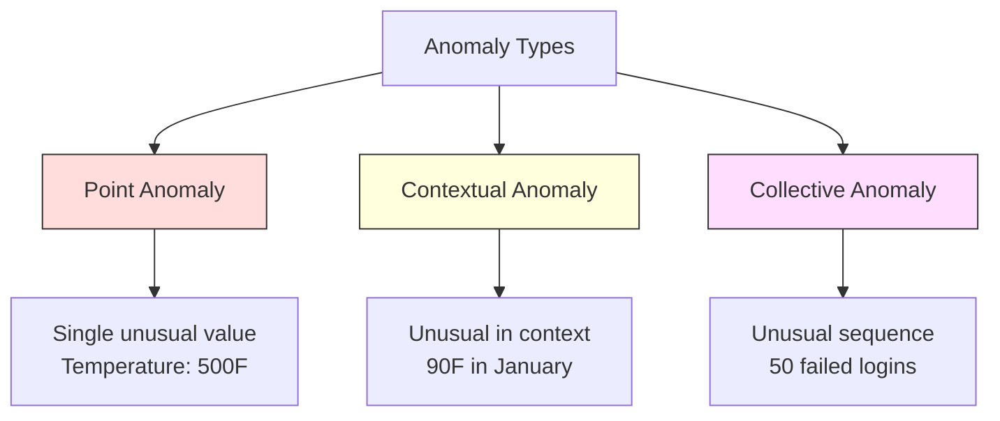
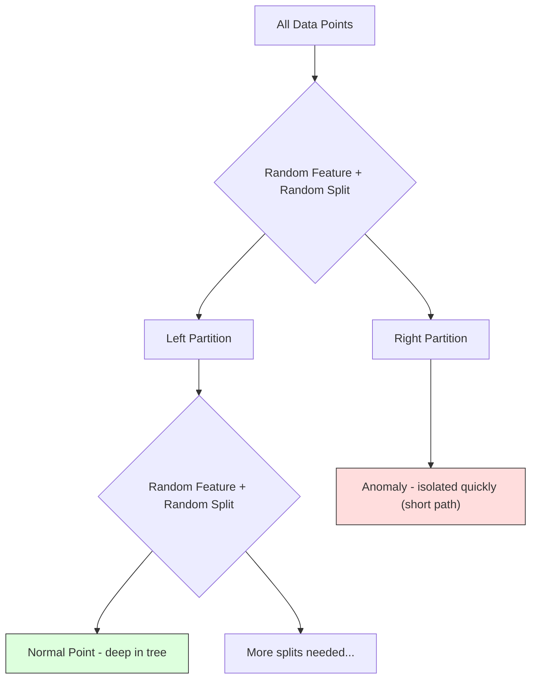
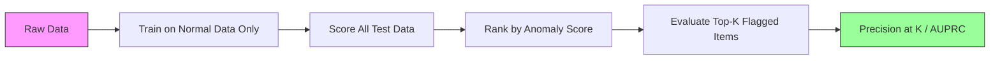

# Anormallik Tespiti

> Normal'i tanımlamak kolaydır. Anormal, uymayan şeydir.

**Tür:** Yapım
**Dil:** Python
**Önkoşullar:** Aşama 2, Dersler 01-09
**Süre:** ~75 dakika

## Öğrenme Hedefleri

- Z-skoru, IQR ve İzolasyon Ormanı anormallik tespit yöntemlerini sıfırdan uygulayın
- Noktasal, bağlamsal ve kolektif anormallikleri ayırt edin ve her biri için uygun tespit yöntemini seçin
- Anormallik tespitinin neden anormallikleri sınıflandırmak yerine normal verileri modellemek olarak çerçevelendiğini açıklayın
- Denetimsiz anormallik tespitini denetimli sınıflandırmayla karşılaştırın ve yeni anormallik kapsamı ile kesinlik arasındaki dengeyi değerlendirin

## Sorun

Kredi kartı New York'ta saat 14.00'te, ardından Tokyo'da 14.05'te kullanılıyor. Bir fabrika sensörü normal aralık 80-120 iken 150 derece okur. Bir sunucu günlük ortalama 200 iken saniyede 50.000 istek gönderir.

Bunlar anormallikler. Bunları bulmak önemli. Dolandırıcılığın maliyeti milyarlarca dolar. Ekipman arızaları kesintiye neden olur. Ağa izinsiz girişler verilere mal olur.

Zorluk: anormallik örneklerini nadiren etiketlediniz. Dolandırıcılık, işlemlerin %0,1'ini oluşturuyor. Ekipman arızaları yılda birkaç kez meydana gelir. Standart bir sınıflandırıcıyı eğitemezsiniz çünkü "anomali" sınıfında öğrenilecek neredeyse hiçbir şey yoktur. Bazı etiketleriniz olsa bile, gördüğünüz anormallikler karşılaşacağınız tek tür değildir. Yarının dolandırıcılık planı bugününkinden farklı görünüyor.

Anormallik tespiti sorunu tersine çevirir. Neyin anormal olduğunu öğrenmek yerine neyin normal olduğunu öğrenin. Normalin dışına çıkan her şey şüphelidir. Bu, etiketler olmadan çalışır, yeni anormallik türlerine uyum sağlar ve devasa dataset'lere ölçeklenir.

## Konsept

### Anomali Türleri

Tüm anormallikler aynı değildir:

- **Nokta anormallikleri.** Bağlamdan bağımsız olarak olağandışı tek bir veri noktası. 500 derecelik bir sıcaklık okuması. $50,000 from an account that normally spends $50 tutarında bir işlem.
- **Bağlamsal anormallikler.** Bağlamına göre alışılmadık bir veri noktası. Yazın 90 derecelik bir sıcaklık normal, kışın ise anormaldir. Aynı değer, farklı bağlam.
- **Toplu anormallikler.** Her bir nokta normal olsa da, grup olarak olağandışı olan veri noktaları dizisi. Beş oturum açma hatası normaldir. Art arda elli, kaba kuvvet saldırısıdır.

Çoğu yöntem nokta anormalliklerini tespit eder. Bağlamsal anormallikler zaman veya konum özelliklerine ihtiyaç duyar. Kolektif anormallikler diziyi tanıyan yöntemlere ihtiyaç duyar.



### Denetimsiz Çerçeveleme

Standart sınıflandırmada her iki sınıf için de etiketleriniz vardır. Anormallik tespitinde genellikle üç durumdan biriyle karşılaşırsınız:

1. **Tamamen denetimsiz.** Hiç etiket yok. Dedektörü tüm verilere yerleştirirsiniz ve anormalliklerin "normal" modeli bozmayacak kadar nadir olmasını umarsınız.
2. **Yarı denetimli.** Yalnızca normal verilerden oluşan temiz bir dataset'ye sahipsiniz. Bu temiz sete uyuyorsunuz ve geri kalan her şeyi puanlıyorsunuz. Bu mümkün olduğunda en güçlü kurulumdur.
3. **Zayıf bir şekilde denetleniyor.** Birkaç etiketli anormalliğiniz var. Bunları eğitim için değil, değerlendirme için kullanın. Denetimsiz olarak eğitim alın, ardından etiketli alt kümede hassasiyeti/geri çağırmayı ölçün.

Temel görüş: anormallik tespiti, sınıflandırmadan temel olarak farklıdır. İki sınıf arasındaki karar sınırını değil, normal verilerin dağılımını modelliyorsunuz.

### Denetlenen ve Denetlenmeyen Karşılaştırması: Denge

Etiketlenmiş anormallikleriniz varsa, bunları eğitim (denetimli sınıflandırma) için mi yoksa yalnızca değerlendirme (denetimsiz tespit) için mi kullanmalısınız?

**Denetlenen (sınıflandırma olarak ele alın):**
- Daha önce gördüğünüz anomali türlerini tam olarak yakalar
- Bilinen anormallik türlerinde daha yüksek hassasiyet
- Yeni anormallik türlerini tamamen gözden kaçırır
- Yeni anormallik türleri ortaya çıktığında yeniden eğitim gerektirir
- Yeterli anormallik örneğine ihtiyaç var (genellikle çok az)

**Denetimsiz (model normal, işaret sapmaları):**
- Yeni türler de dahil olmak üzere normalden her türlü sapmayı yakalar
- Etiketli anormallikler gerektirmez
- Daha yüksek yanlış pozitif oranı (olağandışı olan her şey kötü değildir)
- Dağıtım değişimine karşı daha dayanıklı

Uygulamada en iyi sistemler her ikisini de birleştirir: geniş kapsam için denetimsiz tespit, bilinen yüksek öncelikli anormallik türleri için denetimli modeller ve belirsiz durumlar için insan incelemesi.

### Z-Skor Yöntemi

En basit yaklaşım. Her özelliğin ortalamasını ve standart sapmasını hesaplayın. Ortalamadan k standart sapmadan daha fazla olan herhangi bir noktayı işaretleyin.

```text
z_score = (x - mean) / std
anomaly if |z_score| > threshold
```

Varsayılan eşik 3,0'dır (normal verilerin %99,7'si Gauss dağılımı için 3 standart sapma dahilindedir).

**Güçlü yönler:** Basit. Hızlı. Yorumlanabilir ("bu değer normalden 4,5 standart sapmadır").

**Zayıflıklar:** Verilerin normal şekilde dağıldığını varsayar. Eğitim verilerindeki aykırı değerlere karşı hassastır (aykırı değerler ortalamayı kaydırır ve std'yi şişirerek tespit edilmelerini zorlaştırır). Çok modlu dağıtımlarda başarısız olur.

**İyi çalıştığında:** Verilerin kabaca çan şeklinde olduğu tek özellikli izleme. Sunucu yanıt süreleri, üretim toleransları, sabit temellere sahip sensör okumaları.

**Başarısız olduğunda:** Çoklu küme verileri (farklı temel sıcaklıklara sahip iki ofis konumu), çarpık veriler (1000 ABD dolarının nadir olduğu ancak anormal olmadığı işlem tutarları), eğitim setinde aykırı değerlerin bulunduğu veriler.

### IQR Yöntemi

Z-puanından daha sağlamdır. Ortalama ve standart sapma yerine çeyrekler arası aralığı kullanır.

```
Q1 = 25th percentile
Q3 = 75th percentile
IQR = Q3 - Q1
lower_bound = Q1 - factor * IQR
upper_bound = Q3 + factor * IQR
anomaly if x < lower_bound or x > upper_bound
```

Varsayılan faktör 1,5'tir.

**Güçlü yönler:** Aykırı değerlere karşı dayanıklıdır (yüzdelikler aşırı değerlerden etkilenmez). Çarpık dağılımlar üzerinde çalışır. Normallik varsayımı yoktur.

**Zayıf Yönler:** Yalnızca tek değişkenli (özellik başına bağımsız olarak uygulanır). Yalnızca özellikler birlikte ele alındığında olağandışı anormallikler tespit edilemez (bir nokta her özellikte ayrı ayrı normal olabilir, ancak eklem aralığında anormal olabilir).

**Pratik not:** IQR'deki 1,5 faktörü, kutu grafiğindeki bıyıklara karşılık gelir. Bıyıkların dışındaki noktalar potansiyel aykırı değerlerdir. 1,5 yerine 3,0 kullanılması dedektörü daha muhafazakar hale getirir (daha az işaret, daha az yanlış pozitif). Doğru faktör, yanlış alarmlara karşı toleransınıza bağlıdır.

### İzolasyon Ormanı

Temel içgörü: anormallikler az ve farklıdır. Verilerin rastgele bölümlenmesinde anormalliklerin izole edilmesi daha kolaydır; diğerlerinden ayırmak için daha az rastgele bölmeye ihtiyaç duyarlar.



**Nasıl çalışır:**
1. Çok sayıda rastgele ağaç oluşturun (izolasyon ormanı)
2. Her düğümde rastgele bir özellik ve özelliğin minimum ve maksimum değerleri arasında rastgele bir bölünmüş değer seçin
3. Her nokta izole edilinceye kadar (kendi yaprağında) bölmeye devam edin
4. Anomalilerin tüm ağaçlardaki ortalama yol uzunlukları daha kısadır

**Neden işe yarıyor:** Normal noktalar yoğun bölgelerde yaşar. Birini komşularından izole etmek için birçok rastgele bölünmeye ihtiyaç vardır. Anomaliler seyrek bölgelerde yaşar. Bir veya iki rastgele bölünme onları izole etmek için yeterlidir.

Anomali puanı, rastgele bir ikili arama ağacının beklenen yol uzunluğuna göre normalize edilen, tüm ağaçlardaki ortalama yol uzunluğuna dayanır:

```
score(x) = 2^(-average_path_length(x) / c(n))
```

`c(n)`, n örnek için beklenen yol uzunluğudur. 1'e yakın puan anormallik anlamına gelir. 0,5'e yakın puan normal anlamına gelir. 0'a yakın puan, çok normal (yoğun kümelerin derinliklerinde) anlamına gelir.

**Güçlü yönler:** Dağıtım varsayımı yoktur. Yüksek boyutlarda çalışır. İyi ölçeklenir (her ağaç bir alt örnek kullandığından örnek boyutunda alt doğrusaldır). Karışık özellik türlerini yönetir.

**Zayıflıklar:** Yoğun bölgelerdeki anormalliklerle mücadele eder (maskeleme etkisi). Pek çok özelliğin alakasız olduğu durumlarda rastgele bölme daha az etkilidir.

**Anahtar hiperparametreler:**
- `n_estimators`: Ağaç sayısı. 100 genellikle yeterlidir. Daha fazla ağaç daha istikrarlı puanlar verir ancak daha yavaş hesaplama sağlar.
- `max_samples`: Ağaç başına örnek sayısı. Orijinal kağıtta varsayılan değer 256'dır. Daha küçük değerler tek tek ağaçların doğruluğunu azaltır ancak çeşitliliği artırır. Alt örnekleme, İzolasyon Ormanı'nı hızlı kılan şeydir; her ağaç, verilerin küçük bir kısmını görür.
- `contamination`: Anormalliklerin beklenen oranı. Yalnızca eşiği ayarlamak için kullanılır. Puanların kendisini etkilemez.

### Yerel Aykırı Değer Faktörü (LOF)

LOF, bir noktanın etrafındaki yerel yoğunluğu komşularının etrafındaki yoğunlukla karşılaştırır. Yoğun bölgelerle çevrili seyrek bir bölgedeki bir nokta anormaldir.

**Nasıl çalışır:**
1. Her nokta için en yakın k komşusunu bulun
2. Yerel erişilebilirlik yoğunluğunu hesaplayın (mahallenin yoğunluğu)
3. Her noktanın yoğunluğunu komşularının yoğunluklarıyla karşılaştırın
4. Bir noktanın yoğunluğu komşularından çok daha düşükse bu bir aykırı değerdir

**LOF puanı:**
- 1,0'a yakın LOF, komşularla benzer yoğunluk anlamına gelir (normal)
- 1,0'dan büyük LOF, komşulardan daha düşük yoğunluk anlamına gelir (potansiyel olarak anormal)
- 1,0'dan çok daha büyük LOF (e.g., 2,0+), önemli ölçüde daha düşük yoğunluk anlamına gelir (muhtemelen anormallik)

"Yerel" kısmı kritiktir. İki kümeye sahip bir dataset düşünün: 1000 noktadan oluşan yoğun bir küme ve 50 noktadan oluşan seyrek bir küme. Seyrek kümenin kenarındaki bir nokta küresel olarak alışılmadık bir durum değil; 50 komşusu var. Ancak yakın komşularının olduğundan daha yoğun olması yerel olarak alışılmadık bir durumdur. LOF, küresel yöntemlerin gözden kaçırdığı bu nüansı yakalar.

**Güçlü Yönler:** Yerel anormallikleri (küresel olarak olağandışı olmasalar bile, kendi mahallelerinde olağandışı olan noktalar) tespit eder. Farklı yoğunluktaki kümeler üzerinde çalışır.

**Zayıf yönler:** Büyük dataset'lerde yavaşlama (naif uygulama için O(n^2)). K seçimine duyarlı. Çok yüksek boyutlarda iyi çalışmaz (boyutsallık laneti mesafe hesaplamalarını etkiler).

### Karşılaştırma

| Yöntem | Varsayımlar | Hız | Yüksek Dim'leri Tutar | Yerel Anomalileri Tespit Ediyor |
|--------|------------|-------|-------------------|------------------------|
| Z-puanı | Normal dağılım | Çok hızlı | Evet (özellik başına) | Hayır |
| IQR | Yok (özellik başına) | Çok hızlı | Evet (özellik başına) | Hayır |
| İzolasyon Ormanı | Yok | Hızlı | Evet | Kısmen |
| LOF | Mesafe anlamlıdır | Yavaş | Kötü | Evet |

### Değerlendirme Zorlukları

Anormallik dedektörlerini değerlendirmek, sınıflandırıcıları değerlendirmekten daha zordur:

- **Aşırı sınıf dengesizliği.** %0,1'lik anomalilerle, her şey için "normal" tahmininde bulunmak %99,9 doğruluk sağlar. Doğruluk işe yaramaz.
- **AUROC yanıltıcıdır.** Ağır dengesizlik durumunda AUROC, model pratik eşiklerdeki anormalliklerin çoğunu kaçırsa bile iyi görünebilir.
- **Daha iyi ölçümler:** Precision@k (en üstteki k işaretli öğeden kaç tanesi gerçek anormalliktir), AUPRC (hassasiyet-geri çağırma eğrisi altındaki alan) ve sabit yanlış pozitif oranında geri çağırma.



### Anormallik Tespit İşlem Hattı

Uygulamada anormallik tespiti şu iş akışını takip eder:

1. **Temel verileri toplayın.** İdeal olarak, anormalliklerin olmadığını (veya çok az olduğunu) bildiğiniz bir dönem.
2. **Özellik mühendisliği.** Ham özellikler artı türetilmiş özellikler (değişen istatistikler, zaman özellikleri, oranlar).
3. **Dedektörü eğitin.** Temel verilere uyun. Model "normal"in neye benzediğini öğreniyor.
4. **Yeni verileri puanlayın.** Her yeni gözlem bir anormallik puanı alır.
5. **Eşik seçimi.** Puan kesme noktasını seçin. Bu bir iş kararıdır: Daha yüksek eşik, daha az yanlış alarm ancak daha fazla gözden kaçan anormallik anlamına gelir.
6. **Uyarı yapın ve araştırın.** İşaretlenen noktalar, gerçek kişi tarafından yapılan incelemeye veya otomatik yanıta gider.
7. **Geri bildirim toplama.** İşaretlenen öğelerin gerçek anormallikler mi yoksa yanlış alarmlar mı olduğunu kaydedin. Dedektörü değerlendirmek ve zaman içinde eşiği ayarlamak için bu verileri kullanın.

Boru hattı hiçbir zaman "tamamlanmaz". Veri dağılımları değişiyor, yeni anormallik türleri ortaya çıkıyor ve eşiklerin ayarlanması gerekiyor. Anormallik tespitini tek seferlik bir model olarak değil, yaşayan bir sistem olarak ele alın.

## İnşa Et

`code/anomaly_detection.py`'deki kod, Z-puanı, IQR ve Isolation Forest'ı sıfırdan uygular.

### Z-Score Dedektörü

```python
def zscore_detect(X, threshold=3.0):
    mean = X.mean(axis=0)
    std = X.std(axis=0)
    std[std == 0] = 1.0
    z = np.abs((X - mean) / std)
    return z.max(axis=1) > threshold
```

Basit ve vektörleştirilmiş. Herhangi bir özellik eşiği aşarsa bir noktayı işaretler.

### IQR Dedektörü

```python
def iqr_detect(X, factor=1.5):
    q1 = np.percentile(X, 25, axis=0)
    q3 = np.percentile(X, 75, axis=0)
    iqr = q3 - q1
    iqr[iqr == 0] = 1.0
    lower = q1 - factor * iqr
    upper = q3 + factor * iqr
    outside = (X < lower) | (X > upper)
    return outside.any(axis=1)
```

### Sıfırdan İzolasyon Ormanı

Sıfırdan uygulama, özellik alanını rastgele bölümleyen izolasyon ağaçları oluşturur:

```python
class IsolationTree:
    def __init__(self, max_depth):
        self.max_depth = max_depth

    def fit(self, X, depth=0):
        n, p = X.shape
        if depth >= self.max_depth or n <= 1:
            self.is_leaf = True
            self.size = n
            return self
        self.is_leaf = False
        self.feature = np.random.randint(p)
        x_min = X[:, self.feature].min()
        x_max = X[:, self.feature].max()
        if x_min == x_max:
            self.is_leaf = True
            self.size = n
            return self
        self.threshold = np.random.uniform(x_min, x_max)
        left_mask = X[:, self.feature] < self.threshold
        self.left = IsolationTree(self.max_depth).fit(X[left_mask], depth + 1)
        self.right = IsolationTree(self.max_depth).fit(X[~left_mask], depth + 1)
        return self
```

Bir noktayı izole etmek için gereken yol uzunluğu, onun anormallik puanını belirler. Daha kısa yollar daha anormal anlamına gelir.

`IsolationForest` sınıfı birden çok ağacı sarar:

```python
class IsolationForest:
    def __init__(self, n_estimators=100, max_samples=256, seed=42):
        self.n_estimators = n_estimators
        self.max_samples = max_samples

    def fit(self, X):
        sample_size = min(self.max_samples, X.shape[0])
        max_depth = int(np.ceil(np.log2(sample_size)))
        for _ in range(self.n_estimators):
            idx = rng.choice(X.shape[0], size=sample_size, replace=False)
            tree = IsolationTree(max_depth=max_depth)
            tree.fit(X[idx])
            self.trees.append(tree)

    def anomaly_score(self, X):
        avg_path = average path length across all trees
        scores = 2.0 ** (-avg_path / c(max_samples))
        return scores
```

Normalleştirme faktörü `c(n)`, n öğeli bir ikili arama ağacındaki başarısız bir aramanın beklenen yol uzunluğudur. `2 * H(n-1) - 2*(n-1)/n`'ye eşittir; burada `H` harmonik sayıdır. Bu normalleştirme, puanların farklı boyutlardaki dataset'ler arasında karşılaştırılabilir olmasını sağlar.

### Demo Senaryoları

Kod birden fazla test senaryosu oluşturur:

1. **Aykırı değerlere sahip tek küme.** Merkezden uzağa anormallikler eklenmiş 2 boyutlu bir Gauss kümesi. Burada tüm yöntemlerin çalışması gerekir.
2. **Çok modlu veriler.** Farklı boyut ve yoğunlukta üç küme. Kümeler arasındaki noktalar anormaldir. Z-puanı, özellik başına aralıkların geniş olması nedeniyle zorlanır.
3. **Yüksek boyutlu veriler.** 50 özellik, ancak anormallikler bunlardan yalnızca 5'inde farklılık gösteriyor. Yöntemlerin bir özellik alt kümesinde anormallikler bulup bulamayacağını test eder.

Her demoda Precision, Recall, F1 ve Precision@k kullanan tüm yöntemler karşılaştırılır.

## Kullan onu

Sklearn ile (sıfırdan değil, kütüphane uygulamalarını kullanarak):

```python
from sklearn.ensemble import IsolationForest
from sklearn.neighbors import LocalOutlierFactor

iso = IsolationForest(n_estimators=100, contamination=0.05, random_state=42)
iso.fit(X_train)
predictions = iso.predict(X_test)

lof = LocalOutlierFactor(n_neighbors=20, contamination=0.05, novelty=True)
lof.fit(X_train)
predictions = lof.predict(X_test)
```

Not `contamination` anormalliklerin beklenen kısmını ayarlar. Doğru ayarlanması önemlidir; çok düşük olması anormallikleri gözden kaçırır, çok yüksek olması ise yanlış alarmlara neden olur.

`anomaly_detection.py`'deki kod, aynı veriler üzerinde sıfırdan uygulamaları sklearn ile karşılaştırır.

### sklearn Kontaminasyon Parametresi

Sklearn'deki `contamination` parametresi, sürekli anormallik puanlarını ikili tahminlere dönüştürme eşiğini belirler. Temel puanları değiştirmez.

```python
iso_5 = IsolationForest(contamination=0.05)
iso_10 = IsolationForest(contamination=0.10)
```

Her ikisi de aynı anormallik puanlarını üretir. Ancak `iso_5` ilk %5'i işaretlerken `iso_10` ilk %10'u işaretler. Gerçek anormallik oranını bilmiyorsanız (genellikle bilmezsiniz), kontaminasyonu "otomatik" olarak ayarlayın ve doğrudan ham puanlarla çalışın. Yanlış pozitifler ve yanlış negatifler arasındaki maliyet dengesine dayanarak kendi eşiğinizi belirleyin.

### Tek Sınıf SVM

Bilmeye değer başka bir denetlenmeyen anormallik dedektörü. Tek Sınıf SVM, yüksek boyutlu bir özellik alanında (çekirdek hilesini kullanarak) normal verilerin etrafına bir sınır yerleştirir.

```python
from sklearn.svm import OneClassSVM

oc_svm = OneClassSVM(kernel="rbf", gamma="auto", nu=0.05)
oc_svm.fit(X_train)
predictions = oc_svm.predict(X_test)
```

`nu` parametresi anormalliklerin oranını yaklaşık olarak tahmin eder. Tek Sınıf SVM, küçük ve orta ölçekli dataset'lerde iyi çalışır ancak çok büyük verilere ölçeklenmez (çekirdek matrisi ikinci dereceden büyür).

### Otomatik Kodlayıcı Yaklaşımı (Önizleme)

Otomatik kodlayıcılar, verileri sıkıştırmayı ve yeniden yapılandırmayı öğrenen neural network'lerdir. Normal veriler üzerinde eğitim alın. Test zamanında anormallikler yüksek yeniden yapılandırma hatasına sahiptir çünkü ağ yalnızca normal kalıpları yeniden yapılandırmayı öğrenmiştir.

Bu, Aşama 3'te (Deep Learning) ele alınmaktadır, ancak prensip aynıdır: normal olanı modelleyin, sapmayı işaretleyin.

### Topluluk Anormallik Tespiti

Topluluk yöntemlerinin sınıflandırmayı iyileştirmesi gibi (Ders 11), birden fazla anormallik dedektörünün birleştirilmesi de tespitin iyileştirilmesini sağlar. En basit yaklaşım:

1. Birden fazla dedektörü çalıştırın (Z-puanı, IQR, Isolation Forest, LOF)
2. Her dedektörün puanlarını [0, 1] olarak normalleştirin
3. Normalleştirilmiş puanların ortalamasını alın
4. Ortalama puanda eşiğin üzerindeki puanları işaretleyin

Bu, yanlış pozitifleri azaltır çünkü farklı yöntemler farklı hata modlarına sahiptir. Dört yöntemin tümü tarafından işaretlenen bir nokta neredeyse kesinlikle anormaldir. Yalnızca bir kişi tarafından işaretlenen bir nokta, bu yöntemin bir tuhaflığı olabilir.

Daha karmaşık topluluklar, her bir dedektörü tahmini güvenilirliğine göre ağırlıklandırır (varsa, bilinen anormallikleri içeren bir doğrulama setinde ölçülür).

### Üretimle İlgili Hususlar

1. **Eşik kayması.** Veri dağıtımı değiştikçe sabit bir eşik geçerliliğini yitirir. Anormallik puanlarının dağılımını izleyin ve periyodik olarak ayarlayın.
2. **Uyarı yorgunluğu.** Çok fazla yanlış alarm var ve operatörler dikkat etmeyi bırakıyor. Yüksek bir eşikle başlayın (daha az, daha güvenilir uyarılar) ve güven oluştukça bunu düşürün.
3. **Topluluk yaklaşımı.** Üretimde birden fazla dedektörü birleştirin. Bir noktayı yalnızca birden fazla yöntemin anormal olduğu konusunda hemfikir olması durumunda işaretleyin. Bu, yanlış pozitifleri önemli ölçüde azaltır.
4. **Özellik mühendisliği.** Ham özellikler nadiren yeterlidir. Devam eden istatistikler, oranlar, son olaydan bu yana geçen süre ve alana özgü özellikler ekleyin. İyi bir özellik seti, dedektör seçiminden daha önemlidir.
5. **Geri bildirim döngüsü.** Operatörler işaretlenen öğeleri araştırıp bunları onayladığında veya reddettiğinde, bunu sisteme geri bildirin. Dedektörü değerlendirmek ve geliştirmek için zaman içinde etiketli verileri toplayın.

## Gönderin

Bu ders şunları üretir:
- `outputs/skill-anomaly-detector.md` -- doğru dedektörü seçmeye yönelik karar verme becerisi
- `code/anomaly_detection.py` -- Sklearn karşılaştırmasıyla sıfırdan Z-puanı, IQR ve Isolation Forest

### Eşik Seçmek

Anomali puanı süreklidir. İkili kararlar vermek için bir eşiğe ihtiyacınız var. Bu bir iş kararıdır, teknik bir karar değildir.

İki senaryoyu düşünün:
- **Sahtekarlık tespiti.** Dolandırıcılığın gözden kaçırılması pahalıdır (geri ödemeler, müşteri güveni). Yanlış alarmların araştırılması bir insan analistin 5 dakikasına mal olur. Daha fazla sahtekarlığı yakalamak ve daha fazla yanlış alarmı kabul etmek için eşiği düşük ayarlayın.
- **Ekipman bakımı.** Yanlış alarm, gereksiz kapatmanın $50,000. A missed failure means a $500.000 onarım maliyetine mal olacağı anlamına gelir. Bu maliyetleri dengelemek için eşiği ayarlayın.

Her iki durumda da optimal eşik, yanlış pozitifler ve yanlış negatifler arasındaki maliyet oranına bağlıdır. Hassasiyeti ve geri çağırmayı farklı eşik değerlerinde çizin, maliyet fonksiyonunu üst üste koyun ve minimum maliyet noktasını seçin.

### Üretime Ölçeklendirme

Üretimde gerçek zamanlı anormallik tespiti için:

1. **Toplu eğitim, çevrimiçi puanlama.** Modeli düzenli aralıklarla (günlük, haftalık) güncel normal verilerle eğitin. Gelen her yeni gözlemi puanlayın.
2. **Özellik hesaplaması eşleşmelidir.** 30 gün boyunca yuvarlanan istatistiklerle eğitim aldıysanız, yeni bir gözlemin özelliklerini hesaplamak için 30 günlük geçmişe ihtiyacınız vardır. Gerekli geçmişi arabelleğe alın.
3. **Puan dağılımı izleme.** Anormallik puanlarının zaman içindeki dağılımını izleyin. Medyan puan yukarı doğru kayarsa ya veriler değişiyor ya da model eskimiş demektir.
4. **Açıklanabilirlik.** Bir anormalliği işaretlediğinizde nedenini söyleyin. Z-puanı: "X özelliği normalin 4,2 standart sapma üzerindedir." İzolasyon Ormanı: "Bu nokta ortalama 3,1 bölmede izole edildi (normal puanlar 8,5 alır)."

## Egzersizler

1. **Eşik ayarı.** Z-puanı dedektörünü 0,5'lik adımlarla 1,0'dan 5,0'a kadar eşiklerle çalıştırın. Her eşikte hassasiyeti çizin ve geri çağırın. Verilerinizin en tatlı noktası nerede?

2. **Çok değişkenli anormallikler.** Her özelliğin ayrı ayrı normal göründüğü ancak kombinasyonun anormal olduğu 2B veriler oluşturun (e.g., ana küme köşegeninden uzak noktalar). Özellik başına Z puanının bunları kaçırdığını, ancak İzolasyon Ormanı'nın bunları yakaladığını gösterin.

3. **LOF sıfırdan.** K-en yakın komşuları kullanarak Yerel Aykırı Değer Faktörünü uygulayın. Aynı verileri sklearn'in LocalOutlierFactor'ıyla karşılaştırın. k=10 ve k=50 kullanın -- k'nin seçimi sonuçları nasıl etkiler?

4. **Akış anormalliği tespiti.** Z-puanı dedektörünü bir akış ayarında çalışacak şekilde değiştirin: yeni noktalar geldikçe çalışan ortalamayı ve varyansı güncelleyin (Welford'un çevrimiçi algoritması). Aynı verilerdeki toplu Z puanıyla karşılaştırın.

5. **Gerçek dünya değerlendirmesi.** Bilinen anormallikleri olan bir dataset alın (örneğin, Kaggle'dan kredi kartı dolandırıcılığı). Precision@100, Precision@500 ve AUPRC'yi kullanarak dört yöntemin tümünü değerlendirin. Hangi yöntem en iyi sonucu verir? Neden?

## Anahtar Terimler

| Dönem | İnsanlar ne diyor | Aslında ne anlama geliyor |
|------|----------------|----------------------|
| anormallik | "Aykırı, olağandışı nokta" | Normal verilerin beklenen düzeninden önemli ölçüde sapan bir veri noktası |
| Nokta anomalisi | "Tek bir tuhaf değer" | Bağlamdan bağımsız olarak alışılmadık bireysel bir gözlem |
| Bağlamsal anormallik | "Normal değer, yanlış bağlam" | Bağlamına göre (zaman, konum vb.) olağandışı olan ancak başka bir bağlamda normal olabilecek bir gözlem |
| İzolasyon Ormanı | "Aykırı değerleri bulmak için rastgele bölmeler" | Normal noktalardan daha az bölünmeyle anormallikleri izole eden rastgele ağaçlardan oluşan bir topluluk |
| Yerel Aykırı Değer Faktörü | "Yoğunluğu komşularla karşılaştırın" | Yerel yoğunluğu komşularının yoğunluğundan çok daha düşük olan noktaları işaretleyen bir yöntem |
| Z-puanı | "Ortalamadan standart sapmalar" | (x - ortalama) / std, standart sapma birimi cinsinden bir noktanın merkezden ne kadar uzakta olduğunu ölçer |
| IQR | "Çeyrekler arası aralık" | Q3 - Q1, verilerin ortadaki %50'lik kısmının yayılmasını ölçer, sağlam aykırı değer tespiti için kullanılır |
| Kirlenme | "Anormalliklerin beklenen oranı" | Dedektöre verinin ne kadarını anormal olarak işaretlemesi gerektiğini söyleyen bir hiperparametre |
| Hassas@k | "En iyi k bayraklarından kaç tanesi gerçek" | Hassasiyet yalnızca en şüpheli k noktada hesaplanır; dengesiz anormallik tespiti için faydalıdır |
| AUPRC | "Hassas geri çağırma eğrisi altındaki alan" | Dengesiz veriler için AUROC'tan daha iyi, tüm eşiklerdeki hassas geri çağırma performansını özetleyen bir ölçüm |

## Daha Fazla Okuma

- [Liu ve diğerleri, Isolation Forest (2008)](https://cs.nju.edu.cn/zhouzh/zhouzh.files/publication/icdm08b.pdf) -- orijinal Isolation Forest makalesi
- [Breunig ve diğerleri, LOF: Yoğunluğa Dayalı Yerel Aykırı Değerlerin Belirlenmesi (2000)](https://dl.acm.org/doi/10.1145/342009.335388) -- orijinal LOF makalesi
- [scikit-learn Aykırı Değer Tespiti belgeleri](https://scikit-learn.org/stable/modules/outlier_detection.html) -- tüm sklearn anormallik dedektörlerine genel bakış
- [Chandola ve diğerleri, Anomali Tespiti: Bir Araştırma (2009)](https://dl.acm.org/doi/10.1145/1541880.1541882) -- anormallik tespit yöntemlerine ilişkin kapsamlı bir araştırma
- [Goldstein ve Uchida, Denetimsiz Anomali Tespit Algoritmalarının Karşılaştırmalı Bir Değerlendirmesi (2016)](https://journals.plos.org/plosone/article?id=10.1371/journal.pone.0152173) -- gerçek dataset'ler üzerinde 10 yöntemin ampirik karşılaştırması
