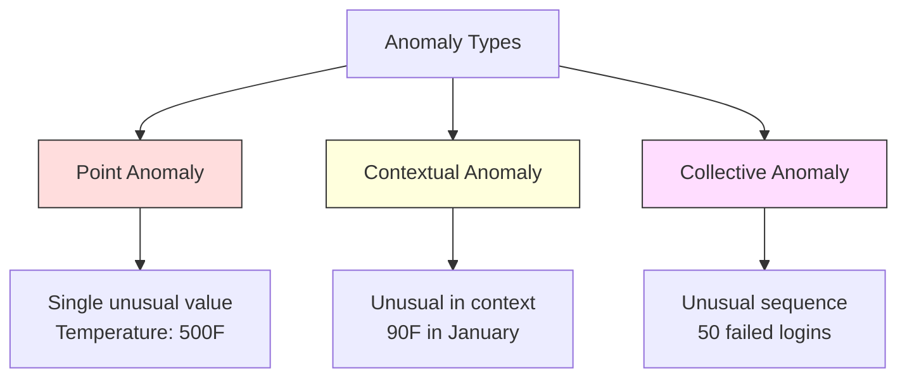
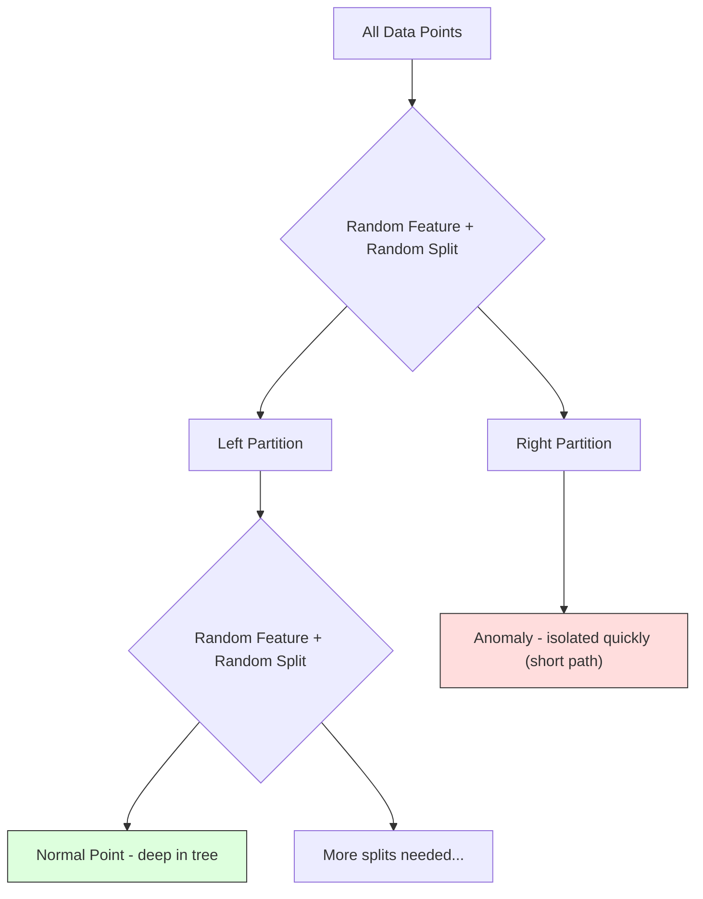
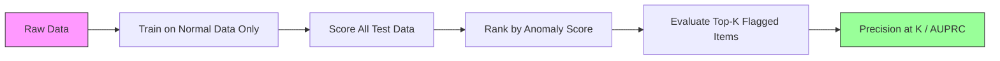

# 异常检测

> 正常很容易定义。异常是任何不合适的东西。

** 类型：** 构建
** 语言：** Python
** 先决条件：** 第2阶段，课程01-09
** 时间：** ~75分钟

## 学习目标

- 从头开始实施Z-score、IQR和Isolation Forest异常检测方法
- 区分点异常、上下文异常和集体异常，并为每个异常选择适当的检测方法
- 解释为什么异常检测被构建为对正常数据进行建模而不是对异常进行分类
- 比较无监督异常检测与监督分类，并评估新型异常覆盖率和精确度之间的权衡

## 问题

下午2点在纽约使用信用卡，下午2：05在东京使用信用卡。正常范围为80-120时，工厂传感器读数为150度。当日均200个请求时，服务器每秒发送50，000个请求。

这些都是异常现象。找到它们很重要。欺诈行为造成数十亿美元的损失。设备故障导致停工时间。网络入侵会导致数据损失。

挑战：您很少标记异常示例。欺诈占交易的0.1%。每年都会发生几次设备故障。您无法训练标准分类器，因为“异常”类中几乎没有什么可学习的东西。即使您有一些标签，您所看到的异常并不是您会遇到的唯一类型。明天的欺诈计划看起来与今天的不同。

异常检测可以扭转问题。与其学习什么是异常的，不如学习什么是正常的。任何偏离正常的事情都是可疑的。这无需标签即可工作，可适应新类型的异常，并可扩展到海量数据集。

## 概念

### 类型的异常

并非所有的异常都是一样的：

- ** 点异常。**无论上下文如何，单个数据点都不寻常。温度读数为500度。来自通常花费50美元的账户的50，000美元交易。
- ** 上下文异常。**考虑到其上下文，这一数据点是不寻常的。夏季气温90度是正常的，冬季气温异常。相同的价值，不同的背景。
- ** 集体异常。**一系列数据点，作为一个整体来说是不寻常的，尽管每个单独的点可能都是正常的。五次登录失败是正常的。连续五十次是暴力攻击。

大多数方法都会检测点异常。上下文异常需要时间或位置特征。集体异常需要序列感知方法。



### 无监督框架

在标准分类中，这两个类别都有标签。在异常检测中，您通常会遇到以下三种情况之一：

1. ** 完全无人监管 **完全没有标签。您在所有数据上拟合检测器，并希望异常足够罕见，不会破坏“正常”模型。
2. ** 半监督。**您拥有一个仅包含正常数据的干净数据集。您适合这个干净的设置并得分其他所有内容。这是尽可能最强的设置。
3. ** 监督薄弱。**您有一些标记的异常情况。使用它们进行评估，而不是培训。无监督训练，然后测量标记子集的精确度/召回率。

关键见解：异常检测与分类有根本不同。您正在建模正态数据的分布，而不是两个类别之间的决策边界。

### 监督与无监督：权衡

如果您确实标记了异常，您应该将它们用于训练（监督分类）还是仅用于评估（无监督检测）？

** 监督（视为分类）：**
- 捕捉您以前见过的异常类型
- 已知异常类型的更高精确度
- 完全错过了新颖的异常类型
- 当出现新的异常类型时需要重新培训
- 需要足够的异常示例（通常太少）

** 无监督（模型正态，标记偏差）：**
- 捕捉任何与正常的偏差，包括新颖的类型
- 不需要标记异常
- 假阳性率更高（并非所有异常都是坏的）
- 对分配转变更加稳健

在实践中，最好的系统将两者结合起来：用于广泛覆盖的无监督检测、用于已知高优先级异常类型的监督模型以及用于模糊情况的人工审查。

### Z评分法

最简单的方法。计算每个特征的平均值和标准差。标记与平均值超过k个标准差的任何点。

```text
z_score = (x - mean) / std
anomaly if |z_score| > threshold
```

默认阈值为3.0（99.7%的正常数据在高斯分布的3个标准差内）。

** 优势：** 简单。快了可解释（“该值与正常值为4.5个标准差”）。

** 弱点：** 假设数据正态分布。对训练数据中的异常值敏感（异常值会改变平均值并扩大std，使它们更难检测）。在多峰分布上失败。

** 工作良好时：** 单一特征监控，数据大致呈钟形。服务器响应时间、制造公差、具有稳定基线的传感器读数。

** 失败时：** 多集群数据（基线温度不同的两个办公地点）、倾斜数据（1000美元很少见但并非异常的交易金额）、训练集中具有异常值的数据。

### IQR方法

比Z得分更强大。使用四分位间距而不是平均值和标准差。

```
Q1 = 25th percentile
Q3 = 75th percentile
IQR = Q3 - Q1
lower_bound = Q1 - factor * IQR
upper_bound = Q3 + factor * IQR
anomaly if x < lower_bound or x > upper_bound
```

默认因子为1.5。

** 优势：** 对异常值稳健（百分位数不受极端值的影响）。适用于倾斜分布。没有正常假设。

** 弱点：** 仅限单变量（独立适用于每个功能）。只有在一起考虑特征时才能检测到异常的异常（一个点可能在每个特征中单独正常，但在关节空间中异常）。

** 实用说明：** IQR中的1.5因子对应于箱形图中的胡须。胡须之外的点是潜在的异常值。使用3.0而不是1.5使检测器更加保守（标记更少，误报更少）。正确的因素取决于您对假警报的容忍度。

### 孤立森林

关键见解：异常现象很少且各不相同。在数据的随机分区中，异常更容易隔离--它们需要更少的随机拆分才能与其余部分分离。



** 如何工作：**
1. 建造许多随机的树（隔离森林）
2. 在每个节点上，选择随机要素以及要素的最小值和最大值之间的随机拆分值
3. 继续分裂，直到每个点都被孤立（在自己的叶子中）
4. 异常在所有树上的平均路径长度都较短

** 为什么它有效：** 正常点位于密集区域。需要多次随机分裂才能将一个人与其邻居隔离。异常存在于稀疏的地区。一两次随机分裂足以隔离它们。

异常分数基于所有树的平均路径长度，并通过随机二叉搜索树的预期路径长度进行标准化：

```
score(x) = 2^(-average_path_length(x) / c(n))
```

其中“c（n）”是n个样本的预期路径长度。分数接近1意味着异常。分数接近0.5意味着正常。分数接近0意味着非常正常（在密集的集群深处）。

** 优势：** 无分布假设。适用于高维度。扩展性良好（样本大小呈亚线性，因为每棵树使用一个子样本）。处理混合特征类型。

** 弱点：** 难以应对密集区域的异常（掩蔽效应）。当许多功能不相关时，随机拆分的效果就不太好。

** 关键超参数：**
- ' n_estimators '：树的数量。100通常就足够了。越多的树会提供更稳定的分数，但计算速度较慢。
- ' max_samples '：每棵树的样本数。256是原始论文中的默认值。较小的值会使单个树的准确性较低，但会增加多样性。子采样是Isolation Forest快速的原因--每棵树都能看到一小部分数据。
- “污染”：预期异常部分。仅用于设置阈值。不影响分数本身。

### 本地异常值因子（LOF）

LOF将一个点周围的局部密度与其邻近点周围的密度进行比较。被稠密区域包围的稀疏区域中的点是异常的。

** 如何工作：**
1. 对于每个点，找到其k个最近的邻居
2. 计算局部可达性密度（邻居的密度有多高）
3. 将每个点的密度与邻近点的密度进行比较
4. 如果一个点的密度比其邻近点低得多，那么它就是异常值

**LOF分数：**
- LOF接近1.0意味着密度与邻居相似（正常）
- LOF大于1.0意味着密度低于邻近区域（可能异常）
- LOF远大于1.0（例如，2.0+）意味着密度明显较低（可能异常）

“本地”部分至关重要。考虑具有两个集群的数据集：由1000个点组成的密集集群和由50个点组成的稀疏集群。稀疏集群边缘的一个点在全球范围内并不罕见--它有50个邻居。但如果它的近邻比它的密度更大，那在当地就不寻常了。LOF捕捉到了全球方法所忽视的这种细微差别。

** 优势：** 检测局部异常（在其附近不寻常的点，即使它们在全球范围内并不异常）。适用于不同密度的集群。

** 弱点：** 大型数据集运行缓慢（对于原始实现，O（n^2））。对k的选择敏感。在非常高的维度中不能很好地工作（维度诅咒会影响距离计算）。

### 比较

| 方法 | 假设 | 速度 | 处理High Dims | 检测局部异常 |
|--------|------------|-------|-------------------|------------------------|
| z分数 | 正态分布 | 非常快 | 是（每个功能） | 没有 |
| IQR | 无（每个功能） | 非常快 | 是（每个功能） | 没有 |
| 孤立森林 | 没有一 | 快速 | 是的 | 部分 |
| LOF | 距离很有意义 | 慢 | 差 | 是的 |

### 评价挑战

评估异常检测器比评估分类器更难：

- ** 阶级极端失衡。**在0.1%的异常情况下，预测一切“正常”的准确率为99.9%。准确性是无用的。
- **AUROC具有误导性。**由于严重失衡，AUROC即使模型在实际阈值处错过了大多数异常，也可以看起来很好。
- ** 更好的指标：** 精度@k（在前k个标记的项目中，有多少是真正的异常）、AUPRC（精确度召回曲线下面积）和固定假阳性率的召回。



### 异常检测管道

在实践中，异常检测遵循以下工作流程：

1. ** 收集基线数据。**理想情况下，您知道没有（或很少）异常的时期。
2. ** 功能工程。**原始特征加上衍生特征（滚动统计数据、时间特征、比率）。
3. ** 训练探测器。**适应基线数据。该模型了解“正常”是什么样子。
4. ** 评分新数据。**每个新观察都会获得异常分数。
5. ** 阈值选择。**选择分数截止线。这是一个商业决策：更高的阈值意味着更少的误报，但遗漏的异常情况更多。
6. ** 警报并调查。**标记的点用于人工审查或自动响应。
7. ** 反馈收集。**记录标记的项目是真实异常还是虚假警报。使用此数据来评估检测器并随着时间的推移调整阈值。

管道永远不会“完成”。“数据分布发生变化，新的异常类型出现，阈值需要调整。将异常检测视为一个生命系统，而不是一次性模型。

## 建设党

' code/anorage_Detection.py '中的代码从头开始实现Z-score、IQR和Isolation Forest。

### Z得分检测器

```python
def zscore_detect(X, threshold=3.0):
    mean = X.mean(axis=0)
    std = X.std(axis=0)
    std[std == 0] = 1.0
    z = np.abs((X - mean) / std)
    return z.max(axis=1) > threshold
```

简单且载体化。如果任何特征超过阈值，则标记一个点。

### IQR检测器

```python
def iqr_detect(X, factor=1.5):
    q1 = np.percentile(X, 25, axis=0)
    q3 = np.percentile(X, 75, axis=0)
    iqr = q3 - q1
    iqr[iqr == 0] = 1.0
    lower = q1 - factor * iqr
    upper = q3 + factor * iqr
    outside = (X < lower) | (X > upper)
    return outside.any(axis=1)
```

### 隔离森林与划痕

从头开始的实现构建随机划分特征空间的隔离树：

```python
class IsolationTree:
    def __init__(self, max_depth):
        self.max_depth = max_depth

    def fit(self, X, depth=0):
        n, p = X.shape
        if depth >= self.max_depth or n <= 1:
            self.is_leaf = True
            self.size = n
            return self
        self.is_leaf = False
        self.feature = np.random.randint(p)
        x_min = X[:, self.feature].min()
        x_max = X[:, self.feature].max()
        if x_min == x_max:
            self.is_leaf = True
            self.size = n
            return self
        self.threshold = np.random.uniform(x_min, x_max)
        left_mask = X[:, self.feature] < self.threshold
        self.left = IsolationTree(self.max_depth).fit(X[left_mask], depth + 1)
        self.right = IsolationTree(self.max_depth).fit(X[~left_mask], depth + 1)
        return self
```

隔离点的路径长度决定其异常分数。路径越短意味着越反常。

`IsolationForest`类包装了多个树：

```python
class IsolationForest:
    def __init__(self, n_estimators=100, max_samples=256, seed=42):
        self.n_estimators = n_estimators
        self.max_samples = max_samples

    def fit(self, X):
        sample_size = min(self.max_samples, X.shape[0])
        max_depth = int(np.ceil(np.log2(sample_size)))
        for _ in range(self.n_estimators):
            idx = rng.choice(X.shape[0], size=sample_size, replace=False)
            tree = IsolationTree(max_depth=max_depth)
            tree.fit(X[idx])
            self.trees.append(tree)

    def anomaly_score(self, X):
        avg_path = average path length across all trees
        scores = 2.0 ** (-avg_path / c(max_samples))
        return scores
```

正规化因子“c（n）”是具有n个元素的二叉搜索树中不成功搜索的预期路径长度。它等于“2 * H（n-1）- 2*（n-1）/n”，其中“H”是调和数。这种标准化确保分数在不同大小的数据集之间具有可比性。

### 演示场景

该代码生成多个测试场景：

1. ** 具有异常值的单个集群。**一个2D高斯集群，异常注入远离中心的地方。所有方法都应该在这里起作用。
2. ** 多模式数据。**三个大小和密度不同的集群。集群之间的点是异常的。Z得分之所以困难，是因为每个功能的范围很宽。
3. ** 多维数据。** 50个特征，但异常仅在其中5个不同。测试方法是否可以在特征子集中找到异常。

每个演示使用精度、召回、F1和精度@k比较所有方法。

## 使用它

使用sklearn（使用库实现，而不是从头开始）：

```python
from sklearn.ensemble import IsolationForest
from sklearn.neighbors import LocalOutlierFactor

iso = IsolationForest(n_estimators=100, contamination=0.05, random_state=42)
iso.fit(X_train)
predictions = iso.predict(X_test)

lof = LocalOutlierFactor(n_neighbors=20, contamination=0.05, novelty=True)
lof.fit(X_train)
predictions = lof.predict(X_test)
```

请注意，“污染”设置了异常的预期比例。正确设置很重要--太低会错过异常，太高会产生假警报。

'异常_检测.py '中的代码将从头开始的实现与相同数据上的sklearn进行了比较。

### sklearn污染参数

sklearn中的“污染”参数确定将连续异常分数转换为二元预测的阈值。它不会改变基础分数。

```python
iso_5 = IsolationForest(contamination=0.05)
iso_10 = IsolationForest(contamination=0.10)
```

两者都会产生相同的异常分数。但“iso_5”标记前5%，而“iso_10”标记前10%。如果您不知道真实的异常率（通常不知道），请将污染设置为“自动”并直接处理原始分数。根据假阳性和假阴性之间的成本权衡设置您自己的阈值。

### 单类支持向量机

另一个值得了解的无监督异常检测器。单类支持机在多维特征空间中围绕正常数据的边界（使用核技巧）。

```python
from sklearn.svm import OneClassSVM

oc_svm = OneClassSVM(kernel="rbf", gamma="auto", nu=0.05)
oc_svm.fit(X_train)
predictions = oc_svm.predict(X_test)
```

“nu”参数接近异常的比例。单类支持机器人在中小数据集上运行良好，但无法扩展到非常大的数据（核矩阵以二次方式增长）。

### 自动编码器方法（预览）

自动编码器是学习压缩和重建数据的神经网络。使用正常数据进行训练。在测试时，异常具有很高的重建误差，因为网络只学会重建正常模式。

第3阶段（深度学习）涵盖了这一点，但原则是相同的：对正常情况进行建模，标记偏离情况。

### 注册异常检测

正如集成方法改进分类（第11课）一样，组合多个异常检测器也改进了检测。最简单的方法：

1. 运行多个检测器（Z分数、IQR、隔离森林、LOF）
2. 将每个检测器的分数标准化为[0，1]
3. 平均标准化分数
4. 标记分数高于平均分阈值

这减少了假阳性，因为不同的方法具有不同的失败模式。所有四种方法标记的点几乎肯定是异常的。只有一个人标记的点可能是该方法的一个怪癖。

更复杂的组合通过其估计的可靠性（在具有已知异常（如果有的话）的验证集上测量）来加权每个检测器。

### 生产考虑因素

1. ** 阈值漂移。**随着数据分布的变化，固定阈值变得过时。监控异常分数的分布并定期调整。
2. ** 警惕疲劳。**误报太多，操作员不再关注。从高阈值开始（更少、更可靠的警报），并随着信任的建立而降低阈值。
3. ** 包围法 **在生产中，组合多个检测器。仅当多个方法一致认为某个点异常时，才标记该点。这大大减少了误报。
4. ** 功能工程。**原始功能往往不够。添加滚动统计数据、比率、自上次事件以来的时间和特定于域的功能。一个好的功能集比检测器的选择更重要。
5. ** 反馈循环。**当操作员调查标记的物品并确认或驳回它们时，将其反馈到系统中。随着时间的推移积累标记数据，以评估和改进检测器。

## 把它运

本课产生：
- '输出/skill-anomaly-detector.md '--选择正确检测器的决策技能
- '代码/异常_检测.py '-- Z-score、IQR和Isolation Forest从头开始，并进行sklearn比较

### 选择阈值

异常分数是连续的。您需要一个阈值来做出二元决策。这是一个商业决策，而不是技术决策。

考虑两种情况：
- ** 欺诈检测。**缺失的欺诈行为代价高昂（退款、客户信任）。假警报花费了人类分析师5分钟的时间来调查。将门槛设置得较低，以发现更多欺诈行为，接受更多误报。
- ** 设备维护。**虚惊意味着不必要的关闭将造成5万美元的损失。错过的故障意味着需要50万美元的修复。设置阈值以平衡这些成本。

在这两种情况下，最佳阈值取决于假阳性和假阴性之间的成本比。在不同阈值下绘制精确度和召回率，叠加成本函数，并选择最小成本点。

### 扩大生产规模

对于生产中的实时异常检测：

1. ** 批量培训，在线评分。**根据最近的正常数据定期（每天、每周）训练模型。在每个新观察到达时对其进行评分。
2. ** 特征计算必须匹配。**如果您在30天内使用滚动统计数据进行训练，则需要30天的历史记录来计算新观察的特征。缓冲所需的历史记录。
3. ** 分数分布监控。**跟踪异常分数随时间的分布。如果中位数得分向上漂移，则要么数据正在变化，要么模型已经过时。
4. ** 解释性。**当您标记异常时，请说明原因。Z评分：“特征X比正常值高出4.2个标准差。“隔离森林：”该点平均被隔离3.1次（正常分为8.5次）。"

## 演习

1. ** 调整阈值。**以0.5的步骤运行阈值从1.0到5.0运行Z分数检测器。绘制每个阈值的准确率和召回率。您的数据的最佳点在哪里？

2. ** 多变量异常。**创建2D数据，其中每个特征单独看起来正常，但组合是异常的（例如，远离主聚类对角线的点）。显示每个特征的Z得分错过了这些，但隔离森林抓住了它们。

3. **LOF从头开始。**使用k近邻实现本地异常值因子。在相同数据上与sklearn的LocalOutlierFactor进行比较。使用k=10和k=50 --k的选择如何影响结果？

4. ** 流媒体异常检测。**修改Z得分检测器以在流媒体设置中工作：随着新点到达，更新运行平均值和方差（Welford的在线算法）。与相同数据上的批次Z评分进行比较。

5. ** 真实世界的评价。**取一个已知异常的数据集（例如，来自Kaggle的信用卡欺诈）。使用精密度@100、精密度@500和AUPRC评价所有四种方法。哪种方法效果最好？为什么？

## 关键术语

| Term | 别人怎么说 | 它实际上意味着什么 |
|------|----------------|----------------------|
| 异常 | “异常点，异常点” | 与正常数据的预期模式显着偏离的数据点 |
| 点异常 | “一个奇怪的价值” | 无论背景如何，都不寻常的个人观察 |
| 背景异常 | “正常值，错误的上下文” | 考虑到其背景（时间、地点等），观察结果不寻常但在另一种情况下可能是正常的 |
| 孤立森林 | “随机分裂以寻找异常值” | 随机树的集合，以比正常点更少的分裂来隔离异常 |
| 局部离群因子 | “将密度与邻居进行比较” | 一种标记局部密度远低于邻居密度的点的方法 |
| z分数 | “平均值的标准差” | （x - mean）/ std，以标准差为单位测量一点距离中心有多远 |
| IQR | “四分位范围” | Q3 - Q1，测量中间50%数据的传播，用于稳健的离群值检测 |
| 污染 | “预期异常比例” | 超参数告诉检测器应该将多大比例的数据标记为异常 |
| 精度@k | “在顶级k旗中，有多少是真实的” | 仅在k个最可疑的点上计算精度，对于不平衡的异常检测有用 |
| AUPRC | “准确率-召回曲线下面积” | 一个指标，总结了所有阈值的精确召回性能，优于不平衡数据的AUROC |

## 进一步阅读

- [Liu等人，隔离森林（2008）]（https：//cs.nju.edu.cn/zhouzh/zhouzh.files/publication/icdm08b.pdf）--隔离森林原始论文
- [Breunig等人，LOF：识别基于密度的本地异常值（2000）]（https：//dl.acm.org/doi/10.1145/342009.335388）--LOF原始论文
- [scikit-learn异常检测文档]（https：//scikit-learn.org/stable/modules/outlier_Detection.html）--所有sklearn异常检测器概述
- [莫拉等人，异常检测：调查（2009）]（https：//dl.acm.org/doi/10.1145/1541880.1541882）--异常检测方法全面调查
- [Goldstein和Uchida，无监督异常检测算法的比较评估（2016）]（https：journals.plos.org/plosone/article? id=10.1371/journal.pone.0152173）--真实数据集10种方法的经验比较
