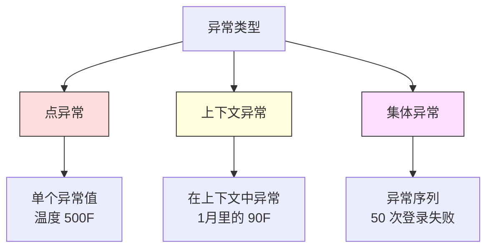
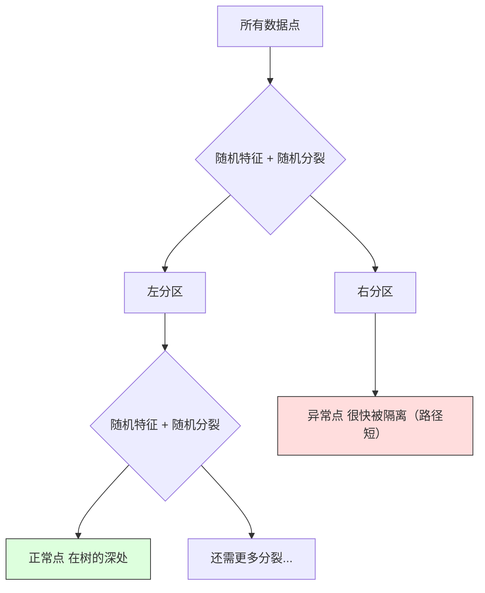
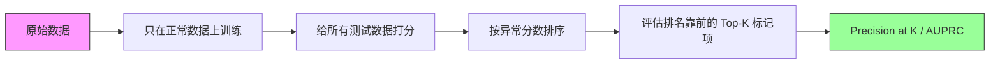

# 异常检测（Anomaly Detection）

> 译注：本文译自同目录 [`en.md`](./en.md)。术语遵循仓根 [TRANSLATION_GUIDE.md](../../../../TRANSLATION_GUIDE.md)。

> 正常很容易定义。不正常就是任何不合群的东西。

**Type:** Build
**Language:** Python
**Prerequisites:** Phase 2, Lessons 01-09
**Time:** ~75 minutes

## 学习目标（Learning Objectives）

- 从零实现 Z-score、IQR 和 Isolation Forest 三种异常检测方法
- 区分点异常（point anomaly）、上下文异常（contextual anomaly）、集体异常（collective anomaly），并为每一类挑出合适的检测方法
- 解释为什么异常检测是建模「正常数据」而不是给「异常」做分类
- 对比无监督异常检测与有监督分类，权衡新型异常的覆盖率与精度（precision）

## 问题（The Problem）

一张信用卡下午 2 点在纽约刷卡，下午 2:05 又在东京刷卡。某工厂传感器读数为 150 度，而正常范围是 80–120 度。某服务器每秒发出 5 万次请求，而日均才 200 次。

这些都是异常。把它们找出来很重要。欺诈造成数十亿损失。设备故障导致停机。网络入侵导致数据泄露。

挑战在于：你几乎拿不到带标签的异常样本。欺诈只占交易的 0.1%。设备故障一年才发生几次。你没法训练一个标准分类器，因为「异常」这一类里几乎没有东西可学。即便你有一些标签，已经见过的异常也不是未来唯一会遇到的类型。明天的欺诈手法长得跟今天的不一样。

异常检测把问题翻了个面。与其学习什么是「不正常」，不如学习什么是「正常」。任何偏离正常的都可疑。这种做法不依赖标签、能适应新型异常、且能扩展到海量数据集。

## 概念（The Concept）

### 异常的类型（Types of Anomalies）

异常并不都是一回事：

- **点异常（Point anomalies）。** 单个数据点本身就异常，与上下文无关。一次 500 度的温度读数。一笔 5 万美元的交易，而这个账户平时只花 50 美元。
- **上下文异常（Contextual anomalies）。** 在给定上下文下才异常的数据点。90 度（华氏）夏天正常，冬天就异常了。同样的数值，上下文不同结论不同。
- **集体异常（Collective anomalies）。** 一组数据点作为整体异常，尽管每个单点单独看都正常。5 次登录失败正常。连续 50 次就是暴力破解。

大多数方法只检测点异常。上下文异常需要时间或位置特征。集体异常需要对序列敏感的方法。



### 无监督的建模视角（The Unsupervised Framing）

在标准分类里，两个类别都有标签。在异常检测中，你通常处于以下三种情形之一：

1. **完全无监督（Fully unsupervised）。** 完全没有标签。你在所有数据上拟合检测器，并寄希望于异常足够稀少，不会污染「正常」模型。
2. **半监督（Semi-supervised）。** 你有一份干净的、只包含正常数据的训练集。你在这份干净数据上拟合，再给其他所有数据打分。条件允许时，这是最强的设定。
3. **弱监督（Weakly supervised）。** 你有少量带标签的异常。把它们用于评估，而不是训练。先无监督训练，再在带标签的子集上算 precision/recall。

关键洞见：异常检测从根本上就跟分类不一样。你建模的是正常数据的分布，而不是两类之间的决策边界。

### 有监督 vs 无监督：权衡（Supervised vs Unsupervised: The Tradeoff）

如果你确实有带标签的异常，到底是用来训练（有监督分类），还是只用来评估（无监督检测）？

**有监督（当作分类问题）：**
- 能精准抓住你过去见过的那些类型
- 在已知异常类型上 precision 更高
- 完全错过新型异常
- 出现新异常类型时需要重新训练
- 需要足够多的异常样本（通常远远不够）

**无监督（建模正常，标记偏离）：**
- 能抓住任何偏离正常的情况，包括新类型
- 不需要带标签的异常
- 误报率（false positive rate）更高（不寻常未必是坏事）
- 对分布漂移更稳健

实践中最好的系统会两者结合：用无监督检测获得宽覆盖，用有监督模型处理已知的高优先级异常类型，再加上人工复核处理模糊案例。

### Z-score 方法（Z-Score Method）

最简单的方法。对每个特征计算均值和标准差。任何偏离均值超过 k 倍标准差的点都标记为异常。

```text
z_score = (x - mean) / std
anomaly if |z_score| > threshold
```

默认阈值是 3.0（在高斯分布下，99.7% 的正常数据落在 3 倍标准差以内）。

**优点：** 简单、快速、可解释（「这个值离正常值有 4.5 倍标准差」）。

**缺点：** 假设数据服从正态分布。对训练数据中的离群值很敏感（离群值会拉偏均值、抬高标准差，反而让自己更难被检出）。在多峰分布上失效。

**适用场景：** 数据大致呈钟形的单特征监控。服务器响应时间、制造工艺公差、基线稳定的传感器读数。

**失效场景：** 多簇数据（两个办公室基线温度不同）、偏态数据（交易金额，1000 美元少见但不算异常）、训练集中本就含离群值的数据。

### IQR 方法（IQR Method）

比 Z-score 更稳健。用四分位距（interquartile range）替代均值和标准差。

```
Q1 = 25th percentile
Q3 = 75th percentile
IQR = Q3 - Q1
lower_bound = Q1 - factor * IQR
upper_bound = Q3 + factor * IQR
anomaly if x < lower_bound or x > upper_bound
```

默认 factor 是 1.5。

**优点：** 对离群值稳健（百分位不受极端值影响）。在偏态分布上也能用。不假设正态。

**缺点：** 只能逐特征单变量地用。无法发现「单看每个特征都正常、合在一起才异常」的点（一个点在每个特征上都正常，但在联合空间里却异常）。

**实操注意：** IQR 里的 1.5 倍因子对应箱线图（box plot）的须线。须线之外就是潜在离群点。把 1.5 改成 3.0 会让检测器更保守（标记更少，误报更少）。具体取多少要看你对误报的容忍度。

### Isolation Forest

关键洞见：异常少而异。在对数据做随机划分时，异常更容易被孤立——它们只需更少的随机切分就能从其他点中分离出来。



**工作原理：**
1. 构建多棵随机树（一个 isolation forest）
2. 在每个节点上，随机选一个特征，再在该特征的最小值和最大值之间随机选一个切分值
3. 一直切到每个点都被孤立（独占一个叶子）
4. 异常在所有树上的平均路径长度更短

**为什么有效：** 正常点住在密集区域。需要很多次随机切分才能把它从邻居中分离。异常住在稀疏区域。一两次随机切分就够把它孤立。

异常分数基于所有树的平均路径长度，并用一棵随机二叉搜索树的期望路径长度做归一化：

```
score(x) = 2^(-average_path_length(x) / c(n))
```

其中 `c(n)` 是 n 个样本的期望路径长度。分数接近 1 表示异常。接近 0.5 表示正常。接近 0 表示「非常正常」（藏在密集簇深处）。

**优点：** 不假设分布。在高维（high dimensions）下也能用。可扩展性好（样本量上是亚线性的，因为每棵树只用子样本）。能处理混合特征类型。

**缺点：** 对密集区域中的异常表现不佳（masking effect，掩蔽效应）。当大量特征不相关时，随机切分效率会下降。

**关键超参数：**
- `n_estimators`：树的数量。100 通常够用。树多了分数更稳定，但计算更慢。
- `max_samples`：每棵树用的样本数。原论文默认 256。值小一点单棵树会变弱，但多样性更高。Isolation Forest 之所以快，靠的就是这种子采样——每棵树只看一小部分数据。
- `contamination`：预期异常比例。仅用于设定阈值，不影响分数本身。

### 局部离群因子（Local Outlier Factor，LOF）

LOF 比较一个点周围的局部密度与它邻居周围的密度。一个点位于稀疏区域、却被密集区域包围，那它就是异常。

**工作原理：**
1. 对每个点，找到它的 k 个最近邻
2. 计算局部可达密度（local reachability density，邻域有多密）
3. 把每个点的密度跟邻居们的密度比一比
4. 如果一个点的密度远低于邻居，那它就是离群点

**LOF 分数：**
- LOF 接近 1.0：与邻居密度相近（正常）
- LOF 大于 1.0：密度低于邻居（潜在异常）
- LOF 远大于 1.0（如 2.0+）：密度显著低于邻居（很可能是异常）

「局部」二字是关键。考虑这样一个数据集：一个由 1000 个点组成的密集簇，加一个由 50 个点组成的稀疏簇。稀疏簇边缘上的某个点全局看并不奇怪——它有 50 个邻居。但如果它周围的邻居比它更密集，那它在局部就是奇怪的。LOF 抓住了全局方法忽略掉的这种细微差异。

**优点：** 能检测局部异常（在邻域中显得奇怪，即使在全局看不奇怪）。在不同密度的簇上都能用。

**缺点：** 在大数据集上慢（朴素实现是 O(n^2)）。对 k 的选择敏感。在很高维数据上效果差（维度灾难影响距离计算）。

### 对比（Comparison）

| Method | Assumptions | Speed | Handles High Dims | Detects Local Anomalies |
|--------|------------|-------|-------------------|------------------------|
| Z-score | Normal distribution | Very fast | Yes (per feature) | No |
| IQR | None (per feature) | Very fast | Yes (per feature) | No |
| Isolation Forest | None | Fast | Yes | Partially |
| LOF | Distance is meaningful | Slow | Poorly | Yes |

### 评估的难点（Evaluation Challenges）

评估异常检测器比评估分类器更棘手：

- **极端类别不均衡。** 异常占 0.1% 的情况下，把所有样本都预测为「正常」就能拿到 99.9% 的准确率（accuracy）。准确率毫无意义。
- **AUROC 会误导人。** 在严重不均衡下，即使模型在实际阈值处漏掉了大部分异常，AUROC 看起来也可能很漂亮。
- **更好的指标：** Precision@k（前 k 个被标记的样本里有多少是真异常）、AUPRC（precision-recall 曲线下面积）、固定误报率下的 recall。



### 异常检测流水线（Anomaly Detection Pipeline）

实践中，异常检测大致按下面的流程走：

1. **采集基线数据（baseline data）。** 最理想的是一段你确信没有（或几乎没有）异常的时段。
2. **特征工程。** 原始特征加上派生特征（滑动统计量、时间特征、比值）。
3. **训练检测器。** 在基线数据上拟合，模型学会「正常」长什么样。
4. **给新数据打分。** 每条新观察都会拿到一个异常分数。
5. **选阈值。** 选定分数的截断点。这是业务决策：阈值越高误报越少，但漏报越多。
6. **告警与调查。** 被标记的点交给人工复核或自动响应。
7. **采集反馈。** 记录被标记的样本到底是真异常还是误报。用这些数据评估检测器并随时间调整阈值。

这条流水线永远不会「收工」。数据分布会漂移、新型异常会冒出来、阈值需要不断调整。把异常检测当成一个活的系统来运营，不是一次性建好的模型。

## 动手实现（Build It）

`code/anomaly_detection.py` 中的代码从零实现了 Z-score、IQR 和 Isolation Forest。

### Z-score 检测器（Z-Score Detector）

```python
def zscore_detect(X, threshold=3.0):
    mean = X.mean(axis=0)
    std = X.std(axis=0)
    std[std == 0] = 1.0
    z = np.abs((X - mean) / std)
    return z.max(axis=1) > threshold
```

简单、向量化。只要任一特征超过阈值就标记。

### IQR 检测器（IQR Detector）

```python
def iqr_detect(X, factor=1.5):
    q1 = np.percentile(X, 25, axis=0)
    q3 = np.percentile(X, 75, axis=0)
    iqr = q3 - q1
    iqr[iqr == 0] = 1.0
    lower = q1 - factor * iqr
    upper = q3 + factor * iqr
    outside = (X < lower) | (X > upper)
    return outside.any(axis=1)
```

### 从零实现 Isolation Forest（Isolation Forest from Scratch）

从零实现的版本会构建对特征空间做随机划分的 isolation 树：

```python
class IsolationTree:
    def __init__(self, max_depth):
        self.max_depth = max_depth

    def fit(self, X, depth=0):
        n, p = X.shape
        if depth >= self.max_depth or n <= 1:
            self.is_leaf = True
            self.size = n
            return self
        self.is_leaf = False
        self.feature = np.random.randint(p)
        x_min = X[:, self.feature].min()
        x_max = X[:, self.feature].max()
        if x_min == x_max:
            self.is_leaf = True
            self.size = n
            return self
        self.threshold = np.random.uniform(x_min, x_max)
        left_mask = X[:, self.feature] < self.threshold
        self.left = IsolationTree(self.max_depth).fit(X[left_mask], depth + 1)
        self.right = IsolationTree(self.max_depth).fit(X[~left_mask], depth + 1)
        return self
```

孤立一个点所需的路径长度决定了它的异常分数。路径越短越异常。

`IsolationForest` 类把多棵树打包到一起：

```python
class IsolationForest:
    def __init__(self, n_estimators=100, max_samples=256, seed=42):
        self.n_estimators = n_estimators
        self.max_samples = max_samples

    def fit(self, X):
        sample_size = min(self.max_samples, X.shape[0])
        max_depth = int(np.ceil(np.log2(sample_size)))
        for _ in range(self.n_estimators):
            idx = rng.choice(X.shape[0], size=sample_size, replace=False)
            tree = IsolationTree(max_depth=max_depth)
            tree.fit(X[idx])
            self.trees.append(tree)

    def anomaly_score(self, X):
        avg_path = average path length across all trees
        scores = 2.0 ** (-avg_path / c(max_samples))
        return scores
```

归一化因子 `c(n)` 是 n 个元素的二叉搜索树中一次失败查找的期望路径长度，等于 `2 * H(n-1) - 2*(n-1)/n`，其中 `H` 是调和数。这个归一化让不同样本量下的分数也能横向比较。

### 演示场景（Demo Scenarios）

代码中生成了多个测试场景：

1. **单簇加离群点。** 一个 2D 高斯簇，再在远离中心的位置注入异常。所有方法都应该能搞定。
2. **多峰数据。** 三个大小和密度不同的簇。簇与簇之间的点是异常。Z-score 在这里很吃力，因为逐特征看范围很大。
3. **高维数据。** 50 个特征，但异常只在其中 5 个上不同。考察方法能否在特征子集中找到异常。

每个 demo 都会用 precision、recall、F1 和 Precision@k 对所有方法做横向对比。

## 用起来（Use It）

用 sklearn（库里现成实现，不是从零写的）：

```python
from sklearn.ensemble import IsolationForest
from sklearn.neighbors import LocalOutlierFactor

iso = IsolationForest(n_estimators=100, contamination=0.05, random_state=42)
iso.fit(X_train)
predictions = iso.predict(X_test)

lof = LocalOutlierFactor(n_neighbors=20, contamination=0.05, novelty=True)
lof.fit(X_train)
predictions = lof.predict(X_test)
```

注意 `contamination` 设定了异常的预期比例。设对很关键——太低会漏掉异常，太高会制造误报。

`anomaly_detection.py` 里把从零实现的版本和 sklearn 在同一份数据上做了对比。

### sklearn 的 contamination 参数（sklearn Contamination Parameter）

sklearn 中的 `contamination` 参数决定把连续异常分数转成二元预测时的阈值。它不会改变底层分数本身。

```python
iso_5 = IsolationForest(contamination=0.05)
iso_10 = IsolationForest(contamination=0.10)
```

两者输出的异常分数完全一样。但 `iso_5` 标记得分前 5%，`iso_10` 标记前 10%。如果你不知道真实异常率（通常都不知道），把 contamination 设成 `"auto"`，直接用原始分数。基于误报和漏报之间的代价权衡，自己定阈值。

### One-Class SVM

另一个值得了解的无监督异常检测器。One-Class SVM 通过核技巧（kernel trick）在高维特征空间里围着正常数据画一条边界。

```python
from sklearn.svm import OneClassSVM

oc_svm = OneClassSVM(kernel="rbf", gamma="auto", nu=0.05)
oc_svm.fit(X_train)
predictions = oc_svm.predict(X_test)
```

`nu` 参数近似异常的比例。One-Class SVM 在中小数据集上表现不错，但在超大数据上扩展性差（核矩阵以平方级增长）。

### 自编码器思路（预告）（Autoencoder Approach (Preview)）

自编码器（autoencoder）是一种学习压缩并重建数据的神经网络。在正常数据上训练。测试时，异常会有更高的重建误差，因为网络只学会了如何重建正常模式。

这部分在 Phase 3（深度学习）会讲，但思路是一样的：建模什么是正常，标记偏离的部分。

### 集成式异常检测（Ensemble Anomaly Detection）

正如集成方法（ensemble methods）能改善分类（第 11 课），把多个异常检测器组合起来也能改善检测。最简单的做法：

1. 同时跑多个检测器（Z-score、IQR、Isolation Forest、LOF）
2. 把每个检测器的分数归一化到 [0, 1]
3. 对归一化后的分数求平均
4. 在平均分数上设阈值并标记

这样能减少误报，因为不同方法的失效模式不同。被四种方法都标记的点几乎一定是异常。只被一种方法标记的点，可能只是该方法的特殊偏好。

更复杂的集成会按各检测器的可靠性给权重（如果有带标签的验证集，可以在上面估计可靠性）。

### 生产环境注意事项（Production Considerations）

1. **阈值漂移。** 数据分布变了，固定阈值就过时了。监控异常分数的分布，并定期调整。
2. **告警疲劳。** 误报太多，运维就麻木了。先用高阈值（更少、更可靠的告警），等信任建立起来再降。
3. **集成方法。** 在生产中组合多个检测器。多个方法都认为异常时才标记。这能显著降低误报。
4. **特征工程。** 原始特征通常不够。加上滑动统计量、比值、距上一次事件的时间间隔以及领域专属特征。一套好特征比挑哪个检测器更重要。
5. **反馈闭环。** 当运维人员调查被标记的样本并确认或驳回时，把结果回灌系统。慢慢攒出带标签的数据，用于评估并改进检测器。

## 上线部署（Ship It）

本课产出：
- `outputs/skill-anomaly-detector.md` —— 一份「如何选检测器」的决策技能
- `code/anomaly_detection.py` —— 从零实现的 Z-score、IQR 和 Isolation Forest，并与 sklearn 对比

### 怎么挑阈值（Choosing a Threshold）

异常分数是连续的。要做二元决策就需要阈值。这是个业务决策，不是技术决策。

考虑两种场景：
- **欺诈检测。** 漏掉欺诈代价高（拒付、客户信任）。一次误报让分析师花 5 分钟去查。把阈值调低，多抓欺诈，接受更多误报。
- **设备维护。** 误报意味着不必要的停机，损失 5 万美元。漏掉故障意味着 50 万美元的维修。把阈值调到能平衡这两份代价的位置。

两种情形中，最优阈值都取决于误报与漏报之间的代价比。在不同阈值下画出 precision 和 recall，叠加上代价函数，挑成本最低的点。

### 扩展到生产（Scaling to Production）

要在生产中做实时异常检测：

1. **批训练，在线打分。** 周期性地（按天、按周）在最近的正常数据上训练模型。每条新观察一到就打分。
2. **特征计算必须保持一致。** 如果训练时用的是 30 天滑动统计，那为新观察算特征时也得有 30 天的历史。把所需历史缓存起来。
3. **分数分布监控。** 跟踪异常分数随时间的分布。如果中位数在向上漂移，要么数据在变，要么模型过期了。
4. **可解释性（explainability）。** 标记一个异常时，说出原因。Z-score：「特征 X 比正常值高了 4.2 倍标准差。」Isolation Forest：「这个点平均只用 3.1 次切分就被孤立（正常点要 8.5 次）。」

## 练习（Exercises）

1. **阈值调参。** 用 Z-score 检测器，把阈值从 1.0 到 5.0 以 0.5 为步长跑一遍。在每个阈值下画出 precision 和 recall。你的数据上甜点在哪？

2. **多变量异常。** 构造一份 2D 数据：每个特征单独看都正常，但组合起来异常（比如远离主簇对角线的点）。证明逐特征 Z-score 抓不到、Isolation Forest 抓得到。

3. **从零实现 LOF。** 用 k 近邻实现 Local Outlier Factor。在同一份数据上对比 sklearn 的 LocalOutlierFactor。试 k=10 和 k=50——k 的选择对结果影响有多大？

4. **流式异常检测。** 把 Z-score 检测器改成流式版本：随着新点到来在线更新均值和方差（Welford 在线算法）。在同一份数据上跟批量 Z-score 对比。

5. **真实世界评估。** 找一份带异常标签的数据集（例如 Kaggle 上的信用卡欺诈数据）。用 precision@100、precision@500 和 AUPRC 评估全部四种方法。哪个表现最好？为什么？

## 关键术语（Key Terms）

| Term | What people say | What it actually means |
|------|----------------|----------------------|
| Anomaly | "Outlier, unusual point" | A data point that deviates significantly from the expected pattern of normal data |
| Point anomaly | "A single weird value" | An individual observation that is unusual regardless of context |
| Contextual anomaly | "Normal value, wrong context" | An observation that is unusual given its context (time, location, etc.) but might be normal in another context |
| Isolation Forest | "Random splits to find outliers" | An ensemble of random trees that isolates anomalies with fewer splits than normal points |
| Local Outlier Factor | "Compare density to neighbors" | A method that flags points whose local density is much lower than their neighbors' density |
| Z-score | "Standard deviations from mean" | (x - mean) / std, measuring how far a point is from the center in units of standard deviation |
| IQR | "Interquartile range" | Q3 - Q1, measuring the spread of the middle 50% of data, used for robust outlier detection |
| Contamination | "Expected fraction of anomalies" | A hyperparameter telling the detector what proportion of the data it should flag as anomalous |
| Precision@k | "Of the top k flags, how many are real" | Precision computed on only the k most suspicious points, useful for imbalanced anomaly detection |
| AUPRC | "Area under precision-recall curve" | A metric that summarizes precision-recall performance across all thresholds, better than AUROC for imbalanced data |

## 延伸阅读（Further Reading）

- [Liu et al., Isolation Forest (2008)](https://cs.nju.edu.cn/zhouzh/zhouzh.files/publication/icdm08b.pdf) —— Isolation Forest 原始论文
- [Breunig et al., LOF: Identifying Density-Based Local Outliers (2000)](https://dl.acm.org/doi/10.1145/342009.335388) —— LOF 原始论文
- [scikit-learn Outlier Detection docs](https://scikit-learn.org/stable/modules/outlier_detection.html) —— sklearn 全部异常检测器概览
- [Chandola et al., Anomaly Detection: A Survey (2009)](https://dl.acm.org/doi/10.1145/1541880.1541882) —— 异常检测方法的综合调研
- [Goldstein and Uchida, A Comparative Evaluation of Unsupervised Anomaly Detection Algorithms (2016)](https://journals.plos.org/plosone/article?id=10.1371/journal.pone.0152173) —— 在真实数据集上对 10 种方法的实证对比
