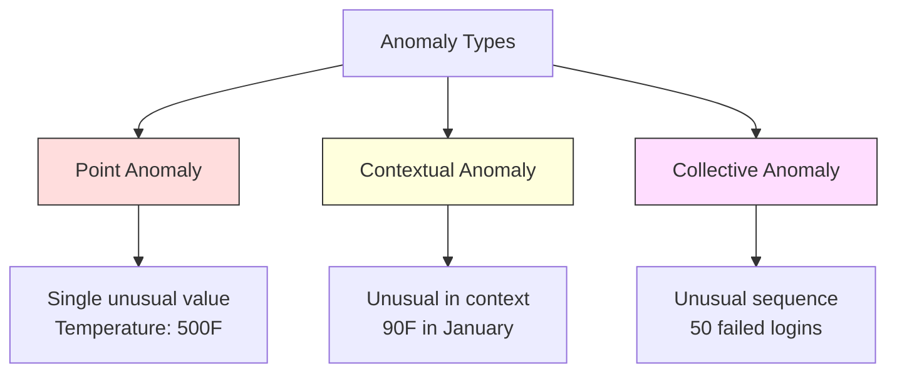
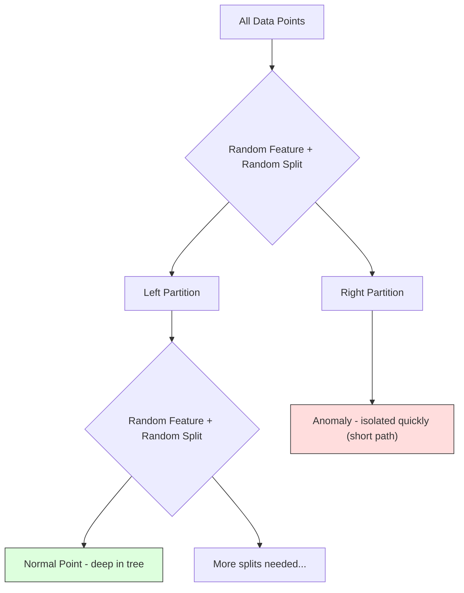
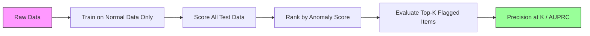

# 16 · 异常检测

> 正常很容易定义。异常就是一切不符合正常的东西。

**类型：** 实战构建
**语言：** Python
**前置：** 第二阶段，第 01-09 课
**时长：** 约 75 分钟

## 学习目标

- 从零实现 Z-score（Z 分数）、IQR（四分位距）和 Isolation Forest（孤立森林）三种异常检测方法
- 区分点异常、上下文异常和集体异常，并为每一种选择合适的检测方法
- 解释为什么异常检测被建模为「对正常数据建模」而非「对异常进行分类」
- 比较无监督异常检测与有监督分类，并权衡「覆盖新型异常」与「保证精确率」之间的取舍

## 问题

一张信用卡下午 2 点在纽约消费，下午 2:05 又在东京消费。一个工厂传感器读数为 150 度，而正常范围是 80-120 度。一台服务器每秒发出 50,000 个请求，而日均只有 200 个。

这些都是异常。找出它们至关重要。欺诈造成数十亿损失。设备故障造成停机损失。网络入侵造成数据泄露。

挑战在于：你很少拥有带标注的异常样本。欺诈只占全部交易的 0.1%。设备故障一年只发生几次。你无法训练一个标准分类器，因为「异常」这一类别中几乎没有什么可供学习的东西。即便你有一些标注，你见过的那些异常也并非你将来会遇到的全部类型。明天的欺诈手法和今天的看起来截然不同。

异常检测把这个问题反转过来。与其学习什么是异常，不如学习什么是正常。任何偏离正常的东西都是可疑的。这种做法无需标注、能适应新型异常，并且可以扩展到海量数据集。

## 概念

### 异常的类型

并非所有异常都一样：

- **点异常（point anomaly）。** 单个数据点，无论上下文如何都显得异常。比如 500 度的温度读数；一个平时只花 50 美元的账户出现了一笔 50,000 美元的交易。
- **上下文异常（contextual anomaly）。** 在其上下文下显得异常的数据点。90 度在夏天是正常的，在冬天则是异常的。同样的数值，不同的上下文。
- **集体异常（collective anomaly）。** 作为一个整体显得异常的数据点序列，尽管每个单独的点可能都正常。五次登录失败是正常的，连续五十次则是一次暴力破解攻击。

大多数方法检测的是点异常。上下文异常需要时间或位置特征。集体异常需要能感知序列的方法。



### 无监督的建模框架

在标准分类中，你拥有两个类别的标注。而在异常检测中，你通常面对以下三种情形之一：

1. **完全无监督。** 完全没有标注。你在全部数据上拟合检测器，并寄希望于异常足够稀少，不至于污染「正常」模型。
2. **半监督。** 你拥有一个仅包含正常数据的干净数据集。你在这个干净集上拟合，再给其余一切打分。条件允许时，这是最强的设置。
3. **弱监督。** 你拥有少量带标注的异常。把它们用于评估，而非训练。先做无监督训练，再在带标注子集上度量精确率/召回率。

关键洞见在于：异常检测从根本上不同于分类。你建模的是正常数据的分布，而非两个类别之间的决策边界。

### 有监督 vs 无监督：取舍

如果你确实拥有带标注的异常，应该把它们用于训练（有监督分类）还是仅用于评估（无监督检测）？

**有监督（当作分类处理）：**
- 能捕捉你以前见过的那些确切的异常类型
- 在已知异常类型上有更高的精确率
- 会完全错过新型异常
- 出现新异常类型时需要重新训练
- 需要足够多的异常样本（往往太少）

**无监督（建模正常，标记偏离）：**
- 能捕捉任何对正常的偏离，包括新型异常
- 不需要带标注的异常
- 误报率更高（并非所有异常的东西都是坏事）
- 对分布漂移更鲁棒

实践中，最好的系统会结合两者：用无监督检测做广覆盖，用有监督模型应对已知的高优先级异常类型，再用人工复核处理模糊情形。

### Z-score 方法

最简单的方法。计算每个特征的均值和标准差。标记任何距离均值超过 k 个标准差的点。

```text
z_score = (x - mean) / std
anomaly if |z_score| > threshold
```

默认阈值为 3.0（对于高斯分布，99.7% 的正常数据落在 3 个标准差范围内）。

**优点：** 简单、快速、可解释（「这个值距离正常有 4.5 个标准差」）。

**缺点：** 假设数据服从正态分布。对训练数据中的离群值敏感（离群值会拉动均值并抬高标准差，反而使它们更难被检测出来）。在多峰分布上失效。

**何时表现好：** 数据大致呈钟形分布的单特征监控。服务器响应时间、制造公差、基线稳定的传感器读数。

**何时失效：** 多簇数据（两个办公地点有不同的基线温度）、偏态数据（交易金额，其中 1000 美元罕见但并不异常）、训练集中含有离群值的数据。

### IQR 方法

比 Z-score 更鲁棒。使用四分位距（interquartile range）而非均值和标准差。

```
Q1 = 25th percentile
Q3 = 75th percentile
IQR = Q3 - Q1
lower_bound = Q1 - factor * IQR
upper_bound = Q3 + factor * IQR
anomaly if x < lower_bound or x > upper_bound
```

默认系数为 1.5。

**优点：** 对离群值鲁棒（分位数不受极端值影响）。适用于偏态分布。无需正态性假设。

**缺点：** 仅单变量（对每个特征独立应用）。无法检测那些只有在多个特征联合考虑时才异常的点（某个点可能在每个特征上单独看都正常，但在联合空间中异常）。

**实践提示：** IQR 中的 1.5 系数对应箱线图中的须线（whiskers）。落在须线之外的点是潜在的离群值。用 3.0 代替 1.5 会使检测器更保守（标记更少、误报更少）。合适的系数取决于你对误报的容忍度。

### Isolation Forest（孤立森林）

关键洞见在于：异常既少又与众不同。在对数据的随机划分中，异常更容易被孤立——把它们与其余数据分开所需的随机切分更少。



**工作原理：**
1. 构建许多棵随机树（一个孤立森林）
2. 在每个节点上，随机选取一个特征，并在该特征的最小值与最大值之间随机选取一个切分值
3. 不断切分，直到每个点都被孤立（独占一个叶子节点）
4. 异常点在所有树上的平均路径长度更短

**为什么有效：** 正常点位于稠密区域。要把一个点从邻居中孤立出来，需要许多次随机切分。异常点位于稀疏区域。一两次随机切分就足以将它们孤立。

异常分数基于所有树上的平均路径长度，并用随机二叉搜索树的期望路径长度做归一化：

```
score(x) = 2^(-average_path_length(x) / c(n))
```

其中 `c(n)` 是 n 个样本的期望路径长度。分数接近 1 表示异常。分数接近 0.5 表示正常。分数接近 0 表示非常正常（深藏于稠密簇中）。

**优点：** 无分布假设。在高维空间中有效。扩展性好（在样本量上是亚线性的，因为每棵树只用一个子样本）。能处理混合特征类型。

**缺点：** 在稠密区域中的异常上表现吃力（掩盖效应，masking effect）。当存在许多无关特征时，随机切分的效果会变差。

**关键超参数：**
- `n_estimators`：树的数量。100 通常就够了。树越多分数越稳定，但计算越慢。
- `max_samples`：每棵树的样本数。256 是原论文中的默认值。更小的值会让单棵树的准确性降低，但提升多样性。子采样正是孤立森林之所以快的原因——每棵树只看到数据的一小部分。
- `contamination`：异常的预期比例。仅用于设定阈值。它不影响分数本身。

### Local Outlier Factor（局部离群因子，LOF）

LOF 将某个点周围的局部密度与其邻居周围的密度进行比较。一个处于稀疏区域、却被稠密区域包围的点就是异常的。

**工作原理：**
1. 对每个点，找出它的 k 个最近邻
2. 计算局部可达密度（local reachability density，即邻域有多稠密）
3. 将每个点的密度与其邻居的密度进行比较
4. 如果某个点的密度远低于其邻居，它就是离群点

**LOF 分数：**
- LOF 接近 1.0 表示与邻居密度相近（正常）
- LOF 大于 1.0 表示密度低于邻居（可能异常）
- LOF 远大于 1.0（如 2.0 以上）表示密度显著偏低（很可能是异常）

「局部」这一点至关重要。设想一个含两个簇的数据集：一个有 1000 个点的稠密簇，一个有 50 个点的稀疏簇。稀疏簇边缘的某个点在全局看来并不异常——它有 50 个邻居。但如果它紧邻的邻居比它更稠密，那它在局部就是异常的。LOF 捕捉到了全局方法会漏掉的这种细微差别。

**优点：** 能检测局部异常（在其邻域中异常、即便在全局并不异常的点）。能处理密度不同的簇。

**缺点：** 在大数据集上慢（朴素实现为 O(n^2)）。对 k 的选择敏感。在非常高维的空间中表现不佳（维度灾难会影响距离计算）。

### 对比

| 方法 | 假设 | 速度 | 处理高维 | 检测局部异常 |
|--------|------------|-------|-------------------|------------------------|
| Z-score | 正态分布 | 非常快 | 是（逐特征） | 否 |
| IQR | 无（逐特征） | 非常快 | 是（逐特征） | 否 |
| Isolation Forest | 无 | 快 | 是 | 部分 |
| LOF | 距离有意义 | 慢 | 较差 | 是 |

### 评估的挑战

评估异常检测器比评估分类器更难：

- **极端的类别不平衡。** 在 0.1% 异常的情况下，把一切都预测为「正常」就能得到 99.9% 的准确率。准确率毫无用处。
- **AUROC 会误导人。** 在严重不平衡下，即便模型在实用阈值上漏掉了大多数异常，AUROC 看起来也可能很好。
- **更好的指标：** Precision@k（在被标记的前 k 个项目中，有多少是真实异常）、AUPRC（精确率-召回率曲线下面积）、以及固定误报率下的召回率。



### 异常检测流水线

实践中，异常检测遵循以下工作流程：

1. **收集基线数据。** 理想情况下，选取一段你确知没有（或极少）异常的时期。
2. **特征工程。** 原始特征加上派生特征（滚动统计量、时间特征、比率）。
3. **训练检测器。** 在基线数据上拟合。模型学习「正常」是什么样子。
4. **给新数据打分。** 每个新观测值都获得一个异常分数。
5. **阈值选择。** 选定分数截断点。这是一个业务决策：阈值越高意味着误报越少，但漏掉的异常越多。
6. **告警与调查。** 被标记的点交给人工复核或自动响应。
7. **反馈收集。** 记录被标记的项目究竟是真实异常还是误报。用这些数据来评估检测器，并随时间调整阈值。

这条流水线永远「做不完」。数据分布会漂移、新型异常会出现、阈值需要调整。把异常检测当作一个有生命的系统，而非一次性的模型。

## 动手构建

`code/anomaly_detection.py` 中的代码从零实现了 Z-score、IQR 和 Isolation Forest。

### Z-score 检测器

```python
def zscore_detect(X, threshold=3.0):
    mean = X.mean(axis=0)
    std = X.std(axis=0)
    std[std == 0] = 1.0
    z = np.abs((X - mean) / std)
    return z.max(axis=1) > threshold
```

简单且向量化。只要任一特征超过阈值就标记该点。

### IQR 检测器

```python
def iqr_detect(X, factor=1.5):
    q1 = np.percentile(X, 25, axis=0)
    q3 = np.percentile(X, 75, axis=0)
    iqr = q3 - q1
    iqr[iqr == 0] = 1.0
    lower = q1 - factor * iqr
    upper = q3 + factor * iqr
    outside = (X < lower) | (X > upper)
    return outside.any(axis=1)
```

### 从零实现 Isolation Forest

这个从零实现的版本构建孤立树，对特征空间进行随机划分：

```python
class IsolationTree:
    def __init__(self, max_depth):
        self.max_depth = max_depth

    def fit(self, X, depth=0):
        n, p = X.shape
        if depth >= self.max_depth or n <= 1:
            self.is_leaf = True
            self.size = n
            return self
        self.is_leaf = False
        self.feature = np.random.randint(p)
        x_min = X[:, self.feature].min()
        x_max = X[:, self.feature].max()
        if x_min == x_max:
            self.is_leaf = True
            self.size = n
            return self
        self.threshold = np.random.uniform(x_min, x_max)
        left_mask = X[:, self.feature] < self.threshold
        self.left = IsolationTree(self.max_depth).fit(X[left_mask], depth + 1)
        self.right = IsolationTree(self.max_depth).fit(X[~left_mask], depth + 1)
        return self
```

孤立一个点所需的路径长度决定了它的异常分数。路径越短意味着越异常。

`IsolationForest` 类包装了多棵树：

```python
class IsolationForest:
    def __init__(self, n_estimators=100, max_samples=256, seed=42):
        self.n_estimators = n_estimators
        self.max_samples = max_samples

    def fit(self, X):
        sample_size = min(self.max_samples, X.shape[0])
        max_depth = int(np.ceil(np.log2(sample_size)))
        for _ in range(self.n_estimators):
            idx = rng.choice(X.shape[0], size=sample_size, replace=False)
            tree = IsolationTree(max_depth=max_depth)
            tree.fit(X[idx])
            self.trees.append(tree)

    def anomaly_score(self, X):
        avg_path = average path length across all trees
        scores = 2.0 ** (-avg_path / c(max_samples))
        return scores
```

归一化因子 `c(n)` 是在含 n 个元素的二叉搜索树中一次失败查找的期望路径长度。它等于 `2 * H(n-1) - 2*(n-1)/n`，其中 `H` 是调和数。这个归一化确保分数在不同规模的数据集之间可比。

### 演示场景

代码生成了多个测试场景：

1. **带离群值的单簇。** 一个二维高斯簇，并注入远离中心的异常点。所有方法在这里都应该有效。
2. **多峰数据。** 三个大小和密度各异的簇。簇之间的点是异常的。Z-score 在此表现吃力，因为逐特征的取值范围很宽。
3. **高维数据。** 50 个特征，但异常只在其中 5 个上有差异。用于测试方法能否在特征子集中找出异常。

每个演示都用精确率、召回率、F1 和 Precision@k 来对比所有方法。

## 实际运用

使用 sklearn（采用库的实现，而非从零实现）：

```python
from sklearn.ensemble import IsolationForest
from sklearn.neighbors import LocalOutlierFactor

iso = IsolationForest(n_estimators=100, contamination=0.05, random_state=42)
iso.fit(X_train)
predictions = iso.predict(X_test)

lof = LocalOutlierFactor(n_neighbors=20, contamination=0.05, novelty=True)
lof.fit(X_train)
predictions = lof.predict(X_test)
```

注意 `contamination` 设定的是异常的预期比例。正确设置它很重要——设得太低会漏掉异常，设得太高会制造误报。

`anomaly_detection.py` 中的代码在相同数据上将从零实现与 sklearn 进行了对比。

### sklearn 的 contamination 参数

sklearn 中的 `contamination` 参数决定了将连续异常分数转换为二元预测时的阈值。它不会改变底层的分数。

```python
iso_5 = IsolationForest(contamination=0.05)
iso_10 = IsolationForest(contamination=0.10)
```

两者产生相同的异常分数。但 `iso_5` 标记最高的 5%，而 `iso_10` 标记最高的 10%。如果你不知道真实的异常率（通常都不知道），就把 contamination 设为 "auto" 并直接使用原始分数。再根据误报与漏报之间的代价权衡，自行设定阈值。

### 单类 SVM（One-Class SVM）

另一个值得了解的无监督异常检测器。单类 SVM 在高维特征空间中围绕正常数据拟合一个边界（使用核技巧）。

```python
from sklearn.svm import OneClassSVM

oc_svm = OneClassSVM(kernel="rbf", gamma="auto", nu=0.05)
oc_svm.fit(X_train)
predictions = oc_svm.predict(X_test)
```

`nu` 参数近似表示异常的比例。单类 SVM 在中小型数据集上表现良好，但无法扩展到超大数据（核矩阵以平方级增长）。

### 自编码器方法（预告）

自编码器（autoencoder）是学习压缩并重建数据的神经网络。在正常数据上训练。在测试时，异常会有很高的重建误差，因为网络只学会了重建正常模式。

这部分将在第三阶段（深度学习）中讲解，但原理是一样的：建模什么是正常，标记偏离的部分。

### 集成异常检测

正如集成方法能改进分类（第 11 课），组合多个异常检测器也能改进检测。最简单的做法：

1. 运行多个检测器（Z-score、IQR、Isolation Forest、LOF）
2. 将每个检测器的分数归一化到 [0, 1]
3. 对归一化后的分数取平均
4. 标记平均分数高于阈值的点

这能减少误报，因为不同方法有不同的失效模式。被全部四种方法标记的点几乎肯定是异常。仅被一种方法标记的点可能只是该方法的怪癖。

更复杂的集成会按各检测器的估计可靠性给它们加权（如果有带已知异常的验证集，可在其上度量）。

### 生产环境考量

1. **阈值漂移。** 随着数据分布变化，固定阈值会过时。监控异常分数的分布并定期调整。
2. **告警疲劳。** 误报过多，操作员就不再关注。先从高阈值起步（告警更少、更可靠），随着信任建立再逐步降低。
3. **集成方法。** 在生产环境中，组合多个检测器。只有当多个方法一致认为某点异常时才标记它。这能显著减少误报。
4. **特征工程。** 原始特征很少够用。添加滚动统计量、比率、距上次事件的时间，以及领域特定特征。一套好的特征比检测器的选择更重要。
5. **反馈回路。** 当操作员调查被标记的项目并确认或排除它们时，把这一信息反馈回系统。随时间积累带标注的数据，用以评估并改进检测器。

## 交付上线

本课产出：
- `outputs/skill-anomaly-detector.md` —— 一个用于选择合适检测器的决策技能（skill）
- `code/anomaly_detection.py` —— 从零实现的 Z-score、IQR 和 Isolation Forest，并附带 sklearn 对比

### 选择阈值

异常分数是连续的。你需要一个阈值来做出二元决策。这是业务决策，而非技术决策。

考虑两个场景：
- **欺诈检测。** 漏掉欺诈代价高昂（拒付、客户信任）。一次误报只会让人工分析师花 5 分钟去调查。把阈值设低些以捕捉更多欺诈，接受更多误报。
- **设备维护。** 一次误报意味着不必要的停机，损失 50,000 美元。漏掉一次故障则意味着 500,000 美元的维修。设定阈值以平衡这些代价。

两种情况下，最优阈值都取决于误报与漏报之间的代价比。在不同阈值上绘制精确率和召回率，叠加代价函数，选取代价最小的点。

### 扩展到生产环境

对于生产环境中的实时异常检测：

1. **批量训练，在线打分。** 定期（每天、每周）在近期的正常数据上训练模型。每个新观测值到达时即对其打分。
2. **特征计算必须一致。** 如果你训练时用了 30 天的滚动统计量，那么计算新观测值的特征时也需要 30 天的历史。要缓冲所需的历史数据。
3. **分数分布监控。** 跟踪异常分数随时间的分布。如果中位数分数向上漂移，要么是数据在变化，要么是模型已过时。
4. **可解释性。** 当你标记一个异常时，要说明原因。Z-score：「特征 X 比正常高出 4.2 个标准差。」Isolation Forest：「这个点平均在 3.1 次切分内就被孤立（正常点需要 8.5 次）。」

## 练习

1. **阈值调优。** 用从 1.0 到 5.0、步长为 0.5 的阈值运行 Z-score 检测器。在每个阈值上绘制精确率和召回率。对你的数据来说，最佳平衡点在哪里？

2. **多变量异常。** 构造一组二维数据，每个特征单独看都正常，但其组合却是异常的（例如远离主簇对角线的点）。证明逐特征的 Z-score 会漏掉这些点，而 Isolation Forest 能捕捉到。

3. **从零实现 LOF。** 使用 k 最近邻实现局部离群因子。在相同数据上与 sklearn 的 LocalOutlierFactor 对比。分别用 k=10 和 k=50——k 的选择如何影响结果？

4. **流式异常检测。** 修改 Z-score 检测器，使其能在流式场景下工作：随着新点到达，更新滑动均值和方差（Welford 在线算法）。在相同数据上与批量 Z-score 对比。

5. **真实世界评估。** 取一个含已知异常的数据集（例如 Kaggle 上的信用卡欺诈数据）。用 precision@100、precision@500 和 AUPRC 评估全部四种方法。哪种方法表现最好？为什么？

## 关键术语

| 术语 | 人们常说 | 实际含义 |
|------|----------------|----------------------|
| 异常（Anomaly） | 「离群点、不寻常的点」 | 显著偏离正常数据预期模式的数据点 |
| 点异常（Point anomaly） | 「单个奇怪的值」 | 无论上下文如何都显得异常的单个观测值 |
| 上下文异常（Contextual anomaly） | 「值正常，上下文不对」 | 在其上下文（时间、位置等）下异常、但在另一上下文中可能正常的观测值 |
| Isolation Forest | 「用随机切分找离群点」 | 一组随机树的集成，孤立异常所需的切分比正常点更少 |
| Local Outlier Factor | 「把密度和邻居比较」 | 标记那些局部密度远低于其邻居密度的点的方法 |
| Z-score | 「距均值多少个标准差」 | (x - mean) / std，以标准差为单位度量一个点距中心有多远 |
| IQR | 「四分位距」 | Q3 - Q1，度量数据中间 50% 的分散程度，用于鲁棒的离群检测 |
| Contamination | 「异常的预期比例」 | 一个超参数，告诉检测器它应当把多大比例的数据标记为异常 |
| Precision@k | 「前 k 个标记中有多少是真的」 | 仅在最可疑的 k 个点上计算的精确率，对不平衡的异常检测很有用 |
| AUPRC | 「精确率-召回率曲线下面积」 | 在所有阈值上概括精确率-召回率表现的指标，对不平衡数据比 AUROC 更好 |

## 延伸阅读

- [Liu et al., Isolation Forest (2008)](https://cs.nju.edu.cn/zhouzh/zhouzh.files/publication/icdm08b.pdf) —— 孤立森林的原始论文
- [Breunig et al., LOF: Identifying Density-Based Local Outliers (2000)](https://dl.acm.org/doi/10.1145/342009.335388) —— LOF 的原始论文
- [scikit-learn 离群检测文档](https://scikit-learn.org/stable/modules/outlier_detection.html) —— 所有 sklearn 异常检测器的概览
- [Chandola et al., Anomaly Detection: A Survey (2009)](https://dl.acm.org/doi/10.1145/1541880.1541882) —— 异常检测方法的综合性综述
- [Goldstein and Uchida, A Comparative Evaluation of Unsupervised Anomaly Detection Algorithms (2016)](https://journals.plos.org/plosone/article?id=10.1371/journal.pone.0152173) —— 在真实数据集上对 10 种方法的实证比较
