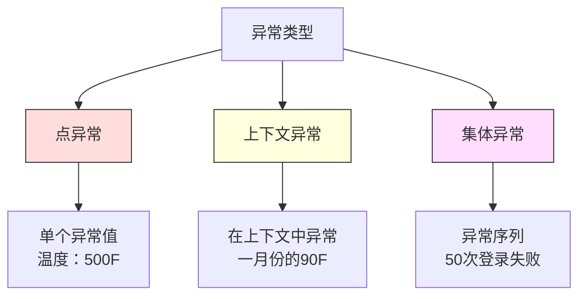

# 异常检测

> 正常很容易定义。异常就是任何不符合正常范式的事物。

**类型：** 构建
**语言：** Python
**前置要求：** 第二阶段，第01-09课
**时间：** 约75分钟

## 学习目标

- 从零实现Z分数（Z-score）、四分位距（IQR）和孤立森林（Isolation Forest）异常检测方法
- 区分点异常、上下文异常和集体异常，并为每种类型选择合适的检测方法
- 解释为什么异常检测被构建为对正常数据建模，而非对异常进行分类
- 比较无监督异常检测与有监督分类，并评估新型异常覆盖率和精度之间的权衡

## 问题

一张信用卡下午2点在纽约使用，然后下午2:05在东京使用。一个工厂传感器读数为150度，而正常范围是80-120度。一台服务器每秒发送50,000个请求，而日均是200个。

这些就是异常。发现它们很重要。欺诈造成数十亿美元的损失。设备故障导致停机。网络入侵导致数据泄露。

挑战在于：你很少拥有标记好的异常样本。欺诈只占交易的0.1%。设备故障一年发生几次。你无法训练一个标准的分类器，因为“异常”类中几乎没有什么可以学习。即使你有一些标签，你所见过的异常类型也不是你唯一会遇到的那些。明天的欺诈手法与今天的不同。

异常检测反转了问题。与其学习什么是异常的，不如学习什么是正常的。任何偏离正常的都值得怀疑。这种方法无需标签，能够适应新型异常，并且可以扩展到大规模数据集。

## 概念

### 异常的类型

并非所有异常都一样：

- **点异常（Point anomalies）。** 单个数据点，无论上下文如何都是异常的。500度的温度读数。一笔5万美元的交易，而该账户通常消费50美元。
- **上下文异常（Contextual anomalies）。** 给定其上下文才显得异常的数据点。夏天90度是正常的，冬天则是异常的。相同的值，不同的上下文。
- **集体异常（Collective anomalies）。** 一组数据点，作为一个整体是异常的，即使单个点可能是正常的。五次登录失败是正常的。连续五十次就是暴力破解攻击。

大多数方法检测点异常。上下文异常需要时间或位置特征。集体异常需要序列感知方法。



### 无监督的框架

在标准分类中，你拥有两个类别的标签。在异常检测中，你通常会遇到以下三种情况之一：

1. **完全无监督（Fully unsupervised）。** 完全没有标签。你在所有数据上拟合检测器，并希望异常足够罕见，不至于破坏“正常”模型。
2. **半监督（Semi-supervised）。** 你拥有一个只包含正常数据的干净数据集。在这个干净集上拟合，然后对任何其他数据进行评分。这是可能情况下最强的设置。
3. **弱监督（Weakly supervised）。** 你有少量标记过的异常。将它们用于评估，而不是训练。以无监督方式训练，然后在标记的子集上测量精确率和召回率。

关键洞察：异常检测从根本上不同于分类。你是在对正常数据的分布进行建模，而不是在两个类之间划分决策边界。

### 有监督 vs 无监督：权衡

如果你确实有标记过的异常，你应该将它们用于训练（有监督分类）还是仅用于评估（无监督检测）？

**有监督（当作分类处理）：**
- 能捕获你以前见过的确切异常类型
- 对已知异常类型有更高的精确率
- 完全遗漏新型异常
- 当新型异常出现时需要重新训练
- 需要足够的异常样本（往往太少）

**无监督（对正常建模，标记偏差）：**
- 能捕获任何偏离正常的情况，包括新型异常
- 不需要标记的异常
- 误报率较高（并非所有不寻常的事都是坏事）
- 对分布漂移更鲁棒

在实践中，最好的系统将两者结合：无监督检测用于广泛覆盖，有监督模型用于已知的高优先级异常类型，人工审核用于模棱两可的情况。

### Z分数方法

最简单的方法。计算每个特征的均值和标准差。标记任何距离均值超过 k 个标准差的点。

```text
z_score = (x - mean) / std
anomaly if |z_score| > threshold
```

默认阈值为3.0（对于高斯分布，99.7%的正常数据落在3个标准差内）。

**优势：** 简单。快速。可解释（“这个值偏离正常4.5个标准差”）。

**劣势：** 假设数据服从正态分布。对训练数据中的异常值敏感（异常值会移动均值并膨胀标准差，使它们更难被检测）。在多峰分布上失效。

**何时工作良好：** 数据大致呈钟形分布的单特征监控。服务器响应时间、制造公差、具有稳定基线的传感器读数。

**何时失效：** 多簇数据（两个办公地点有不同的基线温度）、偏斜数据（交易金额，其中1000美元罕见但并非异常）、训练集中包含异常值的数据。

### IQR方法

比Z分数更鲁棒。使用四分位距代替均值和标准差。

```
Q1 = 第25百分位数
Q3 = 第75百分位数
IQR = Q3 - Q1
lower_bound = Q1 - factor * IQR
upper_bound = Q3 + factor * IQR
anomaly if x < lower_bound or x > upper_bound
```

默认因子为1.5。

**优势：** 对异常值鲁棒（百分位数不受极端值影响）。适用于偏斜分布。无需正态性假设。

**劣势：** 仅适用于单变量（每个特征独立应用）。无法检测仅在特征组合时才显得异常的样本（一个点在每个特征上单独看可能是正常的，但在联合空间中却是异常的）。

**实践提示：** IQR中的1.5因子对应于箱线图的触须。触须外部的点是潜在的异常值。使用3.0代替1.5会使检测器更保守（更少的标记，更少的误报）。正确的因子取决于你对虚警的容忍度。

### 孤立森林

关键洞察：异常是稀少且不同的。在数据的随机划分中，异常更容易被隔离——它们需要更少的随机分割就能与其余数据分离。


**工作原理：**
1. 构建许多随机树（孤立的森林）
2. 在每个节点，随机选择一个特征，以及该特征最小值和最大值之间的随机分割值
3. 持续分割直到每个点都被孤立（在自己的叶子节点）
4. 异常在所有树中的平均路径长度更短

**为什么有效：** 正常点位于密集区域。需要多次随机分割才能将一个点与邻居隔离。异常点位于稀疏区域。一两次随机分割就足以将他们隔离。

异常分数基于所有树的平均路径长度，通过随机二叉搜索树的期望路径长度进行归一化：

```
score(x) = 2^(-average_path_length(x) / c(n))
```

其中 `c(n)` 是 n 个样本的期望路径长度。分数接近1意味着异常。分数接近0.5意味着正常。分数接近0意味着非常正常（位于密集簇的深处）。

**优势：** 无分布假设。适用于高维数据。扩展性好（因为每棵树使用的都是子样本，计算复杂度与样本量呈次线性关系）。处理混合特征类型。

**劣势：** 在密集区域中难以检测异常（掩蔽效应）。当许多特征不相关时，随机分割效果较差。

**关键超参数：**
- `n_estimators`：树的数量。100通常足够。更多的树能得到更稳定的分数，但计算更慢。
- `max_samples`：每棵树的样本数。原始论文中默认是256。较小的值会使单棵树精确度降低，但增加多样性。子采样正是孤立森林快速的原因——每棵树只看到一小部分数据。
- `contamination`：预期的异常比例。仅用于设置阈值。不影响分数本身。

### 局部异常因子（LOF）

LOF比较一个点周围的局部密度与其邻居周围的密度。一个位于稀疏区域、周围是密集区域的点是异常的。

**工作原理：**
1. 对于每个点，找到它的 k 个最近邻居
2. 计算局部可达密度（邻域有多密集）
3. 将每个点的密度与其邻居的密度进行比较
4. 如果一个点的密度远低于其邻居，则该点是异常值

**LOF分数：**
- LOF接近1.0表示与邻居密度相似（正常）
- LOF大于1.0表示密度低于邻居（可能是异常的）
- LOF远大于1.0（例如2.0+）表示密度显著更低（很可能是异常）

“局部”部分至关重要。考虑一个包含两个簇的数据集：一个有1000个点的密集簇和一个有50个点的稀疏簇。稀疏簇边缘的一个点在全局上并不异常——它周围有50个邻居。但如果它的直接邻居比它更密集，那么它在局部就是异常的。LOF捕获了全局方法忽略的这种细微差别。

**优势：** 检测局部异常（在其邻域内异常的点，即使它们在全局上并不异常）。适用于不同密度的簇。

**劣势：** 在大数据集上速度慢（朴素实现为O(n^2)）。对 k 的选择敏感。在高维空间中效果不佳（维度灾难影响距离计算）。

### 比较

| 方法 | 假设 | 速度 | 处理高维 | 检测局部异常 |
|------|------|------|----------|--------------|
| Z分数 | 正态分布 | 非常快 | 是（按特征） | 否 |
| IQR | 无（按特征） | 非常快 | 是（按特征） | 否 |
| 孤立森林 | 无 | 快 | 是 | 部分 |
| LOF | 距离有意义 | 慢 | 差 | 是 |

### 评估挑战

评估异常检测器比评估分类器更难：

- **极端类别不平衡。** 当异常只占0.1%时，对所有样本都预测“正常”就能得到99.9%的准确率。准确率没有用。
- **AUROC具有误导性。** 在严重不平衡下，AUROC可能看起来很好，即使模型在实际阈值下错过了大多数异常。
- **更好的指标：** Precision@k（在标记的前k个项目中，有多少是真正的异常）、AUPRC（精确率-召回率曲线下面积）以及在固定假正率下的召回率。

```mermaid
flowchart LR
    A[原始数据] --> B[仅对正常数据训练]
    B --> C[对所有测试数据评分]
    C --> D[按异常分数排序]
    D --> E[评估前K个标记项目]
    E --> F[Precision@K / AUPRC]

    style A fill:#f9f,stroke:#333
    style F fill:#9f9,stroke:#333
```

### 异常检测流水线

在实践中，异常检测遵循以下工作流程：

1. **收集基线数据。** 理想情况下，是已知没有（或极少数）异常的时期。
2. **特征工程。** 原始特征加上衍生特征（滚动统计量、时间特征、比率）。
3. **训练检测器。** 在基线数据上拟合。模型学会了“正常”的样子。
4. **对新数据评分。** 每个新观测值获得一个异常分数。
5. **选择阈值。** 选择分数截断点。这是一个业务决策：更高的阈值意味着更少的虚警，但更多的异常被遗漏。
6. **告警并调查。** 被标记的点交由人工审核或自动响应。
7. **收集反馈。** 记录标记项是真正异常还是误报。使用这些数据评估检测器并随时间调整阈值。

流水线永远不是“完成”的。数据分布漂移，新型异常出现，阈值需要调整。将异常检测视为一个不断演进的系统，而非一次性模型。

## 构建它

`code/anomaly_detection.py` 中的代码实现了从零开始的Z分数、IQR和孤立森林。

### Z分数检测器

```python
def zscore_detect(X, threshold=3.0):
    mean = X.mean(axis=0)
    std = X.std(axis=0)
    std[std == 0] = 1.0
    z = np.abs((X - mean) / std)
    return z.max(axis=1) > threshold
```

简单且向量化。如果任何特征超过阈值，则标记该点。

### IQR检测器

```python
def iqr_detect(X, factor=1.5):
    q1 = np.percentile(X, 25, axis=0)
    q3 = np.percentile(X, 75, axis=0)
    iqr = q3 - q1
    iqr[iqr == 0] = 1.0
    lower = q1 - factor * iqr
    upper = q3 + factor * iqr
    outside = (X < lower) | (X > upper)
    return outside.any(axis=1)
```

### 从零实现孤立森林

从零实现的孤立树随机划分特征空间：

```python
class IsolationTree:
    def __init__(self, max_depth):
        self.max_depth = max_depth

    def fit(self, X, depth=0):
        n, p = X.shape
        if depth >= self.max_depth or n <= 1:
            self.is_leaf = True
            self.size = n
            return self
        self.is_leaf = False
        self.feature = np.random.randint(p)
        x_min = X[:, self.feature].min()
        x_max = X[:, self.feature].max()
        if x_min == x_max:
            self.is_leaf = True
            self.size = n
            return self
        self.threshold = np.random.uniform(x_min, x_max)
        left_mask = X[:, self.feature] < self.threshold
        self.left = IsolationTree(self.max_depth).fit(X[left_mask], depth + 1)
        self.right = IsolationTree(self.max_depth).fit(X[~left_mask], depth + 1)
        return self
```

隔离一个点所需的路径长度决定了它的异常分数。更短的路径意味着更异常。

`IsolationForest` 类包装了多棵树：

```python
class IsolationForest:
    def __init__(self, n_estimators=100, max_samples=256, seed=42):
        self.n_estimators = n_estimators
        self.max_samples = max_samples

    def fit(self, X):
        sample_size = min(self.max_samples, X.shape[0])
        max_depth = int(np.ceil(np.log2(sample_size)))
        for _ in range(self.n_estimators):
            idx = rng.choice(X.shape[0], size=sample_size, replace=False)
            tree = IsolationTree(max_depth=max_depth)
            tree.fit(X[idx])
            self.trees.append(tree)

    def anomaly_score(self, X):
        avg_path = 所有树中的平均路径长度
        scores = 2.0 ** (-avg_path / c(max_samples))
        return scores
```

归一化因子 `c(n)` 是在包含 n 个元素的二叉搜索树中进行一次不成功搜索的期望路径长度。它等于 `2 * H(n-1) - 2*(n-1)/n`，其中 `H` 是调和数。这种归一化确保了分数在不同大小的数据集之间具有可比性。

### 演示场景

代码生成了多个测试场景：

1. **单个簇加异常值。** 一个二维高斯簇，在远离中心的位置注入异常。所有方法在这里都应该有效。
2. **多峰数据。** 三个不同大小和密度的簇。簇之间的点是异常的。Z分数表现不佳，因为按特征看范围很宽。
3. **高维数据。** 50个特征，但异常只在其中5个特征上有差异。测试方法是否能在特征子集中找到异常。

每个演示使用精确率、召回率、F1和Precision@k比较所有方法。

## 使用它

使用sklearn（使用库实现，而非从零实现）：

```python
from sklearn.ensemble import IsolationForest
from sklearn.neighbors import LocalOutlierFactor

iso = IsolationForest(n_estimators=100, contamination=0.05, random_state=42)
iso.fit(X_train)
predictions = iso.predict(X_test)

lof = LocalOutlierFactor(n_neighbors=20, contamination=0.05, novelty=True)
lof.fit(X_train)
predictions = lof.predict(X_test)
```

注意 `contamination` 设置了预期的异常比例。正确设置它很重要——太低会漏掉异常，太高会产生误报。

`anomaly_detection.py` 中的代码将从头实现与 sklearn 在相同数据上进行了比较。

### sklearn 的 contamination 参数

sklearn 中的 `contamination` 参数决定了将连续异常分数转换为二元预测的阈值。它不改变底层分数。

