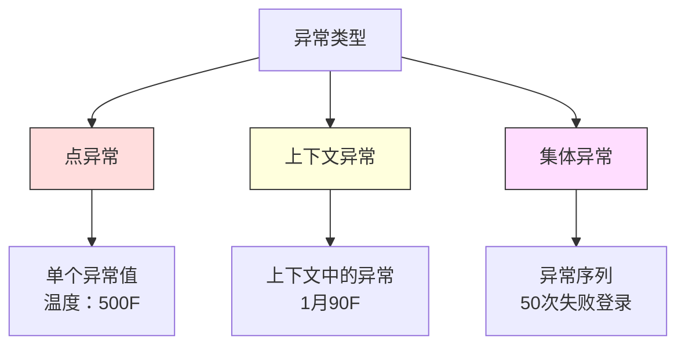
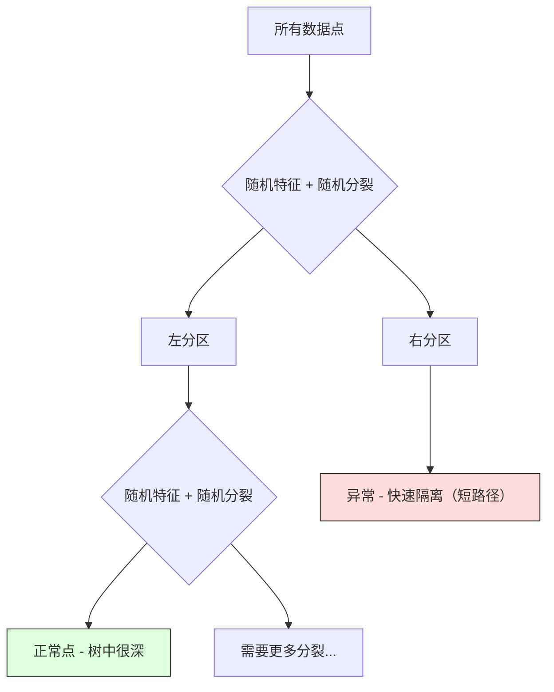

# 异常检测

> 正常很容易定义。异常就是任何不符合的东西。

**类型：** 构建
**语言：** Python
**前置要求：** 第二阶段，第01-09课
**时间：** ~75分钟

## 学习目标

- 从头实现 Z-score、IQR 和孤立森林（Isolation Forest）异常检测方法
- 区分点异常、上下文异常和集体异常，并为每种类型选择适当的检测方法
- 解释为什么异常检测被构建为建模正常数据而不是分类异常
- 比较无监督异常检测与监督分类，并评估新异常类型覆盖率和精确率之间的权衡

## 问题

一张信用卡下午2点在纽约使用，然后在下午2:05在东京使用。一个工厂传感器读取150度，而正常范围是80-120。一台服务器每秒发送50,000个请求，而日平均值是200。

这些是异常。发现它们很重要。欺诈损失数十亿。设备故障损失停机时间。网络入侵损失数据。

挑战：你很少有标记的异常样本。欺诈只占交易的0.1%。设备故障每年发生几次。你不能训练一个标准分类器，因为"异常"类几乎没有可学习的样本。即使你有一些标签，你见过的异常也不是你会遇到的唯一类型。明天的欺诈方案与今天不同。

异常检测翻转了问题。不是学习什么是异常，而是学习什么是正常。任何偏离正常的东西都是可疑的。这无需标签即可工作，适应新类型的异常，并可扩展到大规模数据集。

## 概念

### 异常类型

并非所有异常都一样：

- **点异常（Point anomalies）。** 一个单独的数据点，无论上下文如何都是异常的。500度的温度读数。从一个通常消费50美元的账户中产生50,000美元的交易。
- **上下文异常（Contextual anomalies）。** 给定上下文是异常的数据点。90度在夏季是正常的，在冬季是异常的。相同的值，不同的上下文。
- **集体异常（Collective anomalies）。** 一组数据点作为一个整体是异常的，即使每个单独的点可能是正常的。五次登录失败是正常的。连续50次是暴力攻击。

大多数方法检测点异常。上下文异常需要时间或位置特征。集体异常需要序列感知方法。


```mermaid
flowchart TD
    A[异常类型] --> B[点异常]
    A --> C[上下文异常]
    A --> D[集体异常]

    B --> B1["单个异常值<br/>温度：500F"]
    C --> C1["上下文中的异常<br/>1月90F"]
    D --> D1["异常序列<br/>50次失败登录"]

    style B fill:#fdd,stroke:#333
    style C fill:#ffd,stroke:#333
    style D fill:#fdf,stroke:#333
```

### 无监督框架

在标准分类中，你有两个类别的标签。在异常检测中，你通常遇到三种情况之一：

1. **完全无监督。** 根本没有标签。你在所有数据上拟合检测器，希望异常足够少，不会污染"正常"模型。
2. **半监督。** 你有一个只包含正常数据的干净数据集。你在这个干净集上拟合，然后对所有其他数据评分。这是可能时最强的设置。
3. **弱监督。** 你有少量标记的异常。将它们用于评估，而不是训练。以无监督方式训练，然后在标记子集上测量精确率/召回率。

关键洞察：异常检测从根本上不同于分类。你是在建模正常数据的分布，而不是两个类别之间的决策边界。

### 监督 vs 无监督：权衡

如果你确实有标记的异常，应该将它们用于训练（监督分类）还是仅用于评估（无监督检测）？

**监督（作为分类处理）：**
- 捕捉你之前见过的确切异常类型
- 对已知异常类型有更高的精确率
- 完全错过新型异常
- 当新型异常出现时需要重新训练
- 需要足够的异常样本（通常太少）

**无监督（建模正常，标记偏差）：**
- 捕捉任何偏离正常的情况，包括新型异常
- 不需要标记的异常
- 更高的假正例率（并非所有不寻常的东西都是坏的）
- 对分布漂移更鲁棒

在实践中，最好的系统结合两者：无监督检测提供广泛覆盖，监督模型处理已知的高优先级异常类型，人工审核处理模棱两可的情况。

### Z-Score 方法

最简单的方法。计算每个特征的均值和标准差。标记任何距离均值超过 k 个标准差的点。

```text
z_score = (x - mean) / std
如果 |z_score| > threshold 则为异常
```

默认阈值是 3.0（对于高斯分布，99.7% 的正常数据落在 3 个标准差内）。

**优点：** 简单。快速。可解释（"这个值偏离正常 4.5 个标准差"）。

**缺点：** 假设数据是正态分布的。对训练数据中的异常值敏感（异常值会移动均值并增大标准差，使其更难被检测）。在多模态分布上失败。

**何时有效：** 数据大致呈钟形的单特征监控。服务器响应时间、制造公差、具有稳定基线的传感器读数。

**何时失败：** 多簇数据（两个不同基线温度的办公室位置）、偏斜数据（1000美元的交易罕见但不异常）、训练集中有异常值的数据。

### IQR 方法

比 Z-score 更鲁棒。使用四分位距而不是均值和标准差。

```
Q1 = 25 百分位数
Q3 = 75 百分位数
IQR = Q3 - Q1
lower_bound = Q1 - factor * IQR
upper_bound = Q3 + factor * IQR
如果 x < lower_bound 或 x > upper_bound 则为异常
```

默认因子是 1.5。

**优点：** 对异常值鲁棒（百分位数不受极端值影响）。适用于偏斜分布。无需正态性假设。

**缺点：** 仅单变量（每个特征独立应用）。无法检测仅在特征组合考虑时才异常的样本（一个点可能在每个单独特征中都正常，但在联合空间中异常）。

**实用说明：** IQR 中的 1.5 因子对应于箱线图中的须。须外的点是潜在异常值。使用 3.0 而不是 1.5 使检测器更保守（更少标记、更少假正例）。正确的因子取决于你对误报的容忍度。

### 孤立森林（Isolation Forest）

关键洞察：异常是少数且不同的。在数据的随机划分中，异常更容易被隔离——它们需要更少的随机分裂就能与其余数据分离。


```mermaid
flowchart TD
    A[所有数据点] --> B{随机特征 + 随机分裂}
    B --> C[左分区]
    B --> D[右分区]
    C --> E{随机特征 + 随机分裂}
    E --> F[正常点 - 树中很深]
    E --> G[需要更多分裂...]
    D --> H["异常 - 快速隔离（短路径）"]

    style H fill:#fdd,stroke:#333
    style F fill:#dfd,stroke:#333
```

**如何工作：**
1. 构建许多随机树（孤立森林）
2. 在每个节点，选择一个随机特征和随机分裂值（在特征的最小值和最大值之间）
3. 持续分裂直到每个点都被隔离（在其自己的叶节点中）
4. 异常在所有树中具有更短的平均路径长度

**为什么有效：** 正常点位于密集区域。需要许多随机分裂才能将一个点与其邻居隔离。异常位于稀疏区域。一到两次随机分裂就足以隔离它们。

异常分数基于跨所有树的平均路径长度，通过随机二叉搜索树的期望路径长度进行归一化：

```
score(x) = 2^(-average_path_length(x) / c(n))
```

其中 `c(n)` 是 n 个样本的期望路径长度。分数接近 1 表示异常。分数接近 0.5 表示正常。分数接近 0 表示非常正常（深入密集簇）。

**优点：** 无需分布假设。适用于高维。扩展性好（每棵树使用一个子样本，因此样本量上是亚线性的）。处理混合特征类型。

**缺点：** 难以检测密集区域中的异常（掩蔽效应）。当许多特征不相关时，随机分裂效果较差。

**关键超参数：**
- `n_estimators`：树的数量。100 通常足够。更多树给出更稳定的分数但计算更慢。
- `max_samples`：每棵树的样本数。原始论文中的默认值是 256。较小的值使单棵树不太准确但增加了多样性。子采样是使孤立森林快速的原因——每棵树只看到数据的一小部分。
- `contamination`：预期的异常比例。仅用于设置阈值。不影响分数本身。

### 局部异常因子（LOF）

LOF 将一个点周围的局部密度与其邻居的密度进行比较。处于稀疏区域但被密集区域包围的点是异常的。

**如何工作：**
1. 对每个点，找到其 k 个最近邻居
2. 计算局部可达密度（邻域有多密集）
3. 将每个点的密度与其邻居的密度比较
4. 如果一个点的密度远低于其邻居，则为异常

**LOF 分数：**
- LOF 接近 1.0 表示与邻居密度相似（正常）
- LOF 大于 1.0 表示密度低于邻居（潜在异常）
- LOF 远大于 1.0（如 2.0+）表示密度显著偏低（可能是异常）

"局部"部分至关重要。考虑一个有两个簇的数据集：一个密集的 1000 点簇和一个稀疏的 50 点簇。稀疏簇边缘上的一个点全局上并不异常——它有 50 个邻居。但如果它的近邻密度比它大，它在局部就是异常的。LOF 捕捉到了全局方法遗漏的这种细微差别。

**优点：** 检测局部异常（在其邻域中异常的点，即使全局上并不异常）。适用于不同密度的簇。

**缺点：** 在大数据集上慢（朴素实现 O(n^2)）。对 k 的选择敏感。在非常高维中效果不佳（维度灾难影响距离计算）。

### 比较

| 方法 | 假设 | 速度 | 处理高维 | 检测局部异常 |
|--------|------------|-------|-------------------|------------------------|
| Z-score | 正态分布 | 非常快 | 是（每个特征） | 否 |
| IQR | 无（每个特征） | 非常快 | 是（每个特征） | 否 |
| 孤立森林 | 无 | 快 | 是 | 部分 |
| LOF | 距离有意义 | 慢 | 差 | 是 |

### 评估挑战

评估异常检测器比评估分类器更难：

- **极端类别不平衡。** 有 0.1% 的异常，总是预测"正常"给出 99.9% 的准确率。准确率是无用的。
- **AUROC 有误导性。** 在严重不平衡下，即使模型在实际阈值下错过了大多数异常，AUROC 也可能看起来不错。
- **更好的指标：** Precision@k（在标记的前 k 个项目中，有多少是真正的异常）、AUPRC（精确率-召回率曲线下面积）和固定假正例率下的召回率。


```mermaid
flowchart LR
    A[原始数据] --> B[仅在正常数据上训练]
    B --> C[对所有测试数据评分]
    C --> D[按异常分数排序]
    D --> E[评估前 K 个标记项]
    E --> F[Precision at K / AUPRC]

    style A fill:#f9f,stroke:#333
    style F fill:#9f9,stroke:#333
```

### 异常检测管道

在实践中，异常检测遵循这个工作流：

1. **收集基线数据。** 理想情况下，一个你知道没有（或非常少）异常的时期。
2. **特征工程。** 原始特征加上派生特征（滚动统计量、时间特征、比率）。
3. **训练检测器。** 在基线数据上拟合。模型学习"正常"的样子。
4. **为新数据评分。** 每个新观察得到异常分数。
5. **阈值选择。** 选择分数截断值。这是一个业务决策：更高的阈值意味着更少的误报但更多的漏报。
6. **告警和调查。** 被标记的点进入人工审核或自动响应。
7. **反馈收集。** 记录被标记的项是真正的异常还是误报。使用这些数据评估检测器并随时间调整阈值。

管道永远不会"完成"。数据分布会变化，新型异常会出现，阈值需要调整。将异常检测视为一个活系统，而不是一次性的模型。

## 动手实现

`code/anomaly_detection.py` 中的代码从头实现了 Z-score、IQR 和孤立森林。

### Z-Score 检测器

```python
def zscore_detect(X, threshold=3.0):
    mean = X.mean(axis=0)
    std = X.std(axis=0)
    std[std == 0] = 1.0
    z = np.abs((X - mean) / std)
    return z.max(axis=1) > threshold
```

简单且向量化。如果任何特征超过阈值则标记该点。

### IQR 检测器

```python
def iqr_detect(X, factor=1.5):
    q1 = np.percentile(X, 25, axis=0)
    q3 = np.percentile(X, 75, axis=0)
    iqr = q3 - q1
    iqr[iqr == 0] = 1.0
    lower = q1 - factor * iqr
    upper = q3 + factor * iqr
    outside = (X < lower) | (X > upper)
    return outside.any(axis=1)
```

### 从头实现孤立森林

从头实现构建随机划分特征空间的孤立树：

```python
class IsolationTree:
    def __init__(self, max_depth):
        self.max_depth = max_depth

    def fit(self, X, depth=0):
        n, p = X.shape
        if depth >= self.max_depth or n <= 1:
            self.is_leaf = True
            self.size = n
            return self
        self.is_leaf = False
        self.feature = np.random.randint(p)
        x_min = X[:, self.feature].min()
        x_max = X[:, self.feature].max()
        if x_min == x_max:
            self.is_leaf = True
            self.size = n
            return self
        self.threshold = np.random.uniform(x_min, x_max)
        left_mask = X[:, self.feature] < self.threshold
        self.left = IsolationTree(self.max_depth).fit(X[left_mask], depth + 1)
        self.right = IsolationTree(self.max_depth).fit(X[~left_mask], depth + 1)
        return self
```

隔离一个点的路径长度决定了它的异常分数。较短的路径意味着更异常。

`IsolationForest` 类包装了多棵树：

```python
class IsolationForest:
    def __init__(self, n_estimators=100, max_samples=256, seed=42):
        self.n_estimators = n_estimators
        self.max_samples = max_samples

    def fit(self, X):
        sample_size = min(self.max_samples, X.shape[0])
        max_depth = int(np.ceil(np.log2(sample_size)))
        for _ in range(self.n_estimators):
            idx = rng.choice(X.shape[0], size=sample_size, replace=False)
            tree = IsolationTree(max_depth=max_depth)
            tree.fit(X[idx])
            self.trees.append(tree)

    def anomaly_score(self, X):
        avg_path = 所有树上的平均路径长度
        scores = 2.0 ** (-avg_path / c(max_samples))
        return scores
```

归一化因子 `c(n)` 是在具有 n 个元素的二叉搜索树中不成功搜索的期望路径长度。它等于 `2 * H(n-1) - 2*(n-1)/n`，其中 `H` 是调和数。这个归一化确保不同大小数据集的分数具有可比性。

### 演示场景

代码生成了多个测试场景：

1. **带异常值的单簇。** 一个 2D 高斯簇，远离中心注入异常。所有方法都应该在此有效。
2. **多模态数据。** 三个不同大小和密度的簇。簇之间的点是异常的。Z-score 效果不佳，因为每个特征的范围很宽。
3. **高维数据。** 50 个特征，但异常只在其中 5 个中不同。测试方法是否能找到特征子集中的异常。

每个演示使用精确率、召回率、F1 和 Precision@k 比较所有方法。

## 使用它

使用 sklearn（使用库实现，而非从头实现）：

```python
from sklearn.ensemble import IsolationForest
from sklearn.neighbors import LocalOutlierFactor

iso = IsolationForest(n_estimators=100, contamination=0.05, random_state=42)
iso.fit(X_train)
predictions = iso.predict(X_test)

lof = LocalOutlierFactor(n_neighbors=20, contamination=0.05, novelty=True)
lof.fit(X_train)
predictions = lof.predict(X_test)
```

注意 `contamination` 设置了预期的异常比例。正确设置它很重要——太低会漏掉异常，太高会产生误报。

`anomaly_detection.py` 中的代码将从头实现的版本与 sklearn 在相同数据上进行比较。

### sklearn 的 contamination 参数

sklearn 中的 `contamination` 参数决定了将连续异常分数转换为二值预测的阈值。它不会改变底层分数。

```python
iso_5 = IsolationForest(contamination=0.05)
iso_10 = IsolationForest(contamination=0.10)
```

两者产生相同的异常分数。但 `iso_5` 标记前 5%，而 `iso_10` 标记前 10%。如果你不知道真实的异常率（通常不知道），将 contamination 设置为 "auto" 并直接使用原始分数。根据假正例和假负例之间的成本权衡设置你自己的阈值。

### One-Class SVM

另一个值得了解的无监督异常检测器。One-Class SVM 在高维特征空间中（使用核技巧）在正常数据周围拟合一个边界。

```python
from sklearn.svm import OneClassSVM

oc_svm = OneClassSVM(kernel="rbf", gamma="auto", nu=0.05)
oc_svm.fit(X_train)
predictions = oc_svm.predict(X_test)
```

`nu` 参数近似表示异常的比例。One-Class SVM 在中小型数据集上效果良好，但不能扩展到非常大的数据（核矩阵二次增长）。

### 自编码器方法（预览）

自编码器是学习压缩和重建数据的神经网络。在正常数据上训练。在测试时，异常具有高重建误差，因为网络只学会了重建正常模式。

这将在第三阶段（深度学习）中介绍，但原理相同：建模正常，标记偏离。

### 集成异常检测

就像集成方法改进分类（第11课）一样，组合多个异常检测器可以改进检测。最简单的方法：

1. 运行多个检测器（Z-score、IQR、孤立森林、LOF）
2. 将每个检测器的分数归一化到 [0, 1]
3. 平均归一化分数
4. 标记平均分数高于阈值的点

这减少了误报，因为不同方法有不同的失败模式。被所有四种方法标记的点几乎肯定是异常的。只被一种方法标记的可能只是该方法的怪癖。

更复杂的集成根据估计的可靠性（如果有已知异常的验证集，在上面测量）对每个检测器进行加权。

### 生产注意事项

1. **阈值漂移。** 随着数据分布变化，固定阈值会过时。监控异常分数的分布并定期调整。
2. **告警疲劳。** 太多的误报会导致操作员不再关注。从高阈值开始（更少、更可靠的告警），随着信任的建立降低阈值。
3. **集成方法。** 在生产中，组合多个检测器。仅在多种方法都同意异常时标记一个点。这显著减少了误报。
4. **特征工程。** 原始特征通常不够。添加滚动统计量、比率、自上次事件以来的时间和领域特定特征。好的特征集比检测器的选择更重要。
5. **反馈循环。** 当操作员调查标记的项并确认或驳回时，将其反馈到系统中。随时间累积标记数据以评估和改进检测器。

## 交付使用

本课程产出：
- `outputs/skill-anomaly-detector.md` -- 选择正确检测器的决策技能
- `code/anomaly_detection.py` -- 从头实现的 Z-score、IQR 和孤立森林，附带 sklearn 比较

### 选择阈值

异常分数是连续的。你需要一个阈值来做二值决策。这是一个业务决策，而不是技术决策。

考虑两个场景：
- **欺诈检测。** 漏掉欺诈成本高（退单、客户信任）。误报花费人类分析师 5 分钟调查。设置低阈值以捕捉更多欺诈，接受更多误报。
- **设备维护。** 误报意味着不必要的停机，花费 50,000 美元。漏掉故障意味着 500,000 美元的维修。设置阈值以平衡这些成本。

在两种情况下，最优阈值取决于假正例和假负例之间的成本比率。在不同阈值下绘制精确率和召回率，叠加成本函数，并选择最小成本点。

### 扩展到生产

对于生产中的实时异常检测：

1. **批量训练，在线评分。** 定期（每日、每周）在最近的正常数据上训练模型。每个新观察到达时即时评分。
2. **特征计算必须匹配。** 如果你用 30 天的滚动统计量训练，你需要 30 天的历史来计算新观察的特征。缓冲所需的历史。
3. **分数分布监控。** 跟踪异常分数随时间的分布。如果中位数分数向上漂移，要么数据在变化，要么模型过时了。
4. **可解释性。** 当标记异常时，说明原因。Z-score："特征 X 高于正常 4.2 个标准差。"孤立森林："这个点平均在 3.1 次分裂后被隔离（正常点需要 8.5 次）。"

## 练习题

1. **阈值调优。** 用 1.0 到 5.0 的阈值（步长 0.5）运行 Z-score 检测器。在每个阈值绘制精确率和召回率。你的数据的最佳点在哪里？
2. **多元异常。** 创建每个单独特征看起来正常但组合起来异常的 2D 数据（例如，远离主簇对角线的点）。证明每个特征的 Z-score 会漏掉这些，但孤立森林能捕捉到。
3. **从头实现 LOF。** 使用 K 近邻实现局部异常因子。与 sklearn 的 LocalOutlierFactor 在相同数据上比较。使用 k=10 和 k=50——k 的选择如何影响结果？
4. **流式异常检测。** 修改 Z-score 检测器以在流式环境中工作：随着新点到达更新运行均值和方差（Welford 在线算法）。与相同数据上的批量 Z-score 比较。
5. **真实世界评估。** 取一个已知异常的数据集（例如，来自 Kaggle 的信用卡欺诈）。使用 precision@100、precision@500 和 AUPRC 评估所有四种方法。哪种方法效果最好？为什么？

## 关键术语

| 术语 | 人们怎么说 | 实际含义 |
|------|----------------|----------------------|
| 异常（Anomaly） | "离群点、不寻常的点" | 显著偏离正常数据预期模式的数据点 |
| 点异常（Point anomaly） | "单个奇怪的值" | 无论上下文如何都异常的单个观测值 |
| 上下文异常（Contextual anomaly） | "正常值，错误上下文" | 给定其上下文（时间、位置等）异常但在另一上下文中可能正常的观测值 |
| 孤立森林（Isolation Forest） | "随机分裂找异常" | 随机树的集成，用比正常点更少的分裂隔离异常 |
| 局部异常因子（LOF） | "比较密度与邻居" | 标记局部密度远低于邻居密度的点的方法 |
| Z-score | "距离均值的标准差个数" | (x - mean) / std，以标准差为单位衡量点距离中心有多远 |
| IQR | "四分位距" | Q3 - Q1，衡量中间 50% 数据的分散程度，用于鲁棒的异常检测 |
| Contamination | "预期异常比例" | 一个超参数，告诉检测器应标记多少比例的数据为异常 |
| Precision@k | "前 k 个标记中，有多少是真的" | 仅在最可疑的 k 个点上计算的精确率，对不平衡异常检测有用 |
| AUPRC | "精确率-召回率曲线下面积" | 综合所有阈值下的精确率-召回率性能的指标，对不平衡数据比 AUROC 更好 |

## 延伸阅读

- [Liu et al., Isolation Forest (2008)](https://cs.nju.edu.cn/zhouzh/zhouzh.files/publication/icdm08b.pdf) -- 原始孤立森林论文
- [Breunig et al., LOF: Identifying Density-Based Local Outliers (2000)](https://dl.acm.org/doi/10.1145/342009.335388) -- 原始 LOF 论文
- [scikit-learn Outlier Detection docs](https://scikit-learn.org/stable/modules/outlier_detection.html) -- 所有 sklearn 异常检测器概述
- [Chandola et al., Anomaly Detection: A Survey (2009)](https://dl.acm.org/doi/10.1145/1541880.1541882) -- 异常检测方法的全面调查
- [Goldstein and Uchida, A Comparative Evaluation of Unsupervised Anomaly Detection Algorithms (2016)](https://journals.plos.org/plosone/article?id=10.1371/journal.pone.0152173) -- 10 种方法在真实数据集上的经验比较
