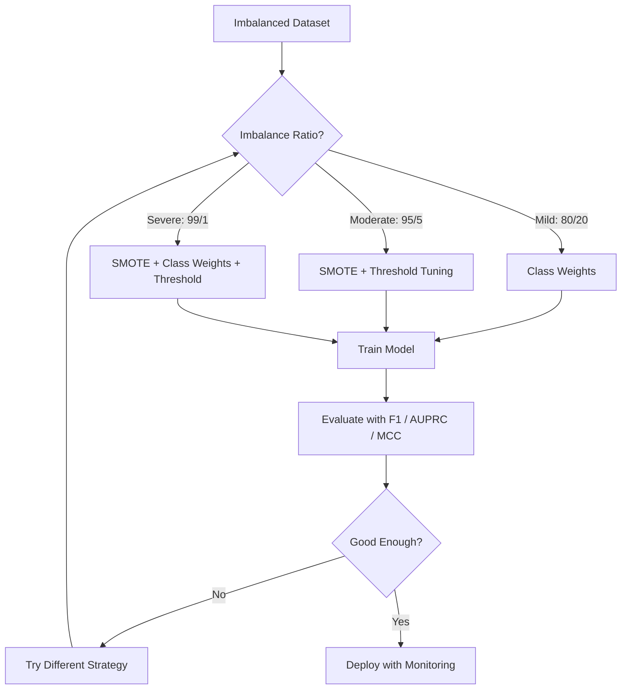
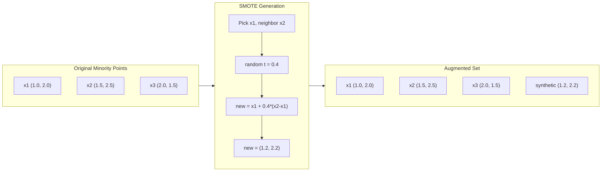
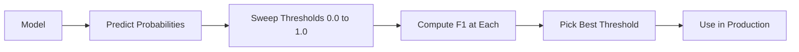
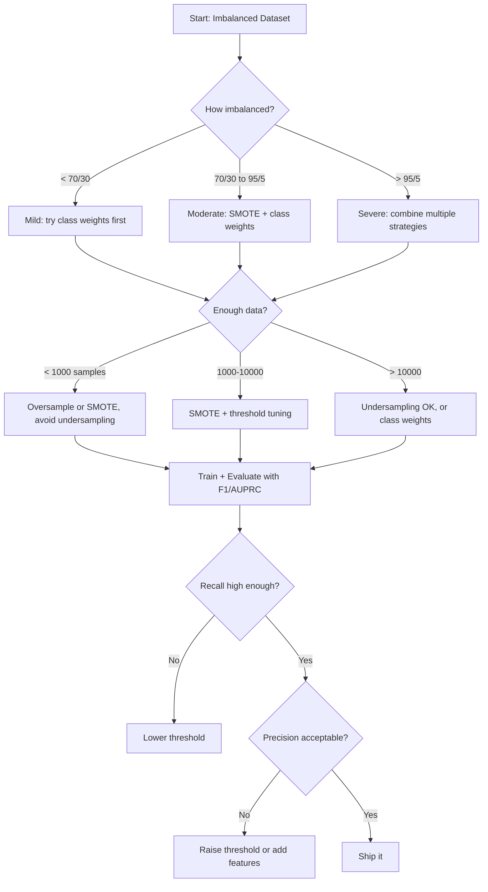

# Handling Imbalanced Data

> データの 99% が「normal」なら、accuracy は嘘をつきます。

**種別:** 構築
**言語:** Python
**前提条件:** Phase 2, Lessons 01-09 (especially evaluation metrics)
**所要時間:** 約90分

## Learning Objectives

- SMOTE をゼロから実装し、synthetic oversampling が random duplication とどう違うかを説明する
- 不均衡分類器を accuracy ではなく F1、AUPRC、Matthews Correlation Coefficient で評価する
- class weighting、threshold tuning、resampling strategies を比較し、与えられた imbalance ratio に適した手法を選ぶ
- SMOTE、class weights、threshold optimization を組み合わせた完全な imbalanced data pipeline を構築する

## 問題

fraud detection model を構築しました。99.9% accuracy が出ました。喜んだあとで、そのモデルがすべての transaction を「not fraud」と予測していることに気づきます。

これは bug ではありません。fraudulent な transaction が 0.1% しかない場合、これは合理的な振る舞いです。モデルは、常に majority class を予測すれば全体の error が最小になると学びます。技術的には正しく、実用上はまったく役に立ちません。

これは、現実の重要な分類問題のあらゆる場所で起こります。disease diagnosis: positive rate 1%。network intrusion: attacks 0.01%。manufacturing defects: defective 0.5%。spam filtering: spam 20%。churn prediction: churners 5%。minority class が重要であればあるほど、まれであることが多いのです。

Accuracy が失敗するのは、すべての正解を同じ重みで扱うからです。legitimate transaction を正しく分類することと fraud を正しく捕捉することは、どちらも accuracy では 1 点です。しかし fraud を捕捉することこそ、モデルが存在する理由です。まれだが重要な class にモデルが注意を払うようにする metrics、techniques、training strategies が必要です。

## The Concept

### Why Accuracy Fails

1000 samples のデータセットを考えます。990 が negative、10 が positive です。常に negative と予測するモデルは次のようになります。

|  | Predicted Positive | Predicted Negative |
|--|---|---|
| Actually Positive | 0 (TP) | 10 (FN) |
| Actually Negative | 0 (FP) | 990 (TN) |

Accuracy = (0 + 990) / 1000 = 99.0%

モデルは fraud を 0 件、disease を 0 件、defects を 0 件しか捕捉しません。それでも accuracy は 99% と言います。これが、不均衡問題で accuracy が危険な理由です。

### Better Metrics

**Precision** = TP / (TP + FP)。positive として flag したもののうち、実際に positive だったものはいくつか。高い precision は false alarms が少ないことを意味します。

**Recall** = TP / (TP + FN)。実際に positive のもののうち、いくつ捕捉できたか。高い recall は missed positives が少ないことを意味します。

**F1 Score** = 2 * precision * recall / (precision + recall)。調和平均です。precision と recall の極端な不均衡を、算術平均より強く罰します。

**F-beta Score** = (1 + beta^2) * precision * recall / (beta^2 * precision + recall)。beta > 1 なら recall をより重視します。beta < 1 なら precision をより重視します。fraud detection では F2 がよく使われます（fraud の見逃しは false alarm より悪い）。

**AUPRC** (Area Under Precision-Recall Curve)。AUC-ROC に似ていますが、不均衡データではより情報量があります。random classifier の AUPRC は positive class rate に等しくなります（ROC のように 0.5 ではありません）。そのため改善が見えやすくなります。

**Matthews Correlation Coefficient** = (TP * TN - FP * FN) / sqrt((TP+FP)(TP+FN)(TN+FP)(TN+FN))。範囲は -1 から +1 です。モデルが両方の class でうまく機能したときだけ高い score になります。class sizes が大きく異なっても balanced です。

上の「常に negative を予測する」モデルでは、precision = 0/0（未定義、通常 0 と扱う）、recall = 0/10 = 0、F1 = 0、MCC = 0 です。これらの指標は、モデルが役に立たないことを正しく示します。

### The Imbalanced Data Pipeline



### SMOTE: Synthetic Minority Oversampling Technique

Random oversampling は既存の minority samples を複製します。これは機能しますが、モデルが同一の点を繰り返し見るため overfitting のリスクがあります。

SMOTE は、もっともらしいがコピーではない synthetic minority samples を作ります。アルゴリズムは次の通りです。

1. 各 minority sample x について、他の minority samples の中から k nearest neighbors を見つける
2. neighbor を 1 つランダムに選ぶ
3. x とその neighbor を結ぶ線分上に新しい sample を作る

式は `new_sample = x + random(0, 1) * (neighbor - x)` です。

これは実際の minority points の間を補間し、既存データを単にコピーするのではなく、feature space の同じ領域に samples を作ります。



### Sampling Strategies Compared

**Random Oversampling**: minority samples を複製して majority count に合わせます。
- Pros: 単純、情報損失がない
- Cons: 完全な重複が overfitting を起こし、training time が増える

**Random Undersampling**: majority samples を削除して minority count に合わせます。
- Pros: training が速い、単純
- Cons: 有用な majority data を捨てる可能性があり、variance が高くなる

**SMOTE**: 補間によって synthetic minority samples を作ります。
- Pros: 新しい data points を生成し、random oversampling より overfitting を減らす
- Cons: decision boundary 付近に noisy samples を作ることがあり、majority class distribution を考慮しない

| Strategy | Data Changed | Risk | When to Use |
|----------|-------------|------|-------------|
| Oversample | Minority duplicated | Overfitting | Small datasets, moderate imbalance |
| Undersample | Majority removed | Information loss | Large datasets, want fast training |
| SMOTE | Synthetic minority added | Boundary noise | Moderate imbalance, enough minority samples for k-NN |

### Class Weights

データを変えるのではなく、モデルが errors をどう扱うかを変えます。minority class の misclassification に高い weight を割り当てます。

950 negative と 50 positive samples の binary problem では次のようになります。
- negative class の weight = n_samples / (2 * n_negative) = 1000 / (2 * 950) = 0.526
- positive class の weight = n_samples / (2 * n_positive) = 1000 / (2 * 50) = 10.0

positive class は 19 倍の weight を得ます。positive sample を 1 つ誤分類する cost は、negative samples を 19 個誤分類する cost と同じです。モデルは minority class に注意を払うよう強制されます。

logistic regression では、これは loss function を変更します。

```
weighted_loss = -sum(w_i * [y_i * log(p_i) + (1-y_i) * log(1-p_i)])
```

ここで w_i は sample i の class に依存します。

Class weights は期待値として oversampling と数学的に等価ですが、新しい data points を作りません。そのため高速で、duplicated samples による overfitting risk を避けられます。

### Threshold Tuning

多くの分類器は probability を出力します。デフォルト threshold は 0.5 です。P(positive) >= 0.5 なら positive と予測します。しかし 0.5 は任意です。class が不均衡な場合、最適なしきい値は通常もっと低くなります。

手順は次の通りです。
1. モデルを学習する
2. validation set で predicted probabilities を得る
3. thresholds を 0.0 から 1.0 まで走査する
4. 各 threshold で F1（または選んだ metric）を計算する
5. metric を最大化する threshold を選ぶ



モデルが fraudulent transaction に P(fraud) = 0.15 を出力するかもしれません。threshold 0.5 では not fraud と分類されます。threshold 0.10 なら正しく捕捉されます。probability calibration より ranking が重要です。fraud が non-fraud より高い probabilities を得ている限り、それらを分離する threshold は存在します。

### Cost-Sensitive Learning

class weights の一般化です。一律の costs ではなく、具体的な misclassification costs を割り当てます。

| | Predict Positive | Predict Negative |
|--|---|---|
| Actually Positive | 0 (correct) | C_FN = 100 |
| Actually Negative | C_FP = 1 | 0 (correct) |

fraudulent transaction の見逃し（FN）は false alarm（FP）より 100 倍高コストです。モデルは total error count ではなく total cost を最適化します。

現実の costs を見積もれるなら、これは最も原則的な approach です。missed cancer diagnosis の cost は、追加の biopsy につながる false alarm とはまったく違います。これらの costs を明示することで、正しい tradeoffs を強制できます。

### Decision Flowchart



## 実装

### Step 1: 不均衡データセットを生成する

```python
import numpy as np


def make_imbalanced_data(n_majority=950, n_minority=50, seed=42):
    rng = np.random.RandomState(seed)

    X_maj = rng.randn(n_majority, 2) * 1.0 + np.array([0.0, 0.0])
    X_min = rng.randn(n_minority, 2) * 0.8 + np.array([2.5, 2.5])

    X = np.vstack([X_maj, X_min])
    y = np.concatenate([np.zeros(n_majority), np.ones(n_minority)])

    shuffle_idx = rng.permutation(len(y))
    return X[shuffle_idx], y[shuffle_idx]
```

### Step 2: SMOTE from scratch

```python
def euclidean_distance(a, b):
    return np.sqrt(np.sum((a - b) ** 2))


def find_k_neighbors(X, idx, k):
    distances = []
    for i in range(len(X)):
        if i == idx:
            continue
        d = euclidean_distance(X[idx], X[i])
        distances.append((i, d))
    distances.sort(key=lambda x: x[1])
    return [d[0] for d in distances[:k]]


def smote(X_minority, k=5, n_synthetic=100, seed=42):
    rng = np.random.RandomState(seed)
    n_samples = len(X_minority)
    k = min(k, n_samples - 1)
    synthetic = []

    for _ in range(n_synthetic):
        idx = rng.randint(0, n_samples)
        neighbors = find_k_neighbors(X_minority, idx, k)
        neighbor_idx = neighbors[rng.randint(0, len(neighbors))]
        t = rng.random()
        new_point = X_minority[idx] + t * (X_minority[neighbor_idx] - X_minority[idx])
        synthetic.append(new_point)

    return np.array(synthetic)
```

### Step 3: Random oversampling and undersampling

```python
def random_oversample(X, y, seed=42):
    rng = np.random.RandomState(seed)
    classes, counts = np.unique(y, return_counts=True)
    max_count = counts.max()

    X_resampled = list(X)
    y_resampled = list(y)

    for cls, count in zip(classes, counts):
        if count < max_count:
            cls_indices = np.where(y == cls)[0]
            n_needed = max_count - count
            chosen = rng.choice(cls_indices, size=n_needed, replace=True)
            X_resampled.extend(X[chosen])
            y_resampled.extend(y[chosen])

    X_out = np.array(X_resampled)
    y_out = np.array(y_resampled)
    shuffle = rng.permutation(len(y_out))
    return X_out[shuffle], y_out[shuffle]


def random_undersample(X, y, seed=42):
    rng = np.random.RandomState(seed)
    classes, counts = np.unique(y, return_counts=True)
    min_count = counts.min()

    X_resampled = []
    y_resampled = []

    for cls in classes:
        cls_indices = np.where(y == cls)[0]
        chosen = rng.choice(cls_indices, size=min_count, replace=False)
        X_resampled.extend(X[chosen])
        y_resampled.extend(y[chosen])

    X_out = np.array(X_resampled)
    y_out = np.array(y_resampled)
    shuffle = rng.permutation(len(y_out))
    return X_out[shuffle], y_out[shuffle]
```

### Step 4: Logistic regression with class weights

```python
def sigmoid(z):
    return 1.0 / (1.0 + np.exp(-np.clip(z, -500, 500)))


def logistic_regression_weighted(X, y, weights, lr=0.01, epochs=200):
    n_samples, n_features = X.shape
    w = np.zeros(n_features)
    b = 0.0

    for _ in range(epochs):
        z = X @ w + b
        pred = sigmoid(z)
        error = pred - y
        weighted_error = error * weights

        gradient_w = (X.T @ weighted_error) / n_samples
        gradient_b = np.mean(weighted_error)

        w -= lr * gradient_w
        b -= lr * gradient_b

    return w, b


def compute_class_weights(y):
    classes, counts = np.unique(y, return_counts=True)
    n_samples = len(y)
    n_classes = len(classes)
    weight_map = {}
    for cls, count in zip(classes, counts):
        weight_map[cls] = n_samples / (n_classes * count)
    return np.array([weight_map[yi] for yi in y])
```

### Step 5: Threshold tuning

```python
def find_optimal_threshold(y_true, y_probs, metric="f1"):
    best_threshold = 0.5
    best_score = -1.0

    for threshold in np.arange(0.05, 0.96, 0.01):
        y_pred = (y_probs >= threshold).astype(int)
        tp = np.sum((y_pred == 1) & (y_true == 1))
        fp = np.sum((y_pred == 1) & (y_true == 0))
        fn = np.sum((y_pred == 0) & (y_true == 1))

        if metric == "f1":
            precision = tp / (tp + fp) if (tp + fp) > 0 else 0.0
            recall = tp / (tp + fn) if (tp + fn) > 0 else 0.0
            score = 2 * precision * recall / (precision + recall) if (precision + recall) > 0 else 0.0
        elif metric == "recall":
            score = tp / (tp + fn) if (tp + fn) > 0 else 0.0
        elif metric == "precision":
            score = tp / (tp + fp) if (tp + fp) > 0 else 0.0

        if score > best_score:
            best_score = score
            best_threshold = threshold

    return best_threshold, best_score
```

### Step 6: Evaluation functions

```python
def confusion_matrix_values(y_true, y_pred):
    tp = np.sum((y_pred == 1) & (y_true == 1))
    tn = np.sum((y_pred == 0) & (y_true == 0))
    fp = np.sum((y_pred == 1) & (y_true == 0))
    fn = np.sum((y_pred == 0) & (y_true == 1))
    return tp, tn, fp, fn


def compute_metrics(y_true, y_pred):
    tp, tn, fp, fn = confusion_matrix_values(y_true, y_pred)
    accuracy = (tp + tn) / (tp + tn + fp + fn)
    precision = tp / (tp + fp) if (tp + fp) > 0 else 0.0
    recall = tp / (tp + fn) if (tp + fn) > 0 else 0.0
    f1 = 2 * precision * recall / (precision + recall) if (precision + recall) > 0 else 0.0

    denom = np.sqrt(float((tp + fp) * (tp + fn) * (tn + fp) * (tn + fn)))
    mcc = (tp * tn - fp * fn) / denom if denom > 0 else 0.0

    return {
        "accuracy": accuracy,
        "precision": precision,
        "recall": recall,
        "f1": f1,
        "mcc": mcc,
    }
```

### Step 7: Compare all approaches

```python
X, y = make_imbalanced_data(950, 50, seed=42)
split = int(0.8 * len(y))
X_train, X_test = X[:split], X[split:]
y_train, y_test = y[:split], y[split:]

# Baseline: no treatment
w_base, b_base = logistic_regression_weighted(
    X_train, y_train, np.ones(len(y_train)), lr=0.1, epochs=300
)
probs_base = sigmoid(X_test @ w_base + b_base)
preds_base = (probs_base >= 0.5).astype(int)

# Oversampled
X_over, y_over = random_oversample(X_train, y_train)
w_over, b_over = logistic_regression_weighted(
    X_over, y_over, np.ones(len(y_over)), lr=0.1, epochs=300
)
preds_over = (sigmoid(X_test @ w_over + b_over) >= 0.5).astype(int)

# SMOTE
minority_mask = y_train == 1
X_minority = X_train[minority_mask]
synthetic = smote(X_minority, k=5, n_synthetic=len(y_train) - 2 * int(minority_mask.sum()))
X_smote = np.vstack([X_train, synthetic])
y_smote = np.concatenate([y_train, np.ones(len(synthetic))])
w_sm, b_sm = logistic_regression_weighted(
    X_smote, y_smote, np.ones(len(y_smote)), lr=0.1, epochs=300
)
preds_smote = (sigmoid(X_test @ w_sm + b_sm) >= 0.5).astype(int)

# Class weights
sample_weights = compute_class_weights(y_train)
w_cw, b_cw = logistic_regression_weighted(
    X_train, y_train, sample_weights, lr=0.1, epochs=300
)
probs_cw = sigmoid(X_test @ w_cw + b_cw)
preds_cw = (probs_cw >= 0.5).astype(int)

# Threshold tuning (tune on held-out validation set, not test set)
probs_val = sigmoid(X_val @ w_cw + b_cw)
best_thresh, best_f1 = find_optimal_threshold(y_val, probs_val, metric="f1")
preds_thresh = (probs_cw >= best_thresh).astype(int)
```

コードファイルはこれを単一 script として実行し、結果を出力します。

## Use It

scikit-learn と imbalanced-learn を使えば、これらの technique は one-liners です。

```python
from sklearn.linear_model import LogisticRegression
from sklearn.metrics import classification_report, f1_score
from sklearn.model_selection import train_test_split
from imblearn.over_sampling import SMOTE
from imblearn.under_sampling import RandomUnderSampler
from imblearn.pipeline import Pipeline

X_train, X_test, y_train, y_test = train_test_split(X, y, stratify=y)

model_weighted = LogisticRegression(class_weight="balanced")
model_weighted.fit(X_train, y_train)
print(classification_report(y_test, model_weighted.predict(X_test)))

smote = SMOTE(random_state=42)
X_resampled, y_resampled = smote.fit_resample(X_train, y_train)
model_smote = LogisticRegression()
model_smote.fit(X_resampled, y_resampled)
print(classification_report(y_test, model_smote.predict(X_test)))

pipeline = Pipeline([
    ("smote", SMOTE()),
    ("model", LogisticRegression(class_weight="balanced")),
])
pipeline.fit(X_train, y_train)
print(classification_report(y_test, pipeline.predict(X_test)))
```

ゼロからの実装は、それぞれの technique が何をしているかを正確に示します。SMOTE は minority class に対する k-NN interpolation にすぎません。Class weights は loss を掛け算します。Threshold tuning は cutoffs を for-loop で走査するだけです。魔法はありません。

## Ship It

この lesson の成果物は次の通りです。
- `outputs/skill-imbalanced-data.md` -- imbalanced classification problems に対処するための decision checklist

## Exercises

1. **Borderline-SMOTE**: SMOTE 実装を変更し、decision boundary 付近にある minority points（k-nearest neighbors に majority class samples が含まれる点）に対してのみ synthetic samples を生成するようにします。classes が重なるデータセットで standard SMOTE と結果を比較します。

2. **Cost matrix optimization**: cost matrix を parameter とする cost-sensitive learning を実装します。cost matrix を受け取り、expected cost を最小化する optimal predictions を返す function を作成します。異なる cost ratios（1:10, 1:100, 1:1000）でテストし、precision-recall tradeoff がどう変わるかを plot します。

3. **Threshold calibration**: Platt scaling を実装します（model の raw outputs に logistic regression を fit して calibrated probabilities を生成）。calibration 前後の precision-recall curve を比較します。calibration は ranking を変えない（AUC は同じ）一方、probabilities をより意味のあるものにすることを示します。

4. **Ensemble with balanced bagging**: 複数の models を学習します。それぞれは balanced bootstrap sample（all minority + random subset of majority）で学習します。predictions を平均します。この approach を SMOTE を使った単一 model と比較します。performance と runs 間の variance の両方を測定します。

5. **Imbalance ratio experiment**: balanced dataset を取り、imbalance ratio を段階的に増やします（50/50, 70/30, 90/10, 95/5, 99/1）。各 ratio で SMOTE あり/なしで学習します。両 approach について F1 vs imbalance ratio を plot します。どの ratio から SMOTE が意味のある差を生み始めますか？

## Key Terms

| Term | What people say | What it actually means |
|------|----------------|----------------------|
| Class imbalance | "One class has way more samples" | データセット内の class distribution が大きく偏っており、models が majority class を好む状態 |
| SMOTE | "Synthetic oversampling" | 既存の minority samples とその k-nearest minority neighbors の間を補間して新しい minority samples を作る |
| Class weights | "Making errors on rare classes more expensive" | class-specific weights を loss function に掛け、minority misclassification をより重く罰すること |
| Threshold tuning | "Moving the decision boundary" | classification の probability cutoff をデフォルト 0.5 から、望ましい metric を最適化する値へ変更すること |
| Precision-recall tradeoff | "You cannot have both" | threshold を下げると more positives を捕捉する（higher recall）一方、false positives も増える（lower precision）。逆も同じ |
| AUPRC | "Area under the PR curve" | precision-recall curve を単一の数値に要約する。不均衡が強い場合は AUC-ROC より情報量がある |
| Matthews Correlation Coefficient | "The balanced metric" | predicted labels と actual labels の相関。両 classes でうまく機能したときだけ高い score になる |
| Cost-sensitive learning | "Different mistakes cost different amounts" | 現実の misclassification costs を training objective に組み込み、error count ではなく total cost を最適化すること |
| Random oversampling | "Duplicate the minority" | class counts を balance するため minority class samples を繰り返す。単純だが duplicated points への overfitting リスクがある |

## 参考文献

- [SMOTE: Synthetic Minority Over-sampling Technique (Chawla et al., 2002)](https://arxiv.org/abs/1106.1813) -- original SMOTE paper
- [Learning from Imbalanced Data (He & Garcia, 2009)](https://ieeexplore.ieee.org/document/5128907) -- sampling、cost-sensitive、algorithmic approaches を扱う包括的 survey
- [imbalanced-learn documentation](https://imbalanced-learn.org/stable/) -- SMOTE variants、undersampling strategies、pipeline integration を提供する Python library
- [The Precision-Recall Plot Is More Informative than the ROC Plot (Saito & Rehmsmeier, 2015)](https://journals.plos.org/plosone/article?id=10.1371/journal.pone.0118432) -- 不均衡問題で PR curves を ROC curves より優先する理由
