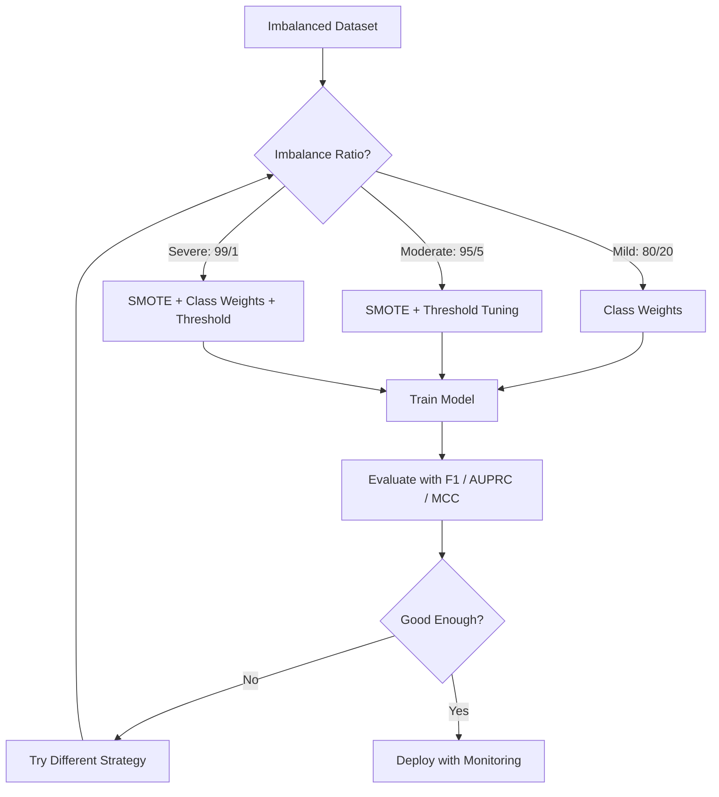
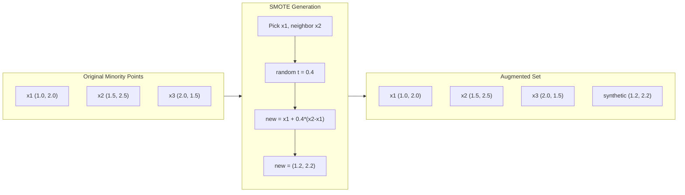
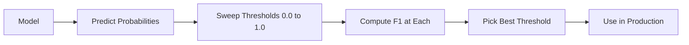
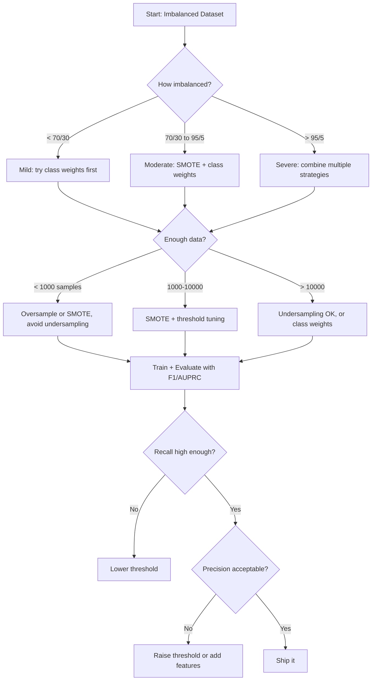

# Dengesiz Verileri İşleme

> Verilerinizin %99'u "normal" olduğunda doğruluk bir yalandır.

**Tür:** Yapım
**Dil:** Python
**Önkoşullar:** Aşama 2, Dersler 01-09 (özellikle değerlendirme ölçümleri)
**Süre:** ~90 dakika

## Öğrenme Hedefleri

- SMOTE'u sıfırdan uygulayın ve sentetik aşırı örneklemenin rastgele kopyalamadan ne kadar farklı olduğunu açıklayın
- Doğruluk yerine F1, AUPRC ve Matthews Korelasyon Katsayısını kullanarak dengesiz sınıflandırıcıları değerlendirin
- Sınıf ağırlıklandırmayı, eşik ayarlamayı ve yeniden örnekleme stratejilerini karşılaştırın ve belirli bir dengesizlik oranı için doğru yaklaşımı seçin
- SMOTE, sınıf ağırlıkları ve eşik optimizasyonunu birleştiren eksiksiz bir dengesiz veri hattı oluşturun

## Sorun

Bir sahtekarlık tespit modeli oluşturursunuz. %99,9 doğruluk elde eder. Kutluyorsun. Daha sonra her işlem için "dolandırıcılık olmadığını" tahmin ettiğini fark edersiniz.

Bu bir hata değil. İşlemlerin yalnızca %0,1'inin sahte olduğu durumlarda bunu yapmak mantıklıdır. Model, her zaman çoğunluk sınıfını tahmin etmenin genel hatayı en aza indirdiğini öğrenir. Teknik olarak doğru ve tamamen işe yaramaz.

Bu, gerçek sınıflandırmanın önemli olduğu her yerde gerçekleşir. Hastalık tanısı: %1 pozitiflik oranı. Ağa izinsiz giriş: %0,01 saldırı. Üretim kusurları: %0,5 kusurlu. Spam filtreleme: %20 spam. Kayıp tahmini: %5 kayıp. Azınlık sınıfı ne kadar önemliyse, o kadar nadir olma eğilimindedir.

Doğruluk başarısız olur çünkü tüm doğru tahminlere eşit davranır. Meşru bir işlemi doğru şekilde etiketlemek ve dolandırıcılığı doğru bir şekilde yakalamak, bir doğruluk noktası olarak sayılır. Ancak sahtekarlığı yakalamak, modelin var olmasının tek nedenidir. Modeli nadir fakat önemli sınıfa dikkat etmeye zorlayan ölçümlere, tekniklere ve eğitim stratejilerine ihtiyacımız var.

## Konsept

### Doğruluk Neden Başarısız?

1000 örnekli bir dataset düşünün: 990 negatif, 10 pozitif. Her zaman olumsuzu tahmin eden bir model:

|  | Olumlu Tahmin | Negatif Tahmin |
|--|---|---|
| Aslında Olumlu | 0 (TP) | 10 (FN) |
| Aslında Olumsuz | 0 (FP) | 990 (TN) |

Doğruluk = (0 + 990) / 1000 = %99,0

Model sıfır dolandırıcılığı yakalıyor. Sıfır hastalık. Sıfır kusur. Ancak doğruluk %99 diyor. Dengesiz problemlerde doğruluk tehlikeli olmasının nedeni budur.

### Daha İyi Metrikler

**Hassaslık** = TP / (TP + FP). Olumlu olarak işaretlenen her şeyin gerçekte kaç tanesi var? Yüksek hassasiyet, daha az sayıda yanlış alarm anlamına gelir.

**Geri çağırma** = TP / (TP + FN). Aslında olumlu olan her şeyden kaçını yakaladık? Yüksek hatırlama, daha az sayıda kaçırılan pozitiflik anlamına gelir.

**F1 Puanı** = 2 * kesinlik * geri çağırma / (hassasiyet + geri çağırma). Harmonik ortalama. Kesinlik ile geri çağırma arasındaki aşırı dengesizliği aritmetik ortalamadan daha fazla cezalandırır.

**F-beta Puanı** = (1 + beta^2) * kesinlik * hatırlama / (beta^2 * kesinlik + geri çağırma). Beta > 1 olduğunda hatırlama daha önemli olur. Beta < 1 olduğunda kesinlik daha önemlidir. F2, sahtekarlık tespitinde yaygındır (dolandırıcılığın eksik olması, yanlış alarmdan daha kötüdür).

**AUPRC** (Hassaslık-Geri Çağırma Eğrisi Altındaki Alan). AUC-ROC'ye benzer ancak dengesiz veriler için daha bilgilendiricidir. Rastgele bir sınıflandırıcı, pozitif sınıf oranına eşit AUPRC'ye sahiptir (ROC gibi 0,5 değil). Bu, iyileştirmelerin görülmesini kolaylaştırır.

**Matthews Korelasyon Katsayısı** = (TP * TN - FP * FN) / sqrt((TP+FP)(TP+FN)(TN+FP)(TN+FN)) -1 ile +1 arasında değişir. Yalnızca model her iki sınıfta da iyi performans gösterdiğinde yüksek puan verir. Sınıflar çok farklı boyutlarda olsa bile dengelidir.

Yukarıdaki "her zaman negatif tahmin" modeli için: kesinlik = 0/0 (tanımsız, genellikle 0'a ayarlanır), geri çağırma = 0/10 = 0, F1 = 0, MCC = 0. Bu ölçümler, modeli doğru bir şekilde değersiz olarak tanımlar.

### Dengesiz Veri Hattı



### SMOTE: Sentetik Azınlık Aşırı Örnekleme Tekniği

Rastgele aşırı örnekleme, mevcut azınlık örneklerini çoğaltır. Bu işe yarar ancak aşırı uyum riski taşır çünkü model aynı noktaları tekrar tekrar görür.

SMOTE, makul olan ancak kopya olmayan yeni sentetik azınlık örnekleri oluşturur. Algoritma:

1. Her bir azınlık örneği x için, diğer azınlık örnekleri arasında en yakın k komşusunu bulun
2. Rastgele bir komşu seçin
3. x ile o komşu arasındaki çizgi parçası üzerinde yeni bir örnek oluşturun

Formül: `new_sample = x + random(0, 1) * (neighbor - x)`

Bu, gerçek azınlık noktaları arasında enterpolasyon yaparak, yalnızca mevcut verileri kopyalamadan özellik alanının aynı bölgesinde örnekler oluşturur.



### Örnekleme Stratejileri Karşılaştırıldı

**Rastgele Aşırı Örnekleme**: çoğunluk sayımıyla eşleşmesi için azınlık örneklerini çoğaltın.
- Artıları: basit, bilgi kaybı yok
- Eksileri: tam kopyalar fazla uyum sağlamaya neden olur, eğitim süresini artırır

**Rastgele Yetersiz Örnekleme**: Azınlık sayısını eşleştirmek için çoğunluk örneklerini kaldırın.
- Artıları: hızlı eğitim, basit
- Eksileri: potansiyel olarak yararlı çoğunluk verilerini ortadan kaldırır, daha yüksek sapma

**SMOTE**: enterpolasyon yoluyla sentetik azınlık örnekleri oluşturun.
- Artıları: yeni veri noktaları oluşturur, rastgele aşırı örneklemeye kıyasla aşırı uyumu azaltır
- Eksileri: karar sınırı yakınında gürültülü örnekler oluşturabilir, çoğunluk sınıfı dağılımını hesaba katmaz

| Strateji | Veriler Değiştirildi | Risk | Ne Zaman Kullanılmalı |
|----------|-------------|------|-------------|
| Aşırı Örnekleme | Azınlık kopyalandı | Aşırı uyum | Küçük dataset'ler, orta derecede dengesizlik |
| Alt Örnek | Çoğunluk kaldırıldı | Bilgi kaybı | Büyük dataset'ler, hızlı eğitim istiyor |
| SMOTE | Sentetik azınlık eklendi | Sınır gürültüsü | Orta düzeyde dengesizlik, k-NN için yeterli azınlık örneği |

### Sınıf Ağırlıkları

Verileri değiştirmek yerine modelin hataları işleme biçimini değiştirin. Azınlık sınıfının yanlış sınıflandırılmasına daha fazla ağırlık verin.

950 negatif ve 50 pozitif örnekten oluşan ikili bir problem için:
- Negatif sınıf için ağırlık = n_samples / (2 * n_negative) = 1000 / (2 * 950) = 0,526
- Pozitif sınıf için ağırlık = n_samples / (2 * n_positive) = 1000 / (2 * 50) = 10,0

Pozitif sınıf 19 kat daha fazla ağırlık alıyor. Bir pozitif numunenin yanlış sınıflandırılması, 19 negatif numunenin yanlış sınıflandırılması kadar maliyetlidir. Model azınlık sınıfına dikkat etmek zorunda kalıyor.

Lojistik regresyonda bu, loss function'yi değiştirir:

```
weighted_loss = -sum(w_i * [y_i * log(p_i) + (1-y_i) * log(1-p_i)])
```

burada w_i, örnek i'nin sınıfına bağlıdır.

Sınıf ağırlıkları, beklenti içinde aşırı örneklemeye matematiksel olarak eşdeğerdir, ancak yeni veri noktaları oluşturmaz. Bu onları daha hızlı hale getirir ve kopyalanan numunelerin aşırı uyum riskini ortadan kaldırır.

### Eşik Ayarı

Çoğu sınıflandırıcı bir olasılık çıktısı verir. Varsayılan eşik 0,5'tir: P(pozitif) >= 0,5 ise pozitifi tahmin edin. Ancak 0,5 keyfidir. Sınıflar dengesiz olduğunda optimal eşik genellikle çok daha düşüktür.

Süreç:
1. Bir modeli eğitin
2. Doğrulama kümesindeki tahmin edilen olasılıkları alın
3. 0,0'dan 1,0'a kadar tarama eşikleri
4. Her eşikteki F1'i (veya seçtiğiniz ölçümü) hesaplayın
5. Metriğinizi en üst düzeye çıkaran eşiği seçin



Bir model, hileli bir işlem için P(dolandırıcılık) = 0,15 sonucunu verebilir. 0,5 eşiğinde bu, dolandırıcılık değil olarak sınıflandırılır. 0,10 eşiğinde doğru bir şekilde yakalanır. Olasılık kalibrasyonu sıralamadan daha az önemlidir; dolandırıcılığın olasılıkları dolandırıcılıktan daha yüksek olduğu sürece, bunları ayıran bir eşik vardır.

### Maliyete Duyarlı Öğrenme

Sınıf ağırlıklarının genelleştirilmesi. Tek tip maliyetler yerine belirli yanlış sınıflandırma maliyetlerini atayın:

| | Olumlu Tahmin | Negatif Tahmin |
|--|---|---|
| Aslında Olumlu | 0 (doğru) | C_FN = 100 |
| Aslında Olumsuz | C_FP = 1 | 0 (doğru) |

Hileli bir işlemin (FN) kaçırılmasının maliyeti, yanlış alarmdan (FP) 100 kat daha fazladır. Model, toplam hata sayısını değil toplam maliyeti optimize eder.

Bu, gerçek dünyadaki maliyetleri tahmin edebileceğiniz en ilkeli yaklaşımdır. Kaçırılmış bir kanser tanısının maliyeti, fazladan biyopsiye yol açan yanlış alarmdan çok farklı bir maliyete sahiptir. Bu maliyetleri açıkça ortaya koymak doğru tercihleri ​​zorlar.

### Karar Akış Şeması



```figure
class-imbalance
```

## İnşa Et

### Adım 1: Dengesiz bir dataset oluşturun

```python
import numpy as np


def make_imbalanced_data(n_majority=950, n_minority=50, seed=42):
    rng = np.random.RandomState(seed)

    X_maj = rng.randn(n_majority, 2) * 1.0 + np.array([0.0, 0.0])
    X_min = rng.randn(n_minority, 2) * 0.8 + np.array([2.5, 2.5])

    X = np.vstack([X_maj, X_min])
    y = np.concatenate([np.zeros(n_majority), np.ones(n_minority)])

    shuffle_idx = rng.permutation(len(y))
    return X[shuffle_idx], y[shuffle_idx]
```

### Adım 2: Sıfırdan SMOTE

```python
def euclidean_distance(a, b):
    return np.sqrt(np.sum((a - b) ** 2))


def find_k_neighbors(X, idx, k):
    distances = []
    for i in range(len(X)):
        if i == idx:
            continue
        d = euclidean_distance(X[idx], X[i])
        distances.append((i, d))
    distances.sort(key=lambda x: x[1])
    return [d[0] for d in distances[:k]]


def smote(X_minority, k=5, n_synthetic=100, seed=42):
    rng = np.random.RandomState(seed)
    n_samples = len(X_minority)
    k = min(k, n_samples - 1)
    synthetic = []

    for _ in range(n_synthetic):
        idx = rng.randint(0, n_samples)
        neighbors = find_k_neighbors(X_minority, idx, k)
        neighbor_idx = neighbors[rng.randint(0, len(neighbors))]
        t = rng.random()
        new_point = X_minority[idx] + t * (X_minority[neighbor_idx] - X_minority[idx])
        synthetic.append(new_point)

    return np.array(synthetic)
```

### Adım 3: Rastgele aşırı örnekleme ve yetersiz örnekleme

```python
def random_oversample(X, y, seed=42):
    rng = np.random.RandomState(seed)
    classes, counts = np.unique(y, return_counts=True)
    max_count = counts.max()

    X_resampled = list(X)
    y_resampled = list(y)

    for cls, count in zip(classes, counts):
        if count < max_count:
            cls_indices = np.where(y == cls)[0]
            n_needed = max_count - count
            chosen = rng.choice(cls_indices, size=n_needed, replace=True)
            X_resampled.extend(X[chosen])
            y_resampled.extend(y[chosen])

    X_out = np.array(X_resampled)
    y_out = np.array(y_resampled)
    shuffle = rng.permutation(len(y_out))
    return X_out[shuffle], y_out[shuffle]


def random_undersample(X, y, seed=42):
    rng = np.random.RandomState(seed)
    classes, counts = np.unique(y, return_counts=True)
    min_count = counts.min()

    X_resampled = []
    y_resampled = []

    for cls in classes:
        cls_indices = np.where(y == cls)[0]
        chosen = rng.choice(cls_indices, size=min_count, replace=False)
        X_resampled.extend(X[chosen])
        y_resampled.extend(y[chosen])

    X_out = np.array(X_resampled)
    y_out = np.array(y_resampled)
    shuffle = rng.permutation(len(y_out))
    return X_out[shuffle], y_out[shuffle]
```

### Adım 4: Sınıf ağırlıklarıyla lojistik regresyon

```python
def sigmoid(z):
    return 1.0 / (1.0 + np.exp(-np.clip(z, -500, 500)))


def logistic_regression_weighted(X, y, weights, lr=0.01, epochs=200):
    n_samples, n_features = X.shape
    w = np.zeros(n_features)
    b = 0.0

    for _ in range(epochs):
        z = X @ w + b
        pred = sigmoid(z)
        error = pred - y
        weighted_error = error * weights

        gradient_w = (X.T @ weighted_error) / n_samples
        gradient_b = np.mean(weighted_error)

        w -= lr * gradient_w
        b -= lr * gradient_b

    return w, b


def compute_class_weights(y):
    classes, counts = np.unique(y, return_counts=True)
    n_samples = len(y)
    n_classes = len(classes)
    weight_map = {}
    for cls, count in zip(classes, counts):
        weight_map[cls] = n_samples / (n_classes * count)
    return np.array([weight_map[yi] for yi in y])
```

### Adım 5: Eşik ayarı

```python
def find_optimal_threshold(y_true, y_probs, metric="f1"):
    best_threshold = 0.5
    best_score = -1.0

    for threshold in np.arange(0.05, 0.96, 0.01):
        y_pred = (y_probs >= threshold).astype(int)
        tp = np.sum((y_pred == 1) & (y_true == 1))
        fp = np.sum((y_pred == 1) & (y_true == 0))
        fn = np.sum((y_pred == 0) & (y_true == 1))

        if metric == "f1":
            precision = tp / (tp + fp) if (tp + fp) > 0 else 0.0
            recall = tp / (tp + fn) if (tp + fn) > 0 else 0.0
            score = 2 * precision * recall / (precision + recall) if (precision + recall) > 0 else 0.0
        elif metric == "recall":
            score = tp / (tp + fn) if (tp + fn) > 0 else 0.0
        elif metric == "precision":
            score = tp / (tp + fp) if (tp + fp) > 0 else 0.0

        if score > best_score:
            best_score = score
            best_threshold = threshold

    return best_threshold, best_score
```

### Adım 6: Değerlendirme işlevleri

```python
def confusion_matrix_values(y_true, y_pred):
    tp = np.sum((y_pred == 1) & (y_true == 1))
    tn = np.sum((y_pred == 0) & (y_true == 0))
    fp = np.sum((y_pred == 1) & (y_true == 0))
    fn = np.sum((y_pred == 0) & (y_true == 1))
    return tp, tn, fp, fn


def compute_metrics(y_true, y_pred):
    tp, tn, fp, fn = confusion_matrix_values(y_true, y_pred)
    accuracy = (tp + tn) / (tp + tn + fp + fn)
    precision = tp / (tp + fp) if (tp + fp) > 0 else 0.0
    recall = tp / (tp + fn) if (tp + fn) > 0 else 0.0
    f1 = 2 * precision * recall / (precision + recall) if (precision + recall) > 0 else 0.0

    denom = np.sqrt(float((tp + fp) * (tp + fn) * (tn + fp) * (tn + fn)))
    mcc = (tp * tn - fp * fn) / denom if denom > 0 else 0.0

    return {
        "accuracy": accuracy,
        "precision": precision,
        "recall": recall,
        "f1": f1,
        "mcc": mcc,
    }
```

### Adım 7: Tüm yaklaşımları karşılaştırın

```python
X, y = make_imbalanced_data(950, 50, seed=42)
split = int(0.8 * len(y))
X_train, X_test = X[:split], X[split:]
y_train, y_test = y[:split], y[split:]

# Baseline: no treatment
w_base, b_base = logistic_regression_weighted(
    X_train, y_train, np.ones(len(y_train)), lr=0.1, epochs=300
)
probs_base = sigmoid(X_test @ w_base + b_base)
preds_base = (probs_base >= 0.5).astype(int)

# Oversampled
X_over, y_over = random_oversample(X_train, y_train)
w_over, b_over = logistic_regression_weighted(
    X_over, y_over, np.ones(len(y_over)), lr=0.1, epochs=300
)
preds_over = (sigmoid(X_test @ w_over + b_over) >= 0.5).astype(int)

# SMOTE
minority_mask = y_train == 1
X_minority = X_train[minority_mask]
synthetic = smote(X_minority, k=5, n_synthetic=len(y_train) - 2 * int(minority_mask.sum()))
X_smote = np.vstack([X_train, synthetic])
y_smote = np.concatenate([y_train, np.ones(len(synthetic))])
w_sm, b_sm = logistic_regression_weighted(
    X_smote, y_smote, np.ones(len(y_smote)), lr=0.1, epochs=300
)
preds_smote = (sigmoid(X_test @ w_sm + b_sm) >= 0.5).astype(int)

# Class weights
sample_weights = compute_class_weights(y_train)
w_cw, b_cw = logistic_regression_weighted(
    X_train, y_train, sample_weights, lr=0.1, epochs=300
)
probs_cw = sigmoid(X_test @ w_cw + b_cw)
preds_cw = (probs_cw >= 0.5).astype(int)

# Threshold tuning (tune on held-out validation set, not test set)
probs_val = sigmoid(X_val @ w_cw + b_cw)
best_thresh, best_f1 = find_optimal_threshold(y_val, probs_val, metric="f1")
preds_thresh = (probs_cw >= best_thresh).astype(int)
```

Kod dosyası tüm bunları tek bir komut dosyasında çalıştırır ve sonuçları yazdırır.

## Kullan onu

Scikit-öğrenme ve dengesiz-öğrenme ile bu teknikler tek satırlıktır:

```python
from sklearn.linear_model import LogisticRegression
from sklearn.metrics import classification_report, f1_score
from sklearn.model_selection import train_test_split
from imblearn.over_sampling import SMOTE
from imblearn.under_sampling import RandomUnderSampler
from imblearn.pipeline import Pipeline

X_train, X_test, y_train, y_test = train_test_split(X, y, stratify=y)

model_weighted = LogisticRegression(class_weight="balanced")
model_weighted.fit(X_train, y_train)
print(classification_report(y_test, model_weighted.predict(X_test)))

smote = SMOTE(random_state=42)
X_resampled, y_resampled = smote.fit_resample(X_train, y_train)
model_smote = LogisticRegression()
model_smote.fit(X_resampled, y_resampled)
print(classification_report(y_test, model_smote.predict(X_test)))

pipeline = Pipeline([
    ("smote", SMOTE()),
    ("model", LogisticRegression(class_weight="balanced")),
])
pipeline.fit(X_train, y_train)
print(classification_report(y_test, pipeline.predict(X_test)))
```

Sıfırdan uygulamalar her tekniğin tam olarak ne yaptığını gösterir. SMOTE sadece azınlık sınıfındaki k-NN enterpolasyonudur. Sınıf ağırlıkları kaybı katlıyor. Eşik ayarı, kesintiler üzerinde bir for-döngüsüdür. Sihir yok.

## Gönderin

Bu ders şunları üretir:
- `outputs/skill-imbalanced-data.md` -- dengesiz sınıflandırma problemlerini ele almak için bir karar kontrol listesi

## Egzersizler

1. **Borderline-SMOTE**: SMOTE uygulamasını yalnızca karar sınırına yakın olan azınlık noktaları (k-en yakın komşuları çoğunluk sınıfı örneklerini içerenler) için sentetik örnekler oluşturacak şekilde değiştirin. Sınıfların çakıştığı dataset'de sonuçları standart SMOTE ile karşılaştırın.

2. **Maliyet matrisi optimizasyonu**: Maliyet matrisinin bir parametre olduğu maliyete duyarlı öğrenmeyi uygulayın. Maliyet matrisini alan ve beklenen maliyeti en aza indiren optimum tahminleri döndüren bir işlev oluşturun. Farklı maliyet oranlarıyla (1:10, 1:100, 1:1000) test yapın ve hassasiyet-geri çağırma dengesinin nasıl değiştiğini çizin.

3. **Eşik kalibrasyonu**: Platt ölçeklendirmesini uygulayın (kalibre edilmiş olasılıklar üretmek için modelin ham çıktılarına lojistik bir regresyon uygulayın). Kalibrasyondan önce ve sonra hassas geri çağırma eğrisini karşılaştırın. Kalibrasyonun sıralamayı değiştirmediğini (AUC aynı kalır), ancak olasılıkları daha anlamlı hale getirdiğini gösterin.

4. **Dengeli torbalamayla topluluk**: her biri dengeli bir önyükleme örneğinde (tümü azınlık + çoğunluğun rastgele alt kümesi) birden fazla modeli eğitin. Tahminlerini ortalamalayın. Bu yaklaşımı SMOTE ile tek bir modelle karşılaştırın. Çalıştırmalar arasında hem performansı hem de varyansı ölçün.

5. **Dengesizlik oranı deneyi**: dengeli bir dataset alın ve dengesizlik oranını kademeli olarak artırın (50/50, 70/30, 90/10, 95/5, 99/1). Her oran için SMOTE ile ve SMOTE olmadan antrenman yapın. Her iki yaklaşım için de F1'e karşı dengesizlik oranının grafiğini çizin. SMOTE hangi oranda anlamlı bir fark yaratmaya başlıyor?

## Anahtar Terimler

| Dönem | İnsanlar ne diyor | Aslında ne anlama geliyor |
|------|----------------|----------------------|
| Sınıf dengesizliği | "Bir sınıfta çok daha fazla örnek var" | dataset'deki sınıfların dağılımı önemli ölçüde çarpıktır ve modellerin çoğunluk sınıfını tercih etmesine neden olur |
| SMOTE | "Sentetik aşırı örnekleme" | Mevcut azınlık örnekleri ile k-en yakın azınlık komşuları arasında enterpolasyon yaparak yeni azınlık örnekleri oluşturur |
| Sınıf ağırlıkları | "Nadir sınıflardaki hataları daha pahalı hale getirmek" | Modelin azınlıkların yanlış sınıflandırmasını daha ağır şekilde cezalandırması için loss function'nin sınıfa özgü ağırlıklarla çarpılması |
| Eşik ayarı | "Karar sınırını taşıma" | Sınıflandırma için olasılık sınırının varsayılan 0,5'ten istenen ölçütü optimize eden bir değere değiştirilmesi |
| Hassas geri çağırma ödünleşimi | "İkisine birden sahip olamazsınız" | Eşiğin düşürülmesi daha fazla pozitifi yakalar (daha yüksek hatırlama) ancak aynı zamanda daha fazla yanlış pozitifi işaretler (düşük hassasiyet) ve bunun tersi de geçerlidir |
| AUPRC | "PR eğrisinin altındaki alan" | Hassasiyet-geri çağırma eğrisini tek bir sayı halinde özetler; sınıflar büyük ölçüde dengesiz olduğunda AUC-ROC'den daha bilgilendirici |
| Matthews Korelasyon Katsayısı | "Dengeli ölçü" | Yalnızca model her iki sınıfta da iyi performans gösterdiğinde yüksek puan üreten, tahmin edilen ve gerçek etiketler arasındaki korelasyon |
| Maliyete duyarlı öğrenme | "Farklı hatalar farklı tutarlara mal olur" | Modelin hata sayısını değil toplam maliyeti optimize etmesi için gerçek dünyadaki yanlış sınıflandırma maliyetlerini eğitim hedefine dahil etme |
| Rastgele aşırı örnekleme | "Azınlığı çoğaltın" | Sınıf sayımlarını dengelemek için azınlık sınıfı örneklerinin tekrarlanması; basit ancak yinelenen noktalara aşırı uyum riski var |

## Daha Fazla Okuma

- [SMOTE: Sentetik Azınlık Aşırı Örnekleme Tekniği (Chawla ve diğerleri, 2002)](https://arxiv.org/abs/1106.1813) -- orijinal SMOTE makalesi, dengesiz öğrenme konusunda hâlâ en çok alıntı yapılan çalışma
- [Learning from Imbalanced Data (He & Garcia, 2009)](https://ieeexplore.ieee.org/document/5128907) -- örneklemeyi, maliyete duyarlı ve algoritmik yaklaşımları kapsayan kapsamlı bir araştırma
- [dengesiz öğrenme belgeleri](https://imbalanced-learn.org/stable/) -- SMOTE değişkenleri, yetersiz örnekleme stratejileri ve ardışık düzen entegrasyonu içeren Python kitaplığı
- [Hassaslık-Geri Çağırma Grafiği, ROC Grafiğinden Daha Bilgilendiricidir (Saito ve Rehmsmeier, 2015)](https://journals.plos.org/plosone/article?id=10.1371/journal.pone.0118432) -- dengesiz problemler için PR eğrileri ROC eğrileri yerine ne zaman ve neden tercih edilmelidir?
