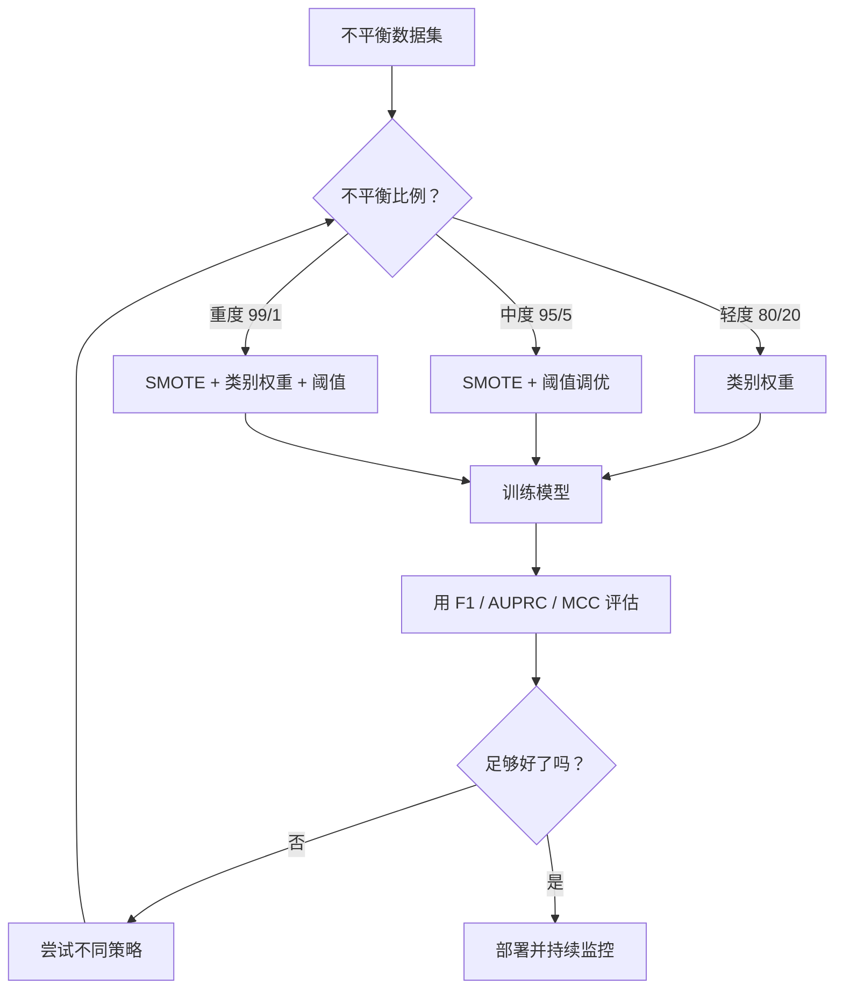
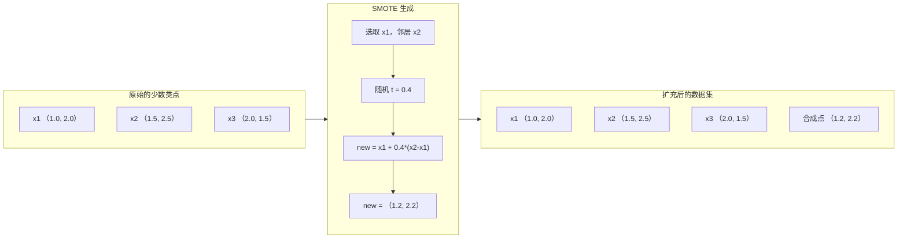
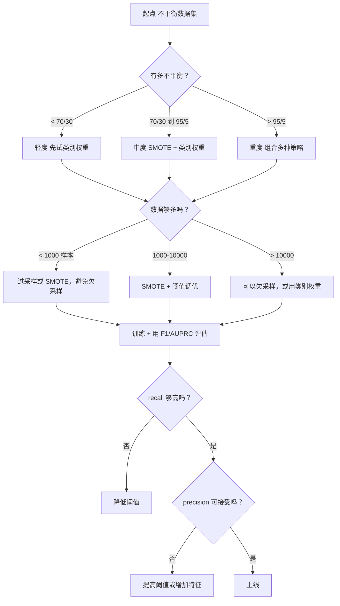

# 处理不平衡数据（Handling Imbalanced Data）

> 译注：本文译自同目录 [`en.md`](./en.md)。术语遵循仓根 [TRANSLATION_GUIDE.md](../../../../TRANSLATION_GUIDE.md)。

> 当 99% 的数据都是「正常」时，accuracy（准确率）就是个谎言。

**Type:** Build
**Language:** Python
**Prerequisites:** Phase 2, Lessons 01-09（尤其是评估指标那几节）
**Time:** ~90 minutes

## 学习目标（Learning Objectives）

- 从零实现 SMOTE，解释合成式 oversampling（过采样）与随机复制有何不同
- 用 F1、AUPRC、Matthews 相关系数（MCC）替代 accuracy 来评估不平衡分类器
- 比较 class weighting（类别加权）、阈值调优和重采样策略，并为给定的不平衡比例选出合适的方案
- 搭建一条完整的不平衡数据流水线，把 SMOTE、class weights 和阈值优化串起来

## 问题（The Problem）

你做了个欺诈检测模型，accuracy 高达 99.9%，于是开始庆祝。然后你发现——它对每一笔交易都预测「不是欺诈」。

这不是 bug，而是一种理性选择：当只有 0.1% 的交易是欺诈时，永远猜多数类就能把整体错误率压到最低。模型技术上没错，实用上完全没用。

凡是真正重要的分类问题，都会撞上这堵墙。疾病诊断：阳性率 1%。网络入侵：攻击占比 0.01%。制造缺陷：0.5% 不良。垃圾邮件过滤：20% 是垃圾。流失预测：5% 流失用户。少数类越关键，往往越稀有。

accuracy 之所以失效，是因为它把所有正确预测一视同仁。把一笔合法交易判对、把一笔欺诈抓住，都只算 1 分准确率。但抓欺诈才是这个模型存在的全部理由。我们需要一些指标、技巧和训练策略，逼着模型去关注那个稀有但重要的类别。

## 概念（The Concept）

### 为什么 accuracy 会失效（Why Accuracy Fails）

考虑一个有 1000 个样本的数据集：990 个负类、10 个正类。一个永远预测负类的模型：

|  | Predicted Positive | Predicted Negative |
|--|---|---|
| Actually Positive | 0 (TP) | 10 (FN) |
| Actually Negative | 0 (FP) | 990 (TN) |

Accuracy = (0 + 990) / 1000 = 99.0%

这模型没抓住一例欺诈、没诊断出一例疾病、没发现一件不良品，但 accuracy 说它有 99%。这就是 accuracy 在不平衡问题上的危险之处。

### 更好的指标（Better Metrics）

**Precision（精确率）** = TP / (TP + FP)。在所有被标为正类的样本里，有多少是真正的正类？precision 高意味着误报少。

**Recall（召回率）** = TP / (TP + FN)。在所有真正的正类里，我们抓住了多少？recall 高意味着漏报少。

**F1 Score** = 2 * precision * recall / (precision + recall)。调和平均数。比算术平均更狠地惩罚 precision 与 recall 之间的极端失衡。

**F-beta Score** = (1 + beta^2) * precision * recall / (beta^2 * precision + recall)。beta > 1 时 recall 更重要；beta < 1 时 precision 更重要。F2 常用于欺诈检测（漏掉欺诈比误报代价更大）。

**AUPRC**（Area Under Precision-Recall Curve，PR 曲线下面积）。和 AUC-ROC 类似，但对不平衡数据更具信息量。一个随机分类器的 AUPRC 等于正类比例（不像 ROC 总是 0.5），这让改进的效果更容易看出来。

**Matthews 相关系数（Matthews Correlation Coefficient，MCC）** = (TP * TN - FP * FN) / sqrt((TP+FP)(TP+FN)(TN+FP)(TN+FN))。取值范围 -1 到 +1。只有当模型在两个类上都表现良好时才会得高分。即便类别规模差距很大，它依然平衡。

对于上面那个「永远预测负类」的模型：precision = 0/0（未定义，通常记为 0），recall = 0/10 = 0，F1 = 0，MCC = 0。这些指标都会正确地把它判为废物模型。

### 不平衡数据流水线（The Imbalanced Data Pipeline）



### SMOTE：合成少数类过采样技术（SMOTE: Synthetic Minority Oversampling Technique）

随机 oversampling 是直接复制已有的少数类样本。这能用，但有过拟合风险——模型反复看到完全相同的点。

SMOTE 创造的是「合理但非复制」的合成少数类样本。算法：

1. 对每个少数类样本 x，在其他少数类样本中找到它的 k 个最近邻
2. 随机挑一个邻居
3. 在 x 与该邻居的连线段上生成一个新样本

公式：`new_sample = x + random(0, 1) * (neighbor - x)`

它在真实少数类点之间做插值，在特征空间的同一区域里造出新样本，而不是简单复制。



### 各种采样策略对比（Sampling Strategies Compared）

**随机过采样（Random Oversampling）**：复制少数类样本以匹配多数类数量。
- 优点：简单，不丢信息
- 缺点：完全相同的复制会导致过拟合，训练时间变长

**随机欠采样（Random Undersampling）**：移除多数类样本以匹配少数类数量。
- 优点：训练快，简单
- 缺点：丢掉了可能有用的多数类数据，方差更高

**SMOTE**：通过插值生成合成的少数类样本。
- 优点：生成新数据点，相比随机过采样能减轻过拟合
- 缺点：在决策边界附近可能造出噪声样本，不考虑多数类的分布

| Strategy | Data Changed | Risk | When to Use |
|----------|-------------|------|-------------|
| Oversample | Minority duplicated | Overfitting | Small datasets, moderate imbalance |
| Undersample | Majority removed | Information loss | Large datasets, want fast training |
| SMOTE | Synthetic minority added | Boundary noise | Moderate imbalance, enough minority samples for k-NN |

### 类别权重（Class Weights）

不动数据，转而改变模型对错误的态度：把误分少数类的代价调高。

对一个二分类问题，950 个负样本、50 个正样本：
- 负类权重 = n_samples / (2 * n_negative) = 1000 / (2 * 950) = 0.526
- 正类权重 = n_samples / (2 * n_positive) = 1000 / (2 * 50) = 10.0

正类权重是负类的 19 倍。误分一个正样本的代价等于误分 19 个负样本。模型被迫去关注少数类。

在 logistic regression（逻辑回归）里，这会改写损失函数：

```
weighted_loss = -sum(w_i * [y_i * log(p_i) + (1-y_i) * log(1-p_i)])
```

其中 w_i 取决于样本 i 所属的类别。

在期望意义下，class weights 与 oversampling 数学上等价，但不必真的造新数据。这让它更快，并且避免了复制样本带来的过拟合风险。

### 阈值调优（Threshold Tuning）

大多数分类器都会输出一个概率。默认阈值是 0.5：若 P(positive) >= 0.5，则预测正类。但 0.5 是任意选定的。当类别不平衡时，最优阈值通常要低得多。

流程：
1. 训练一个模型
2. 在 validation set（验证集）上拿到预测概率
3. 把阈值从 0.0 扫到 1.0
4. 在每个阈值下计算 F1（或你选定的指标）
5. 选出让指标最大的那个阈值


模型对一笔欺诈交易可能输出 P(fraud) = 0.15。在 0.5 阈值下它会被判为非欺诈；在 0.10 阈值下就被正确抓住了。概率校准没那么重要，关键是排序——只要欺诈得到的概率比非欺诈更高，就一定存在某个阈值能把它们分开。

### 代价敏感学习（Cost-Sensitive Learning）

class weights 的推广。不再用统一代价，而是为每种误分配指定具体代价：

| | Predict Positive | Predict Negative |
|--|---|---|
| Actually Positive | 0 (correct) | C_FN = 100 |
| Actually Negative | C_FP = 1 | 0 (correct) |

漏掉一笔欺诈交易（FN）的代价是误报（FP）的 100 倍。模型优化的是总代价，而不是错误总数。

当你能估出真实世界的代价时，这是最有原则的方法。漏诊一例癌症与多做一次活检的代价完全不同。把这些代价显式写出来，会逼着模型做出正确的取舍。

### 决策流程图（Decision Flowchart）



## 动手实现（Build It）

### Step 1: 生成一个不平衡数据集

```python
import numpy as np


def make_imbalanced_data(n_majority=950, n_minority=50, seed=42):
    rng = np.random.RandomState(seed)

    X_maj = rng.randn(n_majority, 2) * 1.0 + np.array([0.0, 0.0])
    X_min = rng.randn(n_minority, 2) * 0.8 + np.array([2.5, 2.5])

    X = np.vstack([X_maj, X_min])
    y = np.concatenate([np.zeros(n_majority), np.ones(n_minority)])

    shuffle_idx = rng.permutation(len(y))
    return X[shuffle_idx], y[shuffle_idx]
```

### Step 2: 从零实现 SMOTE

```python
def euclidean_distance(a, b):
    return np.sqrt(np.sum((a - b) ** 2))


def find_k_neighbors(X, idx, k):
    distances = []
    for i in range(len(X)):
        if i == idx:
            continue
        d = euclidean_distance(X[idx], X[i])
        distances.append((i, d))
    distances.sort(key=lambda x: x[1])
    return [d[0] for d in distances[:k]]


def smote(X_minority, k=5, n_synthetic=100, seed=42):
    rng = np.random.RandomState(seed)
    n_samples = len(X_minority)
    k = min(k, n_samples - 1)
    synthetic = []

    for _ in range(n_synthetic):
        idx = rng.randint(0, n_samples)
        neighbors = find_k_neighbors(X_minority, idx, k)
        neighbor_idx = neighbors[rng.randint(0, len(neighbors))]
        t = rng.random()
        new_point = X_minority[idx] + t * (X_minority[neighbor_idx] - X_minority[idx])
        synthetic.append(new_point)

    return np.array(synthetic)
```

### Step 3: 随机过采样与欠采样

```python
def random_oversample(X, y, seed=42):
    rng = np.random.RandomState(seed)
    classes, counts = np.unique(y, return_counts=True)
    max_count = counts.max()

    X_resampled = list(X)
    y_resampled = list(y)

    for cls, count in zip(classes, counts):
        if count < max_count:
            cls_indices = np.where(y == cls)[0]
            n_needed = max_count - count
            chosen = rng.choice(cls_indices, size=n_needed, replace=True)
            X_resampled.extend(X[chosen])
            y_resampled.extend(y[chosen])

    X_out = np.array(X_resampled)
    y_out = np.array(y_resampled)
    shuffle = rng.permutation(len(y_out))
    return X_out[shuffle], y_out[shuffle]


def random_undersample(X, y, seed=42):
    rng = np.random.RandomState(seed)
    classes, counts = np.unique(y, return_counts=True)
    min_count = counts.min()

    X_resampled = []
    y_resampled = []

    for cls in classes:
        cls_indices = np.where(y == cls)[0]
        chosen = rng.choice(cls_indices, size=min_count, replace=False)
        X_resampled.extend(X[chosen])
        y_resampled.extend(y[chosen])

    X_out = np.array(X_resampled)
    y_out = np.array(y_resampled)
    shuffle = rng.permutation(len(y_out))
    return X_out[shuffle], y_out[shuffle]
```

### Step 4: 带类别权重的 logistic regression

```python
def sigmoid(z):
    return 1.0 / (1.0 + np.exp(-np.clip(z, -500, 500)))


def logistic_regression_weighted(X, y, weights, lr=0.01, epochs=200):
    n_samples, n_features = X.shape
    w = np.zeros(n_features)
    b = 0.0

    for _ in range(epochs):
        z = X @ w + b
        pred = sigmoid(z)
        error = pred - y
        weighted_error = error * weights

        gradient_w = (X.T @ weighted_error) / n_samples
        gradient_b = np.mean(weighted_error)

        w -= lr * gradient_w
        b -= lr * gradient_b

    return w, b


def compute_class_weights(y):
    classes, counts = np.unique(y, return_counts=True)
    n_samples = len(y)
    n_classes = len(classes)
    weight_map = {}
    for cls, count in zip(classes, counts):
        weight_map[cls] = n_samples / (n_classes * count)
    return np.array([weight_map[yi] for yi in y])
```

### Step 5: 阈值调优

```python
def find_optimal_threshold(y_true, y_probs, metric="f1"):
    best_threshold = 0.5
    best_score = -1.0

    for threshold in np.arange(0.05, 0.96, 0.01):
        y_pred = (y_probs >= threshold).astype(int)
        tp = np.sum((y_pred == 1) & (y_true == 1))
        fp = np.sum((y_pred == 1) & (y_true == 0))
        fn = np.sum((y_pred == 0) & (y_true == 1))

        if metric == "f1":
            precision = tp / (tp + fp) if (tp + fp) > 0 else 0.0
            recall = tp / (tp + fn) if (tp + fn) > 0 else 0.0
            score = 2 * precision * recall / (precision + recall) if (precision + recall) > 0 else 0.0
        elif metric == "recall":
            score = tp / (tp + fn) if (tp + fn) > 0 else 0.0
        elif metric == "precision":
            score = tp / (tp + fp) if (tp + fp) > 0 else 0.0

        if score > best_score:
            best_score = score
            best_threshold = threshold

    return best_threshold, best_score
```

### Step 6: 评估函数

```python
def confusion_matrix_values(y_true, y_pred):
    tp = np.sum((y_pred == 1) & (y_true == 1))
    tn = np.sum((y_pred == 0) & (y_true == 0))
    fp = np.sum((y_pred == 1) & (y_true == 0))
    fn = np.sum((y_pred == 0) & (y_true == 1))
    return tp, tn, fp, fn


def compute_metrics(y_true, y_pred):
    tp, tn, fp, fn = confusion_matrix_values(y_true, y_pred)
    accuracy = (tp + tn) / (tp + tn + fp + fn)
    precision = tp / (tp + fp) if (tp + fp) > 0 else 0.0
    recall = tp / (tp + fn) if (tp + fn) > 0 else 0.0
    f1 = 2 * precision * recall / (precision + recall) if (precision + recall) > 0 else 0.0

    denom = np.sqrt(float((tp + fp) * (tp + fn) * (tn + fp) * (tn + fn)))
    mcc = (tp * tn - fp * fn) / denom if denom > 0 else 0.0

    return {
        "accuracy": accuracy,
        "precision": precision,
        "recall": recall,
        "f1": f1,
        "mcc": mcc,
    }
```

### Step 7: 比较所有方案

```python
X, y = make_imbalanced_data(950, 50, seed=42)
split = int(0.8 * len(y))
X_train, X_test = X[:split], X[split:]
y_train, y_test = y[:split], y[split:]

# Baseline: no treatment
w_base, b_base = logistic_regression_weighted(
    X_train, y_train, np.ones(len(y_train)), lr=0.1, epochs=300
)
probs_base = sigmoid(X_test @ w_base + b_base)
preds_base = (probs_base >= 0.5).astype(int)

# Oversampled
X_over, y_over = random_oversample(X_train, y_train)
w_over, b_over = logistic_regression_weighted(
    X_over, y_over, np.ones(len(y_over)), lr=0.1, epochs=300
)
preds_over = (sigmoid(X_test @ w_over + b_over) >= 0.5).astype(int)

# SMOTE
minority_mask = y_train == 1
X_minority = X_train[minority_mask]
synthetic = smote(X_minority, k=5, n_synthetic=len(y_train) - 2 * int(minority_mask.sum()))
X_smote = np.vstack([X_train, synthetic])
y_smote = np.concatenate([y_train, np.ones(len(synthetic))])
w_sm, b_sm = logistic_regression_weighted(
    X_smote, y_smote, np.ones(len(y_smote)), lr=0.1, epochs=300
)
preds_smote = (sigmoid(X_test @ w_sm + b_sm) >= 0.5).astype(int)

# Class weights
sample_weights = compute_class_weights(y_train)
w_cw, b_cw = logistic_regression_weighted(
    X_train, y_train, sample_weights, lr=0.1, epochs=300
)
probs_cw = sigmoid(X_test @ w_cw + b_cw)
preds_cw = (probs_cw >= 0.5).astype(int)

# Threshold tuning (tune on held-out validation set, not test set)
probs_val = sigmoid(X_val @ w_cw + b_cw)
best_thresh, best_f1 = find_optimal_threshold(y_val, probs_val, metric="f1")
preds_thresh = (probs_cw >= best_thresh).astype(int)
```

代码文件会把上面这些放在一个脚本里跑完并打印结果。

## 用起来（Use It）

借助 scikit-learn 和 imbalanced-learn，这些技巧都能写成一行：

```python
from sklearn.linear_model import LogisticRegression
from sklearn.metrics import classification_report, f1_score
from sklearn.model_selection import train_test_split
from imblearn.over_sampling import SMOTE
from imblearn.under_sampling import RandomUnderSampler
from imblearn.pipeline import Pipeline

X_train, X_test, y_train, y_test = train_test_split(X, y, stratify=y)

model_weighted = LogisticRegression(class_weight="balanced")
model_weighted.fit(X_train, y_train)
print(classification_report(y_test, model_weighted.predict(X_test)))

smote = SMOTE(random_state=42)
X_resampled, y_resampled = smote.fit_resample(X_train, y_train)
model_smote = LogisticRegression()
model_smote.fit(X_resampled, y_resampled)
print(classification_report(y_test, model_smote.predict(X_test)))

pipeline = Pipeline([
    ("smote", SMOTE()),
    ("model", LogisticRegression(class_weight="balanced")),
])
pipeline.fit(X_train, y_train)
print(classification_report(y_test, pipeline.predict(X_test)))
```

从零实现的版本能让你看清每种技巧到底在干什么。SMOTE 不过是少数类上的 k-NN 插值。class weights 不过是给损失乘个系数。阈值调优不过是在切分点上的 for 循环。没有魔法。

## 上线部署（Ship It）

本课产出：
- `outputs/skill-imbalanced-data.md` —— 一份处理不平衡分类问题的决策清单

## 练习（Exercises）

1. **Borderline-SMOTE**：改造 SMOTE 实现，让它只为「靠近决策边界」的少数类点生成合成样本（即那些 k 近邻里包含多数类样本的点）。在一个类别有重叠的数据集上，与标准 SMOTE 对比效果。

2. **代价矩阵优化**：实现 cost-sensitive learning，把代价矩阵作为参数。写一个函数，输入代价矩阵、输出能最小化期望代价的最优预测。用不同代价比例（1:10、1:100、1:1000）测试，画出 precision-recall 取舍随之如何变化。

3. **阈值校准**：实现 Platt scaling（在模型的原始输出上拟合一个 logistic regression，得到校准后的概率）。对比校准前后的 precision-recall 曲线。说明校准不会改变排序（AUC 不变），但会让概率值更有意义。

4. **均衡 bagging 集成**：训练多个模型，每个都在一个均衡的 bootstrap 样本上训练（全部少数类 + 多数类的随机子集），再对它们的预测取平均。把这套方法和单模型 + SMOTE 进行对比，测量性能与跨次方差。

5. **不平衡比例实验**：拿一个均衡的数据集，逐步加大不平衡比例（50/50、70/30、90/10、95/5、99/1）。每个比例下，分别用和不用 SMOTE 训练。把 F1 vs 不平衡比例画出来。SMOTE 从哪个比例开始才会带来明显差异？

## 关键术语（Key Terms）

| Term | What people say | What it actually means |
|------|----------------|----------------------|
| Class imbalance | "One class has way more samples" | The distribution of classes in the dataset is significantly skewed, causing models to favor the majority class |
| SMOTE | "Synthetic oversampling" | Creates new minority samples by interpolating between existing minority samples and their k-nearest minority neighbors |
| Class weights | "Making errors on rare classes more expensive" | Multiplying the loss function by class-specific weights so the model penalizes minority misclassification more heavily |
| Threshold tuning | "Moving the decision boundary" | Changing the probability cutoff for classification from the default 0.5 to a value that optimizes the desired metric |
| Precision-recall tradeoff | "You cannot have both" | Lowering the threshold catches more positives (higher recall) but also flags more false positives (lower precision), and vice versa |
| AUPRC | "Area under the PR curve" | Summarizes the precision-recall curve into a single number; more informative than AUC-ROC when classes are heavily imbalanced |
| Matthews Correlation Coefficient | "The balanced metric" | A correlation between predicted and actual labels that produces a high score only when the model performs well on both classes |
| Cost-sensitive learning | "Different mistakes cost different amounts" | Incorporating real-world misclassification costs into the training objective so the model optimizes for total cost, not error count |
| Random oversampling | "Duplicate the minority" | Repeating minority class samples to balance class counts; simple but risks overfitting to duplicated points |

## 延伸阅读（Further Reading）

- [SMOTE: Synthetic Minority Over-sampling Technique (Chawla et al., 2002)](https://arxiv.org/abs/1106.1813) —— 最早的 SMOTE 论文，至今仍是不平衡学习领域被引最多的工作
- [Learning from Imbalanced Data (He & Garcia, 2009)](https://ieeexplore.ieee.org/document/5128907) —— 综述，覆盖采样、代价敏感与算法层面的各种方法
- [imbalanced-learn documentation](https://imbalanced-learn.org/stable/) —— Python 库，提供 SMOTE 各种变体、欠采样策略以及与 pipeline 的集成
- [The Precision-Recall Plot Is More Informative than the ROC Plot (Saito & Rehmsmeier, 2015)](https://journals.plos.org/plosone/article?id=10.1371/journal.pone.0118432) —— 在不平衡问题上何时、为何应优先选 PR 曲线而非 ROC 曲线
