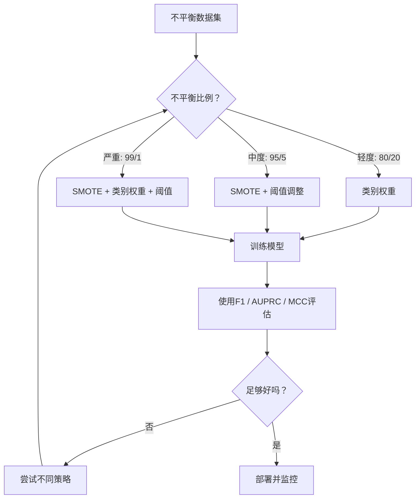
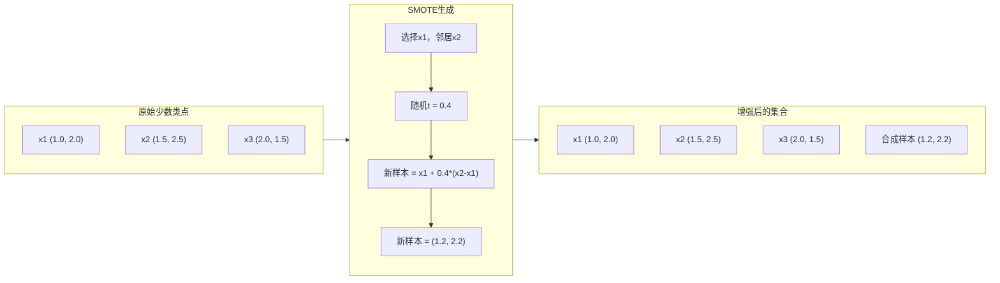
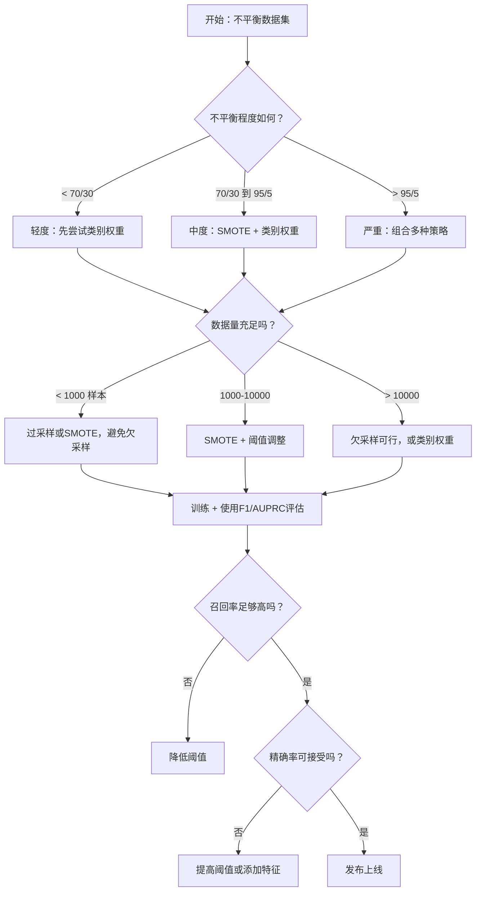

# 处理不平衡数据

> 当99%的数据是“正常”时，准确率就是一个谎言。

**类型：** 构建  
**语言：** Python  
**前置条件：** 第二阶段，第01-09课（特别是评估指标）  
**时间：** 约90分钟

## 学习目标

- 从零实现SMOTE，并解释合成过采样与随机重复的区别
- 使用F1、AUPRC和Matthews相关系数（Matthews Correlation Coefficient）而非准确率来评估不平衡分类器
- 比较类别加权（class weighting）、阈值调整（threshold tuning）和重采样（resampling）策略，并针对给定的不平衡比例选择正确的方法
- 构建一个完整的不平衡数据流水线，结合SMOTE、类别权重和阈值优化

## 问题所在

你构建了一个欺诈检测模型。准确率达到99.9%。你庆祝了一番。然后你发现它对每一笔交易都预测为“非欺诈”。

这不是一个bug。当只有0.1%的交易是欺诈时，这是理性的做法。模型学会了：总是预测多数类可以使整体误差最小化。这在技术上是正确的，但完全没用。

在所有实际分类问题中，这种情况都会发生。疾病诊断：阳性率1%。网络入侵：攻击率0.01%。制造缺陷：次品率0.5%。垃圾邮件过滤：垃圾邮件率20%。客户流失预测：流失率5%。少数类越重要，它往往就越稀有。

准确率失效，是因为它平等对待所有正确的预测。正确标记合法交易和正确捕获欺诈，在准确率中都只算作一分。但捕获欺诈才是模型存在的全部理由。我们需要能够迫使模型关注稀有但重要类别的指标、技术和训练策略。

## 概念

### 为什么准确率会失效

考虑一个包含1000个样本的数据集：990个负样本，10个正样本。一个总是预测负样本的模型：

|  | 预测为正 | 预测为负 |
|---|---|---|
| 实际为正 | 0 (TP) | 10 (FN) |
| 实际为负 | 0 (FP) | 990 (TN) |

准确率 = (0 + 990) / 1000 = 99.0%

模型捕获了零个欺诈、零个疾病、零个缺陷。但准确率却说99%。这就是为什么准确率在不平衡问题上很危险。

### 更好的指标

**精确率（Precision）** = TP / (TP + FP)。在所有被标记为正的样本中，有多少确实为正？高精确率意味着误报少。

**召回率（Recall）** = TP / (TP + FN)。在所有实际为正的样本中，我们捕获了多少？高召回率意味着漏报少。

**F1分数（F1 Score）** = 2 * 精确率 * 召回率 / (精确率 + 召回率)。调和平均数。比算术平均数更严厉地惩罚精确率和召回率之间的极端不平衡。

**F-beta分数（F-beta Score）** = (1 + beta^2) * 精确率 * 召回率 / (beta^2 * 精确率 + 召回率)。当 beta > 1 时，召回率更重要；当 beta < 1 时，精确率更重要。在欺诈检测中常用F2（漏掉欺诈比误报更糟糕）。

**AUPRC（精确率-召回率曲线下面积）**。类似AUC-ROC，但对不平衡数据信息量更大。随机分类器的AUPRC等于正类比例（不像ROC那样是0.5）。这使得改进更容易被观察到。

**Matthews相关系数（Matthews Correlation Coefficient, MCC）** = (TP * TN - FP * FN) / sqrt((TP+FP)(TP+FN)(TN+FP)(TN+FN))。取值范围从-1到+1。只有当模型在两个类别上都表现良好时才会得到高分。即使类别大小差异很大，它也是平衡的。

对于上述“总是预测负类”的模型：精确率 = 0/0（未定义，通常设为0），召回率 = 0/10 = 0，F1 = 0，MCC = 0。这些指标正确地将模型识别为毫无价值。

### 不平衡数据流水线



### SMOTE：合成少数类过采样技术

随机过采样（Random Oversampling）会复制现有的少数类样本。这虽然有效，但有过度拟合的风险，因为模型会反复看到相同的点。

SMOTE创建新的合成少数类样本，这些样本是合理的但不是副本。算法步骤如下：

1. 对于每个少数类样本 x，在其同类少数类样本中找到 k 个最近邻
2. 随机选择一个邻居
3. 在 x 与该邻居之间的线段上创建一个新样本

公式：`新样本 = x + random(0, 1) * (邻居 - x)`

这会在真实的少数类点之间进行插值，在特征空间的同一区域内创建新样本，而不仅仅是复制现有数据。



### 重采样策略对比

**随机过采样**：复制少数样本以匹配多数类的数量。
- 优点：简单，无信息损失
- 缺点：精确副本导致过拟合，增加训练时间

**随机欠采样**：移除多数样本以匹配少数类的数量。
- 优点：训练快，简单
- 缺点：丢弃可能有用的多数类数据，方差更高

**SMOTE**：通过插值创建合成少数样本。
- 优点：生成新数据点，相比随机过采样减少过拟合
- 缺点：可能在决策边界附近产生噪声样本，不考虑多数类分布

| 策略 | 数据变化 | 风险 | 何时使用 |
|------|----------|------|----------|
| 过采样 | 少数类被复制 | 过拟合 | 小数据集，中度不平衡 |
| 欠采样 | 多数类被移除 | 信息损失 | 大数据集，希望快速训练 |
| SMOTE | 添加合成少数样本 | 边界噪声 | 中度不平衡，有足够少数样本进行k-NN |

### 类别权重

与其改变数据，不如改变模型处理错误的方式。给少数类错误分类分配更高的权重。

对于一个包含950个负样本和50个正样本的二元问题：
- 负类权重 = n_samples / (2 * n_negative) = 1000 / (2 * 950) = 0.526
- 正类权重 = n_samples / (2 * n_positive) = 1000 / (2 * 50) = 10.0

正类获得19倍的权重。错误分类一个正样本的代价等于错误分类19个负样本。模型被迫关注少数类。

在逻辑回归中，这会修改损失函数：

```
weighted_loss = -sum(w_i * [y_i * log(p_i) + (1-y_i) * log(1-p_i)])
```

其中 w_i 取决于样本 i 的类别。

类别权重在期望上与过采样数学等价，但不会创建新的数据点。这使得它们更快，并且避免了重复样本导致的过拟合风险。

### 阈值调整

大多数分类器输出概率。默认阈值为0.5：如果P(正类) >= 0.5，则预测为正类。但0.5是任意的。当类别不平衡时，最优阈值通常要低得多。

过程：
1. 训练模型
2. 在验证集上获取预测概率
3. 在0.0到1.0范围内扫描阈值
4. 计算每个阈值下的F1（或你选择的指标）
5. 选取最大化指标的那个阈值


一个模型可能为一笔欺诈交易输出P(欺诈) = 0.15。在阈值0.5下，这被分类为非欺诈。在阈值0.10下，它被正确捕获。概率校准不如排序重要——只要欺诈的概率高于非欺诈，就存在一个能区分它们的阈值。

### 代价敏感学习（Cost-Sensitive Learning）

类别权重的一般化。不再使用统一的代价，而是分配特定的误分类代价：

| | 预测为正 | 预测为负 |
|---|---|---|
| 实际为正 | 0（正确） | C_FN = 100 |
| 实际为负 | C_FP = 1 | 0（正确） |

漏掉一笔欺诈交易（FN）的代价是误报（FP）的100倍。模型优化的是总代价，而不是总错误数。

这是当你能估计真实世界成本时最根本的方法。漏诊癌症的代价与一次额外活检的误报代价截然不同。明确这些成本会迫使做出正确的权衡。

### 决策流程图



## 动手构建

### 第一步：生成不平衡数据集

```python
import numpy as np


def make_imbalanced_data(n_majority=950, n_minority=50, seed=42):
    rng = np.random.RandomState(seed)

    X_maj = rng.randn(n_majority, 2) * 1.0 + np.array([0.0, 0.0])
    X_min = rng.randn(n_minority, 2) * 0.8 + np.array([2.5, 2.5])

    X = np.vstack([X_maj, X_min])
    y = np.concatenate([np.zeros(n_majority), np.ones(n_minority)])

    shuffle_idx = rng.permutation(len(y))
    return X[shuffle_idx], y[shuffle_idx]
```

### 第二步：从零实现SMOTE

```python
def euclidean_distance(a, b):
    return np.sqrt(np.sum((a - b) ** 2))


def find_k_neighbors(X, idx, k):
    distances = []
    for i in range(len(X)):
        if i == idx:
            continue
        d = euclidean_distance(X[idx], X[i])
        distances.append((i, d))
    distances.sort(key=lambda x: x[1])
    return [d[0] for d in distances[:k]]


def smote(X_minority, k=5, n_synthetic=100, seed=42):
    rng = np.random.RandomState(seed)
    n_samples = len(X_minority)
    k = min(k, n_samples - 1)
    synthetic = []

    for _ in range(n_synthetic):
        idx = rng.randint(0, n_samples)
        neighbors = find_k_neighbors(X_minority, idx, k)
        neighbor_idx = neighbors[rng.randint(0, len(neighbors))]
        t = rng.random()
        new_point = X_minority[idx] + t * (X_minority[neighbor_idx] - X_minority[idx])
        synthetic.append(new_point)

    return np.array(synthetic)
```

### 第三步：随机过采样和欠采样

```python
def random_oversample(X, y, seed=42):
    rng = np.random.RandomState(seed)
    classes, counts = np.unique(y, return_counts=True)
    max_count = counts.max()

    X_resampled = list(X)
    y_resampled = list(y)

    for cls, count in zip(classes, counts):
        if count < max_count:
            cls_indices = np.where(y == cls)[0]
            n_needed = max_count - count
            chosen = rng.choice(cls_indices, size=n_needed, replace=True)
            X_resampled.extend(X[chosen])
            y_resampled.extend(y[chosen])

    X_out = np.array(X_resampled)
    y_out = np.array(y_resampled)
    shuffle = rng.permutation(len(y_out))
    return X_out[shuffle], y_out[shuffle]


def random_undersample(X, y, seed=42):
    rng = np.random.RandomState(seed)
    classes, counts = np.unique(y, return_counts=True)
    min_count = counts.min()

    X_resampled = []
    y_resampled = []

    for cls in classes:
        cls_indices = np.where(y == cls)[0]
        chosen = rng.choice(cls_indices, size=min_count, replace=False)
        X_resampled.extend(X[chosen])
        y_resampled.extend(y[chosen])

    X_out = np.array(X_resampled)
    y_out = np.array(y_resampled)
    shuffle = rng.permutation(len(y_out))
    return X_out[shuffle], y_out[shuffle]
```

### 第四步：带类别权重的逻辑回归

```python
def sigmoid(z):
    return 1.0 / (1.0 + np.exp(-np.clip(z, -500,