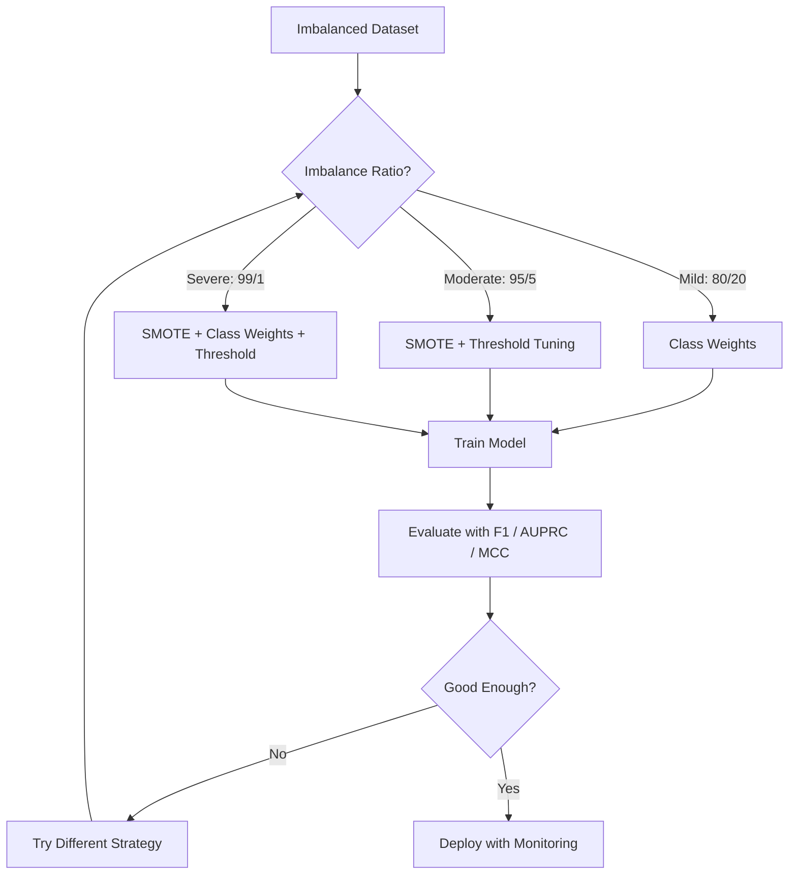
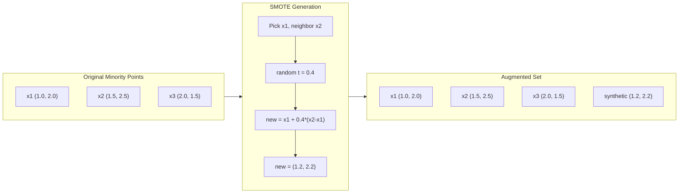
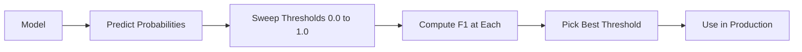
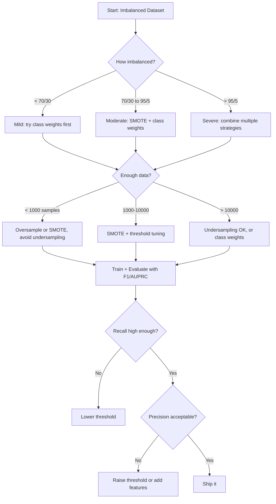

# 处理不平衡的数据

> 当99%的数据都是“正常”的时候，准确性就是一个谎言。

** 类型：** 构建
** 语言：** Python
** 先决条件：** 第2阶段，课程01-09（尤其是评估指标）
** 时间：** ~90分钟

## 学习目标

- 从头开始实施SMOTE并解释合成过度采样与随机复制的不同之处
- 使用F1、AUPRC和Matthews相关系数而不是准确性来评估不平衡的分类器
- 比较类别加权、阈值调整和重新分配策略，并为给定的失衡率选择正确的方法
- 构建一个完整的不平衡数据管道，结合了SMOTE、类权重和阈值优化

## 问题

您构建欺诈检测模型。准确率为99.9%。你庆祝。然后您意识到它预测每笔交易“不会欺诈”。

这不是一个错误。当只有0.1%的交易是欺诈性的时，这样做是理性的。该模型了解到，总是猜测多数类别可以最大限度地减少总体误差。它在技术上是正确的，但完全无用。

这种情况在真正的分类很重要的地方都会发生。疾病诊断：阳性率1%。网络入侵：0.01%的攻击。制造缺陷：0.5%缺陷。垃圾邮件过滤：20%垃圾邮件。流失率预测：5%流失率。少数族裔阶层越重要，就越稀有。

准确性失败，因为它平等地对待所有正确的预测。正确标记合法交易和正确捕捉欺诈行为都算作准确性之一。但捕捉欺诈行为是该模型存在的全部原因。我们需要指标、技术和训练策略来迫使模型关注罕见但重要的类别。

## 概念

### 为什么准确性失败

考虑一个具有1000个样本的数据集：990个阴性，10个阳性。一个总是预测负面的模型：

|  | 预测的肯定 | 预测阴性 |
|--|---|---|
| 实际上积极 | 0（TP） | 10（FN） |
| 实际上存在负 | 0（FP） | 990（TN） |

准确度=（0 + 990）/ 1000 = 99.0%

该模型捕捉零欺诈行为。零疾病。零缺陷。但准确率是99%。这就是为什么准确性对于不平衡的问题是危险的。

### 更好的服务

** 精度 ** = TP /（TP + FP）。在所有标记为阳性的东西中，有多少实际上是阳性的？高精度意味着几乎没有误报。

** 回想 ** = TP /（TP + FN）。在所有真正积极的事情中，我们抓到了多少？高召回意味着很少有遗漏的积极信息。

**F1得分 ** = 2 * 精确度 * 召回/（精确度+召回）。调和平均值。比算术平均值更能惩罚精确度和召回率之间的极端不平衡。

**F-Beta评分 ** =（1 + beta ' 2）* 精确度 * 召回/（beta ' 2 * 精确度+召回）。当Beta > 1时，回忆起就更重要了。当Beta < 1时，精确性更加重要。F2在欺诈检测中很常见（错过欺诈比误报更糟糕）。

**AUPRC**（精确召回曲线下面积）。与AUC-ROC类似，但对于不平衡的数据更具信息性。随机分类器的AUPRC等于正分类率（而不是像ROC那样的0.5）。这使得改进更容易看到。

** 马修斯相关系数 ** =（TP * TN-FP * FN）/ sqrt（（TP+FP）（TP+FN）（TN+FP）（TN+FN））。范围从-1到+1。只有当模型在两个类上都表现良好时，才会给出高分。平衡，即使班级规模非常不同。

对于上面的“总是预测负面”模型：精度= 0/0（未定义，通常设置为0），召回= 0/10 = 0，F1 = 0，MCC = 0。这些指标正确地将模型识别为毫无价值。

### 不平衡的数据管道



### SMOTE：合成少数族裔过采样技术

随机过度抽样重复现有的少数族裔样本。这是可行的，但存在过度匹配的风险，因为模型反复看到相同的点。

SMOTE创建了新的合成少数族裔样本，这些样本看似合理，但不是复制品。算法：

1. 对于每个少数族裔样本x，在其他少数族裔样本中找到其k个最近的邻居
2. 随机选择一个邻居
3. 在x和该邻居之间的直线段上创建新样本

公式：“new_sample = x + random（0，1）*（neighborhood- x）”

这在真实的少数点之间进行插值，在特征空间的相同区域中创建样本，而无需复制现有数据。



### 抽样策略比较

** 随机过采样 **：重复少数样本以匹配多数计数。
- 优点：简单，无信息丢失
- 缺点：完全重复会导致过度贴合，增加训练时间

** 随机欠采样 **：删除多数样本以匹配少数计数。
- 优点：训练快，简单
- 缺点：丢弃了潜在有用的多数数据，方差较高

**SMOTE**：通过插值创建合成少数族裔样本。
- 优点：生成新的数据点，与随机过采样相比减少了过拟
- 缺点：可以在决策边界附近创建有噪的样本，不考虑多数类别分布

| 战略 | 更改的数据 | 风险 | 何时使用 |
|----------|-------------|------|-------------|
| 过采样 | 少数族裔重复 | 过拟合 | 数据集小，不平衡适度 |
| 样本不足 | 多数被删除 | 信息损失 | 大型数据集，需要快速训练 |
| 击杀 | 添加合成少数族裔 | 边界噪声 | 中度失衡，k-NN有足够的少数样本 |

### 班级重量

不要更改数据，而是更改模型处理错误的方式。对少数族裔阶层的错误分类给予更高的权重。

对于具有950个阴性样本和50个阳性样本的二元问题：
- 负类的权重= n_samples /（2 * n_negative）= 1000 /（2 * 950）= 0.526
- 阳性类别的权重= n_samples /（2 * n_positive）= 1000 /（2 * 50）= 10.0

正类获得19倍的重量。错误分类一个阳性样本的成本与错误分类19个阴性样本的成本相同。该模式被迫关注少数群体。

在逻辑回归中，这修改了损失函数：

```
weighted_loss = -sum(w_i * [y_i * log(p_i) + (1-y_i) * log(1-p_i)])
```

其中w_i取决于样本i的类。

类权重在数学上相当于预期的过采样，但不会创建新的数据点。这使它们更快，并避免重复样本的过度匹配风险。

### 阈值调谐

大多数分类器输出概率。默认阈值为0.5：如果P（正）>= 0.5，则预测为正。但0.5是任意的。当班级不平衡时，最佳阈值通常要低得多。

过程：
1. 训练模型
2. 获取验证集中的预测概率
3. 扫描阈值从0.0到1.0
4. 计算每个阈值的F1（或您选择的指标）
5. 选择使指标最大化的阈值



对于欺诈交易，模型可能输出P（欺诈）= 0.15。在阈值0.5时，这被归类为非欺诈。在阈值0.10时，它被正确捕获。概率校准比排名重要得多--只要欺诈的概率高于非欺诈，就存在一个将它们分开的阈值。

### 代价敏感学习

类别权重的推广。不要统一成本，而是指定具体的错误分类成本：

|  | 预测积极 | 预测阴性 |
|--|---|---|
| 实际上积极 | 0（正确） | C_FN = 100 |
| 实际上存在负 | C_FP = 1 | 0（正确） |

错过欺诈性交易（FN）的成本是误报（FP）的100倍。该模型优化了总成本，而不是总错误计数。

当您可以估计现实世界的成本时，这是最有原则的方法。错过的癌症诊断的成本与导致额外活检的虚惊截然不同。将这些成本明确化可以迫使我们做出正确的权衡。

### 决策流程图



## 建设党

### 第1步：生成不平衡的数据集

```python
import numpy as np


def make_imbalanced_data(n_majority=950, n_minority=50, seed=42):
    rng = np.random.RandomState(seed)

    X_maj = rng.randn(n_majority, 2) * 1.0 + np.array([0.0, 0.0])
    X_min = rng.randn(n_minority, 2) * 0.8 + np.array([2.5, 2.5])

    X = np.vstack([X_maj, X_min])
    y = np.concatenate([np.zeros(n_majority), np.ones(n_minority)])

    shuffle_idx = rng.permutation(len(y))
    return X[shuffle_idx], y[shuffle_idx]
```

### 第2步：从头开始

```python
def euclidean_distance(a, b):
    return np.sqrt(np.sum((a - b) ** 2))


def find_k_neighbors(X, idx, k):
    distances = []
    for i in range(len(X)):
        if i == idx:
            continue
        d = euclidean_distance(X[idx], X[i])
        distances.append((i, d))
    distances.sort(key=lambda x: x[1])
    return [d[0] for d in distances[:k]]


def smote(X_minority, k=5, n_synthetic=100, seed=42):
    rng = np.random.RandomState(seed)
    n_samples = len(X_minority)
    k = min(k, n_samples - 1)
    synthetic = []

    for _ in range(n_synthetic):
        idx = rng.randint(0, n_samples)
        neighbors = find_k_neighbors(X_minority, idx, k)
        neighbor_idx = neighbors[rng.randint(0, len(neighbors))]
        t = rng.random()
        new_point = X_minority[idx] + t * (X_minority[neighbor_idx] - X_minority[idx])
        synthetic.append(new_point)

    return np.array(synthetic)
```

### 第3步：随机过度采样和欠采样

```python
def random_oversample(X, y, seed=42):
    rng = np.random.RandomState(seed)
    classes, counts = np.unique(y, return_counts=True)
    max_count = counts.max()

    X_resampled = list(X)
    y_resampled = list(y)

    for cls, count in zip(classes, counts):
        if count < max_count:
            cls_indices = np.where(y == cls)[0]
            n_needed = max_count - count
            chosen = rng.choice(cls_indices, size=n_needed, replace=True)
            X_resampled.extend(X[chosen])
            y_resampled.extend(y[chosen])

    X_out = np.array(X_resampled)
    y_out = np.array(y_resampled)
    shuffle = rng.permutation(len(y_out))
    return X_out[shuffle], y_out[shuffle]


def random_undersample(X, y, seed=42):
    rng = np.random.RandomState(seed)
    classes, counts = np.unique(y, return_counts=True)
    min_count = counts.min()

    X_resampled = []
    y_resampled = []

    for cls in classes:
        cls_indices = np.where(y == cls)[0]
        chosen = rng.choice(cls_indices, size=min_count, replace=False)
        X_resampled.extend(X[chosen])
        y_resampled.extend(y[chosen])

    X_out = np.array(X_resampled)
    y_out = np.array(y_resampled)
    shuffle = rng.permutation(len(y_out))
    return X_out[shuffle], y_out[shuffle]
```

### 第4步：使用类别权重的逻辑回归

```python
def sigmoid(z):
    return 1.0 / (1.0 + np.exp(-np.clip(z, -500, 500)))


def logistic_regression_weighted(X, y, weights, lr=0.01, epochs=200):
    n_samples, n_features = X.shape
    w = np.zeros(n_features)
    b = 0.0

    for _ in range(epochs):
        z = X @ w + b
        pred = sigmoid(z)
        error = pred - y
        weighted_error = error * weights

        gradient_w = (X.T @ weighted_error) / n_samples
        gradient_b = np.mean(weighted_error)

        w -= lr * gradient_w
        b -= lr * gradient_b

    return w, b


def compute_class_weights(y):
    classes, counts = np.unique(y, return_counts=True)
    n_samples = len(y)
    n_classes = len(classes)
    weight_map = {}
    for cls, count in zip(classes, counts):
        weight_map[cls] = n_samples / (n_classes * count)
    return np.array([weight_map[yi] for yi in y])
```

### 第5步：阈值调整

```python
def find_optimal_threshold(y_true, y_probs, metric="f1"):
    best_threshold = 0.5
    best_score = -1.0

    for threshold in np.arange(0.05, 0.96, 0.01):
        y_pred = (y_probs >= threshold).astype(int)
        tp = np.sum((y_pred == 1) & (y_true == 1))
        fp = np.sum((y_pred == 1) & (y_true == 0))
        fn = np.sum((y_pred == 0) & (y_true == 1))

        if metric == "f1":
            precision = tp / (tp + fp) if (tp + fp) > 0 else 0.0
            recall = tp / (tp + fn) if (tp + fn) > 0 else 0.0
            score = 2 * precision * recall / (precision + recall) if (precision + recall) > 0 else 0.0
        elif metric == "recall":
            score = tp / (tp + fn) if (tp + fn) > 0 else 0.0
        elif metric == "precision":
            score = tp / (tp + fp) if (tp + fp) > 0 else 0.0

        if score > best_score:
            best_score = score
            best_threshold = threshold

    return best_threshold, best_score
```

### 步骤6：评价职能

```python
def confusion_matrix_values(y_true, y_pred):
    tp = np.sum((y_pred == 1) & (y_true == 1))
    tn = np.sum((y_pred == 0) & (y_true == 0))
    fp = np.sum((y_pred == 1) & (y_true == 0))
    fn = np.sum((y_pred == 0) & (y_true == 1))
    return tp, tn, fp, fn


def compute_metrics(y_true, y_pred):
    tp, tn, fp, fn = confusion_matrix_values(y_true, y_pred)
    accuracy = (tp + tn) / (tp + tn + fp + fn)
    precision = tp / (tp + fp) if (tp + fp) > 0 else 0.0
    recall = tp / (tp + fn) if (tp + fn) > 0 else 0.0
    f1 = 2 * precision * recall / (precision + recall) if (precision + recall) > 0 else 0.0

    denom = np.sqrt(float((tp + fp) * (tp + fn) * (tn + fp) * (tn + fn)))
    mcc = (tp * tn - fp * fn) / denom if denom > 0 else 0.0

    return {
        "accuracy": accuracy,
        "precision": precision,
        "recall": recall,
        "f1": f1,
        "mcc": mcc,
    }
```

### 第7步：比较所有方法

```python
X, y = make_imbalanced_data(950, 50, seed=42)
split = int(0.8 * len(y))
X_train, X_test = X[:split], X[split:]
y_train, y_test = y[:split], y[split:]

# Baseline: no treatment
w_base, b_base = logistic_regression_weighted(
    X_train, y_train, np.ones(len(y_train)), lr=0.1, epochs=300
)
probs_base = sigmoid(X_test @ w_base + b_base)
preds_base = (probs_base >= 0.5).astype(int)

# Oversampled
X_over, y_over = random_oversample(X_train, y_train)
w_over, b_over = logistic_regression_weighted(
    X_over, y_over, np.ones(len(y_over)), lr=0.1, epochs=300
)
preds_over = (sigmoid(X_test @ w_over + b_over) >= 0.5).astype(int)

# SMOTE
minority_mask = y_train == 1
X_minority = X_train[minority_mask]
synthetic = smote(X_minority, k=5, n_synthetic=len(y_train) - 2 * int(minority_mask.sum()))
X_smote = np.vstack([X_train, synthetic])
y_smote = np.concatenate([y_train, np.ones(len(synthetic))])
w_sm, b_sm = logistic_regression_weighted(
    X_smote, y_smote, np.ones(len(y_smote)), lr=0.1, epochs=300
)
preds_smote = (sigmoid(X_test @ w_sm + b_sm) >= 0.5).astype(int)

# Class weights
sample_weights = compute_class_weights(y_train)
w_cw, b_cw = logistic_regression_weighted(
    X_train, y_train, sample_weights, lr=0.1, epochs=300
)
probs_cw = sigmoid(X_test @ w_cw + b_cw)
preds_cw = (probs_cw >= 0.5).astype(int)

# Threshold tuning (tune on held-out validation set, not test set)
probs_val = sigmoid(X_val @ w_cw + b_cw)
best_thresh, best_f1 = find_optimal_threshold(y_val, probs_val, metric="f1")
preds_thresh = (probs_cw >= best_thresh).astype(int)
```

代码文件在单个脚本中运行所有这些并打印结果。

## 使用它

对于scikit-learn和imbalanced-learn，这些技术只是一行程序：

```python
from sklearn.linear_model import LogisticRegression
from sklearn.metrics import classification_report, f1_score
from sklearn.model_selection import train_test_split
from imblearn.over_sampling import SMOTE
from imblearn.under_sampling import RandomUnderSampler
from imblearn.pipeline import Pipeline

X_train, X_test, y_train, y_test = train_test_split(X, y, stratify=y)

model_weighted = LogisticRegression(class_weight="balanced")
model_weighted.fit(X_train, y_train)
print(classification_report(y_test, model_weighted.predict(X_test)))

smote = SMOTE(random_state=42)
X_resampled, y_resampled = smote.fit_resample(X_train, y_train)
model_smote = LogisticRegression()
model_smote.fit(X_resampled, y_resampled)
print(classification_report(y_test, model_smote.predict(X_test)))

pipeline = Pipeline([
    ("smote", SMOTE()),
    ("model", LogisticRegression(class_weight="balanced")),
])
pipeline.fit(X_train, y_train)
print(classification_report(y_test, pipeline.predict(X_test)))
```

从头开始的实现准确地展示了每种技术的作用。SMOTE只是少数族裔阶层的k-NN插值。班级权重会增加损失。阈值调整是针对循环的截止。没有魔法。

## 把它运

本课产生：
- '输出/skill-imbalanced-data.md '--处理不平衡分类问题的决策清单

## 演习

1. ** 边境-SMOTE **：修改SMOTE实现，以仅为决策边界附近的少数点（其k近邻包括多数类样本的那些点）生成合成样本。将结果与类别重叠的数据集的标准SMOTE进行比较。

2. ** 成本矩阵优化 **：实施以成本矩阵为参数的成本敏感学习。创建一个函数，采用成本矩阵并返回最佳预测，以最小化预期成本。使用不同的成本比（1：10、1：100、1：1000）进行测试，并绘制精确度-召回权衡的变化情况。

3. ** 阈值校准 **：实施Platt缩放（对模型的原始输出进行逻辑回归以产生校准的概率）。比较校准前后的准确率-召回曲线。表明校准不会改变排名（UC保持不变），但会使概率更有意义。

4. ** 使用平衡装袋加入 **：训练多个模型，每个模型都在平衡的引导样本上（所有少数群体+多数群体的随机子集）。平均他们的预测。将此方法与SMOTE的单个模型进行比较。测量运行期间的性能和方差。

5. ** 不平衡比实验 **：取一个平衡的数据集，并逐渐增加不平衡比（50/50，70/30，90/10，95/5，99/1）。对于每个比率，使用和不使用SMOTE进行训练。两种方法的F1与不平衡比图。SMOTE在什么比例下开始产生有意义的差异？

## 关键术语

| Term | 别人怎么说 | 它实际上意味着什么 |
|------|----------------|----------------------|
| 类不平衡 | “一个班级的样本多得多” | 数据集中类别的分布显着倾斜，导致模型偏向多数类别 |
| 击杀 | “合成过度采样” | 通过在现有少数族裔样本及其k-最近少数族裔邻居之间进行插值来创建新的少数族裔样本 |
| 班级体重 | “让罕见课程上的错误变得更加昂贵” | 将损失函数乘以特定类别的权重，以便该模型更严重地惩罚少数族裔错误分类 |
| 阈值调谐 | “移动决策边界” | 将分类的概率截止值从默认0.5更改为优化所需指标的值 |
| 精确召回权衡 | “你不可能两者兼得” | 降低阈值会捕获更多的阳性（更高的召回率），但也会标记更多的假阳性（更低的精确度），反之亦然 |
| AUPRC | “PR曲线下面积” | 将准确率-召回曲线总结为一个数字;当类别严重不平衡时，比AUC-ROC信息更多 |
| 马修斯相关系数 | “平衡指标” | 预测标签和实际标签之间的相关性只有当模型在两个类别上表现良好时才会产生高分 |
| 代价敏感学习 | “不同的错误造成不同的损失” | 将现实世界的错误分类成本转嫁到训练目标中，以便模型针对总成本而不是错误计数进行优化 |
| 随机过度抽样 | “复制少数派” | 重复少数族裔班级样本以平衡班级计数;简单，但有过度适应重复点的风险 |

## 进一步阅读

- [SMOTE：合成少数群体过采样技术（Chawla等人，2002）]（https：//arxiv.org/ab/1106.1813）--SMOTE最初的论文，仍然是被引用最多的关于不平衡学习的著作
- [从不平衡数据中学习（He & Garcia，2009）]（https：//ieeexplore.ieee.org/document/5128907）--涵盖抽样、成本敏感和算法方法的全面调查
- [imbalanced-learn文档]（https：//imbalanced-learn.org/stable/）--具有SMOTE变体、欠采样策略和管道集成的Python库
- [The精确回忆情节比ROC情节更有信息性（Saito & Thommsmeier，2015）]（https：journals.plos.org/plosone/article? id=10.1371/journal.pone.0118432）--何时以及为什么更喜欢PR曲线而不是ROC曲线来解决不平衡问题
