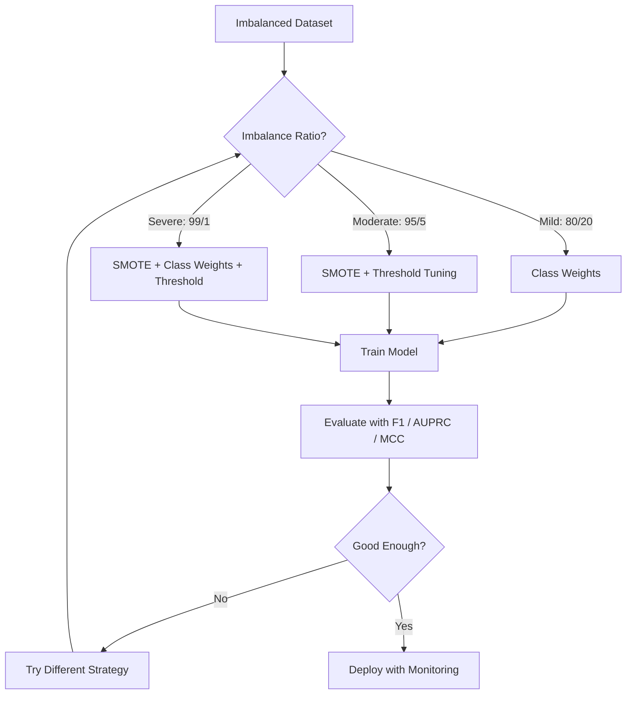
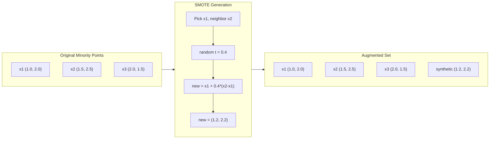
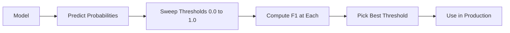
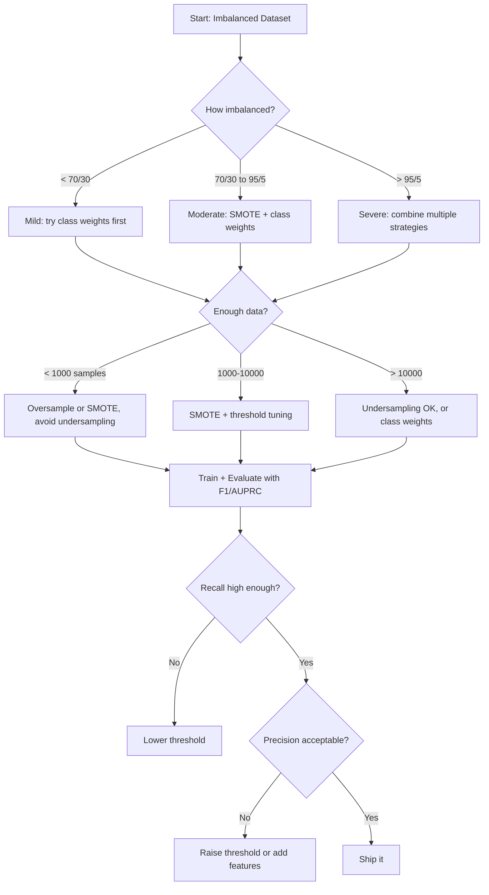

# 17 · 处理不平衡数据

> 当 99% 的数据都是「正常」时，准确率就是一个谎言。

**类型：** 实战
**语言：** Python
**前置：** 第二阶段，第 01-09 课（尤其是评估指标）
**时长：** 约 90 分钟

## 学习目标

- 从零实现 SMOTE，并解释合成过采样（synthetic oversampling）与随机复制的区别
- 用 F1、AUPRC 和马修斯相关系数（Matthews Correlation Coefficient）而非准确率来评估不平衡分类器
- 比较类别加权（class weighting）、阈值调优（threshold tuning）和重采样（resampling）策略，并为给定的不平衡比例选择正确的方法
- 构建一条完整的不平衡数据流水线，综合运用 SMOTE、类别权重和阈值优化

## 问题所在

你构建了一个欺诈检测模型，它取得了 99.9% 的准确率。你为此欢呼。然后你意识到：它对每一笔交易都预测「非欺诈」。

这不是 bug。当只有 0.1% 的交易是欺诈时，这恰恰是理性的做法。模型学到的是：永远猜测多数类（majority class）能让总体误差最小化。它在技术上完全正确，却也完全没用。

这种情况在每一个真实分类问题中都会出现。疾病诊断：1% 的阳性率。网络入侵：0.01% 的攻击。制造缺陷：0.5% 的次品。垃圾邮件过滤：20% 的垃圾邮件。流失预测：5% 的流失用户。少数类（minority class）越重要，往往就越稀有。

准确率之所以失效，是因为它对所有正确预测一视同仁。正确标注一笔合法交易，和正确抓出一笔欺诈，都同样只计为一分准确率。但抓出欺诈才是模型存在的全部意义。我们需要的指标、技术和训练策略，必须迫使模型去关注那个稀有但重要的类别。

## 核心概念

### 为什么准确率会失效

考虑一个有 1000 个样本的数据集：990 个负样本，10 个正样本。一个永远预测负类的模型：

|  | 预测为正 | 预测为负 |
|--|---|---|
| 实际为正 | 0 (TP) | 10 (FN) |
| 实际为负 | 0 (FP) | 990 (TN) |

准确率 = (0 + 990) / 1000 = 99.0%

这个模型抓出了零起欺诈、零例疾病、零个缺陷。但准确率却说它有 99%。这就是为什么准确率对不平衡问题如此危险。

### 更好的指标

**精确率（Precision）** = TP / (TP + FP)。在所有被标记为正的样本中，有多少真的是正？高精确率意味着误报少。

**召回率（Recall）** = TP / (TP + FN)。在所有实际为正的样本中，我们抓出了多少？高召回率意味着漏报少。

**F1 分数（F1 Score）** = 2 * precision * recall / (precision + recall)。即调和平均数（harmonic mean）。相比算术平均数，它对精确率和召回率之间的极端不平衡惩罚更重。

**F-beta 分数（F-beta Score）** = (1 + beta^2) * precision * recall / (beta^2 * precision + recall)。当 beta > 1 时，召回率更重要；当 beta < 1 时，精确率更重要。F2 在欺诈检测中很常用（漏掉欺诈比误报更糟）。

**AUPRC**（精确率-召回率曲线下面积，Area Under Precision-Recall Curve）。类似 AUC-ROC，但对不平衡数据更有参考价值。随机分类器的 AUPRC 等于正类比例（而非 ROC 那样的 0.5）。这使得改进更容易被看见。

**马修斯相关系数（Matthews Correlation Coefficient）** = (TP * TN - FP * FN) / sqrt((TP+FP)(TP+FN)(TN+FP)(TN+FN))。取值范围从 -1 到 +1。只有当模型在两个类别上都表现良好时才会给出高分。即使类别规模差异极大，它也能保持平衡。

对于上面那个「永远预测负类」的模型：precision = 0/0（未定义，通常设为 0），recall = 0/10 = 0，F1 = 0，MCC = 0。这些指标正确地把该模型识别为毫无价值。

### 不平衡数据流水线



### SMOTE：合成少数类过采样技术（Synthetic Minority Oversampling Technique）

随机过采样（random oversampling）会复制已有的少数类样本。这能起作用，但有过拟合风险，因为模型会反复看到完全相同的点。

SMOTE 则创造出新的合成少数类样本——它们看起来合理，但不是副本。算法如下：

1. 对每个少数类样本 x，在其他少数类样本中找到它的 k 个最近邻
2. 随机挑选一个邻居
3. 在 x 与该邻居之间的线段上创建一个新样本

公式：`new_sample = x + random(0, 1) * (neighbor - x)`

这相当于在真实的少数类点之间做插值，在特征空间的同一区域内生成样本，而不是简单地复制已有数据。



### 采样策略对比

**随机过采样（Random Oversampling）**：复制少数类样本，使其数量与多数类持平。
- 优点：简单，无信息损失
- 缺点：完全相同的副本导致过拟合，增加训练时间

**随机欠采样（Random Undersampling）**：删除多数类样本，使其数量与少数类持平。
- 优点：训练快，简单
- 缺点：丢弃了可能有用的多数类数据，方差更高

**SMOTE**：通过插值创建合成的少数类样本。
- 优点：生成新的数据点，相比随机过采样减少了过拟合
- 缺点：可能在决策边界附近创建出噪声样本，且不考虑多数类的分布

| 策略 | 数据变化 | 风险 | 适用场景 |
|----------|-------------|------|-------------|
| 过采样 | 复制少数类 | 过拟合 | 小数据集，中度不平衡 |
| 欠采样 | 删除多数类 | 信息损失 | 大数据集，希望快速训练 |
| SMOTE | 添加合成少数类 | 边界噪声 | 中度不平衡，少数类样本足够做 k-NN |

### 类别权重

与其改变数据，不如改变模型对待错误的方式。给「误分类少数类」赋予更高的权重。

对于一个有 950 个负样本和 50 个正样本的二分类问题：
- 负类权重 = n_samples / (2 * n_negative) = 1000 / (2 * 950) = 0.526
- 正类权重 = n_samples / (2 * n_positive) = 1000 / (2 * 50) = 10.0

正类获得了 19 倍的权重。误分类一个正样本的代价，相当于误分类 19 个负样本。模型被迫去关注少数类。

在逻辑回归中，这会修改损失函数：

```
weighted_loss = -sum(w_i * [y_i * log(p_i) + (1-y_i) * log(1-p_i)])
```

其中 w_i 取决于样本 i 所属的类别。

类别权重在期望意义上等价于过采样，但不需要创建新的数据点。这使它更快，也避免了复制样本带来的过拟合风险。

### 阈值调优

大多数分类器输出的是一个概率。默认阈值是 0.5：如果 P(positive) >= 0.5，就预测为正。但 0.5 是任意选定的。当类别不平衡时，最优阈值通常会低得多。

流程：
1. 训练一个模型
2. 在验证集上获取预测概率
3. 在 0.0 到 1.0 之间扫描各个阈值
4. 在每个阈值上计算 F1（或你选定的指标）
5. 挑选能最大化你的指标的那个阈值



模型可能对一笔欺诈交易输出 P(fraud) = 0.15。在阈值 0.5 时，它被归类为非欺诈；在阈值 0.10 时，它就被正确抓出。概率的校准（calibration）不如排序重要——只要欺诈得到的概率比非欺诈更高，就一定存在一个能把它们分开的阈值。

### 代价敏感学习

类别权重的推广。不再使用统一的代价，而是为每种误分类指定具体的代价：

| | 预测为正 | 预测为负 |
|--|---|---|
| 实际为正 | 0（正确） | C_FN = 100 |
| 实际为负 | C_FP = 1 | 0（正确） |

漏掉一笔欺诈交易（FN）的代价是误报（FP）的 100 倍。模型优化的是总代价，而非错误总数。

当你能够估算出现实世界中的代价时，这是最有原则性的方法。漏诊一例癌症的代价，与导致一次额外活检的误报相比，二者大相径庭。把这些代价显式化，能迫使做出正确的权衡。

### 决策流程图



## 动手实现

### 第 1 步：生成一个不平衡数据集

```python
import numpy as np


def make_imbalanced_data(n_majority=950, n_minority=50, seed=42):
    rng = np.random.RandomState(seed)

    X_maj = rng.randn(n_majority, 2) * 1.0 + np.array([0.0, 0.0])
    X_min = rng.randn(n_minority, 2) * 0.8 + np.array([2.5, 2.5])

    X = np.vstack([X_maj, X_min])
    y = np.concatenate([np.zeros(n_majority), np.ones(n_minority)])

    shuffle_idx = rng.permutation(len(y))
    return X[shuffle_idx], y[shuffle_idx]
```

### 第 2 步：从零实现 SMOTE

```python
def euclidean_distance(a, b):
    return np.sqrt(np.sum((a - b) ** 2))


def find_k_neighbors(X, idx, k):
    distances = []
    for i in range(len(X)):
        if i == idx:
            continue
        d = euclidean_distance(X[idx], X[i])
        distances.append((i, d))
    distances.sort(key=lambda x: x[1])
    return [d[0] for d in distances[:k]]


def smote(X_minority, k=5, n_synthetic=100, seed=42):
    rng = np.random.RandomState(seed)
    n_samples = len(X_minority)
    k = min(k, n_samples - 1)
    synthetic = []

    for _ in range(n_synthetic):
        idx = rng.randint(0, n_samples)
        neighbors = find_k_neighbors(X_minority, idx, k)
        neighbor_idx = neighbors[rng.randint(0, len(neighbors))]
        t = rng.random()
        new_point = X_minority[idx] + t * (X_minority[neighbor_idx] - X_minority[idx])
        synthetic.append(new_point)

    return np.array(synthetic)
```

### 第 3 步：随机过采样与随机欠采样

```python
def random_oversample(X, y, seed=42):
    rng = np.random.RandomState(seed)
    classes, counts = np.unique(y, return_counts=True)
    max_count = counts.max()

    X_resampled = list(X)
    y_resampled = list(y)

    for cls, count in zip(classes, counts):
        if count < max_count:
            cls_indices = np.where(y == cls)[0]
            n_needed = max_count - count
            chosen = rng.choice(cls_indices, size=n_needed, replace=True)
            X_resampled.extend(X[chosen])
            y_resampled.extend(y[chosen])

    X_out = np.array(X_resampled)
    y_out = np.array(y_resampled)
    shuffle = rng.permutation(len(y_out))
    return X_out[shuffle], y_out[shuffle]


def random_undersample(X, y, seed=42):
    rng = np.random.RandomState(seed)
    classes, counts = np.unique(y, return_counts=True)
    min_count = counts.min()

    X_resampled = []
    y_resampled = []

    for cls in classes:
        cls_indices = np.where(y == cls)[0]
        chosen = rng.choice(cls_indices, size=min_count, replace=False)
        X_resampled.extend(X[chosen])
        y_resampled.extend(y[chosen])

    X_out = np.array(X_resampled)
    y_out = np.array(y_resampled)
    shuffle = rng.permutation(len(y_out))
    return X_out[shuffle], y_out[shuffle]
```

### 第 4 步：带类别权重的逻辑回归

```python
def sigmoid(z):
    return 1.0 / (1.0 + np.exp(-np.clip(z, -500, 500)))


def logistic_regression_weighted(X, y, weights, lr=0.01, epochs=200):
    n_samples, n_features = X.shape
    w = np.zeros(n_features)
    b = 0.0

    for _ in range(epochs):
        z = X @ w + b
        pred = sigmoid(z)
        error = pred - y
        weighted_error = error * weights

        gradient_w = (X.T @ weighted_error) / n_samples
        gradient_b = np.mean(weighted_error)

        w -= lr * gradient_w
        b -= lr * gradient_b

    return w, b


def compute_class_weights(y):
    classes, counts = np.unique(y, return_counts=True)
    n_samples = len(y)
    n_classes = len(classes)
    weight_map = {}
    for cls, count in zip(classes, counts):
        weight_map[cls] = n_samples / (n_classes * count)
    return np.array([weight_map[yi] for yi in y])
```

### 第 5 步：阈值调优

```python
def find_optimal_threshold(y_true, y_probs, metric="f1"):
    best_threshold = 0.5
    best_score = -1.0

    for threshold in np.arange(0.05, 0.96, 0.01):
        y_pred = (y_probs >= threshold).astype(int)
        tp = np.sum((y_pred == 1) & (y_true == 1))
        fp = np.sum((y_pred == 1) & (y_true == 0))
        fn = np.sum((y_pred == 0) & (y_true == 1))

        if metric == "f1":
            precision = tp / (tp + fp) if (tp + fp) > 0 else 0.0
            recall = tp / (tp + fn) if (tp + fn) > 0 else 0.0
            score = 2 * precision * recall / (precision + recall) if (precision + recall) > 0 else 0.0
        elif metric == "recall":
            score = tp / (tp + fn) if (tp + fn) > 0 else 0.0
        elif metric == "precision":
            score = tp / (tp + fp) if (tp + fp) > 0 else 0.0

        if score > best_score:
            best_score = score
            best_threshold = threshold

    return best_threshold, best_score
```

### 第 6 步：评估函数

```python
def confusion_matrix_values(y_true, y_pred):
    tp = np.sum((y_pred == 1) & (y_true == 1))
    tn = np.sum((y_pred == 0) & (y_true == 0))
    fp = np.sum((y_pred == 1) & (y_true == 0))
    fn = np.sum((y_pred == 0) & (y_true == 1))
    return tp, tn, fp, fn


def compute_metrics(y_true, y_pred):
    tp, tn, fp, fn = confusion_matrix_values(y_true, y_pred)
    accuracy = (tp + tn) / (tp + tn + fp + fn)
    precision = tp / (tp + fp) if (tp + fp) > 0 else 0.0
    recall = tp / (tp + fn) if (tp + fn) > 0 else 0.0
    f1 = 2 * precision * recall / (precision + recall) if (precision + recall) > 0 else 0.0

    denom = np.sqrt(float((tp + fp) * (tp + fn) * (tn + fp) * (tn + fn)))
    mcc = (tp * tn - fp * fn) / denom if denom > 0 else 0.0

    return {
        "accuracy": accuracy,
        "precision": precision,
        "recall": recall,
        "f1": f1,
        "mcc": mcc,
    }
```

### 第 7 步：对比所有方法

```python
X, y = make_imbalanced_data(950, 50, seed=42)
split = int(0.8 * len(y))
X_train, X_test = X[:split], X[split:]
y_train, y_test = y[:split], y[split:]

# 基线：不做任何处理
w_base, b_base = logistic_regression_weighted(
    X_train, y_train, np.ones(len(y_train)), lr=0.1, epochs=300
)
probs_base = sigmoid(X_test @ w_base + b_base)
preds_base = (probs_base >= 0.5).astype(int)

# 过采样
X_over, y_over = random_oversample(X_train, y_train)
w_over, b_over = logistic_regression_weighted(
    X_over, y_over, np.ones(len(y_over)), lr=0.1, epochs=300
)
preds_over = (sigmoid(X_test @ w_over + b_over) >= 0.5).astype(int)

# SMOTE
minority_mask = y_train == 1
X_minority = X_train[minority_mask]
synthetic = smote(X_minority, k=5, n_synthetic=len(y_train) - 2 * int(minority_mask.sum()))
X_smote = np.vstack([X_train, synthetic])
y_smote = np.concatenate([y_train, np.ones(len(synthetic))])
w_sm, b_sm = logistic_regression_weighted(
    X_smote, y_smote, np.ones(len(y_smote)), lr=0.1, epochs=300
)
preds_smote = (sigmoid(X_test @ w_sm + b_sm) >= 0.5).astype(int)

# 类别权重
sample_weights = compute_class_weights(y_train)
w_cw, b_cw = logistic_regression_weighted(
    X_train, y_train, sample_weights, lr=0.1, epochs=300
)
probs_cw = sigmoid(X_test @ w_cw + b_cw)
preds_cw = (probs_cw >= 0.5).astype(int)

# 阈值调优（在留出的验证集上调优，而非测试集）
probs_val = sigmoid(X_val @ w_cw + b_cw)
best_thresh, best_f1 = find_optimal_threshold(y_val, probs_val, metric="f1")
preds_thresh = (probs_cw >= best_thresh).astype(int)
```

代码文件会在单个脚本中运行以上全部流程并打印结果。

## 实际应用

借助 scikit-learn 和 imbalanced-learn，这些技术都只是一行代码的事：

```python
from sklearn.linear_model import LogisticRegression
from sklearn.metrics import classification_report, f1_score
from sklearn.model_selection import train_test_split
from imblearn.over_sampling import SMOTE
from imblearn.under_sampling import RandomUnderSampler
from imblearn.pipeline import Pipeline

X_train, X_test, y_train, y_test = train_test_split(X, y, stratify=y)

model_weighted = LogisticRegression(class_weight="balanced")
model_weighted.fit(X_train, y_train)
print(classification_report(y_test, model_weighted.predict(X_test)))

smote = SMOTE(random_state=42)
X_resampled, y_resampled = smote.fit_resample(X_train, y_train)
model_smote = LogisticRegression()
model_smote.fit(X_resampled, y_resampled)
print(classification_report(y_test, model_smote.predict(X_test)))

pipeline = Pipeline([
    ("smote", SMOTE()),
    ("model", LogisticRegression(class_weight="balanced")),
])
pipeline.fit(X_train, y_train)
print(classification_report(y_test, pipeline.predict(X_test)))
```

这些从零实现的版本，精确地展示了每种技术到底做了什么。SMOTE 不过是在少数类上做 k-NN 插值；类别权重就是给损失乘上一个系数；阈值调优就是在各个截断点上跑一个 for 循环。没有任何魔法。

## 交付成果

本课产出：
- `outputs/skill-imbalanced-data.md` —— 一份处理不平衡分类问题的决策清单

## 练习

1. **Borderline-SMOTE（边界 SMOTE）**：修改 SMOTE 实现，使其只为靠近决策边界的少数类点（即那些 k 近邻中包含多数类样本的点）生成合成样本。在一个类别有重叠的数据集上，将结果与标准 SMOTE 进行对比。

2. **代价矩阵优化**：实现代价敏感学习，把代价矩阵作为一个参数。编写一个函数，接收代价矩阵并返回能最小化期望代价的最优预测。用不同的代价比例（1:10、1:100、1:1000）进行测试，并绘制精确率-召回率权衡的变化曲线。

3. **阈值校准**：实现 Platt 缩放（Platt scaling，在模型的原始输出上拟合一个逻辑回归，以产生校准后的概率）。对比校准前后的精确率-召回率曲线。证明校准不会改变排序（AUC 保持不变），但能让概率更有意义。

4. **平衡 Bagging 集成**：训练多个模型，每个都在一个平衡的自助采样（bootstrap sample）上训练（全部少数类 + 多数类的随机子集），然后对它们的预测取平均。将这种方法与使用 SMOTE 的单个模型进行对比，衡量多次运行间的性能和方差。

5. **不平衡比例实验**：取一个平衡的数据集，逐步增大不平衡比例（50/50、70/30、90/10、95/5、99/1）。对每个比例，分别用 SMOTE 和不用 SMOTE 进行训练。为两种方法绘制 F1 随不平衡比例变化的曲线。从哪个比例开始，SMOTE 才会带来有意义的差异？

## 关键术语

| 术语 | 大家怎么说 | 实际含义 |
|------|----------------|----------------------|
| 类别不平衡（Class imbalance） | 「某个类的样本多得多」 | 数据集中各类别的分布严重倾斜，导致模型偏向多数类 |
| SMOTE | 「合成过采样」 | 通过在已有少数类样本与其 k 个最近的少数类邻居之间插值，创建新的少数类样本 |
| 类别权重（Class weights） | 「让稀有类上的错误更昂贵」 | 用各类别特定的权重去乘损失函数，使模型对少数类的误分类施以更重的惩罚 |
| 阈值调优（Threshold tuning） | 「移动决策边界」 | 把分类的概率截断点从默认的 0.5 改为一个能优化目标指标的值 |
| 精确率-召回率权衡（Precision-recall tradeoff） | 「鱼与熊掌不可兼得」 | 降低阈值能抓出更多正样本（召回率更高），但也会标记更多误报（精确率更低），反之亦然 |
| AUPRC | 「PR 曲线下面积」 | 把精确率-召回率曲线概括为单个数字；当类别严重不平衡时，比 AUC-ROC 更有参考价值 |
| 马修斯相关系数（Matthews Correlation Coefficient） | 「那个平衡的指标」 | 预测标签与实际标签之间的相关性，只有当模型在两个类别上都表现良好时才会得到高分 |
| 代价敏感学习（Cost-sensitive learning） | 「不同的错误代价不同」 | 把现实世界中的误分类代价纳入训练目标，使模型优化总代价而非错误数量 |
| 随机过采样（Random oversampling） | 「复制少数类」 | 重复少数类样本以平衡类别数量；简单，但有过拟合到被复制点的风险 |

## 延伸阅读

- [SMOTE: Synthetic Minority Over-sampling Technique (Chawla et al., 2002)](https://arxiv.org/abs/1106.1813) —— 最初的 SMOTE 论文，至今仍是不平衡学习领域被引用最多的工作
- [Learning from Imbalanced Data (He & Garcia, 2009)](https://ieeexplore.ieee.org/document/5128907) —— 一篇全面的综述，涵盖采样、代价敏感和算法层面的各种方法
- [imbalanced-learn 文档](https://imbalanced-learn.org/stable/) —— 这个 Python 库提供了 SMOTE 的各种变体、欠采样策略以及流水线集成
- [The Precision-Recall Plot Is More Informative than the ROC Plot (Saito & Rehmsmeier, 2015)](https://journals.plos.org/plosone/article?id=10.1371/journal.pone.0118432) —— 针对不平衡问题，何时以及为何应优先选择 PR 曲线而非 ROC 曲线
