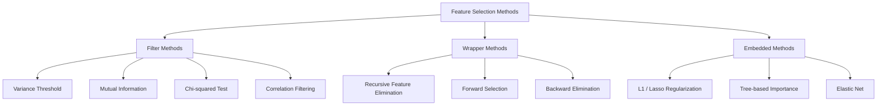
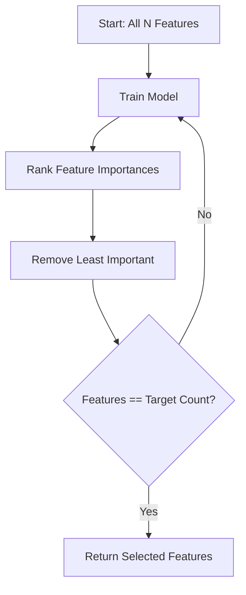
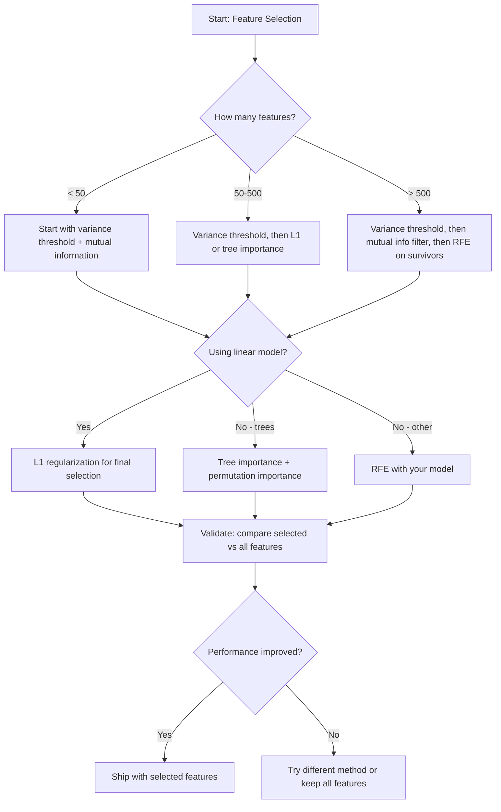

# Feature Selection

> 特徴量は多いほど良いわけではありません。正しい特徴量が良いのです。

**種別:** 構築
**言語:** Python
**前提条件:** Phase 2, Lessons 01-09, 08 (feature engineering)
**所要時間:** 約75分

## Learning Objectives

- filter methods（variance threshold、mutual information、chi-squared）と wrapper methods（RFE、forward selection）をゼロから実装する
- mutual information が correlation では見逃す非線形の feature-target relationships を捉えられる理由を説明する
- L1 regularization（embedded selection）と RFE（wrapper selection）を比較し、計算上の tradeoffs を評価する
- 複数の手法を組み合わせた feature selection pipeline を構築し、held-out data で generalization が改善することを示す

## 問題

500 個の features があります。モデルの training は遅く、常に overfit し、何を学んだのか誰にも説明できません。性能を上げようとして features をさらに追加します。結果は悪化します。

これは curse of dimensionality の典型例です。features の数が増えると、feature space の volume は爆発的に増えます。data points は疎になります。点同士の距離は収束します。モデルが実際の patterns を見つけるには指数的に多くのデータが必要になります。noise features が signal features を埋もれさせます。overfitting が標準状態になります。

Feature selection はその解毒剤です。noise を取り除きます。redundancy を削除します。target について実際の情報を持つ features を残します。結果として、training は速くなり、generalization は改善し、実際に説明できる models になります。

目標は、利用可能な情報をすべて使うことではありません。正しい情報を使うことです。

## The Concept

### Three Categories of Feature Selection

すべての feature selection method は、次の 3 つのカテゴリのいずれかに入ります。



**Filter methods** は、統計的尺度を使って各 feature を独立に score します。model は使いません。高速ですが、feature interactions を見逃します。

**Wrapper methods** は、feature subsets を評価するために model を training します。score には model performance を使います。結果は良くなりやすい一方、model を何度も再学習するため高コストです。

**Embedded methods** は、model training の一部として features を選びます。L1 regularization は weights を zero に押し込みます。Decision trees は最も有用な features で split します。selection は fitting 中に起き、別ステップではありません。

### Variance Threshold

最も単純な filter です。ある feature が samples 間でほとんど変化しないなら、ほぼ情報を持ちません。

1000 samples のうち 999 samples で 0.0 になる feature を考えます。その variance はほぼ zero です。どの model も、それを使って classes を区別できません。削除します。

```
variance(x) = mean((x - mean(x))^2)
```

threshold（例: 0.01）を設定します。それより variance が低いすべての features を drop します。これは target variable をまったく見ずに、constant または near-constant features を削除します。

使う場面: 他の手法の前の preprocessing step として使います。明らかに役に立たない features をほぼゼロコストで捕捉します。

制限: feature は high variance でも pure noise であることがあります。Variance threshold は必要ですが、それだけでは十分ではありません。

### Mutual Information

Mutual information は、feature X の値を知ることで target Y についての uncertainty がどれだけ減るかを測ります。

```
I(X; Y) = sum_x sum_y p(x, y) * log(p(x, y) / (p(x) * p(y)))
```

X と Y が independent なら、p(x, y) = p(x) * p(y) なので log term は zero になり、I(X; Y) = 0 です。X が Y について多くを教えてくれるほど、mutual information は高くなります。

correlation に対する重要な利点は、mutual information が nonlinear relationships を捉えることです。ある feature は target との correlation が zero でも、関係が quadratic や periodic なら高い mutual information を持つことがあります。

continuous features では、まず bins に discretize します（histogram-based estimation）。bins の数は estimate に影響します。少なすぎると情報を失い、多すぎると noise が増えます。一般的な選択は sqrt(n) bins または Sturges' rule（1 + log2(n)）です。


### Recursive Feature Elimination (RFE)

RFE は wrapper method です。model 自身の feature importance を使って反復的に prune します。

1. すべての features で model を training する
2. features を importance で rank する（linear models では coefficients、trees では impurity reduction）
3. 最も重要でない feature(s) を削除する
4. 望む feature 数が残るまで繰り返す



RFE は、model が残りすべての features を一緒に見るため feature interactions を考慮します。1 つの feature を削除すると、他の features の importance が変わります。そのため filter methods より丁寧です。

コストは、N - target 回 model を training することです。500 features から target 10 にするなら、490 回 training runs が必要です。高コストな models では遅くなります。各 step で複数 features を削除することで高速化できます（例: 毎 round bottom 10% を削除）。

### L1 (Lasso) Regularization

L1 regularization は loss function に weights の絶対値を追加します。

```
loss = prediction_error + alpha * sum(|w_i|)
```

alpha parameter は features をどれだけ強く prune するかを制御します。alpha が大きいほど、より多くの weights が正確に zero になります。

なぜ正確に zero になるのでしょうか。L1 penalty は weight space に diamond-shaped constraint region を作ります。最適解はこの diamond の corner に乗りやすく、その場所では 1 つ以上の weights が zero になります。L2 regularization（ridge）は circular constraint を作るため、weights は縮みますが zero にはなりにくいです。

これは embedded feature selection です。model は training 中に、どの features を無視するかを学びます。zero weight の features は実質的に削除されます。

利点: training run は 1 回、correlated features に対応できる（1 つを選び残りを zero にする）、ほとんどの linear model implementations に組み込まれている。

制限: linear models でのみ機能します。nonlinear feature importance は捉えられません。

### Tree-Based Feature Importance

Decision trees とその ensembles（random forests、gradient boosting）は自然に features を rank します。各 split は impurity（classification では Gini または entropy、regression では variance）を減らします。より大きな impurity reductions を生む features はより重要です。

T trees の random forest では次のようになります。

```
importance(feature_j) = (1/T) * sum over all trees of
    sum over all nodes splitting on feature_j of
        (n_samples * impurity_decrease)
```

これにより、各 feature の normalized importance score が得られます。nonlinear relationships と feature interactions を自動的に扱えます。

注意: tree-based importance は unique values が多い features（high cardinality）に偏ります。random ID column は、すべての sample を完全に split できるため重要に見えてしまいます。sanity check として permutation importance を使ってください。

### Permutation Importance

model-agnostic な手法です。

1. model を training し、validation data で baseline performance を記録する
2. 各 feature について、その値をランダムに shuffle し、performance drop を測る
3. drop が大きいほど、その feature は重要

feature を shuffle しても performance が悪化しないなら、model はその feature に依存していません。performance が崩れるなら、その feature は critical です。

Permutation importance は tree-based importance の cardinality bias を避けます。ただし遅いです。feature ごとに full evaluation が 1 回必要で、安定性のために複数回繰り返します。

### Comparison Table

| Method | Type | Speed | Nonlinear | Feature Interactions |
|--------|------|-------|-----------|---------------------|
| Variance threshold | Filter | Very fast | No | No |
| Mutual information | Filter | Fast | Yes | No |
| Correlation filter | Filter | Fast | No | No |
| RFE | Wrapper | Slow | Depends on model | Yes |
| L1 / Lasso | Embedded | Fast | No (linear) | No |
| Tree importance | Embedded | Medium | Yes | Yes |
| Permutation importance | Model-agnostic | Slow | Yes | Yes |

### Decision Flowchart



## 実装

### Step 1: 既知の feature structure を持つ synthetic data を生成する

```python
import numpy as np


def make_feature_selection_data(n_samples=500, seed=42):
    rng = np.random.RandomState(seed)

    x1 = rng.randn(n_samples)
    x2 = rng.randn(n_samples)
    x3 = rng.randn(n_samples)
    x4 = x1 + 0.1 * rng.randn(n_samples)
    x5 = x2 + 0.1 * rng.randn(n_samples)

    informative = np.column_stack([x1, x2, x3, x4, x5])

    correlated = np.column_stack([
        x1 * 0.9 + 0.1 * rng.randn(n_samples),
        x2 * 0.8 + 0.2 * rng.randn(n_samples),
        x3 * 0.7 + 0.3 * rng.randn(n_samples),
        x1 * 0.5 + x2 * 0.5 + 0.1 * rng.randn(n_samples),
        x2 * 0.6 + x3 * 0.4 + 0.1 * rng.randn(n_samples),
    ])

    noise = rng.randn(n_samples, 10) * 0.5

    X = np.hstack([informative, correlated, noise])
    y = (2 * x1 - 1.5 * x2 + x3 + 0.5 * rng.randn(n_samples) > 0).astype(int)

    feature_names = (
        [f"info_{i}" for i in range(5)]
        + [f"corr_{i}" for i in range(5)]
        + [f"noise_{i}" for i in range(10)]
    )

    return X, y, feature_names
```

ground truth は分かっています。features 0-4 は informative（さらに 3 と 4 は 0 と 1 の correlated copies）、features 5-9 は informative features と correlated、features 10-19 は pure noise です。良い selection method は 0-4 を最上位に、10-19 を最下位に rank するはずです。

### Step 2: Variance threshold

```python
def variance_threshold(X, threshold=0.01):
    variances = np.var(X, axis=0)
    mask = variances > threshold
    return mask, variances
```

### Step 3: Mutual information (discrete)

```python
def discretize(x, n_bins=10):
    min_val, max_val = x.min(), x.max()
    if max_val == min_val:
        return np.zeros_like(x, dtype=int)
    bin_edges = np.linspace(min_val, max_val, n_bins + 1)
    binned = np.digitize(x, bin_edges[1:-1])
    return binned


def mutual_information(X, y, n_bins=10):
    n_samples, n_features = X.shape
    mi_scores = np.zeros(n_features)

    y_vals, y_counts = np.unique(y, return_counts=True)
    p_y = y_counts / n_samples

    for f in range(n_features):
        x_binned = discretize(X[:, f], n_bins)
        x_vals, x_counts = np.unique(x_binned, return_counts=True)
        p_x = dict(zip(x_vals, x_counts / n_samples))

        mi = 0.0
        for xv in x_vals:
            for yi, yv in enumerate(y_vals):
                joint_mask = (x_binned == xv) & (y == yv)
                p_xy = np.sum(joint_mask) / n_samples
                if p_xy > 0:
                    mi += p_xy * np.log(p_xy / (p_x[xv] * p_y[yi]))
        mi_scores[f] = mi

    return mi_scores
```

### Step 4: Recursive Feature Elimination

```python
def simple_logistic_importance(X, y, lr=0.1, epochs=100):
    n_samples, n_features = X.shape
    w = np.zeros(n_features)
    b = 0.0

    for _ in range(epochs):
        z = X @ w + b
        pred = 1.0 / (1.0 + np.exp(-np.clip(z, -500, 500)))
        error = pred - y
        w -= lr * (X.T @ error) / n_samples
        b -= lr * np.mean(error)

    return w, b


def rfe(X, y, n_features_to_select=5, lr=0.1, epochs=100):
    n_total = X.shape[1]
    remaining = list(range(n_total))
    rankings = np.ones(n_total, dtype=int)
    rank = n_total

    while len(remaining) > n_features_to_select:
        X_subset = X[:, remaining]
        w, _ = simple_logistic_importance(X_subset, y, lr, epochs)
        importances = np.abs(w)

        least_idx = np.argmin(importances)
        original_idx = remaining[least_idx]
        rankings[original_idx] = rank
        rank -= 1
        remaining.pop(least_idx)

    for idx in remaining:
        rankings[idx] = 1

    selected_mask = rankings == 1
    return selected_mask, rankings
```

### Step 5: L1 feature selection

```python
def soft_threshold(w, alpha):
    return np.sign(w) * np.maximum(np.abs(w) - alpha, 0)


def l1_feature_selection(X, y, alpha=0.1, lr=0.01, epochs=500):
    n_samples, n_features = X.shape
    w = np.zeros(n_features)
    b = 0.0

    for _ in range(epochs):
        z = X @ w + b
        pred = 1.0 / (1.0 + np.exp(-np.clip(z, -500, 500)))
        error = pred - y

        gradient_w = (X.T @ error) / n_samples
        gradient_b = np.mean(error)

        w -= lr * gradient_w
        w = soft_threshold(w, lr * alpha)
        b -= lr * gradient_b

    selected_mask = np.abs(w) > 1e-6
    return selected_mask, w
```

### Step 6: Tree-based importance (simple decision tree)

```python
def gini_impurity(y):
    if len(y) == 0:
        return 0.0
    classes, counts = np.unique(y, return_counts=True)
    probs = counts / len(y)
    return 1.0 - np.sum(probs ** 2)


def best_split(X, y, feature_idx):
    values = np.unique(X[:, feature_idx])
    if len(values) <= 1:
        return None, -1.0

    best_threshold = None
    best_gain = -1.0
    parent_gini = gini_impurity(y)
    n = len(y)

    for i in range(len(values) - 1):
        threshold = (values[i] + values[i + 1]) / 2.0
        left_mask = X[:, feature_idx] <= threshold
        right_mask = ~left_mask

        n_left = np.sum(left_mask)
        n_right = np.sum(right_mask)

        if n_left == 0 or n_right == 0:
            continue

        gain = parent_gini - (n_left / n) * gini_impurity(y[left_mask]) - (n_right / n) * gini_impurity(y[right_mask])

        if gain > best_gain:
            best_gain = gain
            best_threshold = threshold

    return best_threshold, best_gain


def tree_importance(X, y, n_trees=50, max_depth=5, seed=42):
    rng = np.random.RandomState(seed)
    n_samples, n_features = X.shape
    importances = np.zeros(n_features)

    for _ in range(n_trees):
        sample_idx = rng.choice(n_samples, size=n_samples, replace=True)
        feature_subset = rng.choice(n_features, size=max(1, int(np.sqrt(n_features))), replace=False)

        X_boot = X[sample_idx]
        y_boot = y[sample_idx]

        tree_imp = _build_tree_importance(X_boot, y_boot, feature_subset, max_depth)
        importances += tree_imp

    total = importances.sum()
    if total > 0:
        importances /= total

    return importances


def _build_tree_importance(X, y, feature_subset, max_depth, depth=0):
    n_features = X.shape[1]
    importances = np.zeros(n_features)

    if depth >= max_depth or len(np.unique(y)) <= 1 or len(y) < 4:
        return importances

    best_feature = None
    best_threshold = None
    best_gain = -1.0

    for f in feature_subset:
        threshold, gain = best_split(X, y, f)
        if gain > best_gain:
            best_gain = gain
            best_feature = f
            best_threshold = threshold

    if best_feature is None or best_gain <= 0:
        return importances

    importances[best_feature] += best_gain * len(y)

    left_mask = X[:, best_feature] <= best_threshold
    right_mask = ~left_mask

    importances += _build_tree_importance(X[left_mask], y[left_mask], feature_subset, max_depth, depth + 1)
    importances += _build_tree_importance(X[right_mask], y[right_mask], feature_subset, max_depth, depth + 1)

    return importances
```

### Step 7: Run all methods and compare

コードファイルは同じ synthetic dataset に対して 5 つの手法をすべて実行し、各手法がどの features を選んだかを示す comparison table を出力します。

## Use It

scikit-learn では、feature selection は pipeline に組み込まれています。

```python
from sklearn.feature_selection import (
    VarianceThreshold,
    mutual_info_classif,
    RFE,
    SelectFromModel,
)
from sklearn.linear_model import Lasso, LogisticRegression
from sklearn.ensemble import RandomForestClassifier

vt = VarianceThreshold(threshold=0.01)
X_filtered = vt.fit_transform(X)

mi_scores = mutual_info_classif(X, y)
top_k = np.argsort(mi_scores)[-10:]

rfe_selector = RFE(LogisticRegression(), n_features_to_select=10)
rfe_selector.fit(X, y)
X_rfe = rfe_selector.transform(X)

lasso_selector = SelectFromModel(Lasso(alpha=0.01))
lasso_selector.fit(X, y)
X_lasso = lasso_selector.transform(X)

rf = RandomForestClassifier(n_estimators=100)
rf.fit(X, y)
importances = rf.feature_importances_
```

ゼロからの実装は、各 method の内部で何が起きているかを正確に示します。Variance threshold は `var(X, axis=0)` を計算して mask を適用するだけです。Mutual information は contingency table で joint and marginal frequencies を数えています。RFE は training、ranking、pruning の loop です。L1 は soft-thresholding step を持つ gradient descent です。Tree importance は splits 全体の impurity reductions を蓄積します。魔法はなく、statistics と loops だけです。

sklearn versions は robustness（例: mutual_info_classif は binning ではなく k-NN density estimation を使う）、speed（C implementations）、pipeline integration を追加します。

## Ship It

この lesson の成果物は次の通りです。
- `outputs/skill-feature-selector.md` -- 適切な feature selection method を選ぶための quick reference decision tree

## Exercises

1. **Forward selection**: RFE の反対を実装します。zero features から開始し、各 step で model performance を最も改善する feature を追加します。features の追加が役に立たなくなったら停止します。選択された features を RFE results と比較します。どちらが速いですか？どちらが良い結果ですか？

2. **Stability selection**: L1 feature selection を 50 回実行します。各回で data の random 80% subsample を使い、alpha values を少し変えます。各 feature が何回選ばれたかを数えます。> 80% の runs で選ばれた features は「stable」です。stable features を single-run L1 selection と比較します。どちらが信頼できますか？

3. **Multicollinearity detection**: すべての features の correlation matrix を計算します。correlation threshold（例: 0.9）を受け取り、highly-correlated pair ごとに 1 つの feature を削除する function を実装します（target との mutual information が高い方を残す）。synthetic dataset でテストし、redundant correlated features が削除されることを確認します。

4. **Feature selection pipeline**: variance threshold、mutual information filter、RFE を 1 つの pipeline に連鎖させます。まず near-zero-variance features を削除し、次に mutual information の top 50% を残し、最後に survivors に RFE を実行します。この pipeline を、すべての features に RFE だけを実行する場合と比較します。pipeline は速いですか？同じくらい正確ですか？

5. **Permutation importance from scratch**: permutation importance を実装します。各 feature について値を 10 回 shuffle し、F1 score の平均低下を測ります。ranking を tree-based importance と比較します。不一致になるケースを見つけ、その理由を説明します（hint: correlated features）。

## Key Terms

| Term | What people say | What it actually means |
|------|----------------|----------------------|
| Filter method | "Score features independently" | model を training せず、統計的尺度で features を rank し、各 feature を独立に評価する feature selection approach |
| Wrapper method | "Use the model to pick features" | model を training して feature subsets を評価し、その performance を selection criterion とする feature selection approach |
| Embedded method | "The model selects features during training" | L1 regularization が weights を zero にするように、model fitting の一部として行われる feature selection |
| Mutual information | "How much one variable tells you about another" | X を知ることで Y についての uncertainty がどれだけ減るかを測る尺度。linear と nonlinear dependencies の両方を捉える |
| Recursive Feature Elimination | "Train, rank, prune, repeat" | model を training し、最も重要でない feature(s) を削除し、target count に達するまで繰り返す iterative wrapper method |
| L1 / Lasso regularization | "Penalty that kills features" | loss function に absolute weight values の合計を追加し、重要でない feature weights を正確に zero に押し込むこと |
| Variance threshold | "Remove constant features" | samples 間の variance が指定 threshold 未満の features を drop し、情報を持たない features を filter すること |
| Feature importance | "Which features matter most" | 各 feature が model predictions にどれだけ寄与するかを示す score。trees の split gains や linear の coefficient magnitudes から計算される |
| Permutation importance | "Shuffle and measure the damage" | 各 feature の値をランダムに shuffle し、model performance の低下を測って feature importance を評価すること |
| Curse of dimensionality | "Too many features, not enough data" | features を追加すると feature space の volume が指数的に増え、data が疎になり、distances が意味を失う現象 |

## 参考文献

- [An Introduction to Variable and Feature Selection (Guyon & Elisseeff, 2003)](https://jmlr.org/papers/v3/guyon03a.html) -- feature selection methods の foundational survey
- [scikit-learn Feature Selection Guide](https://scikit-learn.org/stable/modules/feature_selection.html) -- filter、wrapper、embedded methods の実用 reference と code examples
- [Stability Selection (Meinshausen & Buhlmann, 2010)](https://arxiv.org/abs/0809.2932) -- robust で reproducible な results のため subsampling と feature selection を組み合わせる手法
- [Beware Default Random Forest Importances (Strobl et al., 2007)](https://bmcbioinformatics.biomedcentral.com/articles/10.1186/1471-2105-8-25) -- tree-based importance の cardinality bias を示し、conditional importance を代替として提案
