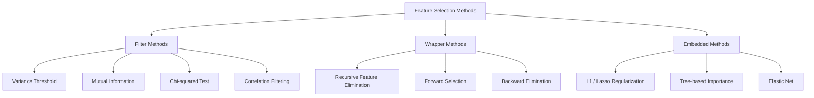
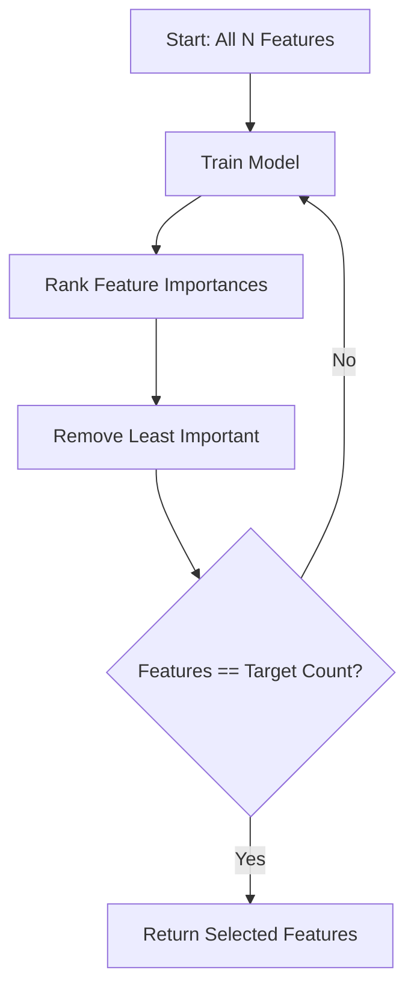
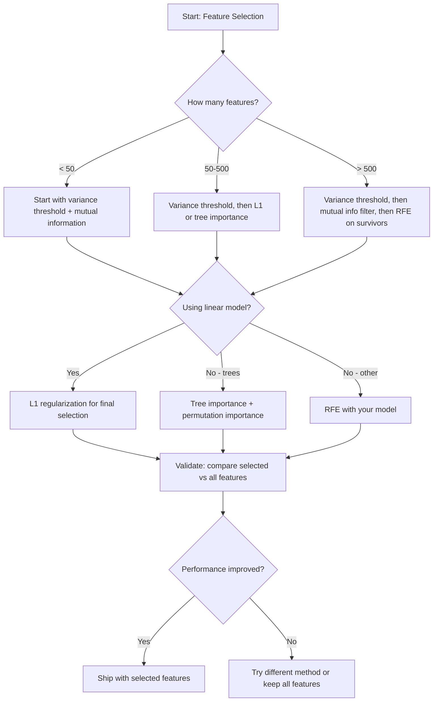

# Özellik Seçimi

> Daha fazla özellik daha iyi değildir. Doğru özellikler daha iyidir.

**Tür:** Yapım
**Dil:** Python
**Önkoşullar:** Aşama 2, Dersler 01-09, 08 (özellik mühendisliği)
**Süre:** ~75 dakika

## Öğrenme Hedefleri

- Filtre yöntemlerini (varyans eşiği, karşılıklı bilgi, ki-kare) ve sarma yöntemlerini (RFE, ileri seçim) sıfırdan uygulayın
- Karşılıklı bilginin neden korelasyonun gözden kaçırdığı doğrusal olmayan özellik-hedef ilişkilerini yakaladığını açıklayın
- L1 düzenlemesini (gömülü seçim) RFE (sarmalayıcı seçimi) ile karşılaştırın ve bunların hesaplamalı ödünleşimlerini değerlendirin
- Birden fazla yöntemi birleştiren ve uzatılmış veriler üzerinde gelişmiş genelleme sergileyen bir özellik seçimi hattı oluşturun

## Sorun

500 özelliğiniz var. Modeliniz yavaş çalışıyor, sürekli aşırı uyum sağlıyor ve kimse onun ne öğrendiğini açıklayamıyor. Performansı artırmayı umarak daha fazla özellik eklersiniz. Daha da kötüleşiyor.

Bu, eylem halindeki boyutluluğun lanetidir. Özellik sayısı arttıkça özellik alanının hacmi de artar. Veri noktaları seyrekleşir. Noktalar arasındaki mesafeler yakınsar. Modelin gerçek kalıpları bulmak için katlanarak daha fazla veriye ihtiyacı var. Gürültü özellikleri sinyal özelliklerini bastırır. Aşırı uyum varsayılan hale gelir.

Özellik seçimi panzehirdir. Gürültüyü ortadan kaldırın. Fazlalığı kaldırın. Hedefle ilgili gerçek bilgileri taşıyan özellikleri koruyun. Sonuç: daha hızlı eğitim, daha iyi genelleme ve gerçekten açıklayabileceğiniz modeller.

Amaç mevcut tüm bilgileri kullanmak değildir. Doğru bilgiyi kullanmaktır.

## Konsept

### Üç Özellik Seçimi Kategorisi

Her özellik seçim yöntemi üç kategoriden birine girer:



**Filtre yöntemleri** istatistiksel bir ölçüm kullanarak her özelliği bağımsız olarak puanlar. Bir model kullanmazlar. Hızlı ama özellik etkileşimlerini kaçırıyorlar.

**Sarmalayıcı yöntemleri**, özellik alt kümelerini değerlendirmek için bir model eğitir. Puan olarak model performansını kullanırlar. Daha iyi sonuçlar, ancak modeli birçok kez yeniden eğittikleri için pahalıdır.

**Yerleşik yöntemler**, model eğitiminin bir parçası olarak özellikleri seçer. L1 düzenlemesi ağırlıkları sıfıra indirir. Karar ağaçları en kullanışlı özelliklere göre bölünmüştür. Seçim ayrı bir adım olarak değil, yerleştirme sırasında gerçekleşir.

### Fark Eşiği

En basit filtre. Bir özellik örnekler arasında çok az değişiklik gösteriyorsa neredeyse hiçbir bilgi taşımaz.

1000 örnekten 999'u için 0,0 olan bir özelliği düşünün. Varyansı sıfıra yakındır. Hiçbir model bunu sınıfları ayırt etmek için kullanamaz. Kaldır onu.

```
variance(x) = mean((x - mean(x))^2)
```

Bir eşik ayarlayın (e.g., 0,01). Altında varyans bulunan her özelliği bırakın. Bu, hedef değişkene hiç bakmadan sabit veya sabite yakın özellikleri kaldırır.

Ne zaman kullanılmalı: diğer yöntemlerden önce bir ön işleme adımı olarak. Açıkçası işe yaramaz özellikleri sıfıra yakın maliyetle yakalar.

Sınırlama: Bir özellik yüksek varyansa sahip olabilir ve yine de saf gürültü olabilir. Varyans eşiği gerekli ancak yeterli değil.

### Karşılıklı Bilgi

Karşılıklı bilgi, X özelliğinin değerini bilmenin hedef Y hakkındaki belirsizliği ne kadar azalttığını ölçer.

```
I(X; Y) = sum_x sum_y p(x, y) * log(p(x, y) / (p(x) * p(y)))
```

X ve Y bağımsızsa, p(x, y) = p(x) * p(y), yani log terimi sıfırdır ve I(X; Y) = 0. X, Y hakkında ne kadar çok şey anlatırsa, karşılıklı bilgi o kadar yüksek olur.

Korelasyona göre temel avantaj: karşılıklı bilgi, doğrusal olmayan ilişkileri yakalar. İlişki ikinci dereceden veya periyodik olduğundan, bir özelliğin hedefle sıfır korelasyonu olabilir ancak karşılıklı bilgisi yüksek olabilir.

Sürekli özellikler için öncelikle bölmelere ayırın (histogram tabanlı tahmin). Kutu sayısı tahmini etkiler; çok az kutu bilgi kaybına neden olur, çok fazla kutu ise gürültüye neden olur. Yaygın bir seçim: sqrt(n) bins veya Sturges kuralı (1 + log2(n)).


### Özyinelemeli Özelliğin Ortadan Kaldırılması (RFE)

RFE bir sarma yöntemidir. Yinelemeli olarak budamak için bir modelin kendi özellik önemini kullanır:

1. Modeli tüm özelliklerle eğitin
2. Özellikleri önem sırasına göre sıralayın (doğrusal modeller için katsayılar, ağaçlar için safsızlık azaltımı)
3. En az önemli olan özellikleri kaldırın
4. İstediğiniz sayıda özellik kalana kadar tekrarlayın



RFE, özellik etkileşimlerini dikkate alır çünkü model kalan tüm özellikleri bir arada görür. Bir özelliğin kaldırılması diğerlerinin önemini değiştirir. Bu, onu filtre yöntemlerinden daha kapsamlı hale getirir.

Maliyet: modeli N - hedef süreleri eğitirsiniz. 500 özellik ve 10 hedef ile bu 490 eğitim çalıştırmasıdır. Pahalı modeller için bu yavaştır. Adım başına birden fazla özelliği kaldırarak bunu hızlandırabilirsiniz (e.g., her turda alttaki %10'u kaldırın).

### L1 (Kement) Düzenlemesi

L1 düzenlemesi, ağırlıkların mutlak değerini loss function'ye ekler:

```
loss = prediction_error + alpha * sum(|w_i|)
```

Alfa parametresi, özelliklerin ne kadar agresif bir şekilde budandığını kontrol eder. Daha yüksek alfa, daha fazla ağırlığın tam olarak sıfıra gitmesi anlamına gelir.

Neden tam olarak sıfır? L1 cezası, ağırlık alanında elmas şeklinde bir kısıtlama bölgesi oluşturur. En uygun çözüm, bu elmasın bir veya daha fazla ağırlığın sıfır olduğu bir köşesine inme eğilimindedir. L2 düzenlemesi (sırt), ağırlıkların küçüldüğü ancak nadiren sıfıra ulaştığı dairesel bir kısıtlama oluşturur.

Bu, gömülü özellik seçimidir: model, eğitim sırasında hangi özelliklerin göz ardı edileceğini öğrenir. Sıfır ağırlığa sahip özellikler etkili bir şekilde kaldırılır.

Avantajları: tek eğitim çalıştırması, ilişkili özellikleri yönetir (birini seçer ve diğerlerini sıfırlar), çoğu doğrusal model uygulamasında yerleşiktir.

Sınırlama: yalnızca doğrusal modellerde işe yarar. Doğrusal olmayan özelliğin önemi yakalanamıyor.

### Ağaç Tabanlı Özelliğin Önemi

Karar ağaçları ve bunların toplulukları (rastgele ormanlar, gradient artırma) özellikleri doğal olarak sıralar. Her bölünme safsızlığı azaltır (sınıflandırma için Gini veya entropi, regresyon için varyans). Daha büyük safsızlık azaltımı sağlayan özellikler daha önemlidir.

T ağaçlı rastgele bir orman için:

```
importance(feature_j) = (1/T) * sum over all trees of
    sum over all nodes splitting on feature_j of
        (n_samples * impurity_decrease)
```

Bu, her özellik için normalleştirilmiş bir önem puanı verir. Doğrusal olmayan ilişkileri ve özellik etkileşimlerini otomatik olarak yönetir.

Dikkat: Ağaç tabanlı önem, birçok benzersiz değere (yüksek önem) sahip özelliklere yöneliktir. Rastgele bir kimlik sütunu önemli görünecektir çünkü her numuneyi mükemmel şekilde böler. Akıl sağlığı kontrolü olarak permütasyon önemini kullanın.

### Permütasyonun Önemi

Modelden bağımsız bir yöntem:

1. Modeli eğitin ve doğrulama verilerine ilişkin temel performansı kaydedin
2. Her özellik için: değerlerini rastgele karıştırın, performanstaki düşüşü ölçün
3. Düşüş ne kadar büyük olursa özellik o kadar önemli olur

Bir özelliğin karıştırılması performansa zarar vermiyorsa model buna bağlı değildir. Performans çökerse bu özellik kritik öneme sahiptir.

Permütasyon önemi, ağaç temelli önemin önem derecesini ortadan kaldırır. Ancak yavaştır: özellik başına bir tam değerlendirme, kararlılık için birden çok kez tekrarlanır.

### Karşılaştırma Tablosu

| Yöntem | Tür | Hız | Doğrusal Olmayan | Özellik Etkileşimleri |
|--------|------|-------|-----------|---------------------|
| Fark eşiği | Filtre | Çok hızlı | Hayır | Hayır |
| Karşılıklı bilgi | Filtre | Hızlı | Evet | Hayır |
| Korelasyon filtresi | Filtre | Hızlı | Hayır | Hayır |
| RFE | Paketleyici | Yavaş | Modele bağlıdır | Evet |
| L1 / Kement | Gömülü | Hızlı | Hayır (doğrusal) | Hayır |
| Ağacın önemi | Gömülü | Orta | Evet | Evet |
| Permütasyonun önemi | Modelden bağımsız | Yavaş | Evet | Evet |

### Karar Akış Şeması



## İnşa Et

### Adım 1: Bilinen özellik yapısına sahip sentetik veriler oluşturun

```python
import numpy as np


def make_feature_selection_data(n_samples=500, seed=42):
    rng = np.random.RandomState(seed)

    x1 = rng.randn(n_samples)
    x2 = rng.randn(n_samples)
    x3 = rng.randn(n_samples)
    x4 = x1 + 0.1 * rng.randn(n_samples)
    x5 = x2 + 0.1 * rng.randn(n_samples)

    informative = np.column_stack([x1, x2, x3, x4, x5])

    correlated = np.column_stack([
        x1 * 0.9 + 0.1 * rng.randn(n_samples),
        x2 * 0.8 + 0.2 * rng.randn(n_samples),
        x3 * 0.7 + 0.3 * rng.randn(n_samples),
        x1 * 0.5 + x2 * 0.5 + 0.1 * rng.randn(n_samples),
        x2 * 0.6 + x3 * 0.4 + 0.1 * rng.randn(n_samples),
    ])

    noise = rng.randn(n_samples, 10) * 0.5

    X = np.hstack([informative, correlated, noise])
    y = (2 * x1 - 1.5 * x2 + x3 + 0.5 * rng.randn(n_samples) > 0).astype(int)

    feature_names = (
        [f"info_{i}" for i in range(5)]
        + [f"corr_{i}" for i in range(5)]
        + [f"noise_{i}" for i in range(10)]
    )

    return X, y, feature_names
```

Temel gerçeği biliyoruz: 0-4 arasındaki özellikler bilgilendiricidir (artı 3 ve 4, 0 ve 1'in ilişkili kopyalarıdır), 5-9 arasındaki özellikler bilgilendirici özelliklerle ilişkilidir, 10-19 arasındaki özellikler saf gürültüdür. İyi bir seçim yöntemi en yüksek 0-4 ve en düşük 10-19 arasında sıralanmalıdır.

### Adım 2: Fark eşiği

```python
def variance_threshold(X, threshold=0.01):
    variances = np.var(X, axis=0)
    mask = variances > threshold
    return mask, variances
```

### Adım 3: Karşılıklı bilgi (ayrık)

```python
def discretize(x, n_bins=10):
    min_val, max_val = x.min(), x.max()
    if max_val == min_val:
        return np.zeros_like(x, dtype=int)
    bin_edges = np.linspace(min_val, max_val, n_bins + 1)
    binned = np.digitize(x, bin_edges[1:-1])
    return binned


def mutual_information(X, y, n_bins=10):
    n_samples, n_features = X.shape
    mi_scores = np.zeros(n_features)

    y_vals, y_counts = np.unique(y, return_counts=True)
    p_y = y_counts / n_samples

    for f in range(n_features):
        x_binned = discretize(X[:, f], n_bins)
        x_vals, x_counts = np.unique(x_binned, return_counts=True)
        p_x = dict(zip(x_vals, x_counts / n_samples))

        mi = 0.0
        for xv in x_vals:
            for yi, yv in enumerate(y_vals):
                joint_mask = (x_binned == xv) & (y == yv)
                p_xy = np.sum(joint_mask) / n_samples
                if p_xy > 0:
                    mi += p_xy * np.log(p_xy / (p_x[xv] * p_y[yi]))
        mi_scores[f] = mi

    return mi_scores
```

### Adım 4: Özyinelemeli Özelliğin Ortadan Kaldırılması

```python
def simple_logistic_importance(X, y, lr=0.1, epochs=100):
    n_samples, n_features = X.shape
    w = np.zeros(n_features)
    b = 0.0

    for _ in range(epochs):
        z = X @ w + b
        pred = 1.0 / (1.0 + np.exp(-np.clip(z, -500, 500)))
        error = pred - y
        w -= lr * (X.T @ error) / n_samples
        b -= lr * np.mean(error)

    return w, b


def rfe(X, y, n_features_to_select=5, lr=0.1, epochs=100):
    n_total = X.shape[1]
    remaining = list(range(n_total))
    rankings = np.ones(n_total, dtype=int)
    rank = n_total

    while len(remaining) > n_features_to_select:
        X_subset = X[:, remaining]
        w, _ = simple_logistic_importance(X_subset, y, lr, epochs)
        importances = np.abs(w)

        least_idx = np.argmin(importances)
        original_idx = remaining[least_idx]
        rankings[original_idx] = rank
        rank -= 1
        remaining.pop(least_idx)

    for idx in remaining:
        rankings[idx] = 1

    selected_mask = rankings == 1
    return selected_mask, rankings
```

### Adım 5: L1 özellik seçimi

```python
def soft_threshold(w, alpha):
    return np.sign(w) * np.maximum(np.abs(w) - alpha, 0)


def l1_feature_selection(X, y, alpha=0.1, lr=0.01, epochs=500):
    n_samples, n_features = X.shape
    w = np.zeros(n_features)
    b = 0.0

    for _ in range(epochs):
        z = X @ w + b
        pred = 1.0 / (1.0 + np.exp(-np.clip(z, -500, 500)))
        error = pred - y

        gradient_w = (X.T @ error) / n_samples
        gradient_b = np.mean(error)

        w -= lr * gradient_w
        w = soft_threshold(w, lr * alpha)
        b -= lr * gradient_b

    selected_mask = np.abs(w) > 1e-6
    return selected_mask, w
```

### Adım 6: Ağaç bazlı önem (basit karar ağacı)

```python
def gini_impurity(y):
    if len(y) == 0:
        return 0.0
    classes, counts = np.unique(y, return_counts=True)
    probs = counts / len(y)
    return 1.0 - np.sum(probs ** 2)


def best_split(X, y, feature_idx):
    values = np.unique(X[:, feature_idx])
    if len(values) <= 1:
        return None, -1.0

    best_threshold = None
    best_gain = -1.0
    parent_gini = gini_impurity(y)
    n = len(y)

    for i in range(len(values) - 1):
        threshold = (values[i] + values[i + 1]) / 2.0
        left_mask = X[:, feature_idx] <= threshold
        right_mask = ~left_mask

        n_left = np.sum(left_mask)
        n_right = np.sum(right_mask)

        if n_left == 0 or n_right == 0:
            continue

        gain = parent_gini - (n_left / n) * gini_impurity(y[left_mask]) - (n_right / n) * gini_impurity(y[right_mask])

        if gain > best_gain:
            best_gain = gain
            best_threshold = threshold

    return best_threshold, best_gain


def tree_importance(X, y, n_trees=50, max_depth=5, seed=42):
    rng = np.random.RandomState(seed)
    n_samples, n_features = X.shape
    importances = np.zeros(n_features)

    for _ in range(n_trees):
        sample_idx = rng.choice(n_samples, size=n_samples, replace=True)
        feature_subset = rng.choice(n_features, size=max(1, int(np.sqrt(n_features))), replace=False)

        X_boot = X[sample_idx]
        y_boot = y[sample_idx]

        tree_imp = _build_tree_importance(X_boot, y_boot, feature_subset, max_depth)
        importances += tree_imp

    total = importances.sum()
    if total > 0:
        importances /= total

    return importances


def _build_tree_importance(X, y, feature_subset, max_depth, depth=0):
    n_features = X.shape[1]
    importances = np.zeros(n_features)

    if depth >= max_depth or len(np.unique(y)) <= 1 or len(y) < 4:
        return importances

    best_feature = None
    best_threshold = None
    best_gain = -1.0

    for f in feature_subset:
        threshold, gain = best_split(X, y, f)
        if gain > best_gain:
            best_gain = gain
            best_feature = f
            best_threshold = threshold

    if best_feature is None or best_gain <= 0:
        return importances

    importances[best_feature] += best_gain * len(y)

    left_mask = X[:, best_feature] <= best_threshold
    right_mask = ~left_mask

    importances += _build_tree_importance(X[left_mask], y[left_mask], feature_subset, max_depth, depth + 1)
    importances += _build_tree_importance(X[right_mask], y[right_mask], feature_subset, max_depth, depth + 1)

    return importances
```

### Adım 7: Tüm yöntemleri çalıştırın ve karşılaştırın

Kod dosyası, beş yöntemin tümünü aynı sentetik dataset üzerinde çalıştırır ve her yöntemin hangi özellikleri seçtiğini gösteren bir karşılaştırma tablosu yazdırır.

## Kullan onu

Scikit-learn ile özellik seçimi ardışık düzene yerleştirilmiştir:

```python
from sklearn.feature_selection import (
    VarianceThreshold,
    mutual_info_classif,
    RFE,
    SelectFromModel,
)
from sklearn.linear_model import Lasso, LogisticRegression
from sklearn.ensemble import RandomForestClassifier

vt = VarianceThreshold(threshold=0.01)
X_filtered = vt.fit_transform(X)

mi_scores = mutual_info_classif(X, y)
top_k = np.argsort(mi_scores)[-10:]

rfe_selector = RFE(LogisticRegression(), n_features_to_select=10)
rfe_selector.fit(X, y)
X_rfe = rfe_selector.transform(X)

lasso_selector = SelectFromModel(Lasso(alpha=0.01))
lasso_selector.fit(X, y)
X_lasso = lasso_selector.transform(X)

rf = RandomForestClassifier(n_estimators=100)
rf.fit(X, y)
importances = rf.feature_importances_
```

Sıfırdan uygulamalar, her yöntemin içinde tam olarak ne olduğunu gösterir. Varyans eşiği yalnızca `var(X, axis=0)`'yi hesaplamak ve bir maske uygulamaktır. Karşılıklı bilgi, bir beklenmedik durum tablosunda ortak ve marjinal frekansların sayılmasıdır. RFE eğiten, derecelendiren ve budayan bir döngüdür. L1, yumuşak eşik adımıyla gradient inişidir. Ağacın önemi, bölünmeler boyunca safsızlık azalmalarını biriktirir. Sihir yok; yalnızca istatistikler ve döngüler.

Sklearn sürümleri sağlamlık (e.g., karşılıklı_info_classif gruplama yerine k-NN yoğunluk tahminini kullanır), hız (C uygulamaları) ve boru hattı entegrasyonu ekler.

## Gönderin

Bu ders şunları üretir:
- `outputs/skill-feature-selector.md` - doğru özellik seçim yöntemini seçmek için hızlı referans karar ağacı

## Egzersizler

1. **İleri seçim**: RFE'nin tam tersini uygulayın. Sıfır özelliklerle başlayın. Her adımda model performansını en çok artıran özelliği ekleyin. Özellik eklemenin artık faydası olmadığında durun. Seçilen özellikleri RFE sonuçlarıyla karşılaştırın. Hangisi daha hızlı? Hangisi daha iyi sonuç verir?

2. **Kararlılık seçimi**: L1 özellik seçimini her seferinde verilerin %80'lik rastgele bir alt örneğinde, biraz farklı alfa değerleriyle 50 kez çalıştırın. Her özelliğin ne sıklıkta seçildiğini sayın. Çalıştırmaların %80'inden fazlasında seçilen özellikler "kararlıdır". Kararlı özellikleri tek çalıştırmalı L1 seçimiyle karşılaştırın. Hangisi daha güvenilir?

3. **Çoklu bağlantı tespiti**: tüm özellikler için korelasyon matrisini hesaplayın. Bir korelasyon eşiği (e.g., 0.9) verildiğinde, her yüksek korelasyonlu çiftten bir özelliği kaldıran (hedefle daha yüksek ortak bilgiye sahip olanı koruyan) bir işlev uygulayın. Sentetik dataset üzerinde test yapın ve gereksiz ilişkili özellikleri kaldırdığını doğrulayın.

4. **Özellik seçimi ardışık düzeni**: Varyans eşiğini, karşılıklı bilgi filtresini ve RFE'yi tek bir ardışık düzende zincirleme. Öncelikle sıfıra yakın varyans özelliklerini kaldırın, ardından karşılıklı bilgi yoluyla ilk %50'yi koruyun, ardından hayatta kalanlar üzerinde RFE'yi çalıştırın. Bu hattı, RFE'nin tüm özelliklerde tek başına çalıştırılmasıyla karşılaştırın. Boru hattı daha mı hızlı? Aynı derecede doğru mu?

5. **Permütasyonun önemi sıfırdan**: permütasyonun önemini uygulayın. Her özellik için değerlerini 10 kez karıştırın, F1 puanındaki ortalama düşüşü ölçün. Sıralamayı ağaç temelli önemle karşılaştırın. Aynı fikirde olmadıkları durumları bulun ve nedenini açıklayın (ipucu: ilişkili özellikler).

## Anahtar Terimler

| Dönem | İnsanlar ne diyor | Aslında ne anlama geliyor |
|------|----------------|----------------------|
| Filtre yöntemi | "Özellikleri bağımsız olarak puanlayın" | Bir modeli eğitmeden istatistiksel bir ölçüm kullanarak özellikleri sıralayan ve her özelliği ayrı ayrı değerlendiren bir özellik seçimi yaklaşımı |
| Sarma yöntemi | "Özellikleri seçmek için modeli kullanın" | Bir modeli eğiterek ve performansını seçim kriteri olarak kullanarak özellik alt kümelerini değerlendiren bir özellik seçimi yaklaşımı |
| Gömülü yöntem | "Model, eğitim sırasında özellikleri seçiyor" | Ağırlıkları sıfıra indiren L1 düzenlemesi gibi model uydurmanın bir parçası olarak gerçekleşen özellik seçimi |
| Karşılıklı bilgi | "Bir değişken size diğeri hakkında ne kadar bilgi verir" | Hem doğrusal hem de doğrusal olmayan bağımlılıkları yakalayan, X bilgisi verildiğinde Y hakkındaki belirsizlikteki azalmanın ölçüsü |
| Özyinelemeli Özelliğin Ortadan Kaldırılması | "Eğitin, derecelendirin, budayın, tekrarlayın" | Bir modeli eğiten, en az önemli olan özellikleri kaldıran ve hedef sayıya ulaşılana kadar tekrarlayan yinelemeli bir sarmalayıcı yöntemi |
| L1 / Kement düzenlemesi | "Özellikleri ortadan kaldıran ceza" | Önemsiz özellik ağırlıklarını tam olarak sıfıra indiren loss function'ye mutlak ağırlık değerlerinin toplamının eklenmesi |
| Fark eşiği | "Sabit özellikleri kaldır" | Örnekler arasındaki varyansı belirli bir eşiğin altına düşen özelliklerin çıkarılması, hiçbir bilgi taşımayan özelliklerin filtrelenmesi |
| Özelliğin önemi | "Hangi özellikler en önemli" | Bölünmüş kazançlardan (ağaçlar) veya katsayı büyüklüklerinden (doğrusal) hesaplanan, her bir özelliğin model tahminlerine ne kadar katkıda bulunduğunu gösteren bir puan |
| Permütasyonun önemi | "Karıştırın ve hasarı ölçün" | Her özelliğin değerlerini rastgele karıştırıp model performansında ortaya çıkan düşüşü ölçerek özelliğin önemini değerlendirme |
| Boyutluluğun laneti | "Çok fazla özellik, yeterli veri yok" | Özellik eklemenin, özellik alanının hacmini katlanarak artırdığı, verileri seyrekleştirdiği ve mesafeleri anlamsız hale getirdiği olgusu |

## Daha Fazla Okuma

- [Değişken ve Özellik Seçimine Giriş (Guyon ve Elisseeff, 2003)](https://jmlr.org/papers/v3/guyon03a.html) -- özellik seçme yöntemlerine ilişkin temel araştırma, hâlâ yaygın olarak başvurulan
- [scikit-learn Özellik Seçim Kılavuzu](https://scikit-learn.org/stable/modules/feature_selection.html) -- filtre, sarmalayıcı ve gömülü yöntemler için kod örnekleriyle pratik referans
- [Kararlılık Seçimi (Meinshausen ve Buhlmann, 2010)](https://arxiv.org/abs/0809.2932) -- sağlam, tekrarlanabilir sonuçlar için alt örneklemeyi özellik seçimiyle birleştirir
- [Varsayılan Rastgele Orman Önemlerine Dikkat Edin (Strobl ve diğerleri, 2007)](https://bmcbioinformatics.biomedcentral.com/articles/10.1186/1471-2105-8-25) -- ağaç temelli önemdeki önem yanlılığını gösterir ve alternatif olarak koşullu önemi önerir
