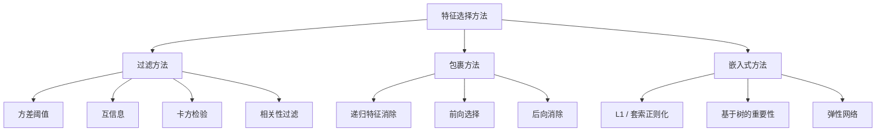
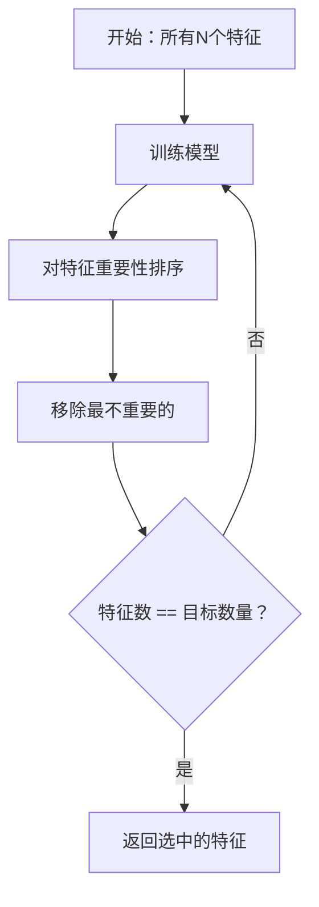
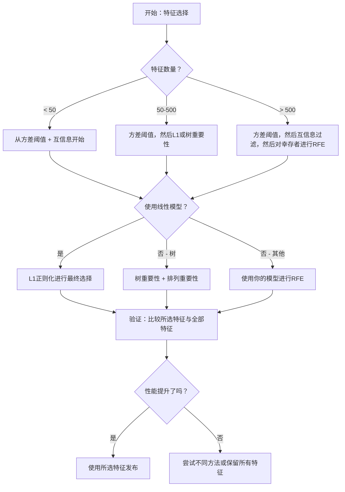

# 特征选择（Feature Selection）

> 更多特征并不代表更好。正确的特征才是更好的。

**类型：** 构建
**语言：** Python
**前置条件：** 第二阶段，第01-09课，第08课（特征工程）
**时间：** ~75分钟

## 学习目标

- 从零实现过滤方法（方差阈值、互信息、卡方检验）和包裹方法（RFE、前向选择）
- 解释为什么互信息能够捕捉到相关性无法捕捉的非线性特征-目标关系
- 比较L1正则化（嵌入式选择）与RFE（包裹式选择），并评估它们的计算权衡
- 构建一个组合多种方法的特征选择流水线，并在保留数据上展示改进的泛化能力

## 问题

你有500个特征。你的模型训练缓慢，持续过拟合，而且没人能解释它学到了什么。你添加更多特征希望提升性能，结果却变得更糟。

这就是维度灾难的真实现象。随着特征数量的增长，特征空间的体积呈爆炸式增长。数据点变得稀疏。点之间的距离趋于一致。模型需要指数级更多的数据来发现真正的模式。噪声特征淹没了信号特征。过拟合成为默认状态。

特征选择就是解药。剥离噪声，去除冗余，保留那些携带目标实际信息的特征。结果：更快的训练、更好的泛化能力，以及真正可解释的模型。

目标不是使用所有可用信息，而是使用正确的信息。

## 概念

### 特征选择的三大类别

每种特征选择方法都归属于以下三类之一：



**过滤方法（Filter methods）** 使用统计指标对每个特征独立评分。它们不依赖于模型。速度快，但会遗漏特征间的交互作用。

**包裹方法（Wrapper methods）** 通过训练模型来评估特征子集。它们使用模型性能作为评分标准。结果更好，但由于需要多次重新训练模型，计算成本高昂。

**嵌入式方法（Embedded methods）** 将特征选择作为模型训练的一部分。L1正则化将权重驱动为零。决策树根据最有用的特征进行分裂。选择发生在拟合过程中，而非单独的步骤。

### 方差阈值（Variance Threshold）

最简单的过滤器。如果一个特征在样本间几乎不变，那么它携带的信息几乎为零。

考虑一个特征，在1000个样本中有999个为0.0。其方差接近零。任何模型都无法用它来区分类别。移除它。

```
variance(x) = mean((x - mean(x))^2)
```

设置一个阈值（例如0.01）。剔除方差低于该阈值的所有特征。这可以在完全不查看目标变量的情况下移除常数或近常数特征。

何时使用：作为其他方法之前的预处理步骤。它以近乎零的成本捕捉明显无用的特征。

局限性：一个特征可能有高方差，但仍然完全是噪声。方差阈值是必要的，但不是充分的。

### 互信息（Mutual Information）

互信息衡量知道特征X的值能在多大程度上减少对目标Y的不确定性。

```
I(X; Y) = sum_x sum_y p(x, y) * log(p(x, y) / (p(x) * p(y)))
```

如果X和Y独立，则p(x, y) = p(x) * p(y)，因此对数项为零，I(X; Y) = 0。X告诉你关于Y的信息越多，互信息值就越高。

相比相关性的关键优势：互信息能够捕捉非线性关系。一个特征可能与目标零相关，但由于关系是二次的或周期性的，却拥有高互信息。

对于连续特征，首先将其离散化为箱（基于直方图估计）。箱的数量会影响估计——太少会丢失信息，太多会引入噪声。常见选择：sqrt(n)个箱或斯特格斯规则（1 + log2(n)）。


### 递归特征消除（Recursive Feature Elimination, RFE）

RFE是一种包裹方法。它利用模型自身的特征重要性进行迭代修剪：

1. 使用所有特征训练模型
2. 按重要性对特征排序（线性模型用系数，树模型用不纯度减少量）
3. 移除最不重要的一个（或多个）特征
4. 重复直到保留的特征数达到目标



RFE考虑特征间的交互作用，因为模型同时看到所有剩余特征。移除一个特征会改变其他特征的重要性。这使得它比过滤方法更彻底。

代价：你训练模型的次数为N - 目标数。有500个特征，目标设为10，那就是490次训练。对于昂贵的模型，这很慢。你可以通过每步移除多个特征来加速（例如每轮移除最底部的10%）。

### L1（套索）正则化

L1正则化将权重的绝对值加到损失函数中：

```
loss = prediction_error + alpha * sum(|w_i|)
```

参数alpha控制特征修剪的激进程度。alpha越高，意味着更多的权重恰好变为零。

为什么恰好为零？L1惩罚在权重空间中创建一个菱形约束区域。最优解倾向于落在该菱形的角上，此时一个或多个权重为零。L2正则化（岭回归）创建圆形约束，权重会收缩但很少变为零。

这是嵌入式特征选择：模型在训练过程中学习忽略哪些特征。权重为零的特征被有效移除。

优点：只需一次训练运行，能处理相关特征（挑选一个并将其余置零），内置于大多数线性模型实现中。

局限性：仅适用于线性模型。无法捕捉非线性特征重要性。

### 基于树的特征重要性

决策树及其集成方法（随机森林、梯度提升）天然地对特征进行排序。每次分裂都会降低不纯度（分类用基尼或熵，回归用方差）。产生更大不纯度减少的特征更重要。

对于包含T棵树的随机森林：

```
importance(feature_j) = (1/T) * 对每棵树的求和
    对每个在feature_j上分裂的节点的求和
        (n_samples * impurity_decrease)
```

这给出了每个特征的归一化重要性分数。它自动处理非线性关系和特征交互。

注意：基于树的重要性偏向于具有许多唯一值（高基数）的特征。一个随机的ID列看起来会很重要，因为它能完美地分割每个样本。使用排列重要性作为检验。

### 排列重要性（Permutation Importance）

一种不依赖模型的方法：

1. 训练模型，记录在验证数据上的基准性能
2. 对于每个特征：随机打乱其值，测量性能下降的程度
3. 下降越大，特征越重要

如果打乱一个特征不影响性能，说明模型不依赖它。如果性能崩溃，则该特征至关重要。

排列重要性避免了基于树重要性的基数偏差。但它速度慢：每个特征需要一次完整评估，且为了稳定性需要重复多次。

### 对比表

| 方法 | 类型 | 速度 | 非线性 | 特征交互 |
|------|------|-------|-----------|---------------------|
| 方差阈值 | 过滤 | 非常快 | 否 | 否 |
| 互信息 | 过滤 | 快 | 是 | 否 |
| 相关性过滤 | 过滤 | 快 | 否 | 否 |
| 递归特征消除 | 包裹 | 慢 | 取决于模型 | 是 |
| L1 / 套索 | 嵌入式 | 快 | 否（线性） | 否 |
| 树重要性 | 嵌入式 | 中等 | 是 | 是 |
| 排列重要性 | 不依赖模型 | 慢 | 是 | 是 |

### 决策流程图



## 构建它

### 第1步：生成具有已知特征结构的合成数据

```python
import numpy as np


def make_feature_selection_data(n_samples=500, seed=42):
    rng = np.random.RandomState(seed)

    x1 = rng.randn(n_samples)
    x2 = rng.randn(n_samples)
    x3 = rng.randn(n_samples)
    x4 = x1 + 0.1 * rng.randn(n_samples)
    x5 = x2 + 0.1 * rng.randn(n_samples)

    informative = np.column_stack([x1, x2, x3, x4, x5])

    correlated = np.column_stack([
        x1 * 0.9 + 0.1 * rng.randn(n_samples),
        x2 * 0.8 + 0.2 * rng.randn(n_samples),
        x3 * 0.7 + 0.3 * rng.randn(n_samples),
        x1 * 0.5 + x2 * 0.5 + 0.1 * rng.randn(n_samples),
        x2 * 0.6 + x3 * 0.4 + 0.1 * rng.randn(n_samples),
    ])

    noise = rng.randn(n_samples, 10) * 0.5

    X = np.hstack([informative, correlated, noise])
    y = (2 * x1 - 1.5 * x2 + x3 + 0.5 * rng.randn(n_samples) > 0).astype(int)

    feature_names = (
        [f"info_{i}" for i in range(5)]
        + [f"corr_{i}" for i in range(5)]
        + [f"noise_{i}" for i in range(10)]
    )

    return X, y, feature_names
```

我们知道真实情况：特征0-4是信息性的（其中3和4是0和1的相关副本），特征5-9与信息性特征相关，特征10-19是纯噪声。一个好的选择方法应该将0-4排在最前面，10-19排在最后。

### 第2步：方差阈值

```python
def variance_threshold(X, threshold=0.01):
    variances = np.var(X, axis=0)
    mask = variances > threshold
    return mask, variances
```

### 第3步：互信息（离散版）

```python
def discretize(x, n_bins=10):
    min_val, max_val = x.min(), x.max()
    if max_val == min_val:
        return np.zeros_like(x, dtype=int)
    bin_edges = np.linspace(min_val, max_val, n_bins + 1)
    binned = np.digitize(x, bin_edges[1:-1])
    return binned


def mutual_information(X, y, n_bins=10):
    n_samples, n_features = X.shape
    mi_scores = np.zeros(n_features)

    y_vals, y_counts = np.unique(y, return_counts=True)
    p_y = y_counts / n_samples

    for f in range(n_features):
        x_binned = discretize(X[:, f], n_bins)
        x_vals, x_counts = np.unique(x_binned, return_counts=True)
        p_x = dict(zip(x_vals, x_counts / n_samples))

        mi = 0.0
        for xv in x_vals:
            for yi, yv in enumerate(y_vals):
                joint_mask = (x_binned == xv) & (y == yv)
                p_xy = np.sum(joint_mask) / n_samples
                if p_xy > 0:
                    mi += p_xy * np.log(p_xy / (p_x[xv] * p_y[yi]))
        mi_scores[f] = mi

    return mi_scores
```

### 第4步：递归特征消除

```python
def simple_logistic_importance(X, y, lr=0.1, epochs=100):
    n_samples, n_features = X.shape
    w = np.zeros(n_features)
    b = 0.0

    for _ in range(epochs):
        z = X @ w + b
        pred = 1.0 / (1.0 + np.exp(-np.clip(z, -500, 500)))
        error = pred - y
        w -= lr * (X.T @ error) / n_samples
        b -= lr * np.mean(error)

    return w, b


def rfe(X, y, n_features_to_select=5, lr=0.1, epochs=100):
    n_total = X.shape[1]
    remaining = list(range(n_total))
    rankings = np.ones(n_total, dtype=int)
    rank = n_total

    while len(remaining) > n_features_to_select:
        X_subset = X[:, remaining]
        w, _ = simple_logistic_importance(X_subset, y, lr, epochs)
        importances = np.abs(w)

        least_idx = np.argmin(importances)
        original_idx = remaining[least_idx]
        rankings[original_idx] = rank
        rank -= 1
        remaining.pop(least_idx)

    for idx in remaining:
        rankings[idx] = 1

    selected_mask = rankings == 1
    return selected_mask, rankings
```

### 第5步：L1特征选择

```python
def soft_threshold(w, alpha):
    return np.sign(w) * np.maximum(np.abs(w) - alpha, 0)


def l1_feature_selection(X, y, alpha=0.1, lr=0.01, epochs=500):
    n_samples, n_features = X.shape
    w = np.zeros(n_features)
    b = 0.0

    for _ in range(epochs):
        z = X @ w + b
        pred = 1.0 / (1.0 + np.exp(-np.clip(z, -500, 500)))
        error = pred - y

        gradient_w = (X.T @ error) / n_samples
        gradient_b = np.mean(error)

        w -= lr * gradient_w
        w = soft_threshold(w, lr * alpha)
        b -= lr * gradient_b

    selected_mask = np.abs(w) > 1e-6
    return selected_mask, w
```

### 第6步：基于树的重要性（简单决策树）

```python
def gini_impurity(y):
    if len(y) == 0:
        return 0.0
    classes, counts = np.unique(y, return_counts=True)
    probs = counts / len(y)
    return 1.0 - np.sum(probs ** 2)


def best_split(X, y, feature_idx):
    values = np.unique(X[:, feature_idx])
    if len(values) <= 1:
        return None, -1.0

    best_threshold = None
    best_gain = -1.0
    parent_gini = gini_impurity(y)
    n = len(y)

    for i in range(len(values) - 1):
        threshold = (values[i] + values[i + 1]) / 2.0
        left_mask = X[:, feature_idx] <= threshold
        right_mask = ~left_mask

        n_left = np.sum(left_mask)
        n_right = np.sum(right_mask)

        if n_left == 0 or n_right == 0:
            continue

        gain = parent_gini - (n_left / n) * gini_impurity(y[left_mask]) - (n_right / n) * gini_impurity(y[right_mask])

        if gain > best_gain:
            best_gain = gain
            best_threshold = threshold

    return best_threshold, best_gain


def tree_importance(X, y, n_trees=50, max_depth=5, seed=42):
    rng = np.random.RandomState(seed)
    n_samples, n_features = X.shape
    importances = np.zeros(n_features)

    for _ in range(n_trees):
        sample_idx = rng.choice(n_samples, size=n_samples, replace=True)
        feature_subset = rng.choice(n_features, size=max(1, int(np.sqrt(n_features))), replace=False)

        X_boot = X[sample_idx]
        y_boot = y[sample_idx]

        tree_imp = _build_tree_importance(X_boot, y