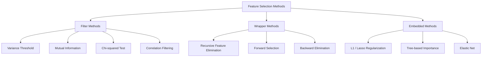
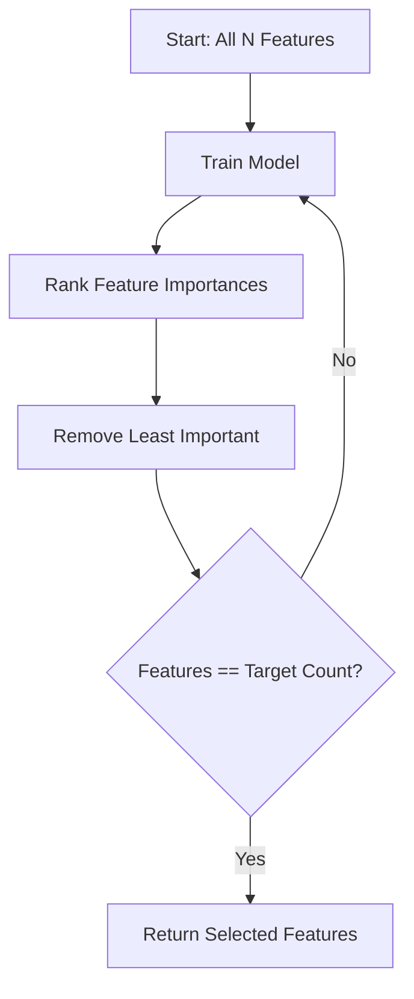
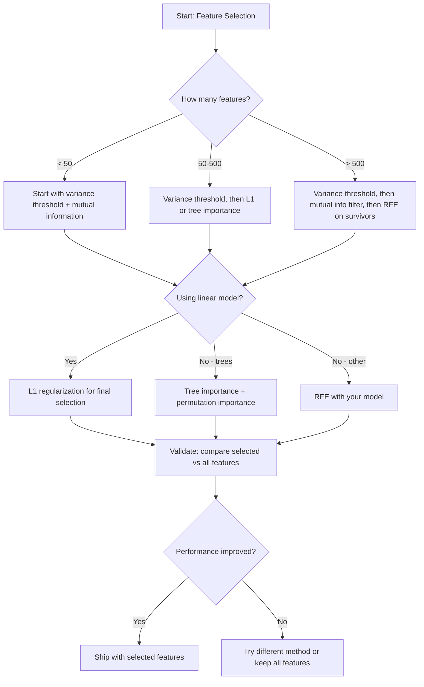

# 18 · 特征选择

> 特征越多并不越好。选对特征才更好。

**类型：** 实战构建
**语言：** Python
**前置：** 阶段 2，第 01-09 课，第 08 课（特征工程）
**时长：** 约 75 分钟

## 学习目标

- 从零实现过滤式方法（方差阈值、互信息、卡方检验）和包裹式方法（RFE、前向选择）
- 解释为什么互信息能够捕捉到相关系数所遗漏的非线性「特征-目标」关系
- 对比 L1 正则化（嵌入式选择）与 RFE（包裹式选择），评估二者的计算开销权衡
- 构建一条组合多种方法的特征选择流水线，并在留出数据上证明其泛化能力的提升

## 问题所在

你有 500 个特征。模型训练缓慢，频繁过拟合，没人能解释它到底学到了什么。你不断加入更多特征，希望提升性能，结果却越来越糟。

这正是「维度灾难（curse of dimensionality）」在起作用。随着特征数量增长，特征空间的体积急剧膨胀。数据点变得稀疏，点与点之间的距离趋于一致。模型需要指数级增长的数据才能找到真实模式。噪声特征淹没了信号特征，过拟合成了默认结果。

特征选择就是解药。剥离噪声，去除冗余，只保留那些真正携带目标信息的特征。结果是：训练更快、泛化更好、模型也真正可解释。

我们的目标不是用上所有可得的信息，而是用对的信息。

## 核心概念

### 特征选择的三大类别

每一种特征选择方法都可以归入以下三类之一：



**过滤式方法（Filter methods）** 用某个统计度量独立地为每个特征打分，不依赖任何模型。速度快，但会遗漏特征之间的交互作用。

**包裹式方法（Wrapper methods）** 训练一个模型来评估特征子集，把模型性能当作评分依据。效果更好，但开销大，因为它要多次重新训练模型。

**嵌入式方法（Embedded methods）** 在模型训练过程中顺带完成特征选择。L1 正则化会把权重驱向零，决策树则在最有用的特征上进行分裂。选择发生在拟合过程之中，而非作为独立的步骤。

### 方差阈值

最简单的过滤式方法。如果一个特征在各样本间几乎不变化，那么它几乎不携带任何信息。

设想某个特征在 1000 个样本中有 999 个取值都是 0.0，它的方差接近于零，任何模型都无法用它来区分类别。删掉它。

```
variance(x) = mean((x - mean(x))^2)
```

设定一个阈值（例如 0.01），剔除所有方差低于该阈值的特征。这一步无需查看目标变量，就能移除常量或近似常量的特征。

适用场景：作为其他方法之前的预处理步骤。它能以近乎零成本捕捉到那些明显无用的特征。

局限性：一个特征可能方差很高，却依然是纯粹的噪声。方差阈值是必要的，但并不充分。

### 互信息

互信息（mutual information）衡量的是：知道特征 X 的取值，能在多大程度上降低对目标 Y 的不确定性。

```
I(X; Y) = sum_x sum_y p(x, y) * log(p(x, y) / (p(x) * p(y)))
```

如果 X 与 Y 相互独立，那么 p(x, y) = p(x) * p(y)，对数项为零，于是 I(X; Y) = 0。X 关于 Y 的信息越多，互信息就越高。

相对于相关系数的关键优势：互信息能捕捉非线性关系。某个特征与目标的相关系数可能为零，但互信息却很高，因为它们之间的关系是二次的或周期性的。

对于连续特征，需先离散化为若干个分箱（基于直方图的估计）。分箱数会影响估计结果——分箱太少会丢失信息，太多则会引入噪声。常见选择：sqrt(n) 个分箱，或采用 Sturges 规则（1 + log2(n)）。


### 递归特征消除（RFE）

RFE（Recursive Feature Elimination）是一种包裹式方法，它利用模型自身给出的特征重要性来迭代式地剪枝：

1. 用全部特征训练模型
2. 按重要性对特征排序（线性模型用系数，树模型用不纯度下降量）
3. 移除最不重要的一个（或几个）特征
4. 重复以上步骤，直到剩下所需数量的特征



RFE 会考虑特征之间的交互作用，因为模型同时看到所有剩余特征。移除一个特征会改变其他特征的重要性。这使它比过滤式方法更为周全。

代价是：你要训练模型 N − target 次。对于 500 个特征、目标为 10 的情形，那就是 490 轮训练。对于昂贵的模型来说，这很慢。你可以通过每步移除多个特征来提速（例如每轮移除排名最末的 10%）。

### L1（Lasso）正则化

L1 正则化把权重的绝对值之和加进损失函数：

```
loss = prediction_error + alpha * sum(|w_i|)
```

参数 alpha 控制剪枝特征的力度。alpha 越大，被精确驱向零的权重就越多。

为什么是精确为零？L1 惩罚在权重空间中构造出一个菱形的约束区域。最优解往往落在这个菱形的某个顶点上，而在顶点处会有一个或多个权重恰好为零。L2 正则化（岭回归）构造的是圆形约束区域，权重会收缩，但很少恰好触及零。

这就是嵌入式特征选择：模型在训练过程中学会忽略哪些特征。权重为零的特征实际上被移除了。

优点：只需一次训练；能处理相关特征（保留其中一个，将其余清零）；大多数线性模型的实现中都内置了这一功能。

局限性：只适用于线性模型，无法捕捉非线性的特征重要性。

### 基于树的特征重要性

决策树及其集成（随机森林、梯度提升）天然能为特征排序。每一次分裂都会降低不纯度（分类用基尼系数或熵，回归用方差）。带来更大不纯度下降的特征更重要。

对于一个含 T 棵树的随机森林：

```
importance(feature_j) = (1/T) * sum over all trees of
    sum over all nodes splitting on feature_j of
        (n_samples * impurity_decrease)
```

这会为每个特征给出一个归一化的重要性分数。它能自动处理非线性关系和特征交互。

注意：基于树的重要性会偏向于取值种类很多（高基数）的特征。一个随机 ID 列会显得很重要，因为它能完美地分裂每一个样本。可用置换重要性作为可靠性校验。

### 置换重要性

一种与模型无关的方法：

1. 训练模型，并在验证数据上记录基线性能
2. 对每个特征：随机打乱其取值，测量性能的下降幅度
3. 下降越多，该特征越重要

如果打乱某个特征不会损害性能，说明模型并不依赖它；如果性能崩溃，那么该特征至关重要。

置换重要性（permutation importance）避免了基于树的重要性所带来的基数偏差。但它很慢：每个特征要做一次完整评估，并为求稳定还要重复多次。

### 对比表

| 方法 | 类别 | 速度 | 非线性 | 特征交互 |
|--------|------|-------|-----------|---------------------|
| 方差阈值 | 过滤式 | 极快 | 否 | 否 |
| 互信息 | 过滤式 | 快 | 是 | 否 |
| 相关性过滤 | 过滤式 | 快 | 否 | 否 |
| RFE | 包裹式 | 慢 | 取决于模型 | 是 |
| L1 / Lasso | 嵌入式 | 快 | 否（线性） | 否 |
| 树重要性 | 嵌入式 | 中等 | 是 | 是 |
| 置换重要性 | 与模型无关 | 慢 | 是 | 是 |

### 决策流程图



## 动手构建

### 第 1 步：生成具有已知特征结构的合成数据

```python
import numpy as np


def make_feature_selection_data(n_samples=500, seed=42):
    rng = np.random.RandomState(seed)

    x1 = rng.randn(n_samples)
    x2 = rng.randn(n_samples)
    x3 = rng.randn(n_samples)
    x4 = x1 + 0.1 * rng.randn(n_samples)
    x5 = x2 + 0.1 * rng.randn(n_samples)

    informative = np.column_stack([x1, x2, x3, x4, x5])

    correlated = np.column_stack([
        x1 * 0.9 + 0.1 * rng.randn(n_samples),
        x2 * 0.8 + 0.2 * rng.randn(n_samples),
        x3 * 0.7 + 0.3 * rng.randn(n_samples),
        x1 * 0.5 + x2 * 0.5 + 0.1 * rng.randn(n_samples),
        x2 * 0.6 + x3 * 0.4 + 0.1 * rng.randn(n_samples),
    ])

    noise = rng.randn(n_samples, 10) * 0.5

    X = np.hstack([informative, correlated, noise])
    y = (2 * x1 - 1.5 * x2 + x3 + 0.5 * rng.randn(n_samples) > 0).astype(int)

    feature_names = (
        [f"info_{i}" for i in range(5)]
        + [f"corr_{i}" for i in range(5)]
        + [f"noise_{i}" for i in range(10)]
    )

    return X, y, feature_names
```

我们已知真实结构：特征 0-4 是有信息量的（其中第 3、4 个是第 0、1 个的相关副本），特征 5-9 与有信息量的特征相关，特征 10-19 是纯噪声。一个好的选择方法应当把 0-4 排在最高，把 10-19 排在最低。

### 第 2 步：方差阈值

```python
def variance_threshold(X, threshold=0.01):
    variances = np.var(X, axis=0)
    mask = variances > threshold
    return mask, variances
```

### 第 3 步：互信息（离散）

```python
def discretize(x, n_bins=10):
    min_val, max_val = x.min(), x.max()
    if max_val == min_val:
        return np.zeros_like(x, dtype=int)
    bin_edges = np.linspace(min_val, max_val, n_bins + 1)
    binned = np.digitize(x, bin_edges[1:-1])
    return binned


def mutual_information(X, y, n_bins=10):
    n_samples, n_features = X.shape
    mi_scores = np.zeros(n_features)

    y_vals, y_counts = np.unique(y, return_counts=True)
    p_y = y_counts / n_samples

    for f in range(n_features):
        x_binned = discretize(X[:, f], n_bins)
        x_vals, x_counts = np.unique(x_binned, return_counts=True)
        p_x = dict(zip(x_vals, x_counts / n_samples))

        mi = 0.0
        for xv in x_vals:
            for yi, yv in enumerate(y_vals):
                joint_mask = (x_binned == xv) & (y == yv)
                p_xy = np.sum(joint_mask) / n_samples
                if p_xy > 0:
                    mi += p_xy * np.log(p_xy / (p_x[xv] * p_y[yi]))
        mi_scores[f] = mi

    return mi_scores
```

### 第 4 步：递归特征消除

```python
def simple_logistic_importance(X, y, lr=0.1, epochs=100):
    n_samples, n_features = X.shape
    w = np.zeros(n_features)
    b = 0.0

    for _ in range(epochs):
        z = X @ w + b
        pred = 1.0 / (1.0 + np.exp(-np.clip(z, -500, 500)))
        error = pred - y
        w -= lr * (X.T @ error) / n_samples
        b -= lr * np.mean(error)

    return w, b


def rfe(X, y, n_features_to_select=5, lr=0.1, epochs=100):
    n_total = X.shape[1]
    remaining = list(range(n_total))
    rankings = np.ones(n_total, dtype=int)
    rank = n_total

    while len(remaining) > n_features_to_select:
        X_subset = X[:, remaining]
        w, _ = simple_logistic_importance(X_subset, y, lr, epochs)
        importances = np.abs(w)

        least_idx = np.argmin(importances)
        original_idx = remaining[least_idx]
        rankings[original_idx] = rank
        rank -= 1
        remaining.pop(least_idx)

    for idx in remaining:
        rankings[idx] = 1

    selected_mask = rankings == 1
    return selected_mask, rankings
```

### 第 5 步：L1 特征选择

```python
def soft_threshold(w, alpha):
    return np.sign(w) * np.maximum(np.abs(w) - alpha, 0)


def l1_feature_selection(X, y, alpha=0.1, lr=0.01, epochs=500):
    n_samples, n_features = X.shape
    w = np.zeros(n_features)
    b = 0.0

    for _ in range(epochs):
        z = X @ w + b
        pred = 1.0 / (1.0 + np.exp(-np.clip(z, -500, 500)))
        error = pred - y

        gradient_w = (X.T @ error) / n_samples
        gradient_b = np.mean(error)

        w -= lr * gradient_w
        w = soft_threshold(w, lr * alpha)
        b -= lr * gradient_b

    selected_mask = np.abs(w) > 1e-6
    return selected_mask, w
```

### 第 6 步：基于树的重要性（简单决策树）

```python
def gini_impurity(y):
    if len(y) == 0:
        return 0.0
    classes, counts = np.unique(y, return_counts=True)
    probs = counts / len(y)
    return 1.0 - np.sum(probs ** 2)


def best_split(X, y, feature_idx):
    values = np.unique(X[:, feature_idx])
    if len(values) <= 1:
        return None, -1.0

    best_threshold = None
    best_gain = -1.0
    parent_gini = gini_impurity(y)
    n = len(y)

    for i in range(len(values) - 1):
        threshold = (values[i] + values[i + 1]) / 2.0
        left_mask = X[:, feature_idx] <= threshold
        right_mask = ~left_mask

        n_left = np.sum(left_mask)
        n_right = np.sum(right_mask)

        if n_left == 0 or n_right == 0:
            continue

        gain = parent_gini - (n_left / n) * gini_impurity(y[left_mask]) - (n_right / n) * gini_impurity(y[right_mask])

        if gain > best_gain:
            best_gain = gain
            best_threshold = threshold

    return best_threshold, best_gain


def tree_importance(X, y, n_trees=50, max_depth=5, seed=42):
    rng = np.random.RandomState(seed)
    n_samples, n_features = X.shape
    importances = np.zeros(n_features)

    for _ in range(n_trees):
        sample_idx = rng.choice(n_samples, size=n_samples, replace=True)
        feature_subset = rng.choice(n_features, size=max(1, int(np.sqrt(n_features))), replace=False)

        X_boot = X[sample_idx]
        y_boot = y[sample_idx]

        tree_imp = _build_tree_importance(X_boot, y_boot, feature_subset, max_depth)
        importances += tree_imp

    total = importances.sum()
    if total > 0:
        importances /= total

    return importances


def _build_tree_importance(X, y, feature_subset, max_depth, depth=0):
    n_features = X.shape[1]
    importances = np.zeros(n_features)

    if depth >= max_depth or len(np.unique(y)) <= 1 or len(y) < 4:
        return importances

    best_feature = None
    best_threshold = None
    best_gain = -1.0

    for f in feature_subset:
        threshold, gain = best_split(X, y, f)
        if gain > best_gain:
            best_gain = gain
            best_feature = f
            best_threshold = threshold

    if best_feature is None or best_gain <= 0:
        return importances

    importances[best_feature] += best_gain * len(y)

    left_mask = X[:, best_feature] <= best_threshold
    right_mask = ~left_mask

    importances += _build_tree_importance(X[left_mask], y[left_mask], feature_subset, max_depth, depth + 1)
    importances += _build_tree_importance(X[right_mask], y[right_mask], feature_subset, max_depth, depth + 1)

    return importances
```

### 第 7 步：运行所有方法并对比

代码文件会在同一份合成数据集上运行全部五种方法，并打印出一张对比表，展示每种方法各自选中了哪些特征。

## 实际应用

在 scikit-learn 中，特征选择已经内置到流水线里：

```python
from sklearn.feature_selection import (
    VarianceThreshold,
    mutual_info_classif,
    RFE,
    SelectFromModel,
)
from sklearn.linear_model import Lasso, LogisticRegression
from sklearn.ensemble import RandomForestClassifier

vt = VarianceThreshold(threshold=0.01)
X_filtered = vt.fit_transform(X)

mi_scores = mutual_info_classif(X, y)
top_k = np.argsort(mi_scores)[-10:]

rfe_selector = RFE(LogisticRegression(), n_features_to_select=10)
rfe_selector.fit(X, y)
X_rfe = rfe_selector.transform(X)

lasso_selector = SelectFromModel(Lasso(alpha=0.01))
lasso_selector.fit(X, y)
X_lasso = lasso_selector.transform(X)

rf = RandomForestClassifier(n_estimators=100)
rf.fit(X, y)
importances = rf.feature_importances_
```

从零实现的版本清楚地展示了每种方法内部到底发生了什么。方差阈值无非是计算 `var(X, axis=0)` 再套上一个掩码。互信息就是在一张列联表里统计联合频率与边缘频率。RFE 是一个不断训练、排序、剪枝的循环。L1 是带软阈值步骤的梯度下降。树重要性则是在各次分裂上累加不纯度下降量。没有魔法——只有统计与循环。

sklearn 版本则额外提供了稳健性（例如 mutual_info_classif 使用 k-NN 密度估计而非分箱）、速度（C 实现）以及流水线集成能力。

## 交付物

本课产出：
- `outputs/skill-feature-selector.md`——一份用于选择合适特征选择方法的快速参考决策树

## 练习

1. **前向选择**：实现 RFE 的反向过程。从零个特征开始，每一步加入能让模型性能提升最多的那个特征，当继续加入特征不再带来收益时停止。把选中的特征与 RFE 的结果作对比。哪种更快？哪种结果更好？

2. **稳定性选择**：运行 L1 特征选择 50 次，每次都在数据的随机 80% 子样本上、用略有不同的 alpha 值进行。统计每个特征被选中的频次。在超过 80% 的运行中都被选中的特征即为「稳定」特征。把这些稳定特征与单次运行的 L1 选择结果对比，哪种更可靠？

3. **多重共线性检测**：计算所有特征的相关矩阵。实现一个函数，给定相关性阈值（例如 0.9），从每一对高度相关的特征中移除其中之一（保留与目标互信息更高的那个）。在合成数据集上测试，验证它确实移除了冗余的相关特征。

4. **特征选择流水线**：把方差阈值、互信息过滤和 RFE 串成一条流水线。先移除近零方差的特征，再按互信息保留前 50%，最后在幸存特征上运行 RFE。把这条流水线与单独在全部特征上运行 RFE 作对比。流水线更快吗？准确率是否相当？

5. **从零实现置换重要性**：实现置换重要性。对每个特征，将其取值打乱 10 次，测量 F1 分数的平均下降幅度。把得到的排名与基于树的重要性作对比。找出二者意见不一致的情形并解释原因（提示：相关特征）。

## 关键术语

| 术语 | 人们常说 | 它实际的含义 |
|------|----------------|----------------------|
| 过滤式方法（Filter method） | 「独立地为特征打分」 | 一种特征选择思路，用某个统计度量对特征排序而不训练任何模型，孤立地评估每个特征 |
| 包裹式方法（Wrapper method） | 「用模型来挑特征」 | 一种特征选择思路，通过训练模型并以其性能作为选择标准来评估特征子集 |
| 嵌入式方法（Embedded method） | 「模型在训练时顺便选好特征」 | 作为模型拟合一部分发生的特征选择，例如 L1 正则化将权重驱向零 |
| 互信息（Mutual information） | 「一个变量能告诉你另一个变量多少信息」 | 衡量在已知 X 的情况下对 Y 不确定性的降低程度，能同时捕捉线性与非线性依赖 |
| 递归特征消除（Recursive Feature Elimination） | 「训练、排序、剪枝、重复」 | 一种迭代式包裹方法，训练模型、移除最不重要的特征，然后重复直到达到目标数量 |
| L1 / Lasso 正则化 | 「能干掉特征的惩罚项」 | 在损失函数中加入权重绝对值之和，把不重要的特征权重精确驱向零 |
| 方差阈值（Variance threshold） | 「移除常量特征」 | 剔除那些在各样本间方差低于指定阈值的特征，过滤掉不携带信息的特征 |
| 特征重要性（Feature importance） | 「哪些特征最重要」 | 衡量每个特征对模型预测贡献大小的分数，由分裂增益（树）或系数大小（线性）计算得到 |
| 置换重要性（Permutation importance） | 「打乱后看损失多大」 | 通过随机打乱每个特征的取值并测量由此引起的模型性能下降来评估特征重要性 |
| 维度灾难（Curse of dimensionality） | 「特征太多、数据不够」 | 一种现象：增加特征会使特征空间体积呈指数级膨胀，从而使数据变稀疏、距离失去意义 |

## 延伸阅读

- [An Introduction to Variable and Feature Selection (Guyon & Elisseeff, 2003)](https://jmlr.org/papers/v3/guyon03a.html)——特征选择方法的奠基性综述，至今仍被广泛引用
- [scikit-learn Feature Selection Guide](https://scikit-learn.org/stable/modules/feature_selection.html)——过滤式、包裹式与嵌入式方法的实用参考，附有代码示例
- [Stability Selection (Meinshausen & Buhlmann, 2010)](https://arxiv.org/abs/0809.2932)——将子采样与特征选择相结合，以获得稳健、可复现的结果
- [Beware Default Random Forest Importances (Strobl et al., 2007)](https://bmcbioinformatics.biomedcentral.com/articles/10.1186/1471-2105-8-25)——揭示基于树的重要性中的基数偏差，并提出条件重要性作为替代方案
