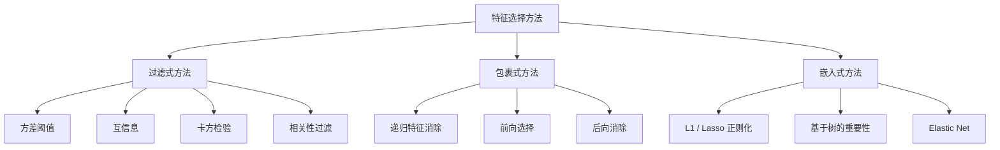
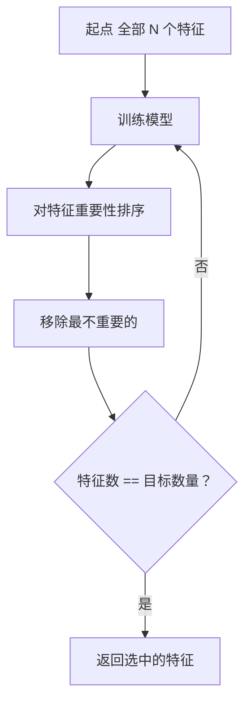
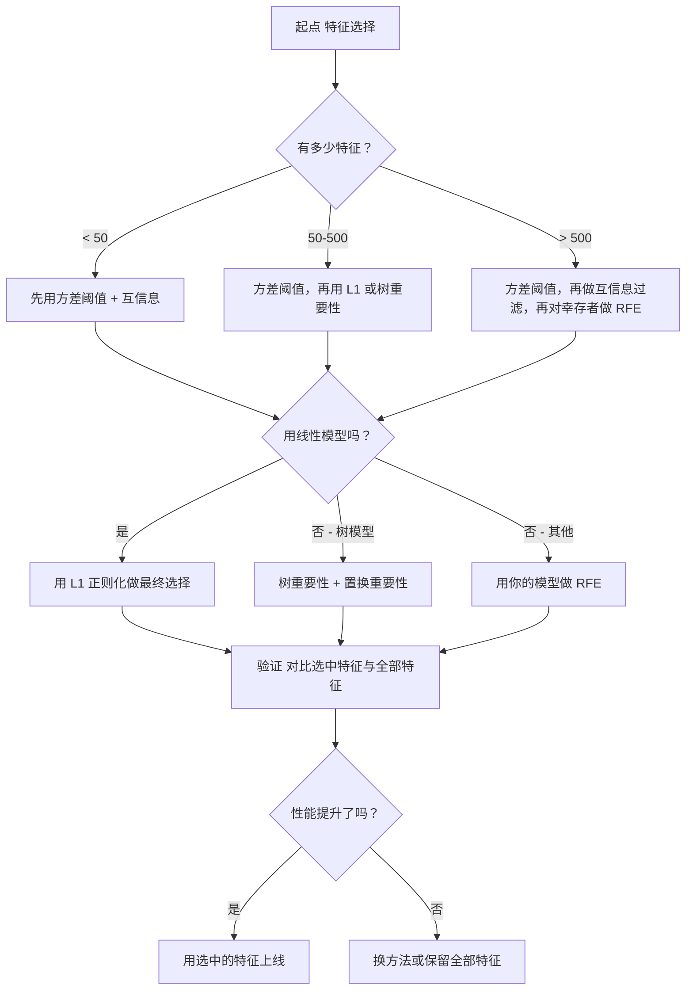

# 特征选择（Feature Selection）

> 译注：本文译自同目录 [`en.md`](./en.md)。术语遵循仓根 [TRANSLATION_GUIDE.md](../../../../TRANSLATION_GUIDE.md)。

> 特征不是越多越好，对的特征才好。

**Type:** Build
**Language:** Python
**Prerequisites:** Phase 2, Lessons 01-09, 08 (feature engineering)
**Time:** ~75 minutes

## 学习目标（Learning Objectives）

- 从零实现 filter 方法（variance threshold、mutual information（互信息）、卡方检验）和 wrapper 方法（RFE、forward selection）
- 解释为什么 mutual information 能捕捉 correlation（相关性）抓不到的非线性 feature-target 关系
- 对比 L1 regularization（嵌入式选择）与 RFE（包裹式选择），评估它们的计算开销取舍
- 构建一条组合多种方法的 feature selection 流水线，并在留出集上证明泛化能力的提升

## 问题（The Problem）

你有 500 个 feature。模型训练慢、不停过拟合，没人能解释它到底学到了什么。你想着加更多 feature 也许能改善——结果反而更糟。

这就是维度灾难（curse of dimensionality）在作祟。随着 feature 数量增加，feature 空间的体积爆炸式膨胀。数据点变得稀疏，点与点之间的距离趋于一致。模型需要指数级更多的数据才能找到真实的模式。噪声 feature 淹没了信号 feature。过拟合成了默认结局。

Feature selection 就是解药。剥掉噪声、去除冗余，只保留那些真正承载目标信息的 feature。结果是：训练更快、泛化更好、模型也变得可解释。

目标不是用上所有可得的信息，而是用对的信息。

## 概念（The Concept）

### 三大类 feature selection（Three Categories of Feature Selection）

每种 feature selection 方法都属于以下三类之一：



**Filter 方法（Filter methods）**用统计指标独立给每个 feature 打分，不依赖模型。速度快，但抓不到 feature 之间的交互。

**Wrapper 方法（Wrapper methods）**训练一个模型来评估 feature 子集，把模型表现当作分数。效果更好，但代价高，因为模型要被反复重训。

**嵌入式方法（Embedded methods）**把 feature selection 内嵌到模型训练里。L1 regularization 会把权重压到零；决策树会在最有用的 feature 上做分裂。选择是在拟合过程中发生的，不是单独一步。

### Variance Threshold（方差阈值）

最简单的 filter。如果一个 feature 在所有样本之间几乎不变化，那它几乎不携带任何信息。

想象一个 feature 在 1000 个样本中有 999 个都是 0.0，它的方差接近零。任何模型都没法用它来区分类别。删掉。

```
variance(x) = mean((x - mean(x))^2)
```

设一个阈值（比如 0.01），把方差低于它的 feature 全部丢掉。这一步连目标变量都不看，就把常数或近似常数的 feature 干掉了。

什么时候用：作为其他方法之前的预处理步骤。它能用近乎零的成本捕掉那些显然没用的 feature。

局限：一个 feature 方差很大，也可能纯粹是噪声。Variance threshold 是必要不充分条件。

### Mutual Information（互信息）

Mutual information 衡量的是：知道 feature X 的取值，能在多大程度上减少对目标 Y 的不确定性。

```
I(X; Y) = sum_x sum_y p(x, y) * log(p(x, y) / (p(x) * p(y)))
```

如果 X 与 Y 独立，则 p(x, y) = p(x) * p(y)，log 项为零，I(X; Y) = 0。X 告诉你越多关于 Y 的信息，mutual information 越大。

相比 correlation 的关键优势：mutual information 能捕捉非线性关系。一个 feature 可能与目标的 correlation 为零，但 mutual information 很高，因为它们之间是二次或周期性的关系。

对连续 feature，先离散化分箱（基于直方图的估计）。bin 数会影响估计——bin 太少会丢信息，太多会引入噪声。常见选择：sqrt(n) 个 bin 或 Sturges 规则（1 + log2(n)）。


### Recursive Feature Elimination (RFE)（递归特征消除）

RFE 是一种 wrapper 方法。它利用模型自己的 feature importance（特征重要性）反复剪枝：

1. 用全部 feature 训练模型
2. 按重要性排序 feature（线性模型用系数，树模型用不纯度下降量）
3. 移除最不重要的 feature（一个或多个）
4. 重复直到剩下目标数量的 feature



RFE 会考虑 feature 之间的交互，因为模型每次都看到所有剩余的 feature。删掉一个 feature 会改变其他 feature 的重要性，这让它比 filter 方法更彻底。

代价：你要训练模型 N - target 次。500 个 feature、目标 10 个，就是 490 次训练。对昂贵的模型来说很慢。可以每步移除多个 feature 来加速（比如每轮砍掉末位 10%）。

### L1 (Lasso) Regularization（L1 正则化）

L1 regularization 在损失函数里加上权重的绝对值之和：

```
loss = prediction_error + alpha * sum(|w_i|)
```

alpha 参数控制 feature 被剪掉的力度。alpha 越大，越多权重被压到精确的零。

为什么是精确的零？L1 惩罚在权重空间里形成一个菱形约束区域。最优解倾向于落在菱形的某个角上，那里有一个或多个权重为零。L2 regularization（ridge）形成的是圆形约束，权重会收缩但很少正好为零。

这就是嵌入式 feature selection：模型在训练中自己学会忽略哪些 feature。权重为零的 feature 实际上就被移除了。

优点：单次训练完成；自动处理相关 feature（挑一个、把其他清零）；大多数线性模型实现里都内置。

局限：只对线性模型有效，无法捕捉非线性的 feature importance。

### 基于树的特征重要性（Tree-Based Feature Importance）

决策树及其集成（随机森林、gradient boosting）天然地给 feature 排序。每次分裂都会降低不纯度（分类任务用 Gini 或熵，回归任务用方差）。让不纯度下降越多的 feature 越重要。

对于 T 棵树的随机森林：

```
importance(feature_j) = (1/T) * sum over all trees of
    sum over all nodes splitting on feature_j of
        (n_samples * impurity_decrease)
```

这给出每个 feature 的归一化重要性分数。它能自动处理非线性关系和 feature 交互。

注意：基于树的重要性偏向唯一取值多（高基数）的 feature。一个随机 ID 列会显得很重要，因为它能完美切分每个样本。用 permutation importance 做一次合理性检验。

### Permutation Importance（置换重要性）

一种与模型无关的方法：

1. 训练模型，记录在验证集上的基线表现
2. 对每个 feature：随机打乱它的取值，测量性能下降量
3. 下降越多，feature 越重要

如果打乱某个 feature 不影响性能，说明模型不依赖它。如果性能崩了，那个 feature 就是关键。

Permutation importance 避免了基于树重要性的高基数偏差。但它慢：每个 feature 要跑一次完整评估，还得多次重复才稳定。

### 对比表（Comparison Table）

| 方法 | 类型 | 速度 | 非线性 | Feature 交互 |
|--------|------|-------|-----------|---------------------|
| Variance threshold | Filter | 极快 | 否 | 否 |
| Mutual information | Filter | 快 | 是 | 否 |
| Correlation filter | Filter | 快 | 否 | 否 |
| RFE | Wrapper | 慢 | 取决于模型 | 是 |
| L1 / Lasso | Embedded | 快 | 否（线性） | 否 |
| Tree importance | Embedded | 中等 | 是 | 是 |
| Permutation importance | 与模型无关 | 慢 | 是 | 是 |

### 决策流程图（Decision Flowchart）



## 动手实现（Build It）

### Step 1：生成已知特征结构的合成数据

```python
import numpy as np


def make_feature_selection_data(n_samples=500, seed=42):
    rng = np.random.RandomState(seed)

    x1 = rng.randn(n_samples)
    x2 = rng.randn(n_samples)
    x3 = rng.randn(n_samples)
    x4 = x1 + 0.1 * rng.randn(n_samples)
    x5 = x2 + 0.1 * rng.randn(n_samples)

    informative = np.column_stack([x1, x2, x3, x4, x5])

    correlated = np.column_stack([
        x1 * 0.9 + 0.1 * rng.randn(n_samples),
        x2 * 0.8 + 0.2 * rng.randn(n_samples),
        x3 * 0.7 + 0.3 * rng.randn(n_samples),
        x1 * 0.5 + x2 * 0.5 + 0.1 * rng.randn(n_samples),
        x2 * 0.6 + x3 * 0.4 + 0.1 * rng.randn(n_samples),
    ])

    noise = rng.randn(n_samples, 10) * 0.5

    X = np.hstack([informative, correlated, noise])
    y = (2 * x1 - 1.5 * x2 + x3 + 0.5 * rng.randn(n_samples) > 0).astype(int)

    feature_names = (
        [f"info_{i}" for i in range(5)]
        + [f"corr_{i}" for i in range(5)]
        + [f"noise_{i}" for i in range(10)]
    )

    return X, y, feature_names
```

我们知道真值：feature 0-4 是有信息量的（其中 3 和 4 是 0 和 1 的相关副本），feature 5-9 与有信息量的 feature 相关，feature 10-19 是纯噪声。一个好的选择方法应该把 0-4 排在最前、把 10-19 排在最后。

### Step 2：Variance threshold

```python
def variance_threshold(X, threshold=0.01):
    variances = np.var(X, axis=0)
    mask = variances > threshold
    return mask, variances
```

### Step 3：Mutual information（离散）

```python
def discretize(x, n_bins=10):
    min_val, max_val = x.min(), x.max()
    if max_val == min_val:
        return np.zeros_like(x, dtype=int)
    bin_edges = np.linspace(min_val, max_val, n_bins + 1)
    binned = np.digitize(x, bin_edges[1:-1])
    return binned


def mutual_information(X, y, n_bins=10):
    n_samples, n_features = X.shape
    mi_scores = np.zeros(n_features)

    y_vals, y_counts = np.unique(y, return_counts=True)
    p_y = y_counts / n_samples

    for f in range(n_features):
        x_binned = discretize(X[:, f], n_bins)
        x_vals, x_counts = np.unique(x_binned, return_counts=True)
        p_x = dict(zip(x_vals, x_counts / n_samples))

        mi = 0.0
        for xv in x_vals:
            for yi, yv in enumerate(y_vals):
                joint_mask = (x_binned == xv) & (y == yv)
                p_xy = np.sum(joint_mask) / n_samples
                if p_xy > 0:
                    mi += p_xy * np.log(p_xy / (p_x[xv] * p_y[yi]))
        mi_scores[f] = mi

    return mi_scores
```

### Step 4：Recursive Feature Elimination

```python
def simple_logistic_importance(X, y, lr=0.1, epochs=100):
    n_samples, n_features = X.shape
    w = np.zeros(n_features)
    b = 0.0

    for _ in range(epochs):
        z = X @ w + b
        pred = 1.0 / (1.0 + np.exp(-np.clip(z, -500, 500)))
        error = pred - y
        w -= lr * (X.T @ error) / n_samples
        b -= lr * np.mean(error)

    return w, b


def rfe(X, y, n_features_to_select=5, lr=0.1, epochs=100):
    n_total = X.shape[1]
    remaining = list(range(n_total))
    rankings = np.ones(n_total, dtype=int)
    rank = n_total

    while len(remaining) > n_features_to_select:
        X_subset = X[:, remaining]
        w, _ = simple_logistic_importance(X_subset, y, lr, epochs)
        importances = np.abs(w)

        least_idx = np.argmin(importances)
        original_idx = remaining[least_idx]
        rankings[original_idx] = rank
        rank -= 1
        remaining.pop(least_idx)

    for idx in remaining:
        rankings[idx] = 1

    selected_mask = rankings == 1
    return selected_mask, rankings
```

### Step 5：L1 feature selection

```python
def soft_threshold(w, alpha):
    return np.sign(w) * np.maximum(np.abs(w) - alpha, 0)


def l1_feature_selection(X, y, alpha=0.1, lr=0.01, epochs=500):
    n_samples, n_features = X.shape
    w = np.zeros(n_features)
    b = 0.0

    for _ in range(epochs):
        z = X @ w + b
        pred = 1.0 / (1.0 + np.exp(-np.clip(z, -500, 500)))
        error = pred - y

        gradient_w = (X.T @ error) / n_samples
        gradient_b = np.mean(error)

        w -= lr * gradient_w
        w = soft_threshold(w, lr * alpha)
        b -= lr * gradient_b

    selected_mask = np.abs(w) > 1e-6
    return selected_mask, w
```

### Step 6：基于树的重要性（简单决策树）

```python
def gini_impurity(y):
    if len(y) == 0:
        return 0.0
    classes, counts = np.unique(y, return_counts=True)
    probs = counts / len(y)
    return 1.0 - np.sum(probs ** 2)


def best_split(X, y, feature_idx):
    values = np.unique(X[:, feature_idx])
    if len(values) <= 1:
        return None, -1.0

    best_threshold = None
    best_gain = -1.0
    parent_gini = gini_impurity(y)
    n = len(y)

    for i in range(len(values) - 1):
        threshold = (values[i] + values[i + 1]) / 2.0
        left_mask = X[:, feature_idx] <= threshold
        right_mask = ~left_mask

        n_left = np.sum(left_mask)
        n_right = np.sum(right_mask)

        if n_left == 0 or n_right == 0:
            continue

        gain = parent_gini - (n_left / n) * gini_impurity(y[left_mask]) - (n_right / n) * gini_impurity(y[right_mask])

        if gain > best_gain:
            best_gain = gain
            best_threshold = threshold

    return best_threshold, best_gain


def tree_importance(X, y, n_trees=50, max_depth=5, seed=42):
    rng = np.random.RandomState(seed)
    n_samples, n_features = X.shape
    importances = np.zeros(n_features)

    for _ in range(n_trees):
        sample_idx = rng.choice(n_samples, size=n_samples, replace=True)
        feature_subset = rng.choice(n_features, size=max(1, int(np.sqrt(n_features))), replace=False)

        X_boot = X[sample_idx]
        y_boot = y[sample_idx]

        tree_imp = _build_tree_importance(X_boot, y_boot, feature_subset, max_depth)
        importances += tree_imp

    total = importances.sum()
    if total > 0:
        importances /= total

    return importances


def _build_tree_importance(X, y, feature_subset, max_depth, depth=0):
    n_features = X.shape[1]
    importances = np.zeros(n_features)

    if depth >= max_depth or len(np.unique(y)) <= 1 or len(y) < 4:
        return importances

    best_feature = None
    best_threshold = None
    best_gain = -1.0

    for f in feature_subset:
        threshold, gain = best_split(X, y, f)
        if gain > best_gain:
            best_gain = gain
            best_feature = f
            best_threshold = threshold

    if best_feature is None or best_gain <= 0:
        return importances

    importances[best_feature] += best_gain * len(y)

    left_mask = X[:, best_feature] <= best_threshold
    right_mask = ~left_mask

    importances += _build_tree_importance(X[left_mask], y[left_mask], feature_subset, max_depth, depth + 1)
    importances += _build_tree_importance(X[right_mask], y[right_mask], feature_subset, max_depth, depth + 1)

    return importances
```

### Step 7：跑完所有方法并对比

代码文件会在同一份合成数据集上跑完五种方法，并打印一张对比表，展示每种方法选出的 feature。

## 用起来（Use It）

用 scikit-learn，feature selection 是流水线里现成的：

```python
from sklearn.feature_selection import (
    VarianceThreshold,
    mutual_info_classif,
    RFE,
    SelectFromModel,
)
from sklearn.linear_model import Lasso, LogisticRegression
from sklearn.ensemble import RandomForestClassifier

vt = VarianceThreshold(threshold=0.01)
X_filtered = vt.fit_transform(X)

mi_scores = mutual_info_classif(X, y)
top_k = np.argsort(mi_scores)[-10:]

rfe_selector = RFE(LogisticRegression(), n_features_to_select=10)
rfe_selector.fit(X, y)
X_rfe = rfe_selector.transform(X)

lasso_selector = SelectFromModel(Lasso(alpha=0.01))
lasso_selector.fit(X, y)
X_lasso = lasso_selector.transform(X)

rf = RandomForestClassifier(n_estimators=100)
rf.fit(X, y)
importances = rf.feature_importances_
```

从零实现的版本能让你看到每种方法内部到底发生了什么。Variance threshold 不过是算 `var(X, axis=0)` 加一个 mask；mutual information 就是在列联表里数联合频率和边缘频率；RFE 就是一个训练 -> 排序 -> 剪枝的循环；L1 是带软阈值步骤的梯度下降；Tree importance 在分裂中累计不纯度下降量。没有魔法——只是统计和循环。

sklearn 版本添加了健壮性（比如 mutual_info_classif 用 k-NN 密度估计而不是分箱）、速度（C 语言实现）和流水线集成。

## 上线部署（Ship It）

本课产出：
- `outputs/skill-feature-selector.md` —— 一份用来挑选合适 feature selection 方法的快查决策树

## 练习（Exercises）

1. **Forward selection**：实现 RFE 的反向版本。从零个 feature 开始。每一步加入能让模型表现提升最多的那个 feature；当继续加入不再有帮助时停下。把选出的 feature 与 RFE 的结果做对比。哪个更快？哪个效果更好？

2. **Stability selection（稳定性选择）**：跑 50 次 L1 feature selection，每次在数据的随机 80% 子样本上、用略有差异的 alpha。统计每个 feature 被选中的次数。被选中超过 80% 的算「稳定」。把稳定 feature 与单次 L1 的结果对比，哪个更可靠？

3. **多重共线性检测**：计算所有 feature 的 correlation 矩阵。实现一个函数：给定一个 correlation 阈值（如 0.9），从每对高度相关的 feature 里删掉一个（保留与目标 mutual information 更高的那个）。在合成数据集上验证它能去掉冗余的相关 feature。

4. **Feature selection 流水线**：把 variance threshold、mutual information 过滤和 RFE 串成一条流水线。先去掉近零方差的 feature，再按 mutual information 保留前 50%，然后对幸存者跑 RFE。把这条流水线和直接对全部 feature 跑 RFE 做对比。流水线更快吗？精度持平吗？

5. **从零实现 permutation importance**：对每个 feature，把它的取值打乱 10 次，测量 F1 分数的平均下降量。把这个排名与基于树的重要性对比。找出二者意见不一致的情况并解释原因（提示：相关 feature）。

## 关键术语（Key Terms）

| 术语 | 大家怎么说 | 实际含义 |
|------|----------------|----------------------|
| Filter 方法 | 「独立给 feature 打分」 | 一种 feature selection 方式，用统计指标对每个 feature 单独排序，不训练模型，孤立地评估每个 feature |
| Wrapper 方法 | 「让模型来挑 feature」 | 一种 feature selection 方式，通过训练模型并以其表现作为选择标准来评估 feature 子集 |
| 嵌入式方法（Embedded method） | 「模型在训练时自己选 feature」 | 把 feature selection 嵌入到模型拟合过程中，例如 L1 regularization 把权重压到零 |
| Mutual information | 「一个变量能告诉你多少另一个变量的信息」 | 衡量给定 X 时 Y 的不确定性下降量，能同时捕捉线性与非线性依赖 |
| Recursive Feature Elimination | 「训练、排序、剪枝、重复」 | 一种迭代式 wrapper 方法，训练模型、移除最不重要的 feature，重复直到达到目标数量 |
| L1 / Lasso regularization | 「干掉 feature 的惩罚项」 | 把权重绝对值之和加进损失函数，让不重要 feature 的权重精确地变为零 |
| Variance threshold | 「删掉常数 feature」 | 删除样本间方差低于指定阈值的 feature，过滤掉无信息量的 feature |
| Feature importance | 「哪些 feature 最关键」 | 表示每个 feature 对模型预测贡献多少的分数，可由分裂增益（树）或系数大小（线性）计算 |
| Permutation importance | 「打乱后看伤害」 | 通过随机打乱每个 feature 的取值并测量模型性能的下降量来评估 feature 重要性 |
| 维度灾难（Curse of dimensionality） | 「feature 太多、数据不够」 | 增加 feature 会指数级扩大 feature 空间体积，使数据稀疏、距离失去意义 |

## 延伸阅读（Further Reading）

- [An Introduction to Variable and Feature Selection (Guyon & Elisseeff, 2003)](https://jmlr.org/papers/v3/guyon03a.html) —— feature selection 方法的奠基性综述，至今被广泛引用
- [scikit-learn Feature Selection Guide](https://scikit-learn.org/stable/modules/feature_selection.html) —— filter、wrapper、embedded 方法的实用参考，附代码示例
- [Stability Selection (Meinshausen & Buhlmann, 2010)](https://arxiv.org/abs/0809.2932) —— 把子采样与 feature selection 结合，得到稳健、可复现的结果
- [Beware Default Random Forest Importances (Strobl et al., 2007)](https://bmcbioinformatics.biomedcentral.com/articles/10.1186/1471-2105-8-25) —— 演示基于树的重要性中的高基数偏差，并提出条件重要性作为替代
