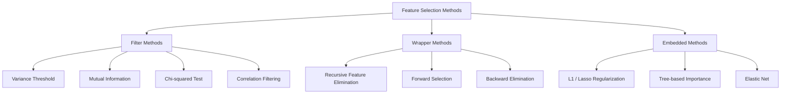
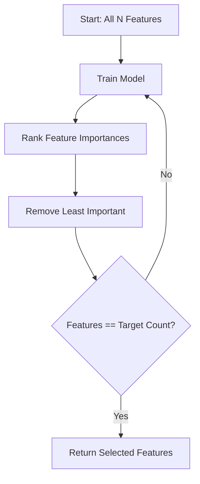
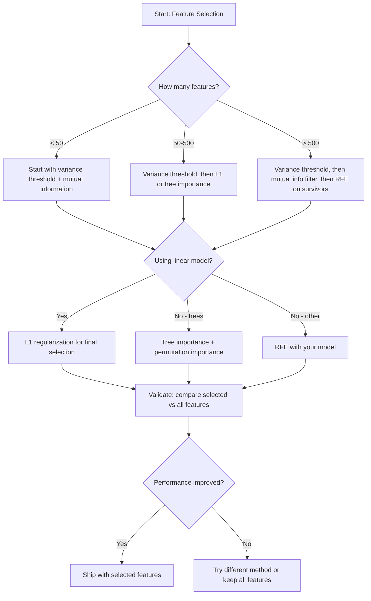

# 特征选择

> 功能越多并不越好。正确的功能更好。

** 类型：** 构建
** 语言：** Python
** 先决条件：** 第2阶段，课程01-09、08（特征工程）
** 时间：** ~75分钟

## 学习目标

- 从头开始实施过滤方法（方差阈值、互信息、卡方）和包装方法（RFE、前向选择）
- 解释为什么互信息捕获相关性缺失的非线性特征-目标关系
- 比较L1正规化（嵌入式选择）与RFE（包装器选择）并评估它们的计算权衡
- 构建一个结合多种方法的要素选择管道，并展示对已发布数据的改进的概括

## 问题

您有500个功能。你的模型训练缓慢，不断过度适应，没有人能解释它学到了什么。您添加更多功能以提高性能。情况变得更糟。

这就是维度的诅咒。随着要素数量的增加，要素空间的体积也会爆炸式增长。数据点变得稀疏。点之间的距离收敛。该模型需要指数级更多的数据才能找到真正的模式。噪声特征淹没了信号特征。过拟合将成为默认值。

功能选择是解药。去掉噪音。删除冗余。保留包含有关目标的实际信息的功能。结果：更快的训练、更好的概括以及您可以实际解释的模型。

目标不是使用所有可用信息。就是使用正确的信息。

## 概念

### 功能选择的三类

每种特征选择方法都属于三种类型之一：



** 过滤方法 ** 使用统计指标对每个特征独立评分。他们不使用模型。速度很快，但他们错过了功能交互。

** 包装方法 ** 训练模型来评估特征子集。他们使用模型性能作为分数。结果更好，但价格昂贵，因为它们多次重新训练模型。

** 嵌入式方法 ** 选择功能作为模型训练的一部分。L1正规化将权重推至零。决策树在最有用的功能上分裂。选择发生在试穿过程中，而不是作为单独的步骤。

### 方差阈值

最简单的过滤器。如果特征在样本中几乎没有变化，那么它几乎不携带任何信息。

考虑1000个样本中的999个样本为0.0的特征。它的方差接近于零。没有模型可以使用它来区分类别。删除它。

```
variance(x) = mean((x - mean(x))^2)
```

设置阈值（例如，0.01）。删除方差低于其的每个特征。这会删除恒定或接近恒定的特征，而根本不需要查看目标变量。

何时使用它：作为其他方法之前的预处理步骤。它以接近零的成本捕获明显无用的功能。

局限性：特征可能具有高方差但仍然是纯噪音。方差阈值是必要的，但还不够。

### 互信息

互信息衡量了解特征X的值在多大程度上减少了目标Y的不确定性。

```
I(X; Y) = sum_x sum_y p(x, y) * log(p(x, y) / (p(x) * p(y)))
```

如果X和Y独立，则p（x，y）= p（x）* p（y），因此对数项为零，I（X; Y）= 0。X告诉您关于Y的信息越多，互信息就越高。

相对于相关性的关键优势：互信息捕捉非线性关系。特征与目标的相关性可能为零，但互信息较高，因为该关系是二次或周期性的。

对于连续特征，首先将其离散化为二进制（基于柱状图的估计）。箱的数量会影响估计--箱太少会丢失信息，箱太多会增加噪音。常见的选择：SQRT（n）bins或Sturges规则（1 + log 2（n））。


### 回归特征消除（RFE）

RFE是一种包装方法。它使用模型自身的特征重要性来迭代修剪：

1. 利用所有功能训练模型
2. 按重要性对特征进行排名（线性模型的系数、树木的杂质减少）
3. 删除最不重要的功能
4. 重复此操作，直到剩余所需数量的要素



RFE考虑特征交互，因为模型将所有剩余特征集中在一起。删除一个功能会改变其他功能的重要性。这使得它比过滤方法更彻底。

成本：您训练模型N -目标时间。有500个功能，目标为10，即490次训练运行。对于昂贵的型号来说，这是缓慢的。您可以通过每一步删除多个功能来加快速度（例如，每轮去除底部10%）。

### L1（Lasso）正规化

L1正则化将权重的绝对值添加到损失函数中：

```
loss = prediction_error + alpha * sum(|w_i|)
```

Alpha参数控制修剪功能的积极程度。更高的Alpha意味着更多的权重完全为零。

为什么完全为零？L1罚分在权重空间中创建钻石形约束区域。最佳解决方案往往会落在这个钻石的一角，那里的一个或多个权重为零。L2正规化（山脊）创建了一个圆形约束，其中权重会缩小，但很少达到零。

这是嵌入式特征选择：模型在训练期间学习要忽略哪些特征。零权重的功能被有效删除。

优点：单次训练运行，处理相关特征（选择一个并将其他特征归零），内置在大多数线性模型实现中。

局限性：仅适用于线性模型。无法捕捉非线性特征的重要性。

### 基于树的特征重要性

决策树及其集合（随机森林、梯度增强）自然地对特征进行排名。每次分裂都会减少不纯性（分类的基尼或信息，回归的方差）。能够产生更大杂质减少的特征更为重要。

对于带有T树的随机森林：

```
importance(feature_j) = (1/T) * sum over all trees of
    sum over all nodes splitting on feature_j of
        (n_samples * impurity_decrease)
```

这为每个特征提供了标准化的重要性分数。它自动处理非线性关系和特征交互。

警告：基于树的重要性偏向于具有许多独特值（高基数）的特征。随机ID列显得很重要，因为它完美地分割了每个样本。使用排列重要性作为健全性检查。

### 排列的重要性

模型不可知的方法：

1. 训练模型并记录验证数据的基线性能
2. 对于每个功能：随机洗牌其值，衡量性能下降
3. 降幅越大，功能越重要

如果调整功能不会损害性能，那么模型就不依赖于它。如果性能崩溃，那么该功能就至关重要。

排列重要性避免了基于树的重要性的基数偏差。但它很慢：每个功能进行一次完整评估，为了稳定性，重复多次。

### 对比表

| 方法 | 类型 | 速度 | 非线性 | 特征交互 |
|--------|------|-------|-----------|---------------------|
| 方差阈值 | 滤波器 | 非常快 | 没有 | 没有 |
| 互信息 | 滤波器 | 快速 | 是的 | 没有 |
| 相关滤波器 | 滤波器 | 快速 | 没有 | 没有 |
| RFE | 包装器 | 慢 | 取决于型号 | 是的 |
| L1 /套索 | 嵌入式 | 快速 | 否（线性） | 没有 |
| 树木的重要性 | 嵌入式 | 介质 | 是的 | 是的 |
| 排列重要性 | Model-agnostic | 慢 | 是的 | 是的 |

### 决策流程图



## 建设党

### 步骤1：生成具有已知特征结构的合成数据

```python
import numpy as np


def make_feature_selection_data(n_samples=500, seed=42):
    rng = np.random.RandomState(seed)

    x1 = rng.randn(n_samples)
    x2 = rng.randn(n_samples)
    x3 = rng.randn(n_samples)
    x4 = x1 + 0.1 * rng.randn(n_samples)
    x5 = x2 + 0.1 * rng.randn(n_samples)

    informative = np.column_stack([x1, x2, x3, x4, x5])

    correlated = np.column_stack([
        x1 * 0.9 + 0.1 * rng.randn(n_samples),
        x2 * 0.8 + 0.2 * rng.randn(n_samples),
        x3 * 0.7 + 0.3 * rng.randn(n_samples),
        x1 * 0.5 + x2 * 0.5 + 0.1 * rng.randn(n_samples),
        x2 * 0.6 + x3 * 0.4 + 0.1 * rng.randn(n_samples),
    ])

    noise = rng.randn(n_samples, 10) * 0.5

    X = np.hstack([informative, correlated, noise])
    y = (2 * x1 - 1.5 * x2 + x3 + 0.5 * rng.randn(n_samples) > 0).astype(int)

    feature_names = (
        [f"info_{i}" for i in range(5)]
        + [f"corr_{i}" for i in range(5)]
        + [f"noise_{i}" for i in range(10)]
    )

    return X, y, feature_names
```

我们知道基本真相：特征0-4是信息性的（加上3和4是0和1的相关副本），特征5-9与信息性特征相关，特征10-19是纯噪音。一个好的选择方法最高排名为0-4，最低排名为10-19。

### 第2步：方差阈值

```python
def variance_threshold(X, threshold=0.01):
    variances = np.var(X, axis=0)
    mask = variances > threshold
    return mask, variances
```

### 第3步：相互信息（离散）

```python
def discretize(x, n_bins=10):
    min_val, max_val = x.min(), x.max()
    if max_val == min_val:
        return np.zeros_like(x, dtype=int)
    bin_edges = np.linspace(min_val, max_val, n_bins + 1)
    binned = np.digitize(x, bin_edges[1:-1])
    return binned


def mutual_information(X, y, n_bins=10):
    n_samples, n_features = X.shape
    mi_scores = np.zeros(n_features)

    y_vals, y_counts = np.unique(y, return_counts=True)
    p_y = y_counts / n_samples

    for f in range(n_features):
        x_binned = discretize(X[:, f], n_bins)
        x_vals, x_counts = np.unique(x_binned, return_counts=True)
        p_x = dict(zip(x_vals, x_counts / n_samples))

        mi = 0.0
        for xv in x_vals:
            for yi, yv in enumerate(y_vals):
                joint_mask = (x_binned == xv) & (y == yv)
                p_xy = np.sum(joint_mask) / n_samples
                if p_xy > 0:
                    mi += p_xy * np.log(p_xy / (p_x[xv] * p_y[yi]))
        mi_scores[f] = mi

    return mi_scores
```

### 第4步：循环特征消除

```python
def simple_logistic_importance(X, y, lr=0.1, epochs=100):
    n_samples, n_features = X.shape
    w = np.zeros(n_features)
    b = 0.0

    for _ in range(epochs):
        z = X @ w + b
        pred = 1.0 / (1.0 + np.exp(-np.clip(z, -500, 500)))
        error = pred - y
        w -= lr * (X.T @ error) / n_samples
        b -= lr * np.mean(error)

    return w, b


def rfe(X, y, n_features_to_select=5, lr=0.1, epochs=100):
    n_total = X.shape[1]
    remaining = list(range(n_total))
    rankings = np.ones(n_total, dtype=int)
    rank = n_total

    while len(remaining) > n_features_to_select:
        X_subset = X[:, remaining]
        w, _ = simple_logistic_importance(X_subset, y, lr, epochs)
        importances = np.abs(w)

        least_idx = np.argmin(importances)
        original_idx = remaining[least_idx]
        rankings[original_idx] = rank
        rank -= 1
        remaining.pop(least_idx)

    for idx in remaining:
        rankings[idx] = 1

    selected_mask = rankings == 1
    return selected_mask, rankings
```

### 第5步：L1功能选择

```python
def soft_threshold(w, alpha):
    return np.sign(w) * np.maximum(np.abs(w) - alpha, 0)


def l1_feature_selection(X, y, alpha=0.1, lr=0.01, epochs=500):
    n_samples, n_features = X.shape
    w = np.zeros(n_features)
    b = 0.0

    for _ in range(epochs):
        z = X @ w + b
        pred = 1.0 / (1.0 + np.exp(-np.clip(z, -500, 500)))
        error = pred - y

        gradient_w = (X.T @ error) / n_samples
        gradient_b = np.mean(error)

        w -= lr * gradient_w
        w = soft_threshold(w, lr * alpha)
        b -= lr * gradient_b

    selected_mask = np.abs(w) > 1e-6
    return selected_mask, w
```

### 第6步：基于树的重要性（简单决策树）

```python
def gini_impurity(y):
    if len(y) == 0:
        return 0.0
    classes, counts = np.unique(y, return_counts=True)
    probs = counts / len(y)
    return 1.0 - np.sum(probs ** 2)


def best_split(X, y, feature_idx):
    values = np.unique(X[:, feature_idx])
    if len(values) <= 1:
        return None, -1.0

    best_threshold = None
    best_gain = -1.0
    parent_gini = gini_impurity(y)
    n = len(y)

    for i in range(len(values) - 1):
        threshold = (values[i] + values[i + 1]) / 2.0
        left_mask = X[:, feature_idx] <= threshold
        right_mask = ~left_mask

        n_left = np.sum(left_mask)
        n_right = np.sum(right_mask)

        if n_left == 0 or n_right == 0:
            continue

        gain = parent_gini - (n_left / n) * gini_impurity(y[left_mask]) - (n_right / n) * gini_impurity(y[right_mask])

        if gain > best_gain:
            best_gain = gain
            best_threshold = threshold

    return best_threshold, best_gain


def tree_importance(X, y, n_trees=50, max_depth=5, seed=42):
    rng = np.random.RandomState(seed)
    n_samples, n_features = X.shape
    importances = np.zeros(n_features)

    for _ in range(n_trees):
        sample_idx = rng.choice(n_samples, size=n_samples, replace=True)
        feature_subset = rng.choice(n_features, size=max(1, int(np.sqrt(n_features))), replace=False)

        X_boot = X[sample_idx]
        y_boot = y[sample_idx]

        tree_imp = _build_tree_importance(X_boot, y_boot, feature_subset, max_depth)
        importances += tree_imp

    total = importances.sum()
    if total > 0:
        importances /= total

    return importances


def _build_tree_importance(X, y, feature_subset, max_depth, depth=0):
    n_features = X.shape[1]
    importances = np.zeros(n_features)

    if depth >= max_depth or len(np.unique(y)) <= 1 or len(y) < 4:
        return importances

    best_feature = None
    best_threshold = None
    best_gain = -1.0

    for f in feature_subset:
        threshold, gain = best_split(X, y, f)
        if gain > best_gain:
            best_gain = gain
            best_feature = f
            best_threshold = threshold

    if best_feature is None or best_gain <= 0:
        return importances

    importances[best_feature] += best_gain * len(y)

    left_mask = X[:, best_feature] <= best_threshold
    right_mask = ~left_mask

    importances += _build_tree_importance(X[left_mask], y[left_mask], feature_subset, max_depth, depth + 1)
    importances += _build_tree_importance(X[right_mask], y[right_mask], feature_subset, max_depth, depth + 1)

    return importances
```

### 第7步：运行所有方法并进行比较

代码文件在同一合成数据集上运行所有五种方法，并打印一个比较表，显示每个方法选择的功能。

## 使用它

通过scikit-learn，功能选择内置在管道中：

```python
from sklearn.feature_selection import (
    VarianceThreshold,
    mutual_info_classif,
    RFE,
    SelectFromModel,
)
from sklearn.linear_model import Lasso, LogisticRegression
from sklearn.ensemble import RandomForestClassifier

vt = VarianceThreshold(threshold=0.01)
X_filtered = vt.fit_transform(X)

mi_scores = mutual_info_classif(X, y)
top_k = np.argsort(mi_scores)[-10:]

rfe_selector = RFE(LogisticRegression(), n_features_to_select=10)
rfe_selector.fit(X, y)
X_rfe = rfe_selector.transform(X)

lasso_selector = SelectFromModel(Lasso(alpha=0.01))
lasso_selector.fit(X, y)
X_lasso = lasso_selector.transform(X)

rf = RandomForestClassifier(n_estimators=100)
rf.fit(X, y)
importances = rf.feature_importances_
```

从头开始的实现准确地展示了每个方法内部发生的事情。方差阈值只是计算`var（X，axis=0）`并应用掩码。互信息是在列联表中计算联合频率和边际频率。RFE是一个训练、排名和修剪的循环。L1是具有软阈值步骤的梯度下降。树木的重要性通过分裂累积杂质减少。没有魔法--只有统计数据和循环。

sklearn版本增加了鲁棒性（例如，Mutual_info_classif使用k-NN密度估计而不是分类）、速度（C实现）和管道集成。

## 把它运

本课产生：
- ' outputes/skill-feature-selector.md '--用于选择正确的特征选择方法的快速参考决策树

## 演习

1. ** 向前选择 **：实现RFE相反的操作。从零特征开始。在每个步骤中，添加最能提高模型性能的功能。添加功能不再有帮助时停止。将所选功能与RFE结果进行比较。哪个更快？哪个会得到更好的结果？

2. ** 稳定性选择 **：运行L1特征选择50次，每次对数据的随机80%子样本进行，Alpha值略有不同。计算每个功能的选择频率。超过80%的运行中选择的功能是“稳定的”。“将稳定功能与单次运行L1选择进行比较。哪个更可靠？

3. ** 多重共线性检测 **：计算所有特征的相关矩阵。实现一个函数，给定一个相关阈值（例如，0.9），从每个高度相关的对中删除一个特征（保留与目标具有更高互信息的特征）。在合成数据集上进行测试，并验证它是否删除了冗余的相关特征。

4. ** 特征选择管道 **：将方差阈值、互信息过滤器和RFE链到单个管道中。首先删除近零方差特征，然后通过互信息保留前50%，然后对幸存者运行RFE。将此管道与在所有功能上单独运行RFE进行比较。管道速度更快吗？是否同样准确？

5. ** 从头开始排列重要性 **：实现排列重要性。对于每个特征，将其值洗牌10次，测量F1得分的平均下降。将排名与基于树的重要性进行比较。找到他们不同意的案例并解释原因（提示：相关特征）。

## 关键术语

| Term | 别人怎么说 | 它实际上意味着什么 |
|------|----------------|----------------------|
| 滤波方法 | “独立评分功能” | 一种特征选择方法，使用统计指标对特征进行排名，而无需训练模型，孤立地评估每个特征 |
| 包装器方法 | “使用模型来挑选特征” | 一种特征选择方法，通过训练模型并使用其性能作为选择标准来评估特征子集 |
| 嵌入方法 | “模型在训练期间选择特征” | 作为模型拟合的一部分发生的特征选择，例如L1正则化将权重驱动为零 |
| 互信息 | “一个变量告诉你多少关于另一个变量的信息” | 给定X的知识，衡量Y不确定性减少的指标，捕获线性和非线性依赖性 |
| 递归特征消除 | “训练、排名、修剪、重复” | 一种迭代包装方法，用于训练模型，删除最不重要的特征，并重复直到达到目标计数 |
| L1 / Lasso正规化 | “杀死特征的点球” | 将绝对权重值的总和添加到损失函数中，这将使不重要的特征权重恰好为零 |
| 方差阈值 | “删除不变的功能” | 删除样本间方差低于指定阈值的要素，过滤掉不携带信息的要素 |
| 特征重要性 | “哪些功能最重要” | 指示每个特征对模型预测的贡献程度的分数，根据分裂收益（树）或系数幅度（线性）计算 |
| 排列重要性 | “洗牌和衡量损害” | 通过随机洗牌每个特征的值并测量由此产生的模型性能下降来评估特征重要性 |
| 维数灾难 | “功能太多，数据不够” | 添加要素会指数级增加要素空间的体积，使数据稀疏且距离毫无意义 |

## 进一步阅读

- [An变量和特征选择简介（Guyon & Elisseeff，2003）]（https：//jmlr.org/papers/v3/guyon03a.html）--关于特征选择方法的基础调查，仍然被广泛引用
- [scikit-learn功能选择指南]（https：//scikit-learn.org/stable/modules/feature_selection.html）--过滤器、包装器和嵌入式方法的实用参考代码示例
- [稳定性选择（Meinshausen & Buhlmann，2010）]（https：//arxiv.org/ab/0809.2932）--将子采样与特征选择结合起来，以获得稳健、可重复的结果
- [小心默认随机森林重要性（Strobl等人，2007）]（https：//bmcbioinformatics.biomedcentral.com/articles/10.1186/1471-2105-8-25）--证明了基于树的重要性的基数偏差，并提出了条件重要性作为替代方案
