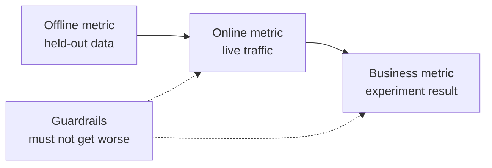

# ML System Design — From Problem to Deployed Model

> A model is one part of a system. The design decides what the model predicts, who acts on it, what it costs, and what happens when it fails.

**Type:** Build
**Languages:** Python
**Prerequisites:** Phase 2, Lessons 09 (Model Evaluation) and 13 (ML Pipelines)
**Time:** ~110 minutes

## Learning Objectives

- Frame a business problem as an ML task with a prediction, a decision that uses it, and a reason why rules are not enough
- Separate offline, online, business, and guardrail metrics, and compare every model against trivial and heuristic baselines
- Estimate the daily cost, latency, and staleness of batch and online inference from traffic numbers
- Choose a rollout pattern (shadow, canary, A/B test) and a safe default for each failure mode
- Identify feedback loops in which the model changes the data that trains its next version
- Write an ML design document and score it against a fixed checklist

## The Problem

A subscription company asks for "a churn model". A data scientist trains a gradient-boosted classifier and reports an AUC of 0.91. Three months later, nobody uses it.

The reasons have nothing to do with the algorithm. Nobody decided which action a score starts. The scores arrive once a week, but the retention team calls customers every day. The label came from a cancellations table that also stored the cancellation reason, so one feature contained the answer. Nobody compared the model with the rule the support team already used: call anyone idle for two weeks.

Each of these failures happened before training started. They are design failures, and a one-page design document asks about each of them. This lesson teaches the decisions in that document. You build a toolkit that prices batch and online serving, compares a model with its baselines, and scores a design document against a checklist.

## The Concept

### From a business goal to an ML task

A business goal is not an ML task. You turn it into one with four questions:

1. What exactly does the model predict, and for which entity (user, payment, store, item)?
2. Which decision uses the prediction, and who or what makes that decision?
3. When is the prediction needed, and which data exists at that moment?
4. How will you know that the decision got better?

| Business goal | Prediction | Decision that uses it | ML task |
|---|---|---|---|
| Reduce churn | Probability that a user cancels in the next 30 days | Send a save offer to the top 5 percent each night | Binary classification |
| Cut fraud losses | Probability that a payment is fraud | Approve, review, or block within 100 ms | Binary classification |
| Keep shelves stocked | Units sold per store per day next week | Order quantity for each store | Forecasting |
| Show relevant items | Relevance score for a (user, item) pair | Order of items in the feed | Ranking |

The second column needs the most care. "Predict churn" leaves the horizon, the entity, and the action open. "Predict whether this user cancels in the next 30 days, so that tonight's job can pick who gets an offer" fixes all three.

### When not to use ML

Rule #1 in Google's Rules of Machine Learning says not to be afraid to launch a product without machine learning. Machine learning needs data, and a simple heuristic often gets you part of the way. Do not use ML in these cases:

- A short rule reaches the goal and stays correct. A rule is cheaper to run, test, and explain.
- You have no labels and no practical way to collect them.
- Nobody acts on the prediction, so a better prediction changes nothing.
- The data that exists at prediction time does not contain the signal.
- One error is unacceptable and no person can check the output.
- Building and running the system costs more than the better decisions are worth.

When a rule gets long and fragile, ML starts to pay off. Rule #3 of the same guide prefers ML over a complex heuristic, because a learned model is easier to update and maintain.

### Three layers of metrics

You measure an ML system at three layers, plus a set of limits:

| Layer | When you can measure it | Churn example |
|---|---|---|
| Offline metric | Before launch, on held-out past data | F1 at the offer threshold, precision in the top 5 percent |
| Online metric | During launch, on live traffic | Offer acceptance rate, share of users scored, score distribution |
| Business metric | Weeks after launch, with an experiment | 30-day churn rate in the treated group versus a holdout group |
| Guardrail metric | All the time | Offer cost per saved user, unsubscribe rate, p99 latency |



The layers often disagree. An offline metric scores past data, and the past did not contain your model. An online metric depends on how people react to the decision. A business metric moves slowly and carries noise from everything else in the company.

Pick the offline metric that matches the decision. If the job contacts the top 5 percent of users, measure precision in the top 5 percent. AUC averages over every threshold, including thresholds that you never use. Rule #2 of the same guide says to design and implement metrics first, before you decide what the ML system will do.

### Baselines

A metric value means nothing alone. An F1 of 0.56 is good if the best alternative reaches 0.30 and poor if a rule reaches 0.60. Compare every model with three kinds of baseline:

- **Trivial baseline.** Always predict the majority class, or always predict the training mean. We used this check in the model evaluation lesson.
- **Heuristic baseline.** A rule from domain knowledge, or a one-feature threshold that you fit on the training data.
- **Current system.** Whatever makes the decision today, even when it is a person with a spreadsheet.

The lift is the model score minus the score of the strongest baseline. Set a minimum lift before you look at the results, and make it large enough to pay for the extra system. The trivial baseline is usually weak. The heuristic baseline is the hard one to beat.

### Data and label requirements

Answer these questions before you train:

- **Label source.** Which table or event defines the label, and who owns it?
- **Label delay.** How long after the prediction does the true outcome arrive? Fraud chargebacks can arrive weeks after the payment. Churn labels arrive at the end of the 30-day horizon.
- **Label quality.** Who assigns the label, and how often is it wrong?
- **Availability at prediction time.** Does every feature exist at the moment of the prediction? A feature that the system writes after the outcome leaks the label into training.
- **Volume per class.** How many positive examples exist? Two hundred positives limit you to simple models.
- **Time split.** Hold out the most recent period. We split data by time in the time-series lesson for the same reason.

### Latency, throughput, and cost budgets

Three numbers bound every serving design:

- **Latency budget.** The p99 latency is the time that 99 of 100 requests stay under. A payment check can need 50 ms. A nightly report can take hours.
- **Peak throughput.** Size the system for the busiest minute, not for the daily average. Peak QPS is often several times the average.
- **Cost budget.** Express it as dollars per day or dollars per 1000 predictions, so that you can compare designs.

Little's law connects the first two. The number of requests in progress equals throughput times latency. At 400 requests per second and 50 ms each, 20 requests are in progress at any moment.

### Batch inference versus online inference

There are two basic ways to serve predictions:

- **Batch inference.** A scheduled job scores every entity and writes the scores to a table or a key-value store. The application reads the stored score at request time.
- **Online inference.** The application sends the features to a model service at request time and waits for the score.

| Property | Batch | Online |
|---|---|---|
| Freshness | As old as the last run, plus the run time | Uses the data of the request |
| Request latency | One key-value read, a few ms | Feature fetch plus model time |
| Cost driver | Number of entities times runs per day | Replicas sized for peak QPS |
| New entities | No score until the next run | Scored on the first request |
| When it breaks | Old scores stay readable | Requests fail or time out |

The toolkit in this lesson prices both. Batch cost grows with the number of entities and with the number of runs per day. A shorter staleness limit means more runs. Online cost grows with peak traffic, because you pay for idle replicas between peaks. A batch job that takes one hour cannot meet a staleness limit under one hour at any price.

A hybrid design is common. A nightly batch job scores known users, and an online path scores new users and requests that need fresh data.

### Deployment patterns

A new model reaches users in stages:

1. **Shadow.** The new model receives a copy of live traffic. The system logs its predictions and never uses them. You compare latency, error rate, and prediction distribution with the current model.
2. **Canary.** The new model makes real decisions for a small share of traffic, often 1 to 5 percent. You widen the share in steps and roll back when a guardrail breaks.
3. **A/B test.** A random split of users sees each model. You measure the business metric with a statistical test, and you need enough traffic and enough time to see the difference.

Every stage needs a rollback that takes minutes. Keep the old model version deployed and switch traffic with configuration. The LLM serving phase covers the same three patterns for language models in the [shadow and canary lesson](../../../17-infrastructure-and-production/20-shadow-canary-progressive/docs/en.md) and the [A/B testing lesson](../../../17-infrastructure-and-production/21-ab-testing-llm-features/docs/en.md).

### Feedback loops

A feedback loop exists when the model's decisions change the data that trains its next version. Sculley et al. list direct and hidden feedback loops among the main sources of technical debt in ML systems. Three common cases:

- **Interventions hide the label.** A churn model sends offers, and the offers keep some users. Next month, high-risk users look loyal, and the retrained model learns that their features do not predict churn.
- **Blocked actions have no outcome.** A fraud model blocks a payment, so that payment never gets a chargeback label. Retrained models see fewer fraud examples from the blocked region.
- **Exposure limits feedback.** A ranking model shows its top items, so only those items collect clicks.

The fixes share one idea: keep some data that the model did not influence. Hold out a small random group that never gets the intervention. Give a small share of traffic a random decision. Log the score and the decision with each example, so that later training can tell influenced data from clean data.

### Failure modes and safe defaults

Every part of the system fails sooner or later. Decide the default action for each failure in the design, not during the incident:

| Failure | Result without a plan | Safe default |
|---|---|---|
| Model service times out | The request fails | Use the heuristic baseline |
| Nightly batch job fails | Scores go missing or get old | Serve the last good scores for a fixed time, then the rule |
| Feature is missing or out of range | The model scores bad input | Use the documented default value and log the event |
| New entity with no history | No score exists | Use the rule or the population average |
| Score distribution moves suddenly | Wrong decisions at scale | Pause automatic actions and alert a person |

The heuristic baseline from your metric section is also the default for most failures, so build it first.

### The design document

The design document records every decision above in one place, before training starts. The checker in this lesson scores a JSON version of it. Six items block a review, because each one makes the system unsafe or useless:

| Section | Question it answers | Blocking |
|---|---|---|
| Problem | What is predicted, which decision uses it, and why rules are not enough? | The decision |
| Metrics | Which offline, online, business, and guardrail metrics apply? | The business metric |
| Baselines | Which trivial, heuristic, and current-system baselines apply? | A heuristic or current baseline |
| Data | Where do labels come from, how late, and does each feature exist at prediction time? | No leakage |
| Budgets and serving | Which latency, peak QPS, cost, and staleness limits apply, and which serving mode fits them? | No |
| Rollout | Which shadow, canary, and A/B stages apply, and how do you roll back? | Shadow or canary, plus rollback |
| Feedback loops | How can the model change its own future data, and what keeps clean data? | No |
| Failure modes | What is the default action for each failure? | A default for every failure |
| Monitoring | What do you watch after launch? | No |

```figure
mlprod-serving-cost
```

## Build It

The code in `code/main.py` uses only the standard library. It has three tools: a serving cost model, a baseline comparator, and a design-document checker.

### Step 1: Describe the workload and the prices

A workload holds the traffic numbers and the budgets. A cost model holds the prices. The prices are round numbers for the exercise, not vendor quotes.

```python
@dataclass(frozen=True)
class Workload:
    name: str
    entities: int
    requests_per_day: int
    peak_qps: float
    max_staleness_hours: float
    latency_budget_ms: float


@dataclass(frozen=True)
class CostModel:
    batch_dollars_per_million: float = 0.40
    batch_job_hours: float = 1.0
    lookup_dollars_per_million: float = 0.25
    lookup_latency_ms: float = 4.0
    replica_dollars_per_hour: float = 0.50
    replica_qps: float = 200.0
    min_replicas: int = 2
    online_latency_ms: float = 35.0
```

### Step 2: Price batch and online serving

A batch job must finish inside the staleness limit. The time between runs is the limit minus the job time. Each run scores every entity, whether or not anyone asks for that score.

```python
def batch_plan(workload: Workload, costs: CostModel) -> ServingPlan:
    refresh_hours = workload.max_staleness_hours - costs.batch_job_hours
    if refresh_hours <= 0:
        return ServingPlan(
            "batch", False, math.inf, costs.lookup_latency_ms, math.inf, 0.0,
            "staleness limit is shorter than one batch job",
        )
    runs_per_day = 24.0 / refresh_hours
    predictions = workload.entities * runs_per_day
    dollars = (
        predictions / 1e6 * costs.batch_dollars_per_million
        + workload.requests_per_day / 1e6 * costs.lookup_dollars_per_million
    )
    ...
```

Online serving pays for enough replicas to handle the peak, with a minimum of two for availability:

```python
def online_plan(workload: Workload, costs: CostModel) -> ServingPlan:
    replicas = max(costs.min_replicas, math.ceil(workload.peak_qps / costs.replica_qps))
    dollars = replicas * costs.replica_dollars_per_hour * 24.0
    feasible = costs.online_latency_ms <= workload.latency_budget_ms
    ...
```

`choose_serving` keeps the plans that meet the latency and staleness limits and returns the cheapest one. It returns `None` when no plan fits, which tells you to change the budgets.

### Step 3: Compare a model with its baselines

The comparator scores the model and every baseline with the same metric. It measures the lift against the strongest baseline, not the weakest.

```python
def compare_to_baselines(
    y_true: list,
    model_pred: list,
    baselines: dict[str, list],
    metric,
    metric_name: str,
    higher_is_better: bool = True,
    min_lift: float = 0.02,
) -> BaselineReport:
    if not baselines:
        raise ValueError("a model needs at least one baseline")
    scores = {name: metric(y_true, pred) for name, pred in baselines.items()}
    pick = max if higher_is_better else min
    best_name = pick(scores, key=scores.get)
    model_score = metric(y_true, model_pred)
    lift = model_score - scores[best_name] if higher_is_better else scores[best_name] - model_score
    return BaselineReport(metric_name, {"model": model_score, **scores}, best_name, lift, min_lift)
```

The heuristic baseline is a one-feature rule. `fit_rule` tries each value of the feature as a threshold on the training data and keeps the threshold with the best F1. The demo trains a small logistic regression on synthetic churn data and compares it with three baselines.

### Step 4: Score a design document

Each checklist item has a key, a weight, a blocking flag, a message, and a check function. A blocking item has weight 2.

```python
CheckItem("decision", 2, True, "name the action that uses each prediction", lambda d: _text(d, "problem.decision")),
CheckItem("baselines", 2, True, "add a heuristic or current-system baseline", check_baselines),
CheckItem("no_leakage", 2, True, "confirm every feature exists at prediction time",
          lambda d: get_path(d, "data.features_available_at_prediction_time") is True),
CheckItem("serving_fit", 1, False, "pick a serving mode that meets the staleness, latency, and cost budgets",
          check_serving_fit),
```

`check_serving_fit` reuses the cost model. It reads the workload numbers from the document and prices the chosen mode. The check fails when that mode misses the staleness limit, the latency budget, or the daily cost budget. A document that says "batch" with a three-minute staleness limit fails this check. The cost model has no hybrid plan, so a document that says "hybrid" fails this check until you add that plan in Exercise 1.

`review_design_doc` adds the weights of the passed items and divides by the total. The verdict is "ready for review" only when the score reaches 0.85 and no blocking item fails.

### Step 5: Run it

```bash
python3 code/main.py
```

```console
nightly churn scores
  ok batch        $0.91/day      4 ms  1.0 runs per day over 2,000,000 entities
  ok online      $24.00/day     35 ms  2 replicas sized for 40 peak QPS
  choose: batch

feed ranking, 2-hour freshness
  ok batch       $48.50/day      4 ms  24.0 runs per day over 5,000,000 entities
  ok online      $24.00/day     35 ms  2 replicas sized for 120 peak QPS
  choose: online

=== Model versus baselines (churn, metric F1) ===
  model                    0.564
  days_idle > 12.8688      0.500
  random at base rate      0.232
  majority class           0.000
  model beats the strongest baseline (days_idle > 12.8688) by +0.064
```

The majority baseline scores 0 on F1, because it never predicts churn. The fitted rule is the real competitor. The model beats it by 0.064, so the model earns its place. With weaker features the rule can win, and then the rule is the right system to deploy.

The design-document review prints the weak document with six blocking items and the complete document with a score of 1.00. Pass a path to review your own document:

```bash
python3 code/main.py my_design_doc.json
```

## Use It

Each part of the toolkit maps to tools that teams use in production.

**Baselines.** scikit-learn provides the trivial baselines as estimators, so they fit into the same pipeline as the model:

```python
from sklearn.dummy import DummyClassifier, DummyRegressor
from sklearn.metrics import f1_score

majority = DummyClassifier(strategy="most_frequent").fit(X_train, y_train)
base_rate = DummyClassifier(strategy="stratified", random_state=0).fit(X_train, y_train)
mean_value = DummyRegressor(strategy="mean").fit(X_train, y_reg_train)

print(f1_score(y_test, majority.predict(X_test)))
```

`most_frequent` matches `majority_baseline`, and `stratified` matches `base_rate_baseline`. scikit-learn has no heuristic baseline, because the heuristic comes from your domain.

**Batch serving.** A workflow scheduler such as Apache Airflow or Dagster runs the scoring job. The job writes scores to a warehouse table or to a key-value store such as Redis or DynamoDB.

**Online serving.** Model servers such as KServe, BentoML, NVIDIA Triton, and TorchServe wrap a model behind an HTTP or gRPC endpoint. A plain web service with a loaded model also works for small models.

**Rollouts.** Kubernetes tools such as Argo Rollouts split traffic for canary releases. Experiment platforms such as GrowthBook and Statsig assign users to A/B groups and compute the statistics.

**Design review.** Breck et al. published the ML Test Score, a rubric of 28 tests and monitoring needs for production ML systems. Our checker is smaller. It asks the design questions that come before those tests.

## Ship It

This lesson produces `outputs/skill-ml-design-review.md`. The skill reviews an ML design document section by section and names the blocking gaps first. It also checks the serving choice with the batch and online cost arithmetic from this lesson.

## Exercises

1. Add a hybrid plan to `choose_serving`. Score known users in batch and new users online. Compare its daily cost.
2. Change the churn data until the model no longer beats the rule. Report the smallest coefficient change that removes the lift.
3. Add a `budgets.max_dollars_per_1k_predictions` item to the checklist. Write a test that fails without it.
4. Write a JSON design document for a payment fraud check. Run the checker and fix every blocking item.
5. Simulate the churn feedback loop. Remove the labels of users who got an offer, retrain, and measure the change in F1.

## Key Terms

| Term | What people say | What it means |
|------|----------------|----------------------|
| ML task | "Build a churn model" | A prediction target, an entity, a horizon, and the decision that uses the prediction |
| Offline metric | "The model score" | A metric computed on held-out past data before launch |
| Online metric | "Live numbers" | A metric measured on real traffic while the model runs |
| Business metric | "The goal" | The company outcome that the decision must change, measured with an experiment |
| Guardrail metric | "Do no harm" | A metric that must not get worse when the new model launches |
| Baseline | "The dumb model" | A trivial, heuristic, or current-system predictor that the model must beat by a set margin |
| Batch inference | "Precomputed scores" | A scheduled job scores every entity and stores the results for lookup |
| Online inference | "Real-time model" | The model scores each request when it arrives |
| Shadow deployment | "Dark launch" | The new model scores live traffic, and nobody uses its output |
| Canary release | "Slow rollout" | The new model decides for a small, growing share of traffic, with a rollback ready |
| Feedback loop | "The model trains itself" | The model's decisions change the data that trains its next version |

## Further Reading

- [Sculley et al., Hidden Technical Debt in Machine Learning Systems (NeurIPS 2015)](https://papers.nips.cc/paper/2015/hash/86df7dcfd896fcaf2674f757a2463eba-Abstract.html): feedback loops, entanglement, and the system costs around a model
- [Google, Rules of Machine Learning](https://developers.google.com/machine-learning/guides/rules-of-ml): practical rules for the first model, metrics, and training-serving consistency
- [Breck et al., The ML Test Score (IEEE Big Data 2017)](https://research.google/pubs/the-ml-test-score-a-rubric-for-ml-production-readiness-and-technical-debt-reduction/): 28 tests that measure production readiness
- [Kohavi, Tang, and Xu, Trustworthy Online Controlled Experiments (Cambridge University Press, 2020)](https://experimentguide.com/): how to run A/B tests that give correct answers
- [Sato, Wider, and Windheuser, Continuous Delivery for Machine Learning (2019)](https://martinfowler.com/articles/cd4ml.html): versioned data, models, and deployment pipelines
- [Google Cloud, MLOps: Continuous delivery and automation pipelines in machine learning](https://cloud.google.com/architecture/mlops-continuous-delivery-and-automation-pipelines-in-machine-learning): three maturity levels for training and serving automation
