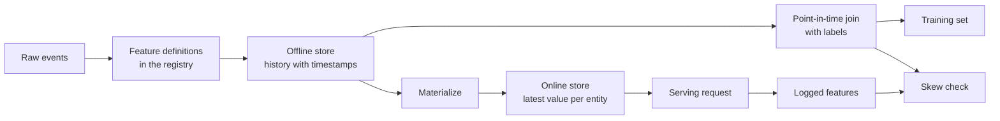

# Feature Stores and Training-Serving Skew

> A feature has one definition and two readers. Training reads its history as of each label time, and serving reads its latest value. When the two readers disagree, the model sees inputs that it never trained on.

**Type:** Build
**Languages:** Python
**Prerequisites:** Phase 2, Lessons 08 (Feature Engineering), 13 (ML Pipelines), 15 (Time Series), and 19 (ML System Design)
**Time:** ~100 minutes

## Learning Objectives

- Describe the offline store, the online store, entities, event timestamps, and TTLs, and the job of each one
- Implement a point-in-time correct join and show how a naive join copies future values into training data
- Name four causes of training-serving skew: two code paths, stale features, different defaults, and time travel
- Build a feature registry in which one definition feeds both the training path and the serving path
- Backfill a new feature over past dates without reading data from after each date
- Detect skew by comparing logged serving features with the training path for the same entity and time

## The Problem

A team builds a churn model. Each label says whether a user made no purchase in the 30 days after a label day. The team joins the labels to the user feature table on `user_id` and trains a rule on `days_since_last_purchase`. Offline accuracy is 0.948.

On live traffic, the model does worse than an older and simpler version. The feature table held the newest value for each user, from weeks after the label days. A user whose last purchase was on day 115 showed 60 idle days in the day 175 snapshot, so the feature contained the answer. Meanwhile, another team wrote the serving features again in a different service. Their 30-day window included one extra day, and their default for a new user was -1 instead of 365.

Both defects have the same cause. Training and serving computed "the same feature" in two different ways. This lesson builds the pieces of a feature store from scratch. You write a registry, a backfill, a point-in-time join, an online store with a TTL, and a skew check. The demo reproduces both defects with numbers.

## The Concept

### Two readers of the same feature

Training and serving ask for features in different shapes:

| Property | Training (offline) | Serving (online) |
|---|---|---|
| Question | "What was the value for each of 10 million (entity, time) pairs?" | "What is the value for this one entity now?" |
| Time | Many points in the past | The present |
| Volume | Millions of rows per job | One row per request |
| Latency | Minutes are fine | A few milliseconds |
| Storage | Offline store: full history with timestamps, in columnar files or a warehouse | Online store: the latest value per entity, in a key-value database |

A feature store keeps both stores filled from one set of feature definitions. Materialization is the job that copies the latest values from the offline store to the online store.



### Entities, timestamps, and TTL

Four terms describe every feature row:

- **Entity.** The key that a feature describes, such as `user_id` or `card_id`.
- **Event timestamp.** The time at which the value became true. A purchase count "as of day 14" has the event timestamp day 14.
- **Created timestamp.** The time at which the system wrote the row. A backfill that runs today writes rows with old event timestamps and a new created timestamp.
- **TTL (time to live).** The maximum age of a value. A value older than the TTL counts as missing, so the reader uses the default.

A group of features with the same entity, source, and TTL is often called a feature view.

### Point-in-time correct joins

A training row pairs a label with the feature values that existed at the label time. The point-in-time join does this for each label:

1. Find the feature rows of the same entity.
2. Keep the rows whose event timestamp is at or before the label timestamp.
3. Take the latest of those rows.
4. Drop it if the label timestamp minus its event timestamp is more than the TTL.

Here is one user, a label at day 16, and weekly feature rows:

| Feature row day | `purchases_30d` | Point-in-time join | Naive join on `user_id` |
|---|---|---|---|
| 7 | 4 | | |
| 14 | 3 | Selected | |
| 21 | 1 | Future | |
| 28 | 0 | Future | Selected |

The label asks whether the user buys anything in days 17 to 46. The day 28 row already counts the quiet days after the label day. It shows 0 purchases because the user stopped buying, which is the event that the label measures. The naive join copies the answer into the input.

We split data by time in the time-series lesson for the same reason. A point-in-time join applies that rule to every row instead of to one split point.

### Causes of training-serving skew

Google's Rules of Machine Learning define training-serving skew as a difference between performance during training and performance during serving. They name three causes: different data handling in the two pipelines, a change in the data between training and serving, and a feedback loop. In feature pipelines, four concrete causes appear again and again:

| Cause | What happens | Example from the demo |
|---|---|---|
| Two code paths | Training and serving compute the feature with different code | The serving window includes day `now - 30`, and the training window does not |
| Stale features | The value that serving reads has a different age from the value that training used | Training reads weekly snapshots, and a new service computes fresh values |
| Different defaults | The two paths fill a missing value differently | Training uses 365 for "no purchase yet", and serving uses -1 |
| Time travel | Training reads a value from after the label time | The naive join reads the newest snapshot for every label |

Rule #32 of the same guide says to reuse code between the training pipeline and the serving pipeline whenever possible. A feature store follows that rule with one definition that both paths call.

### A feature registry

The registry is the catalog of feature definitions. Each entry holds a name, an entity, a source, a transformation, a window, a default value, a TTL, an owner, a version, and a description.

Two rules keep it safe:

- Both paths read the definition from the registry. No service keeps a private copy of the transformation.
- A change to a definition creates a new version. The old version stays, so old models keep the feature that they trained on.

### Backfills

A new feature has no history, but training needs its value at every old label time. A backfill runs the definition at each past date and writes one row per entity and date. Each run reads only the events with timestamps at or before its date.

Backfills cost compute that grows with the number of entities times the number of dates. They also bring a subtle leak. A backfill that runs today writes rows with old event timestamps, but it can read data that arrived late or was corrected later. A strict point-in-time join also checks that the created timestamp is at or before the label time.

### Detecting skew

Rule #29 of the same guide says to log the features at serving time and use them in training. Even a small logged sample lets you check consistency. Compare each logged value with the value that the training path produces for the same entity and time. For each feature, report the share of mismatches and the mean absolute difference.

To find the cause, compare three pairs:

1. Online store read versus training join. This tests the whole system and should show zero skew.
2. Fresh computation versus training join. This isolates staleness.
3. Second code path versus fresh computation. This isolates code differences, such as windows and defaults.

```figure
mlprod-pit-join
```

## Build It

The code in `code/main.py` uses only the standard library. Time is a whole number of days. A weekly batch job writes feature snapshots on days 7, 14, and so on up to 175.

### Step 1: Feature definitions and the registry

A `FeatureDefinition` holds the transformation as data: an aggregate, a window, and a default. Its `compute` method never reads events after `as_of`.

```python
@dataclass(frozen=True)
class FeatureDefinition:
    name: str
    entity: str
    aggregate: str
    window_days: int | None
    default: float
    version: int = 1
    owner: str = "growth-team"
    description: str = ""

    def compute(self, events: list[Event], as_of: int) -> float:
        visible = [e for e in events if e.day <= as_of]
        if self.window_days is not None:
            visible = [e for e in visible if e.day > as_of - self.window_days]
        if self.aggregate == "count":
            return float(len(visible))
        if self.aggregate == "sum":
            return round(sum(e.amount for e in visible), 2)
        if self.aggregate == "days_since_last":
            return float(as_of - max(e.day for e in visible)) if visible else self.default
        raise ValueError(f"unknown aggregate {self.aggregate!r}")
```

`FeatureRegistry.register` accepts the same definition twice, but it rejects a different definition with the same name and version. `fill_defaults` gives both paths the same default for a missing value.

### Step 2: Backfill the offline store

```python
def backfill(registry: FeatureRegistry, names: list[str], events: list[Event], days: list[int]) -> list[FeatureRow]:
    rows = []
    for entity, entity_events in sorted(group_events(events).items()):
        for day in days:
            rows.append(FeatureRow(entity, day, registry.compute(names, entity_events, day)))
    return rows
```

The demo backfills three features for 299 users on 25 snapshot days, which gives 7475 rows.

### Step 3: The point-in-time join

Sort each entity's rows by day once. For each label, `bisect_right` finds the last row at or before the label day. The TTL check drops a row that is too old.

```python
def point_in_time_join(labels: list[LabelRow], rows: list[FeatureRow], ttl_days: int | None = None) -> list[JoinedRow]:
    by_entity: dict[str, list[FeatureRow]] = defaultdict(list)
    for row in rows:
        by_entity[row.entity].append(row)
    days_index = {}
    for entity, entity_rows in by_entity.items():
        entity_rows.sort(key=lambda r: r.day)
        days_index[entity] = [r.day for r in entity_rows]
    joined = []
    for label in labels:
        days = days_index.get(label.entity, [])
        pos = bisect.bisect_right(days, label.day) - 1
        match = by_entity[label.entity][pos] if pos >= 0 else None
        if match is not None and ttl_days is not None and label.day - match.day > ttl_days:
            match = None
        joined.append(JoinedRow(
            label.entity, label.day, label.label,
            match.day if match else None, match.values if match else None,
        ))
    return joined
```

### Step 4: Measure the leak from a naive join

`naive_latest_join` joins on the entity only, so it returns the newest row for every label. The demo builds labels on days 100, 120, and 140 and fits a one-feature rule on each training set. It then tests both rules on labels from day 145, with point-in-time features:

```console
  naive join used a snapshot from after the label day for 100% of rows
  offline accuracy, naive join: 0.948 (rule: idle > 53 days)
  offline accuracy, PIT join:   0.893 (rule: idle > 19 days)
  accuracy on day 145, trained with naive join: 0.763
  accuracy on day 145, trained with PIT join:   0.876
```

The naive join looks better offline, 0.948 against 0.893. On new data it is worse, 0.763 against 0.876. The leaked feature moved the fitted threshold from 19 to 53 idle days.

### Step 5: The online store and materialization

The online store keeps one row per entity and refuses rows older than the TTL. `materialize` writes only rows whose day is at or before the job time.

```python
class OnlineStore:
    def __init__(self, ttl_days: int):
        self.ttl_days = ttl_days
        self._latest: dict[str, FeatureRow] = {}

    def write(self, row: FeatureRow) -> None:
        current = self._latest.get(row.entity)
        if current is None or row.day >= current.day:
            self._latest[row.entity] = row

    def read(self, entity: str, now: int) -> dict[str, float] | None:
        row = self._latest.get(entity)
        if row is None or row.day > now or now - row.day > self.ttl_days:
            return None
        return dict(row.values)
```

With a TTL of 10 days, a read on day 145 returns the day 140 row. A read on day 160, with no new materialization, returns the defaults, because the row is 20 days old.

### Step 6: The skew check

`detect_skew` compares two views keyed by `(entity, day)`. It reports the mismatch rate and the mean absolute difference per feature and flags a feature when more than 1 percent of values differ.

```python
def detect_skew(
    training: dict[tuple[str, int], dict[str, float]],
    serving: dict[tuple[str, int], dict[str, float]],
    features: list[str],
    tolerance: float = 1e-6,
    max_mismatch_rate: float = 0.01,
) -> list[SkewReport]:
    keys = sorted(set(training) & set(serving))
    reports = []
    for feature in features:
        diffs = [abs(training[k][feature] - serving[k][feature]) for k in keys]
        mismatches = sum(1 for d in diffs if d > tolerance)
        rate = mismatches / len(keys) if keys else 0.0
        mean_diff = sum(diffs) / len(keys) if keys else 0.0
        reports.append(SkewReport(feature, len(keys), rate, mean_diff, rate > max_mismatch_rate))
    return reports
```

The demo logs requests on days 141 to 150 and runs the three comparisons from the concept section. The request pool includes 20 new users with no history.

```bash
python3 code/main.py
```

```console
=== Skew checks on 383 logged requests, days 141 to 150 ===
  online store read  vs  training join (one definition, same snapshots)
    ok   days_since_last_purchase   mismatch   0.0%  mean |diff|    0.00
    ok   purchases_30d              mismatch   0.0%  mean |diff|    0.00
    ok   spend_30d                  mismatch   0.0%  mean |diff|    0.00
  fresh compute      vs  training join (staleness only)
    SKEW days_since_last_purchase   mismatch  83.0%  mean |diff|    2.77
    SKEW purchases_30d              mismatch  30.5%  mean |diff|    0.38
    SKEW spend_30d                  mismatch  37.1%  mean |diff|   16.77
  second code path   vs  fresh compute (code differences only)
    SKEW days_since_last_purchase   mismatch   5.5%  mean |diff|   20.07
    SKEW purchases_30d              mismatch  12.5%  mean |diff|    0.13
    SKEW spend_30d                  mismatch  12.5%  mean |diff|    5.09
```

Read the three blocks in order:

- **One definition, same snapshots.** The online store and the training join read the same materialized rows, so skew is zero.
- **Staleness.** A fresh value differs from the weekly snapshot on most requests. Fresher data is not automatically better here, because the model learned from values up to six days old.
- **Code differences.** The second code path differs on 12.5 percent of window counts, because its window includes one extra day. It differs on `days_since_last_purchase` for new users only, but by a large amount: -1 against 365.

## Use It

Feast is an open-source feature store. Each piece of the from-scratch code has a Feast counterpart:

| From scratch | Feast |
|---|---|
| `FeatureDefinition`, `FeatureRegistry` | `Entity`, `FeatureView`, and `Field` in a feature repository, registered with `feast apply` |
| `FeatureRow` history | An offline store, for example a `FileSource` over Parquet files or a warehouse table |
| `point_in_time_join` with a TTL | `store.get_historical_features(entity_df=..., features=[...])` |
| `materialize` | `feast materialize-incremental <end time>` |
| `OnlineStore.read` | `store.get_online_features(features=[...], entity_rows=[...])` |
| Created timestamp check | `created_timestamp_column` on the source and `filter_by_created_timestamp=True` |

The definitions look like this. The code follows the Feast quickstart and is not needed to run this lesson.

```python
from datetime import timedelta

from feast import Entity, FeatureView, Field, FileSource
from feast.types import Float32, Int64

user = Entity(name="user", join_keys=["user_id"])

user_activity_source = FileSource(
    name="user_activity_source",
    path="data/user_activity.parquet",
    timestamp_field="event_timestamp",
    created_timestamp_column="created",
)

user_activity = FeatureView(
    name="user_activity",
    entities=[user],
    ttl=timedelta(days=10),
    schema=[
        Field(name="purchases_30d", dtype=Int64),
        Field(name="spend_30d", dtype=Float32),
        Field(name="days_since_last_purchase", dtype=Int64),
    ],
    source=user_activity_source,
)
```

Training and serving then read the same feature view:

```python
from feast import FeatureStore

store = FeatureStore(repo_path=".")

training_df = store.get_historical_features(
    entity_df=labels_df,
    features=["user_activity:purchases_30d", "user_activity:days_since_last_purchase"],
).to_df()

online = store.get_online_features(
    features=["user_activity:purchases_30d", "user_activity:days_since_last_purchase"],
    entity_rows=[{"user_id": 42}],
).to_dict()
```

`labels_df` holds one row per label with `user_id`, `event_timestamp`, and the label. The Feast documentation states that the TTL is relative to each timestamp in the entity dataframe, not to the time of the query. That matches the TTL check in `point_in_time_join`. The same page describes `filter_by_created_timestamp=True`, which keeps backfilled values from leaking into training data.

Tecton, Hopsworks, and the feature stores in the large cloud ML platforms use the same split between offline and online stores. For the skew check, TensorFlow Data Validation can compare training data with serving data to detect skew. Breck et al. describe the data validation system in TFX, Google's end-to-end ML platform, including training-serving skew.

## Ship It

This lesson produces `outputs/skill-feature-skew-audit.md`. The skill audits a feature pipeline for time travel and training-serving skew. It walks through the join, the definitions, the defaults, the freshness of each path, and the logging that a skew check needs.

## Exercises

1. Change the snapshot interval from 7 days to 1 day. Rerun the staleness comparison and explain the result.
2. Set the TTL to 3 days. Count the training rows that lose their features and get defaults.
3. Add a created day to `FeatureRow`. Make the join ignore rows written after the label day.
4. Register `spend_7d` as version 2 of `spend_30d`. Backfill it and print both versions from the registry.
5. Fix `legacy_serving_features` until the third skew check passes. List each change.

## Key Terms

| Term | What people say | What it means |
|------|----------------|----------------------|
| Feature store | "A database for features" | A system that computes features from one set of definitions and serves them to training and to serving |
| Offline store | "The training data" | Full feature history with event timestamps, read by training jobs and backfills |
| Online store | "The feature cache" | The latest value per entity, read by the serving path in milliseconds |
| Entity | "The ID" | The key that a feature describes, such as a user or a card |
| Event timestamp | "When it happened" | The time at which a feature value became true |
| Point-in-time join | "An as-of join" | A join that pairs each label with the latest feature row at or before the label time |
| TTL | "Expiry" | The maximum age of a feature value before a reader treats it as missing |
| Materialization | "Syncing to online" | The job that copies the latest feature values from the offline store to the online store |
| Backfill | "Computing history" | Running a feature definition at past dates to create its history |
| Training-serving skew | "It worked offline" | A difference between the features or behavior in training and in serving |

## Further Reading

- [Feast, Point-in-time joins](https://docs.feast.dev/getting-started/concepts/point-in-time-joins): TTL semantics and the created timestamp filter
- [Feast documentation](https://docs.feast.dev/): feature views, offline stores, online stores, and materialization
- [Google, Rules of Machine Learning](https://developers.google.com/machine-learning/guides/rules-of-ml): the training-serving skew rules, from Rule #29 to Rule #37
- [Breck et al., Data Validation for Machine Learning (SysML 2019)](https://research.google/pubs/data-validation-for-machine-learning/): data validation at Google, including training-serving skew
- [TensorFlow Data Validation guide](https://www.tensorflow.org/tfx/guide/tfdv): schema checks, skew detection, and drift detection
- [Sculley et al., Hidden Technical Debt in Machine Learning Systems (NeurIPS 2015)](https://papers.nips.cc/paper/2015/hash/86df7dcfd896fcaf2674f757a2463eba-Abstract.html): data dependencies and pipeline debt around a model
