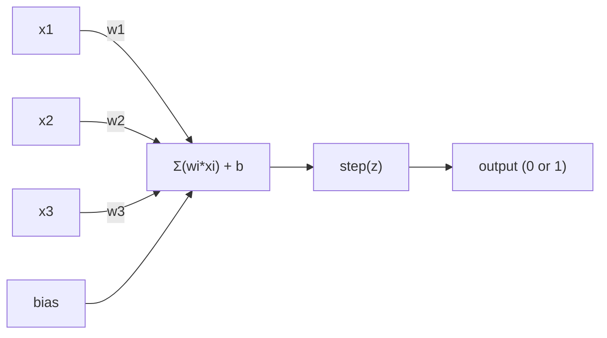
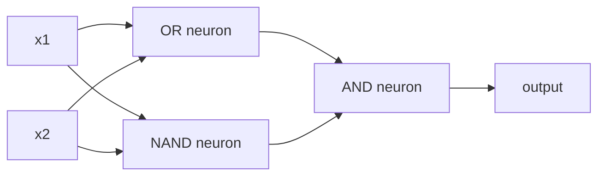

# パーセプトロン

> パーセプトロンはニューラルネットワークの原子です。中を開くと、重み、バイアス、そして意思決定があります。

**種類:** Build
**言語:** Python
**前提条件:** Phase 1 (Linear Algebra Intuition)
**所要時間:** 約60分

## 学習目標

- 重み更新ルールとステップ活性化関数を含むパーセプトロンを、Pythonでゼロから実装する
- 単一のパーセプトロンが線形分離可能な問題しか解けない理由を説明し、XORで失敗することを示す
- OR、NAND、ANDゲートを組み合わせて、XORを解く多層パーセプトロンを構成する
- sigmoid活性化関数とバックプロパゲーションを使った2層ネットワークを訓練し、XORを自動的に学習させる

## 問題

あなたはベクトルとドット積を知っています。行列が入力を出力へ変換することも知っています。では、機械はどの変換を使うべきかをどうやって*学習*するのでしょうか。

パーセプトロンはこの問いに答えます。これは考えられる限り最も単純な学習機械です。いくつかの入力を受け取り、重みを掛け、バイアスを足し、二値の判断を下します。そして調整します。それだけです。これまで作られてきたすべてのニューラルネットワークは、この考え方を層として積み重ねたものです。

パーセプトロンを理解することは、コードにおける「学習」が実際には何を意味するのかを理解することです。つまり、出力が現実と一致するまで数値を調整する、ということです。

## 概念

### 1つのニューロン、1つの判断

パーセプトロンはn個の入力を受け取り、それぞれに重みを掛けて合計し、バイアスを足して、その結果を活性化関数に通します。



ステップ関数は容赦がありません。重み付き和にバイアスを足した値が0以上なら1を出力し、それ以外なら0を出力します。

```
step(z) = 1  if z >= 0
           0  if z < 0
```

これは線形分類器です。重みとバイアスは、入力空間を2つの領域に分ける直線（高次元では超平面）を定義します。

### 決定境界

入力が2つの場合、パーセプトロンは2次元空間に直線を引きます。

```
  x2
  ┤
  │  Class 1        /
  │    (0)          /
  │                /
  │               / w1·x1 + w2·x2 + b = 0
  │              /
  │             /     Class 2
  │            /        (1)
  ┼───────────/──────────── x1
```

直線の片側にあるものはすべて0を出力します。反対側にあるものはすべて1を出力します。訓練では、この直線を動かしてクラスを正しく分離できるようにします。

### 学習ルール

パーセプトロンの学習ルールは単純です。

```
For each training example (x, y_true):
    y_pred = predict(x)
    error = y_true - y_pred

    For each weight:
        w_i = w_i + learning_rate * error * x_i
    bias = bias + learning_rate * error
```

予測が正しければ error = 0 なので、何も変わりません。0と予測したが本当は1である場合、重みは増えます。1と予測したが本当は0である場合、重みは減ります。learning rateは、それぞれの調整の大きさを制御します。

### XOR問題

ここで破綻が起きます。次の論理ゲートを見てください。

```
AND gate:           OR gate:            XOR gate:
x1  x2  out         x1  x2  out         x1  x2  out
0   0   0           0   0   0           0   0   0
0   1   0           0   1   1           0   1   1
1   0   0           1   0   1           1   0   1
1   1   1           1   1   1           1   1   0
```

ANDとORは線形分離可能です。0と1を分ける1本の直線を引けます。XORはそうではありません。[0,1] と [1,0] を、[0,0] と [1,1] から1本の直線で分けることはできません。

```
AND (separable):        XOR (not separable):

  x2                      x2
  1 ┤  0     1            1 ┤  1     0
    │     /                 │
  0 ┤  0 / 0              0 ┤  0     1
    ┼──/──────── x1         ┼──────────── x1
       line works!          no single line works!
```

これは根本的な限界です。単一のパーセプトロンが解けるのは線形分離可能な問題だけです。MinskyとPapertは1969年にこれを証明し、その後10年近くニューラルネットワーク研究は停滞しました。

解決策は、パーセプトロンを層として積み重ねることです。多層パーセプトロンは、2つの線形判断を組み合わせて非線形の判断を作ることでXORを解けます。

## 作ってみる

### Step 1: Perceptronクラス

```python
class Perceptron:
    def __init__(self, n_inputs, learning_rate=0.1):
        self.weights = [0.0] * n_inputs
        self.bias = 0.0
        self.lr = learning_rate

    def predict(self, inputs):
        total = sum(w * x for w, x in zip(self.weights, inputs))
        total += self.bias
        return 1 if total >= 0 else 0

    def train(self, training_data, epochs=100):
        for epoch in range(epochs):
            errors = 0
            for inputs, target in training_data:
                prediction = self.predict(inputs)
                error = target - prediction
                if error != 0:
                    errors += 1
                    for i in range(len(self.weights)):
                        self.weights[i] += self.lr * error * inputs[i]
                    self.bias += self.lr * error
            if errors == 0:
                print(f"Converged at epoch {epoch + 1}")
                return
        print(f"Did not converge after {epochs} epochs")
```

### Step 2: 論理ゲートで訓練する

```python
and_data = [
    ([0, 0], 0),
    ([0, 1], 0),
    ([1, 0], 0),
    ([1, 1], 1),
]

or_data = [
    ([0, 0], 0),
    ([0, 1], 1),
    ([1, 0], 1),
    ([1, 1], 1),
]

not_data = [
    ([0], 1),
    ([1], 0),
]

print("=== AND Gate ===")
p_and = Perceptron(2)
p_and.train(and_data)
for inputs, _ in and_data:
    print(f"  {inputs} -> {p_and.predict(inputs)}")

print("\n=== OR Gate ===")
p_or = Perceptron(2)
p_or.train(or_data)
for inputs, _ in or_data:
    print(f"  {inputs} -> {p_or.predict(inputs)}")

print("\n=== NOT Gate ===")
p_not = Perceptron(1)
p_not.train(not_data)
for inputs, _ in not_data:
    print(f"  {inputs} -> {p_not.predict(inputs)}")
```

### Step 3: XORが失敗する様子を見る

```python
xor_data = [
    ([0, 0], 0),
    ([0, 1], 1),
    ([1, 0], 1),
    ([1, 1], 0),
]

print("\n=== XOR Gate (single perceptron) ===")
p_xor = Perceptron(2)
p_xor.train(xor_data, epochs=1000)
for inputs, expected in xor_data:
    result = p_xor.predict(inputs)
    status = "OK" if result == expected else "WRONG"
    print(f"  {inputs} -> {result} (expected {expected}) {status}")
```

これは決して収束しません。単一のパーセプトロンがXORを学習できないことを示す、はっきりした証拠です。

### Step 4: 2層でXORを解く

コツは、XOR = (x1 OR x2) AND NOT (x1 AND x2) と分解することです。3つのパーセプトロンを組み合わせます。



```python
def xor_network(x1, x2):
    or_neuron = Perceptron(2)
    or_neuron.weights = [1.0, 1.0]
    or_neuron.bias = -0.5

    nand_neuron = Perceptron(2)
    nand_neuron.weights = [-1.0, -1.0]
    nand_neuron.bias = 1.5

    and_neuron = Perceptron(2)
    and_neuron.weights = [1.0, 1.0]
    and_neuron.bias = -1.5

    hidden1 = or_neuron.predict([x1, x2])
    hidden2 = nand_neuron.predict([x1, x2])
    output = and_neuron.predict([hidden1, hidden2])
    return output


print("\n=== XOR Gate (multi-layer network) ===")
for inputs, expected in xor_data:
    result = xor_network(inputs[0], inputs[1])
    print(f"  {inputs} -> {result} (expected {expected})")
```

4つのケースすべてが正しくなります。パーセプトロンを層として積み重ねると、単一のパーセプトロンでは作れない決定境界を作れます。

### Step 5: 2層ネットワークを訓練する

Step 4では重みを手で配線しました。XORではうまくいきますが、正しい重みが事前に分からない現実の問題では使えません。解決策は、ステップ関数をsigmoidに置き換え、バックプロパゲーションで重みを自動的に学習することです。

```python
class TwoLayerNetwork:
    def __init__(self, learning_rate=0.5):
        import random
        random.seed(0)
        self.w_hidden = [[random.uniform(-1, 1), random.uniform(-1, 1)] for _ in range(2)]
        self.b_hidden = [random.uniform(-1, 1), random.uniform(-1, 1)]
        self.w_output = [random.uniform(-1, 1), random.uniform(-1, 1)]
        self.b_output = random.uniform(-1, 1)
        self.lr = learning_rate

    def sigmoid(self, x):
        import math
        x = max(-500, min(500, x))
        return 1.0 / (1.0 + math.exp(-x))

    def forward(self, inputs):
        self.inputs = inputs
        self.hidden_outputs = []
        for i in range(2):
            z = sum(w * x for w, x in zip(self.w_hidden[i], inputs)) + self.b_hidden[i]
            self.hidden_outputs.append(self.sigmoid(z))
        z_out = sum(w * h for w, h in zip(self.w_output, self.hidden_outputs)) + self.b_output
        self.output = self.sigmoid(z_out)
        return self.output

    def train(self, training_data, epochs=10000):
        for epoch in range(epochs):
            total_error = 0
            for inputs, target in training_data:
                output = self.forward(inputs)
                error = target - output
                total_error += error ** 2

                d_output = error * output * (1 - output)

                saved_w_output = self.w_output[:]
                hidden_deltas = []
                for i in range(2):
                    h = self.hidden_outputs[i]
                    hd = d_output * saved_w_output[i] * h * (1 - h)
                    hidden_deltas.append(hd)

                for i in range(2):
                    self.w_output[i] += self.lr * d_output * self.hidden_outputs[i]
                self.b_output += self.lr * d_output

                for i in range(2):
                    for j in range(len(inputs)):
                        self.w_hidden[i][j] += self.lr * hidden_deltas[i] * inputs[j]
                    self.b_hidden[i] += self.lr * hidden_deltas[i]
```

```python
net = TwoLayerNetwork(learning_rate=2.0)
net.train(xor_data, epochs=10000)
for inputs, expected in xor_data:
    result = net.forward(inputs)
    predicted = 1 if result >= 0.5 else 0
    print(f"  {inputs} -> {result:.4f} (rounded: {predicted}, expected {expected})")
```

Step 4との大きな違いは2つあります。第一に、ステップ関数がsigmoidに置き換わっています。sigmoidは滑らかなので勾配が存在します。第二に、`train`メソッドは誤差を出力層から隠れ層へ逆向きに伝え、各重みが誤差にどれだけ寄与したかに比例して調整します。これが20行で書いたバックプロパゲーションです。

これはLesson 03への橋渡しです。`d_output` と `hidden_deltas` の背後にある数学は、ネットワークのグラフに連鎖律を適用したものです。そこであらためてきちんと導出します。

## 使ってみる

ここまでゼロから作ったものは、1つのimportで使えます。

```python
from sklearn.linear_model import Perceptron as SkPerceptron
import numpy as np

X = np.array([[0,0],[0,1],[1,0],[1,1]])
y = np.array([0, 0, 0, 1])

clf = SkPerceptron(max_iter=100, tol=1e-3)
clf.fit(X, y)
print([clf.predict([x])[0] for x in X])
```

5行です。あなたの30行の `Perceptron` クラスも同じことをしています。sklearn版には収束チェック、複数の損失関数、疎な入力のサポートが追加されていますが、中心のループは同じです。重み付き和、ステップ関数、誤差に応じた重み更新です。

本当の差はスケールで現れます。本番のネットワークで変わることは次の通りです。

- ステップ関数はsigmoid、ReLU、その他の滑らかな活性化関数になる
- 重みはバックプロパゲーションで自動的に学習される（Lesson 03）
- 層はより深くなる。3層、10層、100層以上
- 原理は同じまま。各層は前の層の出力から新しい特徴を作る

単一のパーセプトロンが引けるのは直線だけです。積み重ねれば、どんな形でも描けます。

## 成果物

このレッスンでは次を作ります。
- `outputs/skill-perceptron.md` - 単層アーキテクチャと多層アーキテクチャがそれぞれ必要になる場面を扱うスキル

## 演習

1. NANDゲート（万能ゲート。どんな論理回路もNANDから作れます）でパーセプトロンを訓練してください。その重みとバイアスが有効な決定境界を作っていることを確認しましょう。
2. 各epochで決定境界（w1*x1 + w2*x2 + b = 0）を追跡するようにPerceptronクラスを変更してください。ANDゲートで訓練している間に直線がどう移動するかを出力しましょう。
3. 3入力のうち少なくとも2つが1のときだけ1を出力する3入力パーセプトロン（多数決関数）を作ってください。これは線形分離可能ですか。なぜですか。

## 重要用語

| 用語 | よくある言い方 | 実際の意味 |
|------|----------------|------------|
| パーセプトロン | 「人工ニューロン」 | 入力と重みのドット積にバイアスを足し、ステップ関数に通す線形分類器 |
| 重み | 「入力の重要度」 | 各入力が判断に与える寄与を拡大または縮小する乗数 |
| バイアス | 「しきい値」 | 決定境界をずらす定数。入力がすべて0でもパーセプトロンを発火させられる |
| 活性化関数 | 「値を押しつぶすもの」 | 重み付き和の後に適用する関数。パーセプトロンではステップ関数、現代のネットワークではsigmoidやReLU |
| 線形分離可能 | 「間に線を引ける」 | 1つの超平面でクラスを完全に分けられるデータセット |
| XOR問題 | 「パーセプトロンができないこと」 | 単層ネットワークが非線形分離可能な関数を学習できないことの証明 |
| 決定境界 | 「分類器が切り替わる場所」 | 入力空間を2つのクラスに分ける超平面 w*x + b = 0 |
| 多層パーセプトロン | 「本物のニューラルネットワーク」 | パーセプトロンを層として積み重ね、各層の出力を次の層の入力にする構造 |

## 参考資料

- Frank Rosenblatt, "The Perceptron: A Probabilistic Model for Information Storage and Organization in the Brain" (1958) -- すべての出発点になった原論文
- Minsky & Papert, "Perceptrons" (1969) -- XORが単層ネットワークでは解けないことを証明し、パーセプトロン研究を10年停滞させた本
- Michael Nielsen, "Neural Networks and Deep Learning", Chapter 1 (http://neuralnetworksanddeeplearning.com/) -- 無料で読めるオンライン資料。パーセプトロンがネットワークへ合成される仕組みの視覚的な説明として最良の一つ
