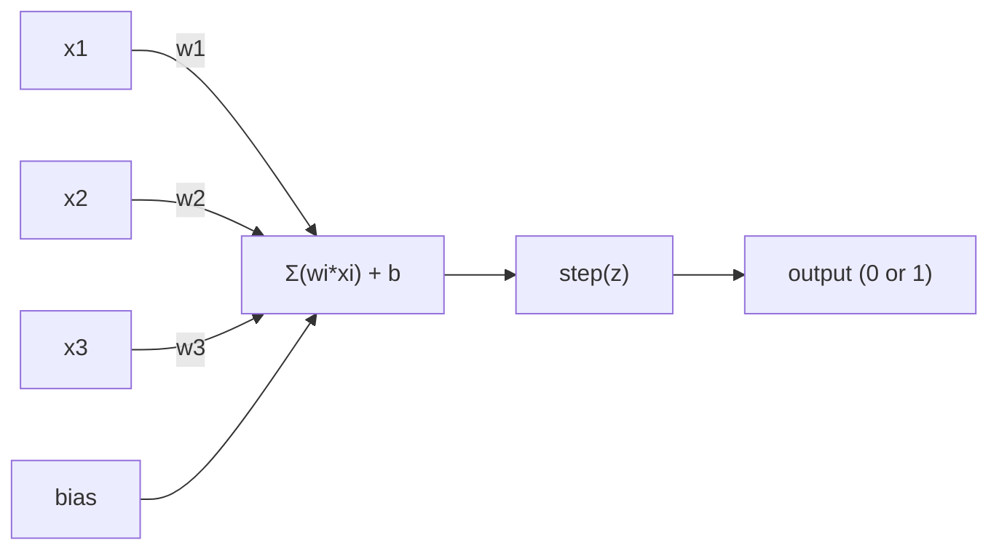
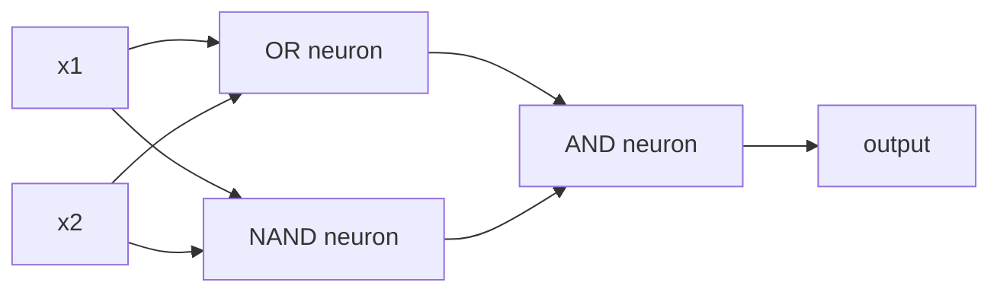

# Perceptron

> Perceptron neural network'lerin atomudur. Onu açtığınızda ağırlıklar, bir önyargı ve bir karar bulacaksınız.

**Tür:** Yapım
**Diller:** Python
**Önkoşullar:** Aşama 1 (Doğrusal Cebir Sezgisi)
**Süre:** ~60 dakika

## Öğrenme Hedefleri

- Ağırlık güncelleme kuralı ve adım aktivasyon fonksiyonu da dahil olmak üzere Python'da sıfırdan bir algılayıcı uygulayın
- Neden tek bir algılayıcının yalnızca doğrusal olarak ayrılabilir problemleri çözebildiğini açıklayın ve XOR arıza durumunu gösterin
- XOR'u çözmek için OR, NAND ve AND kapılarını birleştirerek çok katmanlı bir algılayıcı oluşturun
- XOR'u otomatik olarak öğrenmek için sigmoid aktivasyonu ve backpropagation ile iki katmanlı bir ağ eğitin

## Sorun

Vektörleri ve nokta çarpımlarını biliyorsunuz. Bir matrisin girdileri çıktılara dönüştürdüğünü biliyorsunuz. Peki bir makine hangi dönüşümü kullanacağını nasıl *öğrenir*?

Perceptron buna cevap verir. Mümkün olan en basit öğrenme makinesidir: bazı girdileri alın, ağırlıklarla çarpın, bir önyargı ekleyin ve ikili bir karar verin. Sonra ayarlayın. İşte bu. Şimdiye kadar inşa edilen her neural network, bu fikrin bir araya getirilmiş katmanlarından oluşur.

Algılayıcıyı anlamak, "öğrenmenin" aslında kodda ne anlama geldiğini anlamak anlamına gelir: çıktı gerçeklikle eşleşene kadar sayıları ayarlamak.

## Konsept

### Bir Nöron, Tek Karar

Bir algılayıcı n girdi alır, her birini bir ağırlıkla çarpar, bunları toplar, bir sapma ekler ve sonucu bir aktivasyon fonksiyonundan geçirir.



Adım fonksiyonu acımasızdır: eğer ağırlıklı toplam artı sapma >= 0 ise çıktı 1. Aksi takdirde çıktı 0 olur.

```
step(z) = 1  if z >= 0
           0  if z < 0
```

Bu doğrusal bir sınıflandırıcıdır. Ağırlıklar ve önyargı, giriş alanını iki bölgeye bölen bir çizgiyi (veya daha yüksek boyutlarda hiperdüzlemi) tanımlar.

### Karar Sınırı

İki giriş için algılayıcı 2 boyutlu uzaya bir çizgi çizer:

```
  x2
  ┤
  │  Class 1        /
  │    (0)          /
  │                /
  │               / w1·x1 + w2·x2 + b = 0
  │              /
  │             /     Class 2
  │            /        (1)
  ┼───────────/──────────── x1
```

Çizginin bir tarafındaki her şey 0 çıktısı verir. Diğer taraftaki her şey 1 çıktısı verir. Eğitim, sınıfları doğru şekilde ayırana kadar bu satırı hareket ettirir.

### Öğrenme Kuralı

Perceptron öğrenme kuralı basittir:

```
For each training example (x, y_true):
    y_pred = predict(x)
    error = y_true - y_pred

    For each weight:
        w_i = w_i + learning_rate * error * x_i
    bias = bias + learning_rate * error
```

Tahmin doğruysa hata = 0, hiçbir şey değişmez. 0 öngörülüyor ancak 1 olması gerekiyorsa ağırlıklar artıyor. Eğer 1 öngörüyorsa ancak 0 olması gerekiyorsa ağırlıklar azalır. Öğrenme oranı, her ayarlamanın ne kadar büyük olduğunu kontrol eder.

### XOR Sorunu

İşte burada kırılıyor. Şu mantık kapılarına bakın:

```
AND gate:           OR gate:            XOR gate:
x1  x2  out         x1  x2  out         x1  x2  out
0   0   0           0   0   0           0   0   0
0   1   0           0   1   1           0   1   1
1   0   0           1   0   1           1   0   1
1   1   1           1   1   1           1   1   0
```

VE ve VEYA doğrusal olarak ayrılabilir: 0'ları 1'lerden ayırmak için tek bir çizgi çizebilirsiniz. XOR değil. Hiçbir tek satır [0,1] ve [1,0]'ı [0,0] ve [1,1]'den ayıramaz.

```
AND (separable):        XOR (not separable):

  x2                      x2
  1 ┤  0     1            1 ┤  1     0
    │     /                 │
  0 ┤  0 / 0              0 ┤  0     1
    ┼──/──────── x1         ┼──────────── x1
       line works!          no single line works!
```

Bu temel bir sınırdır. Tek bir algılayıcı yalnızca doğrusal olarak ayrılabilen problemleri çözebilir. Minsky ve Papert bunu 1969'da kanıtladılar ve bu durum on yıl boyunca neredeyse neural network araştırmalarını öldürüyordu.

Çözüm: algılayıcıları katmanlara istiflemek. Çok katmanlı bir algılayıcı, iki doğrusal kararı doğrusal olmayan bir kararla birleştirerek XOR'u çözebilir.

```figure
perceptron-boundary
```

## İnşa Et

### Adım 1: Perceptron sınıfı

```python
class Perceptron:
    def __init__(self, n_inputs, learning_rate=0.1):
        self.weights = [0.0] * n_inputs
        self.bias = 0.0
        self.lr = learning_rate

    def predict(self, inputs):
        total = sum(w * x for w, x in zip(self.weights, inputs))
        total += self.bias
        return 1 if total >= 0 else 0

    def train(self, training_data, epochs=100):
        for epoch in range(epochs):
            errors = 0
            for inputs, target in training_data:
                prediction = self.predict(inputs)
                error = target - prediction
                if error != 0:
                    errors += 1
                    for i in range(len(self.weights)):
                        self.weights[i] += self.lr * error * inputs[i]
                    self.bias += self.lr * error
            if errors == 0:
                print(f"Converged at epoch {epoch + 1}")
                return
        print(f"Did not converge after {epochs} epochs")
```

### Adım 2: Mantık kapıları üzerinde eğitim alın

```python
and_data = [
    ([0, 0], 0),
    ([0, 1], 0),
    ([1, 0], 0),
    ([1, 1], 1),
]

or_data = [
    ([0, 0], 0),
    ([0, 1], 1),
    ([1, 0], 1),
    ([1, 1], 1),
]

not_data = [
    ([0], 1),
    ([1], 0),
]

print("=== AND Gate ===")
p_and = Perceptron(2)
p_and.train(and_data)
for inputs, _ in and_data:
    print(f"  {inputs} -> {p_and.predict(inputs)}")

print("\n=== OR Gate ===")
p_or = Perceptron(2)
p_or.train(or_data)
for inputs, _ in or_data:
    print(f"  {inputs} -> {p_or.predict(inputs)}")

print("\n=== NOT Gate ===")
p_not = Perceptron(1)
p_not.train(not_data)
for inputs, _ in not_data:
    print(f"  {inputs} -> {p_not.predict(inputs)}")
```

### Adım 3: XOR başarısızlığını izleyin

```python
xor_data = [
    ([0, 0], 0),
    ([0, 1], 1),
    ([1, 0], 1),
    ([1, 1], 0),
]

print("\n=== XOR Gate (single perceptron) ===")
p_xor = Perceptron(2)
p_xor.train(xor_data, epochs=1000)
for inputs, expected in xor_data:
    result = p_xor.predict(inputs)
    status = "OK" if result == expected else "WRONG"
    print(f"  {inputs} -> {result} (expected {expected}) {status}")
```

Asla birleşmeyecek. Bu, tek bir algılayıcının XOR'u öğrenemeyeceğinin kesin kanıtıdır.

### Adım 4: XOR'u iki katmanla çözün

İşin püf noktası: XOR = (x1 VEYA x2) VE DEĞİL (x1 VE x2). Üç algılayıcıyı birleştirin:



```python
def xor_network(x1, x2):
    or_neuron = Perceptron(2)
    or_neuron.weights = [1.0, 1.0]
    or_neuron.bias = -0.5

    nand_neuron = Perceptron(2)
    nand_neuron.weights = [-1.0, -1.0]
    nand_neuron.bias = 1.5

    and_neuron = Perceptron(2)
    and_neuron.weights = [1.0, 1.0]
    and_neuron.bias = -1.5

    hidden1 = or_neuron.predict([x1, x2])
    hidden2 = nand_neuron.predict([x1, x2])
    output = and_neuron.predict([hidden1, hidden2])
    return output


print("\n=== XOR Gate (multi-layer network) ===")
for inputs, expected in xor_data:
    result = xor_network(inputs[0], inputs[1])
    print(f"  {inputs} -> {result} (expected {expected})")
```

Dört durumun tamamı doğrudur. Algılayıcıları katmanlar halinde istiflemek, hiçbir algılayıcının tek başına üretemeyeceği karar sınırları oluşturur.

### Adım 5: İki Katmanlı Bir Ağı Eğitin

Adım 4 ağırlıkları elle bağlayın. Bu, XOR için işe yarar, ancak doğru ağırlıkları önceden bilmediğiniz gerçek problemler için geçerli değildir. Çözüm: adım fonksiyonunu sigmoid ile değiştirin ve ağırlıkları backpropagation aracılığıyla otomatik olarak öğrenin.

```python
class TwoLayerNetwork:
    def __init__(self, learning_rate=0.5):
        import random
        random.seed(0)
        self.w_hidden = [[random.uniform(-1, 1), random.uniform(-1, 1)] for _ in range(2)]
        self.b_hidden = [random.uniform(-1, 1), random.uniform(-1, 1)]
        self.w_output = [random.uniform(-1, 1), random.uniform(-1, 1)]
        self.b_output = random.uniform(-1, 1)
        self.lr = learning_rate

    def sigmoid(self, x):
        import math
        x = max(-500, min(500, x))
        return 1.0 / (1.0 + math.exp(-x))

    def forward(self, inputs):
        self.inputs = inputs
        self.hidden_outputs = []
        for i in range(2):
            z = sum(w * x for w, x in zip(self.w_hidden[i], inputs)) + self.b_hidden[i]
            self.hidden_outputs.append(self.sigmoid(z))
        z_out = sum(w * h for w, h in zip(self.w_output, self.hidden_outputs)) + self.b_output
        self.output = self.sigmoid(z_out)
        return self.output

    def train(self, training_data, epochs=10000):
        for epoch in range(epochs):
            total_error = 0
            for inputs, target in training_data:
                output = self.forward(inputs)
                error = target - output
                total_error += error ** 2

                d_output = error * output * (1 - output)

                saved_w_output = self.w_output[:]
                hidden_deltas = []
                for i in range(2):
                    h = self.hidden_outputs[i]
                    hd = d_output * saved_w_output[i] * h * (1 - h)
                    hidden_deltas.append(hd)

                for i in range(2):
                    self.w_output[i] += self.lr * d_output * self.hidden_outputs[i]
                self.b_output += self.lr * d_output

                for i in range(2):
                    for j in range(len(inputs)):
                        self.w_hidden[i][j] += self.lr * hidden_deltas[i] * inputs[j]
                    self.b_hidden[i] += self.lr * hidden_deltas[i]
```

```python
net = TwoLayerNetwork(learning_rate=2.0)
net.train(xor_data, epochs=10000)
for inputs, expected in xor_data:
    result = net.forward(inputs)
    predicted = 1 if result >= 0.5 else 0
    print(f"  {inputs} -> {result:.4f} (rounded: {predicted}, expected {expected})")
```

Adım 4'ten iki temel fark. Birincisi, sigmoid adım fonksiyonunun yerini alır; pürüzsüzdür, dolayısıyla gradient'ler mevcuttur. İkincisi, `train` yöntemi, her ağırlığı hataya olan katkısıyla orantılı olarak ayarlayarak hatayı çıktıdan gizli katmana doğru geriye doğru yayar. Bu 20 satırda backpropagation'dir.

Bu, Ders 03'e giden köprüdür. `d_output` ve `hidden_deltas`'nin arkasındaki matematik, ağ grafiğine uygulanan zincir kuralıdır. Oradan doğru şekilde çıkaracağız.

## Kullan onu

Sıfırdan oluşturduğunuz her şey tek bir içe aktarma işleminde mevcuttur:

```python
from sklearn.linear_model import Perceptron as SkPerceptron
import numpy as np

X = np.array([[0,0],[0,1],[1,0],[1,1]])
y = np.array([0, 0, 0, 1])

clf = SkPerceptron(max_iter=100, tol=1e-3)
clf.fit(X, y)
print([clf.predict([x])[0] for x in X])
```

Beş satır. 30 satırlık `Perceptron` sınıfınız da aynı şeyi yapıyor. Sklearn sürümü yakınsama kontrolleri, birden fazla loss function ve seyrek giriş desteği ekler - ancak çekirdek döngü aynıdır: ağırlıklı toplam, adım işlevi, hata durumunda ağırlık güncellemesi.

Gerçek boşluk ölçekte ortaya çıkıyor. Üretim ağlarında neler değişiyor:

- Adım işlevi sigmoid, ReLU veya diğer yumuşak aktivasyonlara dönüşür
- Ağırlıklar backpropagation aracılığıyla otomatik olarak öğrenilir (Ders 03)
- Katmanlar derinleşiyor: 3, 10, 100+ katman
- Aynı prensip geçerlidir: her katman önceki katmanın çıktılarından yeni özellikler oluşturur

Tek bir algılayıcı yalnızca düz çizgiler çizebilir. Bunları istifleyin ve istediğiniz şekli çizebilirsiniz.

## Gönderin

Bu ders şunları üretir:
- `outputs/skill-perceptron.md` - tek katmanlı ve çok katmanlı mimarilerin gerekli olduğu durumları kapsayan bir beceri

## Egzersizler

1. Bir NAND geçidi (evrensel geçit - NAND'dan herhangi bir mantık devresi oluşturulabilir) üzerinde bir algılayıcı eğitin. Ağırlıklarının ve önyargısının geçerli bir karar sınırı oluşturduğunu doğrulayın.
2. Her dönemde karar sınırını (w1*x1 + w2*x2 + b = 0) izlemek için Perceptron sınıfını değiştirin. AND geçidindeki eğitim sırasında çizginin nasıl değiştiğini yazdırın.
3. Yalnızca 3 girişten en az 2'si 1 olduğunda (çoğunluk oyu işlevi) 1 çıktısı veren 3 girişli bir algılayıcı oluşturun. Bu doğrusal olarak ayrılabilir mi? Neden?

## Anahtar Terimler

| Dönem | İnsanlar ne diyor | Aslında ne anlama geliyor |
|------|----------------|----------------------|
| Algılayıcı | "Sahte bir nöron" | Doğrusal bir sınıflandırıcı: bir adım fonksiyonu aracılığıyla girdiler ve ağırlıkların nokta çarpımı artı önyargı |
| Ağırlık | "Bir girdi ne kadar önemlidir" | Her girdinin karara katkısını ölçeklendiren bir çarpan |
| Önyargı | "Eşik" | Karar sınırını değiştiren, algılayıcının sıfır girişle bile ateşlenmesini sağlayan bir sabit |
| Etkinleştirme işlevi | "Değerleri ezen şey" | Ağırlıklandırılmış toplamdan sonra uygulanan bir işlev - algılayıcılar için adım işlevi, modern ağlar için sigmoid/ReLU |
| Doğrusal olarak ayrılabilir | "Aralarına bir çizgi çekebilirsiniz" | Tek bir hiperdüzlemin sınıfları mükemmel şekilde ayırabildiği bir dataset |
| XOR sorunu | "Algılayıcıların yapamayacağı şey" | Tek Katmanlı Ağların Doğrusal Olarak Ayrılamayan Fonksiyonları Öğrenemediğinin Kanıtı |
| Karar sınırı | "Sınıflandırıcının değiştiği yer" | Giriş uzayını iki sınıfa bölen hiperdüzlem w*x + b = 0 |
| Çok katmanlı algılayıcı | "Gerçek bir neural network" | Her katmanın çıktısının bir sonraki katmanın girişini beslediği katmanlar halinde yığılmış algılayıcılar |

## Daha Fazla Okuma

- Frank Rosenblatt, "Perceptron: Beyinde Bilgi Depolama ve Organizasyon için Olasılıksal Bir Model" (1958) -- her şeyi başlatan orijinal makale
- Minsky & Papert, "Perceptrons" (1969) -- XOR'un tek katmanlı ağlar tarafından çözülemeyeceğini kanıtlayan ve on yıl boyunca algılayıcı araştırmalarını sonlandıran kitap
- Michael Nielsen, "Neural Networks ve Deep Learning", Bölüm 1 (http://neuralnetworksanddeeplearning.com/) -- ücretsiz çevrimiçi, algılayıcıların ağlarda nasıl oluşturulduğuna dair en iyi görsel açıklama
