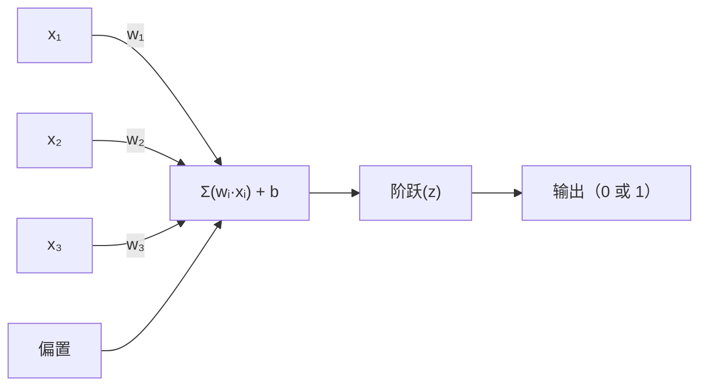
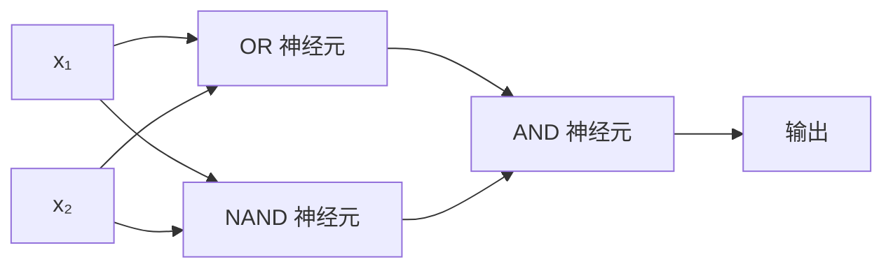

# 感知器（Perceptron）

> 感知器是神经网络的原子。打开它，你会发现权重、偏置和一个决策。

**类型：** 构建
**语言：** Python
**前置知识：** 阶段 1（线性代数直觉）
**时长：** ~60 分钟

## 学习目标

- 用 Python 从零实现一个感知器，包括权重更新规则和阶跃激活函数
- 解释为什么单个感知器只能解决线性可分问题，并展示 XOR 失败案例
- 通过组合 OR、NAND 和 AND 门来构建多层感知器，以解决 XOR 问题
- 使用 Sigmoid 激活和反向传播（Backpropagation）训练一个两层网络，自动学习 XOR

## 问题

你了解向量和点积。你知道矩阵将输入转换为输出。但机器如何*学习*使用哪种转换？

感知器回答了这个问题。它是最简单的学习机器：接收一些输入，乘以权重，加上偏置，然后做出二元决策。接着调整。仅此而已。所有构建的神经网络都是这种思想堆叠而成的层。

理解感知器意味着理解"学习"在代码中的实际含义：调整数字直到输出与真实情况一致。

## 概念

### 一个神经元，一个决策

感知器接收 n 个输入，每个乘以权重，求和，加上偏置，然后通过激活函数传递结果。



阶跃函数是残酷的：如果加权和加偏置 >= 0，输出 1；否则输出 0。

```
step(z) = 1（如果 z >= 0）
           0（如果 z < 0）
```

这是一个线性分类器。权重和偏置定义了一条线（或高维空间中的超平面），将输入空间分割成两个区域。

### 决策边界

对于两个输入，感知器在二维空间中绘制一条线：

```
  x₂
  ┤
  │  类别 1       /
  │    (0)         /
  │                /
  │               / w₁·x₁ + w₂·x₂ + b = 0
  │              /
  │             /     类别 2
  │            /        (1)
  ┼───────────/──────────── x₁
```

线一侧的所有内容输出 0，另一侧的所有内容输出 1。训练会移动这条线，直到它正确分隔类别。

### 学习规则

感知器学习规则很简单：

```
对于每个训练样本 (x, y_true)：
    y_pred = predict(x)
    error = y_true - y_pred

    对于每个权重：
        wᵢ = wᵢ + learning_rate * error * xᵢ
    bias = bias + learning_rate * error
```

如果预测正确，error = 0，不变。如果预测为 0 但应为 1，权重增加。如果预测为 1 但应为 0，权重减小。学习率控制每次调整的大小。

### XOR 问题

这就是它失效的地方。看看这些逻辑门：

```
AND 门：        OR 门：            XOR 门：
x₁  x₂  out    x₁  x₂  out      x₁  x₂  out
0   0   0      0   0   0        0   0   0
0   1   0      0   1   1        0   1   1
1   0   0      1   0   1        1   0   1
1   1   1      1   1   1        1   1   0
```

AND 和 OR 是线性可分的：你可以画一条线来分隔 0 和 1。XOR 则不是。没有一条线可以同时将 [0,1] 和 [1,0] 与 [0,0] 和 [1,1] 分开。

```
AND（可分）：        XOR（不可分）：

  x₂                      x₂
  1 ┤  0     1           1 ┤  1     0
    │     /                 │
  0 ┤  0 / 0              0 ┤  0     1
    ┼──/──────── x₁        ┼──────────── x₁
       线有效！               没有单条线有效！
```

这是一个根本性的限制。单个感知器只能解决线性可分问题。Minsky 和 Papert 在 1969 年证明了这一点，并且几乎扼杀了神经网络研究十年。

解决方法：将感知器堆叠成层。多层感知器通过组合两个线性决策形成一个非线性决策来解决 XOR。

## 构建它

### 步骤 1：感知器类

```python
class Perceptron:
    def __init__(self, n_inputs, learning_rate=0.1):
        self.weights = [0.0] * n_inputs
        self.bias = 0.0
        self.lr = learning_rate

    def predict(self, inputs):
        total = sum(w * x for w, x in zip(self.weights, inputs))
        total += self.bias
        return 1 if total >= 0 else 0

    def train(self, training_data, epochs=100):
        for epoch in range(epochs):
            errors = 0
            for inputs, target in training_data:
                prediction = self.predict(inputs)
                error = target - prediction
                if error != 0:
                    errors += 1
                    for i in range(len(self.weights)):
                        self.weights[i] += self.lr * error * inputs[i]
                    self.bias += self.lr * error
            if errors == 0:
                print(f"Converged at epoch {epoch + 1}")  # 在第 {epoch + 1} 轮收敛
                return
        print(f"Did not converge after {epochs} epochs")  # 经过 {epochs} 轮后未收敛
```

### 步骤 2：在逻辑门上训练

```python
and_data = [
    ([0, 0], 0),
    ([0, 1], 0),
    ([1, 0], 0),
    ([1, 1], 1),
]

or_data = [
    ([0, 0], 0),
    ([0, 1], 1),
    ([1, 0], 1),
    ([1, 1], 1),
]

not_data = [
    ([0], 1),
    ([1], 0),
]

print("=== AND 门 ===")
p_and = Perceptron(2)
p_and.train(and_data)
for inputs, _ in and_data:
    print(f"  {inputs} -> {p_and.predict(inputs)}")

print("\n=== OR 门 ===")
p_or = Perceptron(2)
p_or.train(or_data)
for inputs, _ in or_data:
    print(f"  {inputs} -> {p_or.predict(inputs)}")

print("\n=== NOT 门 ===")
p_not = Perceptron(1)
p_not.train(not_data)
for inputs, _ in not_data:
    print(f"  {inputs} -> {p_not.predict(inputs)}")
```

### 步骤 3：观察 XOR 失败

```python
xor_data = [
    ([0, 0], 0),
    ([0, 1], 1),
    ([1, 0], 1),
    ([1, 1], 0),
]

print("\n=== XOR 门（单个感知器） ===")
p_xor = Perceptron(2)
p_xor.train(xor_data, epochs=1000)
for inputs, expected in xor_data:
    result = p_xor.predict(inputs)
    status = "OK" if result == expected else "错误"
    print(f"  {inputs} -> {result}（期望 {expected}）{status}")
```

它永远不会收敛。这是单个感知器无法学习 XOR 的硬证据。

### 步骤 4：用两层解决 XOR

诀窍：XOR = (x₁ OR x₂) AND NOT (x₁ AND x₂)。组合三个感知器：



```python
def xor_network(x1, x2):
    or_neuron = Perceptron(2)
    or_neuron.weights = [1.0, 1.0]
    or_neuron.bias = -0.5

    nand_neuron = Perceptron(2)
    nand_neuron.weights = [-1.0, -1.0]
    nand_neuron.bias = 1.5

    and_neuron = Perceptron(2)
    and_neuron.weights = [1.0, 1.0]
    and_neuron.bias = -1.5

    hidden1 = or_neuron.predict([x1, x2])
    hidden2 = nand_neuron.predict([x1, x2])
    output = and_neuron.predict([hidden1, hidden2])
    return output


print("\n=== XOR 门（多层网络） ===")
for inputs, expected in xor_data:
    result = xor_network(inputs[0], inputs[1])
    print(f"  {inputs} -> {result}（期望 {expected}）")
```

全部四个案例正确。将感知器堆叠成层产生了单个感知器无法产生的决策边界。

### 步骤 5：训练一个两层网络

步骤 4 手动设置了权重。这对于 XOR 有效，但对于你不知道正确权重的实际问题则不行。解决方法：用 Sigmoid 代替阶跃函数，并通过反向传播自动学习权重。

```python
class TwoLayerNetwork:
    def __init__(self, learning_rate=0.5):
        import random
        random.seed(0)
        self.w_hidden = [[random.uniform(-1, 1), random.uniform(-1, 1)] for _ in range(2)]
        self.b_hidden = [random.uniform(-1, 1), random.uniform(-1, 1)]
        self.w_output = [random.uniform(-1, 1), random.uniform(-1, 1)]
        self.b_output = random.uniform(-1, 1)
        self.lr = learning_rate

    def sigmoid(self, x):
        import math
        x = max(-500, min(500, x))
        return 1.0 / (1.0 + math.exp(-x))

    def forward(self, inputs):
        self.inputs = inputs
        self.hidden_outputs = []
        for i in range(2):
            z = sum(w * x for w, x in zip(self.w_hidden[i], inputs)) + self.b_hidden[i]
            self.hidden_outputs.append(self.sigmoid(z))
        z_out = sum(w * h for w, h in zip(self.w_output, self.hidden_outputs)) + self.b_output
        self.output = self.sigmoid(z_out)
        return self.output

    def train(self, training_data, epochs=10000):
        for epoch in range(epochs):
            total_error = 0
            for inputs, target in training_data:
                output = self.forward(inputs)
                error = target - output
                total_error += error ** 2

                d_output = error * output * (1 - output)

                saved_w_output = self.w_output[:]
                hidden_deltas = []
                for i in range(2):
                    h = self.hidden_outputs[i]
                    hd = d_output * saved_w_output[i] * h * (1 - h)
                    hidden_deltas.append(hd)

                for i in range(2):
                    self.w_output[i] += self.lr * d_output * self.hidden_outputs[i]
                self.b_output += self.lr * d_output

                for i in range(2):
                    for j in range(len(inputs)):
                        self.w_hidden[i][j] += self.lr * hidden_deltas[i] * inputs[j]
                    self.b_hidden[i] += self.lr * hidden_deltas[i]
```

```python
net = TwoLayerNetwork(learning_rate=2.0)
net.train(xor_data, epochs=10000)
for inputs, expected in xor_data:
    result = net.forward(inputs)
    predicted = 1 if result >= 0.5 else 0
    print(f"  {inputs} -> {result:.4f}（取整：{predicted}，期望 {expected}）")
```

与步骤 4 有两个关键区别。首先，Sigmoid 取代了阶跃函数——它是平滑的，因此梯度存在。其次，`train` 方法将误差从输出层反向传播到隐藏层，根据每个权重对误差的贡献比例进行调整。这就是 20 行代码的反向传播。

这是通往课程 03 的桥梁。`d_output` 和 `hidden_deltas` 背后的数学是对网络图应用链式法则。我们将在那里进行适当推导。

## 使用它

你刚刚从零构建的所有内容都存在于一个导入中：

```python
from sklearn.linear_model import Perceptron as SkPerceptron
import numpy as np

X = np.array([[0,0],[0,1],[1,0],[1,1]])
y = np.array([0, 0, 0, 1])

clf = SkPerceptron(max_iter=100, tol=1e-3)
clf.fit(X, y)
print([clf.predict([x])[0] for x in X])
```

五行代码。你那个 30 行的 `Perceptron` 类做着同样的事情。scikit-learn 版本添加了收敛检查、多种损失函数和稀疏输入支持——但核心循环是相同的：加权和、阶跃函数、出错时权重更新。

