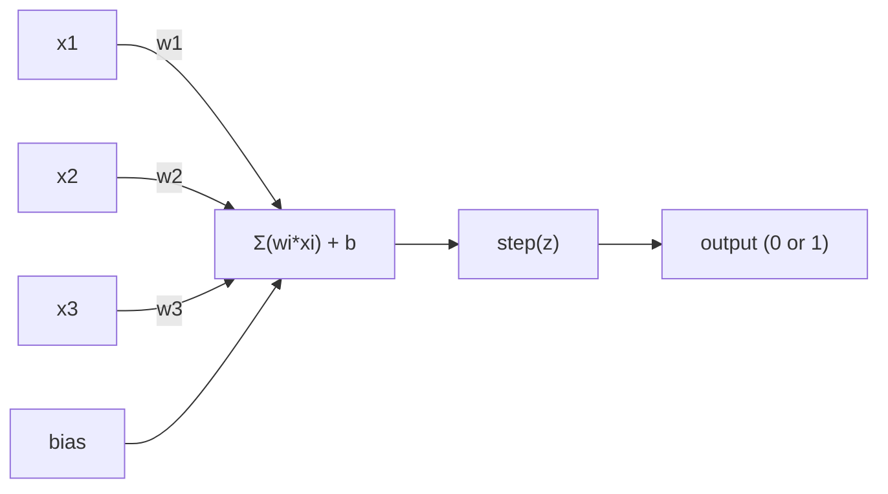
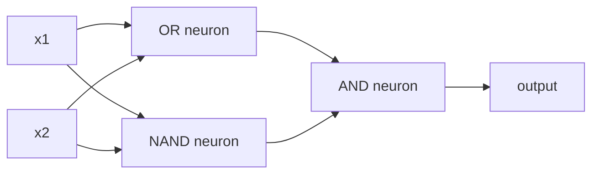

# 感知器

> 感知器是神经网络的原子。将其拆分，您会发现权重、偏见和决定。

** 类型：** 构建
** 语言：** Python
** 先决条件：** 第1阶段（线性代数直觉）
** 时间：** ~60分钟

## 学习目标

- 在Python中从头开始实现感知器，包括权重更新规则和步骤激活函数
- 解释为什么单个感知器只能解决线性可分问题并演示异或失败案例
- 通过组合或门、与非门和与门来解决异或问题来构建多层感知器
- 使用Sigmoid激活和反向传播训练两层网络以自动学习异或

## 问题

你知道载体和点积。您知道矩阵将输入转换为输出。但机器如何“学习”使用哪个转换呢？

感知器回答了这个问题。它是最简单的学习机器：获取一些输入，乘以权重，添加偏差，然后做出二元决策。然后调整。就是这样。每个神经网络都是这个想法的层层堆叠在一起的。

理解感知器意味着理解代码中“学习”的实际含义：调整数字，直到输出与现实相匹配。

## 概念

### 一个神经元，一个决定

感知器接受n个输入，将每个输入乘以权重，将它们相加，添加偏差，并将结果传递给激活函数。



阶跃函数很残酷：如果加权和加偏差>= 0，则输出1。否则，输出0。

```
step(z) = 1  if z >= 0
           0  if z < 0
```

这是一个线性分类器。权重和偏差定义了将输入空间分成两个区域的线（或更高维度的超平面）。

### 决策边界

对于两个输入，感知器在2D空间中画一条线：

```
  x2
  ┤
  │  Class 1        /
  │    (0)          /
  │                /
  │               / w1·x1 + w2·x2 + b = 0
  │              /
  │             /     Class 2
  │            /        (1)
  ┼───────────/──────────── x1
```

行一侧的所有内容都输出0。另一边的一切都输出1。训练会移动这条线，直到它正确地将班级分开。

### 学习规则

感知器学习规则很简单：

```
For each training example (x, y_true):
    y_pred = predict(x)
    error = y_true - y_pred

    For each weight:
        w_i = w_i + learning_rate * error * x_i
    bias = bias + learning_rate * error
```

如果预测正确，错误= 0，则不会发生任何变化。如果它预测0但应该是1，则权重增加。如果它预测1但应该是0，那么权重就会减少。学习率控制每次调整的幅度。

### 异或问题

这里是它断裂的地方。看看这些逻辑门：

```
AND gate:           OR gate:            XOR gate:
x1  x2  out         x1  x2  out         x1  x2  out
0   0   0           0   0   0           0   0   0
0   1   0           0   1   1           0   1   1
1   0   0           1   0   1           1   0   1
1   1   1           1   1   1           1   1   0
```

AND和OR可以线性分离：您可以画一条线来将0和1分开。异或不是。没有一行可以将[0，1]和[1，0]与[0，0]和[1，1]分开。

```
AND (separable):        XOR (not separable):

  x2                      x2
  1 ┤  0     1            1 ┤  1     0
    │     /                 │
  0 ┤  0 / 0              0 ┤  0     1
    ┼──/──────── x1         ┼──────────── x1
       line works!          no single line works!
```

这是一个基本限制。单个感知器只能解决线性可分的问题。明斯基和帕普特在1969年证明了这一点，十年来它几乎扼杀了神经网络研究。

修复方法：将感知器堆叠到层中。多层感知器可以通过将两个线性决策组合成非线性决策来解决异或。

## 建设党

### 第1步：Perceptron类

```python
class Perceptron:
    def __init__(self, n_inputs, learning_rate=0.1):
        self.weights = [0.0] * n_inputs
        self.bias = 0.0
        self.lr = learning_rate

    def predict(self, inputs):
        total = sum(w * x for w, x in zip(self.weights, inputs))
        total += self.bias
        return 1 if total >= 0 else 0

    def train(self, training_data, epochs=100):
        for epoch in range(epochs):
            errors = 0
            for inputs, target in training_data:
                prediction = self.predict(inputs)
                error = target - prediction
                if error != 0:
                    errors += 1
                    for i in range(len(self.weights)):
                        self.weights[i] += self.lr * error * inputs[i]
                    self.bias += self.lr * error
            if errors == 0:
                print(f"Converged at epoch {epoch + 1}")
                return
        print(f"Did not converge after {epochs} epochs")
```

### 第2步：逻辑门训练

```python
and_data = [
    ([0, 0], 0),
    ([0, 1], 0),
    ([1, 0], 0),
    ([1, 1], 1),
]

or_data = [
    ([0, 0], 0),
    ([0, 1], 1),
    ([1, 0], 1),
    ([1, 1], 1),
]

not_data = [
    ([0], 1),
    ([1], 0),
]

print("=== AND Gate ===")
p_and = Perceptron(2)
p_and.train(and_data)
for inputs, _ in and_data:
    print(f"  {inputs} -> {p_and.predict(inputs)}")

print("\n=== OR Gate ===")
p_or = Perceptron(2)
p_or.train(or_data)
for inputs, _ in or_data:
    print(f"  {inputs} -> {p_or.predict(inputs)}")

print("\n=== NOT Gate ===")
p_not = Perceptron(1)
p_not.train(not_data)
for inputs, _ in not_data:
    print(f"  {inputs} -> {p_not.predict(inputs)}")
```

### 第3步：观看异或失败

```python
xor_data = [
    ([0, 0], 0),
    ([0, 1], 1),
    ([1, 0], 1),
    ([1, 1], 0),
]

print("\n=== XOR Gate (single perceptron) ===")
p_xor = Perceptron(2)
p_xor.train(xor_data, epochs=1000)
for inputs, expected in xor_data:
    result = p_xor.predict(inputs)
    status = "OK" if result == expected else "WRONG"
    print(f"  {inputs} -> {result} (expected {expected}) {status}")
```

它永远不会收敛。这是单个感知器无法学习异或的确凿证据。

### 第4步：解决两层异或问题

技巧：异或=（x1 OR x2）且非（x1 AND x2）。结合三个感知器：



```python
def xor_network(x1, x2):
    or_neuron = Perceptron(2)
    or_neuron.weights = [1.0, 1.0]
    or_neuron.bias = -0.5

    nand_neuron = Perceptron(2)
    nand_neuron.weights = [-1.0, -1.0]
    nand_neuron.bias = 1.5

    and_neuron = Perceptron(2)
    and_neuron.weights = [1.0, 1.0]
    and_neuron.bias = -1.5

    hidden1 = or_neuron.predict([x1, x2])
    hidden2 = nand_neuron.predict([x1, x2])
    output = and_neuron.predict([hidden1, hidden2])
    return output


print("\n=== XOR Gate (multi-layer network) ===")
for inputs, expected in xor_data:
    result = xor_network(inputs[0], inputs[1])
    print(f"  {inputs} -> {result} (expected {expected})")
```

四种情况均正确。将感知器堆叠到层中会创建单个感知器无法产生的决策边界。

### 第5步：训练两层网络

第4步手工连接重物。这适用于异或，但不适用于您事先不知道正确权重的实际问题。修复方法：用Sigmoid替换步进函数，并通过反向传播自动学习权重。

```python
class TwoLayerNetwork:
    def __init__(self, learning_rate=0.5):
        import random
        random.seed(0)
        self.w_hidden = [[random.uniform(-1, 1), random.uniform(-1, 1)] for _ in range(2)]
        self.b_hidden = [random.uniform(-1, 1), random.uniform(-1, 1)]
        self.w_output = [random.uniform(-1, 1), random.uniform(-1, 1)]
        self.b_output = random.uniform(-1, 1)
        self.lr = learning_rate

    def sigmoid(self, x):
        import math
        x = max(-500, min(500, x))
        return 1.0 / (1.0 + math.exp(-x))

    def forward(self, inputs):
        self.inputs = inputs
        self.hidden_outputs = []
        for i in range(2):
            z = sum(w * x for w, x in zip(self.w_hidden[i], inputs)) + self.b_hidden[i]
            self.hidden_outputs.append(self.sigmoid(z))
        z_out = sum(w * h for w, h in zip(self.w_output, self.hidden_outputs)) + self.b_output
        self.output = self.sigmoid(z_out)
        return self.output

    def train(self, training_data, epochs=10000):
        for epoch in range(epochs):
            total_error = 0
            for inputs, target in training_data:
                output = self.forward(inputs)
                error = target - output
                total_error += error ** 2

                d_output = error * output * (1 - output)

                saved_w_output = self.w_output[:]
                hidden_deltas = []
                for i in range(2):
                    h = self.hidden_outputs[i]
                    hd = d_output * saved_w_output[i] * h * (1 - h)
                    hidden_deltas.append(hd)

                for i in range(2):
                    self.w_output[i] += self.lr * d_output * self.hidden_outputs[i]
                self.b_output += self.lr * d_output

                for i in range(2):
                    for j in range(len(inputs)):
                        self.w_hidden[i][j] += self.lr * hidden_deltas[i] * inputs[j]
                    self.b_hidden[i] += self.lr * hidden_deltas[i]
```

```python
net = TwoLayerNetwork(learning_rate=2.0)
net.train(xor_data, epochs=10000)
for inputs, expected in xor_data:
    result = net.forward(inputs)
    predicted = 1 if result >= 0.5 else 0
    print(f"  {inputs} -> {result:.4f} (rounded: {predicted}, expected {expected})")
```

与步骤4的两个关键区别。首先，Sigmoid取代了阶跃函数--它很光滑，因此存在梯度。其次，“训练”方法将误差从输出向后传播到隐藏层，根据其对误差的贡献成比例地调整每个权重。这是20行的反向传播。

这是通往03课的桥梁。' d_select '和' hidden_deltas '背后的数学是应用于网络图的连锁规则。我们将在那里正确地推导它。

## 使用它

您刚刚从头开始构建的所有内容都存在于一个导入中：

```python
from sklearn.linear_model import Perceptron as SkPerceptron
import numpy as np

X = np.array([[0,0],[0,1],[1,0],[1,1]])
y = np.array([0, 0, 0, 1])

clf = SkPerceptron(max_iter=100, tol=1e-3)
clf.fit(X, y)
print([clf.predict([x])[0] for x in X])
```

五行。您的30行“Perceptron”类也会做同样的事情。sklearn版本添加了收敛检查、多重损失函数和稀疏输入支持-但核心循环是相同的：加权和、阶跃函数、错误权重更新。

真正的差距体现在规模上。生产网络发生了哪些变化：

- 阶跃函数变为sigmoid、ReLU或其他平滑激活
- 通过反向传播自动学习权重（第03课）
- 层变得更深：3、10、100+层
- 同样的原则成立：每个层都从前一层的输出创建新要素

单个感知器只能画直线。将它们堆叠起来，您可以绘制任何形状。

## 把它运

本课产生：
- '输出/skill-perceptron.md '-涵盖何时需要单层架构与多层架构的技能

## 演习

1. 在与非门（通用门-任何逻辑电路都可以从与非构建）上训练感知器。验证其权重和偏差形成有效的决策边界。
2. 修改Perceptron类以跟踪每个历元的决策边界（w1*x1 + w2*x2 + b = 0）。在AND门上打印培训期间线路如何移动。
3. 构建一个3输入感知器，仅当3个输入中至少有2个为1时才输出1（多数投票功能）。这是线性可分的吗？为什么？

## 关键术语

| Term | 别人怎么说 | 它实际上意味着什么 |
|------|----------------|----------------------|
| 感知器 | “假神经元” | 线性分类器：输入和权重的点积加上偏差，通过阶跃函数 |
| 重量 | “投入有多重要” | 衡量每个输入对决策贡献的乘数 |
| 偏置 | “门槛” | 一个改变决策边界的常数，即使在零输入的情况下也让感知器启动 |
| 激活函数 | “压垮价值观的东西” | 感知器加权和步函数之后应用的函数，现代网络的sigmoid/ReLU |
| 线性可分 | “你可以在他们之间划清界限” | 一个数据集，其中单个超平面可以完美地分离类 |
| XOR问题 | “感知器做不到的事情” | 单层网络无法学习非线性可分函数的证明 |
| 决策边界 | “分类器在哪里切换” | 将输入空间分为两类的超平面w*x + b = 0 |
| 多层感知器 | “一个真正的神经网络” | 感知器分层堆叠，每个层的输出输入下一层的输入 |

## 进一步阅读

- 弗兰克·罗森布拉特（Frank Rosenblatt），“感知器：大脑中信息存储和组织的概率模型”（1958年）--开启这一切的原创论文
- Minsky & Papert，《Perceptrons》（1969）--这本书证明了单层网络无法解决异或问题，并扼杀了感知机研究十年
- Michael Nielsen，“神经网络和深度学习”，第1章（http：//neuralnetworksanddeeplearning.com/）--关于感知器如何组成网络的免费在线、最佳视觉解释
